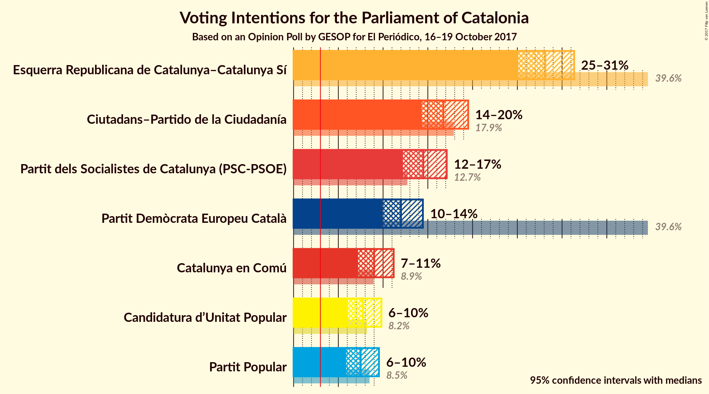
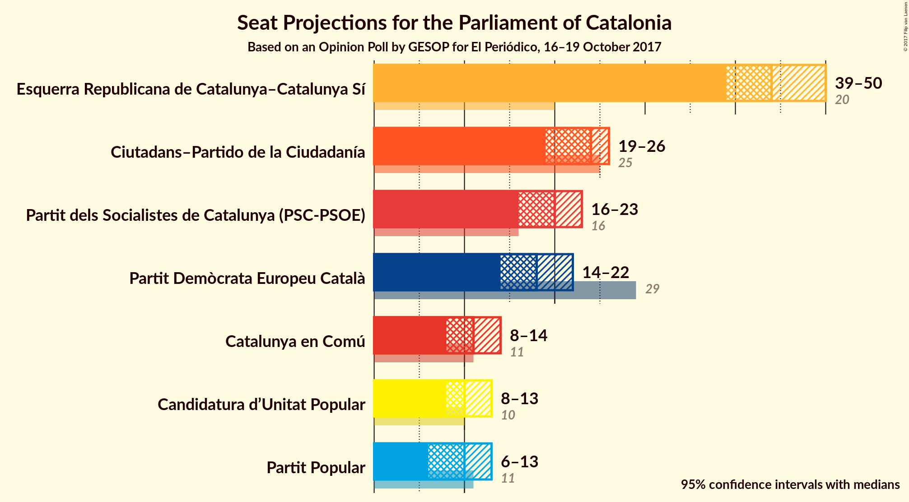
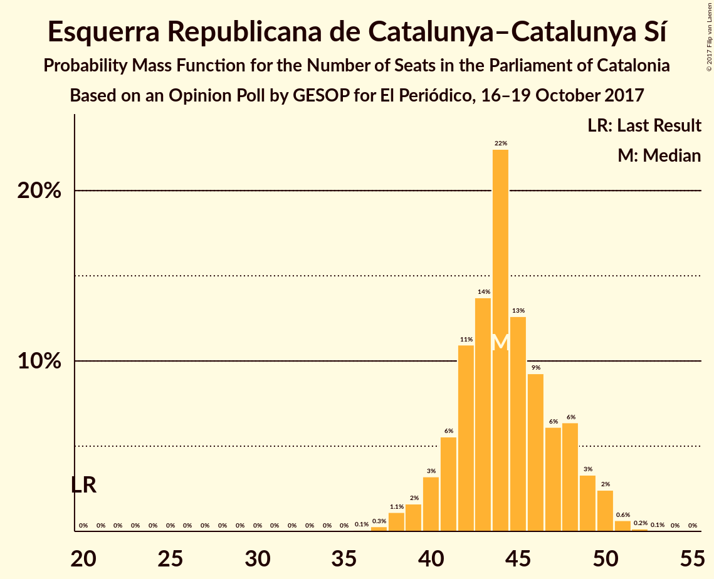
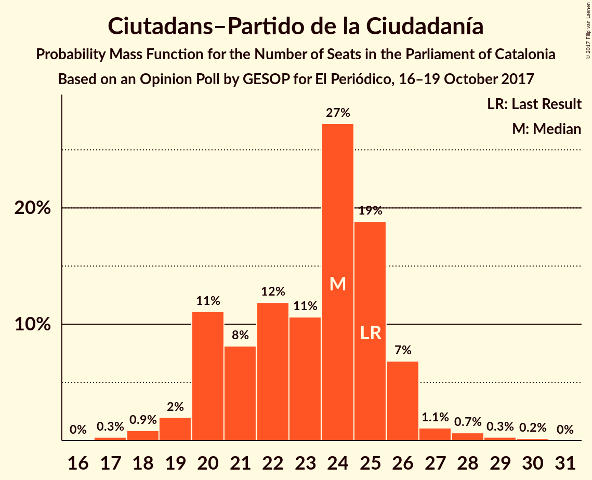
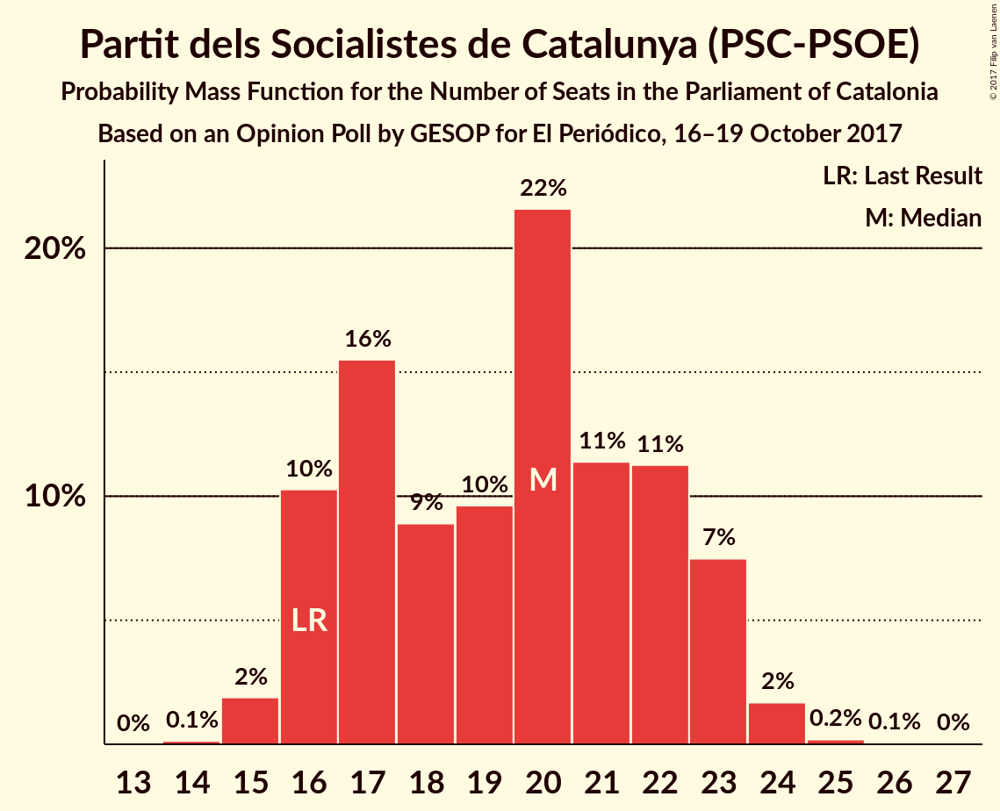
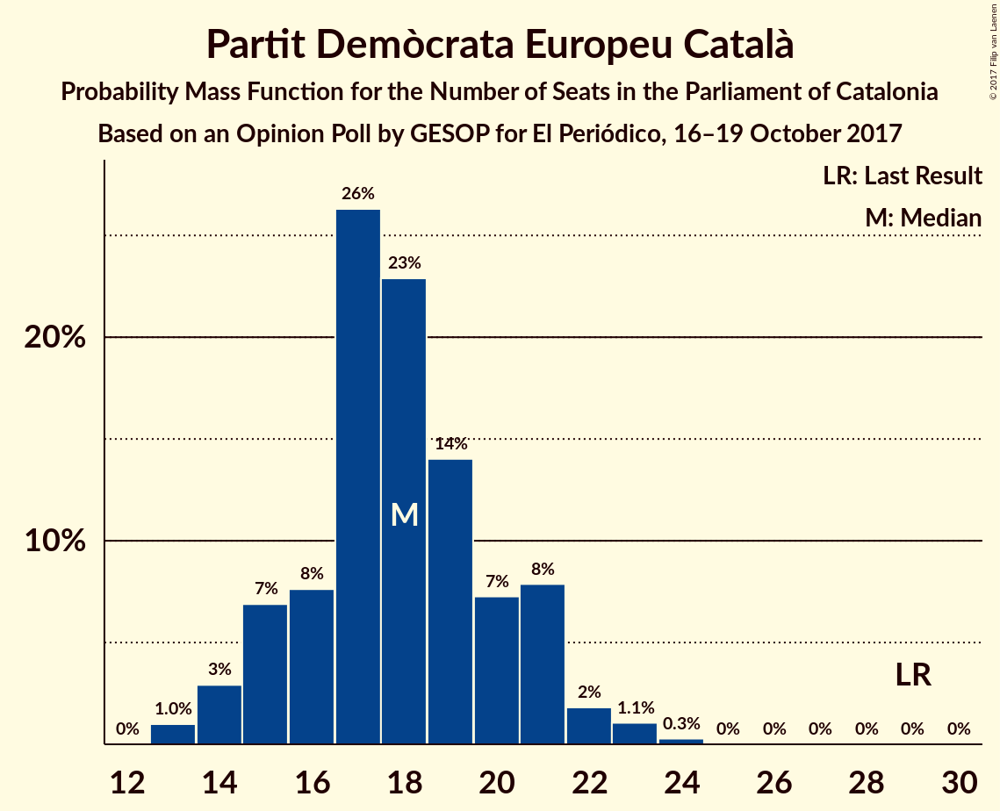
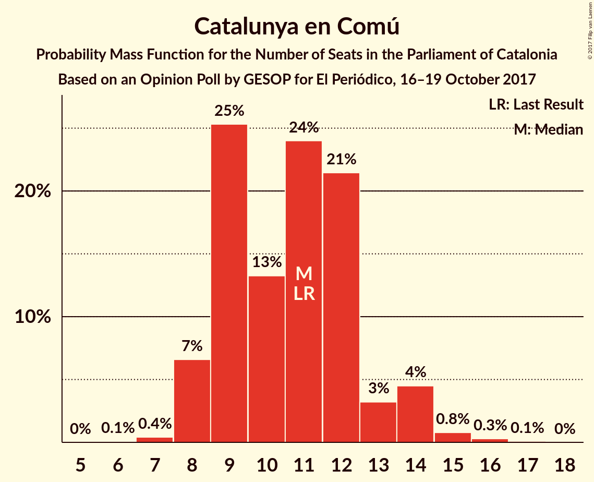
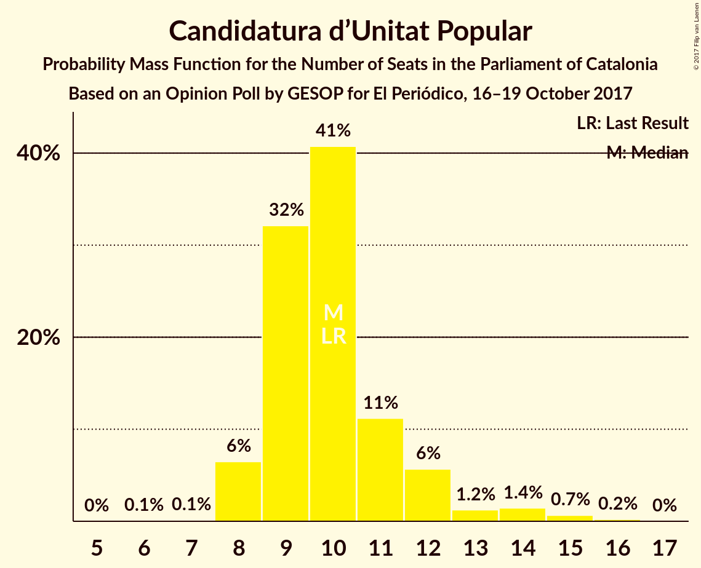
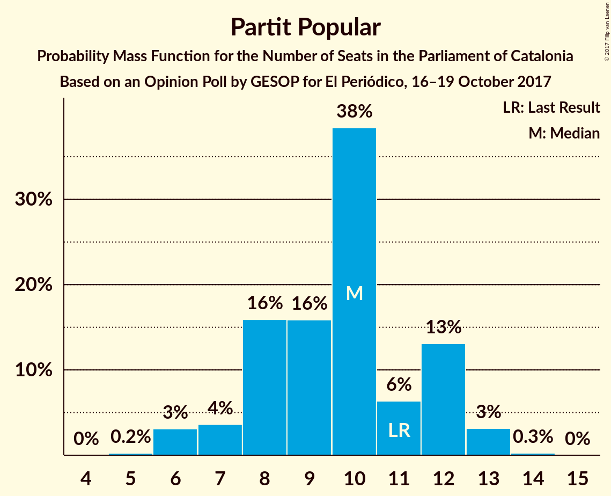
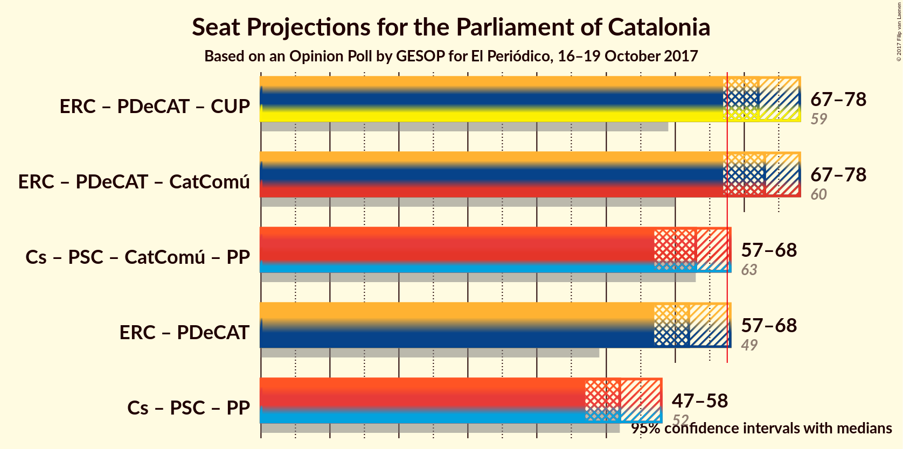

# Opinion Poll by GESOP for El Periódico, 16–19 October 2017

<a href="#voting-intentions">Voting Intentions</a> | <a href="#seats">Seats</a> | <a href="#coalitions">Coalitions</a> | <a href="#technical-information">Technical Information</a>

## Voting Intentions

### Confidence Intervals

| Party | Last Result | Poll Result | 80% Confidence Interval | 90% Confidence Interval | 95% Confidence Interval | 99% Confidence Interval |
|:-----:|:-----------:|:-----------:|:-----------------------:|:-----------------------:|:-----------------------:|:-----------------------:|
| Esquerra Republicana de Catalunya–Catalunya Sí | 39.6% | 28.1% | 26.2–30.2% |25.6–30.8% |25.1–31.4% |24.2–32.4% |
| Ciutadans–Partido de la Ciudadanía | 17.9% | 16.8% | 15.2–18.5% |14.7–19.1% |14.3–19.5% |13.6–20.4% |
| Partit dels Socialistes de Catalunya (PSC-PSOE) | 12.7% | 14.5% | 13.0–16.2% |12.6–16.7% |12.2–17.1% |11.5–18.0% |
| Partit Demòcrata Europeu Català | 39.6% | 12.0% | 10.6–13.6% |10.2–14.1% |9.9–14.4% |9.3–15.2% |
| Catalunya en Comú | 8.9% | 9.0% | 7.8–10.4% |7.5–10.8% |7.2–11.2% |6.7–11.9% |
| Candidatura d’Unitat Popular | 8.2% | 7.8% | 6.7–9.1% |6.3–9.5% |6.1–9.8% |5.6–10.5% |
| Partit Popular | 8.5% | 7.5% | 6.4–8.8% |6.1–9.2% |5.9–9.5% |5.4–10.2% |

*Note:* The poll result column reflects the actual value used in the calculations. Published results may vary slightly, and in addition be rounded to fewer digits.

## Seats

### Confidence Intervals

| Party | Last Result | Median | 80% Confidence Interval | 90% Confidence Interval | 95% Confidence Interval | 99% Confidence Interval |
|:-----:|:-----------:|:------:|:-----------------------:|:-----------------------:|:-----------------------:|:-----------------------:|
| <a href="#esquerra-republicana-de-catalunya–catalunya-sí">Esquerra Republicana de Catalunya–Catalunya Sí</a> | 20 | 44 | 41–48 |40–49 |39–50 |38–51 |
| <a href="#ciutadans–partido-de-la-ciudadanía">Ciutadans–Partido de la Ciudadanía</a> | 25 | 24 | 20–25 |20–26 |19–26 |18–28 |
| <a href="#partit-dels-socialistes-de-catalunya-(psc-psoe)">Partit dels Socialistes de Catalunya (PSC-PSOE)</a> | 16 | 20 | 16–22 |16–23 |16–23 |15–24 |
| <a href="#partit-demòcrata-europeu-català">Partit Demòcrata Europeu Català</a> | 29 | 18 | 15–21 |15–21 |14–22 |13–23 |
| <a href="#catalunya-en-comú">Catalunya en Comú</a> | 11 | 11 | 9–12 |8–14 |8–14 |7–15 |
| <a href="#candidatura-d’unitat-popular">Candidatura d’Unitat Popular</a> | 10 | 10 | 9–11 |8–12 |8–13 |8–15 |
| <a href="#partit-popular">Partit Popular</a> | 11 | 10 | 8–12 |7–12 |6–13 |6–13 |

### Esquerra Republicana de Catalunya–Catalunya Sí

*For a full overview of the results for this party, see the [Esquerra Republicana de Catalunya–Catalunya Sí](party-esquerrarepublicanadecatalunya–catalunyasí.html) page.*

| Number of Seats | Probability | Accumulated | Special Marks |
|:---------------:|:-----------:|:-----------:|:-------------:|
| 20 | 0% | 100% | Last Result |
| 21 | 0% | 100% |  |
| 22 | 0% | 100% |  |
| 23 | 0% | 100% |  |
| 24 | 0% | 100% |  |
| 25 | 0% | 100% |  |
| 26 | 0% | 100% |  |
| 27 | 0% | 100% |  |
| 28 | 0% | 100% |  |
| 29 | 0% | 100% |  |
| 30 | 0% | 100% |  |
| 31 | 0% | 100% |  |
| 32 | 0% | 100% |  |
| 33 | 0% | 100% |  |
| 34 | 0% | 100% |  |
| 35 | 0% | 100% |  |
| 36 | 0.1% | 100% |  |
| 37 | 0.3% | 99.9% |  |
| 38 | 1.1% | 99.6% |  |
| 39 | 2% | 98.5% |  |
| 40 | 3% | 97% |  |
| 41 | 6% | 94% |  |
| 42 | 11% | 88% |  |
| 43 | 14% | 77% |  |
| 44 | 22% | 63% | Median |
| 45 | 13% | 41% |  |
| 46 | 9% | 28% |  |
| 47 | 6% | 19% |  |
| 48 | 6% | 13% |  |
| 49 | 3% | 7% |  |
| 50 | 2% | 3% |  |
| 51 | 0.6% | 0.9% |  |
| 52 | 0.2% | 0.3% |  |
| 53 | 0.1% | 0.1% |  |
| 54 | 0% | 0% |  |

### Ciutadans–Partido de la Ciudadanía

*For a full overview of the results for this party, see the [Ciutadans–Partido de la Ciudadanía](party-ciutadans–partidodelaciudadanía.html) page.*

| Number of Seats | Probability | Accumulated | Special Marks |
|:---------------:|:-----------:|:-----------:|:-------------:|
| 17 | 0.3% | 100% |  |
| 18 | 0.9% | 99.7% |  |
| 19 | 2% | 98.8% |  |
| 20 | 11% | 97% |  |
| 21 | 8% | 86% |  |
| 22 | 12% | 78% |  |
| 23 | 11% | 66% |  |
| 24 | 27% | 55% | Median |
| 25 | 19% | 28% | Last Result |
| 26 | 7% | 9% |  |
| 27 | 1.1% | 2% |  |
| 28 | 0.7% | 1.1% |  |
| 29 | 0.3% | 0.5% |  |
| 30 | 0.2% | 0.2% |  |
| 31 | 0% | 0% |  |

### Partit dels Socialistes de Catalunya (PSC-PSOE)

*For a full overview of the results for this party, see the [Partit dels Socialistes de Catalunya (PSC-PSOE)](party-partitdelssocialistesdecatalunyapsc-psoe.html) page.*

| Number of Seats | Probability | Accumulated | Special Marks |
|:---------------:|:-----------:|:-----------:|:-------------:|
| 14 | 0.1% | 100% |  |
| 15 | 2% | 99.9% |  |
| 16 | 10% | 98% | Last Result |
| 17 | 16% | 88% |  |
| 18 | 9% | 72% |  |
| 19 | 10% | 63% |  |
| 20 | 22% | 54% | Median |
| 21 | 11% | 32% |  |
| 22 | 11% | 21% |  |
| 23 | 7% | 9% |  |
| 24 | 2% | 2% |  |
| 25 | 0.2% | 0.3% |  |
| 26 | 0.1% | 0.1% |  |
| 27 | 0% | 0% |  |

### Partit Demòcrata Europeu Català

*For a full overview of the results for this party, see the [Partit Demòcrata Europeu Català](party-partitdemòcrataeuropeucatalà.html) page.*

| Number of Seats | Probability | Accumulated | Special Marks |
|:---------------:|:-----------:|:-----------:|:-------------:|
| 13 | 1.0% | 100% |  |
| 14 | 3% | 99.0% |  |
| 15 | 7% | 96% |  |
| 16 | 8% | 89% |  |
| 17 | 26% | 82% |  |
| 18 | 23% | 55% | Median |
| 19 | 14% | 32% |  |
| 20 | 7% | 18% |  |
| 21 | 8% | 11% |  |
| 22 | 2% | 3% |  |
| 23 | 1.1% | 1.4% |  |
| 24 | 0.3% | 0.3% |  |
| 25 | 0% | 0% |  |
| 26 | 0% | 0% |  |
| 27 | 0% | 0% |  |
| 28 | 0% | 0% |  |
| 29 | 0% | 0% | Last Result |

### Catalunya en Comú

*For a full overview of the results for this party, see the [Catalunya en Comú](party-catalunyaencomú.html) page.*

| Number of Seats | Probability | Accumulated | Special Marks |
|:---------------:|:-----------:|:-----------:|:-------------:|
| 6 | 0.1% | 100% |  |
| 7 | 0.4% | 99.9% |  |
| 8 | 7% | 99.5% |  |
| 9 | 25% | 93% |  |
| 10 | 13% | 68% |  |
| 11 | 24% | 54% | Last Result, Median |
| 12 | 21% | 30% |  |
| 13 | 3% | 9% |  |
| 14 | 4% | 6% |  |
| 15 | 0.8% | 1.2% |  |
| 16 | 0.3% | 0.4% |  |
| 17 | 0.1% | 0.1% |  |
| 18 | 0% | 0% |  |

### Candidatura d’Unitat Popular

*For a full overview of the results for this party, see the [Candidatura d’Unitat Popular](party-candidaturad’unitatpopular.html) page.*

| Number of Seats | Probability | Accumulated | Special Marks |
|:---------------:|:-----------:|:-----------:|:-------------:|
| 6 | 0.1% | 100% |  |
| 7 | 0.1% | 99.9% |  |
| 8 | 6% | 99.8% |  |
| 9 | 32% | 93% |  |
| 10 | 41% | 61% | Last Result, Median |
| 11 | 11% | 20% |  |
| 12 | 6% | 9% |  |
| 13 | 1.2% | 4% |  |
| 14 | 1.4% | 2% |  |
| 15 | 0.7% | 0.9% |  |
| 16 | 0.2% | 0.2% |  |
| 17 | 0% | 0% |  |

### Partit Popular

*For a full overview of the results for this party, see the [Partit Popular](party-partitpopular.html) page.*

| Number of Seats | Probability | Accumulated | Special Marks |
|:---------------:|:-----------:|:-----------:|:-------------:|
| 5 | 0.2% | 100% |  |
| 6 | 3% | 99.8% |  |
| 7 | 4% | 97% |  |
| 8 | 16% | 93% |  |
| 9 | 16% | 77% |  |
| 10 | 38% | 61% | Median |
| 11 | 6% | 23% | Last Result |
| 12 | 13% | 17% |  |
| 13 | 3% | 3% |  |
| 14 | 0.3% | 0.3% |  |
| 15 | 0% | 0% |  |

## Coalitions

### Confidence Intervals

| Coalition | Last Result | Median | Majority? | 80% Confidence Interval | 90% Confidence Interval | 95% Confidence Interval | 99% Confidence Interval |
|:---------:|:-----------:|:------:|:---------:|:-----------------------:|:-----------------------:|:-----------------------:|:-----------------------:|
| Esquerra Republicana de Catalunya–Catalunya Sí – Partit Demòcrata Europeu Català – Candidatura d’Unitat Popular | 59 | 72 | 95% | 68–76 | 67–77 | 67–78 | 65–80 |
| Esquerra Republicana de Catalunya–Catalunya Sí – Partit Demòcrata Europeu Català – Catalunya en Comú | 60 | 73 | 97% | 69–76 | 68–78 | 67–78 | 66–80 |
| Ciutadans–Partido de la Ciudadanía – Partit dels Socialistes de Catalunya (PSC-PSOE) – Catalunya en Comú – Partit Popular | 63 | 63 | 5% | 59–67 | 58–68 | 57–68 | 55–70 |
| Esquerra Republicana de Catalunya–Catalunya Sí – Partit Demòcrata Europeu Català | 49 | 62 | 3% | 59–66 | 58–67 | 57–68 | 55–70 |
| Ciutadans–Partido de la Ciudadanía – Partit dels Socialistes de Catalunya (PSC-PSOE) – Partit Popular | 52 | 52 | 0% | 49–56 | 48–57 | 47–58 | 45–59 |

### Esquerra Republicana de Catalunya–Catalunya Sí – Partit Demòcrata Europeu Català – Candidatura d’Unitat Popular

| Number of Seats | Probability | Accumulated | Special Marks |
|:---------------:|:-----------:|:-----------:|:-------------:|
| 59 | 0% | 100% | Last Result |
| 60 | 0% | 100% |  |
| 61 | 0% | 100% |  |
| 62 | 0% | 100% |  |
| 63 | 0.1% | 100% |  |
| 64 | 0.2% | 99.9% |  |
| 65 | 0.6% | 99.7% |  |
| 66 | 1.5% | 99.1% |  |
| 67 | 3% | 98% |  |
| 68 | 5% | 95% | Majority |
| 69 | 8% | 90% |  |
| 70 | 11% | 82% |  |
| 71 | 13% | 71% |  |
| 72 | 15% | 58% | Median |
| 73 | 12% | 43% |  |
| 74 | 11% | 30% |  |
| 75 | 8% | 19% |  |
| 76 | 5% | 12% |  |
| 77 | 3% | 6% |  |
| 78 | 2% | 3% |  |
| 79 | 1.1% | 2% |  |
| 80 | 0.4% | 0.6% |  |
| 81 | 0.1% | 0.2% |  |
| 82 | 0.1% | 0.1% |  |
| 83 | 0% | 0% |  |

### Esquerra Republicana de Catalunya–Catalunya Sí – Partit Demòcrata Europeu Català – Catalunya en Comú

| Number of Seats | Probability | Accumulated | Special Marks |
|:---------------:|:-----------:|:-----------:|:-------------:|
| 60 | 0% | 100% | Last Result |
| 61 | 0% | 100% |  |
| 62 | 0% | 100% |  |
| 63 | 0% | 100% |  |
| 64 | 0.1% | 100% |  |
| 65 | 0.3% | 99.9% |  |
| 66 | 0.7% | 99.6% |  |
| 67 | 2% | 98.9% |  |
| 68 | 3% | 97% | Majority |
| 69 | 6% | 94% |  |
| 70 | 9% | 88% |  |
| 71 | 13% | 79% |  |
| 72 | 12% | 65% |  |
| 73 | 14% | 53% | Median |
| 74 | 12% | 39% |  |
| 75 | 11% | 28% |  |
| 76 | 7% | 17% |  |
| 77 | 4% | 10% |  |
| 78 | 3% | 5% |  |
| 79 | 1.4% | 2% |  |
| 80 | 0.7% | 1.1% |  |
| 81 | 0.3% | 0.4% |  |
| 82 | 0.1% | 0.1% |  |
| 83 | 0% | 0% |  |

### Ciutadans–Partido de la Ciudadanía – Partit dels Socialistes de Catalunya (PSC-PSOE) – Catalunya en Comú – Partit Popular

| Number of Seats | Probability | Accumulated | Special Marks |
|:---------------:|:-----------:|:-----------:|:-------------:|
| 53 | 0.1% | 100% |  |
| 54 | 0.1% | 99.9% |  |
| 55 | 0.4% | 99.8% |  |
| 56 | 1.1% | 99.4% |  |
| 57 | 2% | 98% |  |
| 58 | 3% | 97% |  |
| 59 | 5% | 94% |  |
| 60 | 8% | 88% |  |
| 61 | 11% | 81% |  |
| 62 | 12% | 70% |  |
| 63 | 15% | 57% | Last Result |
| 64 | 13% | 42% |  |
| 65 | 11% | 29% | Median |
| 66 | 8% | 18% |  |
| 67 | 5% | 10% |  |
| 68 | 3% | 5% | Majority |
| 69 | 1.5% | 2% |  |
| 70 | 0.6% | 0.9% |  |
| 71 | 0.2% | 0.3% |  |
| 72 | 0.1% | 0.1% |  |
| 73 | 0% | 0% |  |

### Esquerra Republicana de Catalunya–Catalunya Sí – Partit Demòcrata Europeu Català

| Number of Seats | Probability | Accumulated | Special Marks |
|:---------------:|:-----------:|:-----------:|:-------------:|
| 49 | 0% | 100% | Last Result |
| 50 | 0% | 100% |  |
| 51 | 0% | 100% |  |
| 52 | 0% | 100% |  |
| 53 | 0% | 100% |  |
| 54 | 0.2% | 99.9% |  |
| 55 | 0.5% | 99.8% |  |
| 56 | 1.2% | 99.3% |  |
| 57 | 3% | 98% |  |
| 58 | 5% | 95% |  |
| 59 | 8% | 91% |  |
| 60 | 10% | 83% |  |
| 61 | 13% | 73% |  |
| 62 | 15% | 60% | Median |
| 63 | 14% | 45% |  |
| 64 | 11% | 31% |  |
| 65 | 8% | 20% |  |
| 66 | 5% | 12% |  |
| 67 | 3% | 6% |  |
| 68 | 2% | 3% | Majority |
| 69 | 1.1% | 2% |  |
| 70 | 0.4% | 0.6% |  |
| 71 | 0.1% | 0.2% |  |
| 72 | 0% | 0.1% |  |
| 73 | 0% | 0% |  |

### Ciutadans–Partido de la Ciudadanía – Partit dels Socialistes de Catalunya (PSC-PSOE) – Partit Popular

| Number of Seats | Probability | Accumulated | Special Marks |
|:---------------:|:-----------:|:-----------:|:-------------:|
| 43 | 0.1% | 100% |  |
| 44 | 0.3% | 99.9% |  |
| 45 | 0.6% | 99.6% |  |
| 46 | 1.3% | 99.0% |  |
| 47 | 2% | 98% |  |
| 48 | 5% | 95% |  |
| 49 | 6% | 91% |  |
| 50 | 11% | 84% |  |
| 51 | 13% | 74% |  |
| 52 | 13% | 61% | Last Result |
| 53 | 13% | 48% |  |
| 54 | 12% | 35% | Median |
| 55 | 11% | 23% |  |
| 56 | 6% | 12% |  |
| 57 | 4% | 6% |  |
| 58 | 2% | 3% |  |
| 59 | 0.6% | 0.9% |  |
| 60 | 0.2% | 0.3% |  |
| 61 | 0.1% | 0.1% |  |
| 62 | 0% | 0% |  |

## Technical Information

### Opinion Poll

+ **Polling firm:** GESOP
+ **Commissioner(s):** El Periódico
+ **Fieldwork period:** 16–19 October 2017

### Calculations

+ **Sample size:** 800
+ **Simulations done:** 8,388,608
+ **Error estimate:** 0.84%

