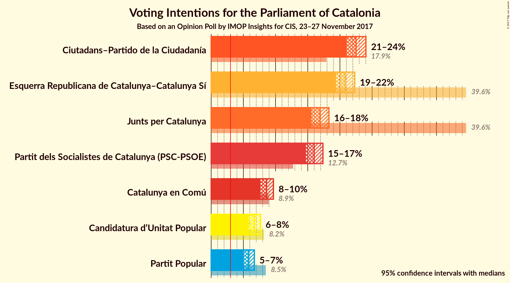
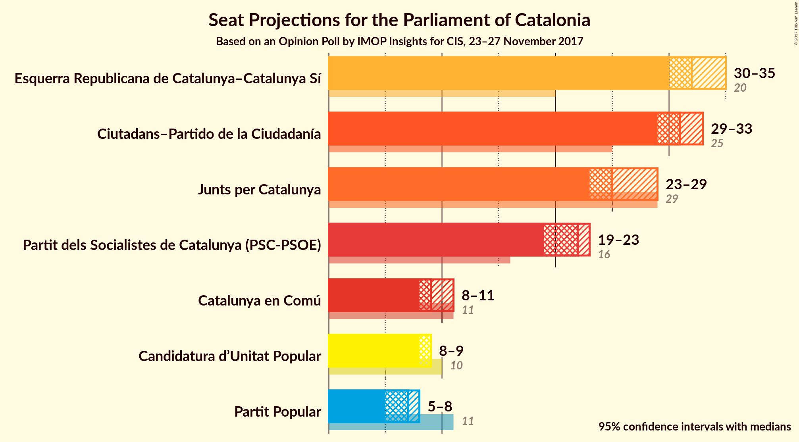
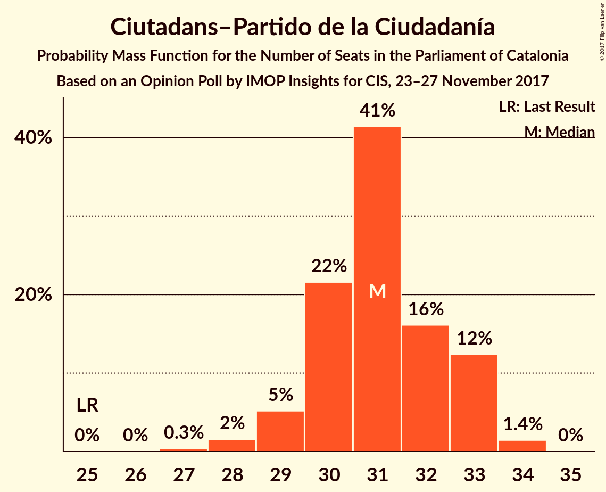
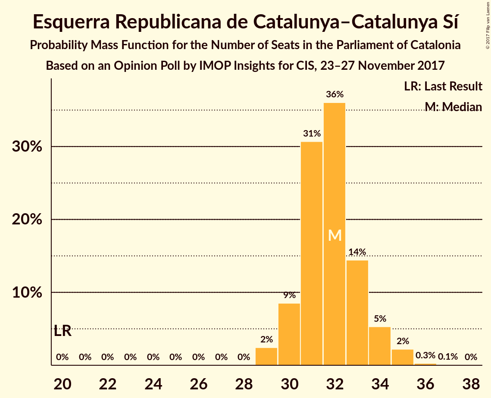
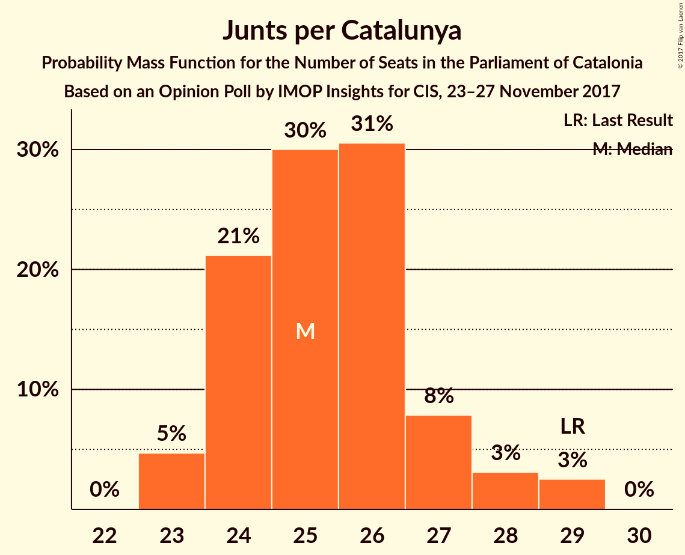
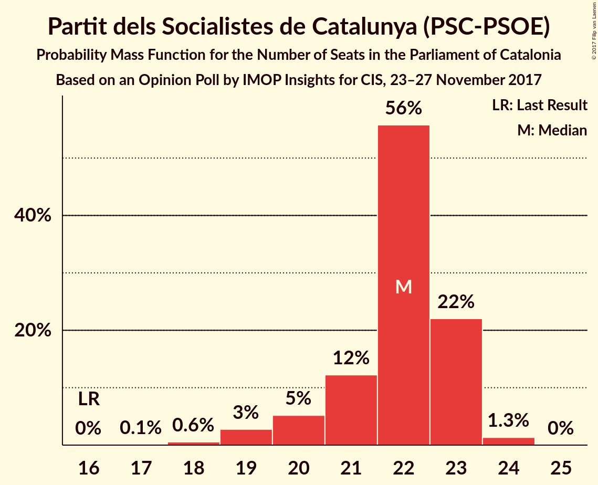
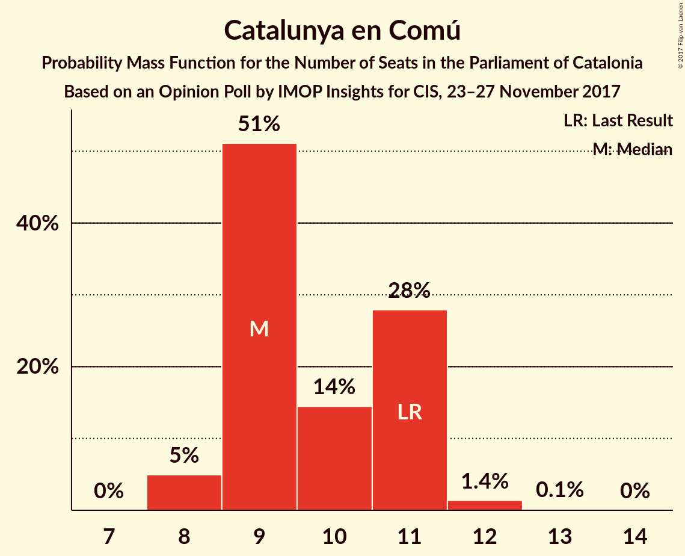
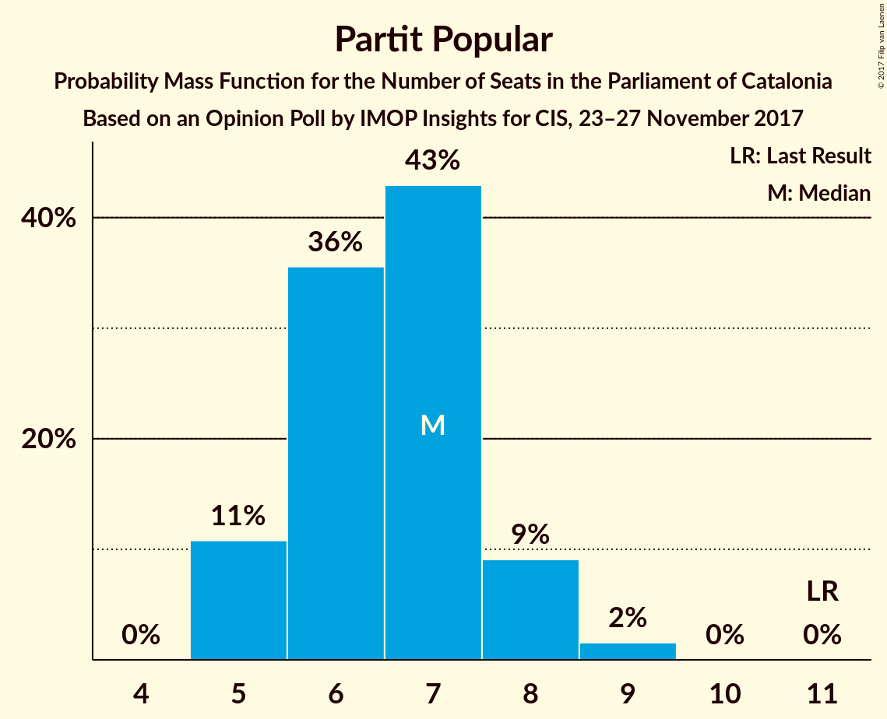
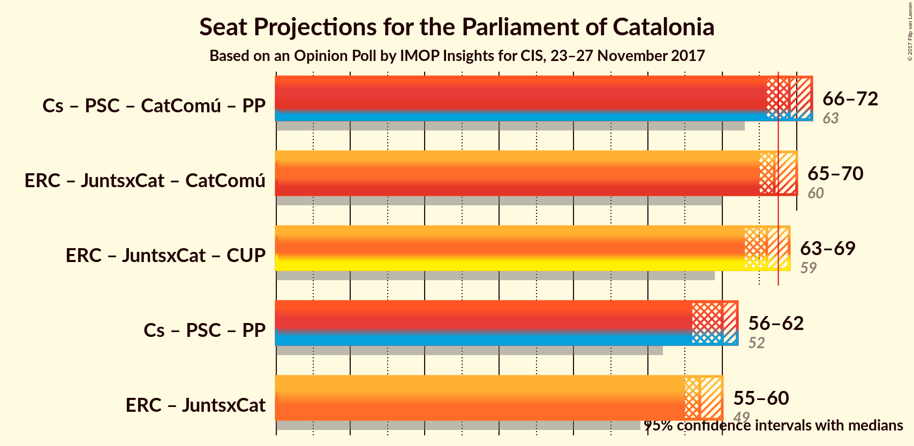

# Opinion Poll by IMOP Insights for CIS, 23–27 November 2017

<a href="#voting-intentions">Voting Intentions</a> | <a href="#seats">Seats</a> | <a href="#coalitions">Coalitions</a> | <a href="#technical-information">Technical Information</a>

## Voting Intentions

### Confidence Intervals

| Party | Last Result | Poll Result | 80% Confidence Interval | 90% Confidence Interval | 95% Confidence Interval | 99% Confidence Interval |
|:-----:|:-----------:|:-----------:|:-----------------------:|:-----------------------:|:-----------------------:|:-----------------------:|
| Ciutadans–Partido de la Ciudadanía | 17.9% | 22.5% | 21.5–23.5% |21.3–23.8% |21.0–24.0% |20.6–24.5% |
| Esquerra Republicana de Catalunya–Catalunya Sí | 39.6% | 20.8% | 19.9–21.8% |19.6–22.1% |19.4–22.3% |18.9–22.8% |
| Junts per Catalunya | 39.6% | 16.9% | 16.0–17.8% |15.8–18.1% |15.6–18.3% |15.2–18.7% |
| Partit dels Socialistes de Catalunya (PSC-PSOE) | 12.7% | 16.0% | 15.2–16.9% |14.9–17.1% |14.7–17.4% |14.3–17.8% |
| Catalunya en Comú | 8.9% | 8.6% | 8.0–9.3% |7.8–9.5% |7.6–9.7% |7.3–10.0% |
| Candidatura d’Unitat Popular | 8.2% | 6.7% | 6.1–7.3% |6.0–7.5% |5.9–7.7% |5.6–8.0% |
| Partit Popular | 8.5% | 5.8% | 5.3–6.4% |5.1–6.6% |5.0–6.7% |4.8–7.0% |

*Note:* The poll result column reflects the actual value used in the calculations. Published results may vary slightly, and in addition be rounded to fewer digits.

## Seats

### Confidence Intervals

| Party | Last Result | Median | 80% Confidence Interval | 90% Confidence Interval | 95% Confidence Interval | 99% Confidence Interval |
|:-----:|:-----------:|:------:|:-----------------------:|:-----------------------:|:-----------------------:|:-----------------------:|
| <a href="#ciutadans–partido-de-la-ciudadanía">Ciutadans–Partido de la Ciudadanía</a> | 25 | 31 | 30–33 |29–33 |29–33 |28–34 |
| <a href="#esquerra-republicana-de-catalunya–catalunya-sí">Esquerra Republicana de Catalunya–Catalunya Sí</a> | 20 | 32 | 30–33 |30–34 |30–35 |29–35 |
| <a href="#junts-per-catalunya">Junts per Catalunya</a> | 29 | 25 | 24–27 |24–28 |23–29 |23–29 |
| <a href="#partit-dels-socialistes-de-catalunya-(psc-psoe)">Partit dels Socialistes de Catalunya (PSC-PSOE)</a> | 16 | 22 | 21–23 |20–23 |19–23 |18–24 |
| <a href="#catalunya-en-comú">Catalunya en Comú</a> | 11 | 9 | 9–11 |9–11 |8–11 |8–12 |
| <a href="#candidatura-d’unitat-popular">Candidatura d’Unitat Popular</a> | 10 | 9 | 8–9 |8–9 |8–9 |8–10 |
| <a href="#partit-popular">Partit Popular</a> | 11 | 7 | 5–8 |5–8 |5–8 |5–9 |

### Ciutadans–Partido de la Ciudadanía

*For a full overview of the results for this party, see the [Ciutadans–Partido de la Ciudadanía](party-ciutadans–partidodelaciudadanía.html) page.*

| Number of Seats | Probability | Accumulated | Special Marks |
|:---------------:|:-----------:|:-----------:|:-------------:|
| 25 | 0% | 100% | Last Result |
| 26 | 0% | 100% |  |
| 27 | 0.3% | 100% |  |
| 28 | 2% | 99.6% |  |
| 29 | 5% | 98% |  |
| 30 | 22% | 93% |  |
| 31 | 41% | 71% | Median |
| 32 | 16% | 30% |  |
| 33 | 12% | 14% |  |
| 34 | 1.4% | 1.5% |  |
| 35 | 0% | 0% |  |

### Esquerra Republicana de Catalunya–Catalunya Sí

*For a full overview of the results for this party, see the [Esquerra Republicana de Catalunya–Catalunya Sí](party-esquerrarepublicanadecatalunya–catalunyasí.html) page.*

| Number of Seats | Probability | Accumulated | Special Marks |
|:---------------:|:-----------:|:-----------:|:-------------:|
| 20 | 0% | 100% | Last Result |
| 21 | 0% | 100% |  |
| 22 | 0% | 100% |  |
| 23 | 0% | 100% |  |
| 24 | 0% | 100% |  |
| 25 | 0% | 100% |  |
| 26 | 0% | 100% |  |
| 27 | 0% | 100% |  |
| 28 | 0% | 100% |  |
| 29 | 2% | 100% |  |
| 30 | 9% | 98% |  |
| 31 | 31% | 89% |  |
| 32 | 36% | 58% | Median |
| 33 | 14% | 22% |  |
| 34 | 5% | 8% |  |
| 35 | 2% | 3% |  |
| 36 | 0.3% | 0.3% |  |
| 37 | 0.1% | 0.1% |  |
| 38 | 0% | 0% |  |

### Junts per Catalunya

*For a full overview of the results for this party, see the [Junts per Catalunya](party-juntspercatalunya.html) page.*

| Number of Seats | Probability | Accumulated | Special Marks |
|:---------------:|:-----------:|:-----------:|:-------------:|
| 23 | 5% | 100% |  |
| 24 | 21% | 95% |  |
| 25 | 30% | 74% | Median |
| 26 | 31% | 44% |  |
| 27 | 8% | 14% |  |
| 28 | 3% | 6% |  |
| 29 | 3% | 3% | Last Result |
| 30 | 0% | 0% |  |

### Partit dels Socialistes de Catalunya (PSC-PSOE)

*For a full overview of the results for this party, see the [Partit dels Socialistes de Catalunya (PSC-PSOE)](party-partitdelssocialistesdecatalunyapsc-psoe.html) page.*

| Number of Seats | Probability | Accumulated | Special Marks |
|:---------------:|:-----------:|:-----------:|:-------------:|
| 16 | 0% | 100% | Last Result |
| 17 | 0.1% | 100% |  |
| 18 | 0.6% | 99.9% |  |
| 19 | 3% | 99.3% |  |
| 20 | 5% | 97% |  |
| 21 | 12% | 91% |  |
| 22 | 56% | 79% | Median |
| 23 | 22% | 23% |  |
| 24 | 1.3% | 1.4% |  |
| 25 | 0% | 0% |  |

### Catalunya en Comú

*For a full overview of the results for this party, see the [Catalunya en Comú](party-catalunyaencomú.html) page.*

| Number of Seats | Probability | Accumulated | Special Marks |
|:---------------:|:-----------:|:-----------:|:-------------:|
| 8 | 5% | 100% |  |
| 9 | 51% | 95% | Median |
| 10 | 14% | 44% |  |
| 11 | 28% | 29% | Last Result |
| 12 | 1.4% | 2% |  |
| 13 | 0.1% | 0.2% |  |
| 14 | 0% | 0% |  |

### Candidatura d’Unitat Popular

*For a full overview of the results for this party, see the [Candidatura d’Unitat Popular](party-candidaturad’unitatpopular.html) page.*

| Number of Seats | Probability | Accumulated | Special Marks |
|:---------------:|:-----------:|:-----------:|:-------------:|
| 7 | 0.2% | 100% |  |
| 8 | 38% | 99.8% |  |
| 9 | 59% | 61% | Median |
| 10 | 2% | 2% | Last Result |
| 11 | 0% | 0% |  |

### Partit Popular

*For a full overview of the results for this party, see the [Partit Popular](party-partitpopular.html) page.*

| Number of Seats | Probability | Accumulated | Special Marks |
|:---------------:|:-----------:|:-----------:|:-------------:|
| 5 | 11% | 100% |  |
| 6 | 36% | 89% |  |
| 7 | 43% | 54% | Median |
| 8 | 9% | 11% |  |
| 9 | 2% | 2% |  |
| 10 | 0% | 0% |  |
| 11 | 0% | 0% | Last Result |

## Coalitions

### Confidence Intervals

| Coalition | Last Result | Median | Majority? | 80% Confidence Interval | 90% Confidence Interval | 95% Confidence Interval | 99% Confidence Interval |
|:---------:|:-----------:|:------:|:---------:|:-----------------------:|:-----------------------:|:-----------------------:|:-----------------------:|
| Ciutadans–Partido de la Ciudadanía – Partit dels Socialistes de Catalunya (PSC-PSOE) – Catalunya en Comú – Partit Popular | 63 | 69 | 86% | 67–71 | 66–72 | 66–72 | 65–73 |
| Esquerra Republicana de Catalunya–Catalunya Sí – Junts per Catalunya – Catalunya en Comú | 60 | 67 | 28% | 65–69 | 65–69 | 65–70 | 64–71 |
| Esquerra Republicana de Catalunya–Catalunya Sí – Junts per Catalunya – Candidatura d’Unitat Popular | 59 | 66 | 14% | 64–68 | 63–69 | 63–69 | 62–70 |
| Ciutadans–Partido de la Ciudadanía – Partit dels Socialistes de Catalunya (PSC-PSOE) – Partit Popular | 52 | 60 | 0% | 58–61 | 57–61 | 56–62 | 55–63 |
| Esquerra Republicana de Catalunya–Catalunya Sí – Junts per Catalunya | 49 | 57 | 0% | 55–59 | 55–60 | 55–60 | 54–61 |

### Ciutadans–Partido de la Ciudadanía – Partit dels Socialistes de Catalunya (PSC-PSOE) – Catalunya en Comú – Partit Popular

| Number of Seats | Probability | Accumulated | Special Marks |
|:---------------:|:-----------:|:-----------:|:-------------:|
| 63 | 0% | 100% | Last Result |
| 64 | 0.2% | 100% |  |
| 65 | 1.2% | 99.8% |  |
| 66 | 4% | 98.6% |  |
| 67 | 9% | 95% |  |
| 68 | 15% | 86% | Majority |
| 69 | 26% | 71% | Median |
| 70 | 23% | 45% |  |
| 71 | 16% | 22% |  |
| 72 | 5% | 6% |  |
| 73 | 0.5% | 0.6% |  |
| 74 | 0% | 0% |  |

### Esquerra Republicana de Catalunya–Catalunya Sí – Junts per Catalunya – Catalunya en Comú

| Number of Seats | Probability | Accumulated | Special Marks |
|:---------------:|:-----------:|:-----------:|:-------------:|
| 60 | 0% | 100% | Last Result |
| 61 | 0% | 100% |  |
| 62 | 0% | 100% |  |
| 63 | 0.2% | 100% |  |
| 64 | 2% | 99.8% |  |
| 65 | 12% | 98% |  |
| 66 | 31% | 86% | Median |
| 67 | 27% | 54% |  |
| 68 | 15% | 28% | Majority |
| 69 | 8% | 12% |  |
| 70 | 3% | 4% |  |
| 71 | 0.8% | 1.1% |  |
| 72 | 0.2% | 0.2% |  |
| 73 | 0% | 0% |  |

### Esquerra Republicana de Catalunya–Catalunya Sí – Junts per Catalunya – Candidatura d’Unitat Popular

| Number of Seats | Probability | Accumulated | Special Marks |
|:---------------:|:-----------:|:-----------:|:-------------:|
| 59 | 0% | 100% | Last Result |
| 60 | 0% | 100% |  |
| 61 | 0% | 100% |  |
| 62 | 0.5% | 100% |  |
| 63 | 5% | 99.4% |  |
| 64 | 16% | 94% |  |
| 65 | 23% | 78% |  |
| 66 | 26% | 55% | Median |
| 67 | 15% | 29% |  |
| 68 | 9% | 14% | Majority |
| 69 | 4% | 5% |  |
| 70 | 1.2% | 1.4% |  |
| 71 | 0.2% | 0.2% |  |
| 72 | 0% | 0% |  |

### Ciutadans–Partido de la Ciudadanía – Partit dels Socialistes de Catalunya (PSC-PSOE) – Partit Popular

| Number of Seats | Probability | Accumulated | Special Marks |
|:---------------:|:-----------:|:-----------:|:-------------:|
| 52 | 0% | 100% | Last Result |
| 53 | 0% | 100% |  |
| 54 | 0.1% | 100% |  |
| 55 | 0.5% | 99.9% |  |
| 56 | 2% | 99.4% |  |
| 57 | 6% | 97% |  |
| 58 | 13% | 91% |  |
| 59 | 21% | 78% |  |
| 60 | 33% | 57% | Median |
| 61 | 20% | 25% |  |
| 62 | 4% | 5% |  |
| 63 | 0.5% | 0.6% |  |
| 64 | 0% | 0.1% |  |
| 65 | 0% | 0% |  |

### Esquerra Republicana de Catalunya–Catalunya Sí – Junts per Catalunya

| Number of Seats | Probability | Accumulated | Special Marks |
|:---------------:|:-----------:|:-----------:|:-------------:|
| 49 | 0% | 100% | Last Result |
| 50 | 0% | 100% |  |
| 51 | 0% | 100% |  |
| 52 | 0% | 100% |  |
| 53 | 0.1% | 100% |  |
| 54 | 2% | 99.9% |  |
| 55 | 12% | 98% |  |
| 56 | 21% | 85% |  |
| 57 | 28% | 65% | Median |
| 58 | 18% | 36% |  |
| 59 | 11% | 19% |  |
| 60 | 5% | 8% |  |
| 61 | 2% | 2% |  |
| 62 | 0.2% | 0.3% |  |
| 63 | 0% | 0.1% |  |
| 64 | 0% | 0% |  |

## Technical Information

### Opinion Poll

+ **Polling firm:** IMOP Insights
+ **Commissioner(s):** CIS
+ **Fieldwork period:** 23–27 November 2017

### Calculations

+ **Sample size:** 3000
+ **Simulations done:** 8,388,608
+ **Error estimate:** 0.38%

