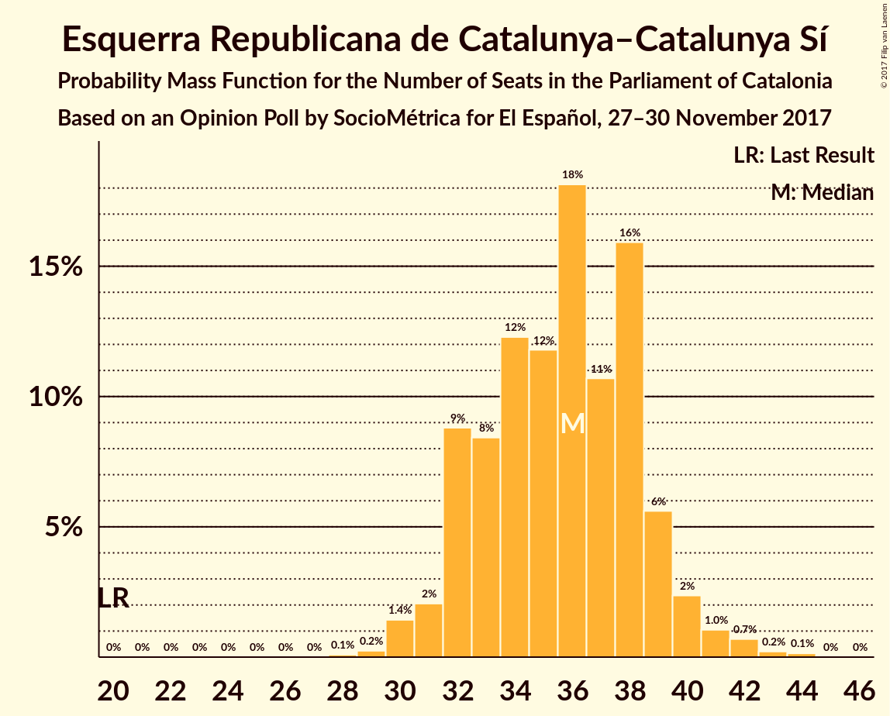
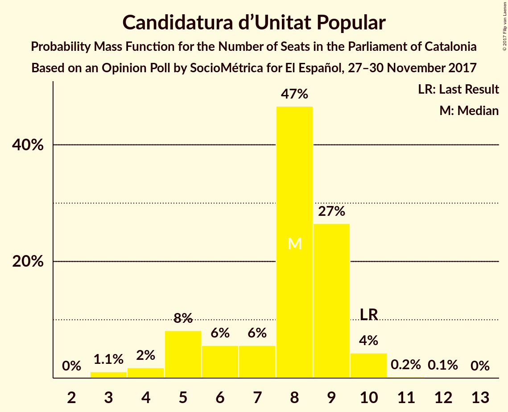

# Opinion Poll by SocioMétrica for El Español, 27–30 November 2017

<a href="#voting-intentions">Voting Intentions</a> | <a href="#seats">Seats</a> | <a href="#coalitions">Coalitions</a> | <a href="#technical-information">Technical Information</a>

## Voting Intentions

### Confidence Intervals

| Party | Last Result | Poll Result | 80% Confidence Interval | 90% Confidence Interval | 95% Confidence Interval | 99% Confidence Interval |
|:-----:|:-----------:|:-----------:|:-----------------------:|:-----------------------:|:-----------------------:|:-----------------------:|
| Esquerra Republicana de Catalunya–Catalunya Sí | 39.6% | 23.1% | 21.3–25.1% |20.8–25.7% |20.3–26.2% |19.5–27.2% |
| Ciutadans–Partido de la Ciudadanía | 17.9% | 20.5% | 18.7–22.4% |18.3–23.0% |17.8–23.4% |17.0–24.4% |
| Junts per Catalunya | 39.6% | 19.0% | 17.3–20.9% |16.8–21.4% |16.4–21.9% |15.7–22.8% |
| Partit dels Socialistes de Catalunya (PSC-PSOE) | 12.7% | 15.2% | 13.7–17.0% |13.3–17.5% |12.9–17.9% |12.2–18.8% |
| Catalunya en Comú | 8.9% | 6.4% | 5.4–7.6% |5.1–8.0% |4.9–8.3% |4.5–8.9% |
| Partit Popular | 8.5% | 6.2% | 5.3–7.5% |5.0–7.8% |4.8–8.2% |4.3–8.8% |
| Candidatura d’Unitat Popular | 8.2% | 6.0% | 5.0–7.2% |4.8–7.6% |4.6–7.9% |4.1–8.5% |

*Note:* The poll result column reflects the actual value used in the calculations. Published results may vary slightly, and in addition be rounded to fewer digits.

## Seats

### Confidence Intervals

| Party | Last Result | Median | 80% Confidence Interval | 90% Confidence Interval | 95% Confidence Interval | 99% Confidence Interval |
|:-----:|:-----------:|:------:|:-----------------------:|:-----------------------:|:-----------------------:|:-----------------------:|
| <a href="#esquerra-republicana-de-catalunya–catalunya-sí">Esquerra Republicana de Catalunya–Catalunya Sí</a> | 20 | 36 | 32–39 |32–39 |31–40 |30–42 |
| <a href="#ciutadans–partido-de-la-ciudadanía">Ciutadans–Partido de la Ciudadanía</a> | 25 | 28 | 26–31 |25–32 |25–32 |23–34 |
| <a href="#junts-per-catalunya">Junts per Catalunya</a> | 29 | 29 | 26–32 |25–32 |24–34 |23–35 |
| <a href="#partit-dels-socialistes-de-catalunya-(psc-psoe)">Partit dels Socialistes de Catalunya (PSC-PSOE)</a> | 16 | 21 | 17–23 |17–24 |16–24 |16–25 |
| <a href="#catalunya-en-comú">Catalunya en Comú</a> | 11 | 7 | 5–8 |5–9 |5–9 |4–11 |
| <a href="#partit-popular">Partit Popular</a> | 11 | 7 | 6–10 |5–10 |5–10 |4–12 |
| <a href="#candidatura-d’unitat-popular">Candidatura d’Unitat Popular</a> | 10 | 8 | 5–9 |5–9 |4–10 |3–10 |

### Esquerra Republicana de Catalunya–Catalunya Sí

*For a full overview of the results for this party, see the [Esquerra Republicana de Catalunya–Catalunya Sí](party-esquerrarepublicanadecatalunya–catalunyasí.html) page.*

| Number of Seats | Probability | Accumulated | Special Marks |
|:---------------:|:-----------:|:-----------:|:-------------:|
| 20 | 0% | 100% | Last Result |
| 21 | 0% | 100% |  |
| 22 | 0% | 100% |  |
| 23 | 0% | 100% |  |
| 24 | 0% | 100% |  |
| 25 | 0% | 100% |  |
| 26 | 0% | 100% |  |
| 27 | 0% | 100% |  |
| 28 | 0.1% | 100% |  |
| 29 | 0.2% | 99.9% |  |
| 30 | 1.4% | 99.6% |  |
| 31 | 2% | 98% |  |
| 32 | 9% | 96% |  |
| 33 | 8% | 87% |  |
| 34 | 12% | 79% |  |
| 35 | 12% | 67% |  |
| 36 | 18% | 55% | Median |
| 37 | 11% | 37% |  |
| 38 | 16% | 26% |  |
| 39 | 6% | 10% |  |
| 40 | 2% | 4% |  |
| 41 | 1.0% | 2% |  |
| 42 | 0.7% | 1.1% |  |
| 43 | 0.2% | 0.4% |  |
| 44 | 0.1% | 0.2% |  |
| 45 | 0% | 0% |  |

### Ciutadans–Partido de la Ciudadanía

*For a full overview of the results for this party, see the [Ciutadans–Partido de la Ciudadanía](party-ciutadans–partidodelaciudadanía.html) page.*

| Number of Seats | Probability | Accumulated | Special Marks |
|:---------------:|:-----------:|:-----------:|:-------------:|
| 21 | 0.1% | 100% |  |
| 22 | 0.1% | 99.9% |  |
| 23 | 0.6% | 99.8% |  |
| 24 | 1.0% | 99.2% |  |
| 25 | 7% | 98% | Last Result |
| 26 | 19% | 91% |  |
| 27 | 19% | 72% |  |
| 28 | 11% | 53% | Median |
| 29 | 14% | 42% |  |
| 30 | 11% | 29% |  |
| 31 | 12% | 18% |  |
| 32 | 4% | 6% |  |
| 33 | 1.2% | 2% |  |
| 34 | 0.6% | 0.8% |  |
| 35 | 0.1% | 0.2% |  |
| 36 | 0.1% | 0.1% |  |
| 37 | 0% | 0% |  |

### Junts per Catalunya

*For a full overview of the results for this party, see the [Junts per Catalunya](party-juntspercatalunya.html) page.*

| Number of Seats | Probability | Accumulated | Special Marks |
|:---------------:|:-----------:|:-----------:|:-------------:|
| 22 | 0.1% | 100% |  |
| 23 | 0.4% | 99.9% |  |
| 24 | 3% | 99.5% |  |
| 25 | 3% | 96% |  |
| 26 | 8% | 93% |  |
| 27 | 8% | 85% |  |
| 28 | 19% | 77% |  |
| 29 | 16% | 58% | Last Result, Median |
| 30 | 21% | 42% |  |
| 31 | 7% | 22% |  |
| 32 | 9% | 14% |  |
| 33 | 2% | 5% |  |
| 34 | 2% | 3% |  |
| 35 | 0.6% | 1.0% |  |
| 36 | 0.3% | 0.4% |  |
| 37 | 0.1% | 0.1% |  |
| 38 | 0% | 0% |  |

### Partit dels Socialistes de Catalunya (PSC-PSOE)

*For a full overview of the results for this party, see the [Partit dels Socialistes de Catalunya (PSC-PSOE)](party-partitdelssocialistesdecatalunyapsc-psoe.html) page.*

| Number of Seats | Probability | Accumulated | Special Marks |
|:---------------:|:-----------:|:-----------:|:-------------:|
| 15 | 0.4% | 100% |  |
| 16 | 4% | 99.6% | Last Result |
| 17 | 11% | 96% |  |
| 18 | 6% | 85% |  |
| 19 | 16% | 79% |  |
| 20 | 13% | 63% |  |
| 21 | 18% | 51% | Median |
| 22 | 12% | 33% |  |
| 23 | 15% | 21% |  |
| 24 | 5% | 6% |  |
| 25 | 0.9% | 1.1% |  |
| 26 | 0.1% | 0.2% |  |
| 27 | 0.1% | 0.1% |  |
| 28 | 0% | 0% |  |

### Catalunya en Comú

*For a full overview of the results for this party, see the [Catalunya en Comú](party-catalunyaencomú.html) page.*

| Number of Seats | Probability | Accumulated | Special Marks |
|:---------------:|:-----------:|:-----------:|:-------------:|
| 4 | 2% | 100% |  |
| 5 | 19% | 98% |  |
| 6 | 27% | 79% |  |
| 7 | 16% | 52% | Median |
| 8 | 28% | 36% |  |
| 9 | 7% | 8% |  |
| 10 | 0.4% | 1.0% |  |
| 11 | 0.5% | 0.5% | Last Result |
| 12 | 0% | 0.1% |  |
| 13 | 0% | 0% |  |

### Partit Popular

*For a full overview of the results for this party, see the [Partit Popular](party-partitpopular.html) page.*

| Number of Seats | Probability | Accumulated | Special Marks |
|:---------------:|:-----------:|:-----------:|:-------------:|
| 3 | 0.3% | 100% |  |
| 4 | 0.4% | 99.7% |  |
| 5 | 8% | 99.3% |  |
| 6 | 30% | 91% |  |
| 7 | 11% | 61% | Median |
| 8 | 26% | 50% |  |
| 9 | 11% | 24% |  |
| 10 | 11% | 13% |  |
| 11 | 0.8% | 1.4% | Last Result |
| 12 | 0.5% | 0.6% |  |
| 13 | 0.1% | 0.1% |  |
| 14 | 0% | 0% |  |

### Candidatura d’Unitat Popular

*For a full overview of the results for this party, see the [Candidatura d’Unitat Popular](party-candidaturad’unitatpopular.html) page.*

| Number of Seats | Probability | Accumulated | Special Marks |
|:---------------:|:-----------:|:-----------:|:-------------:|
| 3 | 1.1% | 100% |  |
| 4 | 2% | 98.9% |  |
| 5 | 8% | 97% |  |
| 6 | 6% | 89% |  |
| 7 | 6% | 83% |  |
| 8 | 47% | 78% | Median |
| 9 | 27% | 31% |  |
| 10 | 4% | 5% | Last Result |
| 11 | 0.2% | 0.3% |  |
| 12 | 0.1% | 0.1% |  |
| 13 | 0% | 0% |  |

## Coalitions

### Confidence Intervals

| Coalition | Last Result | Median | Majority? | 80% Confidence Interval | 90% Confidence Interval | 95% Confidence Interval | 99% Confidence Interval |
|:---------:|:-----------:|:------:|:---------:|:-----------------------:|:-----------------------:|:-----------------------:|:-----------------------:|
| Esquerra Republicana de Catalunya–Catalunya Sí – Junts per Catalunya – Candidatura d’Unitat Popular | 59 | 72 | 96% | 69–76 | 68–77 | 67–78 | 65–80 |
| Esquerra Republicana de Catalunya–Catalunya Sí – Junts per Catalunya – Catalunya en Comú | 60 | 71 | 91% | 68–75 | 67–76 | 66–77 | 64–79 |
| Esquerra Republicana de Catalunya–Catalunya Sí – Junts per Catalunya | 49 | 65 | 16% | 61–68 | 60–69 | 59–70 | 57–72 |
| Ciutadans–Partido de la Ciudadanía – Partit dels Socialistes de Catalunya (PSC-PSOE) – Catalunya en Comú – Partit Popular | 63 | 63 | 4% | 59–66 | 58–67 | 57–68 | 55–70 |
| Ciutadans–Partido de la Ciudadanía – Partit dels Socialistes de Catalunya (PSC-PSOE) – Partit Popular | 52 | 56 | 0% | 52–60 | 51–61 | 50–62 | 49–63 |

### Esquerra Republicana de Catalunya–Catalunya Sí – Junts per Catalunya – Candidatura d’Unitat Popular

| Number of Seats | Probability | Accumulated | Special Marks |
|:---------------:|:-----------:|:-----------:|:-------------:|
| 59 | 0% | 100% | Last Result |
| 60 | 0% | 100% |  |
| 61 | 0% | 100% |  |
| 62 | 0% | 100% |  |
| 63 | 0.1% | 100% |  |
| 64 | 0.2% | 99.9% |  |
| 65 | 0.6% | 99.7% |  |
| 66 | 1.1% | 99.1% |  |
| 67 | 2% | 98% |  |
| 68 | 4% | 96% | Majority |
| 69 | 7% | 91% |  |
| 70 | 11% | 85% |  |
| 71 | 12% | 74% |  |
| 72 | 13% | 62% |  |
| 73 | 12% | 48% | Median |
| 74 | 12% | 37% |  |
| 75 | 10% | 24% |  |
| 76 | 7% | 15% |  |
| 77 | 4% | 8% |  |
| 78 | 2% | 3% |  |
| 79 | 0.9% | 1.5% |  |
| 80 | 0.4% | 0.6% |  |
| 81 | 0.2% | 0.2% |  |
| 82 | 0% | 0.1% |  |
| 83 | 0% | 0% |  |

### Esquerra Republicana de Catalunya–Catalunya Sí – Junts per Catalunya – Catalunya en Comú

| Number of Seats | Probability | Accumulated | Special Marks |
|:---------------:|:-----------:|:-----------:|:-------------:|
| 60 | 0% | 100% | Last Result |
| 61 | 0% | 100% |  |
| 62 | 0.1% | 100% |  |
| 63 | 0.3% | 99.9% |  |
| 64 | 0.8% | 99.7% |  |
| 65 | 1.2% | 98.9% |  |
| 66 | 2% | 98% |  |
| 67 | 5% | 96% |  |
| 68 | 7% | 91% | Majority |
| 69 | 11% | 84% |  |
| 70 | 13% | 73% |  |
| 71 | 13% | 60% |  |
| 72 | 13% | 47% | Median |
| 73 | 10% | 34% |  |
| 74 | 10% | 24% |  |
| 75 | 7% | 14% |  |
| 76 | 4% | 8% |  |
| 77 | 2% | 4% |  |
| 78 | 1.0% | 2% |  |
| 79 | 0.4% | 0.6% |  |
| 80 | 0.1% | 0.2% |  |
| 81 | 0.1% | 0.1% |  |
| 82 | 0% | 0% |  |

### Esquerra Republicana de Catalunya–Catalunya Sí – Junts per Catalunya

| Number of Seats | Probability | Accumulated | Special Marks |
|:---------------:|:-----------:|:-----------:|:-------------:|
| 49 | 0% | 100% | Last Result |
| 50 | 0% | 100% |  |
| 51 | 0% | 100% |  |
| 52 | 0% | 100% |  |
| 53 | 0% | 100% |  |
| 54 | 0% | 100% |  |
| 55 | 0% | 100% |  |
| 56 | 0.2% | 99.9% |  |
| 57 | 0.4% | 99.8% |  |
| 58 | 1.0% | 99.4% |  |
| 59 | 2% | 98% |  |
| 60 | 4% | 96% |  |
| 61 | 6% | 93% |  |
| 62 | 11% | 87% |  |
| 63 | 11% | 76% |  |
| 64 | 13% | 64% |  |
| 65 | 12% | 51% | Median |
| 66 | 12% | 38% |  |
| 67 | 10% | 26% |  |
| 68 | 8% | 16% | Majority |
| 69 | 4% | 8% |  |
| 70 | 2% | 4% |  |
| 71 | 0.9% | 2% |  |
| 72 | 0.5% | 0.8% |  |
| 73 | 0.2% | 0.3% |  |
| 74 | 0.1% | 0.1% |  |
| 75 | 0% | 0% |  |

### Ciutadans–Partido de la Ciudadanía – Partit dels Socialistes de Catalunya (PSC-PSOE) – Catalunya en Comú – Partit Popular

| Number of Seats | Probability | Accumulated | Special Marks |
|:---------------:|:-----------:|:-----------:|:-------------:|
| 53 | 0% | 100% |  |
| 54 | 0.2% | 99.9% |  |
| 55 | 0.4% | 99.8% |  |
| 56 | 0.9% | 99.4% |  |
| 57 | 2% | 98.5% |  |
| 58 | 4% | 97% |  |
| 59 | 7% | 92% |  |
| 60 | 10% | 85% |  |
| 61 | 12% | 76% |  |
| 62 | 12% | 63% |  |
| 63 | 13% | 52% | Last Result, Median |
| 64 | 12% | 38% |  |
| 65 | 11% | 26% |  |
| 66 | 7% | 15% |  |
| 67 | 4% | 9% |  |
| 68 | 2% | 4% | Majority |
| 69 | 1.1% | 2% |  |
| 70 | 0.6% | 0.9% |  |
| 71 | 0.2% | 0.3% |  |
| 72 | 0.1% | 0.1% |  |
| 73 | 0% | 0% |  |

### Ciutadans–Partido de la Ciudadanía – Partit dels Socialistes de Catalunya (PSC-PSOE) – Partit Popular

| Number of Seats | Probability | Accumulated | Special Marks |
|:---------------:|:-----------:|:-----------:|:-------------:|
| 47 | 0.1% | 100% |  |
| 48 | 0.4% | 99.9% |  |
| 49 | 0.9% | 99.6% |  |
| 50 | 2% | 98.7% |  |
| 51 | 4% | 97% |  |
| 52 | 6% | 93% | Last Result |
| 53 | 9% | 88% |  |
| 54 | 10% | 78% |  |
| 55 | 14% | 68% |  |
| 56 | 13% | 55% | Median |
| 57 | 14% | 42% |  |
| 58 | 10% | 28% |  |
| 59 | 8% | 18% |  |
| 60 | 5% | 10% |  |
| 61 | 3% | 5% |  |
| 62 | 1.5% | 3% |  |
| 63 | 0.9% | 1.2% |  |
| 64 | 0.3% | 0.4% |  |
| 65 | 0.1% | 0.1% |  |
| 66 | 0% | 0% |  |

## Technical Information

### Opinion Poll

+ **Polling firm:** SocioMétrica
+ **Commissioner(s):** El Español
+ **Fieldwork period:** 27–30 November 2017

### Calculations

+ **Sample size:** 800
+ **Simulations done:** 8,388,608
+ **Error estimate:** 0.81%

