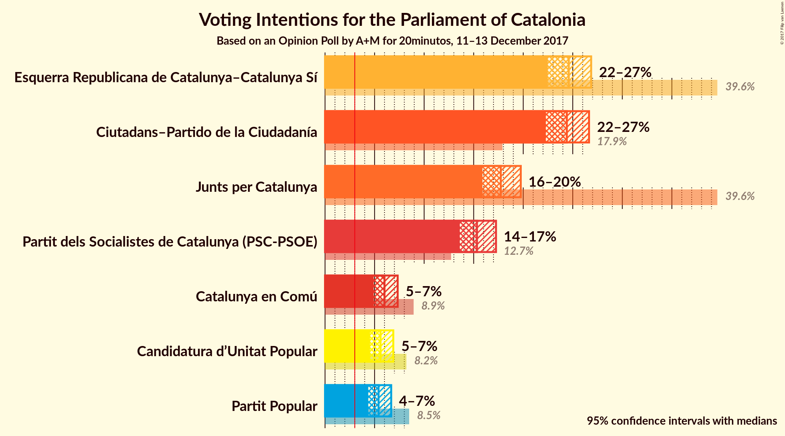
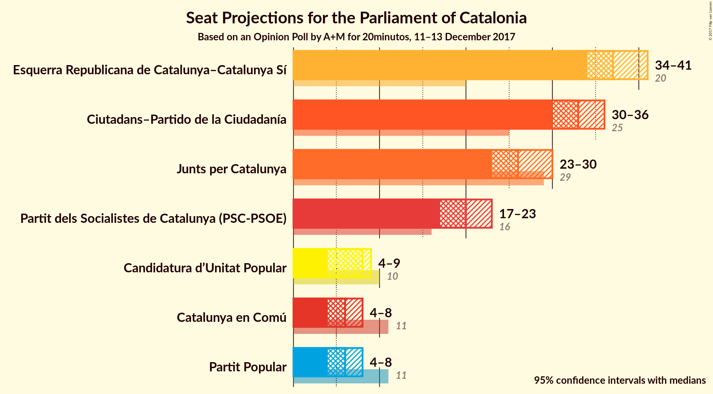
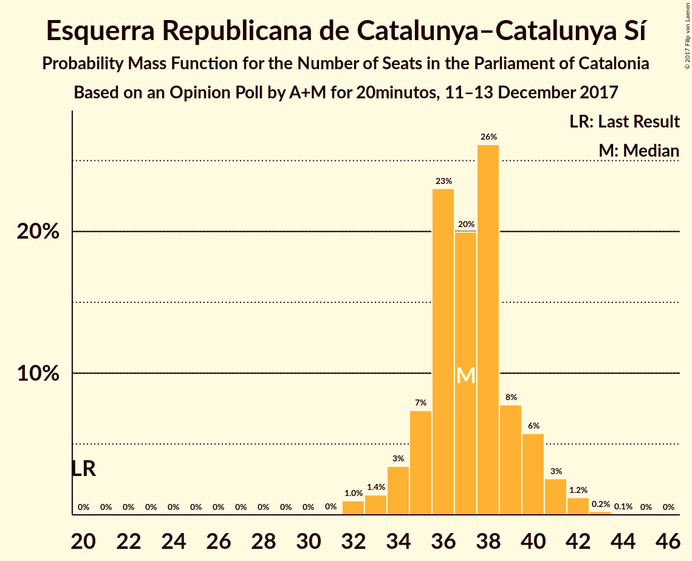
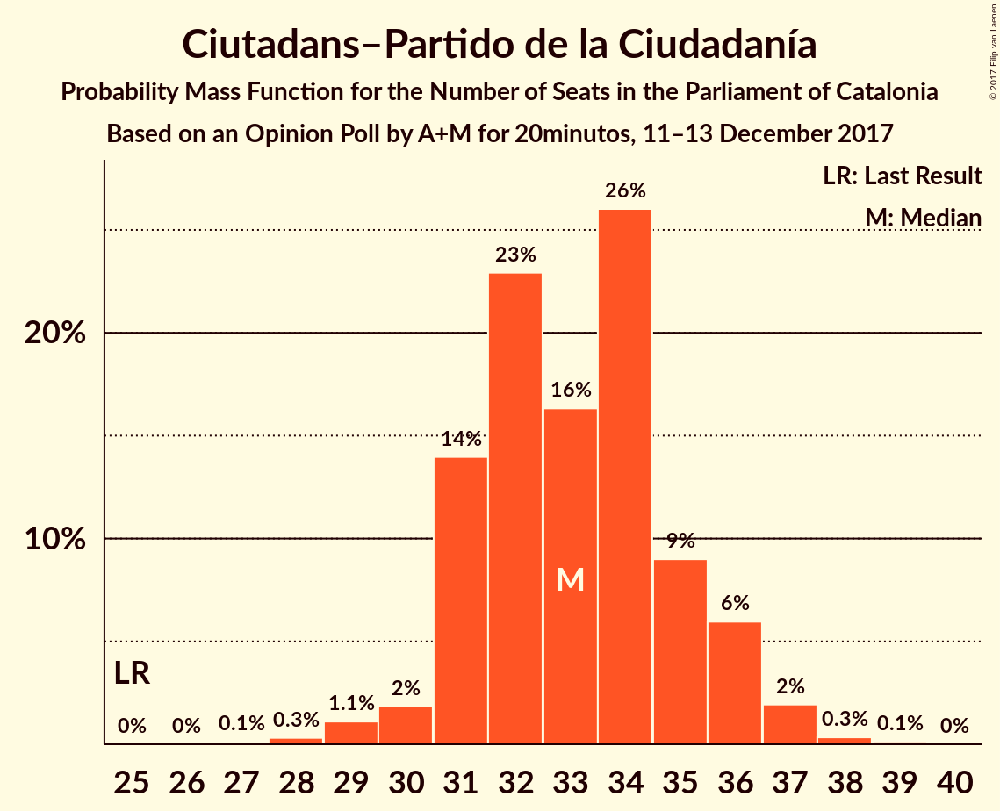
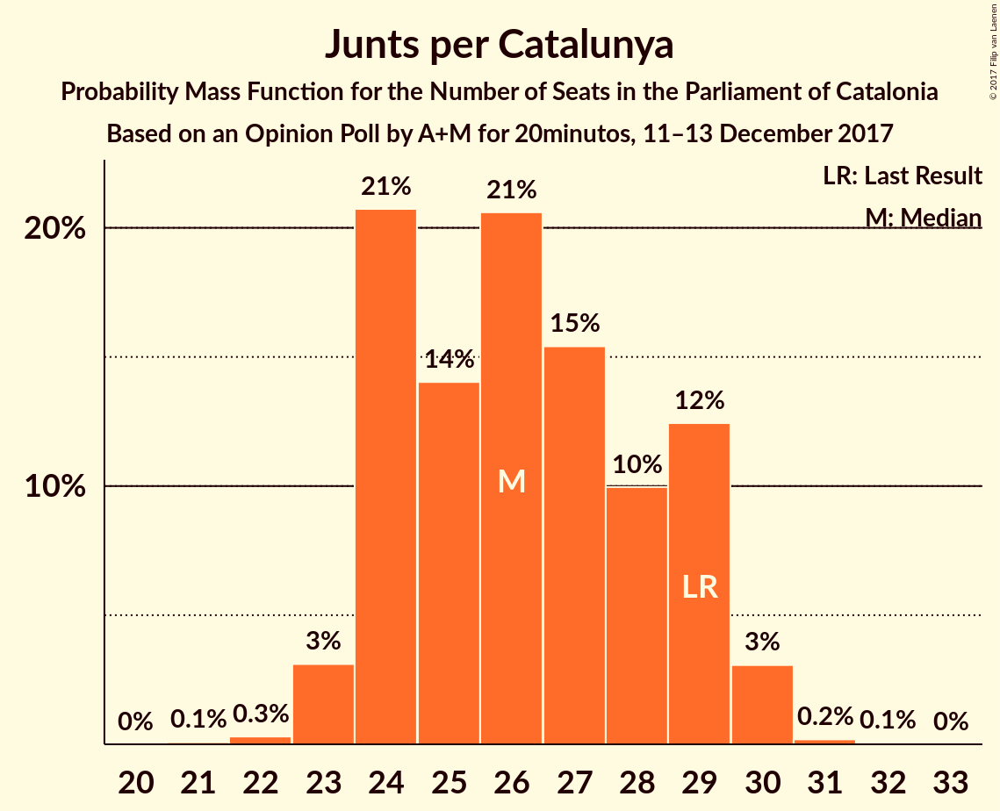
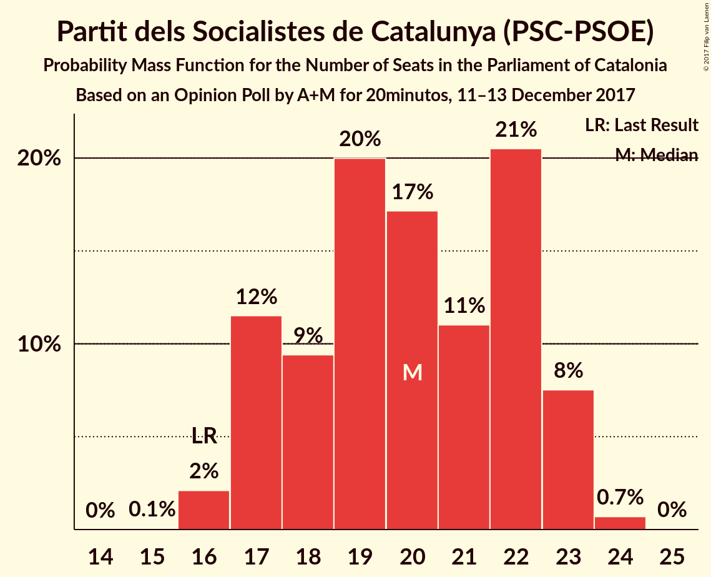
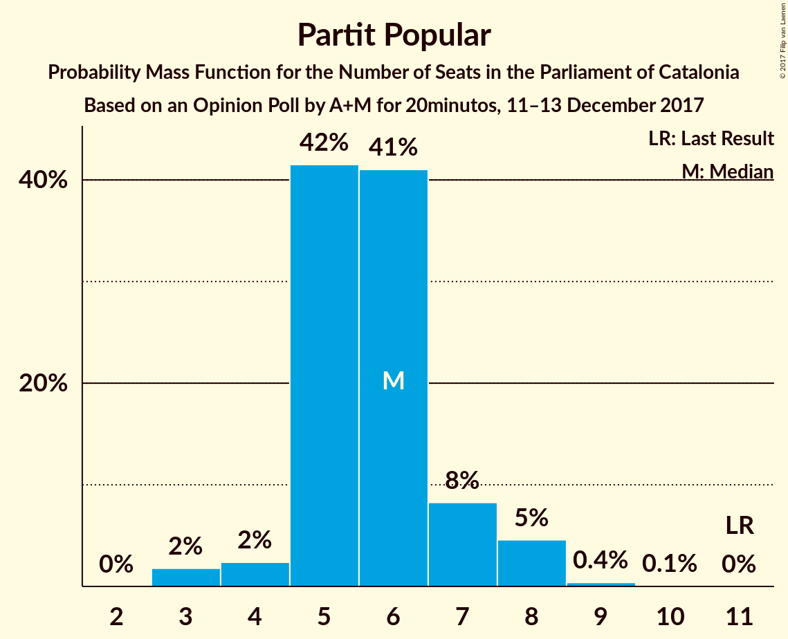
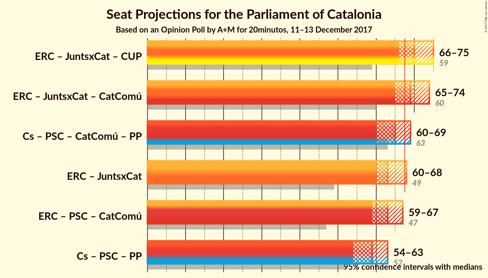

# Opinion Poll by A+M for 20minutos, 11–13 December 2017

<a href="#voting-intentions">Voting Intentions</a> | <a href="#seats">Seats</a> | <a href="#coalitions">Coalitions</a> | <a href="#technical-information">Technical Information</a>

## Voting Intentions

### Confidence Intervals

| Party | Last Result | Poll Result | 80% Confidence Interval | 90% Confidence Interval | 95% Confidence Interval | 99% Confidence Interval |
|:-----:|:-----------:|:-----------:|:-----------------------:|:-----------------------:|:-----------------------:|:-----------------------:|
| Esquerra Republicana de Catalunya–Catalunya Sí | 39.6% | 24.6% | 23.2–26.1% |22.8–26.5% |22.5–26.9% |21.8–27.6% |
| Ciutadans–Partido de la Ciudadanía | 17.9% | 24.4% | 23.0–25.9% |22.6–26.3% |22.3–26.6% |21.6–27.4% |
| Junts per Catalunya | 39.6% | 17.7% | 16.5–19.1% |16.2–19.4% |15.9–19.8% |15.3–20.4% |
| Partit dels Socialistes de Catalunya (PSC-PSOE) | 12.7% | 15.3% | 14.2–16.6% |13.9–16.9% |13.6–17.3% |13.1–17.9% |
| Catalunya en Comú | 8.9% | 6.0% | 5.3–6.9% |5.1–7.1% |4.9–7.3% |4.6–7.8% |
| Candidatura d’Unitat Popular | 8.2% | 5.6% | 4.9–6.4% |4.7–6.7% |4.5–6.9% |4.2–7.3% |
| Partit Popular | 8.5% | 5.4% | 4.7–6.2% |4.5–6.5% |4.4–6.7% |4.1–7.1% |

*Note:* The poll result column reflects the actual value used in the calculations. Published results may vary slightly, and in addition be rounded to fewer digits.

## Seats

### Confidence Intervals

| Party | Last Result | Median | 80% Confidence Interval | 90% Confidence Interval | 95% Confidence Interval | 99% Confidence Interval |
|:-----:|:-----------:|:------:|:-----------------------:|:-----------------------:|:-----------------------:|:-----------------------:|
| <a href="#esquerra-republicana-de-catalunya–catalunya-sí">Esquerra Republicana de Catalunya–Catalunya Sí</a> | 20 | 37 | 35–39 |34–40 |34–41 |32–42 |
| <a href="#ciutadans–partido-de-la-ciudadanía">Ciutadans–Partido de la Ciudadanía</a> | 25 | 33 | 31–35 |31–36 |30–36 |29–37 |
| <a href="#junts-per-catalunya">Junts per Catalunya</a> | 29 | 26 | 24–29 |24–29 |23–30 |23–30 |
| <a href="#partit-dels-socialistes-de-catalunya-(psc-psoe)">Partit dels Socialistes de Catalunya (PSC-PSOE)</a> | 16 | 20 | 17–22 |17–23 |17–23 |16–24 |
| <a href="#catalunya-en-comú">Catalunya en Comú</a> | 11 | 6 | 5–7 |5–8 |4–8 |4–8 |
| <a href="#candidatura-d’unitat-popular">Candidatura d’Unitat Popular</a> | 10 | 8 | 5–8 |5–9 |4–9 |3–9 |
| <a href="#partit-popular">Partit Popular</a> | 11 | 6 | 5–7 |5–8 |4–8 |3–8 |

### Esquerra Republicana de Catalunya–Catalunya Sí

*For a full overview of the results for this party, see the [Esquerra Republicana de Catalunya–Catalunya Sí](party-esquerrarepublicanadecatalunya–catalunyasí.html) page.*

| Number of Seats | Probability | Accumulated | Special Marks |
|:---------------:|:-----------:|:-----------:|:-------------:|
| 20 | 0% | 100% | Last Result |
| 21 | 0% | 100% |  |
| 22 | 0% | 100% |  |
| 23 | 0% | 100% |  |
| 24 | 0% | 100% |  |
| 25 | 0% | 100% |  |
| 26 | 0% | 100% |  |
| 27 | 0% | 100% |  |
| 28 | 0% | 100% |  |
| 29 | 0% | 100% |  |
| 30 | 0% | 100% |  |
| 31 | 0% | 100% |  |
| 32 | 1.0% | 100% |  |
| 33 | 1.4% | 99.0% |  |
| 34 | 3% | 98% |  |
| 35 | 7% | 94% |  |
| 36 | 23% | 87% |  |
| 37 | 20% | 64% | Median |
| 38 | 26% | 44% |  |
| 39 | 8% | 18% |  |
| 40 | 6% | 10% |  |
| 41 | 3% | 4% |  |
| 42 | 1.2% | 2% |  |
| 43 | 0.2% | 0.3% |  |
| 44 | 0.1% | 0.1% |  |
| 45 | 0% | 0% |  |

### Ciutadans–Partido de la Ciudadanía

*For a full overview of the results for this party, see the [Ciutadans–Partido de la Ciudadanía](party-ciutadans–partidodelaciudadanía.html) page.*

| Number of Seats | Probability | Accumulated | Special Marks |
|:---------------:|:-----------:|:-----------:|:-------------:|
| 25 | 0% | 100% | Last Result |
| 26 | 0% | 100% |  |
| 27 | 0.1% | 100% |  |
| 28 | 0.3% | 99.9% |  |
| 29 | 1.1% | 99.6% |  |
| 30 | 2% | 98% |  |
| 31 | 14% | 97% |  |
| 32 | 23% | 83% |  |
| 33 | 16% | 60% | Median |
| 34 | 26% | 43% |  |
| 35 | 9% | 17% |  |
| 36 | 6% | 8% |  |
| 37 | 2% | 2% |  |
| 38 | 0.3% | 0.5% |  |
| 39 | 0.1% | 0.1% |  |
| 40 | 0% | 0% |  |

### Junts per Catalunya

*For a full overview of the results for this party, see the [Junts per Catalunya](party-juntspercatalunya.html) page.*

| Number of Seats | Probability | Accumulated | Special Marks |
|:---------------:|:-----------:|:-----------:|:-------------:|
| 21 | 0.1% | 100% |  |
| 22 | 0.3% | 99.9% |  |
| 23 | 3% | 99.6% |  |
| 24 | 21% | 97% |  |
| 25 | 14% | 76% |  |
| 26 | 21% | 62% | Median |
| 27 | 15% | 41% |  |
| 28 | 10% | 26% |  |
| 29 | 12% | 16% | Last Result |
| 30 | 3% | 3% |  |
| 31 | 0.2% | 0.3% |  |
| 32 | 0.1% | 0.1% |  |
| 33 | 0% | 0% |  |

### Partit dels Socialistes de Catalunya (PSC-PSOE)

*For a full overview of the results for this party, see the [Partit dels Socialistes de Catalunya (PSC-PSOE)](party-partitdelssocialistesdecatalunyapsc-psoe.html) page.*

| Number of Seats | Probability | Accumulated | Special Marks |
|:---------------:|:-----------:|:-----------:|:-------------:|
| 15 | 0.1% | 100% |  |
| 16 | 2% | 99.9% | Last Result |
| 17 | 12% | 98% |  |
| 18 | 9% | 86% |  |
| 19 | 20% | 77% |  |
| 20 | 17% | 57% | Median |
| 21 | 11% | 40% |  |
| 22 | 21% | 29% |  |
| 23 | 8% | 8% |  |
| 24 | 0.7% | 0.7% |  |
| 25 | 0% | 0% |  |

### Catalunya en Comú

*For a full overview of the results for this party, see the [Catalunya en Comú](party-catalunyaencomú.html) page.*

| Number of Seats | Probability | Accumulated | Special Marks |
|:---------------:|:-----------:|:-----------:|:-------------:|
| 4 | 3% | 100% |  |
| 5 | 40% | 97% |  |
| 6 | 37% | 57% | Median |
| 7 | 12% | 21% |  |
| 8 | 8% | 8% |  |
| 9 | 0.2% | 0.3% |  |
| 10 | 0% | 0% |  |
| 11 | 0% | 0% | Last Result |

### Candidatura d’Unitat Popular

*For a full overview of the results for this party, see the [Candidatura d’Unitat Popular](party-candidaturad’unitatpopular.html) page.*

| Number of Seats | Probability | Accumulated | Special Marks |
|:---------------:|:-----------:|:-----------:|:-------------:|
| 3 | 2% | 100% |  |
| 4 | 3% | 98% |  |
| 5 | 15% | 95% |  |
| 6 | 8% | 80% |  |
| 7 | 17% | 72% |  |
| 8 | 50% | 55% | Median |
| 9 | 5% | 5% |  |
| 10 | 0.1% | 0.1% | Last Result |
| 11 | 0% | 0% |  |

### Partit Popular

*For a full overview of the results for this party, see the [Partit Popular](party-partitpopular.html) page.*

| Number of Seats | Probability | Accumulated | Special Marks |
|:---------------:|:-----------:|:-----------:|:-------------:|
| 3 | 2% | 100% |  |
| 4 | 2% | 98% |  |
| 5 | 42% | 96% |  |
| 6 | 41% | 54% | Median |
| 7 | 8% | 13% |  |
| 8 | 5% | 5% |  |
| 9 | 0.4% | 0.5% |  |
| 10 | 0.1% | 0.1% |  |
| 11 | 0% | 0% | Last Result |

## Coalitions

### Confidence Intervals

| Coalition | Last Result | Median | Majority? | 80% Confidence Interval | 90% Confidence Interval | 95% Confidence Interval | 99% Confidence Interval |
|:---------:|:-----------:|:------:|:---------:|:-----------------------:|:-----------------------:|:-----------------------:|:-----------------------:|
| Esquerra Republicana de Catalunya–Catalunya Sí – Junts per Catalunya – Candidatura d’Unitat Popular | 59 | 70 | 92% | 68–73 | 67–74 | 66–75 | 65–76 |
| Esquerra Republicana de Catalunya–Catalunya Sí – Junts per Catalunya – Catalunya en Comú | 60 | 69 | 77% | 67–72 | 66–73 | 65–74 | 64–75 |
| Ciutadans–Partido de la Ciudadanía – Partit dels Socialistes de Catalunya (PSC-PSOE) – Catalunya en Comú – Partit Popular | 63 | 65 | 8% | 62–67 | 61–68 | 60–69 | 59–70 |
| Esquerra Republicana de Catalunya–Catalunya Sí – Junts per Catalunya | 49 | 63 | 3% | 61–66 | 60–67 | 60–68 | 58–69 |
| Esquerra Republicana de Catalunya–Catalunya Sí – Partit dels Socialistes de Catalunya (PSC-PSOE) – Catalunya en Comú | 47 | 63 | 2% | 60–66 | 59–67 | 59–67 | 58–69 |
| Ciutadans–Partido de la Ciudadanía – Partit dels Socialistes de Catalunya (PSC-PSOE) – Partit Popular | 52 | 59 | 0% | 56–61 | 55–62 | 54–63 | 53–64 |

### Esquerra Republicana de Catalunya–Catalunya Sí – Junts per Catalunya – Candidatura d’Unitat Popular

| Number of Seats | Probability | Accumulated | Special Marks |
|:---------------:|:-----------:|:-----------:|:-------------:|
| 59 | 0% | 100% | Last Result |
| 60 | 0% | 100% |  |
| 61 | 0% | 100% |  |
| 62 | 0% | 100% |  |
| 63 | 0% | 100% |  |
| 64 | 0.2% | 99.9% |  |
| 65 | 0.7% | 99.8% |  |
| 66 | 3% | 99.1% |  |
| 67 | 5% | 97% |  |
| 68 | 8% | 92% | Majority |
| 69 | 17% | 83% |  |
| 70 | 22% | 67% |  |
| 71 | 16% | 45% | Median |
| 72 | 11% | 29% |  |
| 73 | 9% | 18% |  |
| 74 | 5% | 9% |  |
| 75 | 3% | 4% |  |
| 76 | 1.1% | 1.4% |  |
| 77 | 0.2% | 0.2% |  |
| 78 | 0% | 0% |  |

### Esquerra Republicana de Catalunya–Catalunya Sí – Junts per Catalunya – Catalunya en Comú

| Number of Seats | Probability | Accumulated | Special Marks |
|:---------------:|:-----------:|:-----------:|:-------------:|
| 60 | 0% | 100% | Last Result |
| 61 | 0% | 100% |  |
| 62 | 0.1% | 100% |  |
| 63 | 0.2% | 99.9% |  |
| 64 | 0.6% | 99.8% |  |
| 65 | 2% | 99.1% |  |
| 66 | 6% | 97% |  |
| 67 | 14% | 91% |  |
| 68 | 19% | 77% | Majority |
| 69 | 17% | 59% | Median |
| 70 | 14% | 42% |  |
| 71 | 12% | 28% |  |
| 72 | 8% | 16% |  |
| 73 | 5% | 8% |  |
| 74 | 2% | 3% |  |
| 75 | 0.8% | 1.1% |  |
| 76 | 0.3% | 0.4% |  |
| 77 | 0.1% | 0.1% |  |
| 78 | 0% | 0% |  |

### Ciutadans–Partido de la Ciudadanía – Partit dels Socialistes de Catalunya (PSC-PSOE) – Catalunya en Comú – Partit Popular

| Number of Seats | Probability | Accumulated | Special Marks |
|:---------------:|:-----------:|:-----------:|:-------------:|
| 58 | 0.2% | 100% |  |
| 59 | 1.1% | 99.8% |  |
| 60 | 3% | 98.6% |  |
| 61 | 5% | 96% |  |
| 62 | 9% | 91% |  |
| 63 | 11% | 82% | Last Result |
| 64 | 16% | 71% |  |
| 65 | 22% | 55% | Median |
| 66 | 17% | 33% |  |
| 67 | 8% | 17% |  |
| 68 | 5% | 8% | Majority |
| 69 | 3% | 3% |  |
| 70 | 0.7% | 0.9% |  |
| 71 | 0.2% | 0.2% |  |
| 72 | 0% | 0.1% |  |
| 73 | 0% | 0% |  |

### Esquerra Republicana de Catalunya–Catalunya Sí – Junts per Catalunya

| Number of Seats | Probability | Accumulated | Special Marks |
|:---------------:|:-----------:|:-----------:|:-------------:|
| 49 | 0% | 100% | Last Result |
| 50 | 0% | 100% |  |
| 51 | 0% | 100% |  |
| 52 | 0% | 100% |  |
| 53 | 0% | 100% |  |
| 54 | 0% | 100% |  |
| 55 | 0% | 100% |  |
| 56 | 0% | 100% |  |
| 57 | 0.2% | 100% |  |
| 58 | 0.5% | 99.8% |  |
| 59 | 1.4% | 99.3% |  |
| 60 | 4% | 98% |  |
| 61 | 12% | 94% |  |
| 62 | 22% | 82% |  |
| 63 | 17% | 60% | Median |
| 64 | 13% | 43% |  |
| 65 | 13% | 30% |  |
| 66 | 8% | 18% |  |
| 67 | 6% | 9% |  |
| 68 | 2% | 3% | Majority |
| 69 | 0.7% | 1.1% |  |
| 70 | 0.2% | 0.3% |  |
| 71 | 0.1% | 0.1% |  |
| 72 | 0% | 0% |  |

### Esquerra Republicana de Catalunya–Catalunya Sí – Partit dels Socialistes de Catalunya (PSC-PSOE) – Catalunya en Comú

| Number of Seats | Probability | Accumulated | Special Marks |
|:---------------:|:-----------:|:-----------:|:-------------:|
| 47 | 0% | 100% | Last Result |
| 48 | 0% | 100% |  |
| 49 | 0% | 100% |  |
| 50 | 0% | 100% |  |
| 51 | 0% | 100% |  |
| 52 | 0% | 100% |  |
| 53 | 0% | 100% |  |
| 54 | 0% | 100% |  |
| 55 | 0% | 100% |  |
| 56 | 0.1% | 100% |  |
| 57 | 0.3% | 99.9% |  |
| 58 | 1.0% | 99.6% |  |
| 59 | 4% | 98.6% |  |
| 60 | 11% | 95% |  |
| 61 | 13% | 84% |  |
| 62 | 14% | 71% |  |
| 63 | 16% | 58% | Median |
| 64 | 16% | 42% |  |
| 65 | 12% | 26% |  |
| 66 | 8% | 14% |  |
| 67 | 4% | 6% |  |
| 68 | 2% | 2% | Majority |
| 69 | 0.6% | 0.8% |  |
| 70 | 0.2% | 0.2% |  |
| 71 | 0% | 0% |  |

### Ciutadans–Partido de la Ciudadanía – Partit dels Socialistes de Catalunya (PSC-PSOE) – Partit Popular

| Number of Seats | Probability | Accumulated | Special Marks |
|:---------------:|:-----------:|:-----------:|:-------------:|
| 52 | 0.2% | 100% | Last Result |
| 53 | 0.7% | 99.8% |  |
| 54 | 3% | 99.0% |  |
| 55 | 5% | 96% |  |
| 56 | 8% | 92% |  |
| 57 | 12% | 83% |  |
| 58 | 14% | 72% |  |
| 59 | 19% | 57% | Median |
| 60 | 18% | 38% |  |
| 61 | 11% | 20% |  |
| 62 | 6% | 9% |  |
| 63 | 2% | 4% |  |
| 64 | 1.0% | 1.3% |  |
| 65 | 0.2% | 0.3% |  |
| 66 | 0.1% | 0.1% |  |
| 67 | 0% | 0% |  |

## Technical Information

### Opinion Poll

+ **Polling firm:** A+M
+ **Commissioner(s):** 20minutos
+ **Fieldwork period:** 11–13 December 2017

### Calculations

+ **Sample size:** 1500
+ **Simulations done:** 8,388,608
+ **Error estimate:** 0.99%

