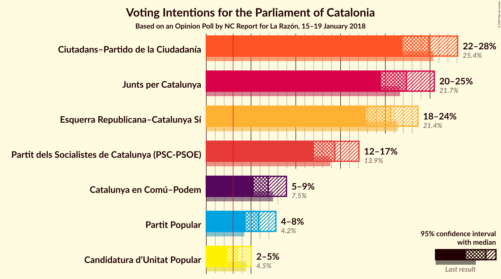
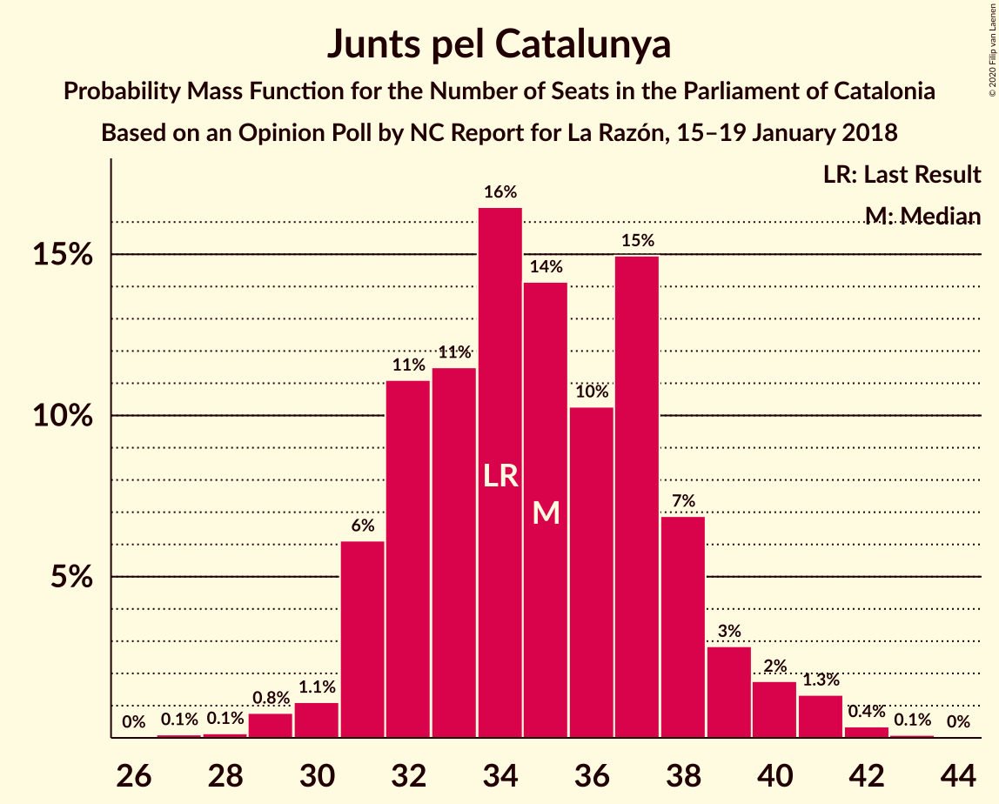
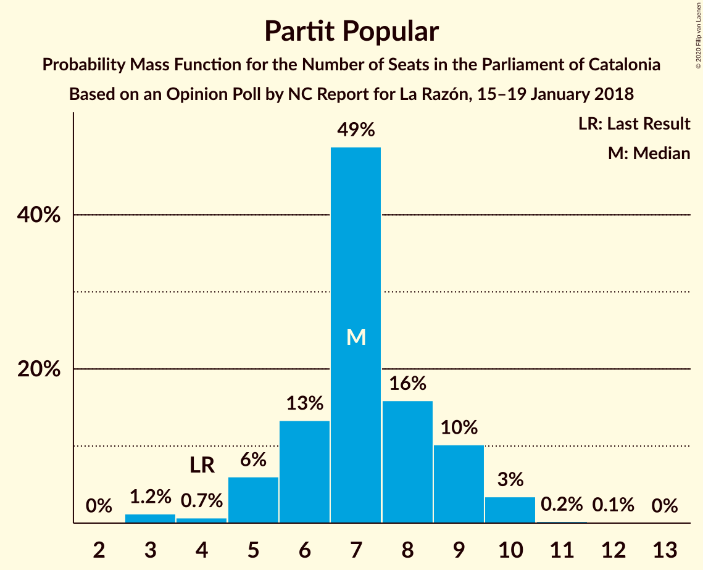
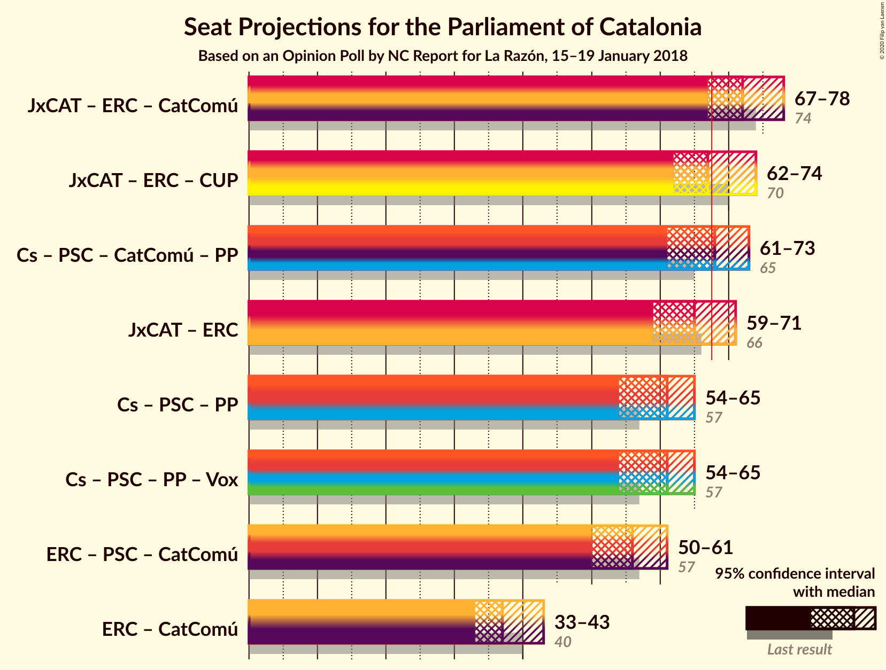
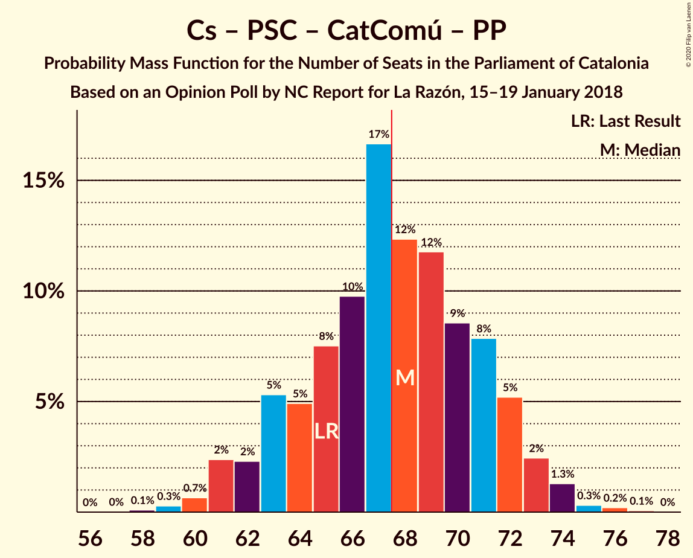
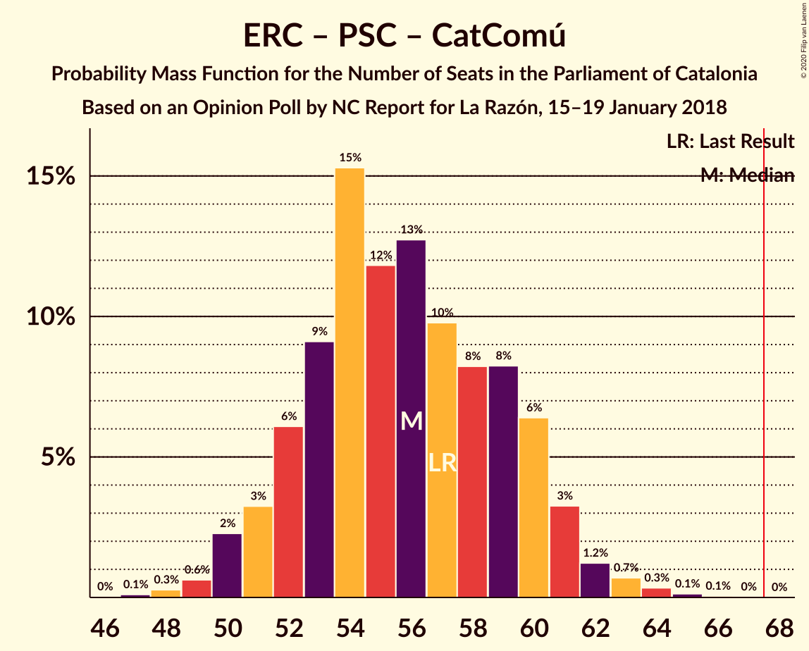

# Opinion Poll by NC Report for La Razón, 15–19 January 2018

<a href="#voting-intentions">Voting Intentions</a> | <a href="#seats">Seats</a> | <a href="#coalitions">Coalitions</a> | <a href="#technical-information">Technical Information</a>

## Voting Intentions

### Confidence Intervals

| Party | Last Result | Poll Result | 80% Confidence Interval | 90% Confidence Interval | 95% Confidence Interval | 99% Confidence Interval |
|:-----:|:-----------:|:-----------:|:-----------------------:|:-----------------------:|:-----------------------:|:-----------------------:|
| Ciutadans–Partido de la Ciudadanía | 25.4% | 24.9% | 22.9–27.0% |22.4–27.6% |21.9–28.1% |21.0–29.1% |
| Junts pel Catalunya | 21.7% | 22.3% | 20.5–24.4% |20.0–25.0% |19.5–25.5% |18.6–26.5% |
| Esquerra Republicana–Catalunya Sí | 21.4% | 20.6% | 18.8–22.6% |18.3–23.2% |17.9–23.7% |17.0–24.6% |
| Partit dels Socialistes de Catalunya (PSC-PSOE) | 13.9% | 14.4% | 12.8–16.1% |12.4–16.6% |12.0–17.1% |11.3–17.9% |
| Catalunya en Comú–Podem | 7.5% | 6.9% | 5.9–8.2% |5.6–8.6% |5.3–9.0% |4.8–9.6% |
| Partit Popular | 4.2% | 5.9% | 4.9–7.1% |4.6–7.5% |4.4–7.8% |4.0–8.4% |
| Candidatura d’Unitat Popular | 4.5% | 3.5% | 2.7–4.5% |2.5–4.8% |2.4–5.0% |2.1–5.6% |

*Note:* The poll result column reflects the actual value used in the calculations. Published results may vary slightly, and in addition be rounded to fewer digits.

## Seats

### Confidence Intervals

| Party | Last Result | Median | 80% Confidence Interval | 90% Confidence Interval | 95% Confidence Interval | 99% Confidence Interval |
|:-----:|:-----------:|:------:|:-----------------------:|:-----------------------:|:-----------------------:|:-----------------------:|
| <a href="#ciutadans–partido-de-la-ciudadanía">Ciutadans–Partido de la Ciudadanía</a> | 36 | 35 | 31–38 |31–38 |30–39 |28–40 |
| <a href="#junts-pel-catalunya">Junts pel Catalunya</a> | 34 | 35 | 32–37 |32–39 |31–40 |29–42 |
| <a href="#esquerra-republicana–catalunya-sí">Esquerra Republicana–Catalunya Sí</a> | 32 | 31 | 28–33 |28–33 |26–34 |25–36 |
| <a href="#partit-dels-socialistes-de-catalunya-(psc-psoe)">Partit dels Socialistes de Catalunya (PSC-PSOE)</a> | 17 | 18 | 16–20 |16–21 |16–23 |15–24 |
| <a href="#catalunya-en-comú–podem">Catalunya en Comú–Podem</a> | 8 | 7 | 5–9 |5–9 |5–11 |4–11 |
| <a href="#partit-popular">Partit Popular</a> | 4 | 7 | 6–9 |5–10 |4–10 |3–11 |
| <a href="#candidatura-d’unitat-popular">Candidatura d’Unitat Popular</a> | 4 | 3 | 0–4 |0–5 |0–6 |0–7 |

### Ciutadans–Partido de la Ciudadanía

*For a full overview of the results for this party, see the [Ciutadans–Partido de la Ciudadanía](party-ciutadans–partidodelaciudadanía.html) page.*

| Number of Seats | Probability | Accumulated | Special Marks |
|:---------------:|:-----------:|:-----------:|:-------------:|
| 27 | 0.1% | 100% |  |
| 28 | 0.5% | 99.9% |  |
| 29 | 0.5% | 99.4% |  |
| 30 | 4% | 98.9% |  |
| 31 | 10% | 95% |  |
| 32 | 8% | 85% |  |
| 33 | 9% | 78% |  |
| 34 | 9% | 69% |  |
| 35 | 12% | 60% | Median |
| 36 | 23% | 48% | Last Result |
| 37 | 13% | 26% |  |
| 38 | 9% | 12% |  |
| 39 | 3% | 4% |  |
| 40 | 0.7% | 0.8% |  |
| 41 | 0.1% | 0.2% |  |
| 42 | 0% | 0.1% |  |
| 43 | 0% | 0% |  |

### Junts pel Catalunya

*For a full overview of the results for this party, see the [Junts pel Catalunya](party-juntspelcatalunya.html) page.*

| Number of Seats | Probability | Accumulated | Special Marks |
|:---------------:|:-----------:|:-----------:|:-------------:|
| 27 | 0.2% | 100% |  |
| 28 | 0.2% | 99.8% |  |
| 29 | 0.9% | 99.6% |  |
| 30 | 0.6% | 98.7% |  |
| 31 | 3% | 98% |  |
| 32 | 8% | 96% |  |
| 33 | 14% | 87% |  |
| 34 | 20% | 74% | Last Result |
| 35 | 13% | 54% | Median |
| 36 | 18% | 41% |  |
| 37 | 13% | 22% |  |
| 38 | 5% | 10% |  |
| 39 | 2% | 5% |  |
| 40 | 1.4% | 3% |  |
| 41 | 1.0% | 2% |  |
| 42 | 0.3% | 0.5% |  |
| 43 | 0.2% | 0.3% |  |
| 44 | 0% | 0.1% |  |
| 45 | 0% | 0% |  |

### Esquerra Republicana–Catalunya Sí

*For a full overview of the results for this party, see the [Esquerra Republicana–Catalunya Sí](party-esquerrarepublicana–catalunyasí.html) page.*

| Number of Seats | Probability | Accumulated | Special Marks |
|:---------------:|:-----------:|:-----------:|:-------------:|
| 22 | 0.1% | 100% |  |
| 23 | 0.2% | 99.9% |  |
| 24 | 0.2% | 99.8% |  |
| 25 | 0.2% | 99.5% |  |
| 26 | 2% | 99.3% |  |
| 27 | 2% | 97% |  |
| 28 | 13% | 95% |  |
| 29 | 22% | 83% |  |
| 30 | 10% | 61% |  |
| 31 | 26% | 51% | Median |
| 32 | 12% | 25% | Last Result |
| 33 | 10% | 13% |  |
| 34 | 1.3% | 4% |  |
| 35 | 1.4% | 2% |  |
| 36 | 0.5% | 0.8% |  |
| 37 | 0.2% | 0.3% |  |
| 38 | 0.1% | 0.2% |  |
| 39 | 0% | 0% |  |

### Partit dels Socialistes de Catalunya (PSC-PSOE)

*For a full overview of the results for this party, see the [Partit dels Socialistes de Catalunya (PSC-PSOE)](party-partitdelssocialistesdecatalunyapsc-psoe.html) page.*

| Number of Seats | Probability | Accumulated | Special Marks |
|:---------------:|:-----------:|:-----------:|:-------------:|
| 13 | 0.2% | 100% |  |
| 14 | 0.1% | 99.8% |  |
| 15 | 2% | 99.7% |  |
| 16 | 9% | 98% |  |
| 17 | 34% | 89% | Last Result |
| 18 | 20% | 55% | Median |
| 19 | 13% | 35% |  |
| 20 | 12% | 22% |  |
| 21 | 5% | 9% |  |
| 22 | 2% | 4% |  |
| 23 | 2% | 3% |  |
| 24 | 0.8% | 1.1% |  |
| 25 | 0.3% | 0.3% |  |
| 26 | 0% | 0% |  |

### Catalunya en Comú–Podem

*For a full overview of the results for this party, see the [Catalunya en Comú–Podem](party-catalunyaencomú–podem.html) page.*

| Number of Seats | Probability | Accumulated | Special Marks |
|:---------------:|:-----------:|:-----------:|:-------------:|
| 4 | 0.9% | 100% |  |
| 5 | 15% | 99.1% |  |
| 6 | 24% | 84% |  |
| 7 | 13% | 60% | Median |
| 8 | 30% | 47% | Last Result |
| 9 | 13% | 17% |  |
| 10 | 1.0% | 4% |  |
| 11 | 3% | 3% |  |
| 12 | 0.3% | 0.4% |  |
| 13 | 0.1% | 0.1% |  |
| 14 | 0% | 0% |  |

### Partit Popular

*For a full overview of the results for this party, see the [Partit Popular](party-partitpopular.html) page.*

| Number of Seats | Probability | Accumulated | Special Marks |
|:---------------:|:-----------:|:-----------:|:-------------:|
| 3 | 2% | 100% |  |
| 4 | 2% | 98% | Last Result |
| 5 | 5% | 97% |  |
| 6 | 15% | 91% |  |
| 7 | 39% | 76% | Median |
| 8 | 20% | 38% |  |
| 9 | 11% | 17% |  |
| 10 | 5% | 6% |  |
| 11 | 0.5% | 0.7% |  |
| 12 | 0.2% | 0.2% |  |
| 13 | 0% | 0% |  |

### Candidatura d’Unitat Popular

*For a full overview of the results for this party, see the [Candidatura d’Unitat Popular](party-candidaturad’unitatpopular.html) page.*

| Number of Seats | Probability | Accumulated | Special Marks |
|:---------------:|:-----------:|:-----------:|:-------------:|
| 0 | 21% | 100% |  |
| 1 | 0% | 79% |  |
| 2 | 28% | 79% |  |
| 3 | 27% | 51% | Median |
| 4 | 14% | 23% | Last Result |
| 5 | 5% | 9% |  |
| 6 | 3% | 5% |  |
| 7 | 1.4% | 2% |  |
| 8 | 0.2% | 0.2% |  |
| 9 | 0% | 0% |  |

## Coalitions

### Confidence Intervals

| Coalition | Last Result | Median | Majority? | 80% Confidence Interval | 90% Confidence Interval | 95% Confidence Interval | 99% Confidence Interval |
|:---------:|:-----------:|:------:|:---------:|:-----------------------:|:-----------------------:|:-----------------------:|:-----------------------:|
| Junts pel Catalunya – Esquerra Republicana–Catalunya Sí – Catalunya en Comú–Podem | 74 | 72 | 97% | 70–75 | 69–76 | 67–77 | 65–81 |
| Junts pel Catalunya – Esquerra Republicana–Catalunya Sí – Candidatura d’Unitat Popular | 70 | 68 | 54% | 64–71 | 63–72 | 63–73 | 60–75 |
| Ciutadans–Partido de la Ciudadanía – Partit dels Socialistes de Catalunya (PSC-PSOE) – Catalunya en Comú–Podem – Partit Popular | 65 | 67 | 46% | 64–71 | 63–72 | 62–72 | 60–75 |
| Junts pel Catalunya – Esquerra Republicana–Catalunya Sí | 66 | 65 | 15% | 62–68 | 61–69 | 60–70 | 58–72 |
| Ciutadans–Partido de la Ciudadanía – Partit dels Socialistes de Catalunya (PSC-PSOE) – Partit Popular | 57 | 61 | 0.9% | 57–63 | 56–64 | 55–64 | 52–68 |
| Esquerra Republicana–Catalunya Sí – Partit dels Socialistes de Catalunya (PSC-PSOE) – Catalunya en Comú–Podem | 57 | 55 | 0% | 52–60 | 52–60 | 51–61 | 50–64 |
| Esquerra Republicana–Catalunya Sí – Catalunya en Comú–Podem | 40 | 37 | 0% | 36–40 | 35–41 | 34–41 | 31–45 |

### Junts pel Catalunya – Esquerra Republicana–Catalunya Sí – Catalunya en Comú–Podem

| Number of Seats | Probability | Accumulated | Special Marks |
|:---------------:|:-----------:|:-----------:|:-------------:|
| 63 | 0.1% | 100% |  |
| 64 | 0.4% | 99.9% |  |
| 65 | 0.6% | 99.5% |  |
| 66 | 0.5% | 98.9% |  |
| 67 | 0.9% | 98% |  |
| 68 | 1.4% | 97% | Majority |
| 69 | 4% | 96% |  |
| 70 | 6% | 92% |  |
| 71 | 23% | 86% |  |
| 72 | 23% | 63% |  |
| 73 | 13% | 41% | Median |
| 74 | 11% | 27% | Last Result |
| 75 | 9% | 16% |  |
| 76 | 3% | 8% |  |
| 77 | 2% | 5% |  |
| 78 | 0.7% | 2% |  |
| 79 | 0.6% | 2% |  |
| 80 | 0.4% | 1.0% |  |
| 81 | 0.4% | 0.6% |  |
| 82 | 0.2% | 0.2% |  |
| 83 | 0% | 0% |  |

### Junts pel Catalunya – Esquerra Republicana–Catalunya Sí – Candidatura d’Unitat Popular

| Number of Seats | Probability | Accumulated | Special Marks |
|:---------------:|:-----------:|:-----------:|:-------------:|
| 58 | 0.1% | 100% |  |
| 59 | 0.2% | 99.9% |  |
| 60 | 0.3% | 99.7% |  |
| 61 | 0.5% | 99.4% |  |
| 62 | 1.3% | 99.0% |  |
| 63 | 4% | 98% |  |
| 64 | 4% | 93% |  |
| 65 | 5% | 90% |  |
| 66 | 12% | 84% |  |
| 67 | 18% | 72% |  |
| 68 | 23% | 54% | Majority |
| 69 | 11% | 31% | Median |
| 70 | 8% | 21% | Last Result |
| 71 | 5% | 13% |  |
| 72 | 5% | 8% |  |
| 73 | 1.4% | 3% |  |
| 74 | 1.1% | 2% |  |
| 75 | 0.4% | 0.8% |  |
| 76 | 0.2% | 0.3% |  |
| 77 | 0.1% | 0.1% |  |
| 78 | 0% | 0% |  |

### Ciutadans–Partido de la Ciudadanía – Partit dels Socialistes de Catalunya (PSC-PSOE) – Catalunya en Comú–Podem – Partit Popular

| Number of Seats | Probability | Accumulated | Special Marks |
|:---------------:|:-----------:|:-----------:|:-------------:|
| 58 | 0.1% | 100% |  |
| 59 | 0.2% | 99.9% |  |
| 60 | 0.4% | 99.7% |  |
| 61 | 1.1% | 99.2% |  |
| 62 | 1.4% | 98% |  |
| 63 | 5% | 97% |  |
| 64 | 5% | 92% |  |
| 65 | 8% | 87% | Last Result |
| 66 | 11% | 79% |  |
| 67 | 23% | 69% | Median |
| 68 | 18% | 46% | Majority |
| 69 | 12% | 28% |  |
| 70 | 5% | 16% |  |
| 71 | 4% | 10% |  |
| 72 | 4% | 7% |  |
| 73 | 1.3% | 2% |  |
| 74 | 0.5% | 1.0% |  |
| 75 | 0.3% | 0.6% |  |
| 76 | 0.2% | 0.3% |  |
| 77 | 0.1% | 0.1% |  |
| 78 | 0% | 0% |  |

### Junts pel Catalunya – Esquerra Republicana–Catalunya Sí

| Number of Seats | Probability | Accumulated | Special Marks |
|:---------------:|:-----------:|:-----------:|:-------------:|
| 56 | 0.1% | 100% |  |
| 57 | 0.2% | 99.9% |  |
| 58 | 0.4% | 99.7% |  |
| 59 | 0.9% | 99.3% |  |
| 60 | 2% | 98% |  |
| 61 | 3% | 97% |  |
| 62 | 6% | 94% |  |
| 63 | 12% | 88% |  |
| 64 | 10% | 76% |  |
| 65 | 21% | 67% |  |
| 66 | 19% | 45% | Last Result, Median |
| 67 | 12% | 27% |  |
| 68 | 8% | 15% | Majority |
| 69 | 3% | 7% |  |
| 70 | 3% | 5% |  |
| 71 | 0.5% | 2% |  |
| 72 | 0.9% | 1.4% |  |
| 73 | 0.2% | 0.5% |  |
| 74 | 0.2% | 0.2% |  |
| 75 | 0% | 0% |  |

### Ciutadans–Partido de la Ciudadanía – Partit dels Socialistes de Catalunya (PSC-PSOE) – Partit Popular

| Number of Seats | Probability | Accumulated | Special Marks |
|:---------------:|:-----------:|:-----------:|:-------------:|
| 50 | 0.1% | 100% |  |
| 51 | 0.2% | 99.9% |  |
| 52 | 0.3% | 99.7% |  |
| 53 | 0.7% | 99.3% |  |
| 54 | 0.7% | 98.7% |  |
| 55 | 3% | 98% |  |
| 56 | 2% | 95% |  |
| 57 | 5% | 93% | Last Result |
| 58 | 10% | 87% |  |
| 59 | 12% | 77% |  |
| 60 | 14% | 66% | Median |
| 61 | 24% | 52% |  |
| 62 | 16% | 28% |  |
| 63 | 5% | 11% |  |
| 64 | 4% | 6% |  |
| 65 | 0.6% | 2% |  |
| 66 | 0.6% | 2% |  |
| 67 | 0.3% | 1.2% |  |
| 68 | 0.6% | 0.9% | Majority |
| 69 | 0.3% | 0.3% |  |
| 70 | 0% | 0% |  |

### Esquerra Republicana–Catalunya Sí – Partit dels Socialistes de Catalunya (PSC-PSOE) – Catalunya en Comú–Podem

| Number of Seats | Probability | Accumulated | Special Marks |
|:---------------:|:-----------:|:-----------:|:-------------:|
| 47 | 0% | 100% |  |
| 48 | 0.1% | 99.9% |  |
| 49 | 0.3% | 99.8% |  |
| 50 | 1.2% | 99.5% |  |
| 51 | 2% | 98% |  |
| 52 | 8% | 97% |  |
| 53 | 12% | 88% |  |
| 54 | 19% | 77% |  |
| 55 | 11% | 58% |  |
| 56 | 12% | 46% | Median |
| 57 | 10% | 34% | Last Result |
| 58 | 6% | 24% |  |
| 59 | 6% | 18% |  |
| 60 | 7% | 11% |  |
| 61 | 2% | 4% |  |
| 62 | 0.5% | 2% |  |
| 63 | 1.1% | 2% |  |
| 64 | 0.7% | 0.9% |  |
| 65 | 0.1% | 0.2% |  |
| 66 | 0.1% | 0.1% |  |
| 67 | 0% | 0% |  |

### Esquerra Republicana–Catalunya Sí – Catalunya en Comú–Podem

| Number of Seats | Probability | Accumulated | Special Marks |
|:---------------:|:-----------:|:-----------:|:-------------:|
| 29 | 0.1% | 100% |  |
| 30 | 0.3% | 99.9% |  |
| 31 | 0.4% | 99.6% |  |
| 32 | 0.5% | 99.2% |  |
| 33 | 0.7% | 98.7% |  |
| 34 | 2% | 98% |  |
| 35 | 6% | 96% |  |
| 36 | 17% | 90% |  |
| 37 | 31% | 73% |  |
| 38 | 20% | 42% | Median |
| 39 | 10% | 22% |  |
| 40 | 7% | 12% | Last Result |
| 41 | 3% | 5% |  |
| 42 | 0.4% | 2% |  |
| 43 | 0.6% | 2% |  |
| 44 | 0.9% | 1.4% |  |
| 45 | 0.3% | 0.5% |  |
| 46 | 0.2% | 0.2% |  |
| 47 | 0% | 0.1% |  |
| 48 | 0% | 0% |  |

## Technical Information

### Opinion Poll

+ **Polling firm:** NC Report
+ **Commissioner(s):** La Razón
+ **Fieldwork period:** 15–19 January 2018

### Calculations

+ **Sample size:** 752
+ **Simulations done:** 131,072
+ **Error estimate:** 1.08%

