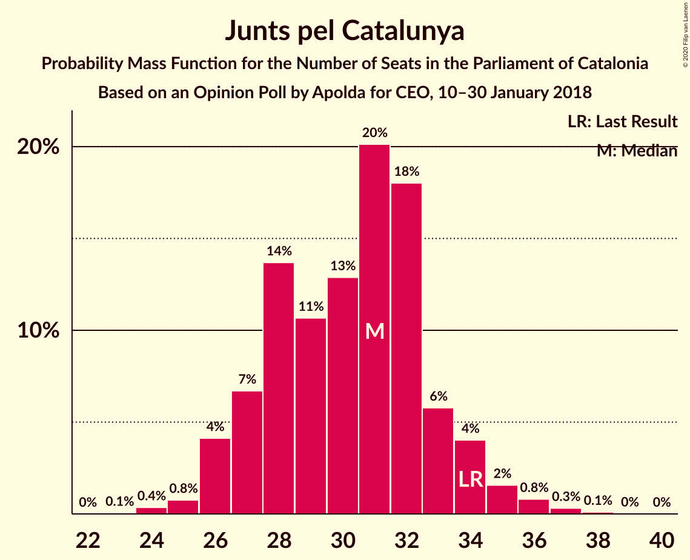
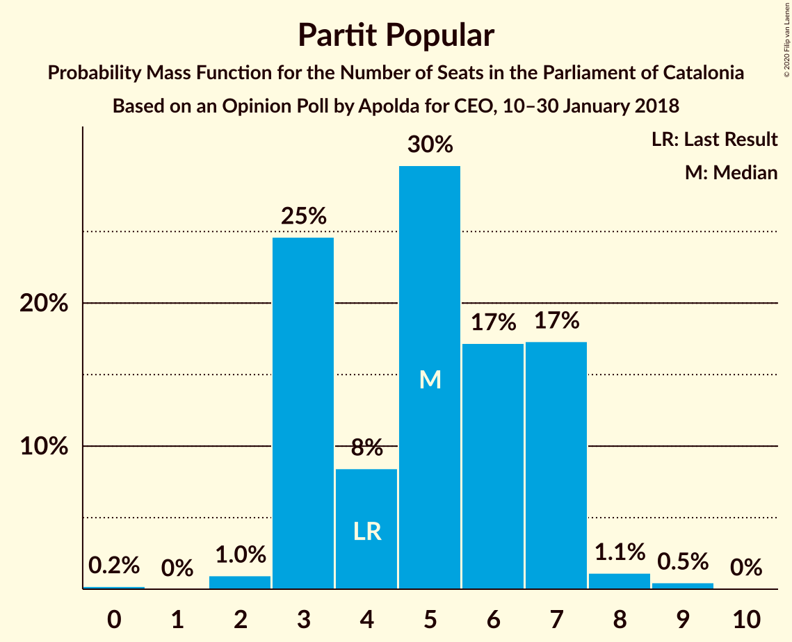

# Opinion Poll by Apolda for CEO, 10–30 January 2018

<a href="#voting-intentions">Voting Intentions</a> | <a href="#seats">Seats</a> | <a href="#coalitions">Coalitions</a> | <a href="#technical-information">Technical Information</a>

## Voting Intentions

### Confidence Intervals

| Party | Last Result | Poll Result | 80% Confidence Interval | 90% Confidence Interval | 95% Confidence Interval | 99% Confidence Interval |
|:-----:|:-----------:|:-----------:|:-----------------------:|:-----------------------:|:-----------------------:|:-----------------------:|
| Ciutadans–Partido de la Ciudadanía | 25.4% | 24.8% | 22.9–26.8% |22.4–27.3% |21.9–27.8% |21.0–28.8% |
| Esquerra Republicana–Catalunya Sí | 21.4% | 22.9% | 21.1–24.9% |20.6–25.4% |20.2–25.9% |19.3–26.9% |
| Junts pel Catalunya | 21.7% | 19.5% | 17.8–21.4% |17.3–21.9% |16.9–22.4% |16.1–23.3% |
| Partit dels Socialistes de Catalunya (PSC-PSOE) | 13.9% | 12.5% | 11.1–14.1% |10.7–14.6% |10.4–15.0% |9.8–15.8% |
| Catalunya en Comú–Podem | 7.5% | 7.4% | 6.3–8.7% |6.0–9.0% |5.7–9.4% |5.3–10.0% |
| Candidatura d’Unitat Popular | 4.5% | 6.0% | 5.1–7.2% |4.8–7.6% |4.6–7.9% |4.1–8.5% |
| Partit Popular | 4.2% | 4.7% | 3.8–5.7% |3.6–6.1% |3.4–6.3% |3.0–6.9% |

*Note:* The poll result column reflects the actual value used in the calculations. Published results may vary slightly, and in addition be rounded to fewer digits.

## Seats

### Confidence Intervals

| Party | Last Result | Median | 80% Confidence Interval | 90% Confidence Interval | 95% Confidence Interval | 99% Confidence Interval |
|:-----:|:-----------:|:------:|:-----------------------:|:-----------------------:|:-----------------------:|:-----------------------:|
| <a href="#ciutadans–partido-de-la-ciudadanía">Ciutadans–Partido de la Ciudadanía</a> | 36 | 34 | 31–38 |30–38 |29–39 |28–39 |
| <a href="#esquerra-republicana–catalunya-sí">Esquerra Republicana–Catalunya Sí</a> | 32 | 33 | 31–36 |30–38 |30–39 |28–40 |
| <a href="#junts-pel-catalunya">Junts pel Catalunya</a> | 34 | 31 | 28–34 |26–34 |26–34 |25–36 |
| <a href="#partit-dels-socialistes-de-catalunya-(psc-psoe)">Partit dels Socialistes de Catalunya (PSC-PSOE)</a> | 17 | 15 | 13–17 |13–18 |13–19 |12–21 |
| <a href="#catalunya-en-comú–podem">Catalunya en Comú–Podem</a> | 8 | 8 | 6–9 |6–11 |5–11 |5–12 |
| <a href="#candidatura-d’unitat-popular">Candidatura d’Unitat Popular</a> | 4 | 8 | 6–9 |6–9 |5–10 |4–11 |
| <a href="#partit-popular">Partit Popular</a> | 4 | 5 | 3–7 |3–7 |3–7 |2–8 |

### Ciutadans–Partido de la Ciudadanía

*For a full overview of the results for this party, see the [Ciutadans–Partido de la Ciudadanía](party-ciutadans–partidodelaciudadanía.html) page.*

| Number of Seats | Probability | Accumulated | Special Marks |
|:---------------:|:-----------:|:-----------:|:-------------:|
| 27 | 0.1% | 100% |  |
| 28 | 0.5% | 99.9% |  |
| 29 | 2% | 99.4% |  |
| 30 | 7% | 97% |  |
| 31 | 5% | 90% |  |
| 32 | 16% | 85% |  |
| 33 | 7% | 69% |  |
| 34 | 19% | 62% | Median |
| 35 | 14% | 42% |  |
| 36 | 9% | 29% | Last Result |
| 37 | 4% | 19% |  |
| 38 | 12% | 15% |  |
| 39 | 3% | 3% |  |
| 40 | 0.2% | 0.5% |  |
| 41 | 0.3% | 0.3% |  |
| 42 | 0% | 0% |  |

### Esquerra Republicana–Catalunya Sí

*For a full overview of the results for this party, see the [Esquerra Republicana–Catalunya Sí](party-esquerrarepublicana–catalunyasí.html) page.*

| Number of Seats | Probability | Accumulated | Special Marks |
|:---------------:|:-----------:|:-----------:|:-------------:|
| 27 | 0.1% | 100% |  |
| 28 | 0.6% | 99.9% |  |
| 29 | 2% | 99.3% |  |
| 30 | 4% | 98% |  |
| 31 | 5% | 94% |  |
| 32 | 12% | 89% | Last Result |
| 33 | 32% | 77% | Median |
| 34 | 10% | 45% |  |
| 35 | 20% | 35% |  |
| 36 | 7% | 16% |  |
| 37 | 4% | 9% |  |
| 38 | 1.2% | 5% |  |
| 39 | 2% | 4% |  |
| 40 | 1.3% | 2% |  |
| 41 | 0.2% | 0.2% |  |
| 42 | 0% | 0.1% |  |
| 43 | 0% | 0% |  |

### Junts pel Catalunya

*For a full overview of the results for this party, see the [Junts pel Catalunya](party-juntspelcatalunya.html) page.*

| Number of Seats | Probability | Accumulated | Special Marks |
|:---------------:|:-----------:|:-----------:|:-------------:|
| 23 | 0.1% | 100% |  |
| 24 | 0.2% | 99.9% |  |
| 25 | 1.1% | 99.7% |  |
| 26 | 4% | 98.7% |  |
| 27 | 3% | 95% |  |
| 28 | 6% | 92% |  |
| 29 | 8% | 86% |  |
| 30 | 16% | 78% |  |
| 31 | 18% | 62% | Median |
| 32 | 22% | 44% |  |
| 33 | 10% | 22% |  |
| 34 | 9% | 12% | Last Result |
| 35 | 2% | 2% |  |
| 36 | 0.5% | 0.7% |  |
| 37 | 0.1% | 0.2% |  |
| 38 | 0% | 0.1% |  |
| 39 | 0% | 0% |  |

### Partit dels Socialistes de Catalunya (PSC-PSOE)

*For a full overview of the results for this party, see the [Partit dels Socialistes de Catalunya (PSC-PSOE)](party-partitdelssocialistesdecatalunyapsc-psoe.html) page.*

| Number of Seats | Probability | Accumulated | Special Marks |
|:---------------:|:-----------:|:-----------:|:-------------:|
| 12 | 1.0% | 100% |  |
| 13 | 9% | 99.0% |  |
| 14 | 2% | 90% |  |
| 15 | 38% | 88% | Median |
| 16 | 29% | 50% |  |
| 17 | 14% | 20% | Last Result |
| 18 | 2% | 6% |  |
| 19 | 3% | 4% |  |
| 20 | 0.8% | 1.3% |  |
| 21 | 0.2% | 0.5% |  |
| 22 | 0.3% | 0.3% |  |
| 23 | 0% | 0% |  |

### Catalunya en Comú–Podem

*For a full overview of the results for this party, see the [Catalunya en Comú–Podem](party-catalunyaencomú–podem.html) page.*

| Number of Seats | Probability | Accumulated | Special Marks |
|:---------------:|:-----------:|:-----------:|:-------------:|
| 4 | 0.1% | 100% |  |
| 5 | 3% | 99.9% |  |
| 6 | 9% | 97% |  |
| 7 | 10% | 88% |  |
| 8 | 42% | 78% | Last Result, Median |
| 9 | 26% | 36% |  |
| 10 | 5% | 10% |  |
| 11 | 4% | 5% |  |
| 12 | 0.2% | 0.7% |  |
| 13 | 0.4% | 0.4% |  |
| 14 | 0% | 0% |  |

### Candidatura d’Unitat Popular

*For a full overview of the results for this party, see the [Candidatura d’Unitat Popular](party-candidaturad’unitatpopular.html) page.*

| Number of Seats | Probability | Accumulated | Special Marks |
|:---------------:|:-----------:|:-----------:|:-------------:|
| 3 | 0.1% | 100% |  |
| 4 | 1.4% | 99.9% | Last Result |
| 5 | 1.4% | 98.6% |  |
| 6 | 14% | 97% |  |
| 7 | 24% | 83% |  |
| 8 | 23% | 59% | Median |
| 9 | 33% | 36% |  |
| 10 | 0.5% | 3% |  |
| 11 | 2% | 2% |  |
| 12 | 0% | 0.1% |  |
| 13 | 0% | 0% |  |

### Partit Popular

*For a full overview of the results for this party, see the [Partit Popular](party-partitpopular.html) page.*

| Number of Seats | Probability | Accumulated | Special Marks |
|:---------------:|:-----------:|:-----------:|:-------------:|
| 0 | 0.3% | 100% |  |
| 1 | 0% | 99.7% |  |
| 2 | 0.6% | 99.7% |  |
| 3 | 29% | 99.1% |  |
| 4 | 6% | 70% | Last Result |
| 5 | 38% | 64% | Median |
| 6 | 10% | 25% |  |
| 7 | 14% | 15% |  |
| 8 | 0.8% | 1.1% |  |
| 9 | 0.3% | 0.3% |  |
| 10 | 0% | 0% |  |

## Coalitions

### Confidence Intervals

| Coalition | Last Result | Median | Majority? | 80% Confidence Interval | 90% Confidence Interval | 95% Confidence Interval | 99% Confidence Interval |
|:---------:|:-----------:|:------:|:---------:|:-----------------------:|:-----------------------:|:-----------------------:|:-----------------------:|
| Esquerra Republicana–Catalunya Sí – Junts pel Catalunya – Catalunya en Comú–Podem | 74 | 72 | 97% | 69–77 | 68–77 | 67–78 | 66–79 |
| Esquerra Republicana–Catalunya Sí – Junts pel Catalunya – Candidatura d’Unitat Popular | 70 | 72 | 96% | 69–76 | 68–77 | 67–77 | 65–79 |
| Esquerra Republicana–Catalunya Sí – Junts pel Catalunya | 66 | 64 | 19% | 61–68 | 60–69 | 59–69 | 58–72 |
| Ciutadans–Partido de la Ciudadanía – Partit dels Socialistes de Catalunya (PSC-PSOE) – Catalunya en Comú–Podem – Partit Popular | 65 | 63 | 4% | 59–66 | 58–67 | 58–68 | 56–70 |
| Esquerra Republicana–Catalunya Sí – Partit dels Socialistes de Catalunya (PSC-PSOE) – Catalunya en Comú–Podem | 57 | 57 | 0% | 54–61 | 53–62 | 52–64 | 51–65 |
| Ciutadans–Partido de la Ciudadanía – Partit dels Socialistes de Catalunya (PSC-PSOE) – Partit Popular | 57 | 54 | 0% | 51–58 | 50–59 | 50–60 | 48–62 |
| Esquerra Republicana–Catalunya Sí – Catalunya en Comú–Podem | 40 | 42 | 0% | 39–45 | 37–46 | 37–47 | 36–49 |

### Esquerra Republicana–Catalunya Sí – Junts pel Catalunya – Catalunya en Comú–Podem

| Number of Seats | Probability | Accumulated | Special Marks |
|:---------------:|:-----------:|:-----------:|:-------------:|
| 64 | 0.1% | 100% |  |
| 65 | 0.2% | 99.9% |  |
| 66 | 0.6% | 99.7% |  |
| 67 | 2% | 99.0% |  |
| 68 | 4% | 97% | Majority |
| 69 | 4% | 93% |  |
| 70 | 8% | 89% |  |
| 71 | 7% | 81% |  |
| 72 | 26% | 73% | Median |
| 73 | 13% | 48% |  |
| 74 | 9% | 35% | Last Result |
| 75 | 5% | 26% |  |
| 76 | 7% | 21% |  |
| 77 | 11% | 14% |  |
| 78 | 2% | 3% |  |
| 79 | 1.0% | 1.1% |  |
| 80 | 0.1% | 0.2% |  |
| 81 | 0.1% | 0.1% |  |
| 82 | 0% | 0% |  |

### Esquerra Republicana–Catalunya Sí – Junts pel Catalunya – Candidatura d’Unitat Popular

| Number of Seats | Probability | Accumulated | Special Marks |
|:---------------:|:-----------:|:-----------:|:-------------:|
| 63 | 0.1% | 100% |  |
| 64 | 0.1% | 99.9% |  |
| 65 | 0.4% | 99.8% |  |
| 66 | 1.3% | 99.4% |  |
| 67 | 2% | 98% |  |
| 68 | 4% | 96% | Majority |
| 69 | 5% | 92% |  |
| 70 | 9% | 87% | Last Result |
| 71 | 10% | 78% |  |
| 72 | 21% | 69% | Median |
| 73 | 17% | 48% |  |
| 74 | 10% | 30% |  |
| 75 | 8% | 20% |  |
| 76 | 4% | 13% |  |
| 77 | 7% | 9% |  |
| 78 | 0.6% | 2% |  |
| 79 | 0.7% | 0.9% |  |
| 80 | 0.1% | 0.2% |  |
| 81 | 0.1% | 0.1% |  |
| 82 | 0% | 0% |  |

### Esquerra Republicana–Catalunya Sí – Junts pel Catalunya

| Number of Seats | Probability | Accumulated | Special Marks |
|:---------------:|:-----------:|:-----------:|:-------------:|
| 55 | 0% | 100% |  |
| 56 | 0.1% | 99.9% |  |
| 57 | 0.2% | 99.9% |  |
| 58 | 0.5% | 99.7% |  |
| 59 | 2% | 99.2% |  |
| 60 | 3% | 97% |  |
| 61 | 6% | 95% |  |
| 62 | 5% | 88% |  |
| 63 | 18% | 83% |  |
| 64 | 18% | 65% | Median |
| 65 | 13% | 47% |  |
| 66 | 11% | 35% | Last Result |
| 67 | 6% | 24% |  |
| 68 | 10% | 19% | Majority |
| 69 | 7% | 9% |  |
| 70 | 1.0% | 2% |  |
| 71 | 0.3% | 0.9% |  |
| 72 | 0.5% | 0.6% |  |
| 73 | 0.1% | 0.1% |  |
| 74 | 0% | 0% |  |

### Ciutadans–Partido de la Ciudadanía – Partit dels Socialistes de Catalunya (PSC-PSOE) – Catalunya en Comú–Podem – Partit Popular

| Number of Seats | Probability | Accumulated | Special Marks |
|:---------------:|:-----------:|:-----------:|:-------------:|
| 54 | 0.1% | 100% |  |
| 55 | 0.1% | 99.9% |  |
| 56 | 0.7% | 99.8% |  |
| 57 | 0.6% | 99.1% |  |
| 58 | 7% | 98% |  |
| 59 | 4% | 91% |  |
| 60 | 8% | 87% |  |
| 61 | 10% | 80% |  |
| 62 | 17% | 70% | Median |
| 63 | 21% | 52% |  |
| 64 | 10% | 31% |  |
| 65 | 9% | 22% | Last Result |
| 66 | 5% | 13% |  |
| 67 | 4% | 8% |  |
| 68 | 2% | 4% | Majority |
| 69 | 1.3% | 2% |  |
| 70 | 0.4% | 0.6% |  |
| 71 | 0.1% | 0.2% |  |
| 72 | 0.1% | 0.1% |  |
| 73 | 0% | 0% |  |

### Esquerra Republicana–Catalunya Sí – Partit dels Socialistes de Catalunya (PSC-PSOE) – Catalunya en Comú–Podem

| Number of Seats | Probability | Accumulated | Special Marks |
|:---------------:|:-----------:|:-----------:|:-------------:|
| 50 | 0.1% | 100% |  |
| 51 | 1.0% | 99.9% |  |
| 52 | 3% | 98.9% |  |
| 53 | 2% | 96% |  |
| 54 | 4% | 94% |  |
| 55 | 11% | 89% |  |
| 56 | 16% | 79% | Median |
| 57 | 17% | 62% | Last Result |
| 58 | 15% | 45% |  |
| 59 | 9% | 30% |  |
| 60 | 9% | 22% |  |
| 61 | 4% | 13% |  |
| 62 | 5% | 9% |  |
| 63 | 1.2% | 4% |  |
| 64 | 2% | 3% |  |
| 65 | 0.7% | 1.0% |  |
| 66 | 0.2% | 0.3% |  |
| 67 | 0.1% | 0.1% |  |
| 68 | 0% | 0% | Majority |

### Ciutadans–Partido de la Ciudadanía – Partit dels Socialistes de Catalunya (PSC-PSOE) – Partit Popular

| Number of Seats | Probability | Accumulated | Special Marks |
|:---------------:|:-----------:|:-----------:|:-------------:|
| 47 | 0.1% | 100% |  |
| 48 | 0.6% | 99.8% |  |
| 49 | 0.8% | 99.2% |  |
| 50 | 7% | 98% |  |
| 51 | 8% | 91% |  |
| 52 | 9% | 84% |  |
| 53 | 5% | 74% |  |
| 54 | 28% | 69% | Median |
| 55 | 7% | 42% |  |
| 56 | 14% | 35% |  |
| 57 | 8% | 21% | Last Result |
| 58 | 5% | 14% |  |
| 59 | 5% | 9% |  |
| 60 | 2% | 4% |  |
| 61 | 0.8% | 2% |  |
| 62 | 0.6% | 0.8% |  |
| 63 | 0.1% | 0.2% |  |
| 64 | 0% | 0% |  |

### Esquerra Republicana–Catalunya Sí – Catalunya en Comú–Podem

| Number of Seats | Probability | Accumulated | Special Marks |
|:---------------:|:-----------:|:-----------:|:-------------:|
| 34 | 0.1% | 100% |  |
| 35 | 0.4% | 99.9% |  |
| 36 | 0.9% | 99.5% |  |
| 37 | 4% | 98.6% |  |
| 38 | 3% | 95% |  |
| 39 | 6% | 92% |  |
| 40 | 15% | 85% | Last Result |
| 41 | 14% | 71% | Median |
| 42 | 19% | 57% |  |
| 43 | 13% | 39% |  |
| 44 | 16% | 26% |  |
| 45 | 5% | 11% |  |
| 46 | 1.3% | 5% |  |
| 47 | 2% | 4% |  |
| 48 | 1.4% | 2% |  |
| 49 | 0.5% | 0.6% |  |
| 50 | 0.1% | 0.2% |  |
| 51 | 0% | 0.1% |  |
| 52 | 0% | 0% |  |

## Technical Information

### Opinion Poll

+ **Polling firm:** Apolda
+ **Commissioner(s):** CEO
+ **Fieldwork period:** 10–30 January 2018

### Calculations

+ **Sample size:** 816
+ **Simulations done:** 65,536
+ **Error estimate:** 2.64%

