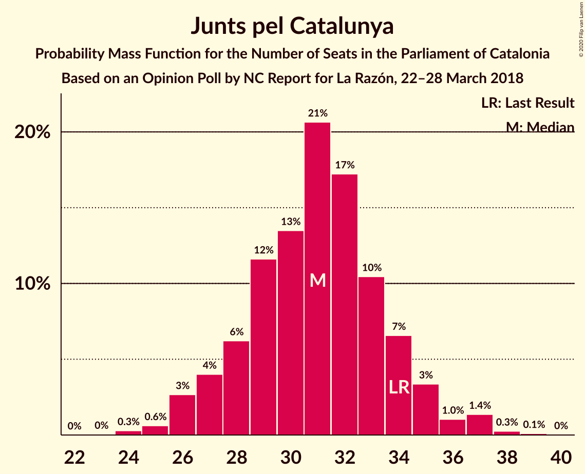
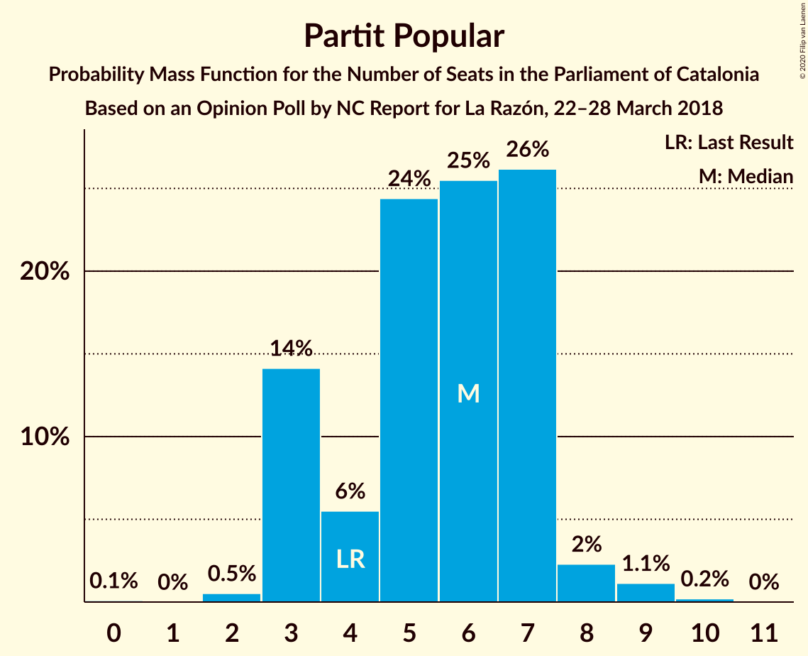
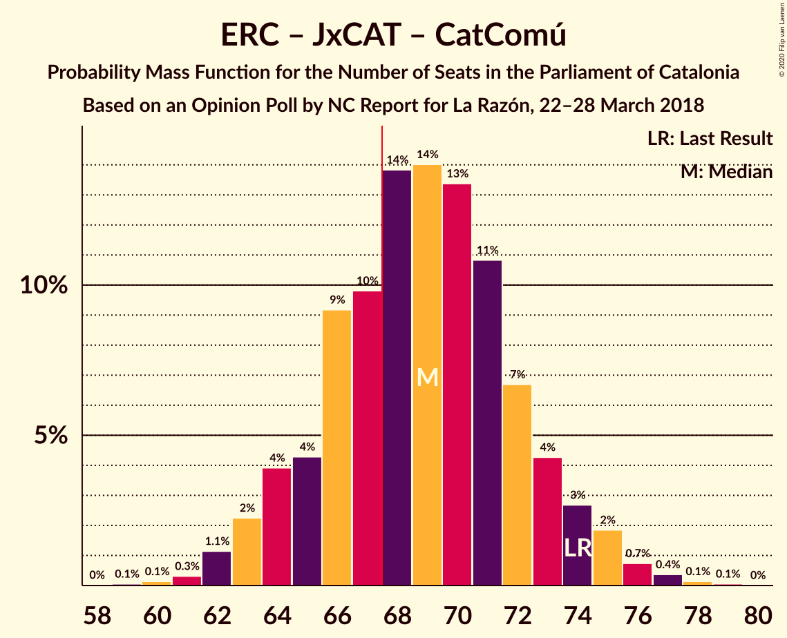
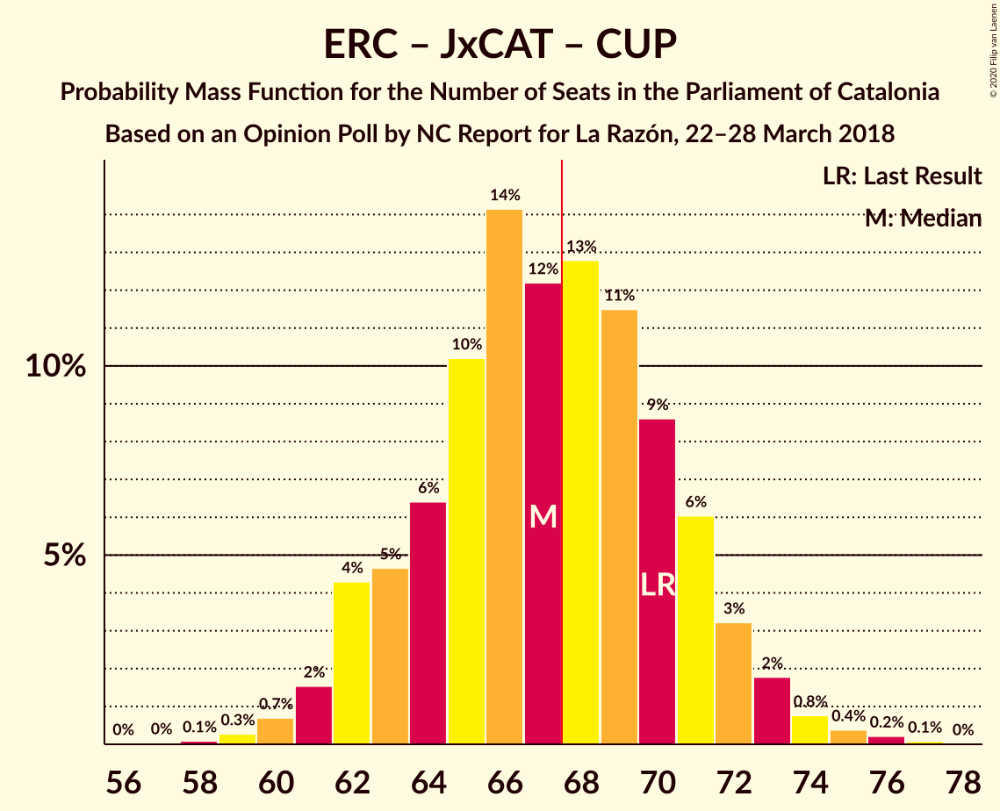

# Opinion Poll by NC Report for La Razón, 22–28 March 2018

<a href="#voting-intentions">Voting Intentions</a> | <a href="#seats">Seats</a> | <a href="#coalitions">Coalitions</a> | <a href="#technical-information">Technical Information</a>

## Voting Intentions

### Confidence Intervals

| Party | Last Result | Poll Result | 80% Confidence Interval | 90% Confidence Interval | 95% Confidence Interval | 99% Confidence Interval |
|:-----:|:-----------:|:-----------:|:-----------------------:|:-----------------------:|:-----------------------:|:-----------------------:|
| Ciutadans–Partido de la Ciudadanía | 25.4% | 25.7% | 23.7–27.8% |23.2–28.3% |22.7–28.9% |21.8–29.9% |
| Esquerra Republicana–Catalunya Sí | 21.4% | 21.0% | 19.2–22.9% |18.7–23.5% |18.2–24.0% |17.4–25.0% |
| Junts pel Catalunya | 21.7% | 19.4% | 17.7–21.3% |17.2–21.9% |16.8–22.4% |16.0–23.3% |
| Partit dels Socialistes de Catalunya (PSC-PSOE) | 13.9% | 14.8% | 13.3–16.6% |12.9–17.1% |12.5–17.5% |11.8–18.4% |
| Catalunya en Comú–Podem | 7.5% | 6.0% | 5.0–7.2% |4.7–7.6% |4.5–7.9% |4.1–8.5% |
| Partit Popular | 4.2% | 4.8% | 4.0–6.0% |3.7–6.3% |3.5–6.6% |3.1–7.2% |
| Candidatura d’Unitat Popular | 4.5% | 4.2% | 3.4–5.2% |3.2–5.6% |3.0–5.8% |2.6–6.4% |

*Note:* The poll result column reflects the actual value used in the calculations. Published results may vary slightly, and in addition be rounded to fewer digits.

## Seats

### Confidence Intervals

| Party | Last Result | Median | 80% Confidence Interval | 90% Confidence Interval | 95% Confidence Interval | 99% Confidence Interval |
|:-----:|:-----------:|:------:|:-----------------------:|:-----------------------:|:-----------------------:|:-----------------------:|
| <a href="#ciutadans–partido-de-la-ciudadanía">Ciutadans–Partido de la Ciudadanía</a> | 36 | 37 | 33–39 |32–40 |31–41 |30–43 |
| <a href="#esquerra-republicana–catalunya-sí">Esquerra Republicana–Catalunya Sí</a> | 32 | 32 | 28–35 |28–35 |27–36 |26–38 |
| <a href="#junts-pel-catalunya">Junts pel Catalunya</a> | 34 | 31 | 28–34 |27–35 |26–36 |25–37 |
| <a href="#partit-dels-socialistes-de-catalunya-(psc-psoe)">Partit dels Socialistes de Catalunya (PSC-PSOE)</a> | 17 | 19 | 17–23 |16–24 |16–24 |15–25 |
| <a href="#catalunya-en-comú–podem">Catalunya en Comú–Podem</a> | 8 | 6 | 5–8 |4–8 |4–9 |4–10 |
| <a href="#partit-popular">Partit Popular</a> | 4 | 6 | 3–7 |3–7 |3–8 |2–9 |
| <a href="#candidatura-d’unitat-popular">Candidatura d’Unitat Popular</a> | 4 | 4 | 3–7 |2–8 |0–8 |0–8 |

### Ciutadans–Partido de la Ciudadanía

*For a full overview of the results for this party, see the [Ciutadans–Partido de la Ciudadanía](party-ciutadans–partidodelaciudadanía.html) page.*

| Number of Seats | Probability | Accumulated | Special Marks |
|:---------------:|:-----------:|:-----------:|:-------------:|
| 28 | 0% | 100% |  |
| 29 | 0.1% | 99.9% |  |
| 30 | 0.5% | 99.9% |  |
| 31 | 3% | 99.3% |  |
| 32 | 2% | 97% |  |
| 33 | 6% | 94% |  |
| 34 | 5% | 88% |  |
| 35 | 13% | 83% |  |
| 36 | 9% | 70% | Last Result |
| 37 | 23% | 60% | Median |
| 38 | 21% | 37% |  |
| 39 | 10% | 16% |  |
| 40 | 3% | 7% |  |
| 41 | 2% | 4% |  |
| 42 | 0.6% | 2% |  |
| 43 | 0.5% | 1.0% |  |
| 44 | 0.3% | 0.5% |  |
| 45 | 0.1% | 0.2% |  |
| 46 | 0% | 0% |  |

### Esquerra Republicana–Catalunya Sí

*For a full overview of the results for this party, see the [Esquerra Republicana–Catalunya Sí](party-esquerrarepublicana–catalunyasí.html) page.*

| Number of Seats | Probability | Accumulated | Special Marks |
|:---------------:|:-----------:|:-----------:|:-------------:|
| 24 | 0.1% | 100% |  |
| 25 | 0.1% | 99.9% |  |
| 26 | 1.2% | 99.8% |  |
| 27 | 2% | 98.6% |  |
| 28 | 7% | 96% |  |
| 29 | 11% | 89% |  |
| 30 | 9% | 78% |  |
| 31 | 11% | 69% |  |
| 32 | 22% | 58% | Last Result, Median |
| 33 | 17% | 35% |  |
| 34 | 8% | 19% |  |
| 35 | 6% | 11% |  |
| 36 | 2% | 4% |  |
| 37 | 1.2% | 2% |  |
| 38 | 0.9% | 1.3% |  |
| 39 | 0.3% | 0.4% |  |
| 40 | 0.1% | 0.1% |  |
| 41 | 0% | 0% |  |

### Junts pel Catalunya

*For a full overview of the results for this party, see the [Junts pel Catalunya](party-juntspelcatalunya.html) page.*

| Number of Seats | Probability | Accumulated | Special Marks |
|:---------------:|:-----------:|:-----------:|:-------------:|
| 24 | 0.3% | 100% |  |
| 25 | 0.6% | 99.7% |  |
| 26 | 3% | 99.1% |  |
| 27 | 4% | 96% |  |
| 28 | 6% | 92% |  |
| 29 | 12% | 86% |  |
| 30 | 13% | 75% |  |
| 31 | 21% | 61% | Median |
| 32 | 17% | 40% |  |
| 33 | 10% | 23% |  |
| 34 | 7% | 13% | Last Result |
| 35 | 3% | 6% |  |
| 36 | 1.0% | 3% |  |
| 37 | 1.4% | 2% |  |
| 38 | 0.3% | 0.4% |  |
| 39 | 0.1% | 0.1% |  |
| 40 | 0% | 0% |  |

### Partit dels Socialistes de Catalunya (PSC-PSOE)

*For a full overview of the results for this party, see the [Partit dels Socialistes de Catalunya (PSC-PSOE)](party-partitdelssocialistesdecatalunyapsc-psoe.html) page.*

| Number of Seats | Probability | Accumulated | Special Marks |
|:---------------:|:-----------:|:-----------:|:-------------:|
| 15 | 0.7% | 100% |  |
| 16 | 6% | 99.2% |  |
| 17 | 14% | 94% | Last Result |
| 18 | 21% | 79% |  |
| 19 | 10% | 58% | Median |
| 20 | 16% | 48% |  |
| 21 | 11% | 31% |  |
| 22 | 6% | 20% |  |
| 23 | 8% | 14% |  |
| 24 | 5% | 6% |  |
| 25 | 1.0% | 1.1% |  |
| 26 | 0.1% | 0.1% |  |
| 27 | 0% | 0% |  |

### Catalunya en Comú–Podem

*For a full overview of the results for this party, see the [Catalunya en Comú–Podem](party-catalunyaencomú–podem.html) page.*

| Number of Seats | Probability | Accumulated | Special Marks |
|:---------------:|:-----------:|:-----------:|:-------------:|
| 3 | 0.2% | 100% |  |
| 4 | 6% | 99.8% |  |
| 5 | 32% | 94% |  |
| 6 | 20% | 62% | Median |
| 7 | 20% | 42% |  |
| 8 | 19% | 22% | Last Result |
| 9 | 3% | 3% |  |
| 10 | 0.4% | 0.7% |  |
| 11 | 0.3% | 0.3% |  |
| 12 | 0% | 0% |  |

### Partit Popular

*For a full overview of the results for this party, see the [Partit Popular](party-partitpopular.html) page.*

| Number of Seats | Probability | Accumulated | Special Marks |
|:---------------:|:-----------:|:-----------:|:-------------:|
| 0 | 0.1% | 100% |  |
| 1 | 0% | 99.9% |  |
| 2 | 0.5% | 99.9% |  |
| 3 | 14% | 99.4% |  |
| 4 | 6% | 85% | Last Result |
| 5 | 24% | 80% |  |
| 6 | 25% | 55% | Median |
| 7 | 26% | 30% |  |
| 8 | 2% | 4% |  |
| 9 | 1.1% | 1.4% |  |
| 10 | 0.2% | 0.2% |  |
| 11 | 0% | 0% |  |

### Candidatura d’Unitat Popular

*For a full overview of the results for this party, see the [Candidatura d’Unitat Popular](party-candidaturad’unitatpopular.html) page.*

| Number of Seats | Probability | Accumulated | Special Marks |
|:---------------:|:-----------:|:-----------:|:-------------:|
| 0 | 3% | 100% |  |
| 1 | 0% | 97% |  |
| 2 | 6% | 97% |  |
| 3 | 20% | 91% |  |
| 4 | 30% | 71% | Last Result, Median |
| 5 | 8% | 41% |  |
| 6 | 17% | 33% |  |
| 7 | 11% | 16% |  |
| 8 | 5% | 5% |  |
| 9 | 0.2% | 0.2% |  |
| 10 | 0% | 0% |  |

## Coalitions

### Confidence Intervals

| Coalition | Last Result | Median | Majority? | 80% Confidence Interval | 90% Confidence Interval | 95% Confidence Interval | 99% Confidence Interval |
|:---------:|:-----------:|:------:|:---------:|:-----------------------:|:-----------------------:|:-----------------------:|:-----------------------:|
| Esquerra Republicana–Catalunya Sí – Junts pel Catalunya – Catalunya en Comú–Podem | 74 | 69 | 69% | 65–73 | 64–74 | 63–75 | 61–77 |
| Ciutadans–Partido de la Ciudadanía – Partit dels Socialistes de Catalunya (PSC-PSOE) – Catalunya en Comú–Podem – Partit Popular | 65 | 68 | 55% | 64–72 | 63–73 | 62–74 | 60–75 |
| Esquerra Republicana–Catalunya Sí – Junts pel Catalunya – Candidatura d’Unitat Popular | 70 | 67 | 45% | 63–71 | 62–72 | 61–73 | 60–75 |
| Esquerra Republicana–Catalunya Sí – Junts pel Catalunya | 66 | 63 | 4% | 59–66 | 58–67 | 57–68 | 55–70 |
| Ciutadans–Partido de la Ciudadanía – Partit dels Socialistes de Catalunya (PSC-PSOE) – Partit Popular | 57 | 62 | 3% | 58–65 | 57–67 | 56–68 | 54–69 |
| Esquerra Republicana–Catalunya Sí – Partit dels Socialistes de Catalunya (PSC-PSOE) – Catalunya en Comú–Podem | 57 | 57 | 0% | 53–61 | 52–62 | 52–63 | 50–65 |
| Esquerra Republicana–Catalunya Sí – Catalunya en Comú–Podem | 40 | 38 | 0% | 34–41 | 34–42 | 33–43 | 31–45 |

### Esquerra Republicana–Catalunya Sí – Junts pel Catalunya – Catalunya en Comú–Podem

| Number of Seats | Probability | Accumulated | Special Marks |
|:---------------:|:-----------:|:-----------:|:-------------:|
| 59 | 0.1% | 100% |  |
| 60 | 0.1% | 99.9% |  |
| 61 | 0.3% | 99.8% |  |
| 62 | 1.1% | 99.5% |  |
| 63 | 2% | 98% |  |
| 64 | 4% | 96% |  |
| 65 | 4% | 92% |  |
| 66 | 9% | 88% |  |
| 67 | 10% | 79% |  |
| 68 | 14% | 69% | Majority |
| 69 | 14% | 55% | Median |
| 70 | 13% | 41% |  |
| 71 | 11% | 28% |  |
| 72 | 7% | 17% |  |
| 73 | 4% | 10% |  |
| 74 | 3% | 6% | Last Result |
| 75 | 2% | 3% |  |
| 76 | 0.7% | 1.3% |  |
| 77 | 0.4% | 0.6% |  |
| 78 | 0.1% | 0.2% |  |
| 79 | 0.1% | 0.1% |  |
| 80 | 0% | 0% |  |

### Ciutadans–Partido de la Ciudadanía – Partit dels Socialistes de Catalunya (PSC-PSOE) – Catalunya en Comú–Podem – Partit Popular

| Number of Seats | Probability | Accumulated | Special Marks |
|:---------------:|:-----------:|:-----------:|:-------------:|
| 58 | 0.1% | 100% |  |
| 59 | 0.2% | 99.9% |  |
| 60 | 0.4% | 99.7% |  |
| 61 | 0.8% | 99.3% |  |
| 62 | 2% | 98.5% |  |
| 63 | 3% | 97% |  |
| 64 | 6% | 94% |  |
| 65 | 9% | 87% | Last Result |
| 66 | 11% | 79% |  |
| 67 | 13% | 67% |  |
| 68 | 12% | 55% | Median, Majority |
| 69 | 14% | 42% |  |
| 70 | 10% | 28% |  |
| 71 | 6% | 18% |  |
| 72 | 5% | 12% |  |
| 73 | 4% | 7% |  |
| 74 | 2% | 3% |  |
| 75 | 0.7% | 1.1% |  |
| 76 | 0.3% | 0.4% |  |
| 77 | 0.1% | 0.2% |  |
| 78 | 0% | 0.1% |  |
| 79 | 0% | 0% |  |

### Esquerra Republicana–Catalunya Sí – Junts pel Catalunya – Candidatura d’Unitat Popular

| Number of Seats | Probability | Accumulated | Special Marks |
|:---------------:|:-----------:|:-----------:|:-------------:|
| 57 | 0% | 100% |  |
| 58 | 0.1% | 99.9% |  |
| 59 | 0.3% | 99.8% |  |
| 60 | 0.7% | 99.6% |  |
| 61 | 2% | 98.9% |  |
| 62 | 4% | 97% |  |
| 63 | 5% | 93% |  |
| 64 | 6% | 88% |  |
| 65 | 10% | 82% |  |
| 66 | 14% | 72% |  |
| 67 | 12% | 58% | Median |
| 68 | 13% | 45% | Majority |
| 69 | 11% | 33% |  |
| 70 | 9% | 21% | Last Result |
| 71 | 6% | 13% |  |
| 72 | 3% | 6% |  |
| 73 | 2% | 3% |  |
| 74 | 0.8% | 1.5% |  |
| 75 | 0.4% | 0.7% |  |
| 76 | 0.2% | 0.3% |  |
| 77 | 0.1% | 0.1% |  |
| 78 | 0% | 0% |  |

### Esquerra Republicana–Catalunya Sí – Junts pel Catalunya

| Number of Seats | Probability | Accumulated | Special Marks |
|:---------------:|:-----------:|:-----------:|:-------------:|
| 53 | 0% | 100% |  |
| 54 | 0.2% | 99.9% |  |
| 55 | 0.5% | 99.8% |  |
| 56 | 0.9% | 99.2% |  |
| 57 | 2% | 98% |  |
| 58 | 5% | 96% |  |
| 59 | 8% | 91% |  |
| 60 | 6% | 84% |  |
| 61 | 11% | 78% |  |
| 62 | 16% | 67% |  |
| 63 | 13% | 51% | Median |
| 64 | 14% | 39% |  |
| 65 | 9% | 25% |  |
| 66 | 8% | 15% | Last Result |
| 67 | 3% | 7% |  |
| 68 | 2% | 4% | Majority |
| 69 | 1.1% | 2% |  |
| 70 | 0.8% | 1.2% |  |
| 71 | 0.3% | 0.4% |  |
| 72 | 0.1% | 0.1% |  |
| 73 | 0% | 0% |  |

### Ciutadans–Partido de la Ciudadanía – Partit dels Socialistes de Catalunya (PSC-PSOE) – Partit Popular

| Number of Seats | Probability | Accumulated | Special Marks |
|:---------------:|:-----------:|:-----------:|:-------------:|
| 52 | 0.1% | 100% |  |
| 53 | 0.2% | 99.9% |  |
| 54 | 0.4% | 99.6% |  |
| 55 | 1.0% | 99.3% |  |
| 56 | 2% | 98% |  |
| 57 | 5% | 96% | Last Result |
| 58 | 7% | 92% |  |
| 59 | 10% | 85% |  |
| 60 | 9% | 75% |  |
| 61 | 14% | 66% |  |
| 62 | 13% | 53% | Median |
| 63 | 15% | 40% |  |
| 64 | 9% | 25% |  |
| 65 | 6% | 16% |  |
| 66 | 4% | 10% |  |
| 67 | 3% | 5% |  |
| 68 | 2% | 3% | Majority |
| 69 | 0.6% | 1.0% |  |
| 70 | 0.2% | 0.4% |  |
| 71 | 0.1% | 0.1% |  |
| 72 | 0% | 0% |  |

### Esquerra Republicana–Catalunya Sí – Partit dels Socialistes de Catalunya (PSC-PSOE) – Catalunya en Comú–Podem

| Number of Seats | Probability | Accumulated | Special Marks |
|:---------------:|:-----------:|:-----------:|:-------------:|
| 48 | 0% | 100% |  |
| 49 | 0.2% | 99.9% |  |
| 50 | 0.6% | 99.8% |  |
| 51 | 2% | 99.2% |  |
| 52 | 3% | 98% |  |
| 53 | 5% | 95% |  |
| 54 | 6% | 90% |  |
| 55 | 10% | 83% |  |
| 56 | 13% | 73% |  |
| 57 | 12% | 60% | Last Result, Median |
| 58 | 12% | 49% |  |
| 59 | 12% | 36% |  |
| 60 | 10% | 24% |  |
| 61 | 6% | 14% |  |
| 62 | 4% | 8% |  |
| 63 | 2% | 4% |  |
| 64 | 1.2% | 2% |  |
| 65 | 0.5% | 0.9% |  |
| 66 | 0.3% | 0.4% |  |
| 67 | 0.1% | 0.1% |  |
| 68 | 0% | 0% | Majority |

### Esquerra Republicana–Catalunya Sí – Catalunya en Comú–Podem

| Number of Seats | Probability | Accumulated | Special Marks |
|:---------------:|:-----------:|:-----------:|:-------------:|
| 30 | 0.1% | 100% |  |
| 31 | 0.4% | 99.9% |  |
| 32 | 1.1% | 99.4% |  |
| 33 | 3% | 98% |  |
| 34 | 6% | 95% |  |
| 35 | 8% | 90% |  |
| 36 | 11% | 82% |  |
| 37 | 15% | 71% |  |
| 38 | 17% | 56% | Median |
| 39 | 13% | 39% |  |
| 40 | 12% | 26% | Last Result |
| 41 | 6% | 14% |  |
| 42 | 5% | 9% |  |
| 43 | 2% | 4% |  |
| 44 | 0.9% | 2% |  |
| 45 | 0.3% | 0.6% |  |
| 46 | 0.2% | 0.2% |  |
| 47 | 0.1% | 0.1% |  |
| 48 | 0% | 0% |  |

## Technical Information

### Opinion Poll

+ **Polling firm:** NC Report
+ **Commissioner(s):** La Razón
+ **Fieldwork period:** 22–28 March 2018

### Calculations

+ **Sample size:** 768
+ **Simulations done:** 1,048,576
+ **Error estimate:** 1.68%

