# Opinion Poll by NC Report for La Razón, 17–20 April 2018

<a href="#voting-intentions">Voting Intentions</a> | <a href="#seats">Seats</a> | <a href="#coalitions">Coalitions</a> | <a href="#technical-information">Technical Information</a>

## Voting Intentions

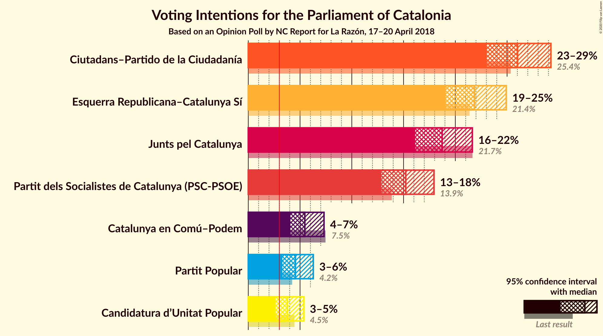

### Confidence Intervals

| Party | Last Result | Poll Result | 80% Confidence Interval | 90% Confidence Interval | 95% Confidence Interval | 99% Confidence Interval |
|:-----:|:-----------:|:-----------:|:-----------------------:|:-----------------------:|:-----------------------:|:-----------------------:|
| Ciutadans–Partido de la Ciudadanía | 25.4% | 26.0% | 24.1–28.1% |23.5–28.7% |23.0–29.2% |22.1–30.3% |
| Esquerra Republicana–Catalunya Sí | 21.4% | 21.8% | 20.0–23.9% |19.5–24.4% |19.1–24.9% |18.2–25.9% |
| Junts per Catalunya | 21.7% | 18.7% | 17.0–20.6% |16.5–21.2% |16.1–21.6% |15.3–22.6% |
| Partit dels Socialistes de Catalunya (PSC-PSOE) | 13.9% | 15.2% | 13.7–17.0% |13.2–17.5% |12.8–17.9% |12.1–18.8% |
| Catalunya en Comú–Podem | 7.5% | 5.5% | 4.5–6.7% |4.3–7.0% |4.1–7.3% |3.7–7.9% |
| Partit Popular | 4.2% | 4.6% | 3.7–5.7% |3.5–6.0% |3.3–6.3% |2.9–6.8% |
| Candidatura d’Unitat Popular | 4.5% | 3.8% | 3.0–4.8% |2.8–5.1% |2.6–5.4% |2.3–5.9% |

*Note:* The poll result column reflects the actual value used in the calculations. Published results may vary slightly, and in addition be rounded to fewer digits.

## Seats

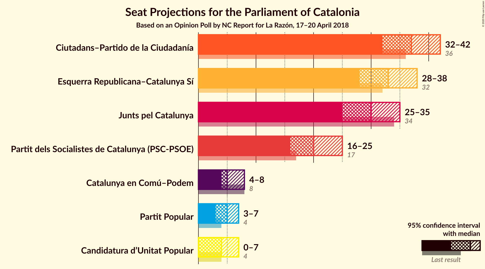

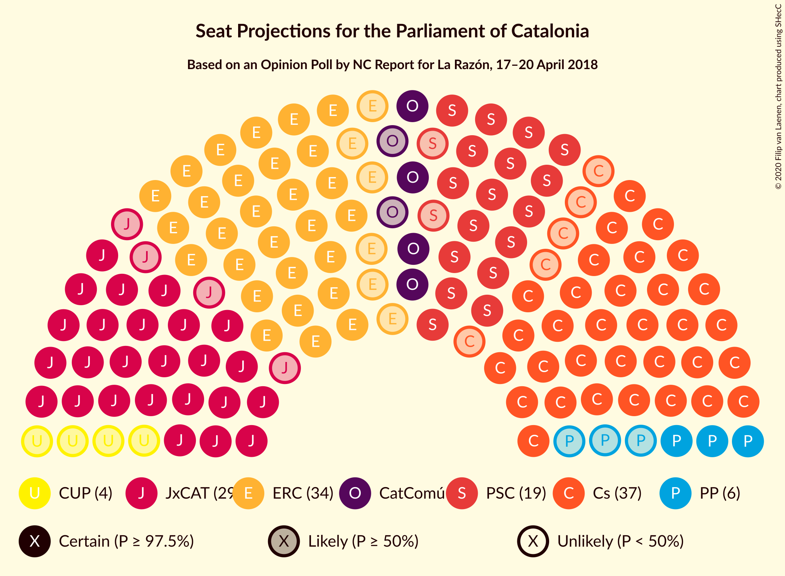

### Confidence Intervals

| Party | Last Result | Median | 80% Confidence Interval | 90% Confidence Interval | 95% Confidence Interval | 99% Confidence Interval |
|:-----:|:-----------:|:------:|:-----------------------:|:-----------------------:|:-----------------------:|:-----------------------:|
| <a href="#ciutadans–partido-de-la-ciudadanía">Ciutadans–Partido de la Ciudadanía</a> | 36 | 37 | 34–40 |33–41 |32–42 |31–44 |
| <a href="#esquerra-republicana–catalunya-sí">Esquerra Republicana–Catalunya Sí</a> | 32 | 33 | 30–37 |29–38 |28–38 |27–40 |
| <a href="#junts-per-catalunya">Junts per Catalunya</a> | 34 | 30 | 27–33 |26–34 |25–35 |24–37 |
| <a href="#partit-dels-socialistes-de-catalunya-(psc-psoe)">Partit dels Socialistes de Catalunya (PSC-PSOE)</a> | 17 | 20 | 17–24 |17–24 |16–25 |16–25 |
| <a href="#catalunya-en-comú–podem">Catalunya en Comú–Podem</a> | 8 | 5 | 4–7 |4–8 |4–8 |3–9 |
| <a href="#partit-popular">Partit Popular</a> | 4 | 5 | 3–7 |3–7 |3–7 |2–9 |
| <a href="#candidatura-d’unitat-popular">Candidatura d’Unitat Popular</a> | 4 | 4 | 2–6 |0–7 |0–7 |0–8 |

### Ciutadans–Partido de la Ciudadanía

*For a full overview of the results for this party, see the [Ciutadans–Partido de la Ciudadanía](party-ciutadans–partidodelaciudadanía.html) page.*

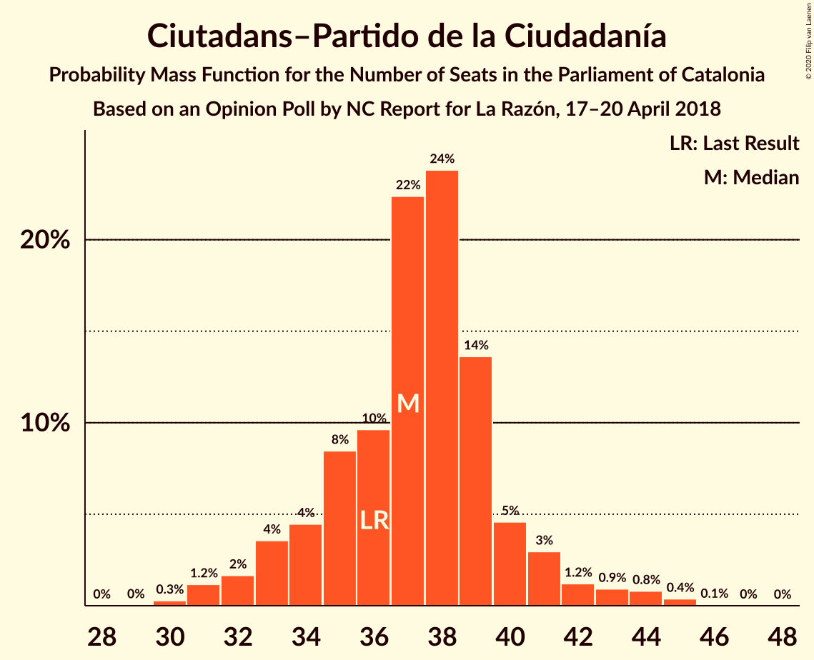

| Number of Seats | Probability | Accumulated | Special Marks |
|:---------------:|:-----------:|:-----------:|:-------------:|
| 30 | 0.3% | 100% |  |
| 31 | 1.2% | 99.7% |  |
| 32 | 2% | 98.5% |  |
| 33 | 4% | 97% |  |
| 34 | 4% | 93% |  |
| 35 | 8% | 89% |  |
| 36 | 10% | 80% | Last Result |
| 37 | 22% | 71% | Median |
| 38 | 24% | 48% |  |
| 39 | 14% | 25% |  |
| 40 | 5% | 11% |  |
| 41 | 3% | 6% |  |
| 42 | 1.2% | 3% |  |
| 43 | 0.9% | 2% |  |
| 44 | 0.8% | 1.3% |  |
| 45 | 0.4% | 0.4% |  |
| 46 | 0.1% | 0.1% |  |
| 47 | 0% | 0% |  |

### Esquerra Republicana–Catalunya Sí

*For a full overview of the results for this party, see the [Esquerra Republicana–Catalunya Sí](party-esquerrarepublicana–catalunyasí.html) page.*

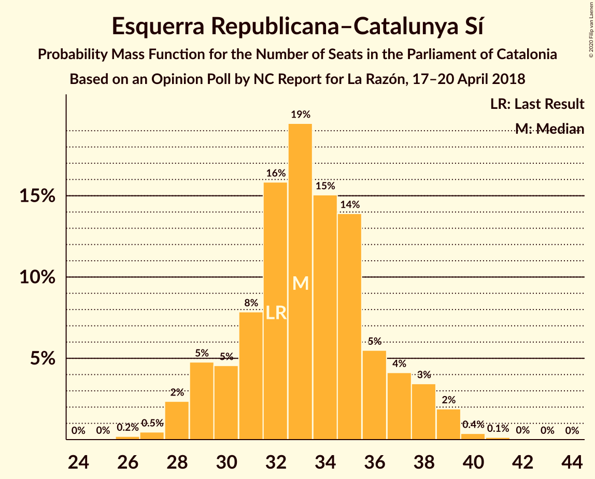

| Number of Seats | Probability | Accumulated | Special Marks |
|:---------------:|:-----------:|:-----------:|:-------------:|
| 26 | 0.2% | 100% |  |
| 27 | 0.5% | 99.8% |  |
| 28 | 2% | 99.3% |  |
| 29 | 5% | 97% |  |
| 30 | 5% | 92% |  |
| 31 | 8% | 88% |  |
| 32 | 16% | 80% | Last Result |
| 33 | 19% | 64% | Median |
| 34 | 15% | 44% |  |
| 35 | 14% | 29% |  |
| 36 | 5% | 16% |  |
| 37 | 4% | 10% |  |
| 38 | 3% | 6% |  |
| 39 | 2% | 2% |  |
| 40 | 0.4% | 0.6% |  |
| 41 | 0.1% | 0.2% |  |
| 42 | 0% | 0.1% |  |
| 43 | 0% | 0% |  |

### Junts per Catalunya

*For a full overview of the results for this party, see the [Junts per Catalunya](party-juntspercatalunya.html) page.*

| Number of Seats | Probability | Accumulated | Special Marks |
|:---------------:|:-----------:|:-----------:|:-------------:|
| 23 | 0.2% | 100% |  |
| 24 | 1.1% | 99.8% |  |
| 25 | 2% | 98.7% |  |
| 26 | 5% | 97% |  |
| 27 | 8% | 92% |  |
| 28 | 8% | 84% |  |
| 29 | 18% | 76% |  |
| 30 | 17% | 59% | Median |
| 31 | 18% | 42% |  |
| 32 | 11% | 24% |  |
| 33 | 7% | 13% |  |
| 34 | 3% | 6% | Last Result |
| 35 | 1.4% | 3% |  |
| 36 | 0.8% | 1.4% |  |
| 37 | 0.5% | 0.6% |  |
| 38 | 0.1% | 0.1% |  |
| 39 | 0% | 0% |  |

### Partit dels Socialistes de Catalunya (PSC-PSOE)

*For a full overview of the results for this party, see the [Partit dels Socialistes de Catalunya (PSC-PSOE)](party-partitdelssocialistesdecatalunyapsc-psoe.html) page.*

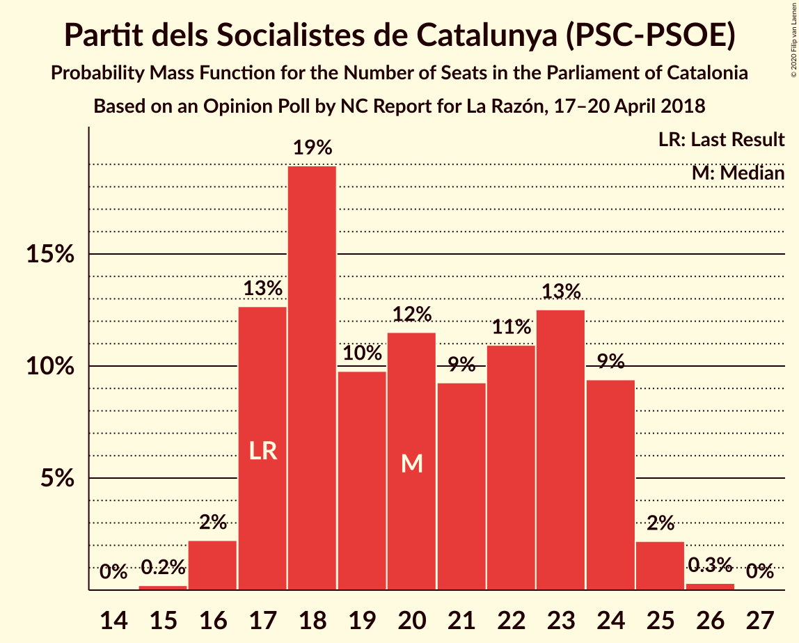

| Number of Seats | Probability | Accumulated | Special Marks |
|:---------------:|:-----------:|:-----------:|:-------------:|
| 15 | 0.2% | 100% |  |
| 16 | 2% | 99.7% |  |
| 17 | 12% | 97% | Last Result |
| 18 | 17% | 86% |  |
| 19 | 11% | 68% |  |
| 20 | 14% | 58% | Median |
| 21 | 10% | 44% |  |
| 22 | 10% | 34% |  |
| 23 | 13% | 24% |  |
| 24 | 9% | 11% |  |
| 25 | 2% | 3% |  |
| 26 | 0.3% | 0.4% |  |
| 27 | 0% | 0% |  |

### Catalunya en Comú–Podem

*For a full overview of the results for this party, see the [Catalunya en Comú–Podem](party-catalunyaencomú–podem.html) page.*

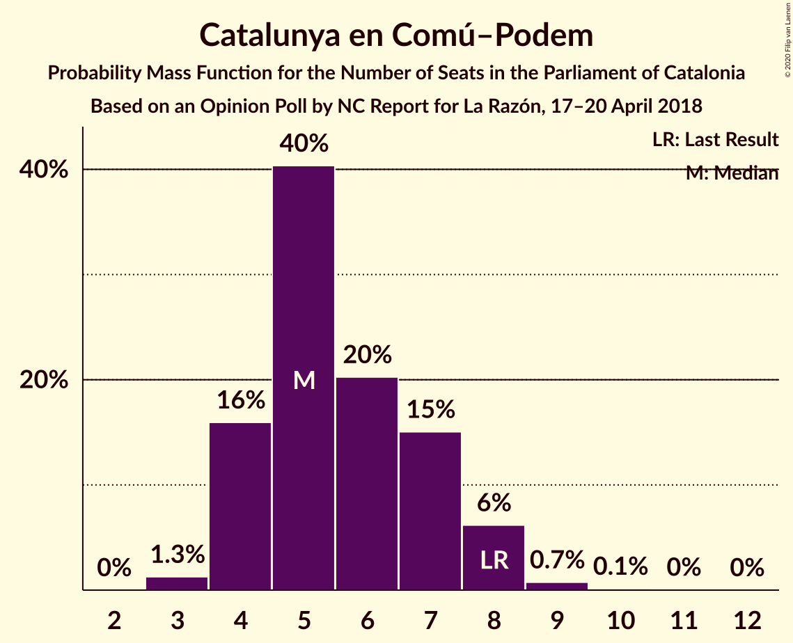

| Number of Seats | Probability | Accumulated | Special Marks |
|:---------------:|:-----------:|:-----------:|:-------------:|
| 3 | 1.2% | 100% |  |
| 4 | 17% | 98.8% |  |
| 5 | 41% | 82% | Median |
| 6 | 19% | 41% |  |
| 7 | 14% | 23% |  |
| 8 | 7% | 8% | Last Result |
| 9 | 0.7% | 0.9% |  |
| 10 | 0.1% | 0.2% |  |
| 11 | 0% | 0.1% |  |
| 12 | 0% | 0% |  |

### Partit Popular

*For a full overview of the results for this party, see the [Partit Popular](party-partitpopular.html) page.*

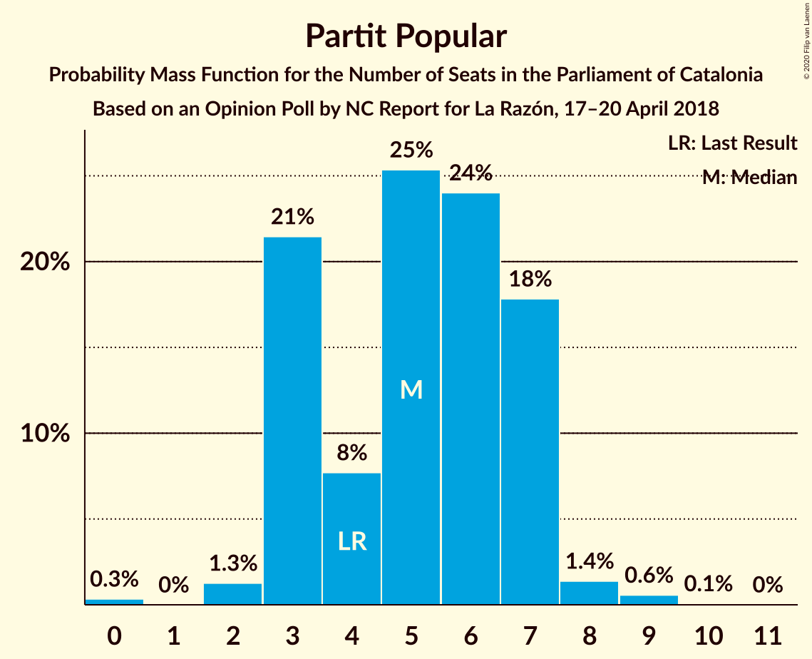

| Number of Seats | Probability | Accumulated | Special Marks |
|:---------------:|:-----------:|:-----------:|:-------------:|
| 0 | 0.3% | 100% |  |
| 1 | 0% | 99.7% |  |
| 2 | 1.3% | 99.7% |  |
| 3 | 21% | 98% |  |
| 4 | 8% | 77% | Last Result |
| 5 | 25% | 69% | Median |
| 6 | 24% | 44% |  |
| 7 | 18% | 20% |  |
| 8 | 1.4% | 2% |  |
| 9 | 0.6% | 0.6% |  |
| 10 | 0.1% | 0.1% |  |
| 11 | 0% | 0% |  |

### Candidatura d’Unitat Popular

*For a full overview of the results for this party, see the [Candidatura d’Unitat Popular](party-candidaturad’unitatpopular.html) page.*

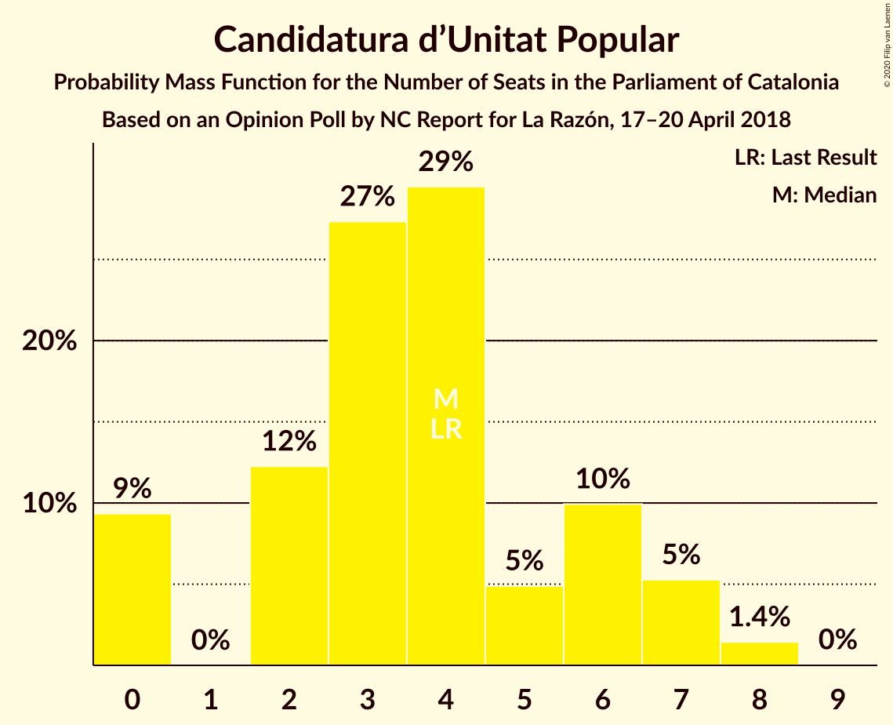

| Number of Seats | Probability | Accumulated | Special Marks |
|:---------------:|:-----------:|:-----------:|:-------------:|
| 0 | 9% | 100% |  |
| 1 | 0% | 91% |  |
| 2 | 12% | 91% |  |
| 3 | 27% | 79% |  |
| 4 | 30% | 52% | Last Result, Median |
| 5 | 4% | 22% |  |
| 6 | 11% | 18% |  |
| 7 | 5% | 7% |  |
| 8 | 1.4% | 1.4% |  |
| 9 | 0% | 0% |  |

## Coalitions

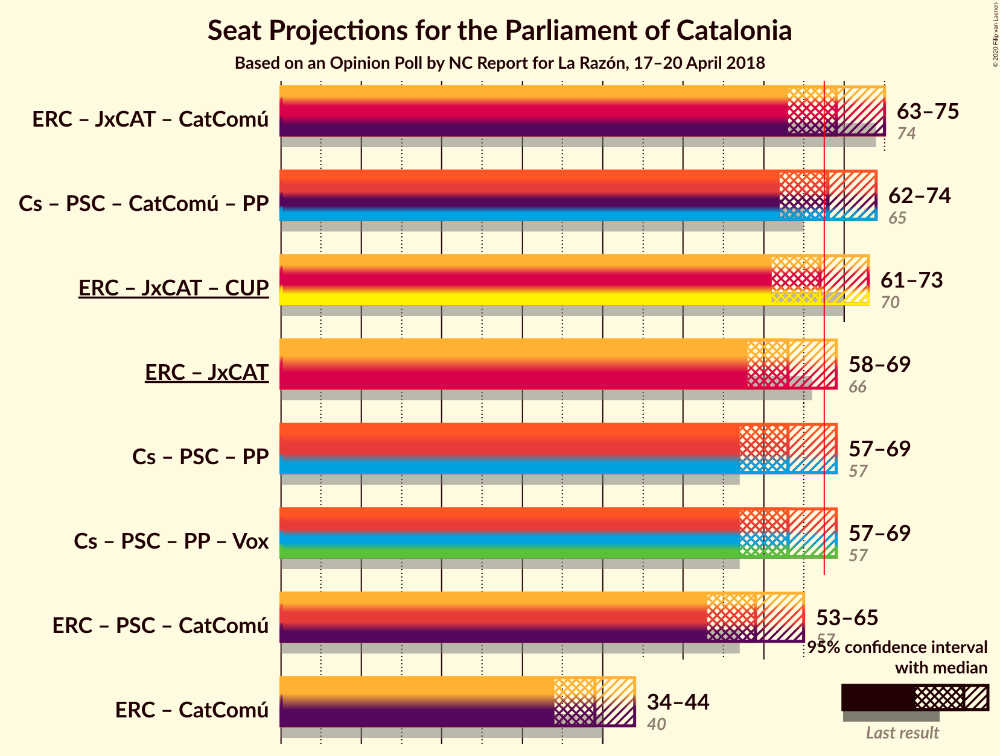

### Confidence Intervals

| Coalition | Last Result | Median | Majority? | 80% Confidence Interval | 90% Confidence Interval | 95% Confidence Interval | 99% Confidence Interval |
|:---------:|:-----------:|:------:|:---------:|:-----------------------:|:-----------------------:|:-----------------------:|:-----------------------:|
| Esquerra Republicana–Catalunya Sí – Junts per Catalunya – Catalunya en Comú–Podem | 74 | 69 | 67% | 65–73 | 64–74 | 63–75 | 61–76 |
| Ciutadans–Partido de la Ciudadanía – Partit dels Socialistes de Catalunya (PSC-PSOE) – Catalunya en Comú–Podem – Partit Popular | 65 | 68 | 57% | 64–72 | 63–73 | 62–74 | 61–76 |
| Esquerra Republicana–Catalunya Sí – Junts per Catalunya – Candidatura d’Unitat Popular | 70 | 67 | 43% | 63–71 | 62–72 | 61–73 | 59–74 |
| Ciutadans–Partido de la Ciudadanía – Partit dels Socialistes de Catalunya (PSC-PSOE) – Partit Popular | 57 | 63 | 5% | 59–66 | 58–68 | 57–69 | 55–70 |
| Esquerra Republicana–Catalunya Sí – Junts per Catalunya | 66 | 63 | 8% | 59–67 | 58–68 | 57–69 | 56–71 |
| Esquerra Republicana–Catalunya Sí – Partit dels Socialistes de Catalunya (PSC-PSOE) – Catalunya en Comú–Podem | 57 | 59 | 0.2% | 55–63 | 54–64 | 53–65 | 51–67 |
| Esquerra Republicana–Catalunya Sí – Catalunya en Comú–Podem | 40 | 39 | 0% | 36–42 | 34–43 | 33–44 | 32–46 |

### Esquerra Republicana–Catalunya Sí – Junts per Catalunya – Catalunya en Comú–Podem

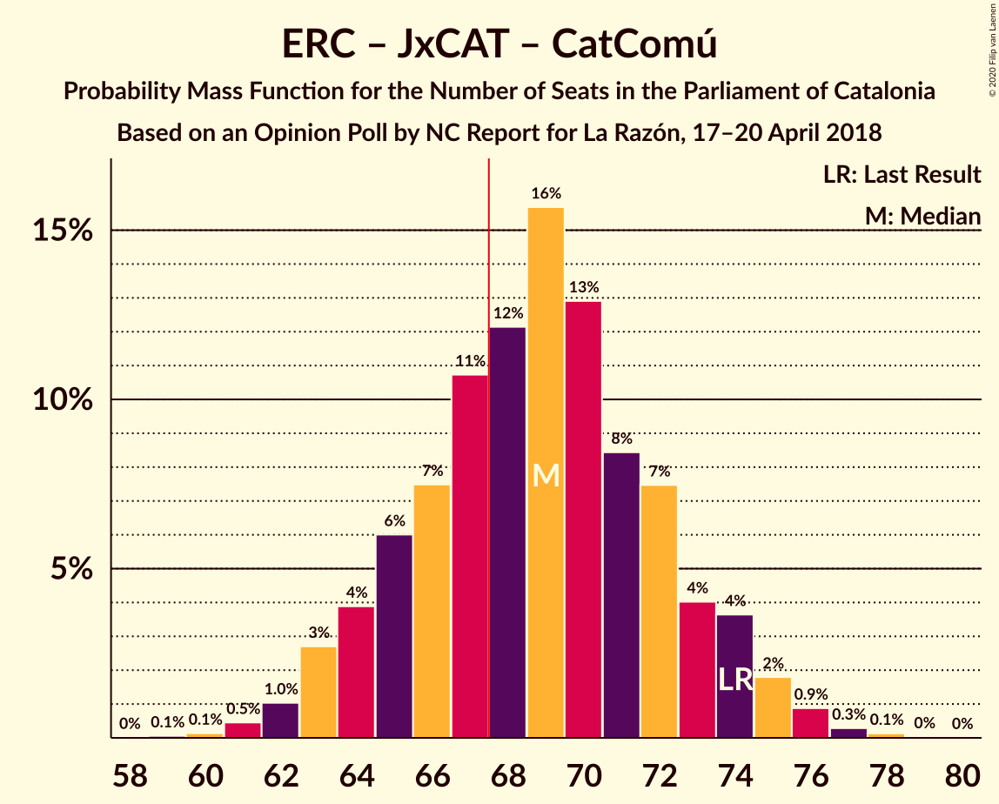

| Number of Seats | Probability | Accumulated | Special Marks |
|:---------------:|:-----------:|:-----------:|:-------------:|
| 59 | 0.1% | 100% |  |
| 60 | 0.1% | 99.9% |  |
| 61 | 0.5% | 99.8% |  |
| 62 | 1.0% | 99.3% |  |
| 63 | 3% | 98% |  |
| 64 | 4% | 96% |  |
| 65 | 6% | 92% |  |
| 66 | 7% | 86% |  |
| 67 | 11% | 78% |  |
| 68 | 12% | 67% | Median, Majority |
| 69 | 16% | 55% |  |
| 70 | 13% | 40% |  |
| 71 | 8% | 27% |  |
| 72 | 7% | 18% |  |
| 73 | 4% | 11% |  |
| 74 | 4% | 7% | Last Result |
| 75 | 2% | 3% |  |
| 76 | 0.9% | 1.4% |  |
| 77 | 0.3% | 0.5% |  |
| 78 | 0.1% | 0.2% |  |
| 79 | 0% | 0.1% |  |
| 80 | 0% | 0% |  |

### Ciutadans–Partido de la Ciudadanía – Partit dels Socialistes de Catalunya (PSC-PSOE) – Catalunya en Comú–Podem – Partit Popular

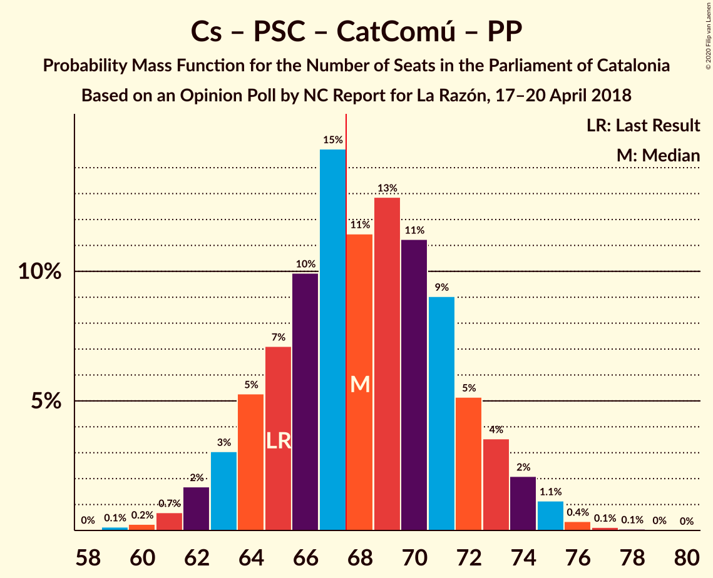

| Number of Seats | Probability | Accumulated | Special Marks |
|:---------------:|:-----------:|:-----------:|:-------------:|
| 58 | 0% | 100% |  |
| 59 | 0.1% | 99.9% |  |
| 60 | 0.2% | 99.8% |  |
| 61 | 0.7% | 99.6% |  |
| 62 | 2% | 98.9% |  |
| 63 | 3% | 97% |  |
| 64 | 5% | 94% |  |
| 65 | 7% | 89% | Last Result |
| 66 | 10% | 82% |  |
| 67 | 15% | 72% | Median |
| 68 | 11% | 57% | Majority |
| 69 | 13% | 46% |  |
| 70 | 11% | 33% |  |
| 71 | 9% | 22% |  |
| 72 | 5% | 12% |  |
| 73 | 4% | 7% |  |
| 74 | 2% | 4% |  |
| 75 | 1.1% | 2% |  |
| 76 | 0.4% | 0.6% |  |
| 77 | 0.1% | 0.2% |  |
| 78 | 0.1% | 0.1% |  |
| 79 | 0% | 0% |  |

### Esquerra Republicana–Catalunya Sí – Junts per Catalunya – Candidatura d’Unitat Popular

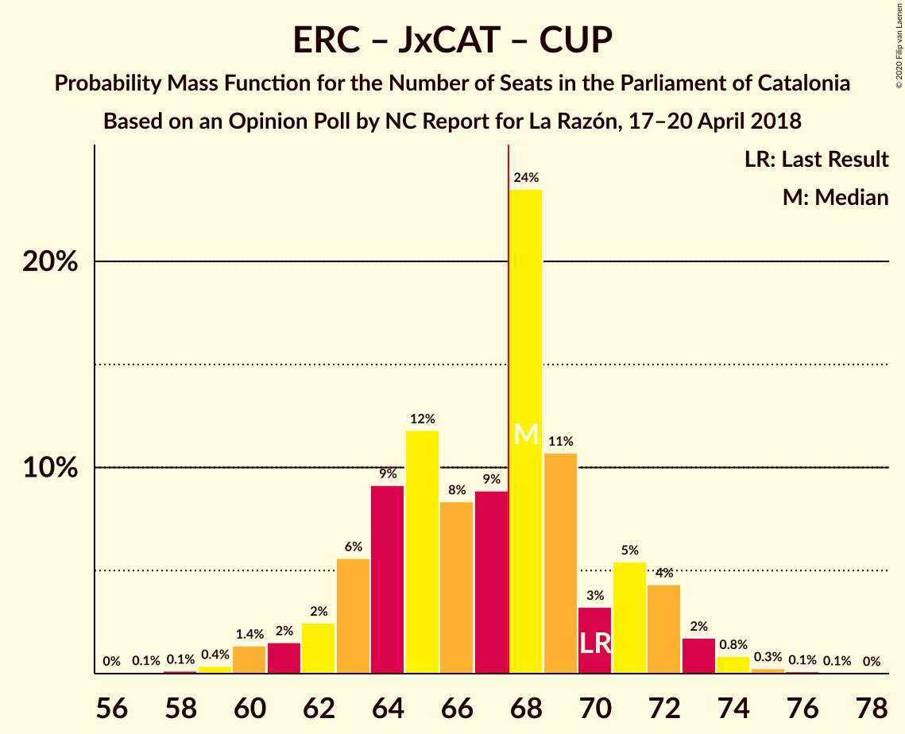

| Number of Seats | Probability | Accumulated | Special Marks |
|:---------------:|:-----------:|:-----------:|:-------------:|
| 57 | 0.1% | 100% |  |
| 58 | 0.1% | 99.9% |  |
| 59 | 0.4% | 99.8% |  |
| 60 | 1.1% | 99.4% |  |
| 61 | 2% | 98% |  |
| 62 | 4% | 96% |  |
| 63 | 5% | 93% |  |
| 64 | 9% | 88% |  |
| 65 | 11% | 78% |  |
| 66 | 13% | 67% |  |
| 67 | 11% | 54% | Median |
| 68 | 15% | 43% | Majority |
| 69 | 10% | 28% |  |
| 70 | 7% | 18% | Last Result |
| 71 | 5% | 11% |  |
| 72 | 3% | 6% |  |
| 73 | 2% | 3% |  |
| 74 | 0.7% | 1.1% |  |
| 75 | 0.2% | 0.4% |  |
| 76 | 0.1% | 0.2% |  |
| 77 | 0% | 0.1% |  |
| 78 | 0% | 0% |  |

### Ciutadans–Partido de la Ciudadanía – Partit dels Socialistes de Catalunya (PSC-PSOE) – Partit Popular

| Number of Seats | Probability | Accumulated | Special Marks |
|:---------------:|:-----------:|:-----------:|:-------------:|
| 53 | 0.1% | 100% |  |
| 54 | 0.3% | 99.9% |  |
| 55 | 0.4% | 99.6% |  |
| 56 | 1.1% | 99.2% |  |
| 57 | 3% | 98% | Last Result |
| 58 | 4% | 95% |  |
| 59 | 7% | 91% |  |
| 60 | 8% | 84% |  |
| 61 | 10% | 76% |  |
| 62 | 14% | 66% | Median |
| 63 | 14% | 52% |  |
| 64 | 11% | 38% |  |
| 65 | 12% | 27% |  |
| 66 | 6% | 15% |  |
| 67 | 4% | 9% |  |
| 68 | 3% | 5% | Majority |
| 69 | 2% | 3% |  |
| 70 | 0.8% | 1.1% |  |
| 71 | 0.2% | 0.4% |  |
| 72 | 0.1% | 0.1% |  |
| 73 | 0% | 0.1% |  |
| 74 | 0% | 0% |  |

### Esquerra Republicana–Catalunya Sí – Junts per Catalunya

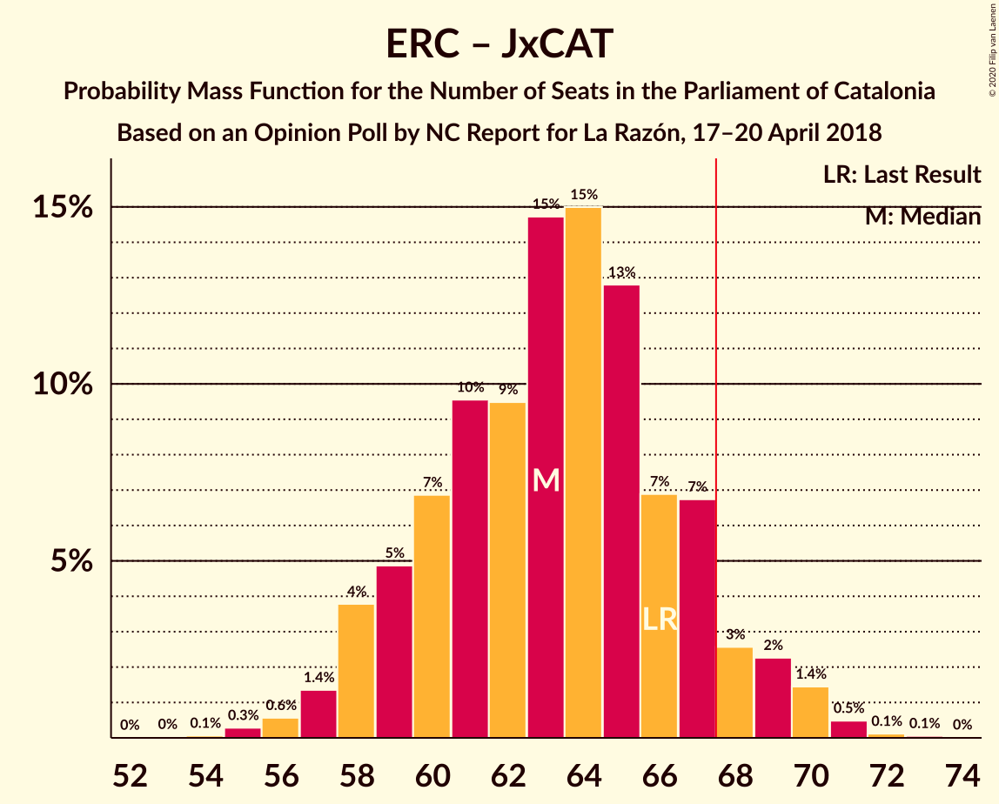

| Number of Seats | Probability | Accumulated | Special Marks |
|:---------------:|:-----------:|:-----------:|:-------------:|
| 54 | 0.1% | 100% |  |
| 55 | 0.2% | 99.9% |  |
| 56 | 0.6% | 99.7% |  |
| 57 | 2% | 99.0% |  |
| 58 | 3% | 97% |  |
| 59 | 5% | 94% |  |
| 60 | 7% | 89% |  |
| 61 | 8% | 81% |  |
| 62 | 12% | 73% |  |
| 63 | 13% | 62% | Median |
| 64 | 15% | 48% |  |
| 65 | 12% | 33% |  |
| 66 | 7% | 21% | Last Result |
| 67 | 6% | 13% |  |
| 68 | 3% | 8% | Majority |
| 69 | 2% | 4% |  |
| 70 | 1.2% | 2% |  |
| 71 | 0.5% | 0.7% |  |
| 72 | 0.1% | 0.2% |  |
| 73 | 0.1% | 0.1% |  |
| 74 | 0% | 0% |  |

### Esquerra Republicana–Catalunya Sí – Partit dels Socialistes de Catalunya (PSC-PSOE) – Catalunya en Comú–Podem

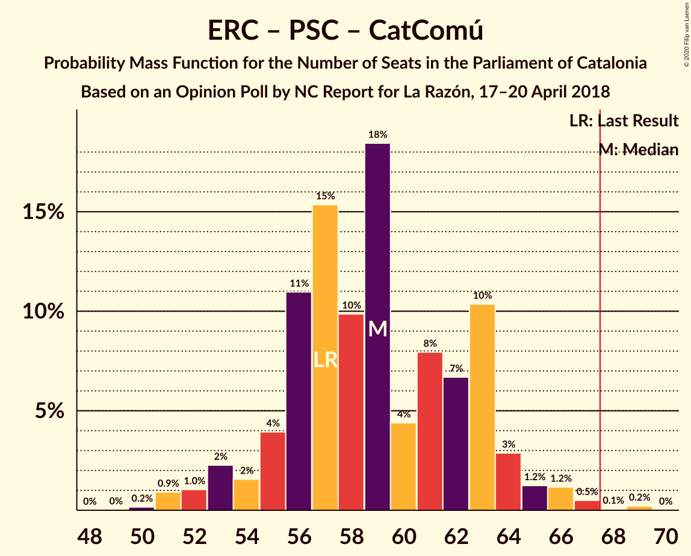

| Number of Seats | Probability | Accumulated | Special Marks |
|:---------------:|:-----------:|:-----------:|:-------------:|
| 50 | 0.1% | 100% |  |
| 51 | 0.4% | 99.8% |  |
| 52 | 0.7% | 99.4% |  |
| 53 | 2% | 98.7% |  |
| 54 | 3% | 97% |  |
| 55 | 5% | 94% |  |
| 56 | 8% | 89% |  |
| 57 | 12% | 81% | Last Result |
| 58 | 13% | 69% | Median |
| 59 | 13% | 56% |  |
| 60 | 12% | 43% |  |
| 61 | 10% | 31% |  |
| 62 | 9% | 21% |  |
| 63 | 6% | 13% |  |
| 64 | 3% | 7% |  |
| 65 | 2% | 4% |  |
| 66 | 1.3% | 2% |  |
| 67 | 0.4% | 0.7% |  |
| 68 | 0.1% | 0.2% | Majority |
| 69 | 0.1% | 0.1% |  |
| 70 | 0% | 0% |  |

### Esquerra Republicana–Catalunya Sí – Catalunya en Comú–Podem

| Number of Seats | Probability | Accumulated | Special Marks |
|:---------------:|:-----------:|:-----------:|:-------------:|
| 31 | 0.1% | 100% |  |
| 32 | 0.5% | 99.8% |  |
| 33 | 2% | 99.3% |  |
| 34 | 3% | 97% |  |
| 35 | 4% | 95% |  |
| 36 | 9% | 91% |  |
| 37 | 12% | 82% |  |
| 38 | 16% | 70% | Median |
| 39 | 16% | 54% |  |
| 40 | 13% | 38% | Last Result |
| 41 | 11% | 25% |  |
| 42 | 5% | 14% |  |
| 43 | 5% | 9% |  |
| 44 | 3% | 4% |  |
| 45 | 1.0% | 2% |  |
| 46 | 0.5% | 0.7% |  |
| 47 | 0.2% | 0.2% |  |
| 48 | 0% | 0.1% |  |
| 49 | 0% | 0% |  |

## Technical Information

### Opinion Poll

+ **Polling firm:** NC Report
+ **Commissioner(s):** La Razón
+ **Fieldwork period:** 17–20 April 2018

### Calculations

+ **Sample size:** 769
+ **Simulations done:** 1,048,576
+ **Error estimate:** 1.68%

