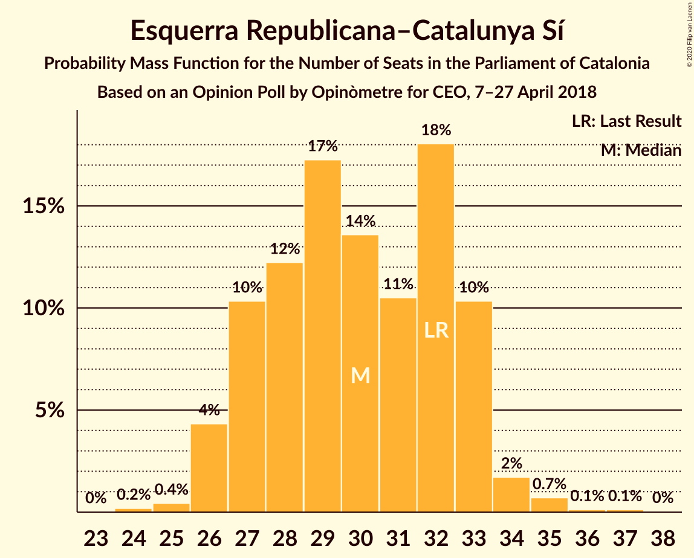
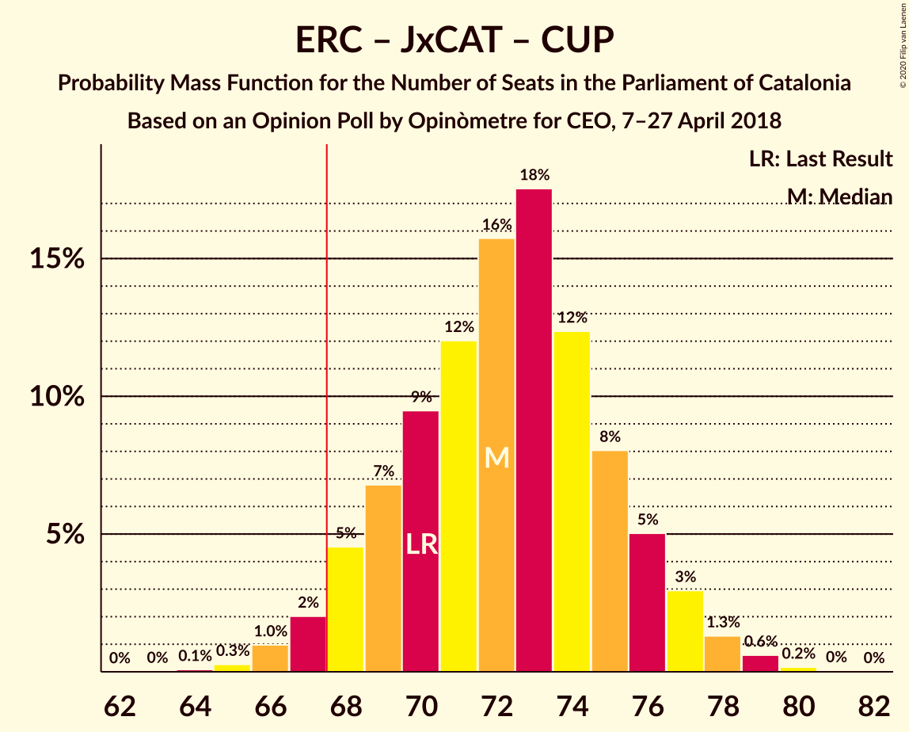
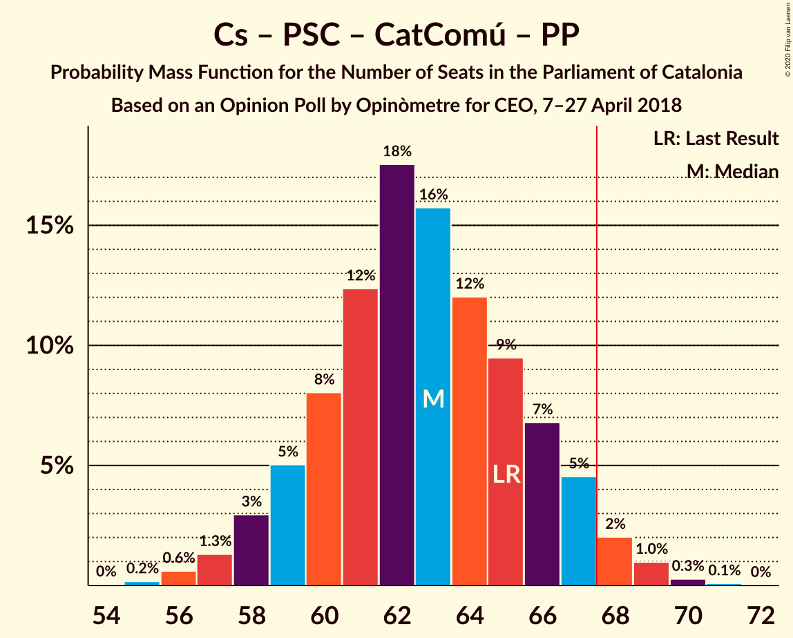
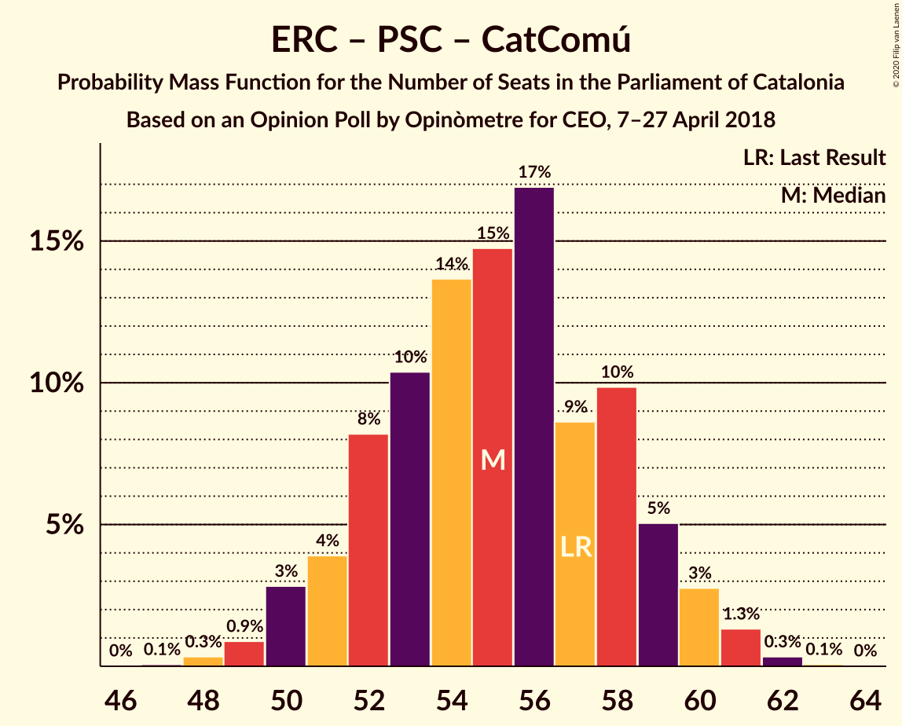

# Opinion Poll by Opinòmetre for CEO, 7–27 April 2018

<a href="#voting-intentions">Voting Intentions</a> | <a href="#seats">Seats</a> | <a href="#coalitions">Coalitions</a> | <a href="#technical-information">Technical Information</a>

## Voting Intentions

### Confidence Intervals

| Party | Last Result | Poll Result | 80% Confidence Interval | 90% Confidence Interval | 95% Confidence Interval | 99% Confidence Interval |
|:-----:|:-----------:|:-----------:|:-----------------------:|:-----------------------:|:-----------------------:|:-----------------------:|
| Ciutadans–Partido de la Ciudadanía | 25.4% | 24.5% | 22.8–26.3% |22.4–26.8% |22.0–27.3% |21.2–28.1% |
| Esquerra Republicana–Catalunya Sí | 21.4% | 20.5% | 18.9–22.2% |18.5–22.7% |18.1–23.1% |17.4–23.9% |
| Junts pel Catalunya | 21.7% | 19.8% | 18.3–21.5% |17.8–21.9% |17.5–22.4% |16.8–23.2% |
| Partit dels Socialistes de Catalunya (PSC-PSOE) | 13.9% | 11.0% | 9.8–12.3% |9.5–12.7% |9.2–13.1% |8.7–13.7% |
| Catalunya en Comú–Podem | 7.5% | 9.5% | 8.4–10.8% |8.1–11.2% |7.8–11.5% |7.4–12.1% |
| Candidatura d’Unitat Popular | 4.5% | 9.0% | 8.0–10.3% |7.7–10.6% |7.4–10.9% |6.9–11.6% |
| Partit Popular | 4.2% | 4.1% | 3.4–5.0% |3.2–5.3% |3.1–5.5% |2.8–6.0% |

*Note:* The poll result column reflects the actual value used in the calculations. Published results may vary slightly, and in addition be rounded to fewer digits.

## Seats

### Confidence Intervals

| Party | Last Result | Median | 80% Confidence Interval | 90% Confidence Interval | 95% Confidence Interval | 99% Confidence Interval |
|:-----:|:-----------:|:------:|:-----------------------:|:-----------------------:|:-----------------------:|:-----------------------:|
| <a href="#ciutadans–partido-de-la-ciudadanía">Ciutadans–Partido de la Ciudadanía</a> | 36 | 33 | 31–37 |30–38 |30–38 |28–39 |
| <a href="#esquerra-republicana–catalunya-sí">Esquerra Republicana–Catalunya Sí</a> | 32 | 30 | 27–33 |26–33 |26–33 |25–35 |
| <a href="#junts-pel-catalunya">Junts pel Catalunya</a> | 34 | 30 | 29–33 |27–34 |26–35 |25–36 |
| <a href="#partit-dels-socialistes-de-catalunya-(psc-psoe)">Partit dels Socialistes de Catalunya (PSC-PSOE)</a> | 17 | 14 | 12–16 |12–16 |11–16 |11–17 |
| <a href="#catalunya-en-comú–podem">Catalunya en Comú–Podem</a> | 8 | 11 | 9–13 |9–14 |8–14 |8–15 |
| <a href="#candidatura-d’unitat-popular">Candidatura d’Unitat Popular</a> | 4 | 11 | 10–14 |9–15 |9–15 |9–16 |
| <a href="#partit-popular">Partit Popular</a> | 4 | 4 | 3–6 |2–6 |2–7 |0–7 |

### Ciutadans–Partido de la Ciudadanía

*For a full overview of the results for this party, see the [Ciutadans–Partido de la Ciudadanía](party-ciutadans–partidodelaciudadanía.html) page.*

| Number of Seats | Probability | Accumulated | Special Marks |
|:---------------:|:-----------:|:-----------:|:-------------:|
| 28 | 0.5% | 100% |  |
| 29 | 0.8% | 99.4% |  |
| 30 | 5% | 98.7% |  |
| 31 | 17% | 93% |  |
| 32 | 9% | 76% |  |
| 33 | 19% | 67% | Median |
| 34 | 16% | 48% |  |
| 35 | 9% | 32% |  |
| 36 | 7% | 23% | Last Result |
| 37 | 9% | 16% |  |
| 38 | 6% | 6% |  |
| 39 | 0.6% | 0.6% |  |
| 40 | 0% | 0.1% |  |
| 41 | 0% | 0% |  |

### Esquerra Republicana–Catalunya Sí

*For a full overview of the results for this party, see the [Esquerra Republicana–Catalunya Sí](party-esquerrarepublicana–catalunyasí.html) page.*

| Number of Seats | Probability | Accumulated | Special Marks |
|:---------------:|:-----------:|:-----------:|:-------------:|
| 24 | 0.2% | 100% |  |
| 25 | 0.4% | 99.8% |  |
| 26 | 5% | 99.3% |  |
| 27 | 9% | 95% |  |
| 28 | 11% | 86% |  |
| 29 | 14% | 75% |  |
| 30 | 20% | 61% | Median |
| 31 | 8% | 41% |  |
| 32 | 14% | 33% | Last Result |
| 33 | 17% | 19% |  |
| 34 | 2% | 2% |  |
| 35 | 0.3% | 0.6% |  |
| 36 | 0.1% | 0.3% |  |
| 37 | 0.1% | 0.2% |  |
| 38 | 0.1% | 0.1% |  |
| 39 | 0% | 0% |  |

### Junts pel Catalunya

*For a full overview of the results for this party, see the [Junts pel Catalunya](party-juntspelcatalunya.html) page.*

| Number of Seats | Probability | Accumulated | Special Marks |
|:---------------:|:-----------:|:-----------:|:-------------:|
| 24 | 0.3% | 100% |  |
| 25 | 0.6% | 99.6% |  |
| 26 | 3% | 99.0% |  |
| 27 | 1.3% | 96% |  |
| 28 | 4% | 95% |  |
| 29 | 17% | 91% |  |
| 30 | 35% | 75% | Median |
| 31 | 12% | 39% |  |
| 32 | 11% | 27% |  |
| 33 | 7% | 16% |  |
| 34 | 5% | 8% | Last Result |
| 35 | 3% | 4% |  |
| 36 | 0.3% | 0.6% |  |
| 37 | 0.2% | 0.3% |  |
| 38 | 0% | 0.1% |  |
| 39 | 0% | 0% |  |

### Partit dels Socialistes de Catalunya (PSC-PSOE)

*For a full overview of the results for this party, see the [Partit dels Socialistes de Catalunya (PSC-PSOE)](party-partitdelssocialistesdecatalunyapsc-psoe.html) page.*

| Number of Seats | Probability | Accumulated | Special Marks |
|:---------------:|:-----------:|:-----------:|:-------------:|
| 9 | 0.1% | 100% |  |
| 10 | 0.1% | 99.9% |  |
| 11 | 3% | 99.9% |  |
| 12 | 15% | 97% |  |
| 13 | 26% | 82% |  |
| 14 | 26% | 56% | Median |
| 15 | 17% | 30% |  |
| 16 | 12% | 13% |  |
| 17 | 1.0% | 1.1% | Last Result |
| 18 | 0.1% | 0.1% |  |
| 19 | 0% | 0% |  |

### Catalunya en Comú–Podem

*For a full overview of the results for this party, see the [Catalunya en Comú–Podem](party-catalunyaencomú–podem.html) page.*

| Number of Seats | Probability | Accumulated | Special Marks |
|:---------------:|:-----------:|:-----------:|:-------------:|
| 8 | 4% | 100% | Last Result |
| 9 | 22% | 96% |  |
| 10 | 7% | 74% |  |
| 11 | 31% | 67% | Median |
| 12 | 11% | 36% |  |
| 13 | 18% | 25% |  |
| 14 | 6% | 7% |  |
| 15 | 0.7% | 1.0% |  |
| 16 | 0.2% | 0.3% |  |
| 17 | 0.1% | 0.1% |  |
| 18 | 0% | 0% |  |

### Candidatura d’Unitat Popular

*For a full overview of the results for this party, see the [Candidatura d’Unitat Popular](party-candidaturad’unitatpopular.html) page.*

| Number of Seats | Probability | Accumulated | Special Marks |
|:---------------:|:-----------:|:-----------:|:-------------:|
| 4 | 0% | 100% | Last Result |
| 5 | 0% | 100% |  |
| 6 | 0% | 100% |  |
| 7 | 0% | 100% |  |
| 8 | 0.3% | 100% |  |
| 9 | 9% | 99.7% |  |
| 10 | 4% | 91% |  |
| 11 | 37% | 87% | Median |
| 12 | 10% | 50% |  |
| 13 | 23% | 40% |  |
| 14 | 10% | 16% |  |
| 15 | 6% | 7% |  |
| 16 | 0.8% | 0.9% |  |
| 17 | 0.1% | 0.1% |  |
| 18 | 0% | 0% |  |

### Partit Popular

*For a full overview of the results for this party, see the [Partit Popular](party-partitpopular.html) page.*

| Number of Seats | Probability | Accumulated | Special Marks |
|:---------------:|:-----------:|:-----------:|:-------------:|
| 0 | 1.2% | 100% |  |
| 1 | 0% | 98.8% |  |
| 2 | 5% | 98.8% |  |
| 3 | 36% | 94% |  |
| 4 | 19% | 57% | Last Result, Median |
| 5 | 28% | 38% |  |
| 6 | 7% | 10% |  |
| 7 | 4% | 4% |  |
| 8 | 0.1% | 0.1% |  |
| 9 | 0% | 0% |  |

## Coalitions

### Confidence Intervals

| Coalition | Last Result | Median | Majority? | 80% Confidence Interval | 90% Confidence Interval | 95% Confidence Interval | 99% Confidence Interval |
|:---------:|:-----------:|:------:|:---------:|:-----------------------:|:-----------------------:|:-----------------------:|:-----------------------:|
| Esquerra Republicana–Catalunya Sí – Junts pel Catalunya – Candidatura d’Unitat Popular | 70 | 72 | 96% | 69–76 | 68–77 | 67–77 | 65–79 |
| Esquerra Republicana–Catalunya Sí – Junts pel Catalunya – Catalunya en Comú–Podem | 74 | 72 | 95% | 68–75 | 68–76 | 67–77 | 65–78 |
| Ciutadans–Partido de la Ciudadanía – Partit dels Socialistes de Catalunya (PSC-PSOE) – Catalunya en Comú–Podem – Partit Popular | 65 | 63 | 4% | 59–66 | 58–67 | 58–68 | 56–70 |
| Esquerra Republicana–Catalunya Sí – Junts pel Catalunya | 66 | 61 | 0.3% | 58–64 | 56–64 | 55–65 | 54–67 |
| Esquerra Republicana–Catalunya Sí – Partit dels Socialistes de Catalunya (PSC-PSOE) – Catalunya en Comú–Podem | 57 | 55 | 0% | 52–59 | 50–59 | 50–60 | 49–61 |
| Ciutadans–Partido de la Ciudadanía – Partit dels Socialistes de Catalunya (PSC-PSOE) – Partit Popular | 57 | 52 | 0% | 48–55 | 47–55 | 46–56 | 46–57 |
| Esquerra Republicana–Catalunya Sí – Catalunya en Comú–Podem | 40 | 41 | 0% | 38–45 | 37–45 | 37–46 | 35–47 |

### Esquerra Republicana–Catalunya Sí – Junts pel Catalunya – Candidatura d’Unitat Popular

| Number of Seats | Probability | Accumulated | Special Marks |
|:---------------:|:-----------:|:-----------:|:-------------:|
| 64 | 0.1% | 100% |  |
| 65 | 0.6% | 99.9% |  |
| 66 | 2% | 99.4% |  |
| 67 | 2% | 98% |  |
| 68 | 2% | 96% | Majority |
| 69 | 7% | 94% |  |
| 70 | 5% | 88% | Last Result |
| 71 | 21% | 83% | Median |
| 72 | 15% | 62% |  |
| 73 | 10% | 48% |  |
| 74 | 13% | 38% |  |
| 75 | 11% | 24% |  |
| 76 | 8% | 14% |  |
| 77 | 3% | 5% |  |
| 78 | 2% | 2% |  |
| 79 | 0.4% | 0.5% |  |
| 80 | 0.1% | 0.2% |  |
| 81 | 0% | 0% |  |

### Esquerra Republicana–Catalunya Sí – Junts pel Catalunya – Catalunya en Comú–Podem

| Number of Seats | Probability | Accumulated | Special Marks |
|:---------------:|:-----------:|:-----------:|:-------------:|
| 64 | 0.1% | 100% |  |
| 65 | 0.8% | 99.8% |  |
| 66 | 0.7% | 99.0% |  |
| 67 | 3% | 98% |  |
| 68 | 8% | 95% | Majority |
| 69 | 11% | 88% |  |
| 70 | 9% | 76% |  |
| 71 | 13% | 67% | Median |
| 72 | 14% | 54% |  |
| 73 | 14% | 40% |  |
| 74 | 12% | 26% | Last Result |
| 75 | 8% | 14% |  |
| 76 | 3% | 6% |  |
| 77 | 1.1% | 3% |  |
| 78 | 2% | 2% |  |
| 79 | 0.2% | 0.3% |  |
| 80 | 0.1% | 0.1% |  |
| 81 | 0% | 0% |  |

### Ciutadans–Partido de la Ciudadanía – Partit dels Socialistes de Catalunya (PSC-PSOE) – Catalunya en Comú–Podem – Partit Popular

| Number of Seats | Probability | Accumulated | Special Marks |
|:---------------:|:-----------:|:-----------:|:-------------:|
| 55 | 0.1% | 100% |  |
| 56 | 0.4% | 99.8% |  |
| 57 | 2% | 99.5% |  |
| 58 | 3% | 98% |  |
| 59 | 8% | 95% |  |
| 60 | 11% | 86% |  |
| 61 | 13% | 76% |  |
| 62 | 10% | 62% | Median |
| 63 | 15% | 52% |  |
| 64 | 21% | 38% |  |
| 65 | 5% | 17% | Last Result |
| 66 | 7% | 12% |  |
| 67 | 2% | 6% |  |
| 68 | 2% | 4% | Majority |
| 69 | 2% | 2% |  |
| 70 | 0.6% | 0.6% |  |
| 71 | 0.1% | 0.1% |  |
| 72 | 0% | 0% |  |

### Esquerra Republicana–Catalunya Sí – Junts pel Catalunya

| Number of Seats | Probability | Accumulated | Special Marks |
|:---------------:|:-----------:|:-----------:|:-------------:|
| 52 | 0.1% | 100% |  |
| 53 | 0.2% | 99.9% |  |
| 54 | 1.1% | 99.7% |  |
| 55 | 2% | 98.7% |  |
| 56 | 3% | 97% |  |
| 57 | 2% | 95% |  |
| 58 | 14% | 92% |  |
| 59 | 13% | 78% |  |
| 60 | 14% | 65% | Median |
| 61 | 12% | 51% |  |
| 62 | 15% | 40% |  |
| 63 | 12% | 25% |  |
| 64 | 8% | 13% |  |
| 65 | 3% | 5% |  |
| 66 | 0.9% | 2% | Last Result |
| 67 | 0.8% | 1.1% |  |
| 68 | 0.2% | 0.3% | Majority |
| 69 | 0.1% | 0.1% |  |
| 70 | 0% | 0% |  |

### Esquerra Republicana–Catalunya Sí – Partit dels Socialistes de Catalunya (PSC-PSOE) – Catalunya en Comú–Podem

| Number of Seats | Probability | Accumulated | Special Marks |
|:---------------:|:-----------:|:-----------:|:-------------:|
| 47 | 0% | 100% |  |
| 48 | 0.3% | 99.9% |  |
| 49 | 2% | 99.7% |  |
| 50 | 4% | 98% |  |
| 51 | 3% | 94% |  |
| 52 | 10% | 90% |  |
| 53 | 10% | 81% |  |
| 54 | 13% | 71% |  |
| 55 | 18% | 58% | Median |
| 56 | 11% | 40% |  |
| 57 | 10% | 29% | Last Result |
| 58 | 5% | 19% |  |
| 59 | 9% | 14% |  |
| 60 | 3% | 5% |  |
| 61 | 0.9% | 1.3% |  |
| 62 | 0.3% | 0.4% |  |
| 63 | 0.1% | 0.1% |  |
| 64 | 0% | 0% |  |

### Ciutadans–Partido de la Ciudadanía – Partit dels Socialistes de Catalunya (PSC-PSOE) – Partit Popular

| Number of Seats | Probability | Accumulated | Special Marks |
|:---------------:|:-----------:|:-----------:|:-------------:|
| 44 | 0.1% | 100% |  |
| 45 | 0.4% | 99.9% |  |
| 46 | 3% | 99.5% |  |
| 47 | 4% | 97% |  |
| 48 | 10% | 93% |  |
| 49 | 7% | 83% |  |
| 50 | 12% | 76% |  |
| 51 | 12% | 64% | Median |
| 52 | 13% | 52% |  |
| 53 | 20% | 39% |  |
| 54 | 9% | 19% |  |
| 55 | 6% | 11% |  |
| 56 | 3% | 5% |  |
| 57 | 1.2% | 2% | Last Result |
| 58 | 0.2% | 0.4% |  |
| 59 | 0.1% | 0.2% |  |
| 60 | 0% | 0% |  |

### Esquerra Republicana–Catalunya Sí – Catalunya en Comú–Podem

| Number of Seats | Probability | Accumulated | Special Marks |
|:---------------:|:-----------:|:-----------:|:-------------:|
| 34 | 0.1% | 100% |  |
| 35 | 0.5% | 99.8% |  |
| 36 | 0.8% | 99.4% |  |
| 37 | 5% | 98.6% |  |
| 38 | 12% | 93% |  |
| 39 | 7% | 82% |  |
| 40 | 17% | 74% | Last Result |
| 41 | 14% | 57% | Median |
| 42 | 10% | 43% |  |
| 43 | 13% | 34% |  |
| 44 | 8% | 20% |  |
| 45 | 8% | 13% |  |
| 46 | 3% | 4% |  |
| 47 | 0.4% | 0.6% |  |
| 48 | 0.1% | 0.2% |  |
| 49 | 0.1% | 0.2% |  |
| 50 | 0% | 0% |  |

## Technical Information

### Opinion Poll

+ **Polling firm:** Opinòmetre
+ **Commissioner(s):** CEO
+ **Fieldwork period:** 7–27 April 2018

### Calculations

+ **Sample size:** 1020
+ **Simulations done:** 131,072
+ **Error estimate:** 1.39%

