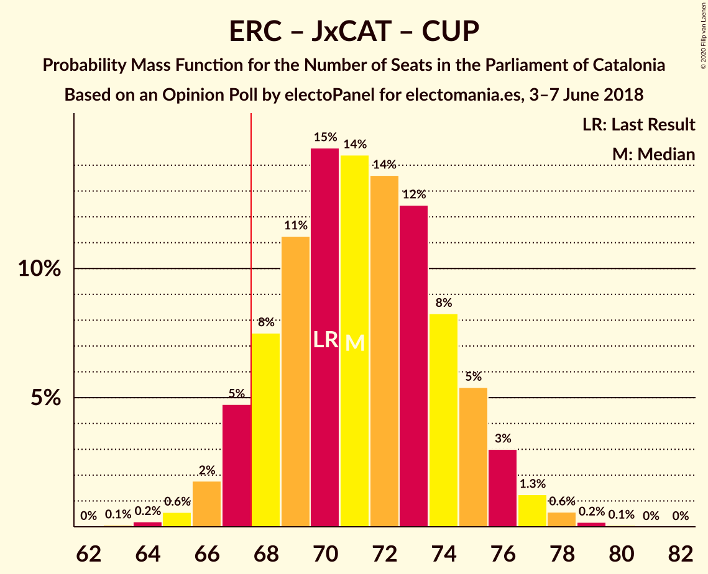

# Opinion Poll by electoPanel for electomania.es, 3–7 June 2018

<a href="#voting-intentions">Voting Intentions</a> | <a href="#seats">Seats</a> | <a href="#coalitions">Coalitions</a> | <a href="#technical-information">Technical Information</a>

## Voting Intentions

### Confidence Intervals

| Party | Last Result | Poll Result | 80% Confidence Interval | 90% Confidence Interval | 95% Confidence Interval | 99% Confidence Interval |
|:-----:|:-----------:|:-----------:|:-----------------------:|:-----------------------:|:-----------------------:|:-----------------------:|
| Ciutadans–Partido de la Ciudadanía | 25.4% | 21.3% | 19.7–23.0% |19.3–23.5% |18.9–24.0% |18.1–24.8% |
| Esquerra Republicana–Catalunya Sí | 21.4% | 20.7% | 19.1–22.4% |18.7–22.9% |18.3–23.3% |17.6–24.2% |
| Junts pel Catalunya | 21.7% | 20.4% | 18.8–22.1% |18.4–22.6% |18.0–23.0% |17.3–23.9% |
| Partit dels Socialistes de Catalunya (PSC-PSOE) | 13.9% | 16.3% | 14.9–17.9% |14.5–18.3% |14.1–18.7% |13.5–19.5% |
| Catalunya en Comú–Podem | 7.5% | 7.6% | 6.6–8.8% |6.3–9.1% |6.1–9.4% |5.7–10.0% |
| Candidatura d’Unitat Popular | 4.5% | 7.6% | 6.6–8.8% |6.3–9.1% |6.1–9.4% |5.7–10.0% |
| Partit Popular | 4.2% | 4.9% | 4.1–5.9% |3.9–6.2% |3.7–6.4% |3.4–6.9% |

*Note:* The poll result column reflects the actual value used in the calculations. Published results may vary slightly, and in addition be rounded to fewer digits.

## Seats

### Confidence Intervals

| Party | Last Result | Median | 80% Confidence Interval | 90% Confidence Interval | 95% Confidence Interval | 99% Confidence Interval |
|:-----:|:-----------:|:------:|:-----------------------:|:-----------------------:|:-----------------------:|:-----------------------:|
| <a href="#ciutadans–partido-de-la-ciudadanía">Ciutadans–Partido de la Ciudadanía</a> | 36 | 28 | 27–31 |26–32 |25–33 |24–35 |
| <a href="#esquerra-republicana–catalunya-sí">Esquerra Republicana–Catalunya Sí</a> | 32 | 30 | 28–33 |27–33 |26–34 |26–35 |
| <a href="#junts-pel-catalunya">Junts pel Catalunya</a> | 34 | 31 | 29–34 |28–35 |28–36 |26–37 |
| <a href="#partit-dels-socialistes-de-catalunya-(psc-psoe)">Partit dels Socialistes de Catalunya (PSC-PSOE)</a> | 17 | 21 | 18–24 |17–24 |17–25 |17–25 |
| <a href="#catalunya-en-comú–podem">Catalunya en Comú–Podem</a> | 8 | 8 | 7–10 |6–11 |6–11 |5–13 |
| <a href="#candidatura-d’unitat-popular">Candidatura d’Unitat Popular</a> | 4 | 9 | 8–11 |8–12 |8–13 |7–13 |
| <a href="#partit-popular">Partit Popular</a> | 4 | 6 | 4–7 |3–7 |3–8 |2–9 |

### Ciutadans–Partido de la Ciudadanía

*For a full overview of the results for this party, see the [Ciutadans–Partido de la Ciudadanía](party-ciutadans–partidodelaciudadanía.html) page.*

| Number of Seats | Probability | Accumulated | Special Marks |
|:---------------:|:-----------:|:-----------:|:-------------:|
| 23 | 0.1% | 100% |  |
| 24 | 0.9% | 99.8% |  |
| 25 | 1.5% | 98.9% |  |
| 26 | 4% | 97% |  |
| 27 | 13% | 94% |  |
| 28 | 35% | 81% | Median |
| 29 | 12% | 46% |  |
| 30 | 21% | 34% |  |
| 31 | 7% | 13% |  |
| 32 | 3% | 7% |  |
| 33 | 2% | 4% |  |
| 34 | 0.6% | 1.4% |  |
| 35 | 0.7% | 0.7% |  |
| 36 | 0.1% | 0.1% | Last Result |
| 37 | 0% | 0% |  |

### Esquerra Republicana–Catalunya Sí

*For a full overview of the results for this party, see the [Esquerra Republicana–Catalunya Sí](party-esquerrarepublicana–catalunyasí.html) page.*

| Number of Seats | Probability | Accumulated | Special Marks |
|:---------------:|:-----------:|:-----------:|:-------------:|
| 24 | 0.1% | 100% |  |
| 25 | 0.2% | 99.9% |  |
| 26 | 3% | 99.7% |  |
| 27 | 4% | 96% |  |
| 28 | 23% | 92% |  |
| 29 | 14% | 69% |  |
| 30 | 11% | 55% | Median |
| 31 | 10% | 45% |  |
| 32 | 18% | 35% | Last Result |
| 33 | 14% | 17% |  |
| 34 | 2% | 3% |  |
| 35 | 2% | 2% |  |
| 36 | 0.2% | 0.3% |  |
| 37 | 0% | 0.1% |  |
| 38 | 0% | 0% |  |

### Junts pel Catalunya

*For a full overview of the results for this party, see the [Junts pel Catalunya](party-juntspelcatalunya.html) page.*

| Number of Seats | Probability | Accumulated | Special Marks |
|:---------------:|:-----------:|:-----------:|:-------------:|
| 25 | 0.1% | 100% |  |
| 26 | 0.5% | 99.9% |  |
| 27 | 1.4% | 99.4% |  |
| 28 | 3% | 98% |  |
| 29 | 7% | 95% |  |
| 30 | 11% | 88% |  |
| 31 | 31% | 76% | Median |
| 32 | 11% | 46% |  |
| 33 | 18% | 34% |  |
| 34 | 10% | 16% | Last Result |
| 35 | 4% | 7% |  |
| 36 | 0.7% | 3% |  |
| 37 | 2% | 2% |  |
| 38 | 0.1% | 0.1% |  |
| 39 | 0% | 0% |  |

### Partit dels Socialistes de Catalunya (PSC-PSOE)

*For a full overview of the results for this party, see the [Partit dels Socialistes de Catalunya (PSC-PSOE)](party-partitdelssocialistesdecatalunyapsc-psoe.html) page.*

| Number of Seats | Probability | Accumulated | Special Marks |
|:---------------:|:-----------:|:-----------:|:-------------:|
| 16 | 0.4% | 100% |  |
| 17 | 5% | 99.6% | Last Result |
| 18 | 14% | 94% |  |
| 19 | 5% | 81% |  |
| 20 | 21% | 76% |  |
| 21 | 14% | 55% | Median |
| 22 | 8% | 40% |  |
| 23 | 9% | 33% |  |
| 24 | 20% | 23% |  |
| 25 | 3% | 4% |  |
| 26 | 0.4% | 0.4% |  |
| 27 | 0% | 0% |  |

### Catalunya en Comú–Podem

*For a full overview of the results for this party, see the [Catalunya en Comú–Podem](party-catalunyaencomú–podem.html) page.*

| Number of Seats | Probability | Accumulated | Special Marks |
|:---------------:|:-----------:|:-----------:|:-------------:|
| 5 | 1.2% | 100% |  |
| 6 | 6% | 98.8% |  |
| 7 | 11% | 93% |  |
| 8 | 41% | 82% | Last Result, Median |
| 9 | 28% | 41% |  |
| 10 | 4% | 13% |  |
| 11 | 8% | 9% |  |
| 12 | 0.4% | 1.0% |  |
| 13 | 0.5% | 0.6% |  |
| 14 | 0% | 0% |  |

### Candidatura d’Unitat Popular

*For a full overview of the results for this party, see the [Candidatura d’Unitat Popular](party-candidaturad’unitatpopular.html) page.*

| Number of Seats | Probability | Accumulated | Special Marks |
|:---------------:|:-----------:|:-----------:|:-------------:|
| 4 | 0% | 100% | Last Result |
| 5 | 0% | 100% |  |
| 6 | 0.1% | 100% |  |
| 7 | 0.5% | 99.9% |  |
| 8 | 15% | 99.5% |  |
| 9 | 56% | 85% | Median |
| 10 | 6% | 29% |  |
| 11 | 17% | 23% |  |
| 12 | 3% | 6% |  |
| 13 | 3% | 3% |  |
| 14 | 0.2% | 0.3% |  |
| 15 | 0.2% | 0.2% |  |
| 16 | 0% | 0% |  |

### Partit Popular

*For a full overview of the results for this party, see the [Partit Popular](party-partitpopular.html) page.*

| Number of Seats | Probability | Accumulated | Special Marks |
|:---------------:|:-----------:|:-----------:|:-------------:|
| 2 | 0.5% | 100% |  |
| 3 | 9% | 99.5% |  |
| 4 | 6% | 90% | Last Result |
| 5 | 24% | 84% |  |
| 6 | 40% | 60% | Median |
| 7 | 18% | 20% |  |
| 8 | 2% | 3% |  |
| 9 | 0.5% | 0.6% |  |
| 10 | 0% | 0% |  |

## Coalitions

### Confidence Intervals

| Coalition | Last Result | Median | Majority? | 80% Confidence Interval | 90% Confidence Interval | 95% Confidence Interval | 99% Confidence Interval |
|:---------:|:-----------:|:------:|:---------:|:-----------------------:|:-----------------------:|:-----------------------:|:-----------------------:|
| Esquerra Republicana–Catalunya Sí – Junts pel Catalunya – Candidatura d’Unitat Popular | 70 | 71 | 86% | 67–75 | 67–76 | 66–77 | 65–78 |
| Esquerra Republicana–Catalunya Sí – Junts pel Catalunya – Catalunya en Comú–Podem | 74 | 70 | 85% | 66–74 | 66–75 | 65–75 | 63–77 |
| Ciutadans–Partido de la Ciudadanía – Partit dels Socialistes de Catalunya (PSC-PSOE) – Catalunya en Comú–Podem – Partit Popular | 65 | 64 | 14% | 60–68 | 59–68 | 58–69 | 57–70 |
| Esquerra Republicana–Catalunya Sí – Junts pel Catalunya | 66 | 62 | 1.1% | 58–65 | 57–67 | 57–67 | 55–69 |
| Esquerra Republicana–Catalunya Sí – Partit dels Socialistes de Catalunya (PSC-PSOE) – Catalunya en Comú–Podem | 57 | 60 | 0% | 57–62 | 55–64 | 54–65 | 53–67 |
| Ciutadans–Partido de la Ciudadanía – Partit dels Socialistes de Catalunya (PSC-PSOE) – Partit Popular | 57 | 55 | 0% | 52–59 | 51–60 | 50–61 | 48–62 |
| Esquerra Republicana–Catalunya Sí – Catalunya en Comú–Podem | 40 | 39 | 0% | 36–41 | 35–42 | 34–43 | 33–44 |

### Esquerra Republicana–Catalunya Sí – Junts pel Catalunya – Candidatura d’Unitat Popular

| Number of Seats | Probability | Accumulated | Special Marks |
|:---------------:|:-----------:|:-----------:|:-------------:|
| 63 | 0% | 100% |  |
| 64 | 0.1% | 99.9% |  |
| 65 | 0.4% | 99.8% |  |
| 66 | 2% | 99.4% |  |
| 67 | 11% | 97% |  |
| 68 | 6% | 86% | Majority |
| 69 | 8% | 80% |  |
| 70 | 11% | 73% | Last Result, Median |
| 71 | 13% | 62% |  |
| 72 | 15% | 49% |  |
| 73 | 15% | 34% |  |
| 74 | 4% | 19% |  |
| 75 | 8% | 15% |  |
| 76 | 4% | 7% |  |
| 77 | 0.8% | 3% |  |
| 78 | 1.3% | 2% |  |
| 79 | 0.4% | 0.4% |  |
| 80 | 0.1% | 0.1% |  |
| 81 | 0% | 0% |  |

### Esquerra Republicana–Catalunya Sí – Junts pel Catalunya – Catalunya en Comú–Podem

| Number of Seats | Probability | Accumulated | Special Marks |
|:---------------:|:-----------:|:-----------:|:-------------:|
| 62 | 0.2% | 100% |  |
| 63 | 0.5% | 99.8% |  |
| 64 | 1.2% | 99.3% |  |
| 65 | 3% | 98% |  |
| 66 | 5% | 95% |  |
| 67 | 5% | 90% |  |
| 68 | 12% | 85% | Majority |
| 69 | 11% | 73% | Median |
| 70 | 15% | 62% |  |
| 71 | 12% | 47% |  |
| 72 | 21% | 35% |  |
| 73 | 3% | 14% |  |
| 74 | 5% | 11% | Last Result |
| 75 | 4% | 6% |  |
| 76 | 1.3% | 2% |  |
| 77 | 0.2% | 0.6% |  |
| 78 | 0.3% | 0.4% |  |
| 79 | 0.1% | 0.1% |  |
| 80 | 0% | 0% |  |

### Ciutadans–Partido de la Ciudadanía – Partit dels Socialistes de Catalunya (PSC-PSOE) – Catalunya en Comú–Podem – Partit Popular

| Number of Seats | Probability | Accumulated | Special Marks |
|:---------------:|:-----------:|:-----------:|:-------------:|
| 55 | 0.1% | 100% |  |
| 56 | 0.4% | 99.9% |  |
| 57 | 1.3% | 99.6% |  |
| 58 | 0.8% | 98% |  |
| 59 | 4% | 97% |  |
| 60 | 8% | 93% |  |
| 61 | 4% | 85% |  |
| 62 | 15% | 81% |  |
| 63 | 15% | 66% | Median |
| 64 | 13% | 51% |  |
| 65 | 11% | 38% | Last Result |
| 66 | 8% | 27% |  |
| 67 | 6% | 20% |  |
| 68 | 11% | 14% | Majority |
| 69 | 2% | 3% |  |
| 70 | 0.4% | 0.6% |  |
| 71 | 0.1% | 0.2% |  |
| 72 | 0% | 0.1% |  |
| 73 | 0% | 0% |  |

### Esquerra Republicana–Catalunya Sí – Junts pel Catalunya

| Number of Seats | Probability | Accumulated | Special Marks |
|:---------------:|:-----------:|:-----------:|:-------------:|
| 54 | 0.1% | 100% |  |
| 55 | 0.4% | 99.8% |  |
| 56 | 0.7% | 99.4% |  |
| 57 | 4% | 98.8% |  |
| 58 | 9% | 94% |  |
| 59 | 8% | 85% |  |
| 60 | 9% | 77% |  |
| 61 | 12% | 68% | Median |
| 62 | 10% | 56% |  |
| 63 | 18% | 46% |  |
| 64 | 16% | 29% |  |
| 65 | 5% | 12% |  |
| 66 | 2% | 7% | Last Result |
| 67 | 4% | 5% |  |
| 68 | 0.6% | 1.1% | Majority |
| 69 | 0.3% | 0.5% |  |
| 70 | 0.2% | 0.3% |  |
| 71 | 0% | 0% |  |

### Esquerra Republicana–Catalunya Sí – Partit dels Socialistes de Catalunya (PSC-PSOE) – Catalunya en Comú–Podem

| Number of Seats | Probability | Accumulated | Special Marks |
|:---------------:|:-----------:|:-----------:|:-------------:|
| 51 | 0.1% | 100% |  |
| 52 | 0.2% | 99.9% |  |
| 53 | 0.4% | 99.7% |  |
| 54 | 2% | 99.3% |  |
| 55 | 3% | 97% |  |
| 56 | 4% | 94% |  |
| 57 | 9% | 91% | Last Result |
| 58 | 10% | 81% |  |
| 59 | 21% | 71% | Median |
| 60 | 12% | 50% |  |
| 61 | 21% | 39% |  |
| 62 | 9% | 17% |  |
| 63 | 2% | 9% |  |
| 64 | 4% | 6% |  |
| 65 | 1.3% | 3% |  |
| 66 | 0.7% | 1.3% |  |
| 67 | 0.5% | 0.6% |  |
| 68 | 0% | 0% | Majority |

### Ciutadans–Partido de la Ciudadanía – Partit dels Socialistes de Catalunya (PSC-PSOE) – Partit Popular

| Number of Seats | Probability | Accumulated | Special Marks |
|:---------------:|:-----------:|:-----------:|:-------------:|
| 47 | 0.1% | 100% |  |
| 48 | 0.5% | 99.9% |  |
| 49 | 1.0% | 99.5% |  |
| 50 | 3% | 98% |  |
| 51 | 6% | 96% |  |
| 52 | 5% | 90% |  |
| 53 | 5% | 85% |  |
| 54 | 21% | 80% |  |
| 55 | 11% | 59% | Median |
| 56 | 13% | 48% |  |
| 57 | 14% | 36% | Last Result |
| 58 | 6% | 21% |  |
| 59 | 10% | 15% |  |
| 60 | 3% | 5% |  |
| 61 | 2% | 3% |  |
| 62 | 0.4% | 0.6% |  |
| 63 | 0.2% | 0.2% |  |
| 64 | 0.1% | 0.1% |  |
| 65 | 0% | 0% |  |

### Esquerra Republicana–Catalunya Sí – Catalunya en Comú–Podem

| Number of Seats | Probability | Accumulated | Special Marks |
|:---------------:|:-----------:|:-----------:|:-------------:|
| 31 | 0% | 100% |  |
| 32 | 0.4% | 99.9% |  |
| 33 | 0.4% | 99.5% |  |
| 34 | 4% | 99.2% |  |
| 35 | 3% | 95% |  |
| 36 | 11% | 92% |  |
| 37 | 19% | 81% |  |
| 38 | 10% | 62% | Median |
| 39 | 19% | 52% |  |
| 40 | 8% | 33% | Last Result |
| 41 | 17% | 25% |  |
| 42 | 5% | 8% |  |
| 43 | 2% | 4% |  |
| 44 | 1.4% | 2% |  |
| 45 | 0.2% | 0.3% |  |
| 46 | 0.1% | 0.1% |  |
| 47 | 0% | 0% |  |

## Technical Information

### Opinion Poll

+ **Polling firm:** electoPanel
+ **Commissioner(s):** electomania.es
+ **Fieldwork period:** 3–7 June 2018

### Calculations

+ **Sample size:** 1000
+ **Simulations done:** 131,072
+ **Error estimate:** 1.72%

