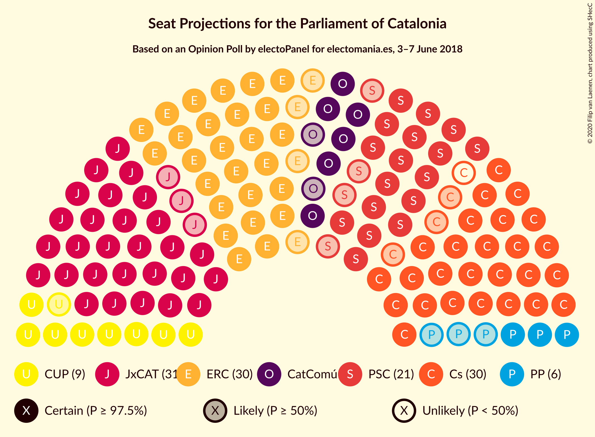
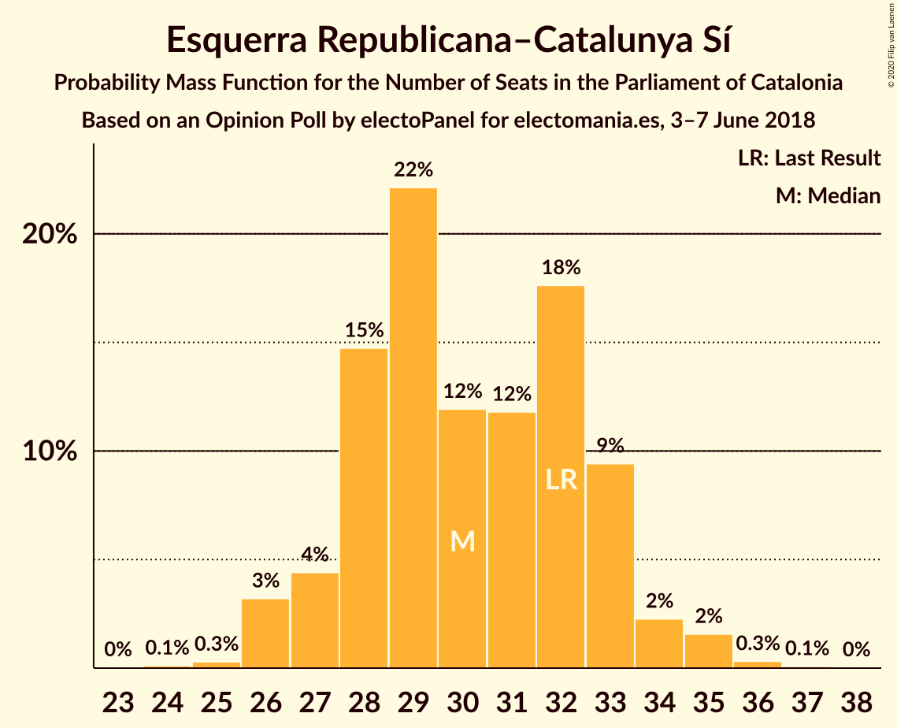
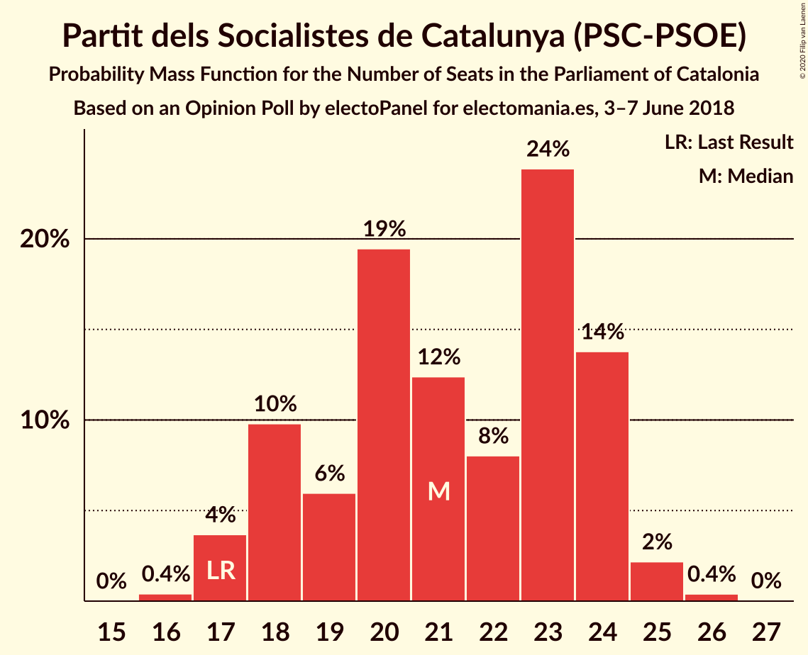
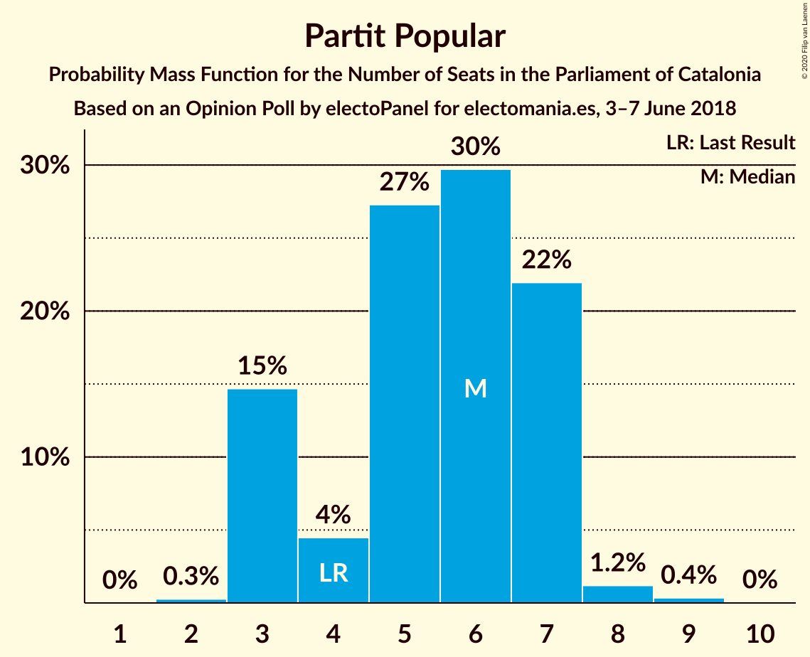

# Opinion Poll by electoPanel for electomania.es, 3–7 June 2018

<a href="#voting-intentions">Voting Intentions</a> | <a href="#seats">Seats</a> | <a href="#coalitions">Coalitions</a> | <a href="#technical-information">Technical Information</a>

## Voting Intentions

### Confidence Intervals

| Party | Last Result | Poll Result | 80% Confidence Interval | 90% Confidence Interval | 95% Confidence Interval | 99% Confidence Interval |
|:-----:|:-----------:|:-----------:|:-----------------------:|:-----------------------:|:-----------------------:|:-----------------------:|
| Ciutadans–Partido de la Ciudadanía | 25.4% | 21.3% | 19.7–23.0% |19.3–23.5% |18.9–24.0% |18.1–24.8% |
| Esquerra Republicana–Catalunya Sí | 21.4% | 20.7% | 19.1–22.4% |18.7–22.9% |18.3–23.3% |17.6–24.2% |
| Junts per Catalunya | 21.7% | 20.4% | 18.8–22.1% |18.4–22.6% |18.0–23.0% |17.3–23.9% |
| Partit dels Socialistes de Catalunya (PSC-PSOE) | 13.9% | 16.3% | 14.9–17.9% |14.5–18.3% |14.1–18.7% |13.5–19.5% |
| Catalunya en Comú–Podem | 7.5% | 7.6% | 6.6–8.8% |6.3–9.1% |6.1–9.4% |5.7–10.0% |
| Candidatura d’Unitat Popular | 4.5% | 7.6% | 6.6–8.8% |6.3–9.1% |6.1–9.4% |5.7–10.0% |
| Partit Popular | 4.2% | 4.9% | 4.1–5.9% |3.9–6.2% |3.7–6.4% |3.4–6.9% |

*Note:* The poll result column reflects the actual value used in the calculations. Published results may vary slightly, and in addition be rounded to fewer digits.

## Seats

### Confidence Intervals

| Party | Last Result | Median | 80% Confidence Interval | 90% Confidence Interval | 95% Confidence Interval | 99% Confidence Interval |
|:-----:|:-----------:|:------:|:-----------------------:|:-----------------------:|:-----------------------:|:-----------------------:|
| <a href="#ciutadans–partido-de-la-ciudadanía">Ciutadans–Partido de la Ciudadanía</a> | 36 | 29 | 27–31 |26–32 |26–33 |24–34 |
| <a href="#esquerra-republicana–catalunya-sí">Esquerra Republicana–Catalunya Sí</a> | 32 | 30 | 28–33 |27–33 |26–34 |26–35 |
| <a href="#junts-per-catalunya">Junts per Catalunya</a> | 34 | 31 | 29–34 |28–35 |28–35 |26–37 |
| <a href="#partit-dels-socialistes-de-catalunya-(psc-psoe)">Partit dels Socialistes de Catalunya (PSC-PSOE)</a> | 17 | 21 | 18–24 |18–24 |17–25 |17–25 |
| <a href="#catalunya-en-comú–podem">Catalunya en Comú–Podem</a> | 8 | 8 | 7–10 |6–11 |6–11 |5–12 |
| <a href="#candidatura-d’unitat-popular">Candidatura d’Unitat Popular</a> | 4 | 9 | 8–11 |8–12 |8–13 |7–13 |
| <a href="#partit-popular">Partit Popular</a> | 4 | 6 | 3–7 |3–7 |3–7 |3–8 |

### Ciutadans–Partido de la Ciudadanía

*For a full overview of the results for this party, see the [Ciutadans–Partido de la Ciudadanía](party-ciutadans–partidodelaciudadanía.html) page.*

| Number of Seats | Probability | Accumulated | Special Marks |
|:---------------:|:-----------:|:-----------:|:-------------:|
| 23 | 0% | 100% |  |
| 24 | 0.6% | 99.9% |  |
| 25 | 2% | 99.4% |  |
| 26 | 4% | 98% |  |
| 27 | 19% | 94% |  |
| 28 | 24% | 74% |  |
| 29 | 17% | 50% | Median |
| 30 | 17% | 33% |  |
| 31 | 8% | 16% |  |
| 32 | 4% | 8% |  |
| 33 | 2% | 4% |  |
| 34 | 1.2% | 2% |  |
| 35 | 0.4% | 0.4% |  |
| 36 | 0% | 0.1% | Last Result |
| 37 | 0% | 0% |  |

### Esquerra Republicana–Catalunya Sí

*For a full overview of the results for this party, see the [Esquerra Republicana–Catalunya Sí](party-esquerrarepublicana–catalunyasí.html) page.*

| Number of Seats | Probability | Accumulated | Special Marks |
|:---------------:|:-----------:|:-----------:|:-------------:|
| 23 | 0% | 100% |  |
| 24 | 0.1% | 99.9% |  |
| 25 | 0.3% | 99.8% |  |
| 26 | 3% | 99.5% |  |
| 27 | 4% | 96% |  |
| 28 | 15% | 92% |  |
| 29 | 22% | 77% |  |
| 30 | 12% | 55% | Median |
| 31 | 12% | 43% |  |
| 32 | 18% | 31% | Last Result |
| 33 | 9% | 14% |  |
| 34 | 2% | 4% |  |
| 35 | 2% | 2% |  |
| 36 | 0.3% | 0.4% |  |
| 37 | 0.1% | 0.1% |  |
| 38 | 0% | 0% |  |

### Junts per Catalunya

*For a full overview of the results for this party, see the [Junts per Catalunya](party-juntspercatalunya.html) page.*

| Number of Seats | Probability | Accumulated | Special Marks |
|:---------------:|:-----------:|:-----------:|:-------------:|
| 25 | 0.1% | 100% |  |
| 26 | 0.7% | 99.8% |  |
| 27 | 1.3% | 99.1% |  |
| 28 | 5% | 98% |  |
| 29 | 10% | 93% |  |
| 30 | 10% | 83% |  |
| 31 | 27% | 73% | Median |
| 32 | 14% | 46% |  |
| 33 | 15% | 32% |  |
| 34 | 11% | 17% | Last Result |
| 35 | 3% | 6% |  |
| 36 | 0.9% | 2% |  |
| 37 | 1.3% | 2% |  |
| 38 | 0.2% | 0.3% |  |
| 39 | 0.1% | 0.1% |  |
| 40 | 0% | 0% |  |

### Partit dels Socialistes de Catalunya (PSC-PSOE)

*For a full overview of the results for this party, see the [Partit dels Socialistes de Catalunya (PSC-PSOE)](party-partitdelssocialistesdecatalunyapsc-psoe.html) page.*

| Number of Seats | Probability | Accumulated | Special Marks |
|:---------------:|:-----------:|:-----------:|:-------------:|
| 16 | 0.4% | 100% |  |
| 17 | 4% | 99.6% | Last Result |
| 18 | 10% | 96% |  |
| 19 | 6% | 86% |  |
| 20 | 19% | 80% |  |
| 21 | 12% | 61% | Median |
| 22 | 8% | 48% |  |
| 23 | 24% | 40% |  |
| 24 | 14% | 16% |  |
| 25 | 2% | 3% |  |
| 26 | 0.4% | 0.4% |  |
| 27 | 0% | 0% |  |

### Catalunya en Comú–Podem

*For a full overview of the results for this party, see the [Catalunya en Comú–Podem](party-catalunyaencomú–podem.html) page.*

| Number of Seats | Probability | Accumulated | Special Marks |
|:---------------:|:-----------:|:-----------:|:-------------:|
| 5 | 1.4% | 100% |  |
| 6 | 6% | 98.5% |  |
| 7 | 12% | 92% |  |
| 8 | 43% | 80% | Last Result, Median |
| 9 | 27% | 37% |  |
| 10 | 4% | 11% |  |
| 11 | 6% | 7% |  |
| 12 | 0.4% | 0.8% |  |
| 13 | 0.5% | 0.5% |  |
| 14 | 0% | 0% |  |

### Candidatura d’Unitat Popular

*For a full overview of the results for this party, see the [Candidatura d’Unitat Popular](party-candidaturad’unitatpopular.html) page.*

| Number of Seats | Probability | Accumulated | Special Marks |
|:---------------:|:-----------:|:-----------:|:-------------:|
| 4 | 0% | 100% | Last Result |
| 5 | 0% | 100% |  |
| 6 | 0.1% | 100% |  |
| 7 | 0.5% | 99.9% |  |
| 8 | 17% | 99.4% |  |
| 9 | 44% | 82% | Median |
| 10 | 9% | 38% |  |
| 11 | 23% | 28% |  |
| 12 | 2% | 5% |  |
| 13 | 3% | 3% |  |
| 14 | 0.2% | 0.3% |  |
| 15 | 0.1% | 0.2% |  |
| 16 | 0% | 0% |  |

### Partit Popular

*For a full overview of the results for this party, see the [Partit Popular](party-partitpopular.html) page.*

| Number of Seats | Probability | Accumulated | Special Marks |
|:---------------:|:-----------:|:-----------:|:-------------:|
| 2 | 0.3% | 100% |  |
| 3 | 15% | 99.7% |  |
| 4 | 4% | 85% | Last Result |
| 5 | 27% | 81% |  |
| 6 | 30% | 53% | Median |
| 7 | 22% | 24% |  |
| 8 | 1.2% | 2% |  |
| 9 | 0.4% | 0.4% |  |
| 10 | 0% | 0% |  |

## Coalitions

### Confidence Intervals

| Coalition | Last Result | Median | Majority? | 80% Confidence Interval | 90% Confidence Interval | 95% Confidence Interval | 99% Confidence Interval |
|:---------:|:-----------:|:------:|:---------:|:-----------------------:|:-----------------------:|:-----------------------:|:-----------------------:|
| Esquerra Republicana–Catalunya Sí – Junts per Catalunya – Candidatura d’Unitat Popular | 70 | 71 | 93% | 68–75 | 67–76 | 66–76 | 65–78 |
| Esquerra Republicana–Catalunya Sí – Junts per Catalunya – Catalunya en Comú–Podem | 74 | 70 | 82% | 66–73 | 66–74 | 65–75 | 63–76 |
| Ciutadans–Partido de la Ciudadanía – Partit dels Socialistes de Catalunya (PSC-PSOE) – Catalunya en Comú–Podem – Partit Popular | 65 | 64 | 7% | 60–67 | 59–68 | 59–69 | 57–70 |
| Esquerra Republicana–Catalunya Sí – Junts per Catalunya | 66 | 62 | 1.0% | 58–65 | 58–66 | 57–67 | 55–68 |
| Esquerra Republicana–Catalunya Sí – Partit dels Socialistes de Catalunya (PSC-PSOE) – Catalunya en Comú–Podem | 57 | 60 | 0.1% | 56–63 | 55–64 | 54–65 | 53–66 |
| Ciutadans–Partido de la Ciudadanía – Partit dels Socialistes de Catalunya (PSC-PSOE) – Partit Popular | 57 | 56 | 0% | 52–59 | 51–59 | 50–60 | 49–62 |
| Esquerra Republicana–Catalunya Sí – Catalunya en Comú–Podem | 40 | 38 | 0% | 36–41 | 35–42 | 34–43 | 33–44 |

### Esquerra Republicana–Catalunya Sí – Junts per Catalunya – Candidatura d’Unitat Popular

| Number of Seats | Probability | Accumulated | Special Marks |
|:---------------:|:-----------:|:-----------:|:-------------:|
| 63 | 0.1% | 100% |  |
| 64 | 0.2% | 99.9% |  |
| 65 | 0.6% | 99.7% |  |
| 66 | 2% | 99.2% |  |
| 67 | 5% | 97% |  |
| 68 | 8% | 93% | Majority |
| 69 | 11% | 85% |  |
| 70 | 15% | 74% | Last Result, Median |
| 71 | 14% | 59% |  |
| 72 | 14% | 45% |  |
| 73 | 12% | 31% |  |
| 74 | 8% | 19% |  |
| 75 | 5% | 10% |  |
| 76 | 3% | 5% |  |
| 77 | 1.3% | 2% |  |
| 78 | 0.6% | 0.8% |  |
| 79 | 0.2% | 0.2% |  |
| 80 | 0.1% | 0.1% |  |
| 81 | 0% | 0% |  |

### Esquerra Republicana–Catalunya Sí – Junts per Catalunya – Catalunya en Comú–Podem

| Number of Seats | Probability | Accumulated | Special Marks |
|:---------------:|:-----------:|:-----------:|:-------------:|
| 62 | 0.1% | 100% |  |
| 63 | 0.4% | 99.8% |  |
| 64 | 1.0% | 99.5% |  |
| 65 | 3% | 98.5% |  |
| 66 | 6% | 95% |  |
| 67 | 8% | 90% |  |
| 68 | 14% | 82% | Majority |
| 69 | 12% | 68% | Median |
| 70 | 14% | 56% |  |
| 71 | 14% | 42% |  |
| 72 | 12% | 29% |  |
| 73 | 8% | 16% |  |
| 74 | 3% | 8% | Last Result |
| 75 | 3% | 5% |  |
| 76 | 1.1% | 2% |  |
| 77 | 0.3% | 0.5% |  |
| 78 | 0.1% | 0.2% |  |
| 79 | 0% | 0% |  |

### Ciutadans–Partido de la Ciudadanía – Partit dels Socialistes de Catalunya (PSC-PSOE) – Catalunya en Comú–Podem – Partit Popular

| Number of Seats | Probability | Accumulated | Special Marks |
|:---------------:|:-----------:|:-----------:|:-------------:|
| 55 | 0.1% | 100% |  |
| 56 | 0.2% | 99.9% |  |
| 57 | 0.6% | 99.8% |  |
| 58 | 1.3% | 99.2% |  |
| 59 | 3% | 98% |  |
| 60 | 5% | 95% |  |
| 61 | 8% | 90% |  |
| 62 | 12% | 81% |  |
| 63 | 14% | 69% |  |
| 64 | 14% | 55% | Median |
| 65 | 15% | 41% | Last Result |
| 66 | 11% | 26% |  |
| 67 | 8% | 15% |  |
| 68 | 5% | 7% | Majority |
| 69 | 2% | 3% |  |
| 70 | 0.6% | 0.8% |  |
| 71 | 0.2% | 0.3% |  |
| 72 | 0.1% | 0.1% |  |
| 73 | 0% | 0% |  |

### Esquerra Republicana–Catalunya Sí – Junts per Catalunya

| Number of Seats | Probability | Accumulated | Special Marks |
|:---------------:|:-----------:|:-----------:|:-------------:|
| 54 | 0.2% | 100% |  |
| 55 | 0.4% | 99.8% |  |
| 56 | 1.1% | 99.5% |  |
| 57 | 3% | 98% |  |
| 58 | 7% | 95% |  |
| 59 | 8% | 88% |  |
| 60 | 14% | 79% |  |
| 61 | 12% | 65% | Median |
| 62 | 15% | 53% |  |
| 63 | 13% | 38% |  |
| 64 | 11% | 25% |  |
| 65 | 8% | 14% |  |
| 66 | 3% | 6% | Last Result |
| 67 | 2% | 3% |  |
| 68 | 0.6% | 1.0% | Majority |
| 69 | 0.3% | 0.4% |  |
| 70 | 0.1% | 0.1% |  |
| 71 | 0% | 0% |  |

### Esquerra Republicana–Catalunya Sí – Partit dels Socialistes de Catalunya (PSC-PSOE) – Catalunya en Comú–Podem

| Number of Seats | Probability | Accumulated | Special Marks |
|:---------------:|:-----------:|:-----------:|:-------------:|
| 51 | 0% | 100% |  |
| 52 | 0.1% | 99.9% |  |
| 53 | 0.6% | 99.8% |  |
| 54 | 2% | 99.2% |  |
| 55 | 3% | 97% |  |
| 56 | 4% | 94% |  |
| 57 | 10% | 89% | Last Result |
| 58 | 8% | 79% |  |
| 59 | 14% | 70% | Median |
| 60 | 17% | 57% |  |
| 61 | 17% | 39% |  |
| 62 | 9% | 22% |  |
| 63 | 6% | 13% |  |
| 64 | 3% | 7% |  |
| 65 | 2% | 3% |  |
| 66 | 1.0% | 1.4% |  |
| 67 | 0.3% | 0.4% |  |
| 68 | 0.1% | 0.1% | Majority |
| 69 | 0% | 0% |  |

### Ciutadans–Partido de la Ciudadanía – Partit dels Socialistes de Catalunya (PSC-PSOE) – Partit Popular

| Number of Seats | Probability | Accumulated | Special Marks |
|:---------------:|:-----------:|:-----------:|:-------------:|
| 47 | 0.1% | 100% |  |
| 48 | 0.3% | 99.9% |  |
| 49 | 0.5% | 99.7% |  |
| 50 | 2% | 99.1% |  |
| 51 | 4% | 97% |  |
| 52 | 6% | 93% |  |
| 53 | 8% | 87% |  |
| 54 | 14% | 79% |  |
| 55 | 13% | 65% |  |
| 56 | 15% | 52% | Median |
| 57 | 13% | 37% | Last Result |
| 58 | 12% | 24% |  |
| 59 | 8% | 12% |  |
| 60 | 3% | 4% |  |
| 61 | 1.3% | 2% |  |
| 62 | 0.4% | 0.6% |  |
| 63 | 0.2% | 0.2% |  |
| 64 | 0% | 0.1% |  |
| 65 | 0% | 0% |  |

### Esquerra Republicana–Catalunya Sí – Catalunya en Comú–Podem

| Number of Seats | Probability | Accumulated | Special Marks |
|:---------------:|:-----------:|:-----------:|:-------------:|
| 31 | 0% | 100% |  |
| 32 | 0.3% | 99.9% |  |
| 33 | 0.6% | 99.6% |  |
| 34 | 3% | 99.0% |  |
| 35 | 5% | 96% |  |
| 36 | 11% | 91% |  |
| 37 | 19% | 80% |  |
| 38 | 13% | 61% | Median |
| 39 | 15% | 48% |  |
| 40 | 13% | 33% | Last Result |
| 41 | 11% | 20% |  |
| 42 | 6% | 10% |  |
| 43 | 3% | 4% |  |
| 44 | 1.1% | 1.4% |  |
| 45 | 0.2% | 0.3% |  |
| 46 | 0.1% | 0.1% |  |
| 47 | 0% | 0% |  |

## Technical Information

### Opinion Poll

+ **Polling firm:** electoPanel
+ **Commissioner(s):** electomania.es
+ **Fieldwork period:** 3–7 June 2018

### Calculations

+ **Sample size:** 1000
+ **Simulations done:** 1,048,576
+ **Error estimate:** 1.59%

