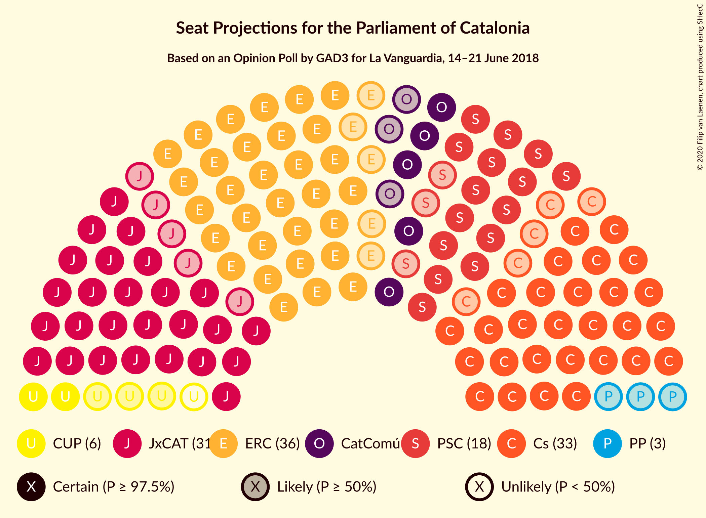
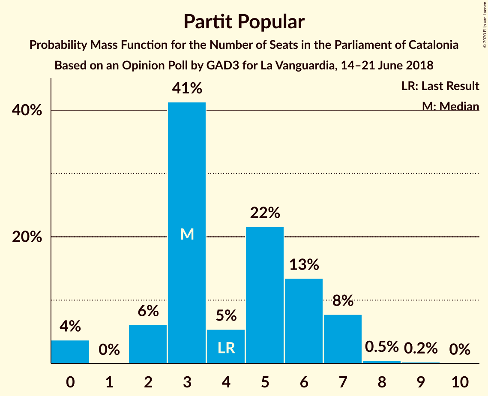
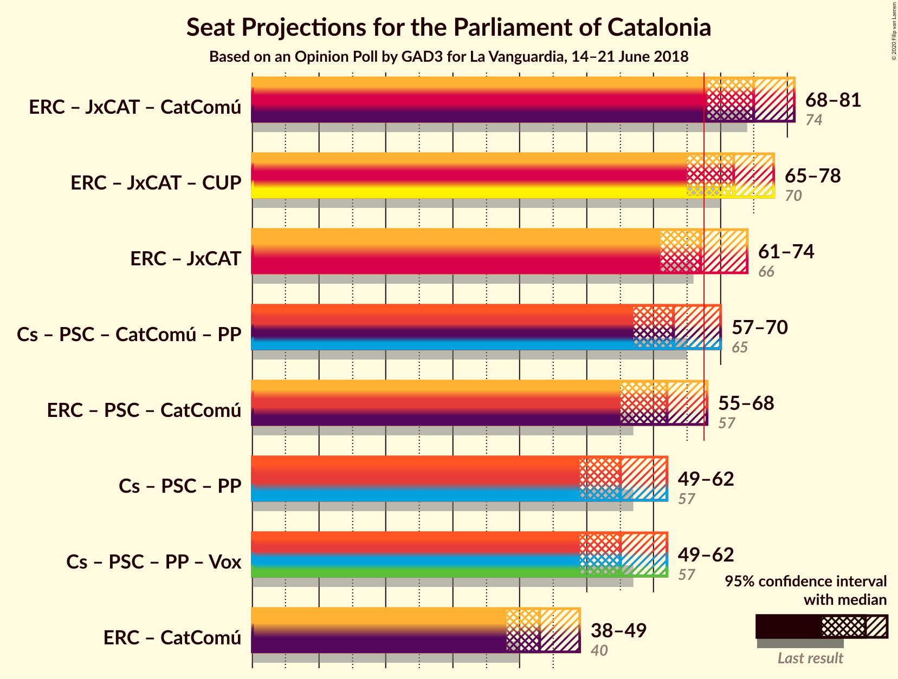
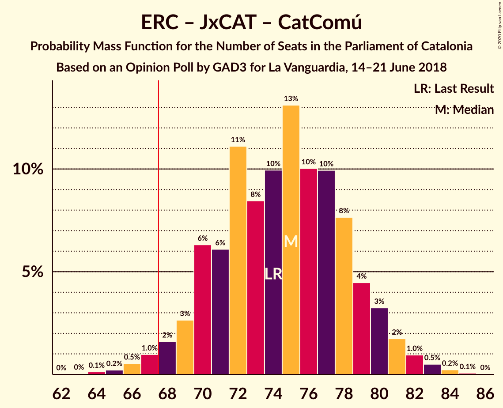

# Opinion Poll by GAD3 for La Vanguardia, 14–21 June 2018

<a href="#voting-intentions">Voting Intentions</a> | <a href="#seats">Seats</a> | <a href="#coalitions">Coalitions</a> | <a href="#technical-information">Technical Information</a>

## Voting Intentions

### Confidence Intervals

| Party | Last Result | Poll Result | 80% Confidence Interval | 90% Confidence Interval | 95% Confidence Interval | 99% Confidence Interval |
|:-----:|:-----------:|:-----------:|:-----------------------:|:-----------------------:|:-----------------------:|:-----------------------:|
| Esquerra Republicana–Catalunya Sí | 21.4% | 24.3% | 22.2–26.7% |21.6–27.4% |21.1–27.9% |20.1–29.1% |
| Ciutadans–Partido de la Ciudadanía | 25.4% | 24.0% | 21.9–26.3% |21.3–27.0% |20.7–27.6% |19.8–28.7% |
| Junts pel Catalunya | 21.7% | 20.2% | 18.2–22.4% |17.6–23.0% |17.1–23.6% |16.2–24.7% |
| Partit dels Socialistes de Catalunya (PSC-PSOE) | 13.9% | 14.7% | 13.0–16.7% |12.5–17.2% |12.1–17.7% |11.3–18.7% |
| Catalunya en Comú–Podem | 7.5% | 7.0% | 5.8–8.5% |5.5–8.9% |5.2–9.3% |4.7–10.1% |
| Candidatura d’Unitat Popular | 4.5% | 4.5% | 3.6–5.8% |3.3–6.1% |3.1–6.5% |2.7–7.1% |
| Partit Popular | 4.2% | 4.2% | 3.3–5.4% |3.0–5.8% |2.8–6.1% |2.5–6.7% |

*Note:* The poll result column reflects the actual value used in the calculations. Published results may vary slightly, and in addition be rounded to fewer digits.

## Seats

### Confidence Intervals

| Party | Last Result | Median | 80% Confidence Interval | 90% Confidence Interval | 95% Confidence Interval | 99% Confidence Interval |
|:-----:|:-----------:|:------:|:-----------------------:|:-----------------------:|:-----------------------:|:-----------------------:|
| <a href="#esquerra-republicana–catalunya-sí">Esquerra Republicana–Catalunya Sí</a> | 32 | 36 | 32–39 |31–40 |30–41 |29–43 |
| <a href="#ciutadans–partido-de-la-ciudadanía">Ciutadans–Partido de la Ciudadanía</a> | 36 | 32 | 29–37 |29–38 |28–38 |27–39 |
| <a href="#junts-pel-catalunya">Junts pel Catalunya</a> | 34 | 31 | 28–35 |27–35 |26–36 |24–39 |
| <a href="#partit-dels-socialistes-de-catalunya-(psc-psoe)">Partit dels Socialistes de Catalunya (PSC-PSOE)</a> | 17 | 18 | 16–23 |16–23 |15–24 |15–25 |
| <a href="#catalunya-en-comú–podem">Catalunya en Comú–Podem</a> | 8 | 8 | 5–10 |5–10 |5–11 |4–13 |
| <a href="#candidatura-d’unitat-popular">Candidatura d’Unitat Popular</a> | 4 | 4 | 3–8 |2–8 |2–8 |0–9 |
| <a href="#partit-popular">Partit Popular</a> | 4 | 3 | 2–6 |2–7 |0–7 |0–8 |

### Esquerra Republicana–Catalunya Sí

*For a full overview of the results for this party, see the [Esquerra Republicana–Catalunya Sí](party-esquerrarepublicana–catalunyasí.html) page.*

| Number of Seats | Probability | Accumulated | Special Marks |
|:---------------:|:-----------:|:-----------:|:-------------:|
| 27 | 0% | 100% |  |
| 28 | 0.4% | 99.9% |  |
| 29 | 0.9% | 99.6% |  |
| 30 | 2% | 98.6% |  |
| 31 | 2% | 97% |  |
| 32 | 5% | 95% | Last Result |
| 33 | 12% | 89% |  |
| 34 | 6% | 78% |  |
| 35 | 14% | 72% |  |
| 36 | 18% | 58% | Median |
| 37 | 10% | 40% |  |
| 38 | 7% | 31% |  |
| 39 | 14% | 23% |  |
| 40 | 4% | 9% |  |
| 41 | 3% | 5% |  |
| 42 | 1.1% | 2% |  |
| 43 | 0.3% | 0.7% |  |
| 44 | 0.3% | 0.4% |  |
| 45 | 0.1% | 0.1% |  |
| 46 | 0% | 0% |  |

### Ciutadans–Partido de la Ciudadanía

*For a full overview of the results for this party, see the [Ciutadans–Partido de la Ciudadanía](party-ciutadans–partidodelaciudadanía.html) page.*

| Number of Seats | Probability | Accumulated | Special Marks |
|:---------------:|:-----------:|:-----------:|:-------------:|
| 25 | 0.1% | 100% |  |
| 26 | 0.2% | 99.9% |  |
| 27 | 1.3% | 99.7% |  |
| 28 | 3% | 98% |  |
| 29 | 6% | 96% |  |
| 30 | 7% | 90% |  |
| 31 | 20% | 82% |  |
| 32 | 21% | 63% | Median |
| 33 | 4% | 42% |  |
| 34 | 8% | 38% |  |
| 35 | 11% | 30% |  |
| 36 | 8% | 19% | Last Result |
| 37 | 4% | 11% |  |
| 38 | 5% | 6% |  |
| 39 | 0.6% | 1.0% |  |
| 40 | 0.3% | 0.4% |  |
| 41 | 0.1% | 0.2% |  |
| 42 | 0% | 0.1% |  |
| 43 | 0% | 0% |  |

### Junts pel Catalunya

*For a full overview of the results for this party, see the [Junts pel Catalunya](party-juntspelcatalunya.html) page.*

| Number of Seats | Probability | Accumulated | Special Marks |
|:---------------:|:-----------:|:-----------:|:-------------:|
| 23 | 0.1% | 100% |  |
| 24 | 1.1% | 99.9% |  |
| 25 | 0.6% | 98.8% |  |
| 26 | 1.1% | 98% |  |
| 27 | 5% | 97% |  |
| 28 | 4% | 92% |  |
| 29 | 12% | 88% |  |
| 30 | 15% | 76% |  |
| 31 | 23% | 62% | Median |
| 32 | 11% | 38% |  |
| 33 | 9% | 27% |  |
| 34 | 8% | 18% | Last Result |
| 35 | 6% | 10% |  |
| 36 | 2% | 4% |  |
| 37 | 1.3% | 2% |  |
| 38 | 0.6% | 1.1% |  |
| 39 | 0.2% | 0.5% |  |
| 40 | 0.3% | 0.3% |  |
| 41 | 0% | 0% |  |

### Partit dels Socialistes de Catalunya (PSC-PSOE)

*For a full overview of the results for this party, see the [Partit dels Socialistes de Catalunya (PSC-PSOE)](party-partitdelssocialistesdecatalunyapsc-psoe.html) page.*

| Number of Seats | Probability | Accumulated | Special Marks |
|:---------------:|:-----------:|:-----------:|:-------------:|
| 13 | 0.3% | 100% |  |
| 14 | 0.2% | 99.7% |  |
| 15 | 3% | 99.6% |  |
| 16 | 11% | 96% |  |
| 17 | 26% | 85% | Last Result |
| 18 | 26% | 60% | Median |
| 19 | 6% | 34% |  |
| 20 | 6% | 28% |  |
| 21 | 8% | 22% |  |
| 22 | 3% | 14% |  |
| 23 | 8% | 11% |  |
| 24 | 3% | 3% |  |
| 25 | 0.7% | 0.8% |  |
| 26 | 0.1% | 0.1% |  |
| 27 | 0% | 0% |  |

### Catalunya en Comú–Podem

*For a full overview of the results for this party, see the [Catalunya en Comú–Podem](party-catalunyaencomú–podem.html) page.*

| Number of Seats | Probability | Accumulated | Special Marks |
|:---------------:|:-----------:|:-----------:|:-------------:|
| 4 | 1.4% | 100% |  |
| 5 | 14% | 98.6% |  |
| 6 | 15% | 85% |  |
| 7 | 13% | 69% |  |
| 8 | 32% | 56% | Last Result, Median |
| 9 | 13% | 24% |  |
| 10 | 7% | 11% |  |
| 11 | 3% | 4% |  |
| 12 | 0.3% | 0.8% |  |
| 13 | 0.4% | 0.5% |  |
| 14 | 0.1% | 0.1% |  |
| 15 | 0% | 0% |  |

### Candidatura d’Unitat Popular

*For a full overview of the results for this party, see the [Candidatura d’Unitat Popular](party-candidaturad’unitatpopular.html) page.*

| Number of Seats | Probability | Accumulated | Special Marks |
|:---------------:|:-----------:|:-----------:|:-------------:|
| 0 | 2% | 100% |  |
| 1 | 0% | 98% |  |
| 2 | 8% | 98% |  |
| 3 | 12% | 90% |  |
| 4 | 32% | 79% | Last Result, Median |
| 5 | 3% | 46% |  |
| 6 | 17% | 44% |  |
| 7 | 16% | 27% |  |
| 8 | 10% | 11% |  |
| 9 | 0.7% | 0.8% |  |
| 10 | 0% | 0.1% |  |
| 11 | 0.1% | 0.1% |  |
| 12 | 0% | 0% |  |

### Partit Popular

*For a full overview of the results for this party, see the [Partit Popular](party-partitpopular.html) page.*

| Number of Seats | Probability | Accumulated | Special Marks |
|:---------------:|:-----------:|:-----------:|:-------------:|
| 0 | 4% | 100% |  |
| 1 | 0% | 96% |  |
| 2 | 6% | 96% |  |
| 3 | 40% | 89% | Median |
| 4 | 2% | 49% | Last Result |
| 5 | 18% | 47% |  |
| 6 | 22% | 29% |  |
| 7 | 6% | 7% |  |
| 8 | 0.6% | 0.8% |  |
| 9 | 0.2% | 0.2% |  |
| 10 | 0% | 0% |  |

## Coalitions

### Confidence Intervals

| Coalition | Last Result | Median | Majority? | 80% Confidence Interval | 90% Confidence Interval | 95% Confidence Interval | 99% Confidence Interval |
|:---------:|:-----------:|:------:|:---------:|:-----------------------:|:-----------------------:|:-----------------------:|:-----------------------:|
| Esquerra Republicana–Catalunya Sí – Junts pel Catalunya – Catalunya en Comú–Podem | 74 | 75 | 98% | 70–79 | 69–80 | 68–81 | 65–83 |
| Esquerra Republicana–Catalunya Sí – Junts pel Catalunya – Candidatura d’Unitat Popular | 70 | 72 | 92% | 68–77 | 67–77 | 66–79 | 63–80 |
| Esquerra Republicana–Catalunya Sí – Junts pel Catalunya | 66 | 67 | 44% | 62–71 | 61–72 | 60–74 | 58–75 |
| Ciutadans–Partido de la Ciudadanía – Partit dels Socialistes de Catalunya (PSC-PSOE) – Catalunya en Comú–Podem – Partit Popular | 65 | 63 | 8% | 58–67 | 58–68 | 56–69 | 55–72 |
| Esquerra Republicana–Catalunya Sí – Partit dels Socialistes de Catalunya (PSC-PSOE) – Catalunya en Comú–Podem | 57 | 62 | 5% | 57–66 | 57–67 | 56–69 | 54–71 |
| Ciutadans–Partido de la Ciudadanía – Partit dels Socialistes de Catalunya (PSC-PSOE) – Partit Popular | 57 | 56 | 0% | 51–60 | 50–61 | 50–62 | 48–64 |
| Esquerra Republicana–Catalunya Sí – Catalunya en Comú–Podem | 40 | 44 | 0% | 39–48 | 38–48 | 37–49 | 36–51 |

### Esquerra Republicana–Catalunya Sí – Junts pel Catalunya – Catalunya en Comú–Podem

| Number of Seats | Probability | Accumulated | Special Marks |
|:---------------:|:-----------:|:-----------:|:-------------:|
| 64 | 0.2% | 100% |  |
| 65 | 0.3% | 99.7% |  |
| 66 | 0.3% | 99.4% |  |
| 67 | 1.4% | 99.2% |  |
| 68 | 2% | 98% | Majority |
| 69 | 2% | 96% |  |
| 70 | 6% | 94% |  |
| 71 | 6% | 88% |  |
| 72 | 6% | 82% |  |
| 73 | 5% | 76% |  |
| 74 | 15% | 71% | Last Result |
| 75 | 22% | 56% | Median |
| 76 | 8% | 35% |  |
| 77 | 7% | 26% |  |
| 78 | 7% | 19% |  |
| 79 | 6% | 11% |  |
| 80 | 1.1% | 5% |  |
| 81 | 3% | 4% |  |
| 82 | 0.9% | 2% |  |
| 83 | 0.4% | 0.8% |  |
| 84 | 0.3% | 0.4% |  |
| 85 | 0.1% | 0.1% |  |
| 86 | 0% | 0% |  |

### Esquerra Republicana–Catalunya Sí – Junts pel Catalunya – Candidatura d’Unitat Popular

| Number of Seats | Probability | Accumulated | Special Marks |
|:---------------:|:-----------:|:-----------:|:-------------:|
| 61 | 0% | 100% |  |
| 62 | 0.2% | 99.9% |  |
| 63 | 0.4% | 99.8% |  |
| 64 | 0.6% | 99.4% |  |
| 65 | 0.9% | 98.7% |  |
| 66 | 3% | 98% |  |
| 67 | 3% | 95% |  |
| 68 | 5% | 92% | Majority |
| 69 | 9% | 87% |  |
| 70 | 7% | 78% | Last Result |
| 71 | 20% | 71% | Median |
| 72 | 9% | 51% |  |
| 73 | 6% | 42% |  |
| 74 | 11% | 36% |  |
| 75 | 9% | 25% |  |
| 76 | 5% | 15% |  |
| 77 | 6% | 10% |  |
| 78 | 2% | 5% |  |
| 79 | 2% | 3% |  |
| 80 | 0.7% | 1.0% |  |
| 81 | 0.2% | 0.3% |  |
| 82 | 0.1% | 0.1% |  |
| 83 | 0% | 0% |  |

### Esquerra Republicana–Catalunya Sí – Junts pel Catalunya

| Number of Seats | Probability | Accumulated | Special Marks |
|:---------------:|:-----------:|:-----------:|:-------------:|
| 57 | 0.1% | 100% |  |
| 58 | 0.5% | 99.9% |  |
| 59 | 0.7% | 99.4% |  |
| 60 | 2% | 98.7% |  |
| 61 | 2% | 97% |  |
| 62 | 5% | 95% |  |
| 63 | 2% | 90% |  |
| 64 | 7% | 87% |  |
| 65 | 9% | 80% |  |
| 66 | 6% | 71% | Last Result |
| 67 | 21% | 65% | Median |
| 68 | 10% | 44% | Majority |
| 69 | 13% | 34% |  |
| 70 | 8% | 21% |  |
| 71 | 7% | 13% |  |
| 72 | 2% | 7% |  |
| 73 | 1.0% | 4% |  |
| 74 | 2% | 3% |  |
| 75 | 0.7% | 1.1% |  |
| 76 | 0.3% | 0.4% |  |
| 77 | 0.2% | 0.2% |  |
| 78 | 0% | 0% |  |

### Ciutadans–Partido de la Ciudadanía – Partit dels Socialistes de Catalunya (PSC-PSOE) – Catalunya en Comú–Podem – Partit Popular

| Number of Seats | Probability | Accumulated | Special Marks |
|:---------------:|:-----------:|:-----------:|:-------------:|
| 53 | 0.1% | 100% |  |
| 54 | 0.2% | 99.9% |  |
| 55 | 0.7% | 99.7% |  |
| 56 | 2% | 99.0% |  |
| 57 | 2% | 97% |  |
| 58 | 6% | 95% |  |
| 59 | 5% | 90% |  |
| 60 | 9% | 85% |  |
| 61 | 11% | 75% | Median |
| 62 | 6% | 64% |  |
| 63 | 9% | 58% |  |
| 64 | 20% | 49% |  |
| 65 | 7% | 29% | Last Result |
| 66 | 9% | 22% |  |
| 67 | 5% | 13% |  |
| 68 | 3% | 8% | Majority |
| 69 | 3% | 5% |  |
| 70 | 0.9% | 2% |  |
| 71 | 0.6% | 1.3% |  |
| 72 | 0.4% | 0.6% |  |
| 73 | 0.2% | 0.2% |  |
| 74 | 0% | 0.1% |  |
| 75 | 0% | 0% |  |

### Esquerra Republicana–Catalunya Sí – Partit dels Socialistes de Catalunya (PSC-PSOE) – Catalunya en Comú–Podem

| Number of Seats | Probability | Accumulated | Special Marks |
|:---------------:|:-----------:|:-----------:|:-------------:|
| 52 | 0.1% | 100% |  |
| 53 | 0.2% | 99.9% |  |
| 54 | 0.7% | 99.7% |  |
| 55 | 1.0% | 99.0% |  |
| 56 | 2% | 98% |  |
| 57 | 7% | 96% | Last Result |
| 58 | 4% | 89% |  |
| 59 | 6% | 86% |  |
| 60 | 9% | 80% |  |
| 61 | 12% | 71% |  |
| 62 | 20% | 59% | Median |
| 63 | 9% | 39% |  |
| 64 | 5% | 30% |  |
| 65 | 14% | 25% |  |
| 66 | 4% | 12% |  |
| 67 | 3% | 7% |  |
| 68 | 2% | 5% | Majority |
| 69 | 2% | 3% |  |
| 70 | 0.5% | 1.4% |  |
| 71 | 0.5% | 0.8% |  |
| 72 | 0.2% | 0.3% |  |
| 73 | 0.1% | 0.1% |  |
| 74 | 0% | 0% |  |

### Ciutadans–Partido de la Ciudadanía – Partit dels Socialistes de Catalunya (PSC-PSOE) – Partit Popular

| Number of Seats | Probability | Accumulated | Special Marks |
|:---------------:|:-----------:|:-----------:|:-------------:|
| 45 | 0.1% | 100% |  |
| 46 | 0.1% | 99.9% |  |
| 47 | 0.3% | 99.8% |  |
| 48 | 0.5% | 99.6% |  |
| 49 | 1.1% | 99.1% |  |
| 50 | 5% | 98% |  |
| 51 | 7% | 93% |  |
| 52 | 8% | 87% |  |
| 53 | 5% | 78% | Median |
| 54 | 9% | 74% |  |
| 55 | 13% | 65% |  |
| 56 | 17% | 52% |  |
| 57 | 10% | 35% | Last Result |
| 58 | 11% | 25% |  |
| 59 | 4% | 14% |  |
| 60 | 4% | 10% |  |
| 61 | 2% | 6% |  |
| 62 | 1.5% | 4% |  |
| 63 | 0.9% | 2% |  |
| 64 | 0.9% | 1.3% |  |
| 65 | 0.3% | 0.4% |  |
| 66 | 0.1% | 0.1% |  |
| 67 | 0% | 0% |  |

### Esquerra Republicana–Catalunya Sí – Catalunya en Comú–Podem

| Number of Seats | Probability | Accumulated | Special Marks |
|:---------------:|:-----------:|:-----------:|:-------------:|
| 34 | 0.1% | 100% |  |
| 35 | 0.3% | 99.9% |  |
| 36 | 0.9% | 99.5% |  |
| 37 | 2% | 98.6% |  |
| 38 | 2% | 97% |  |
| 39 | 8% | 94% |  |
| 40 | 4% | 87% | Last Result |
| 41 | 7% | 83% |  |
| 42 | 6% | 76% |  |
| 43 | 14% | 71% |  |
| 44 | 26% | 57% | Median |
| 45 | 11% | 31% |  |
| 46 | 6% | 20% |  |
| 47 | 4% | 14% |  |
| 48 | 6% | 11% |  |
| 49 | 2% | 5% |  |
| 50 | 2% | 2% |  |
| 51 | 0.4% | 0.7% |  |
| 52 | 0.2% | 0.4% |  |
| 53 | 0.1% | 0.1% |  |
| 54 | 0% | 0% |  |

## Technical Information

### Opinion Poll

+ **Polling firm:** GAD3
+ **Commissioner(s):** La Vanguardia
+ **Fieldwork period:** 14–21 June 2018

### Calculations

+ **Sample size:** 600
+ **Simulations done:** 131,072
+ **Error estimate:** 1.68%

