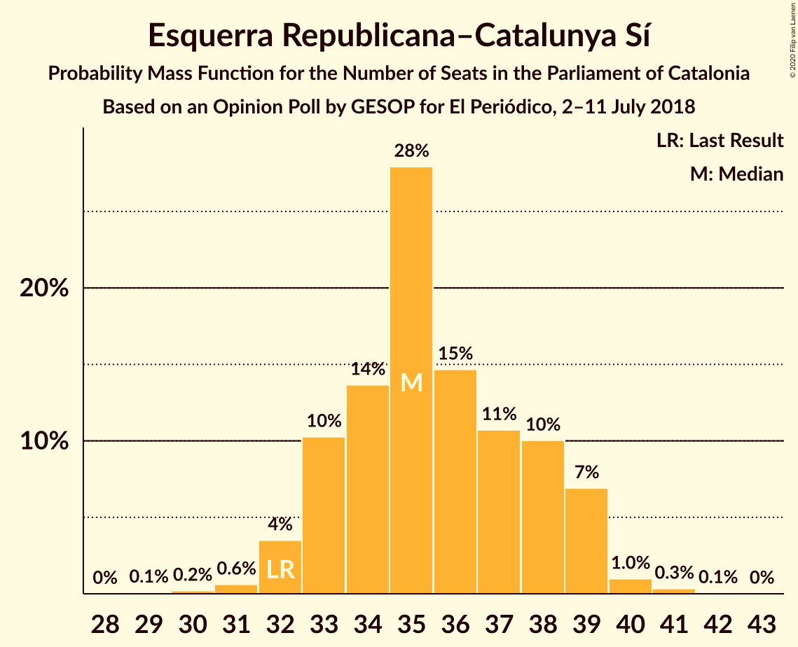
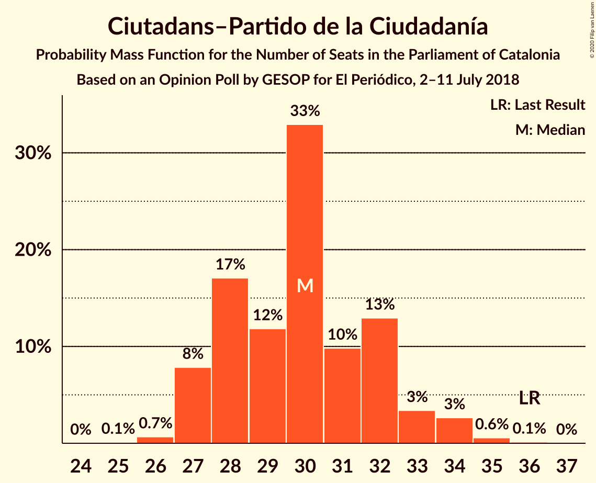
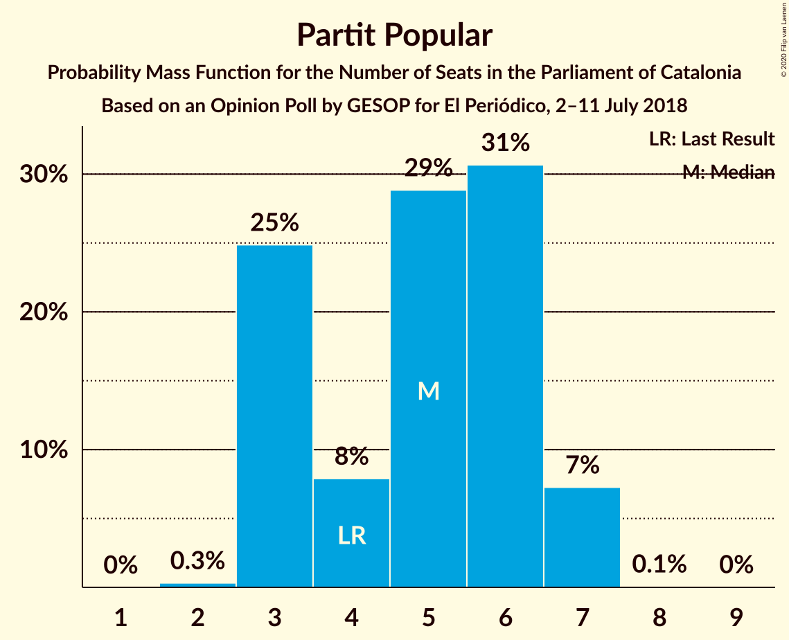
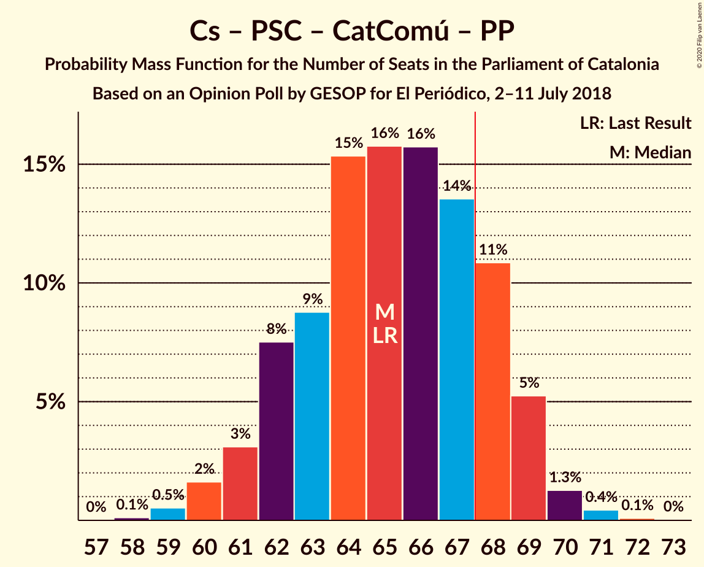

# Opinion Poll by GESOP for El Periódico, 2–11 July 2018

<a href="#voting-intentions">Voting Intentions</a> | <a href="#seats">Seats</a> | <a href="#coalitions">Coalitions</a> | <a href="#technical-information">Technical Information</a>

## Voting Intentions

### Confidence Intervals

| Party | Last Result | Poll Result | 80% Confidence Interval | 90% Confidence Interval | 95% Confidence Interval | 99% Confidence Interval |
|:-----:|:-----------:|:-----------:|:-----------------------:|:-----------------------:|:-----------------------:|:-----------------------:|
| Esquerra Republicana–Catalunya Sí | 21.4% | 23.5% | 22.1–25.0% |21.7–25.4% |21.4–25.8% |20.8–26.5% |
| Ciutadans–Partido de la Ciudadanía | 25.4% | 21.5% | 20.2–23.0% |19.8–23.4% |19.5–23.7% |18.9–24.4% |
| Junts pel Catalunya | 21.7% | 16.5% | 15.3–17.8% |14.9–18.2% |14.6–18.5% |14.1–19.1% |
| Partit dels Socialistes de Catalunya (PSC-PSOE) | 13.9% | 15.5% | 14.3–16.8% |14.0–17.1% |13.7–17.5% |13.2–18.1% |
| Catalunya en Comú–Podem | 7.5% | 8.5% | 7.6–9.5% |7.4–9.8% |7.2–10.1% |6.8–10.6% |
| Candidatura d’Unitat Popular | 4.5% | 6.5% | 5.7–7.4% |5.5–7.7% |5.3–7.9% |5.0–8.4% |
| Partit Popular | 4.2% | 4.5% | 3.9–5.3% |3.7–5.5% |3.5–5.7% |3.3–6.1% |

*Note:* The poll result column reflects the actual value used in the calculations. Published results may vary slightly, and in addition be rounded to fewer digits.

## Seats

### Confidence Intervals

| Party | Last Result | Median | 80% Confidence Interval | 90% Confidence Interval | 95% Confidence Interval | 99% Confidence Interval |
|:-----:|:-----------:|:------:|:-----------------------:|:-----------------------:|:-----------------------:|:-----------------------:|
| <a href="#esquerra-republicana–catalunya-sí">Esquerra Republicana–Catalunya Sí</a> | 32 | 35 | 33–38 |32–39 |32–39 |31–40 |
| <a href="#ciutadans–partido-de-la-ciudadanía">Ciutadans–Partido de la Ciudadanía</a> | 36 | 30 | 28–32 |27–33 |27–33 |26–35 |
| <a href="#junts-pel-catalunya">Junts pel Catalunya</a> | 34 | 26 | 24–28 |23–29 |23–29 |23–30 |
| <a href="#partit-dels-socialistes-de-catalunya-(psc-psoe)">Partit dels Socialistes de Catalunya (PSC-PSOE)</a> | 17 | 21 | 18–23 |18–23 |17–24 |17–24 |
| <a href="#catalunya-en-comú–podem">Catalunya en Comú–Podem</a> | 8 | 10 | 8–11 |8–12 |8–13 |8–13 |
| <a href="#candidatura-d’unitat-popular">Candidatura d’Unitat Popular</a> | 4 | 8 | 8–9 |7–9 |7–10 |6–11 |
| <a href="#partit-popular">Partit Popular</a> | 4 | 5 | 3–6 |3–7 |3–7 |3–7 |

### Esquerra Republicana–Catalunya Sí

*For a full overview of the results for this party, see the [Esquerra Republicana–Catalunya Sí](party-esquerrarepublicana–catalunyasí.html) page.*

| Number of Seats | Probability | Accumulated | Special Marks |
|:---------------:|:-----------:|:-----------:|:-------------:|
| 29 | 0.1% | 100% |  |
| 30 | 0.2% | 99.9% |  |
| 31 | 2% | 99.7% |  |
| 32 | 3% | 98% | Last Result |
| 33 | 12% | 95% |  |
| 34 | 16% | 83% |  |
| 35 | 27% | 67% | Median |
| 36 | 11% | 40% |  |
| 37 | 14% | 29% |  |
| 38 | 9% | 15% |  |
| 39 | 5% | 7% |  |
| 40 | 2% | 2% |  |
| 41 | 0.2% | 0.3% |  |
| 42 | 0% | 0.1% |  |
| 43 | 0% | 0% |  |

### Ciutadans–Partido de la Ciudadanía

*For a full overview of the results for this party, see the [Ciutadans–Partido de la Ciudadanía](party-ciutadans–partidodelaciudadanía.html) page.*

| Number of Seats | Probability | Accumulated | Special Marks |
|:---------------:|:-----------:|:-----------:|:-------------:|
| 25 | 0.1% | 100% |  |
| 26 | 0.9% | 99.9% |  |
| 27 | 6% | 98.9% |  |
| 28 | 17% | 93% |  |
| 29 | 10% | 75% |  |
| 30 | 30% | 66% | Median |
| 31 | 15% | 35% |  |
| 32 | 13% | 20% |  |
| 33 | 5% | 7% |  |
| 34 | 1.3% | 2% |  |
| 35 | 0.4% | 0.6% |  |
| 36 | 0.1% | 0.1% | Last Result |
| 37 | 0% | 0% |  |

### Junts pel Catalunya

*For a full overview of the results for this party, see the [Junts pel Catalunya](party-juntspelcatalunya.html) page.*

| Number of Seats | Probability | Accumulated | Special Marks |
|:---------------:|:-----------:|:-----------:|:-------------:|
| 21 | 0.1% | 100% |  |
| 22 | 0.2% | 99.9% |  |
| 23 | 8% | 99.7% |  |
| 24 | 21% | 92% |  |
| 25 | 15% | 70% |  |
| 26 | 15% | 56% | Median |
| 27 | 23% | 41% |  |
| 28 | 10% | 18% |  |
| 29 | 8% | 9% |  |
| 30 | 0.8% | 1.1% |  |
| 31 | 0.2% | 0.3% |  |
| 32 | 0% | 0.1% |  |
| 33 | 0% | 0% |  |
| 34 | 0% | 0% | Last Result |

### Partit dels Socialistes de Catalunya (PSC-PSOE)

*For a full overview of the results for this party, see the [Partit dels Socialistes de Catalunya (PSC-PSOE)](party-partitdelssocialistesdecatalunyapsc-psoe.html) page.*

| Number of Seats | Probability | Accumulated | Special Marks |
|:---------------:|:-----------:|:-----------:|:-------------:|
| 16 | 0.2% | 100% |  |
| 17 | 3% | 99.8% | Last Result |
| 18 | 11% | 96% |  |
| 19 | 12% | 85% |  |
| 20 | 9% | 73% |  |
| 21 | 29% | 64% | Median |
| 22 | 9% | 35% |  |
| 23 | 23% | 26% |  |
| 24 | 3% | 3% |  |
| 25 | 0.2% | 0.2% |  |
| 26 | 0% | 0% |  |

### Catalunya en Comú–Podem

*For a full overview of the results for this party, see the [Catalunya en Comú–Podem](party-catalunyaencomú–podem.html) page.*

| Number of Seats | Probability | Accumulated | Special Marks |
|:---------------:|:-----------:|:-----------:|:-------------:|
| 7 | 0.3% | 100% |  |
| 8 | 16% | 99.6% | Last Result |
| 9 | 24% | 83% |  |
| 10 | 17% | 59% | Median |
| 11 | 33% | 42% |  |
| 12 | 5% | 10% |  |
| 13 | 4% | 5% |  |
| 14 | 0.2% | 0.2% |  |
| 15 | 0% | 0% |  |

### Candidatura d’Unitat Popular

*For a full overview of the results for this party, see the [Candidatura d’Unitat Popular](party-candidaturad’unitatpopular.html) page.*

| Number of Seats | Probability | Accumulated | Special Marks |
|:---------------:|:-----------:|:-----------:|:-------------:|
| 4 | 0% | 100% | Last Result |
| 5 | 0% | 100% |  |
| 6 | 0.9% | 100% |  |
| 7 | 4% | 99.1% |  |
| 8 | 67% | 95% | Median |
| 9 | 23% | 27% |  |
| 10 | 2% | 4% |  |
| 11 | 2% | 2% |  |
| 12 | 0.1% | 0.1% |  |
| 13 | 0% | 0% |  |

### Partit Popular

*For a full overview of the results for this party, see the [Partit Popular](party-partitpopular.html) page.*

| Number of Seats | Probability | Accumulated | Special Marks |
|:---------------:|:-----------:|:-----------:|:-------------:|
| 2 | 0.3% | 100% |  |
| 3 | 30% | 99.6% |  |
| 4 | 12% | 70% | Last Result |
| 5 | 20% | 57% | Median |
| 6 | 29% | 37% |  |
| 7 | 8% | 9% |  |
| 8 | 0% | 0.1% |  |
| 9 | 0% | 0% |  |

## Coalitions

### Confidence Intervals

| Coalition | Last Result | Median | Majority? | 80% Confidence Interval | 90% Confidence Interval | 95% Confidence Interval | 99% Confidence Interval |
|:---------:|:-----------:|:------:|:---------:|:-----------------------:|:-----------------------:|:-----------------------:|:-----------------------:|
| Esquerra Republicana–Catalunya Sí – Junts pel Catalunya – Catalunya en Comú–Podem | 74 | 71 | 95% | 68–74 | 68–76 | 67–76 | 66–77 |
| Esquerra Republicana–Catalunya Sí – Junts pel Catalunya – Candidatura d’Unitat Popular | 70 | 69 | 78% | 67–73 | 66–73 | 66–74 | 65–75 |
| Esquerra Republicana–Catalunya Sí – Partit dels Socialistes de Catalunya (PSC-PSOE) – Catalunya en Comú–Podem | 57 | 66 | 22% | 64–69 | 63–70 | 62–70 | 61–71 |
| Ciutadans–Partido de la Ciudadanía – Partit dels Socialistes de Catalunya (PSC-PSOE) – Catalunya en Comú–Podem – Partit Popular | 65 | 66 | 22% | 62–68 | 62–69 | 61–69 | 60–70 |
| Esquerra Republicana–Catalunya Sí – Junts pel Catalunya | 66 | 61 | 0.3% | 59–65 | 58–65 | 57–65 | 56–67 |
| Ciutadans–Partido de la Ciudadanía – Partit dels Socialistes de Catalunya (PSC-PSOE) – Partit Popular | 57 | 56 | 0% | 53–58 | 51–59 | 51–60 | 49–61 |
| Esquerra Republicana–Catalunya Sí – Catalunya en Comú–Podem | 40 | 45 | 0% | 43–49 | 42–50 | 42–50 | 41–51 |

### Esquerra Republicana–Catalunya Sí – Junts pel Catalunya – Catalunya en Comú–Podem

| Number of Seats | Probability | Accumulated | Special Marks |
|:---------------:|:-----------:|:-----------:|:-------------:|
| 64 | 0.1% | 100% |  |
| 65 | 0.2% | 99.9% |  |
| 66 | 1.3% | 99.7% |  |
| 67 | 3% | 98% |  |
| 68 | 5% | 95% | Majority |
| 69 | 12% | 90% |  |
| 70 | 24% | 78% |  |
| 71 | 13% | 54% | Median |
| 72 | 13% | 41% |  |
| 73 | 11% | 28% |  |
| 74 | 8% | 17% | Last Result |
| 75 | 2% | 9% |  |
| 76 | 5% | 7% |  |
| 77 | 1.4% | 2% |  |
| 78 | 0.2% | 0.4% |  |
| 79 | 0.2% | 0.2% |  |
| 80 | 0% | 0% |  |

### Esquerra Republicana–Catalunya Sí – Junts pel Catalunya – Candidatura d’Unitat Popular

| Number of Seats | Probability | Accumulated | Special Marks |
|:---------------:|:-----------:|:-----------:|:-------------:|
| 63 | 0.1% | 100% |  |
| 64 | 0.3% | 99.9% |  |
| 65 | 2% | 99.6% |  |
| 66 | 4% | 98% |  |
| 67 | 16% | 94% |  |
| 68 | 13% | 78% | Majority |
| 69 | 16% | 65% | Median |
| 70 | 14% | 48% | Last Result |
| 71 | 16% | 34% |  |
| 72 | 6% | 17% |  |
| 73 | 8% | 12% |  |
| 74 | 3% | 4% |  |
| 75 | 0.5% | 0.8% |  |
| 76 | 0.3% | 0.4% |  |
| 77 | 0.1% | 0.1% |  |
| 78 | 0% | 0% |  |

### Esquerra Republicana–Catalunya Sí – Partit dels Socialistes de Catalunya (PSC-PSOE) – Catalunya en Comú–Podem

| Number of Seats | Probability | Accumulated | Special Marks |
|:---------------:|:-----------:|:-----------:|:-------------:|
| 57 | 0% | 100% | Last Result |
| 58 | 0% | 100% |  |
| 59 | 0.1% | 100% |  |
| 60 | 0.3% | 99.9% |  |
| 61 | 1.1% | 99.6% |  |
| 62 | 2% | 98.5% |  |
| 63 | 3% | 96% |  |
| 64 | 10% | 93% |  |
| 65 | 23% | 83% |  |
| 66 | 14% | 59% | Median |
| 67 | 24% | 46% |  |
| 68 | 11% | 22% | Majority |
| 69 | 6% | 11% |  |
| 70 | 3% | 5% |  |
| 71 | 2% | 2% |  |
| 72 | 0.3% | 0.5% |  |
| 73 | 0.2% | 0.2% |  |
| 74 | 0% | 0% |  |

### Ciutadans–Partido de la Ciudadanía – Partit dels Socialistes de Catalunya (PSC-PSOE) – Catalunya en Comú–Podem – Partit Popular

| Number of Seats | Probability | Accumulated | Special Marks |
|:---------------:|:-----------:|:-----------:|:-------------:|
| 58 | 0.1% | 100% |  |
| 59 | 0.3% | 99.9% |  |
| 60 | 0.5% | 99.6% |  |
| 61 | 3% | 99.2% |  |
| 62 | 8% | 96% |  |
| 63 | 6% | 88% |  |
| 64 | 16% | 83% |  |
| 65 | 14% | 66% | Last Result |
| 66 | 16% | 52% | Median |
| 67 | 13% | 35% |  |
| 68 | 16% | 22% | Majority |
| 69 | 4% | 6% |  |
| 70 | 2% | 2% |  |
| 71 | 0.3% | 0.4% |  |
| 72 | 0.1% | 0.1% |  |
| 73 | 0% | 0% |  |

### Esquerra Republicana–Catalunya Sí – Junts pel Catalunya

| Number of Seats | Probability | Accumulated | Special Marks |
|:---------------:|:-----------:|:-----------:|:-------------:|
| 55 | 0.2% | 100% |  |
| 56 | 0.7% | 99.8% |  |
| 57 | 3% | 99.1% |  |
| 58 | 4% | 96% |  |
| 59 | 17% | 92% |  |
| 60 | 15% | 75% |  |
| 61 | 15% | 60% | Median |
| 62 | 14% | 45% |  |
| 63 | 16% | 30% |  |
| 64 | 3% | 14% |  |
| 65 | 8% | 10% |  |
| 66 | 2% | 2% | Last Result |
| 67 | 0.3% | 0.6% |  |
| 68 | 0.2% | 0.3% | Majority |
| 69 | 0% | 0% |  |

### Ciutadans–Partido de la Ciudadanía – Partit dels Socialistes de Catalunya (PSC-PSOE) – Partit Popular

| Number of Seats | Probability | Accumulated | Special Marks |
|:---------------:|:-----------:|:-----------:|:-------------:|
| 47 | 0.1% | 100% |  |
| 48 | 0.2% | 99.9% |  |
| 49 | 0.3% | 99.8% |  |
| 50 | 2% | 99.5% |  |
| 51 | 6% | 98% |  |
| 52 | 2% | 92% |  |
| 53 | 9% | 90% |  |
| 54 | 15% | 81% |  |
| 55 | 14% | 66% |  |
| 56 | 9% | 52% | Median |
| 57 | 22% | 43% | Last Result |
| 58 | 15% | 21% |  |
| 59 | 3% | 6% |  |
| 60 | 2% | 3% |  |
| 61 | 0.4% | 0.6% |  |
| 62 | 0.2% | 0.2% |  |
| 63 | 0% | 0% |  |

### Esquerra Republicana–Catalunya Sí – Catalunya en Comú–Podem

| Number of Seats | Probability | Accumulated | Special Marks |
|:---------------:|:-----------:|:-----------:|:-------------:|
| 39 | 0.1% | 100% |  |
| 40 | 0.3% | 99.9% | Last Result |
| 41 | 2% | 99.5% |  |
| 42 | 3% | 98% |  |
| 43 | 18% | 95% |  |
| 44 | 21% | 76% |  |
| 45 | 14% | 56% | Median |
| 46 | 11% | 41% |  |
| 47 | 11% | 30% |  |
| 48 | 5% | 19% |  |
| 49 | 8% | 13% |  |
| 50 | 4% | 5% |  |
| 51 | 0.6% | 0.7% |  |
| 52 | 0.1% | 0.1% |  |
| 53 | 0% | 0% |  |

## Technical Information

### Opinion Poll

+ **Polling firm:** GESOP
+ **Commissioner(s):** El Periódico
+ **Fieldwork period:** 2–11 July 2018

### Calculations

+ **Sample size:** 1445
+ **Simulations done:** 131,072
+ **Error estimate:** 0.66%

