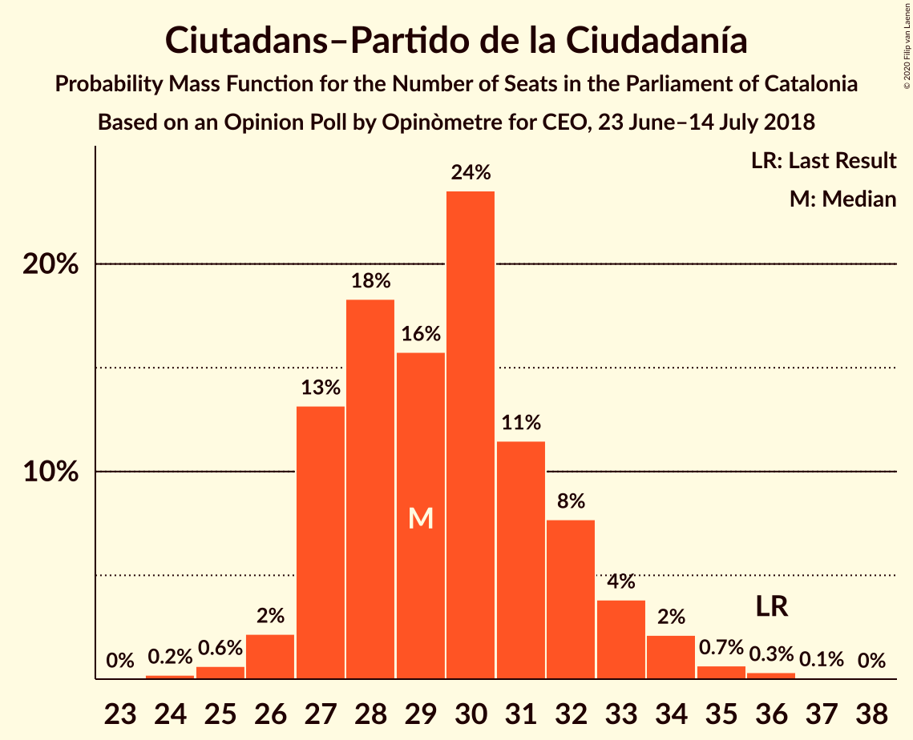
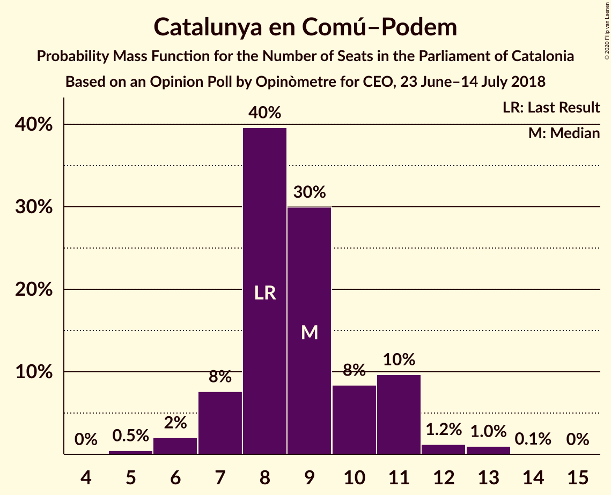
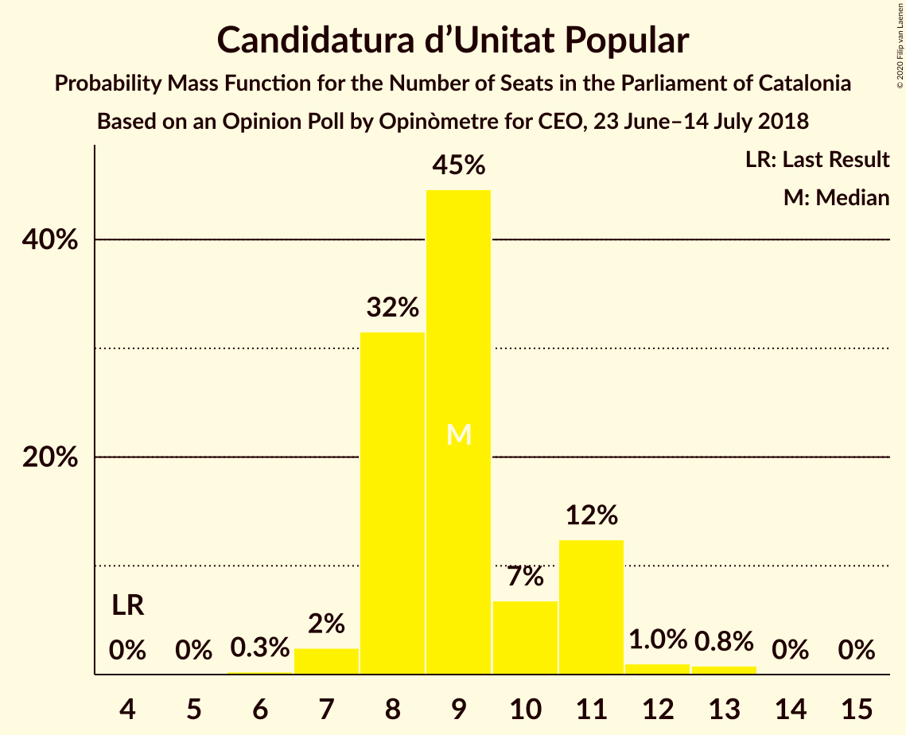
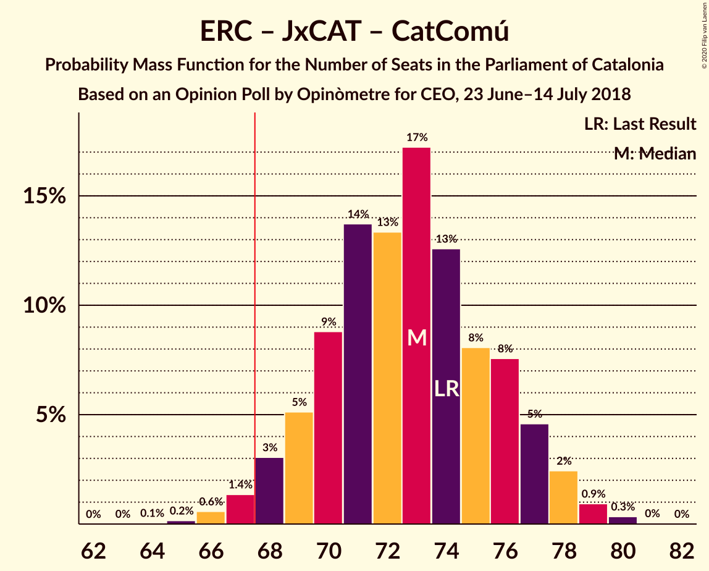

# Opinion Poll by Opinòmetre for CEO, 23 June–14 July 2018

<a href="#voting-intentions">Voting Intentions</a> | <a href="#seats">Seats</a> | <a href="#coalitions">Coalitions</a> | <a href="#technical-information">Technical Information</a>

## Voting Intentions

### Confidence Intervals

| Party | Last Result | Poll Result | 80% Confidence Interval | 90% Confidence Interval | 95% Confidence Interval | 99% Confidence Interval |
|:-----:|:-----------:|:-----------:|:-----------------------:|:-----------------------:|:-----------------------:|:-----------------------:|
| Esquerra Republicana–Catalunya Sí | 21.4% | 24.0% | 22.4–25.8% |21.9–26.2% |21.5–26.7% |20.7–27.5% |
| Ciutadans–Partido de la Ciudadanía | 25.4% | 21.4% | 19.9–23.1% |19.4–23.6% |19.1–24.0% |18.3–24.8% |
| Junts per Catalunya | 21.7% | 17.9% | 16.5–19.5% |16.0–20.0% |15.7–20.3% |15.0–21.1% |
| Partit dels Socialistes de Catalunya (PSC-PSOE) | 13.9% | 15.5% | 14.2–17.0% |13.8–17.5% |13.5–17.8% |12.8–18.6% |
| Catalunya en Comú–Podem | 7.5% | 7.8% | 6.8–9.0% |6.6–9.3% |6.3–9.6% |5.9–10.2% |
| Candidatura d’Unitat Popular | 4.5% | 7.0% | 6.1–8.2% |5.9–8.5% |5.6–8.8% |5.2–9.3% |
| Partit Popular | 4.2% | 3.8% | 3.1–4.7% |3.0–4.9% |2.8–5.2% |2.5–5.6% |

*Note:* The poll result column reflects the actual value used in the calculations. Published results may vary slightly, and in addition be rounded to fewer digits.

## Seats

### Confidence Intervals

| Party | Last Result | Median | 80% Confidence Interval | 90% Confidence Interval | 95% Confidence Interval | 99% Confidence Interval |
|:-----:|:-----------:|:------:|:-----------------------:|:-----------------------:|:-----------------------:|:-----------------------:|
| <a href="#esquerra-republicana–catalunya-sí">Esquerra Republicana–Catalunya Sí</a> | 32 | 36 | 33–39 |33–39 |32–40 |31–42 |
| <a href="#ciutadans–partido-de-la-ciudadanía">Ciutadans–Partido de la Ciudadanía</a> | 36 | 29 | 27–32 |27–33 |26–34 |25–35 |
| <a href="#junts-per-catalunya">Junts per Catalunya</a> | 34 | 28 | 25–31 |24–31 |24–32 |23–33 |
| <a href="#partit-dels-socialistes-de-catalunya-(psc-psoe)">Partit dels Socialistes de Catalunya (PSC-PSOE)</a> | 17 | 20 | 17–23 |17–24 |17–24 |16–25 |
| <a href="#catalunya-en-comú–podem">Catalunya en Comú–Podem</a> | 8 | 9 | 7–11 |7–11 |7–11 |6–13 |
| <a href="#candidatura-d’unitat-popular">Candidatura d’Unitat Popular</a> | 4 | 9 | 8–11 |8–11 |7–11 |7–13 |
| <a href="#partit-popular">Partit Popular</a> | 4 | 3 | 2–5 |2–6 |0–6 |0–7 |

### Esquerra Republicana–Catalunya Sí

*For a full overview of the results for this party, see the [Esquerra Republicana–Catalunya Sí](party-esquerrarepublicana–catalunyasí.html) page.*

| Number of Seats | Probability | Accumulated | Special Marks |
|:---------------:|:-----------:|:-----------:|:-------------:|
| 29 | 0.1% | 100% |  |
| 30 | 0.2% | 99.8% |  |
| 31 | 0.6% | 99.6% |  |
| 32 | 4% | 99.0% | Last Result |
| 33 | 12% | 95% |  |
| 34 | 11% | 83% |  |
| 35 | 20% | 72% |  |
| 36 | 11% | 52% | Median |
| 37 | 11% | 42% |  |
| 38 | 15% | 31% |  |
| 39 | 12% | 16% |  |
| 40 | 3% | 4% |  |
| 41 | 0.9% | 1.5% |  |
| 42 | 0.4% | 0.6% |  |
| 43 | 0.1% | 0.1% |  |
| 44 | 0% | 0% |  |

### Ciutadans–Partido de la Ciudadanía

*For a full overview of the results for this party, see the [Ciutadans–Partido de la Ciudadanía](party-ciutadans–partidodelaciudadanía.html) page.*

| Number of Seats | Probability | Accumulated | Special Marks |
|:---------------:|:-----------:|:-----------:|:-------------:|
| 24 | 0.2% | 100% |  |
| 25 | 0.6% | 99.8% |  |
| 26 | 2% | 99.1% |  |
| 27 | 13% | 97% |  |
| 28 | 18% | 84% |  |
| 29 | 16% | 65% | Median |
| 30 | 24% | 50% |  |
| 31 | 11% | 26% |  |
| 32 | 8% | 15% |  |
| 33 | 4% | 7% |  |
| 34 | 2% | 3% |  |
| 35 | 0.7% | 1.1% |  |
| 36 | 0.3% | 0.4% | Last Result |
| 37 | 0.1% | 0.1% |  |
| 38 | 0% | 0% |  |

### Junts per Catalunya

*For a full overview of the results for this party, see the [Junts per Catalunya](party-juntspercatalunya.html) page.*

| Number of Seats | Probability | Accumulated | Special Marks |
|:---------------:|:-----------:|:-----------:|:-------------:|
| 23 | 1.0% | 100% |  |
| 24 | 5% | 99.0% |  |
| 25 | 5% | 94% |  |
| 26 | 9% | 89% |  |
| 27 | 23% | 80% |  |
| 28 | 14% | 57% | Median |
| 29 | 21% | 43% |  |
| 30 | 10% | 22% |  |
| 31 | 8% | 12% |  |
| 32 | 3% | 4% |  |
| 33 | 2% | 2% |  |
| 34 | 0.2% | 0.3% | Last Result |
| 35 | 0% | 0.1% |  |
| 36 | 0% | 0% |  |

### Partit dels Socialistes de Catalunya (PSC-PSOE)

*For a full overview of the results for this party, see the [Partit dels Socialistes de Catalunya (PSC-PSOE)](party-partitdelssocialistesdecatalunyapsc-psoe.html) page.*

| Number of Seats | Probability | Accumulated | Special Marks |
|:---------------:|:-----------:|:-----------:|:-------------:|
| 16 | 1.4% | 100% |  |
| 17 | 9% | 98.6% | Last Result |
| 18 | 15% | 90% |  |
| 19 | 13% | 75% |  |
| 20 | 12% | 62% | Median |
| 21 | 16% | 50% |  |
| 22 | 9% | 34% |  |
| 23 | 18% | 24% |  |
| 24 | 6% | 7% |  |
| 25 | 0.9% | 1.0% |  |
| 26 | 0.1% | 0.1% |  |
| 27 | 0% | 0% |  |

### Catalunya en Comú–Podem

*For a full overview of the results for this party, see the [Catalunya en Comú–Podem](party-catalunyaencomú–podem.html) page.*

| Number of Seats | Probability | Accumulated | Special Marks |
|:---------------:|:-----------:|:-----------:|:-------------:|
| 5 | 0.5% | 100% |  |
| 6 | 2% | 99.5% |  |
| 7 | 8% | 98% |  |
| 8 | 40% | 90% | Last Result |
| 9 | 30% | 50% | Median |
| 10 | 8% | 20% |  |
| 11 | 10% | 12% |  |
| 12 | 1.2% | 2% |  |
| 13 | 1.0% | 1.0% |  |
| 14 | 0.1% | 0.1% |  |
| 15 | 0% | 0% |  |

### Candidatura d’Unitat Popular

*For a full overview of the results for this party, see the [Candidatura d’Unitat Popular](party-candidaturad’unitatpopular.html) page.*

| Number of Seats | Probability | Accumulated | Special Marks |
|:---------------:|:-----------:|:-----------:|:-------------:|
| 4 | 0% | 100% | Last Result |
| 5 | 0% | 100% |  |
| 6 | 0.3% | 100% |  |
| 7 | 2% | 99.7% |  |
| 8 | 32% | 97% |  |
| 9 | 45% | 66% | Median |
| 10 | 7% | 21% |  |
| 11 | 12% | 14% |  |
| 12 | 1.0% | 2% |  |
| 13 | 0.8% | 0.9% |  |
| 14 | 0% | 0.1% |  |
| 15 | 0% | 0% |  |

### Partit Popular

*For a full overview of the results for this party, see the [Partit Popular](party-partitpopular.html) page.*

| Number of Seats | Probability | Accumulated | Special Marks |
|:---------------:|:-----------:|:-----------:|:-------------:|
| 0 | 4% | 100% |  |
| 1 | 0% | 96% |  |
| 2 | 9% | 96% |  |
| 3 | 59% | 87% | Median |
| 4 | 6% | 28% | Last Result |
| 5 | 15% | 22% |  |
| 6 | 7% | 8% |  |
| 7 | 0.9% | 0.9% |  |
| 8 | 0% | 0% |  |

## Coalitions

### Confidence Intervals

| Coalition | Last Result | Median | Majority? | 80% Confidence Interval | 90% Confidence Interval | 95% Confidence Interval | 99% Confidence Interval |
|:---------:|:-----------:|:------:|:---------:|:-----------------------:|:-----------------------:|:-----------------------:|:-----------------------:|
| Esquerra Republicana–Catalunya Sí – Junts per Catalunya – Candidatura d’Unitat Popular | 70 | 73 | 98% | 70–77 | 69–78 | 68–78 | 66–80 |
| Esquerra Republicana–Catalunya Sí – Junts per Catalunya – Catalunya en Comú–Podem | 74 | 73 | 98% | 69–76 | 68–77 | 68–78 | 66–79 |
| Esquerra Republicana–Catalunya Sí – Partit dels Socialistes de Catalunya (PSC-PSOE) – Catalunya en Comú–Podem | 57 | 65 | 17% | 62–68 | 61–70 | 60–70 | 58–72 |
| Esquerra Republicana–Catalunya Sí – Junts per Catalunya | 66 | 64 | 10% | 61–67 | 60–68 | 59–69 | 58–71 |
| Ciutadans–Partido de la Ciudadanía – Partit dels Socialistes de Catalunya (PSC-PSOE) – Catalunya en Comú–Podem – Partit Popular | 65 | 62 | 2% | 58–65 | 57–66 | 57–67 | 55–69 |
| Ciutadans–Partido de la Ciudadanía – Partit dels Socialistes de Catalunya (PSC-PSOE) – Partit Popular | 57 | 53 | 0% | 50–56 | 49–57 | 48–58 | 47–60 |
| Esquerra Republicana–Catalunya Sí – Catalunya en Comú–Podem | 40 | 44 | 0% | 42–48 | 41–49 | 40–49 | 39–51 |

### Esquerra Republicana–Catalunya Sí – Junts per Catalunya – Candidatura d’Unitat Popular

| Number of Seats | Probability | Accumulated | Special Marks |
|:---------------:|:-----------:|:-----------:|:-------------:|
| 65 | 0.1% | 100% |  |
| 66 | 0.4% | 99.9% |  |
| 67 | 1.1% | 99.5% |  |
| 68 | 3% | 98% | Majority |
| 69 | 5% | 96% |  |
| 70 | 7% | 91% | Last Result |
| 71 | 13% | 84% |  |
| 72 | 14% | 72% |  |
| 73 | 17% | 58% | Median |
| 74 | 12% | 40% |  |
| 75 | 12% | 28% |  |
| 76 | 6% | 17% |  |
| 77 | 5% | 11% |  |
| 78 | 3% | 5% |  |
| 79 | 2% | 2% |  |
| 80 | 0.4% | 0.5% |  |
| 81 | 0.1% | 0.1% |  |
| 82 | 0% | 0% |  |

### Esquerra Republicana–Catalunya Sí – Junts per Catalunya – Catalunya en Comú–Podem

| Number of Seats | Probability | Accumulated | Special Marks |
|:---------------:|:-----------:|:-----------:|:-------------:|
| 64 | 0.1% | 100% |  |
| 65 | 0.2% | 99.9% |  |
| 66 | 0.6% | 99.8% |  |
| 67 | 1.4% | 99.2% |  |
| 68 | 3% | 98% | Majority |
| 69 | 5% | 95% |  |
| 70 | 9% | 90% |  |
| 71 | 14% | 81% |  |
| 72 | 13% | 67% |  |
| 73 | 17% | 54% | Median |
| 74 | 13% | 37% | Last Result |
| 75 | 8% | 24% |  |
| 76 | 8% | 16% |  |
| 77 | 5% | 8% |  |
| 78 | 2% | 4% |  |
| 79 | 0.9% | 1.3% |  |
| 80 | 0.3% | 0.4% |  |
| 81 | 0% | 0% |  |

### Esquerra Republicana–Catalunya Sí – Partit dels Socialistes de Catalunya (PSC-PSOE) – Catalunya en Comú–Podem

| Number of Seats | Probability | Accumulated | Special Marks |
|:---------------:|:-----------:|:-----------:|:-------------:|
| 57 | 0.1% | 100% | Last Result |
| 58 | 0.4% | 99.9% |  |
| 59 | 1.0% | 99.5% |  |
| 60 | 3% | 98.5% |  |
| 61 | 5% | 95% |  |
| 62 | 9% | 90% |  |
| 63 | 8% | 81% |  |
| 64 | 11% | 73% |  |
| 65 | 15% | 62% | Median |
| 66 | 18% | 47% |  |
| 67 | 12% | 29% |  |
| 68 | 8% | 17% | Majority |
| 69 | 4% | 9% |  |
| 70 | 3% | 5% |  |
| 71 | 1.4% | 2% |  |
| 72 | 0.6% | 0.9% |  |
| 73 | 0.2% | 0.3% |  |
| 74 | 0% | 0.1% |  |
| 75 | 0% | 0% |  |

### Esquerra Republicana–Catalunya Sí – Junts per Catalunya

| Number of Seats | Probability | Accumulated | Special Marks |
|:---------------:|:-----------:|:-----------:|:-------------:|
| 56 | 0.1% | 100% |  |
| 57 | 0.3% | 99.8% |  |
| 58 | 1.2% | 99.5% |  |
| 59 | 2% | 98% |  |
| 60 | 6% | 96% |  |
| 61 | 7% | 90% |  |
| 62 | 11% | 84% |  |
| 63 | 15% | 73% |  |
| 64 | 16% | 58% | Median |
| 65 | 14% | 42% |  |
| 66 | 11% | 27% | Last Result |
| 67 | 6% | 16% |  |
| 68 | 5% | 10% | Majority |
| 69 | 3% | 5% |  |
| 70 | 1.3% | 2% |  |
| 71 | 0.4% | 0.6% |  |
| 72 | 0.1% | 0.1% |  |
| 73 | 0% | 0% |  |

### Ciutadans–Partido de la Ciudadanía – Partit dels Socialistes de Catalunya (PSC-PSOE) – Catalunya en Comú–Podem – Partit Popular

| Number of Seats | Probability | Accumulated | Special Marks |
|:---------------:|:-----------:|:-----------:|:-------------:|
| 54 | 0.1% | 100% |  |
| 55 | 0.4% | 99.9% |  |
| 56 | 2% | 99.5% |  |
| 57 | 3% | 98% |  |
| 58 | 5% | 95% |  |
| 59 | 6% | 89% |  |
| 60 | 12% | 83% |  |
| 61 | 12% | 72% | Median |
| 62 | 17% | 60% |  |
| 63 | 14% | 42% |  |
| 64 | 13% | 28% |  |
| 65 | 7% | 16% | Last Result |
| 66 | 5% | 9% |  |
| 67 | 3% | 4% |  |
| 68 | 1.1% | 2% | Majority |
| 69 | 0.4% | 0.5% |  |
| 70 | 0.1% | 0.1% |  |
| 71 | 0% | 0% |  |

### Ciutadans–Partido de la Ciudadanía – Partit dels Socialistes de Catalunya (PSC-PSOE) – Partit Popular

| Number of Seats | Probability | Accumulated | Special Marks |
|:---------------:|:-----------:|:-----------:|:-------------:|
| 46 | 0.3% | 100% |  |
| 47 | 0.9% | 99.7% |  |
| 48 | 3% | 98.8% |  |
| 49 | 5% | 96% |  |
| 50 | 7% | 91% |  |
| 51 | 9% | 84% |  |
| 52 | 12% | 75% | Median |
| 53 | 15% | 64% |  |
| 54 | 16% | 48% |  |
| 55 | 13% | 32% |  |
| 56 | 10% | 20% |  |
| 57 | 5% | 9% | Last Result |
| 58 | 3% | 5% |  |
| 59 | 1.0% | 2% |  |
| 60 | 0.5% | 0.7% |  |
| 61 | 0.1% | 0.2% |  |
| 62 | 0% | 0.1% |  |
| 63 | 0% | 0% |  |

### Esquerra Republicana–Catalunya Sí – Catalunya en Comú–Podem

| Number of Seats | Probability | Accumulated | Special Marks |
|:---------------:|:-----------:|:-----------:|:-------------:|
| 37 | 0.1% | 100% |  |
| 38 | 0.2% | 99.9% |  |
| 39 | 0.6% | 99.7% |  |
| 40 | 2% | 99.0% | Last Result |
| 41 | 6% | 97% |  |
| 42 | 10% | 91% |  |
| 43 | 15% | 81% |  |
| 44 | 17% | 66% |  |
| 45 | 11% | 50% | Median |
| 46 | 12% | 38% |  |
| 47 | 13% | 26% |  |
| 48 | 7% | 13% |  |
| 49 | 4% | 6% |  |
| 50 | 2% | 2% |  |
| 51 | 0.5% | 0.6% |  |
| 52 | 0.1% | 0.2% |  |
| 53 | 0% | 0.1% |  |
| 54 | 0% | 0% |  |

## Technical Information

### Opinion Poll

+ **Polling firm:** Opinòmetre
+ **Commissioner(s):** CEO
+ **Fieldwork period:** 23 June–14 July 2018

### Calculations

+ **Sample size:** 1050
+ **Simulations done:** 1,048,576
+ **Error estimate:** 2.21%

