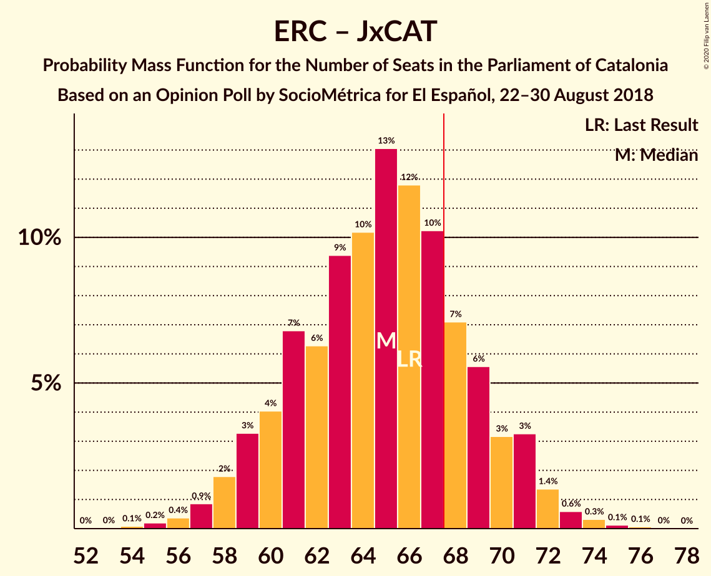

# Opinion Poll by SocioMétrica for El Español, 22–30 August 2018

<a href="#voting-intentions">Voting Intentions</a> | <a href="#seats">Seats</a> | <a href="#coalitions">Coalitions</a> | <a href="#technical-information">Technical Information</a>

## Voting Intentions

### Confidence Intervals

| Party | Last Result | Poll Result | 80% Confidence Interval | 90% Confidence Interval | 95% Confidence Interval | 99% Confidence Interval |
|:-----:|:-----------:|:-----------:|:-----------------------:|:-----------------------:|:-----------------------:|:-----------------------:|
| Esquerra Republicana–Catalunya Sí | 21.4% | 25.2% | 22.8–27.8% |22.2–28.5% |21.6–29.2% |20.5–30.5% |
| Ciutadans–Partido de la Ciudadanía | 25.4% | 22.4% | 20.1–24.9% |19.5–25.6% |19.0–26.3% |17.9–27.5% |
| Junts pel Catalunya | 21.7% | 18.4% | 16.3–20.8% |15.7–21.5% |15.2–22.0% |14.3–23.2% |
| Partit dels Socialistes de Catalunya (PSC-PSOE) | 13.9% | 15.0% | 13.1–17.2% |12.6–17.8% |12.1–18.4% |11.3–19.5% |
| Catalunya en Comú–Podem | 7.5% | 7.4% | 6.1–9.1% |5.7–9.6% |5.4–10.0% |4.8–10.9% |
| Candidatura d’Unitat Popular | 4.5% | 5.6% | 4.5–7.1% |4.2–7.6% |3.9–8.0% |3.4–8.8% |
| Partit Popular | 4.2% | 5.2% | 4.1–6.7% |3.8–7.1% |3.6–7.5% |3.1–8.3% |

*Note:* The poll result column reflects the actual value used in the calculations. Published results may vary slightly, and in addition be rounded to fewer digits.

## Seats

### Confidence Intervals

| Party | Last Result | Median | 80% Confidence Interval | 90% Confidence Interval | 95% Confidence Interval | 99% Confidence Interval |
|:-----:|:-----------:|:------:|:-----------------------:|:-----------------------:|:-----------------------:|:-----------------------:|
| <a href="#esquerra-republicana–catalunya-sí">Esquerra Republicana–Catalunya Sí</a> | 32 | 37 | 33–41 |32–42 |31–43 |29–45 |
| <a href="#ciutadans–partido-de-la-ciudadanía">Ciutadans–Partido de la Ciudadanía</a> | 36 | 30 | 27–35 |26–36 |26–36 |24–38 |
| <a href="#junts-pel-catalunya">Junts pel Catalunya</a> | 34 | 28 | 24–32 |24–32 |23–34 |22–36 |
| <a href="#partit-dels-socialistes-de-catalunya-(psc-psoe)">Partit dels Socialistes de Catalunya (PSC-PSOE)</a> | 17 | 18 | 16–23 |16–24 |15–24 |14–25 |
| <a href="#catalunya-en-comú–podem">Catalunya en Comú–Podem</a> | 8 | 8 | 6–11 |5–11 |5–11 |4–13 |
| <a href="#candidatura-d’unitat-popular">Candidatura d’Unitat Popular</a> | 4 | 8 | 4–9 |4–9 |3–10 |2–11 |
| <a href="#partit-popular">Partit Popular</a> | 4 | 6 | 3–8 |3–9 |3–9 |2–10 |

### Esquerra Republicana–Catalunya Sí

*For a full overview of the results for this party, see the [Esquerra Republicana–Catalunya Sí](party-esquerrarepublicana–catalunyasí.html) page.*

| Number of Seats | Probability | Accumulated | Special Marks |
|:---------------:|:-----------:|:-----------:|:-------------:|
| 28 | 0.2% | 100% |  |
| 29 | 0.7% | 99.8% |  |
| 30 | 0.5% | 99.1% |  |
| 31 | 1.4% | 98.6% |  |
| 32 | 4% | 97% | Last Result |
| 33 | 8% | 93% |  |
| 34 | 10% | 85% |  |
| 35 | 15% | 75% |  |
| 36 | 8% | 60% |  |
| 37 | 8% | 52% | Median |
| 38 | 8% | 44% |  |
| 39 | 8% | 36% |  |
| 40 | 13% | 27% |  |
| 41 | 8% | 15% |  |
| 42 | 4% | 7% |  |
| 43 | 1.4% | 3% |  |
| 44 | 0.7% | 2% |  |
| 45 | 0.7% | 0.9% |  |
| 46 | 0.1% | 0.2% |  |
| 47 | 0.1% | 0.1% |  |
| 48 | 0% | 0% |  |

### Ciutadans–Partido de la Ciudadanía

*For a full overview of the results for this party, see the [Ciutadans–Partido de la Ciudadanía](party-ciutadans–partidodelaciudadanía.html) page.*

| Number of Seats | Probability | Accumulated | Special Marks |
|:---------------:|:-----------:|:-----------:|:-------------:|
| 21 | 0% | 100% |  |
| 22 | 0.1% | 99.9% |  |
| 23 | 0.2% | 99.8% |  |
| 24 | 0.7% | 99.7% |  |
| 25 | 1.4% | 99.0% |  |
| 26 | 3% | 98% |  |
| 27 | 12% | 94% |  |
| 28 | 11% | 82% |  |
| 29 | 11% | 72% |  |
| 30 | 19% | 61% | Median |
| 31 | 13% | 42% |  |
| 32 | 7% | 29% |  |
| 33 | 5% | 22% |  |
| 34 | 6% | 17% |  |
| 35 | 6% | 11% |  |
| 36 | 3% | 5% | Last Result |
| 37 | 1.4% | 2% |  |
| 38 | 0.8% | 0.9% |  |
| 39 | 0.1% | 0.1% |  |
| 40 | 0% | 0% |  |

### Junts pel Catalunya

*For a full overview of the results for this party, see the [Junts pel Catalunya](party-juntspelcatalunya.html) page.*

| Number of Seats | Probability | Accumulated | Special Marks |
|:---------------:|:-----------:|:-----------:|:-------------:|
| 19 | 0% | 100% |  |
| 20 | 0.1% | 99.9% |  |
| 21 | 0.2% | 99.8% |  |
| 22 | 0.5% | 99.5% |  |
| 23 | 3% | 99.1% |  |
| 24 | 6% | 96% |  |
| 25 | 8% | 90% |  |
| 26 | 19% | 82% |  |
| 27 | 10% | 62% |  |
| 28 | 10% | 53% | Median |
| 29 | 11% | 43% |  |
| 30 | 8% | 32% |  |
| 31 | 11% | 24% |  |
| 32 | 8% | 13% |  |
| 33 | 2% | 5% |  |
| 34 | 2% | 3% | Last Result |
| 35 | 0.6% | 1.2% |  |
| 36 | 0.3% | 0.6% |  |
| 37 | 0.2% | 0.3% |  |
| 38 | 0.1% | 0.1% |  |
| 39 | 0% | 0% |  |

### Partit dels Socialistes de Catalunya (PSC-PSOE)

*For a full overview of the results for this party, see the [Partit dels Socialistes de Catalunya (PSC-PSOE)](party-partitdelssocialistesdecatalunyapsc-psoe.html) page.*

| Number of Seats | Probability | Accumulated | Special Marks |
|:---------------:|:-----------:|:-----------:|:-------------:|
| 12 | 0.1% | 100% |  |
| 13 | 0.3% | 99.9% |  |
| 14 | 0.5% | 99.6% |  |
| 15 | 4% | 99.1% |  |
| 16 | 13% | 96% |  |
| 17 | 22% | 83% | Last Result |
| 18 | 15% | 60% | Median |
| 19 | 9% | 46% |  |
| 20 | 14% | 37% |  |
| 21 | 4% | 23% |  |
| 22 | 5% | 19% |  |
| 23 | 8% | 13% |  |
| 24 | 4% | 6% |  |
| 25 | 1.0% | 1.4% |  |
| 26 | 0.4% | 0.4% |  |
| 27 | 0% | 0.1% |  |
| 28 | 0% | 0% |  |

### Catalunya en Comú–Podem

*For a full overview of the results for this party, see the [Catalunya en Comú–Podem](party-catalunyaencomú–podem.html) page.*

| Number of Seats | Probability | Accumulated | Special Marks |
|:---------------:|:-----------:|:-----------:|:-------------:|
| 4 | 0.8% | 100% |  |
| 5 | 7% | 99.2% |  |
| 6 | 14% | 92% |  |
| 7 | 14% | 78% |  |
| 8 | 35% | 64% | Last Result, Median |
| 9 | 15% | 29% |  |
| 10 | 4% | 14% |  |
| 11 | 8% | 10% |  |
| 12 | 0.8% | 2% |  |
| 13 | 1.3% | 2% |  |
| 14 | 0.4% | 0.4% |  |
| 15 | 0% | 0% |  |

### Candidatura d’Unitat Popular

*For a full overview of the results for this party, see the [Candidatura d’Unitat Popular](party-candidaturad’unitatpopular.html) page.*

| Number of Seats | Probability | Accumulated | Special Marks |
|:---------------:|:-----------:|:-----------:|:-------------:|
| 0 | 0.1% | 100% |  |
| 1 | 0% | 99.9% |  |
| 2 | 0.5% | 99.9% |  |
| 3 | 3% | 99.4% |  |
| 4 | 7% | 97% | Last Result |
| 5 | 5% | 89% |  |
| 6 | 17% | 85% |  |
| 7 | 17% | 68% |  |
| 8 | 37% | 51% | Median |
| 9 | 11% | 14% |  |
| 10 | 2% | 3% |  |
| 11 | 1.3% | 2% |  |
| 12 | 0.1% | 0.2% |  |
| 13 | 0.1% | 0.2% |  |
| 14 | 0% | 0% |  |

### Partit Popular

*For a full overview of the results for this party, see the [Partit Popular](party-partitpopular.html) page.*

| Number of Seats | Probability | Accumulated | Special Marks |
|:---------------:|:-----------:|:-----------:|:-------------:|
| 0 | 0.3% | 100% |  |
| 1 | 0% | 99.7% |  |
| 2 | 1.0% | 99.7% |  |
| 3 | 14% | 98.7% |  |
| 4 | 4% | 85% | Last Result |
| 5 | 18% | 81% |  |
| 6 | 21% | 63% | Median |
| 7 | 31% | 42% |  |
| 8 | 5% | 11% |  |
| 9 | 5% | 7% |  |
| 10 | 1.5% | 2% |  |
| 11 | 0.1% | 0.2% |  |
| 12 | 0.1% | 0.1% |  |
| 13 | 0% | 0% |  |

## Coalitions

### Confidence Intervals

| Coalition | Last Result | Median | Majority? | 80% Confidence Interval | 90% Confidence Interval | 95% Confidence Interval | 99% Confidence Interval |
|:---------:|:-----------:|:------:|:---------:|:-----------------------:|:-----------------------:|:-----------------------:|:-----------------------:|
| Esquerra Republicana–Catalunya Sí – Junts pel Catalunya – Catalunya en Comú–Podem | 74 | 73 | 94% | 68–77 | 67–78 | 66–80 | 64–82 |
| Esquerra Republicana–Catalunya Sí – Junts pel Catalunya – Candidatura d’Unitat Popular | 70 | 72 | 90% | 67–77 | 66–78 | 65–79 | 63–80 |
| Esquerra Republicana–Catalunya Sí – Junts pel Catalunya | 66 | 65 | 22% | 60–70 | 59–71 | 58–71 | 56–74 |
| Esquerra Republicana–Catalunya Sí – Partit dels Socialistes de Catalunya (PSC-PSOE) – Catalunya en Comú–Podem | 57 | 64 | 13% | 59–68 | 58–70 | 57–71 | 55–73 |
| Ciutadans–Partido de la Ciudadanía – Partit dels Socialistes de Catalunya (PSC-PSOE) – Catalunya en Comú–Podem – Partit Popular | 65 | 63 | 10% | 58–68 | 57–69 | 56–70 | 55–72 |
| Ciutadans–Partido de la Ciudadanía – Partit dels Socialistes de Catalunya (PSC-PSOE) – Partit Popular | 57 | 55 | 0% | 50–60 | 50–61 | 48–62 | 47–64 |
| Esquerra Republicana–Catalunya Sí – Catalunya en Comú–Podem | 40 | 45 | 0% | 41–49 | 39–50 | 38–51 | 37–53 |

### Esquerra Republicana–Catalunya Sí – Junts pel Catalunya – Catalunya en Comú–Podem

| Number of Seats | Probability | Accumulated | Special Marks |
|:---------------:|:-----------:|:-----------:|:-------------:|
| 61 | 0% | 100% |  |
| 62 | 0% | 99.9% |  |
| 63 | 0.2% | 99.9% |  |
| 64 | 1.1% | 99.7% |  |
| 65 | 0.6% | 98.6% |  |
| 66 | 2% | 98% |  |
| 67 | 2% | 96% |  |
| 68 | 5% | 94% | Majority |
| 69 | 7% | 89% |  |
| 70 | 7% | 82% |  |
| 71 | 11% | 75% |  |
| 72 | 8% | 65% |  |
| 73 | 13% | 56% | Median |
| 74 | 9% | 43% | Last Result |
| 75 | 10% | 34% |  |
| 76 | 7% | 24% |  |
| 77 | 10% | 17% |  |
| 78 | 2% | 7% |  |
| 79 | 2% | 5% |  |
| 80 | 1.4% | 3% |  |
| 81 | 0.8% | 1.4% |  |
| 82 | 0.2% | 0.6% |  |
| 83 | 0.3% | 0.4% |  |
| 84 | 0% | 0.1% |  |
| 85 | 0% | 0% |  |

### Esquerra Republicana–Catalunya Sí – Junts pel Catalunya – Candidatura d’Unitat Popular

| Number of Seats | Probability | Accumulated | Special Marks |
|:---------------:|:-----------:|:-----------:|:-------------:|
| 60 | 0% | 100% |  |
| 61 | 0.1% | 99.9% |  |
| 62 | 0.3% | 99.8% |  |
| 63 | 0.3% | 99.5% |  |
| 64 | 0.8% | 99.3% |  |
| 65 | 2% | 98% |  |
| 66 | 4% | 97% |  |
| 67 | 3% | 93% |  |
| 68 | 6% | 90% | Majority |
| 69 | 10% | 84% |  |
| 70 | 10% | 74% | Last Result |
| 71 | 8% | 64% |  |
| 72 | 11% | 56% |  |
| 73 | 9% | 45% | Median |
| 74 | 10% | 36% |  |
| 75 | 9% | 26% |  |
| 76 | 5% | 17% |  |
| 77 | 3% | 12% |  |
| 78 | 5% | 9% |  |
| 79 | 3% | 4% |  |
| 80 | 0.5% | 0.9% |  |
| 81 | 0.2% | 0.4% |  |
| 82 | 0.1% | 0.2% |  |
| 83 | 0% | 0.1% |  |
| 84 | 0% | 0% |  |

### Esquerra Republicana–Catalunya Sí – Junts pel Catalunya

| Number of Seats | Probability | Accumulated | Special Marks |
|:---------------:|:-----------:|:-----------:|:-------------:|
| 53 | 0% | 100% |  |
| 54 | 0.1% | 99.9% |  |
| 55 | 0.1% | 99.9% |  |
| 56 | 0.4% | 99.8% |  |
| 57 | 1.0% | 99.4% |  |
| 58 | 3% | 98% |  |
| 59 | 2% | 96% |  |
| 60 | 5% | 94% |  |
| 61 | 7% | 89% |  |
| 62 | 6% | 82% |  |
| 63 | 11% | 76% |  |
| 64 | 10% | 65% |  |
| 65 | 11% | 56% | Median |
| 66 | 10% | 45% | Last Result |
| 67 | 13% | 35% |  |
| 68 | 5% | 22% | Majority |
| 69 | 6% | 17% |  |
| 70 | 4% | 11% |  |
| 71 | 5% | 7% |  |
| 72 | 1.3% | 2% |  |
| 73 | 0.6% | 1.1% |  |
| 74 | 0.3% | 0.5% |  |
| 75 | 0.1% | 0.2% |  |
| 76 | 0.1% | 0.1% |  |
| 77 | 0% | 0% |  |

### Esquerra Republicana–Catalunya Sí – Partit dels Socialistes de Catalunya (PSC-PSOE) – Catalunya en Comú–Podem

| Number of Seats | Probability | Accumulated | Special Marks |
|:---------------:|:-----------:|:-----------:|:-------------:|
| 53 | 0.1% | 100% |  |
| 54 | 0.3% | 99.8% |  |
| 55 | 0.3% | 99.6% |  |
| 56 | 1.4% | 99.2% |  |
| 57 | 2% | 98% | Last Result |
| 58 | 3% | 96% |  |
| 59 | 5% | 93% |  |
| 60 | 9% | 88% |  |
| 61 | 8% | 79% |  |
| 62 | 6% | 70% |  |
| 63 | 11% | 65% | Median |
| 64 | 10% | 53% |  |
| 65 | 13% | 43% |  |
| 66 | 9% | 30% |  |
| 67 | 7% | 20% |  |
| 68 | 5% | 13% | Majority |
| 69 | 2% | 8% |  |
| 70 | 3% | 6% |  |
| 71 | 0.9% | 3% |  |
| 72 | 1.0% | 2% |  |
| 73 | 0.5% | 0.8% |  |
| 74 | 0.2% | 0.3% |  |
| 75 | 0.1% | 0.1% |  |
| 76 | 0% | 0.1% |  |
| 77 | 0% | 0% |  |

### Ciutadans–Partido de la Ciudadanía – Partit dels Socialistes de Catalunya (PSC-PSOE) – Catalunya en Comú–Podem – Partit Popular

| Number of Seats | Probability | Accumulated | Special Marks |
|:---------------:|:-----------:|:-----------:|:-------------:|
| 52 | 0% | 100% |  |
| 53 | 0.1% | 99.9% |  |
| 54 | 0.2% | 99.8% |  |
| 55 | 0.5% | 99.6% |  |
| 56 | 3% | 99.1% |  |
| 57 | 5% | 96% |  |
| 58 | 3% | 91% |  |
| 59 | 5% | 88% |  |
| 60 | 9% | 83% |  |
| 61 | 10% | 74% |  |
| 62 | 9% | 64% | Median |
| 63 | 11% | 55% |  |
| 64 | 8% | 44% |  |
| 65 | 10% | 36% | Last Result |
| 66 | 10% | 26% |  |
| 67 | 6% | 16% |  |
| 68 | 3% | 10% | Majority |
| 69 | 4% | 7% |  |
| 70 | 2% | 3% |  |
| 71 | 0.8% | 2% |  |
| 72 | 0.3% | 0.7% |  |
| 73 | 0.3% | 0.5% |  |
| 74 | 0.1% | 0.2% |  |
| 75 | 0% | 0.1% |  |
| 76 | 0% | 0% |  |

### Ciutadans–Partido de la Ciudadanía – Partit dels Socialistes de Catalunya (PSC-PSOE) – Partit Popular

| Number of Seats | Probability | Accumulated | Special Marks |
|:---------------:|:-----------:|:-----------:|:-------------:|
| 44 | 0% | 100% |  |
| 45 | 0.1% | 99.9% |  |
| 46 | 0.2% | 99.9% |  |
| 47 | 0.4% | 99.6% |  |
| 48 | 2% | 99.3% |  |
| 49 | 2% | 97% |  |
| 50 | 8% | 96% |  |
| 51 | 6% | 88% |  |
| 52 | 6% | 82% |  |
| 53 | 11% | 77% |  |
| 54 | 12% | 65% | Median |
| 55 | 9% | 53% |  |
| 56 | 8% | 44% |  |
| 57 | 11% | 37% | Last Result |
| 58 | 8% | 25% |  |
| 59 | 6% | 17% |  |
| 60 | 4% | 11% |  |
| 61 | 4% | 7% |  |
| 62 | 1.0% | 3% |  |
| 63 | 1.4% | 2% |  |
| 64 | 0.3% | 0.7% |  |
| 65 | 0.3% | 0.4% |  |
| 66 | 0.1% | 0.1% |  |
| 67 | 0% | 0.1% |  |
| 68 | 0% | 0% | Majority |

### Esquerra Republicana–Catalunya Sí – Catalunya en Comú–Podem

| Number of Seats | Probability | Accumulated | Special Marks |
|:---------------:|:-----------:|:-----------:|:-------------:|
| 35 | 0.1% | 100% |  |
| 36 | 0.3% | 99.9% |  |
| 37 | 0.9% | 99.6% |  |
| 38 | 2% | 98.7% |  |
| 39 | 3% | 97% |  |
| 40 | 3% | 94% | Last Result |
| 41 | 7% | 91% |  |
| 42 | 10% | 84% |  |
| 43 | 13% | 74% |  |
| 44 | 10% | 61% |  |
| 45 | 8% | 51% | Median |
| 46 | 10% | 44% |  |
| 47 | 10% | 34% |  |
| 48 | 9% | 24% |  |
| 49 | 6% | 15% |  |
| 50 | 6% | 10% |  |
| 51 | 2% | 4% |  |
| 52 | 0.8% | 2% |  |
| 53 | 0.7% | 1.1% |  |
| 54 | 0.3% | 0.4% |  |
| 55 | 0.1% | 0.1% |  |
| 56 | 0% | 0.1% |  |
| 57 | 0% | 0% |  |

## Technical Information

### Opinion Poll

+ **Polling firm:** SocioMétrica
+ **Commissioner(s):** El Español
+ **Fieldwork period:** 22–30 August 2018

### Calculations

+ **Sample size:** 500
+ **Simulations done:** 262,144
+ **Error estimate:** 2.26%

