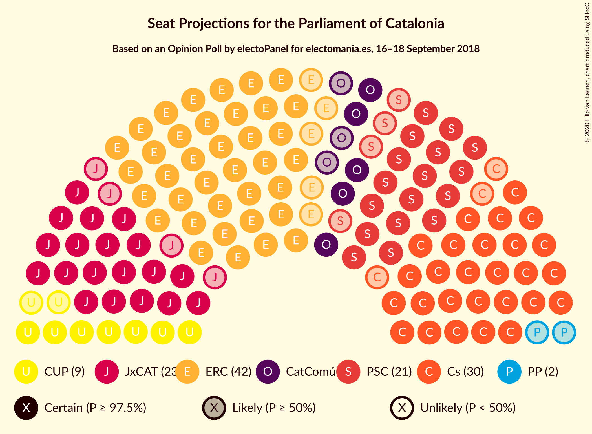
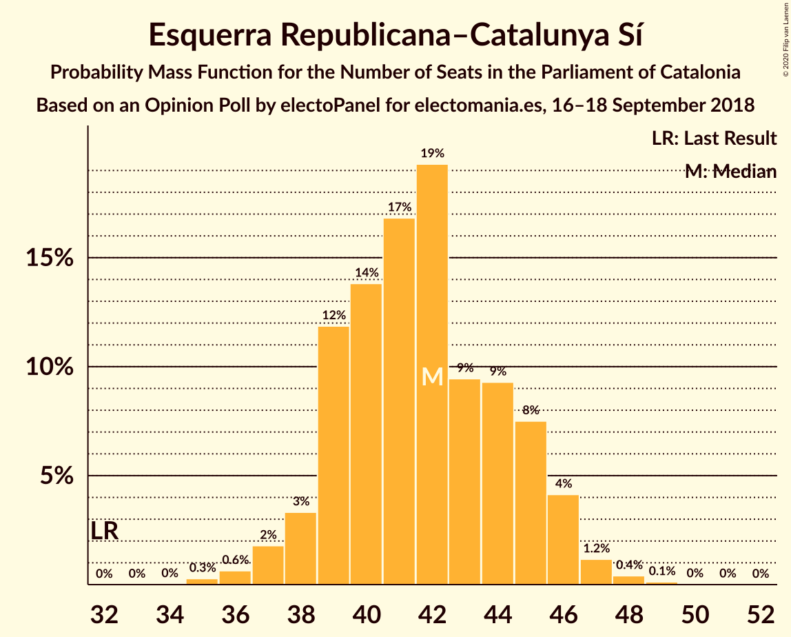
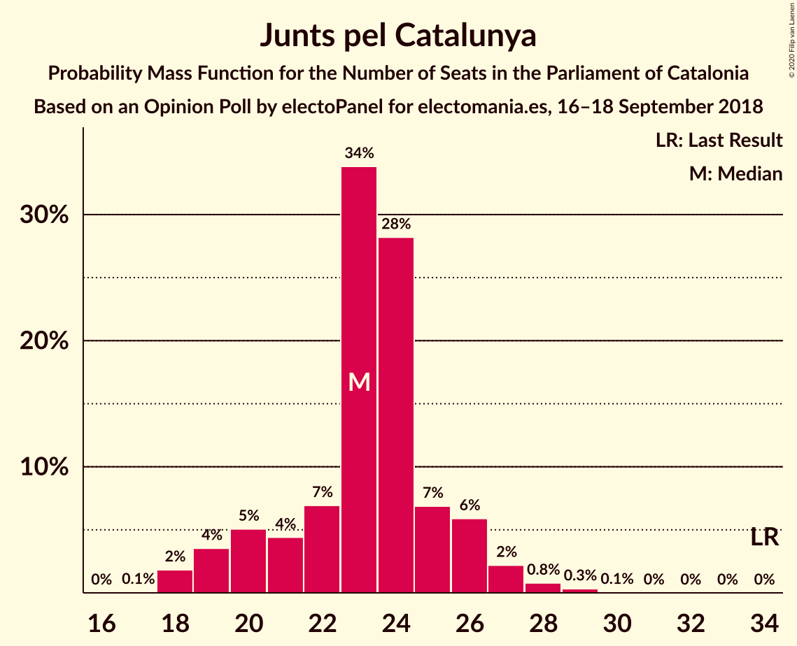
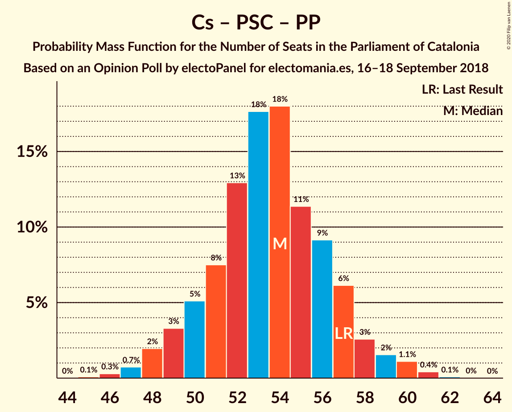

# Opinion Poll by electoPanel for electomania.es, 16–18 September 2018

<a href="#voting-intentions">Voting Intentions</a> | <a href="#seats">Seats</a> | <a href="#coalitions">Coalitions</a> | <a href="#technical-information">Technical Information</a>

## Voting Intentions

### Confidence Intervals

| Party | Last Result | Poll Result | 80% Confidence Interval | 90% Confidence Interval | 95% Confidence Interval | 99% Confidence Interval |
|:-----:|:-----------:|:-----------:|:-----------------------:|:-----------------------:|:-----------------------:|:-----------------------:|
| Esquerra Republicana–Catalunya Sí | 21.4% | 27.7% | 25.9–29.6% |25.4–30.1% |25.0–30.6% |24.2–31.5% |
| Ciutadans–Partido de la Ciudadanía | 25.4% | 21.9% | 20.3–23.7% |19.8–24.1% |19.4–24.6% |18.7–25.4% |
| Partit dels Socialistes de Catalunya (PSC-PSOE) | 13.9% | 16.1% | 14.7–17.7% |14.3–18.1% |13.9–18.5% |13.3–19.3% |
| Junts pel Catalunya | 21.7% | 14.9% | 13.5–16.4% |13.2–16.9% |12.8–17.3% |12.2–18.0% |
| Catalunya en Comú–Podem | 7.5% | 7.0% | 6.1–8.2% |5.8–8.5% |5.6–8.8% |5.2–9.3% |
| Candidatura d’Unitat Popular | 4.5% | 7.0% | 6.1–8.2% |5.8–8.5% |5.6–8.8% |5.2–9.3% |
| Partit Popular | 4.2% | 3.2% | 2.6–4.0% |2.4–4.3% |2.3–4.5% |2.0–4.9% |

*Note:* The poll result column reflects the actual value used in the calculations. Published results may vary slightly, and in addition be rounded to fewer digits.

## Seats

### Confidence Intervals

| Party | Last Result | Median | 80% Confidence Interval | 90% Confidence Interval | 95% Confidence Interval | 99% Confidence Interval |
|:-----:|:-----------:|:------:|:-----------------------:|:-----------------------:|:-----------------------:|:-----------------------:|
| <a href="#esquerra-republicana–catalunya-sí">Esquerra Republicana–Catalunya Sí</a> | 32 | 41 | 39–45 |38–46 |38–46 |36–47 |
| <a href="#ciutadans–partido-de-la-ciudadanía">Ciutadans–Partido de la Ciudadanía</a> | 36 | 30 | 27–33 |27–34 |27–35 |26–36 |
| <a href="#partit-dels-socialistes-de-catalunya-(psc-psoe)">Partit dels Socialistes de Catalunya (PSC-PSOE)</a> | 17 | 21 | 18–24 |18–24 |17–25 |17–26 |
| <a href="#junts-pel-catalunya">Junts pel Catalunya</a> | 34 | 23 | 20–26 |19–26 |19–27 |18–28 |
| <a href="#catalunya-en-comú–podem">Catalunya en Comú–Podem</a> | 8 | 8 | 6–9 |5–10 |5–10 |5–11 |
| <a href="#candidatura-d’unitat-popular">Candidatura d’Unitat Popular</a> | 4 | 9 | 8–11 |8–11 |7–11 |7–13 |
| <a href="#partit-popular">Partit Popular</a> | 4 | 3 | 0–3 |0–4 |0–5 |0–6 |

### Esquerra Republicana–Catalunya Sí

*For a full overview of the results for this party, see the [Esquerra Republicana–Catalunya Sí](party-esquerrarepublicana–catalunyasí.html) page.*

| Number of Seats | Probability | Accumulated | Special Marks |
|:---------------:|:-----------:|:-----------:|:-------------:|
| 32 | 0% | 100% | Last Result |
| 33 | 0% | 100% |  |
| 34 | 0% | 100% |  |
| 35 | 0.3% | 100% |  |
| 36 | 0.4% | 99.6% |  |
| 37 | 1.5% | 99.2% |  |
| 38 | 4% | 98% |  |
| 39 | 8% | 94% |  |
| 40 | 18% | 86% |  |
| 41 | 18% | 67% | Median |
| 42 | 15% | 49% |  |
| 43 | 10% | 34% |  |
| 44 | 13% | 24% |  |
| 45 | 5% | 11% |  |
| 46 | 4% | 6% |  |
| 47 | 1.4% | 2% |  |
| 48 | 0.2% | 0.5% |  |
| 49 | 0.2% | 0.3% |  |
| 50 | 0% | 0.1% |  |
| 51 | 0% | 0% |  |

### Ciutadans–Partido de la Ciudadanía

*For a full overview of the results for this party, see the [Ciutadans–Partido de la Ciudadanía](party-ciutadans–partidodelaciudadanía.html) page.*

| Number of Seats | Probability | Accumulated | Special Marks |
|:---------------:|:-----------:|:-----------:|:-------------:|
| 24 | 0.1% | 100% |  |
| 25 | 0.2% | 99.9% |  |
| 26 | 2% | 99.8% |  |
| 27 | 9% | 98% |  |
| 28 | 18% | 89% |  |
| 29 | 9% | 71% |  |
| 30 | 23% | 62% | Median |
| 31 | 15% | 39% |  |
| 32 | 8% | 24% |  |
| 33 | 9% | 16% |  |
| 34 | 4% | 7% |  |
| 35 | 3% | 3% |  |
| 36 | 0.4% | 0.7% | Last Result |
| 37 | 0.2% | 0.3% |  |
| 38 | 0% | 0% |  |

### Partit dels Socialistes de Catalunya (PSC-PSOE)

*For a full overview of the results for this party, see the [Partit dels Socialistes de Catalunya (PSC-PSOE)](party-partitdelssocialistesdecatalunyapsc-psoe.html) page.*

| Number of Seats | Probability | Accumulated | Special Marks |
|:---------------:|:-----------:|:-----------:|:-------------:|
| 16 | 0.3% | 100% |  |
| 17 | 4% | 99.7% | Last Result |
| 18 | 8% | 96% |  |
| 19 | 7% | 88% |  |
| 20 | 17% | 81% |  |
| 21 | 18% | 64% | Median |
| 22 | 5% | 46% |  |
| 23 | 25% | 42% |  |
| 24 | 13% | 17% |  |
| 25 | 3% | 4% |  |
| 26 | 0.9% | 0.9% |  |
| 27 | 0% | 0% |  |

### Junts pel Catalunya

*For a full overview of the results for this party, see the [Junts pel Catalunya](party-juntspelcatalunya.html) page.*

| Number of Seats | Probability | Accumulated | Special Marks |
|:---------------:|:-----------:|:-----------:|:-------------:|
| 18 | 2% | 100% |  |
| 19 | 4% | 98% |  |
| 20 | 6% | 94% |  |
| 21 | 4% | 88% |  |
| 22 | 9% | 84% |  |
| 23 | 38% | 75% | Median |
| 24 | 20% | 37% |  |
| 25 | 6% | 17% |  |
| 26 | 7% | 11% |  |
| 27 | 3% | 4% |  |
| 28 | 0.8% | 1.2% |  |
| 29 | 0.3% | 0.4% |  |
| 30 | 0% | 0.1% |  |
| 31 | 0% | 0% |  |
| 32 | 0% | 0% |  |
| 33 | 0% | 0% |  |
| 34 | 0% | 0% | Last Result |

### Catalunya en Comú–Podem

*For a full overview of the results for this party, see the [Catalunya en Comú–Podem](party-catalunyaencomú–podem.html) page.*

| Number of Seats | Probability | Accumulated | Special Marks |
|:---------------:|:-----------:|:-----------:|:-------------:|
| 4 | 0.1% | 100% |  |
| 5 | 6% | 99.9% |  |
| 6 | 14% | 94% |  |
| 7 | 18% | 80% |  |
| 8 | 41% | 62% | Last Result, Median |
| 9 | 14% | 21% |  |
| 10 | 5% | 6% |  |
| 11 | 1.5% | 2% |  |
| 12 | 0.1% | 0.2% |  |
| 13 | 0.1% | 0.1% |  |
| 14 | 0% | 0% |  |

### Candidatura d’Unitat Popular

*For a full overview of the results for this party, see the [Candidatura d’Unitat Popular](party-candidaturad’unitatpopular.html) page.*

| Number of Seats | Probability | Accumulated | Special Marks |
|:---------------:|:-----------:|:-----------:|:-------------:|
| 4 | 0% | 100% | Last Result |
| 5 | 0% | 100% |  |
| 6 | 0.4% | 100% |  |
| 7 | 4% | 99.6% |  |
| 8 | 31% | 96% |  |
| 9 | 45% | 66% | Median |
| 10 | 5% | 20% |  |
| 11 | 13% | 15% |  |
| 12 | 0.7% | 2% |  |
| 13 | 1.2% | 1.3% |  |
| 14 | 0% | 0.1% |  |
| 15 | 0% | 0% |  |

### Partit Popular

*For a full overview of the results for this party, see the [Partit Popular](party-partitpopular.html) page.*

| Number of Seats | Probability | Accumulated | Special Marks |
|:---------------:|:-----------:|:-----------:|:-------------:|
| 0 | 29% | 100% |  |
| 1 | 0% | 71% |  |
| 2 | 19% | 71% |  |
| 3 | 47% | 52% | Median |
| 4 | 1.0% | 5% | Last Result |
| 5 | 3% | 4% |  |
| 6 | 0.6% | 0.6% |  |
| 7 | 0% | 0% |  |

## Coalitions

### Confidence Intervals

| Coalition | Last Result | Median | Majority? | 80% Confidence Interval | 90% Confidence Interval | 95% Confidence Interval | 99% Confidence Interval |
|:---------:|:-----------:|:------:|:---------:|:-----------------------:|:-----------------------:|:-----------------------:|:-----------------------:|
| Esquerra Republicana–Catalunya Sí – Junts pel Catalunya – Candidatura d’Unitat Popular | 70 | 74 | 99.0% | 71–77 | 70–78 | 68–79 | 67–81 |
| Esquerra Republicana–Catalunya Sí – Junts pel Catalunya – Catalunya en Comú–Podem | 74 | 72 | 96% | 70–76 | 68–77 | 67–77 | 66–80 |
| Esquerra Republicana–Catalunya Sí – Partit dels Socialistes de Catalunya (PSC-PSOE) – Catalunya en Comú–Podem | 57 | 71 | 86% | 67–74 | 67–75 | 65–76 | 64–77 |
| Esquerra Republicana–Catalunya Sí – Junts pel Catalunya | 66 | 65 | 11% | 62–68 | 61–69 | 60–70 | 58–72 |
| Ciutadans–Partido de la Ciudadanía – Partit dels Socialistes de Catalunya (PSC-PSOE) – Catalunya en Comú–Podem – Partit Popular | 65 | 61 | 1.0% | 58–64 | 57–65 | 56–67 | 54–68 |
| Ciutadans–Partido de la Ciudadanía – Partit dels Socialistes de Catalunya (PSC-PSOE) – Partit Popular | 57 | 54 | 0% | 50–57 | 49–58 | 48–59 | 46–60 |
| Esquerra Republicana–Catalunya Sí – Catalunya en Comú–Podem | 40 | 49 | 0% | 46–53 | 45–54 | 45–54 | 43–56 |

### Esquerra Republicana–Catalunya Sí – Junts pel Catalunya – Candidatura d’Unitat Popular

| Number of Seats | Probability | Accumulated | Special Marks |
|:---------------:|:-----------:|:-----------:|:-------------:|
| 65 | 0.1% | 100% |  |
| 66 | 0.2% | 99.9% |  |
| 67 | 0.7% | 99.7% |  |
| 68 | 2% | 99.0% | Majority |
| 69 | 2% | 97% |  |
| 70 | 5% | 96% | Last Result |
| 71 | 5% | 91% |  |
| 72 | 20% | 86% |  |
| 73 | 10% | 66% | Median |
| 74 | 16% | 55% |  |
| 75 | 16% | 39% |  |
| 76 | 9% | 23% |  |
| 77 | 7% | 14% |  |
| 78 | 4% | 7% |  |
| 79 | 2% | 3% |  |
| 80 | 0.8% | 1.5% |  |
| 81 | 0.6% | 0.7% |  |
| 82 | 0.1% | 0.1% |  |
| 83 | 0% | 0% |  |

### Esquerra Republicana–Catalunya Sí – Junts pel Catalunya – Catalunya en Comú–Podem

| Number of Seats | Probability | Accumulated | Special Marks |
|:---------------:|:-----------:|:-----------:|:-------------:|
| 64 | 0.1% | 100% |  |
| 65 | 0.2% | 99.9% |  |
| 66 | 2% | 99.7% |  |
| 67 | 2% | 98% |  |
| 68 | 2% | 96% | Majority |
| 69 | 4% | 94% |  |
| 70 | 8% | 90% |  |
| 71 | 17% | 82% |  |
| 72 | 25% | 65% | Median |
| 73 | 8% | 40% |  |
| 74 | 7% | 32% | Last Result |
| 75 | 13% | 25% |  |
| 76 | 7% | 12% |  |
| 77 | 3% | 5% |  |
| 78 | 0.7% | 2% |  |
| 79 | 0.7% | 1.2% |  |
| 80 | 0.4% | 0.5% |  |
| 81 | 0.1% | 0.1% |  |
| 82 | 0% | 0% |  |

### Esquerra Republicana–Catalunya Sí – Partit dels Socialistes de Catalunya (PSC-PSOE) – Catalunya en Comú–Podem

| Number of Seats | Probability | Accumulated | Special Marks |
|:---------------:|:-----------:|:-----------:|:-------------:|
| 57 | 0% | 100% | Last Result |
| 58 | 0% | 100% |  |
| 59 | 0% | 100% |  |
| 60 | 0% | 100% |  |
| 61 | 0% | 100% |  |
| 62 | 0% | 100% |  |
| 63 | 0.3% | 99.9% |  |
| 64 | 0.4% | 99.6% |  |
| 65 | 2% | 99.2% |  |
| 66 | 2% | 97% |  |
| 67 | 9% | 95% |  |
| 68 | 5% | 86% | Majority |
| 69 | 17% | 81% |  |
| 70 | 7% | 64% | Median |
| 71 | 14% | 57% |  |
| 72 | 18% | 43% |  |
| 73 | 9% | 25% |  |
| 74 | 9% | 16% |  |
| 75 | 4% | 7% |  |
| 76 | 3% | 3% |  |
| 77 | 0.5% | 0.7% |  |
| 78 | 0.2% | 0.3% |  |
| 79 | 0.1% | 0.1% |  |
| 80 | 0% | 0% |  |

### Esquerra Republicana–Catalunya Sí – Junts pel Catalunya

| Number of Seats | Probability | Accumulated | Special Marks |
|:---------------:|:-----------:|:-----------:|:-------------:|
| 56 | 0% | 100% |  |
| 57 | 0.1% | 99.9% |  |
| 58 | 1.2% | 99.9% |  |
| 59 | 1.0% | 98.7% |  |
| 60 | 2% | 98% |  |
| 61 | 4% | 96% |  |
| 62 | 6% | 91% |  |
| 63 | 18% | 85% |  |
| 64 | 16% | 68% | Median |
| 65 | 11% | 52% |  |
| 66 | 14% | 41% | Last Result |
| 67 | 16% | 27% |  |
| 68 | 5% | 11% | Majority |
| 69 | 3% | 7% |  |
| 70 | 2% | 3% |  |
| 71 | 0.8% | 1.3% |  |
| 72 | 0.5% | 0.6% |  |
| 73 | 0.1% | 0.1% |  |
| 74 | 0% | 0% |  |

### Ciutadans–Partido de la Ciudadanía – Partit dels Socialistes de Catalunya (PSC-PSOE) – Catalunya en Comú–Podem – Partit Popular

| Number of Seats | Probability | Accumulated | Special Marks |
|:---------------:|:-----------:|:-----------:|:-------------:|
| 53 | 0.1% | 100% |  |
| 54 | 0.6% | 99.9% |  |
| 55 | 0.8% | 99.3% |  |
| 56 | 2% | 98.5% |  |
| 57 | 4% | 97% |  |
| 58 | 7% | 93% |  |
| 59 | 9% | 86% |  |
| 60 | 16% | 77% |  |
| 61 | 16% | 61% |  |
| 62 | 10% | 45% | Median |
| 63 | 20% | 34% |  |
| 64 | 5% | 14% |  |
| 65 | 5% | 9% | Last Result |
| 66 | 2% | 4% |  |
| 67 | 2% | 3% |  |
| 68 | 0.7% | 1.0% | Majority |
| 69 | 0.2% | 0.3% |  |
| 70 | 0.1% | 0.1% |  |
| 71 | 0% | 0% |  |

### Ciutadans–Partido de la Ciudadanía – Partit dels Socialistes de Catalunya (PSC-PSOE) – Partit Popular

| Number of Seats | Probability | Accumulated | Special Marks |
|:---------------:|:-----------:|:-----------:|:-------------:|
| 45 | 0.2% | 100% |  |
| 46 | 0.4% | 99.8% |  |
| 47 | 0.6% | 99.4% |  |
| 48 | 1.4% | 98.8% |  |
| 49 | 3% | 97% |  |
| 50 | 8% | 95% |  |
| 51 | 7% | 87% |  |
| 52 | 13% | 80% |  |
| 53 | 9% | 67% |  |
| 54 | 25% | 58% | Median |
| 55 | 15% | 34% |  |
| 56 | 8% | 18% |  |
| 57 | 5% | 10% | Last Result |
| 58 | 2% | 5% |  |
| 59 | 2% | 3% |  |
| 60 | 1.3% | 2% |  |
| 61 | 0.2% | 0.3% |  |
| 62 | 0.1% | 0.1% |  |
| 63 | 0% | 0% |  |

### Esquerra Republicana–Catalunya Sí – Catalunya en Comú–Podem

| Number of Seats | Probability | Accumulated | Special Marks |
|:---------------:|:-----------:|:-----------:|:-------------:|
| 40 | 0% | 100% | Last Result |
| 41 | 0% | 100% |  |
| 42 | 0.1% | 100% |  |
| 43 | 0.6% | 99.8% |  |
| 44 | 2% | 99.2% |  |
| 45 | 3% | 98% |  |
| 46 | 6% | 95% |  |
| 47 | 8% | 89% |  |
| 48 | 15% | 81% |  |
| 49 | 24% | 66% | Median |
| 50 | 13% | 42% |  |
| 51 | 10% | 29% |  |
| 52 | 8% | 19% |  |
| 53 | 5% | 11% |  |
| 54 | 4% | 6% |  |
| 55 | 0.9% | 1.5% |  |
| 56 | 0.3% | 0.5% |  |
| 57 | 0.1% | 0.2% |  |
| 58 | 0% | 0% |  |

## Technical Information

### Opinion Poll

+ **Polling firm:** electoPanel
+ **Commissioner(s):** electomania.es
+ **Fieldwork period:** 16–18 September 2018

### Calculations

+ **Sample size:** 1000
+ **Simulations done:** 131,072
+ **Error estimate:** 1.13%

