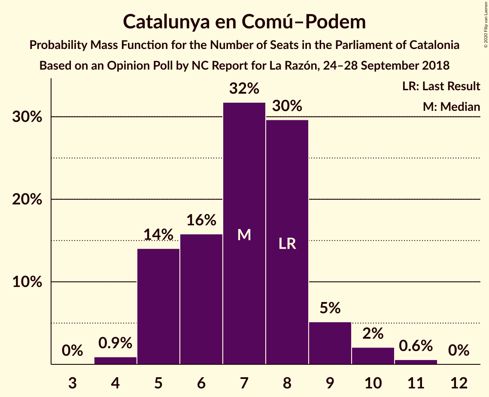
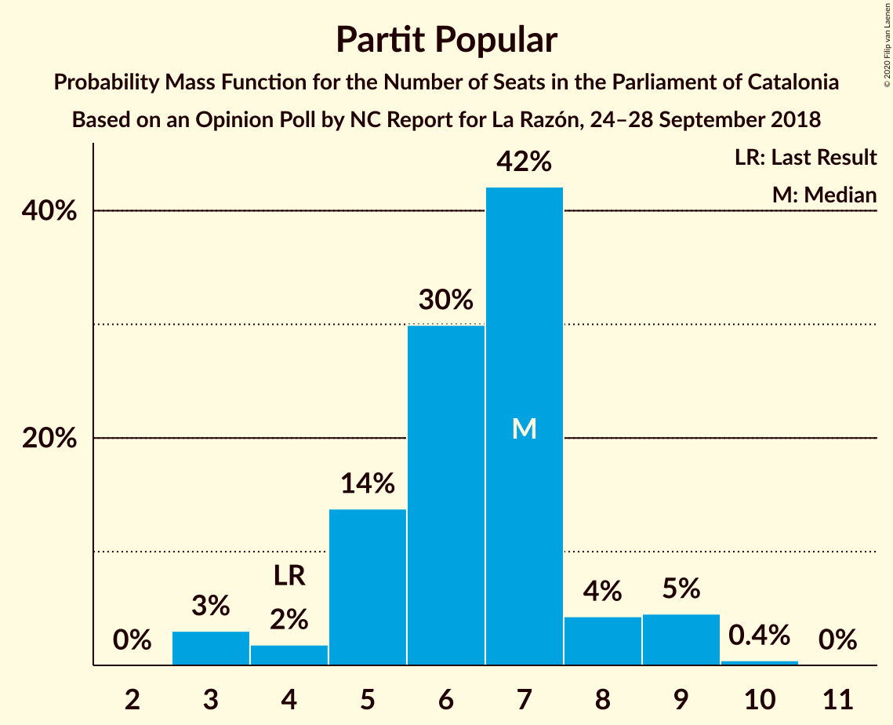

# Opinion Poll by NC Report for La Razón, 24–28 September 2018

<a href="#voting-intentions">Voting Intentions</a> | <a href="#seats">Seats</a> | <a href="#coalitions">Coalitions</a> | <a href="#technical-information">Technical Information</a>

## Voting Intentions

### Confidence Intervals

| Party | Last Result | Poll Result | 80% Confidence Interval | 90% Confidence Interval | 95% Confidence Interval | 99% Confidence Interval |
|:-----:|:-----------:|:-----------:|:-----------------------:|:-----------------------:|:-----------------------:|:-----------------------:|
| Esquerra Republicana–Catalunya Sí | 21.4% | 23.9% | 22.2–25.7% |21.8–26.2% |21.4–26.6% |20.6–27.5% |
| Ciutadans–Partido de la Ciudadanía | 25.4% | 23.7% | 22.0–25.5% |21.6–26.0% |21.2–26.4% |20.4–27.3% |
| Junts pel Catalunya | 21.7% | 16.2% | 14.8–17.8% |14.4–18.2% |14.0–18.6% |13.4–19.4% |
| Partit dels Socialistes de Catalunya (PSC-PSOE) | 13.9% | 15.8% | 14.4–17.4% |14.0–17.8% |13.7–18.2% |13.0–19.0% |
| Catalunya en Comú–Podem | 7.5% | 6.5% | 5.6–7.6% |5.3–7.9% |5.1–8.2% |4.7–8.8% |
| Partit Popular | 4.2% | 5.3% | 4.5–6.3% |4.3–6.6% |4.1–6.9% |3.7–7.4% |
| Candidatura d’Unitat Popular | 4.5% | 3.9% | 3.2–4.8% |3.0–5.1% |2.9–5.3% |2.6–5.8% |

*Note:* The poll result column reflects the actual value used in the calculations. Published results may vary slightly, and in addition be rounded to fewer digits.

## Seats

### Confidence Intervals

| Party | Last Result | Median | 80% Confidence Interval | 90% Confidence Interval | 95% Confidence Interval | 99% Confidence Interval |
|:-----:|:-----------:|:------:|:-----------------------:|:-----------------------:|:-----------------------:|:-----------------------:|
| <a href="#esquerra-republicana–catalunya-sí">Esquerra Republicana–Catalunya Sí</a> | 32 | 37 | 34–39 |33–40 |32–41 |31–42 |
| <a href="#ciutadans–partido-de-la-ciudadanía">Ciutadans–Partido de la Ciudadanía</a> | 36 | 34 | 31–37 |30–37 |30–38 |28–39 |
| <a href="#junts-pel-catalunya">Junts pel Catalunya</a> | 34 | 26 | 23–29 |23–29 |23–30 |21–31 |
| <a href="#partit-dels-socialistes-de-catalunya-(psc-psoe)">Partit dels Socialistes de Catalunya (PSC-PSOE)</a> | 17 | 22 | 19–24 |18–24 |17–25 |17–25 |
| <a href="#catalunya-en-comú–podem">Catalunya en Comú–Podem</a> | 8 | 7 | 5–8 |5–9 |5–10 |4–11 |
| <a href="#partit-popular">Partit Popular</a> | 4 | 7 | 5–7 |5–9 |3–9 |3–9 |
| <a href="#candidatura-d’unitat-popular">Candidatura d’Unitat Popular</a> | 4 | 4 | 2–6 |2–7 |0–7 |0–8 |

### Esquerra Republicana–Catalunya Sí

*For a full overview of the results for this party, see the [Esquerra Republicana–Catalunya Sí](party-esquerrarepublicana–catalunyasí.html) page.*

| Number of Seats | Probability | Accumulated | Special Marks |
|:---------------:|:-----------:|:-----------:|:-------------:|
| 29 | 0.1% | 100% |  |
| 30 | 0.2% | 99.9% |  |
| 31 | 0.4% | 99.7% |  |
| 32 | 2% | 99.3% | Last Result |
| 33 | 5% | 97% |  |
| 34 | 9% | 93% |  |
| 35 | 23% | 84% |  |
| 36 | 11% | 61% |  |
| 37 | 16% | 50% | Median |
| 38 | 9% | 34% |  |
| 39 | 16% | 26% |  |
| 40 | 5% | 9% |  |
| 41 | 3% | 5% |  |
| 42 | 1.1% | 2% |  |
| 43 | 0.3% | 0.4% |  |
| 44 | 0.1% | 0.1% |  |
| 45 | 0% | 0.1% |  |
| 46 | 0% | 0% |  |

### Ciutadans–Partido de la Ciudadanía

*For a full overview of the results for this party, see the [Ciutadans–Partido de la Ciudadanía](party-ciutadans–partidodelaciudadanía.html) page.*

| Number of Seats | Probability | Accumulated | Special Marks |
|:---------------:|:-----------:|:-----------:|:-------------:|
| 27 | 0.1% | 100% |  |
| 28 | 0.8% | 99.9% |  |
| 29 | 1.2% | 99.1% |  |
| 30 | 6% | 98% |  |
| 31 | 12% | 92% |  |
| 32 | 7% | 80% |  |
| 33 | 12% | 72% |  |
| 34 | 18% | 61% | Median |
| 35 | 19% | 43% |  |
| 36 | 9% | 24% | Last Result |
| 37 | 11% | 15% |  |
| 38 | 3% | 4% |  |
| 39 | 0.5% | 0.7% |  |
| 40 | 0.2% | 0.2% |  |
| 41 | 0% | 0.1% |  |
| 42 | 0% | 0% |  |

### Junts pel Catalunya

*For a full overview of the results for this party, see the [Junts pel Catalunya](party-juntspelcatalunya.html) page.*

| Number of Seats | Probability | Accumulated | Special Marks |
|:---------------:|:-----------:|:-----------:|:-------------:|
| 19 | 0.1% | 100% |  |
| 20 | 0.3% | 99.9% |  |
| 21 | 0.5% | 99.6% |  |
| 22 | 0.7% | 99.1% |  |
| 23 | 11% | 98% |  |
| 24 | 18% | 88% |  |
| 25 | 17% | 70% |  |
| 26 | 24% | 53% | Median |
| 27 | 11% | 29% |  |
| 28 | 6% | 18% |  |
| 29 | 8% | 11% |  |
| 30 | 2% | 4% |  |
| 31 | 2% | 2% |  |
| 32 | 0.2% | 0.2% |  |
| 33 | 0.1% | 0.1% |  |
| 34 | 0% | 0% | Last Result |

### Partit dels Socialistes de Catalunya (PSC-PSOE)

*For a full overview of the results for this party, see the [Partit dels Socialistes de Catalunya (PSC-PSOE)](party-partitdelssocialistesdecatalunyapsc-psoe.html) page.*

| Number of Seats | Probability | Accumulated | Special Marks |
|:---------------:|:-----------:|:-----------:|:-------------:|
| 16 | 0.4% | 100% |  |
| 17 | 3% | 99.6% | Last Result |
| 18 | 6% | 96% |  |
| 19 | 11% | 90% |  |
| 20 | 15% | 79% |  |
| 21 | 13% | 64% |  |
| 22 | 8% | 51% | Median |
| 23 | 26% | 43% |  |
| 24 | 14% | 18% |  |
| 25 | 3% | 4% |  |
| 26 | 0.4% | 0.5% |  |
| 27 | 0% | 0% |  |

### Catalunya en Comú–Podem

*For a full overview of the results for this party, see the [Catalunya en Comú–Podem](party-catalunyaencomú–podem.html) page.*

| Number of Seats | Probability | Accumulated | Special Marks |
|:---------------:|:-----------:|:-----------:|:-------------:|
| 4 | 0.9% | 100% |  |
| 5 | 14% | 99.1% |  |
| 6 | 16% | 85% |  |
| 7 | 32% | 69% | Median |
| 8 | 30% | 37% | Last Result |
| 9 | 5% | 8% |  |
| 10 | 2% | 3% |  |
| 11 | 0.6% | 0.6% |  |
| 12 | 0% | 0% |  |

### Partit Popular

*For a full overview of the results for this party, see the [Partit Popular](party-partitpopular.html) page.*

| Number of Seats | Probability | Accumulated | Special Marks |
|:---------------:|:-----------:|:-----------:|:-------------:|
| 3 | 3% | 100% |  |
| 4 | 2% | 97% | Last Result |
| 5 | 14% | 95% |  |
| 6 | 30% | 81% |  |
| 7 | 42% | 51% | Median |
| 8 | 4% | 9% |  |
| 9 | 5% | 5% |  |
| 10 | 0.4% | 0.5% |  |
| 11 | 0% | 0% |  |

### Candidatura d’Unitat Popular

*For a full overview of the results for this party, see the [Candidatura d’Unitat Popular](party-candidaturad’unitatpopular.html) page.*

| Number of Seats | Probability | Accumulated | Special Marks |
|:---------------:|:-----------:|:-----------:|:-------------:|
| 0 | 5% | 100% |  |
| 1 | 0% | 95% |  |
| 2 | 9% | 95% |  |
| 3 | 22% | 86% |  |
| 4 | 40% | 65% | Last Result, Median |
| 5 | 7% | 25% |  |
| 6 | 12% | 18% |  |
| 7 | 5% | 6% |  |
| 8 | 1.0% | 1.0% |  |
| 9 | 0% | 0% |  |

## Coalitions

### Confidence Intervals

| Coalition | Last Result | Median | Majority? | 80% Confidence Interval | 90% Confidence Interval | 95% Confidence Interval | 99% Confidence Interval |
|:---------:|:-----------:|:------:|:---------:|:-----------------------:|:-----------------------:|:-----------------------:|:-----------------------:|
| Esquerra Republicana–Catalunya Sí – Junts pel Catalunya – Catalunya en Comú–Podem | 74 | 69 | 74% | 66–73 | 65–74 | 64–75 | 63–76 |
| Ciutadans–Partido de la Ciudadanía – Partit dels Socialistes de Catalunya (PSC-PSOE) – Catalunya en Comú–Podem – Partit Popular | 65 | 69 | 67% | 65–72 | 64–73 | 63–74 | 62–75 |
| Esquerra Republicana–Catalunya Sí – Junts pel Catalunya – Candidatura d’Unitat Popular | 70 | 66 | 33% | 63–70 | 62–71 | 61–72 | 60–73 |
| Esquerra Republicana–Catalunya Sí – Partit dels Socialistes de Catalunya (PSC-PSOE) – Catalunya en Comú–Podem | 57 | 65 | 17% | 62–68 | 60–69 | 60–70 | 58–72 |
| Esquerra Republicana–Catalunya Sí – Junts pel Catalunya | 66 | 62 | 3% | 59–66 | 58–67 | 58–68 | 56–70 |
| Ciutadans–Partido de la Ciudadanía – Partit dels Socialistes de Catalunya (PSC-PSOE) – Partit Popular | 57 | 62 | 1.2% | 58–65 | 57–66 | 56–67 | 55–68 |
| Esquerra Republicana–Catalunya Sí – Catalunya en Comú–Podem | 40 | 43 | 0% | 41–47 | 40–48 | 39–49 | 37–50 |

### Esquerra Republicana–Catalunya Sí – Junts pel Catalunya – Catalunya en Comú–Podem

| Number of Seats | Probability | Accumulated | Special Marks |
|:---------------:|:-----------:|:-----------:|:-------------:|
| 61 | 0.1% | 100% |  |
| 62 | 0.3% | 99.9% |  |
| 63 | 0.7% | 99.6% |  |
| 64 | 2% | 99.0% |  |
| 65 | 4% | 97% |  |
| 66 | 8% | 92% |  |
| 67 | 11% | 84% |  |
| 68 | 13% | 74% | Majority |
| 69 | 13% | 61% |  |
| 70 | 14% | 47% | Median |
| 71 | 11% | 34% |  |
| 72 | 10% | 22% |  |
| 73 | 6% | 12% |  |
| 74 | 3% | 7% | Last Result |
| 75 | 2% | 3% |  |
| 76 | 1.0% | 2% |  |
| 77 | 0.3% | 0.5% |  |
| 78 | 0.1% | 0.1% |  |
| 79 | 0% | 0% |  |

### Ciutadans–Partido de la Ciudadanía – Partit dels Socialistes de Catalunya (PSC-PSOE) – Catalunya en Comú–Podem – Partit Popular

| Number of Seats | Probability | Accumulated | Special Marks |
|:---------------:|:-----------:|:-----------:|:-------------:|
| 60 | 0.1% | 100% |  |
| 61 | 0.3% | 99.9% |  |
| 62 | 0.9% | 99.6% |  |
| 63 | 2% | 98.7% |  |
| 64 | 3% | 97% |  |
| 65 | 6% | 94% | Last Result |
| 66 | 9% | 88% |  |
| 67 | 11% | 79% |  |
| 68 | 14% | 67% | Majority |
| 69 | 14% | 53% |  |
| 70 | 11% | 40% | Median |
| 71 | 11% | 29% |  |
| 72 | 9% | 18% |  |
| 73 | 6% | 9% |  |
| 74 | 2% | 3% |  |
| 75 | 0.7% | 1.1% |  |
| 76 | 0.2% | 0.3% |  |
| 77 | 0.1% | 0.1% |  |
| 78 | 0% | 0% |  |

### Esquerra Republicana–Catalunya Sí – Junts pel Catalunya – Candidatura d’Unitat Popular

| Number of Seats | Probability | Accumulated | Special Marks |
|:---------------:|:-----------:|:-----------:|:-------------:|
| 58 | 0.1% | 100% |  |
| 59 | 0.2% | 99.9% |  |
| 60 | 0.7% | 99.7% |  |
| 61 | 2% | 98.9% |  |
| 62 | 6% | 97% |  |
| 63 | 9% | 91% |  |
| 64 | 11% | 82% |  |
| 65 | 11% | 71% |  |
| 66 | 14% | 60% |  |
| 67 | 14% | 47% | Median |
| 68 | 11% | 33% | Majority |
| 69 | 9% | 21% |  |
| 70 | 6% | 12% | Last Result |
| 71 | 3% | 6% |  |
| 72 | 2% | 3% |  |
| 73 | 0.9% | 1.3% |  |
| 74 | 0.3% | 0.4% |  |
| 75 | 0.1% | 0.1% |  |
| 76 | 0% | 0% |  |

### Esquerra Republicana–Catalunya Sí – Partit dels Socialistes de Catalunya (PSC-PSOE) – Catalunya en Comú–Podem

| Number of Seats | Probability | Accumulated | Special Marks |
|:---------------:|:-----------:|:-----------:|:-------------:|
| 56 | 0.1% | 100% |  |
| 57 | 0.2% | 99.9% | Last Result |
| 58 | 0.5% | 99.8% |  |
| 59 | 1.2% | 99.3% |  |
| 60 | 3% | 98% |  |
| 61 | 5% | 95% |  |
| 62 | 7% | 90% |  |
| 63 | 9% | 83% |  |
| 64 | 13% | 75% |  |
| 65 | 15% | 61% |  |
| 66 | 17% | 46% | Median |
| 67 | 12% | 29% |  |
| 68 | 8% | 17% | Majority |
| 69 | 4% | 9% |  |
| 70 | 2% | 4% |  |
| 71 | 1.4% | 2% |  |
| 72 | 0.4% | 0.7% |  |
| 73 | 0.2% | 0.3% |  |
| 74 | 0% | 0.1% |  |
| 75 | 0% | 0% |  |

### Esquerra Republicana–Catalunya Sí – Junts pel Catalunya

| Number of Seats | Probability | Accumulated | Special Marks |
|:---------------:|:-----------:|:-----------:|:-------------:|
| 54 | 0% | 100% |  |
| 55 | 0.2% | 99.9% |  |
| 56 | 0.6% | 99.8% |  |
| 57 | 1.4% | 99.2% |  |
| 58 | 6% | 98% |  |
| 59 | 9% | 92% |  |
| 60 | 11% | 84% |  |
| 61 | 12% | 73% |  |
| 62 | 13% | 61% |  |
| 63 | 14% | 48% | Median |
| 64 | 13% | 34% |  |
| 65 | 10% | 21% |  |
| 66 | 5% | 11% | Last Result |
| 67 | 3% | 6% |  |
| 68 | 2% | 3% | Majority |
| 69 | 0.8% | 1.3% |  |
| 70 | 0.4% | 0.6% |  |
| 71 | 0.1% | 0.1% |  |
| 72 | 0% | 0% |  |

### Ciutadans–Partido de la Ciudadanía – Partit dels Socialistes de Catalunya (PSC-PSOE) – Partit Popular

| Number of Seats | Probability | Accumulated | Special Marks |
|:---------------:|:-----------:|:-----------:|:-------------:|
| 53 | 0.1% | 100% |  |
| 54 | 0.3% | 99.9% |  |
| 55 | 0.8% | 99.6% |  |
| 56 | 2% | 98.8% |  |
| 57 | 3% | 97% | Last Result |
| 58 | 5% | 94% |  |
| 59 | 11% | 88% |  |
| 60 | 10% | 77% |  |
| 61 | 12% | 67% |  |
| 62 | 13% | 55% |  |
| 63 | 13% | 42% | Median |
| 64 | 14% | 29% |  |
| 65 | 6% | 15% |  |
| 66 | 5% | 8% |  |
| 67 | 3% | 4% |  |
| 68 | 0.7% | 1.2% | Majority |
| 69 | 0.3% | 0.4% |  |
| 70 | 0.1% | 0.1% |  |
| 71 | 0% | 0% |  |

### Esquerra Republicana–Catalunya Sí – Catalunya en Comú–Podem

| Number of Seats | Probability | Accumulated | Special Marks |
|:---------------:|:-----------:|:-----------:|:-------------:|
| 36 | 0.1% | 100% |  |
| 37 | 0.4% | 99.9% |  |
| 38 | 1.1% | 99.5% |  |
| 39 | 2% | 98% |  |
| 40 | 6% | 96% | Last Result |
| 41 | 9% | 91% |  |
| 42 | 16% | 82% |  |
| 43 | 16% | 66% |  |
| 44 | 16% | 50% | Median |
| 45 | 9% | 34% |  |
| 46 | 12% | 24% |  |
| 47 | 6% | 12% |  |
| 48 | 4% | 6% |  |
| 49 | 2% | 3% |  |
| 50 | 0.5% | 0.8% |  |
| 51 | 0.1% | 0.2% |  |
| 52 | 0% | 0.1% |  |
| 53 | 0% | 0% |  |

## Technical Information

### Opinion Poll

+ **Polling firm:** NC Report
+ **Commissioner(s):** La Razón
+ **Fieldwork period:** 24–28 September 2018

### Calculations

+ **Sample size:** 1000
+ **Simulations done:** 1,048,576
+ **Error estimate:** 1.01%

