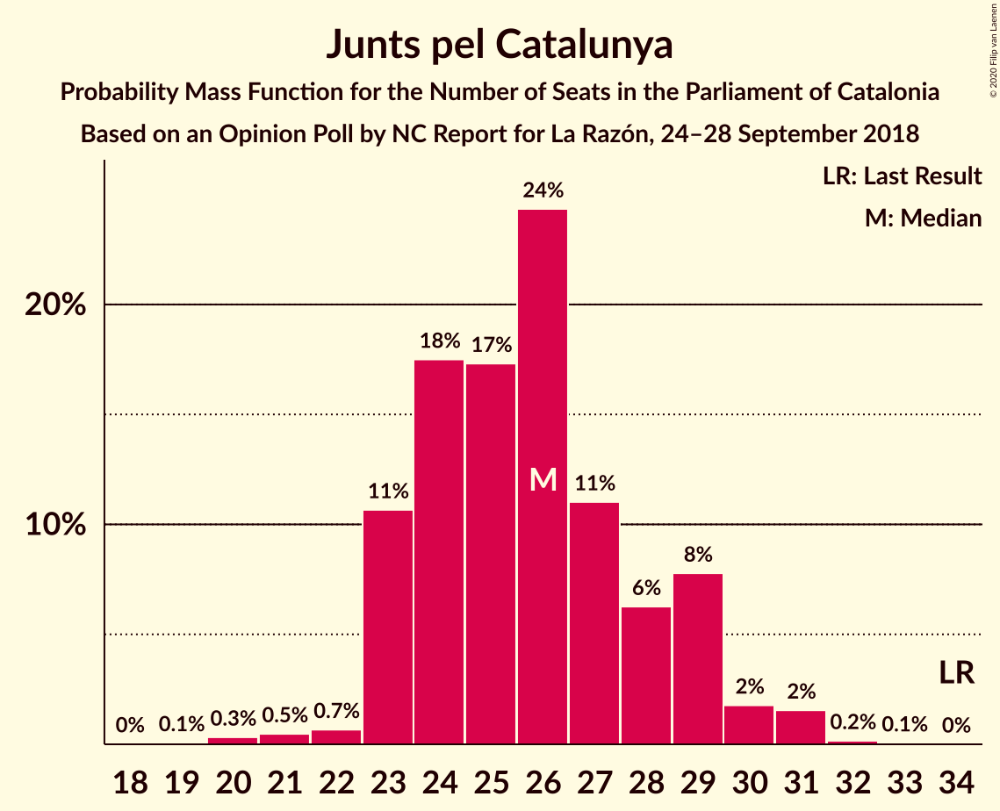
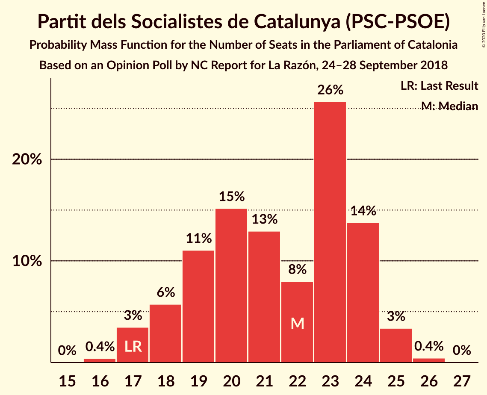
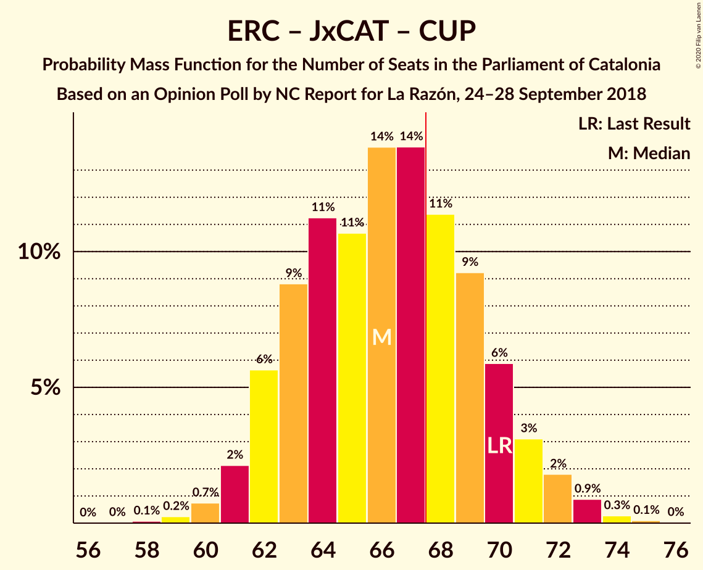
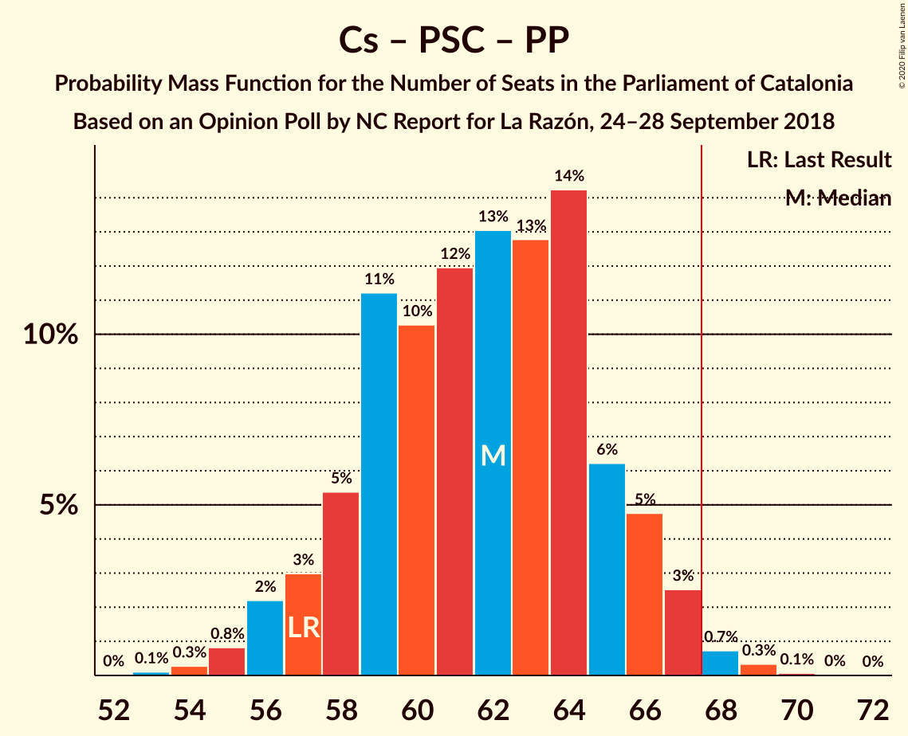

# Opinion Poll by NC Report for La Razón, 24–28 September 2018

<a href="#voting-intentions">Voting Intentions</a> | <a href="#seats">Seats</a> | <a href="#coalitions">Coalitions</a> | <a href="#technical-information">Technical Information</a>

## Voting Intentions

### Confidence Intervals

| Party | Last Result | Poll Result | 80% Confidence Interval | 90% Confidence Interval | 95% Confidence Interval | 99% Confidence Interval |
|:-----:|:-----------:|:-----------:|:-----------------------:|:-----------------------:|:-----------------------:|:-----------------------:|
| Esquerra Republicana–Catalunya Sí | 21.4% | 23.9% | 22.2–25.7% |21.8–26.2% |21.4–26.6% |20.6–27.5% |
| Ciutadans–Partido de la Ciudadanía | 25.4% | 23.7% | 22.0–25.5% |21.6–26.0% |21.2–26.4% |20.4–27.3% |
| Junts pel Catalunya | 21.7% | 16.2% | 14.8–17.8% |14.4–18.2% |14.0–18.6% |13.4–19.4% |
| Partit dels Socialistes de Catalunya (PSC-PSOE) | 13.9% | 15.8% | 14.4–17.4% |14.0–17.8% |13.7–18.2% |13.0–19.0% |
| Catalunya en Comú–Podem | 7.5% | 6.5% | 5.6–7.6% |5.3–7.9% |5.1–8.2% |4.7–8.8% |
| Partit Popular | 4.2% | 5.3% | 4.5–6.3% |4.3–6.6% |4.1–6.9% |3.7–7.4% |
| Candidatura d’Unitat Popular | 4.5% | 3.9% | 3.2–4.8% |3.0–5.1% |2.9–5.3% |2.6–5.8% |

*Note:* The poll result column reflects the actual value used in the calculations. Published results may vary slightly, and in addition be rounded to fewer digits.

## Seats

### Confidence Intervals

| Party | Last Result | Median | 80% Confidence Interval | 90% Confidence Interval | 95% Confidence Interval | 99% Confidence Interval |
|:-----:|:-----------:|:------:|:-----------------------:|:-----------------------:|:-----------------------:|:-----------------------:|
| <a href="#esquerra-republicana–catalunya-sí">Esquerra Republicana–Catalunya Sí</a> | 32 | 36 | 33–40 |33–40 |32–41 |31–43 |
| <a href="#ciutadans–partido-de-la-ciudadanía">Ciutadans–Partido de la Ciudadanía</a> | 36 | 34 | 31–37 |30–38 |29–38 |28–39 |
| <a href="#junts-pel-catalunya">Junts pel Catalunya</a> | 34 | 25 | 23–29 |23–29 |23–30 |20–31 |
| <a href="#partit-dels-socialistes-de-catalunya-(psc-psoe)">Partit dels Socialistes de Catalunya (PSC-PSOE)</a> | 17 | 22 | 18–24 |17–24 |17–25 |17–25 |
| <a href="#catalunya-en-comú–podem">Catalunya en Comú–Podem</a> | 8 | 7 | 5–9 |5–9 |5–10 |4–11 |
| <a href="#partit-popular">Partit Popular</a> | 4 | 6 | 5–8 |4–9 |3–9 |3–10 |
| <a href="#candidatura-d’unitat-popular">Candidatura d’Unitat Popular</a> | 4 | 4 | 2–6 |2–7 |0–7 |0–8 |

### Esquerra Republicana–Catalunya Sí

*For a full overview of the results for this party, see the [Esquerra Republicana–Catalunya Sí](party-esquerrarepublicana–catalunyasí.html) page.*

| Number of Seats | Probability | Accumulated | Special Marks |
|:---------------:|:-----------:|:-----------:|:-------------:|
| 29 | 0.3% | 100% |  |
| 30 | 0.1% | 99.7% |  |
| 31 | 0.5% | 99.6% |  |
| 32 | 3% | 99.1% | Last Result |
| 33 | 7% | 96% |  |
| 34 | 11% | 90% |  |
| 35 | 25% | 79% |  |
| 36 | 11% | 54% | Median |
| 37 | 10% | 42% |  |
| 38 | 10% | 33% |  |
| 39 | 10% | 22% |  |
| 40 | 9% | 12% |  |
| 41 | 2% | 3% |  |
| 42 | 1.3% | 2% |  |
| 43 | 0.4% | 0.5% |  |
| 44 | 0.1% | 0.2% |  |
| 45 | 0% | 0.1% |  |
| 46 | 0% | 0% |  |

### Ciutadans–Partido de la Ciudadanía

*For a full overview of the results for this party, see the [Ciutadans–Partido de la Ciudadanía](party-ciutadans–partidodelaciudadanía.html) page.*

| Number of Seats | Probability | Accumulated | Special Marks |
|:---------------:|:-----------:|:-----------:|:-------------:|
| 27 | 0.1% | 100% |  |
| 28 | 1.0% | 99.9% |  |
| 29 | 2% | 98.9% |  |
| 30 | 5% | 97% |  |
| 31 | 7% | 93% |  |
| 32 | 11% | 86% |  |
| 33 | 8% | 75% |  |
| 34 | 22% | 67% | Median |
| 35 | 17% | 45% |  |
| 36 | 11% | 28% | Last Result |
| 37 | 10% | 16% |  |
| 38 | 5% | 6% |  |
| 39 | 1.2% | 2% |  |
| 40 | 0.3% | 0.4% |  |
| 41 | 0% | 0% |  |

### Junts pel Catalunya

*For a full overview of the results for this party, see the [Junts pel Catalunya](party-juntspelcatalunya.html) page.*

| Number of Seats | Probability | Accumulated | Special Marks |
|:---------------:|:-----------:|:-----------:|:-------------:|
| 19 | 0.1% | 100% |  |
| 20 | 0.5% | 99.9% |  |
| 21 | 0.2% | 99.4% |  |
| 22 | 1.0% | 99.1% |  |
| 23 | 12% | 98% |  |
| 24 | 18% | 87% |  |
| 25 | 22% | 68% | Median |
| 26 | 17% | 47% |  |
| 27 | 13% | 30% |  |
| 28 | 6% | 16% |  |
| 29 | 8% | 11% |  |
| 30 | 1.3% | 3% |  |
| 31 | 1.1% | 1.4% |  |
| 32 | 0.2% | 0.3% |  |
| 33 | 0% | 0.1% |  |
| 34 | 0% | 0% | Last Result |

### Partit dels Socialistes de Catalunya (PSC-PSOE)

*For a full overview of the results for this party, see the [Partit dels Socialistes de Catalunya (PSC-PSOE)](party-partitdelssocialistesdecatalunyapsc-psoe.html) page.*

| Number of Seats | Probability | Accumulated | Special Marks |
|:---------------:|:-----------:|:-----------:|:-------------:|
| 16 | 0.3% | 100% |  |
| 17 | 5% | 99.7% | Last Result |
| 18 | 7% | 95% |  |
| 19 | 19% | 88% |  |
| 20 | 7% | 69% |  |
| 21 | 12% | 62% |  |
| 22 | 3% | 50% | Median |
| 23 | 19% | 47% |  |
| 24 | 24% | 28% |  |
| 25 | 4% | 4% |  |
| 26 | 0.2% | 0.3% |  |
| 27 | 0% | 0% |  |

### Catalunya en Comú–Podem

*For a full overview of the results for this party, see the [Catalunya en Comú–Podem](party-catalunyaencomú–podem.html) page.*

| Number of Seats | Probability | Accumulated | Special Marks |
|:---------------:|:-----------:|:-----------:|:-------------:|
| 4 | 1.0% | 100% |  |
| 5 | 12% | 99.0% |  |
| 6 | 10% | 87% |  |
| 7 | 29% | 77% | Median |
| 8 | 36% | 48% | Last Result |
| 9 | 8% | 12% |  |
| 10 | 3% | 4% |  |
| 11 | 0.7% | 0.7% |  |
| 12 | 0% | 0% |  |

### Partit Popular

*For a full overview of the results for this party, see the [Partit Popular](party-partitpopular.html) page.*

| Number of Seats | Probability | Accumulated | Special Marks |
|:---------------:|:-----------:|:-----------:|:-------------:|
| 3 | 4% | 100% |  |
| 4 | 2% | 96% | Last Result |
| 5 | 17% | 94% |  |
| 6 | 27% | 77% | Median |
| 7 | 39% | 50% |  |
| 8 | 4% | 10% |  |
| 9 | 6% | 6% |  |
| 10 | 0.5% | 0.6% |  |
| 11 | 0% | 0% |  |

### Candidatura d’Unitat Popular

*For a full overview of the results for this party, see the [Candidatura d’Unitat Popular](party-candidaturad’unitatpopular.html) page.*

| Number of Seats | Probability | Accumulated | Special Marks |
|:---------------:|:-----------:|:-----------:|:-------------:|
| 0 | 4% | 100% |  |
| 1 | 0% | 96% |  |
| 2 | 7% | 96% |  |
| 3 | 26% | 89% |  |
| 4 | 38% | 63% | Last Result, Median |
| 5 | 9% | 25% |  |
| 6 | 9% | 16% |  |
| 7 | 6% | 6% |  |
| 8 | 0.8% | 0.8% |  |
| 9 | 0% | 0% |  |

## Coalitions

### Confidence Intervals

| Coalition | Last Result | Median | Majority? | 80% Confidence Interval | 90% Confidence Interval | 95% Confidence Interval | 99% Confidence Interval |
|:---------:|:-----------:|:------:|:---------:|:-----------------------:|:-----------------------:|:-----------------------:|:-----------------------:|
| Esquerra Republicana–Catalunya Sí – Junts pel Catalunya – Catalunya en Comú–Podem | 74 | 69 | 70% | 66–73 | 65–74 | 64–75 | 63–76 |
| Ciutadans–Partido de la Ciudadanía – Partit dels Socialistes de Catalunya (PSC-PSOE) – Catalunya en Comú–Podem – Partit Popular | 65 | 69 | 68% | 65–73 | 64–74 | 63–74 | 62–75 |
| Esquerra Republicana–Catalunya Sí – Junts pel Catalunya – Candidatura d’Unitat Popular | 70 | 66 | 32% | 62–70 | 61–71 | 61–72 | 60–73 |
| Esquerra Republicana–Catalunya Sí – Partit dels Socialistes de Catalunya (PSC-PSOE) – Catalunya en Comú–Podem | 57 | 65 | 13% | 62–68 | 61–69 | 60–71 | 59–72 |
| Esquerra Republicana–Catalunya Sí – Junts pel Catalunya | 66 | 62 | 4% | 58–66 | 58–67 | 57–68 | 56–70 |
| Ciutadans–Partido de la Ciudadanía – Partit dels Socialistes de Catalunya (PSC-PSOE) – Partit Popular | 57 | 62 | 1.2% | 58–66 | 57–67 | 56–67 | 54–68 |
| Esquerra Republicana–Catalunya Sí – Catalunya en Comú–Podem | 40 | 43 | 0% | 40–47 | 40–48 | 39–48 | 38–50 |

### Esquerra Republicana–Catalunya Sí – Junts pel Catalunya – Catalunya en Comú–Podem

| Number of Seats | Probability | Accumulated | Special Marks |
|:---------------:|:-----------:|:-----------:|:-------------:|
| 61 | 0.1% | 100% |  |
| 62 | 0.1% | 99.9% |  |
| 63 | 0.7% | 99.7% |  |
| 64 | 4% | 99.0% |  |
| 65 | 5% | 95% |  |
| 66 | 11% | 91% |  |
| 67 | 9% | 80% |  |
| 68 | 13% | 70% | Median, Majority |
| 69 | 17% | 58% |  |
| 70 | 7% | 41% |  |
| 71 | 13% | 34% |  |
| 72 | 5% | 22% |  |
| 73 | 10% | 17% |  |
| 74 | 3% | 6% | Last Result |
| 75 | 1.1% | 3% |  |
| 76 | 2% | 2% |  |
| 77 | 0.3% | 0.4% |  |
| 78 | 0.1% | 0.2% |  |
| 79 | 0.1% | 0.1% |  |
| 80 | 0% | 0% |  |

### Ciutadans–Partido de la Ciudadanía – Partit dels Socialistes de Catalunya (PSC-PSOE) – Catalunya en Comú–Podem – Partit Popular

| Number of Seats | Probability | Accumulated | Special Marks |
|:---------------:|:-----------:|:-----------:|:-------------:|
| 60 | 0.2% | 100% |  |
| 61 | 0.3% | 99.8% |  |
| 62 | 2% | 99.5% |  |
| 63 | 1.2% | 98% |  |
| 64 | 2% | 96% |  |
| 65 | 7% | 95% | Last Result |
| 66 | 5% | 88% |  |
| 67 | 16% | 84% |  |
| 68 | 7% | 68% | Majority |
| 69 | 10% | 60% | Median |
| 70 | 11% | 50% |  |
| 71 | 18% | 39% |  |
| 72 | 6% | 21% |  |
| 73 | 8% | 14% |  |
| 74 | 5% | 6% |  |
| 75 | 0.8% | 1.1% |  |
| 76 | 0.2% | 0.3% |  |
| 77 | 0.1% | 0.1% |  |
| 78 | 0% | 0% |  |

### Esquerra Republicana–Catalunya Sí – Junts pel Catalunya – Candidatura d’Unitat Popular

| Number of Seats | Probability | Accumulated | Special Marks |
|:---------------:|:-----------:|:-----------:|:-------------:|
| 58 | 0.1% | 100% |  |
| 59 | 0.2% | 99.9% |  |
| 60 | 0.8% | 99.7% |  |
| 61 | 5% | 98.9% |  |
| 62 | 8% | 94% |  |
| 63 | 6% | 86% |  |
| 64 | 18% | 79% |  |
| 65 | 11% | 61% | Median |
| 66 | 10% | 50% |  |
| 67 | 7% | 40% |  |
| 68 | 16% | 32% | Majority |
| 69 | 5% | 16% |  |
| 70 | 7% | 12% | Last Result |
| 71 | 2% | 5% |  |
| 72 | 1.2% | 4% |  |
| 73 | 2% | 2% |  |
| 74 | 0.3% | 0.5% |  |
| 75 | 0.2% | 0.2% |  |
| 76 | 0% | 0% |  |

### Esquerra Republicana–Catalunya Sí – Partit dels Socialistes de Catalunya (PSC-PSOE) – Catalunya en Comú–Podem

| Number of Seats | Probability | Accumulated | Special Marks |
|:---------------:|:-----------:|:-----------:|:-------------:|
| 57 | 0.1% | 100% | Last Result |
| 58 | 0.3% | 99.9% |  |
| 59 | 0.9% | 99.5% |  |
| 60 | 4% | 98.6% |  |
| 61 | 4% | 95% |  |
| 62 | 6% | 91% |  |
| 63 | 10% | 85% |  |
| 64 | 16% | 75% |  |
| 65 | 15% | 59% | Median |
| 66 | 20% | 45% |  |
| 67 | 12% | 25% |  |
| 68 | 5% | 13% | Majority |
| 69 | 3% | 8% |  |
| 70 | 2% | 5% |  |
| 71 | 2% | 3% |  |
| 72 | 0.5% | 0.7% |  |
| 73 | 0.2% | 0.2% |  |
| 74 | 0% | 0% |  |

### Esquerra Republicana–Catalunya Sí – Junts pel Catalunya

| Number of Seats | Probability | Accumulated | Special Marks |
|:---------------:|:-----------:|:-----------:|:-------------:|
| 54 | 0.1% | 100% |  |
| 55 | 0.2% | 99.9% |  |
| 56 | 0.5% | 99.7% |  |
| 57 | 2% | 99.2% |  |
| 58 | 8% | 97% |  |
| 59 | 14% | 89% |  |
| 60 | 13% | 75% |  |
| 61 | 9% | 62% | Median |
| 62 | 14% | 53% |  |
| 63 | 7% | 39% |  |
| 64 | 12% | 32% |  |
| 65 | 8% | 20% |  |
| 66 | 7% | 12% | Last Result |
| 67 | 1.5% | 5% |  |
| 68 | 1.1% | 4% | Majority |
| 69 | 2% | 2% |  |
| 70 | 0.7% | 0.9% |  |
| 71 | 0.2% | 0.2% |  |
| 72 | 0% | 0% |  |

### Ciutadans–Partido de la Ciudadanía – Partit dels Socialistes de Catalunya (PSC-PSOE) – Partit Popular

| Number of Seats | Probability | Accumulated | Special Marks |
|:---------------:|:-----------:|:-----------:|:-------------:|
| 53 | 0.1% | 100% |  |
| 54 | 0.4% | 99.9% |  |
| 55 | 1.1% | 99.5% |  |
| 56 | 2% | 98% |  |
| 57 | 2% | 97% | Last Result |
| 58 | 7% | 94% |  |
| 59 | 11% | 87% |  |
| 60 | 6% | 76% |  |
| 61 | 11% | 70% |  |
| 62 | 13% | 59% | Median |
| 63 | 17% | 46% |  |
| 64 | 11% | 29% |  |
| 65 | 7% | 18% |  |
| 66 | 5% | 10% |  |
| 67 | 4% | 5% |  |
| 68 | 0.7% | 1.2% | Majority |
| 69 | 0.4% | 0.5% |  |
| 70 | 0.1% | 0.1% |  |
| 71 | 0% | 0% |  |

### Esquerra Republicana–Catalunya Sí – Catalunya en Comú–Podem

| Number of Seats | Probability | Accumulated | Special Marks |
|:---------------:|:-----------:|:-----------:|:-------------:|
| 35 | 0.1% | 100% |  |
| 36 | 0.2% | 99.9% |  |
| 37 | 0.2% | 99.7% |  |
| 38 | 1.3% | 99.6% |  |
| 39 | 1.3% | 98% |  |
| 40 | 8% | 97% | Last Result |
| 41 | 10% | 89% |  |
| 42 | 17% | 79% |  |
| 43 | 17% | 62% | Median |
| 44 | 10% | 45% |  |
| 45 | 8% | 35% |  |
| 46 | 11% | 27% |  |
| 47 | 7% | 16% |  |
| 48 | 6% | 8% |  |
| 49 | 1.4% | 2% |  |
| 50 | 0.8% | 1.0% |  |
| 51 | 0.2% | 0.2% |  |
| 52 | 0% | 0.1% |  |
| 53 | 0% | 0% |  |

## Technical Information

### Opinion Poll

+ **Polling firm:** NC Report
+ **Commissioner(s):** La Razón
+ **Fieldwork period:** 24–28 September 2018

### Calculations

+ **Sample size:** 1000
+ **Simulations done:** 131,072
+ **Error estimate:** 1.63%

