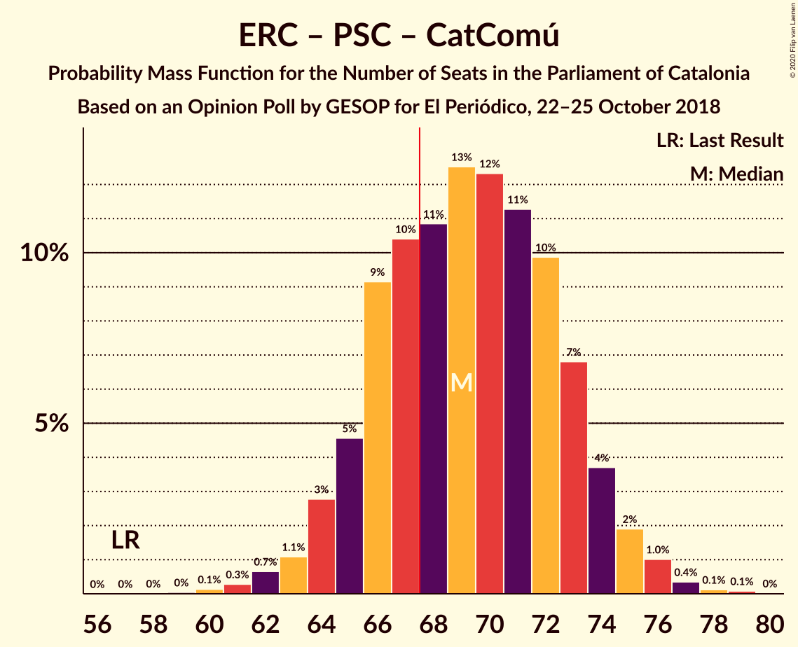
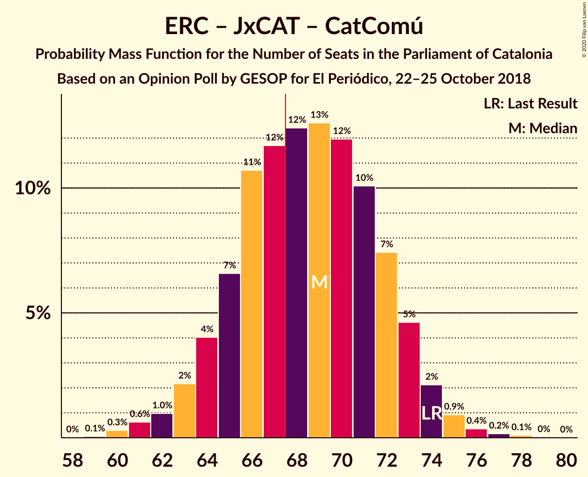

# Opinion Poll by GESOP for El Periódico, 22–25 October 2018

<a href="#voting-intentions">Voting Intentions</a> | <a href="#seats">Seats</a> | <a href="#coalitions">Coalitions</a> | <a href="#technical-information">Technical Information</a>

## Voting Intentions

### Confidence Intervals

| Party | Last Result | Poll Result | 80% Confidence Interval | 90% Confidence Interval | 95% Confidence Interval | 99% Confidence Interval |
|:-----:|:-----------:|:-----------:|:-----------------------:|:-----------------------:|:-----------------------:|:-----------------------:|
| Esquerra Republicana–Catalunya Sí | 21.4% | 25.3% | 23.3–27.4% |22.8–28.0% |22.3–28.6% |21.4–29.6% |
| Ciutadans–Partido de la Ciudadanía | 25.4% | 22.5% | 20.6–24.5% |20.0–25.1% |19.6–25.6% |18.7–26.6% |
| Partit dels Socialistes de Catalunya (PSC-PSOE) | 13.9% | 17.3% | 15.6–19.2% |15.2–19.8% |14.8–20.2% |14.0–21.2% |
| Junts pel Catalunya | 21.7% | 14.5% | 12.9–16.3% |12.5–16.8% |12.1–17.2% |11.4–18.1% |
| Catalunya en Comú–Podem | 7.5% | 7.4% | 6.3–8.8% |6.0–9.2% |5.8–9.6% |5.3–10.3% |
| Candidatura d’Unitat Popular | 4.5% | 7.4% | 6.3–8.8% |6.0–9.2% |5.8–9.6% |5.3–10.3% |
| Partit Popular | 4.2% | 3.5% | 2.8–4.6% |2.6–4.8% |2.4–5.1% |2.1–5.7% |

*Note:* The poll result column reflects the actual value used in the calculations. Published results may vary slightly, and in addition be rounded to fewer digits.

## Seats

### Confidence Intervals

| Party | Last Result | Median | 80% Confidence Interval | 90% Confidence Interval | 95% Confidence Interval | 99% Confidence Interval |
|:-----:|:-----------:|:------:|:-----------------------:|:-----------------------:|:-----------------------:|:-----------------------:|
| <a href="#esquerra-republicana–catalunya-sí">Esquerra Republicana–Catalunya Sí</a> | 32 | 38 | 35–41 |34–42 |33–43 |32–45 |
| <a href="#ciutadans–partido-de-la-ciudadanía">Ciutadans–Partido de la Ciudadanía</a> | 36 | 31 | 28–34 |27–35 |27–36 |26–37 |
| <a href="#partit-dels-socialistes-de-catalunya-(psc-psoe)">Partit dels Socialistes de Catalunya (PSC-PSOE)</a> | 17 | 23 | 20–25 |19–26 |19–26 |17–28 |
| <a href="#junts-pel-catalunya">Junts pel Catalunya</a> | 34 | 23 | 19–25 |18–26 |18–27 |17–28 |
| <a href="#catalunya-en-comú–podem">Catalunya en Comú–Podem</a> | 8 | 8 | 6–10 |6–11 |5–11 |5–13 |
| <a href="#candidatura-d’unitat-popular">Candidatura d’Unitat Popular</a> | 4 | 9 | 8–11 |8–13 |8–13 |7–14 |
| <a href="#partit-popular">Partit Popular</a> | 4 | 3 | 0–5 |0–6 |0–6 |0–7 |

### Esquerra Republicana–Catalunya Sí

*For a full overview of the results for this party, see the [Esquerra Republicana–Catalunya Sí](party-esquerrarepublicana–catalunyasí.html) page.*

| Number of Seats | Probability | Accumulated | Special Marks |
|:---------------:|:-----------:|:-----------:|:-------------:|
| 30 | 0.1% | 100% |  |
| 31 | 0.2% | 99.9% |  |
| 32 | 1.1% | 99.7% | Last Result |
| 33 | 3% | 98.6% |  |
| 34 | 6% | 96% |  |
| 35 | 13% | 90% |  |
| 36 | 8% | 77% |  |
| 37 | 12% | 69% |  |
| 38 | 13% | 58% | Median |
| 39 | 19% | 45% |  |
| 40 | 10% | 26% |  |
| 41 | 9% | 16% |  |
| 42 | 4% | 7% |  |
| 43 | 1.4% | 3% |  |
| 44 | 0.8% | 2% |  |
| 45 | 0.7% | 0.9% |  |
| 46 | 0.2% | 0.3% |  |
| 47 | 0.1% | 0.1% |  |
| 48 | 0% | 0% |  |

### Ciutadans–Partido de la Ciudadanía

*For a full overview of the results for this party, see the [Ciutadans–Partido de la Ciudadanía](party-ciutadans–partidodelaciudadanía.html) page.*

| Number of Seats | Probability | Accumulated | Special Marks |
|:---------------:|:-----------:|:-----------:|:-------------:|
| 24 | 0.1% | 100% |  |
| 25 | 0.2% | 99.9% |  |
| 26 | 1.5% | 99.7% |  |
| 27 | 6% | 98% |  |
| 28 | 12% | 93% |  |
| 29 | 10% | 81% |  |
| 30 | 18% | 71% |  |
| 31 | 13% | 53% | Median |
| 32 | 13% | 40% |  |
| 33 | 8% | 26% |  |
| 34 | 10% | 18% |  |
| 35 | 5% | 9% |  |
| 36 | 2% | 4% | Last Result |
| 37 | 1.2% | 2% |  |
| 38 | 0.3% | 0.4% |  |
| 39 | 0% | 0.1% |  |
| 40 | 0% | 0% |  |

### Partit dels Socialistes de Catalunya (PSC-PSOE)

*For a full overview of the results for this party, see the [Partit dels Socialistes de Catalunya (PSC-PSOE)](party-partitdelssocialistesdecatalunyapsc-psoe.html) page.*

| Number of Seats | Probability | Accumulated | Special Marks |
|:---------------:|:-----------:|:-----------:|:-------------:|
| 16 | 0.1% | 100% |  |
| 17 | 1.0% | 99.9% | Last Result |
| 18 | 1.3% | 98.9% |  |
| 19 | 4% | 98% |  |
| 20 | 5% | 94% |  |
| 21 | 6% | 89% |  |
| 22 | 8% | 82% |  |
| 23 | 26% | 75% | Median |
| 24 | 26% | 49% |  |
| 25 | 16% | 23% |  |
| 26 | 5% | 7% |  |
| 27 | 0.9% | 2% |  |
| 28 | 0.4% | 0.7% |  |
| 29 | 0.1% | 0.3% |  |
| 30 | 0.1% | 0.2% |  |
| 31 | 0% | 0% |  |

### Junts pel Catalunya

*For a full overview of the results for this party, see the [Junts pel Catalunya](party-juntspelcatalunya.html) page.*

| Number of Seats | Probability | Accumulated | Special Marks |
|:---------------:|:-----------:|:-----------:|:-------------:|
| 17 | 0.6% | 100% |  |
| 18 | 8% | 99.3% |  |
| 19 | 5% | 91% |  |
| 20 | 8% | 86% |  |
| 21 | 7% | 79% |  |
| 22 | 9% | 72% |  |
| 23 | 34% | 63% | Median |
| 24 | 17% | 29% |  |
| 25 | 6% | 12% |  |
| 26 | 3% | 6% |  |
| 27 | 2% | 3% |  |
| 28 | 0.7% | 1.0% |  |
| 29 | 0.3% | 0.4% |  |
| 30 | 0.1% | 0.1% |  |
| 31 | 0% | 0% |  |
| 32 | 0% | 0% |  |
| 33 | 0% | 0% |  |
| 34 | 0% | 0% | Last Result |

### Catalunya en Comú–Podem

*For a full overview of the results for this party, see the [Catalunya en Comú–Podem](party-catalunyaencomú–podem.html) page.*

| Number of Seats | Probability | Accumulated | Special Marks |
|:---------------:|:-----------:|:-----------:|:-------------:|
| 4 | 0.1% | 100% |  |
| 5 | 4% | 99.9% |  |
| 6 | 7% | 96% |  |
| 7 | 16% | 88% |  |
| 8 | 38% | 72% | Last Result, Median |
| 9 | 14% | 34% |  |
| 10 | 12% | 20% |  |
| 11 | 6% | 8% |  |
| 12 | 1.4% | 2% |  |
| 13 | 0.8% | 0.9% |  |
| 14 | 0.1% | 0.1% |  |
| 15 | 0% | 0% |  |

### Candidatura d’Unitat Popular

*For a full overview of the results for this party, see the [Candidatura d’Unitat Popular](party-candidaturad’unitatpopular.html) page.*

| Number of Seats | Probability | Accumulated | Special Marks |
|:---------------:|:-----------:|:-----------:|:-------------:|
| 4 | 0% | 100% | Last Result |
| 5 | 0% | 100% |  |
| 6 | 0.3% | 100% |  |
| 7 | 2% | 99.6% |  |
| 8 | 22% | 98% |  |
| 9 | 31% | 76% | Median |
| 10 | 15% | 45% |  |
| 11 | 22% | 30% |  |
| 12 | 3% | 8% |  |
| 13 | 4% | 5% |  |
| 14 | 0.4% | 0.9% |  |
| 15 | 0.4% | 0.4% |  |
| 16 | 0% | 0% |  |

### Partit Popular

*For a full overview of the results for this party, see the [Partit Popular](party-partitpopular.html) page.*

| Number of Seats | Probability | Accumulated | Special Marks |
|:---------------:|:-----------:|:-----------:|:-------------:|
| 0 | 15% | 100% |  |
| 1 | 0% | 85% |  |
| 2 | 17% | 85% |  |
| 3 | 51% | 68% | Median |
| 4 | 4% | 17% | Last Result |
| 5 | 8% | 14% |  |
| 6 | 4% | 5% |  |
| 7 | 0.9% | 0.9% |  |
| 8 | 0% | 0% |  |

## Coalitions

### Confidence Intervals

| Coalition | Last Result | Median | Majority? | 80% Confidence Interval | 90% Confidence Interval | 95% Confidence Interval | 99% Confidence Interval |
|:---------:|:-----------:|:------:|:---------:|:-----------------------:|:-----------------------:|:-----------------------:|:-----------------------:|
| Esquerra Republicana–Catalunya Sí – Junts pel Catalunya – Candidatura d’Unitat Popular | 70 | 70 | 78% | 66–73 | 65–74 | 64–75 | 62–77 |
| Esquerra Republicana–Catalunya Sí – Partit dels Socialistes de Catalunya (PSC-PSOE) – Catalunya en Comú–Podem | 57 | 69 | 71% | 66–73 | 64–74 | 64–75 | 62–77 |
| Esquerra Republicana–Catalunya Sí – Junts pel Catalunya – Catalunya en Comú–Podem | 74 | 69 | 63% | 65–72 | 64–73 | 63–74 | 61–76 |
| Ciutadans–Partido de la Ciudadanía – Partit dels Socialistes de Catalunya (PSC-PSOE) – Catalunya en Comú–Podem – Partit Popular | 65 | 65 | 22% | 62–69 | 61–70 | 60–71 | 58–73 |
| Esquerra Republicana–Catalunya Sí – Junts pel Catalunya | 66 | 60 | 0.5% | 56–64 | 56–65 | 55–66 | 53–68 |
| Ciutadans–Partido de la Ciudadanía – Partit dels Socialistes de Catalunya (PSC-PSOE) – Partit Popular | 57 | 57 | 0% | 53–61 | 52–62 | 52–62 | 49–64 |
| Esquerra Republicana–Catalunya Sí – Catalunya en Comú–Podem | 40 | 46 | 0% | 42–50 | 42–50 | 41–52 | 39–53 |

### Esquerra Republicana–Catalunya Sí – Junts pel Catalunya – Candidatura d’Unitat Popular

| Number of Seats | Probability | Accumulated | Special Marks |
|:---------------:|:-----------:|:-----------:|:-------------:|
| 61 | 0.1% | 100% |  |
| 62 | 0.3% | 99.8% |  |
| 63 | 0.5% | 99.5% |  |
| 64 | 2% | 99.0% |  |
| 65 | 4% | 97% |  |
| 66 | 6% | 94% |  |
| 67 | 9% | 87% |  |
| 68 | 9% | 78% | Majority |
| 69 | 14% | 69% |  |
| 70 | 11% | 55% | Last Result, Median |
| 71 | 13% | 44% |  |
| 72 | 10% | 31% |  |
| 73 | 12% | 21% |  |
| 74 | 5% | 9% |  |
| 75 | 3% | 5% |  |
| 76 | 1.3% | 2% |  |
| 77 | 0.5% | 1.0% |  |
| 78 | 0.3% | 0.4% |  |
| 79 | 0.1% | 0.2% |  |
| 80 | 0% | 0% |  |

### Esquerra Republicana–Catalunya Sí – Partit dels Socialistes de Catalunya (PSC-PSOE) – Catalunya en Comú–Podem

| Number of Seats | Probability | Accumulated | Special Marks |
|:---------------:|:-----------:|:-----------:|:-------------:|
| 57 | 0% | 100% | Last Result |
| 58 | 0% | 100% |  |
| 59 | 0% | 100% |  |
| 60 | 0.1% | 99.9% |  |
| 61 | 0.3% | 99.8% |  |
| 62 | 0.7% | 99.5% |  |
| 63 | 1.1% | 98.9% |  |
| 64 | 3% | 98% |  |
| 65 | 5% | 95% |  |
| 66 | 9% | 90% |  |
| 67 | 10% | 81% |  |
| 68 | 11% | 71% | Majority |
| 69 | 13% | 60% | Median |
| 70 | 12% | 47% |  |
| 71 | 11% | 35% |  |
| 72 | 10% | 24% |  |
| 73 | 7% | 14% |  |
| 74 | 4% | 7% |  |
| 75 | 2% | 4% |  |
| 76 | 1.0% | 2% |  |
| 77 | 0.4% | 0.6% |  |
| 78 | 0.1% | 0.2% |  |
| 79 | 0.1% | 0.1% |  |
| 80 | 0% | 0% |  |

### Esquerra Republicana–Catalunya Sí – Junts pel Catalunya – Catalunya en Comú–Podem

| Number of Seats | Probability | Accumulated | Special Marks |
|:---------------:|:-----------:|:-----------:|:-------------:|
| 59 | 0.1% | 100% |  |
| 60 | 0.3% | 99.9% |  |
| 61 | 0.6% | 99.6% |  |
| 62 | 1.0% | 99.0% |  |
| 63 | 2% | 98% |  |
| 64 | 4% | 96% |  |
| 65 | 7% | 92% |  |
| 66 | 11% | 85% |  |
| 67 | 12% | 75% |  |
| 68 | 12% | 63% | Majority |
| 69 | 13% | 50% | Median |
| 70 | 12% | 38% |  |
| 71 | 10% | 26% |  |
| 72 | 7% | 16% |  |
| 73 | 5% | 8% |  |
| 74 | 2% | 4% | Last Result |
| 75 | 0.9% | 2% |  |
| 76 | 0.4% | 0.7% |  |
| 77 | 0.2% | 0.3% |  |
| 78 | 0.1% | 0.1% |  |
| 79 | 0% | 0% |  |

### Ciutadans–Partido de la Ciudadanía – Partit dels Socialistes de Catalunya (PSC-PSOE) – Catalunya en Comú–Podem – Partit Popular

| Number of Seats | Probability | Accumulated | Special Marks |
|:---------------:|:-----------:|:-----------:|:-------------:|
| 56 | 0.1% | 100% |  |
| 57 | 0.3% | 99.8% |  |
| 58 | 0.5% | 99.6% |  |
| 59 | 1.3% | 99.0% |  |
| 60 | 3% | 98% |  |
| 61 | 5% | 95% |  |
| 62 | 12% | 91% |  |
| 63 | 10% | 79% |  |
| 64 | 13% | 69% |  |
| 65 | 11% | 56% | Last Result, Median |
| 66 | 14% | 45% |  |
| 67 | 9% | 31% |  |
| 68 | 9% | 22% | Majority |
| 69 | 6% | 13% |  |
| 70 | 4% | 6% |  |
| 71 | 2% | 3% |  |
| 72 | 0.5% | 1.0% |  |
| 73 | 0.3% | 0.5% |  |
| 74 | 0.1% | 0.2% |  |
| 75 | 0% | 0% |  |

### Esquerra Republicana–Catalunya Sí – Junts pel Catalunya

| Number of Seats | Probability | Accumulated | Special Marks |
|:---------------:|:-----------:|:-----------:|:-------------:|
| 51 | 0.1% | 100% |  |
| 52 | 0.2% | 99.9% |  |
| 53 | 0.6% | 99.6% |  |
| 54 | 1.3% | 99.0% |  |
| 55 | 2% | 98% |  |
| 56 | 6% | 96% |  |
| 57 | 6% | 90% |  |
| 58 | 12% | 84% |  |
| 59 | 11% | 71% |  |
| 60 | 13% | 60% |  |
| 61 | 10% | 47% | Median |
| 62 | 15% | 37% |  |
| 63 | 8% | 22% |  |
| 64 | 8% | 15% |  |
| 65 | 4% | 7% |  |
| 66 | 1.3% | 3% | Last Result |
| 67 | 0.7% | 1.3% |  |
| 68 | 0.3% | 0.5% | Majority |
| 69 | 0.2% | 0.2% |  |
| 70 | 0.1% | 0.1% |  |
| 71 | 0% | 0% |  |

### Ciutadans–Partido de la Ciudadanía – Partit dels Socialistes de Catalunya (PSC-PSOE) – Partit Popular

| Number of Seats | Probability | Accumulated | Special Marks |
|:---------------:|:-----------:|:-----------:|:-------------:|
| 47 | 0% | 100% |  |
| 48 | 0.2% | 99.9% |  |
| 49 | 0.3% | 99.7% |  |
| 50 | 0.6% | 99.4% |  |
| 51 | 1.1% | 98.8% |  |
| 52 | 3% | 98% |  |
| 53 | 6% | 95% |  |
| 54 | 11% | 89% |  |
| 55 | 10% | 77% |  |
| 56 | 13% | 68% |  |
| 57 | 14% | 54% | Last Result, Median |
| 58 | 13% | 40% |  |
| 59 | 9% | 27% |  |
| 60 | 7% | 18% |  |
| 61 | 5% | 11% |  |
| 62 | 4% | 6% |  |
| 63 | 1.3% | 2% |  |
| 64 | 0.7% | 1.0% |  |
| 65 | 0.2% | 0.3% |  |
| 66 | 0.1% | 0.1% |  |
| 67 | 0% | 0% |  |

### Esquerra Republicana–Catalunya Sí – Catalunya en Comú–Podem

| Number of Seats | Probability | Accumulated | Special Marks |
|:---------------:|:-----------:|:-----------:|:-------------:|
| 37 | 0% | 100% |  |
| 38 | 0.2% | 99.9% |  |
| 39 | 0.4% | 99.8% |  |
| 40 | 1.3% | 99.4% | Last Result |
| 41 | 2% | 98% |  |
| 42 | 6% | 96% |  |
| 43 | 10% | 90% |  |
| 44 | 10% | 80% |  |
| 45 | 10% | 70% |  |
| 46 | 13% | 60% | Median |
| 47 | 14% | 46% |  |
| 48 | 11% | 32% |  |
| 49 | 10% | 21% |  |
| 50 | 6% | 11% |  |
| 51 | 2% | 5% |  |
| 52 | 1.3% | 3% |  |
| 53 | 0.8% | 1.3% |  |
| 54 | 0.3% | 0.5% |  |
| 55 | 0.1% | 0.2% |  |
| 56 | 0.1% | 0.1% |  |
| 57 | 0% | 0% |  |

## Technical Information

### Opinion Poll

+ **Polling firm:** GESOP
+ **Commissioner(s):** El Periódico
+ **Fieldwork period:** 22–25 October 2018

### Calculations

+ **Sample size:** 739
+ **Simulations done:** 1,048,576
+ **Error estimate:** 0.73%

