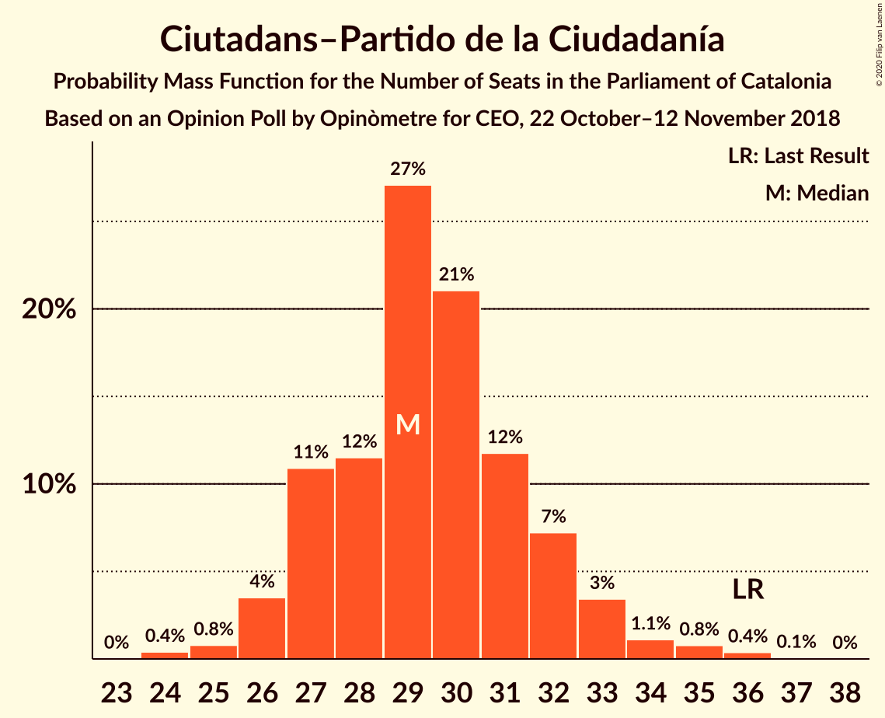
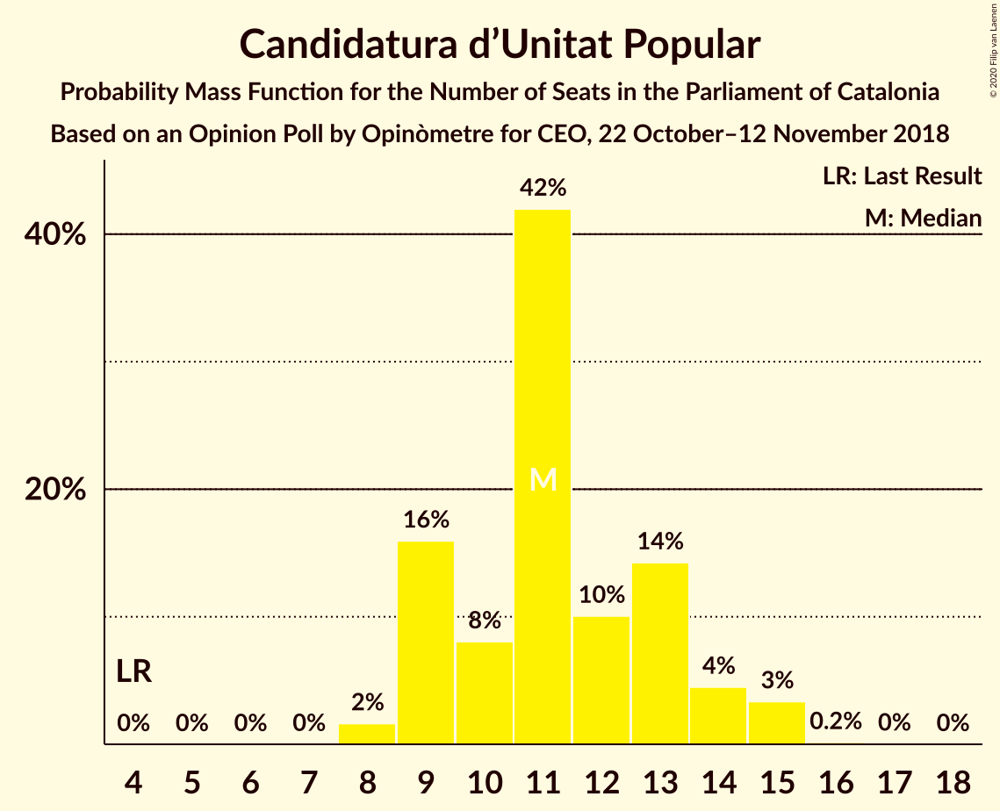
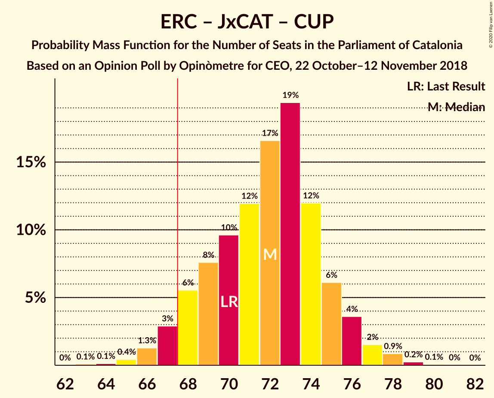
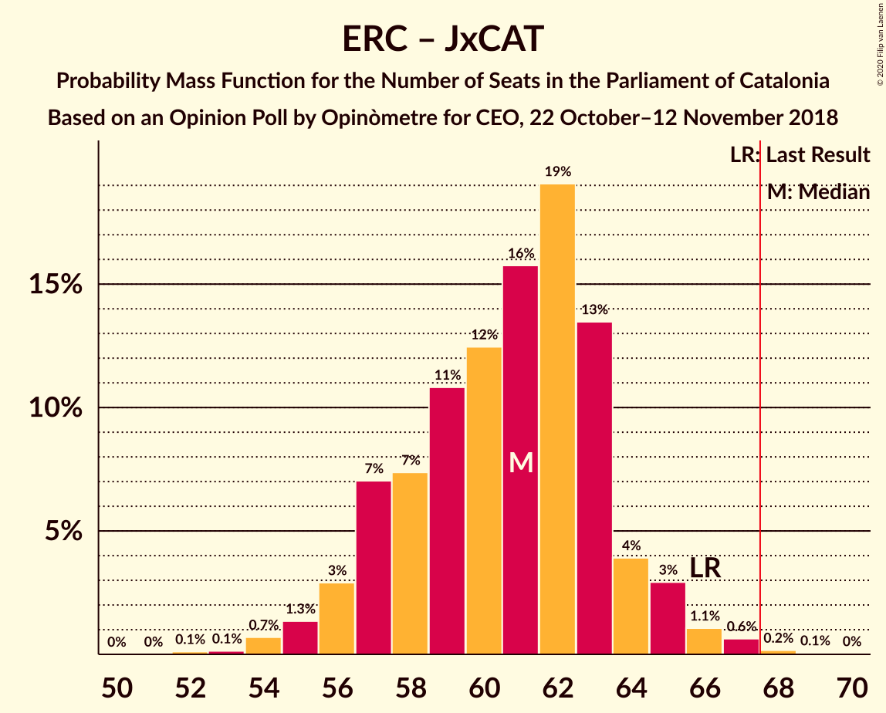

# Opinion Poll by Opinòmetre for CEO, 22 October–12 November 2018

<a href="#voting-intentions">Voting Intentions</a> | <a href="#seats">Seats</a> | <a href="#coalitions">Coalitions</a> | <a href="#technical-information">Technical Information</a>

## Voting Intentions

### Confidence Intervals

| Party | Last Result | Poll Result | 80% Confidence Interval | 90% Confidence Interval | 95% Confidence Interval | 99% Confidence Interval |
|:-----:|:-----------:|:-----------:|:-----------------------:|:-----------------------:|:-----------------------:|:-----------------------:|
| Esquerra Republicana–Catalunya Sí | 21.4% | 25.1% | 23.4–26.9% |22.9–27.4% |22.5–27.9% |21.7–28.7% |
| Ciutadans–Partido de la Ciudadanía | 25.4% | 21.4% | 19.8–23.1% |19.3–23.6% |19.0–24.0% |18.2–24.8% |
| Junts pel Catalunya | 21.7% | 14.8% | 13.5–16.3% |13.1–16.8% |12.8–17.1% |12.1–17.9% |
| Partit dels Socialistes de Catalunya (PSC-PSOE) | 13.9% | 14.5% | 13.2–16.0% |12.8–16.4% |12.5–16.8% |11.9–17.6% |
| Catalunya en Comú–Podem | 7.5% | 10.4% | 9.3–11.7% |8.9–12.1% |8.7–12.4% |8.1–13.1% |
| Candidatura d’Unitat Popular | 4.5% | 8.5% | 7.5–9.8% |7.2–10.1% |7.0–10.4% |6.5–11.0% |
| Partit Popular | 4.2% | 3.3% | 2.7–4.2% |2.5–4.4% |2.4–4.6% |2.1–5.1% |

*Note:* The poll result column reflects the actual value used in the calculations. Published results may vary slightly, and in addition be rounded to fewer digits.

## Seats

### Confidence Intervals

| Party | Last Result | Median | 80% Confidence Interval | 90% Confidence Interval | 95% Confidence Interval | 99% Confidence Interval |
|:-----:|:-----------:|:------:|:-----------------------:|:-----------------------:|:-----------------------:|:-----------------------:|
| <a href="#esquerra-republicana–catalunya-sí">Esquerra Republicana–Catalunya Sí</a> | 32 | 38 | 34–40 |33–41 |33–42 |32–43 |
| <a href="#ciutadans–partido-de-la-ciudadanía">Ciutadans–Partido de la Ciudadanía</a> | 36 | 29 | 27–32 |27–32 |26–33 |25–36 |
| <a href="#junts-pel-catalunya">Junts pel Catalunya</a> | 34 | 23 | 20–24 |19–25 |19–27 |18–29 |
| <a href="#partit-dels-socialistes-de-catalunya-(psc-psoe)">Partit dels Socialistes de Catalunya (PSC-PSOE)</a> | 17 | 18 | 16–22 |16–23 |16–23 |15–24 |
| <a href="#catalunya-en-comú–podem">Catalunya en Comú–Podem</a> | 8 | 13 | 11–14 |11–15 |10–16 |9–17 |
| <a href="#candidatura-d’unitat-popular">Candidatura d’Unitat Popular</a> | 4 | 11 | 9–13 |9–14 |9–15 |8–15 |
| <a href="#partit-popular">Partit Popular</a> | 4 | 3 | 0–3 |0–5 |0–5 |0–6 |

### Esquerra Republicana–Catalunya Sí

*For a full overview of the results for this party, see the [Esquerra Republicana–Catalunya Sí](party-esquerrarepublicana–catalunyasí.html) page.*

| Number of Seats | Probability | Accumulated | Special Marks |
|:---------------:|:-----------:|:-----------:|:-------------:|
| 31 | 0.2% | 100% |  |
| 32 | 0.4% | 99.8% | Last Result |
| 33 | 6% | 99.4% |  |
| 34 | 5% | 94% |  |
| 35 | 3% | 89% |  |
| 36 | 7% | 86% |  |
| 37 | 13% | 79% |  |
| 38 | 20% | 66% | Median |
| 39 | 36% | 46% |  |
| 40 | 3% | 11% |  |
| 41 | 3% | 8% |  |
| 42 | 3% | 4% |  |
| 43 | 1.4% | 2% |  |
| 44 | 0.3% | 0.4% |  |
| 45 | 0.1% | 0.1% |  |
| 46 | 0% | 0% |  |

### Ciutadans–Partido de la Ciudadanía

*For a full overview of the results for this party, see the [Ciutadans–Partido de la Ciudadanía](party-ciutadans–partidodelaciudadanía.html) page.*

| Number of Seats | Probability | Accumulated | Special Marks |
|:---------------:|:-----------:|:-----------:|:-------------:|
| 24 | 0.4% | 100% |  |
| 25 | 0.6% | 99.6% |  |
| 26 | 4% | 99.0% |  |
| 27 | 9% | 95% |  |
| 28 | 16% | 86% |  |
| 29 | 34% | 70% | Median |
| 30 | 14% | 36% |  |
| 31 | 8% | 22% |  |
| 32 | 10% | 14% |  |
| 33 | 3% | 5% |  |
| 34 | 0.8% | 2% |  |
| 35 | 0.8% | 1.3% |  |
| 36 | 0.4% | 0.5% | Last Result |
| 37 | 0.1% | 0.1% |  |
| 38 | 0% | 0% |  |

### Junts pel Catalunya

*For a full overview of the results for this party, see the [Junts pel Catalunya](party-juntspelcatalunya.html) page.*

| Number of Seats | Probability | Accumulated | Special Marks |
|:---------------:|:-----------:|:-----------:|:-------------:|
| 17 | 0.1% | 100% |  |
| 18 | 2% | 99.9% |  |
| 19 | 3% | 98% |  |
| 20 | 7% | 95% |  |
| 21 | 6% | 87% |  |
| 22 | 4% | 82% |  |
| 23 | 41% | 77% | Median |
| 24 | 27% | 37% |  |
| 25 | 4% | 9% |  |
| 26 | 2% | 5% |  |
| 27 | 2% | 3% |  |
| 28 | 0.3% | 0.9% |  |
| 29 | 0.6% | 0.6% |  |
| 30 | 0% | 0% |  |
| 31 | 0% | 0% |  |
| 32 | 0% | 0% |  |
| 33 | 0% | 0% |  |
| 34 | 0% | 0% | Last Result |

### Partit dels Socialistes de Catalunya (PSC-PSOE)

*For a full overview of the results for this party, see the [Partit dels Socialistes de Catalunya (PSC-PSOE)](party-partitdelssocialistesdecatalunyapsc-psoe.html) page.*

| Number of Seats | Probability | Accumulated | Special Marks |
|:---------------:|:-----------:|:-----------:|:-------------:|
| 15 | 2% | 100% |  |
| 16 | 12% | 98% |  |
| 17 | 24% | 87% | Last Result |
| 18 | 35% | 62% | Median |
| 19 | 5% | 27% |  |
| 20 | 5% | 22% |  |
| 21 | 5% | 17% |  |
| 22 | 6% | 12% |  |
| 23 | 6% | 6% |  |
| 24 | 0.6% | 0.7% |  |
| 25 | 0% | 0% |  |

### Catalunya en Comú–Podem

*For a full overview of the results for this party, see the [Catalunya en Comú–Podem](party-catalunyaencomú–podem.html) page.*

| Number of Seats | Probability | Accumulated | Special Marks |
|:---------------:|:-----------:|:-----------:|:-------------:|
| 8 | 0.2% | 100% | Last Result |
| 9 | 2% | 99.8% |  |
| 10 | 2% | 98% |  |
| 11 | 14% | 96% |  |
| 12 | 11% | 82% |  |
| 13 | 44% | 70% | Median |
| 14 | 19% | 27% |  |
| 15 | 3% | 8% |  |
| 16 | 4% | 5% |  |
| 17 | 0.6% | 0.7% |  |
| 18 | 0.1% | 0.1% |  |
| 19 | 0% | 0% |  |

### Candidatura d’Unitat Popular

*For a full overview of the results for this party, see the [Candidatura d’Unitat Popular](party-candidaturad’unitatpopular.html) page.*

| Number of Seats | Probability | Accumulated | Special Marks |
|:---------------:|:-----------:|:-----------:|:-------------:|
| 4 | 0% | 100% | Last Result |
| 5 | 0% | 100% |  |
| 6 | 0% | 100% |  |
| 7 | 0% | 100% |  |
| 8 | 1.4% | 100% |  |
| 9 | 14% | 98.6% |  |
| 10 | 9% | 85% |  |
| 11 | 45% | 75% | Median |
| 12 | 7% | 30% |  |
| 13 | 17% | 23% |  |
| 14 | 3% | 6% |  |
| 15 | 3% | 3% |  |
| 16 | 0.2% | 0.2% |  |
| 17 | 0.1% | 0.1% |  |
| 18 | 0% | 0% |  |

### Partit Popular

*For a full overview of the results for this party, see the [Partit Popular](party-partitpopular.html) page.*

| Number of Seats | Probability | Accumulated | Special Marks |
|:---------------:|:-----------:|:-----------:|:-------------:|
| 0 | 13% | 100% |  |
| 1 | 0% | 87% |  |
| 2 | 24% | 87% |  |
| 3 | 53% | 62% | Median |
| 4 | 3% | 9% | Last Result |
| 5 | 5% | 6% |  |
| 6 | 0.9% | 1.0% |  |
| 7 | 0.1% | 0.1% |  |
| 8 | 0% | 0% |  |

## Coalitions

### Confidence Intervals

| Coalition | Last Result | Median | Majority? | 80% Confidence Interval | 90% Confidence Interval | 95% Confidence Interval | 99% Confidence Interval |
|:---------:|:-----------:|:------:|:---------:|:-----------------------:|:-----------------------:|:-----------------------:|:-----------------------:|
| Esquerra Republicana–Catalunya Sí – Junts pel Catalunya – Catalunya en Comú–Podem | 74 | 74 | 97% | 70–77 | 69–78 | 67–78 | 67–79 |
| Esquerra Republicana–Catalunya Sí – Junts pel Catalunya – Candidatura d’Unitat Popular | 70 | 73 | 95% | 69–75 | 68–75 | 67–77 | 65–78 |
| Esquerra Republicana–Catalunya Sí – Partit dels Socialistes de Catalunya (PSC-PSOE) – Catalunya en Comú–Podem | 57 | 70 | 75% | 66–72 | 64–73 | 63–75 | 62–76 |
| Ciutadans–Partido de la Ciudadanía – Partit dels Socialistes de Catalunya (PSC-PSOE) – Catalunya en Comú–Podem – Partit Popular | 65 | 62 | 5% | 60–66 | 60–67 | 58–68 | 57–70 |
| Esquerra Republicana–Catalunya Sí – Junts pel Catalunya | 66 | 62 | 0.2% | 57–64 | 56–65 | 55–65 | 54–67 |
| Ciutadans–Partido de la Ciudadanía – Partit dels Socialistes de Catalunya (PSC-PSOE) – Partit Popular | 57 | 50 | 0% | 47–54 | 47–55 | 46–55 | 45–57 |
| Esquerra Republicana–Catalunya Sí – Catalunya en Comú–Podem | 40 | 51 | 0% | 47–53 | 46–54 | 44–55 | 44–57 |

### Esquerra Republicana–Catalunya Sí – Junts pel Catalunya – Catalunya en Comú–Podem

| Number of Seats | Probability | Accumulated | Special Marks |
|:---------------:|:-----------:|:-----------:|:-------------:|
| 65 | 0.1% | 100% |  |
| 66 | 0.3% | 99.9% |  |
| 67 | 3% | 99.6% |  |
| 68 | 1.2% | 97% | Majority |
| 69 | 5% | 96% |  |
| 70 | 6% | 91% |  |
| 71 | 7% | 85% |  |
| 72 | 9% | 78% |  |
| 73 | 11% | 69% |  |
| 74 | 12% | 57% | Last Result, Median |
| 75 | 23% | 45% |  |
| 76 | 9% | 23% |  |
| 77 | 6% | 13% |  |
| 78 | 6% | 8% |  |
| 79 | 0.7% | 1.2% |  |
| 80 | 0.3% | 0.5% |  |
| 81 | 0.2% | 0.2% |  |
| 82 | 0% | 0.1% |  |
| 83 | 0% | 0% |  |

### Esquerra Republicana–Catalunya Sí – Junts pel Catalunya – Candidatura d’Unitat Popular

| Number of Seats | Probability | Accumulated | Special Marks |
|:---------------:|:-----------:|:-----------:|:-------------:|
| 64 | 0.3% | 100% |  |
| 65 | 0.4% | 99.7% |  |
| 66 | 0.9% | 99.3% |  |
| 67 | 3% | 98% |  |
| 68 | 4% | 95% | Majority |
| 69 | 11% | 91% |  |
| 70 | 7% | 80% | Last Result |
| 71 | 10% | 73% |  |
| 72 | 7% | 63% | Median |
| 73 | 34% | 56% |  |
| 74 | 12% | 22% |  |
| 75 | 5% | 10% |  |
| 76 | 2% | 5% |  |
| 77 | 1.2% | 3% |  |
| 78 | 1.2% | 1.5% |  |
| 79 | 0.2% | 0.3% |  |
| 80 | 0.1% | 0.1% |  |
| 81 | 0% | 0% |  |

### Esquerra Republicana–Catalunya Sí – Partit dels Socialistes de Catalunya (PSC-PSOE) – Catalunya en Comú–Podem

| Number of Seats | Probability | Accumulated | Special Marks |
|:---------------:|:-----------:|:-----------:|:-------------:|
| 57 | 0% | 100% | Last Result |
| 58 | 0% | 100% |  |
| 59 | 0% | 100% |  |
| 60 | 0.1% | 100% |  |
| 61 | 0.1% | 99.9% |  |
| 62 | 0.5% | 99.9% |  |
| 63 | 2% | 99.3% |  |
| 64 | 2% | 97% |  |
| 65 | 2% | 95% |  |
| 66 | 8% | 93% |  |
| 67 | 10% | 85% |  |
| 68 | 19% | 75% | Majority |
| 69 | 5% | 56% | Median |
| 70 | 27% | 51% |  |
| 71 | 10% | 24% |  |
| 72 | 7% | 13% |  |
| 73 | 1.1% | 6% |  |
| 74 | 2% | 5% |  |
| 75 | 2% | 3% |  |
| 76 | 0.4% | 0.6% |  |
| 77 | 0.2% | 0.2% |  |
| 78 | 0% | 0% |  |

### Ciutadans–Partido de la Ciudadanía – Partit dels Socialistes de Catalunya (PSC-PSOE) – Catalunya en Comú–Podem – Partit Popular

| Number of Seats | Probability | Accumulated | Special Marks |
|:---------------:|:-----------:|:-----------:|:-------------:|
| 55 | 0.1% | 100% |  |
| 56 | 0.2% | 99.9% |  |
| 57 | 1.2% | 99.7% |  |
| 58 | 1.2% | 98.5% |  |
| 59 | 2% | 97% |  |
| 60 | 5% | 95% |  |
| 61 | 12% | 90% |  |
| 62 | 34% | 78% |  |
| 63 | 7% | 44% | Median |
| 64 | 10% | 37% |  |
| 65 | 7% | 27% | Last Result |
| 66 | 11% | 20% |  |
| 67 | 4% | 9% |  |
| 68 | 3% | 5% | Majority |
| 69 | 0.9% | 2% |  |
| 70 | 0.4% | 0.7% |  |
| 71 | 0.3% | 0.3% |  |
| 72 | 0% | 0% |  |

### Esquerra Republicana–Catalunya Sí – Junts pel Catalunya

| Number of Seats | Probability | Accumulated | Special Marks |
|:---------------:|:-----------:|:-----------:|:-------------:|
| 52 | 0.2% | 100% |  |
| 53 | 0.1% | 99.8% |  |
| 54 | 0.5% | 99.7% |  |
| 55 | 2% | 99.2% |  |
| 56 | 4% | 97% |  |
| 57 | 9% | 93% |  |
| 58 | 4% | 84% |  |
| 59 | 8% | 80% |  |
| 60 | 11% | 72% |  |
| 61 | 11% | 61% | Median |
| 62 | 30% | 51% |  |
| 63 | 10% | 21% |  |
| 64 | 5% | 11% |  |
| 65 | 4% | 6% |  |
| 66 | 2% | 2% | Last Result |
| 67 | 0.4% | 0.6% |  |
| 68 | 0.1% | 0.2% | Majority |
| 69 | 0% | 0% |  |

### Ciutadans–Partido de la Ciudadanía – Partit dels Socialistes de Catalunya (PSC-PSOE) – Partit Popular

| Number of Seats | Probability | Accumulated | Special Marks |
|:---------------:|:-----------:|:-----------:|:-------------:|
| 43 | 0.1% | 100% |  |
| 44 | 0.3% | 99.9% |  |
| 45 | 1.2% | 99.6% |  |
| 46 | 3% | 98% |  |
| 47 | 8% | 96% |  |
| 48 | 11% | 88% |  |
| 49 | 25% | 77% |  |
| 50 | 15% | 52% | Median |
| 51 | 8% | 36% |  |
| 52 | 7% | 29% |  |
| 53 | 10% | 21% |  |
| 54 | 6% | 12% |  |
| 55 | 4% | 5% |  |
| 56 | 0.9% | 2% |  |
| 57 | 0.7% | 1.0% | Last Result |
| 58 | 0.2% | 0.3% |  |
| 59 | 0% | 0.1% |  |
| 60 | 0% | 0% |  |

### Esquerra Republicana–Catalunya Sí – Catalunya en Comú–Podem

| Number of Seats | Probability | Accumulated | Special Marks |
|:---------------:|:-----------:|:-----------:|:-------------:|
| 40 | 0% | 100% | Last Result |
| 41 | 0% | 100% |  |
| 42 | 0% | 100% |  |
| 43 | 0.2% | 99.9% |  |
| 44 | 2% | 99.8% |  |
| 45 | 0.7% | 97% |  |
| 46 | 3% | 97% |  |
| 47 | 5% | 94% |  |
| 48 | 5% | 89% |  |
| 49 | 10% | 84% |  |
| 50 | 18% | 74% |  |
| 51 | 12% | 56% | Median |
| 52 | 26% | 45% |  |
| 53 | 10% | 19% |  |
| 54 | 5% | 9% |  |
| 55 | 2% | 4% |  |
| 56 | 0.8% | 2% |  |
| 57 | 0.8% | 0.9% |  |
| 58 | 0.1% | 0.1% |  |
| 59 | 0% | 0% |  |

## Technical Information

### Opinion Poll

+ **Polling firm:** Opinòmetre
+ **Commissioner(s):** CEO
+ **Fieldwork period:** 22 October–12 November 2018

### Calculations

+ **Sample size:** 1020
+ **Simulations done:** 131,072
+ **Error estimate:** 1.51%

