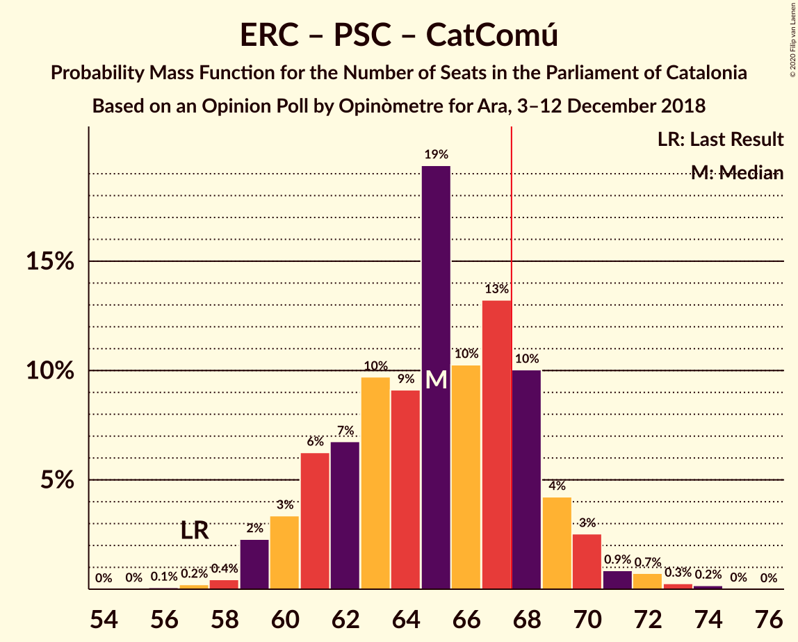

# Opinion Poll by Opinòmetre for Ara, 3–12 December 2018

<a href="#voting-intentions">Voting Intentions</a> | <a href="#seats">Seats</a> | <a href="#coalitions">Coalitions</a> | <a href="#technical-information">Technical Information</a>

## Voting Intentions

### Confidence Intervals

| Party | Last Result | Poll Result | 80% Confidence Interval | 90% Confidence Interval | 95% Confidence Interval | 99% Confidence Interval |
|:-----:|:-----------:|:-----------:|:-----------------------:|:-----------------------:|:-----------------------:|:-----------------------:|
| Esquerra Republicana–Catalunya Sí | 21.4% | 25.8% | 23.8–27.8% |23.3–28.4% |22.8–28.9% |21.9–29.9% |
| Ciutadans–Partido de la Ciudadanía | 25.4% | 23.4% | 21.5–25.4% |21.0–25.9% |20.6–26.4% |19.7–27.4% |
| Junts per Catalunya | 21.7% | 16.2% | 14.7–18.0% |14.2–18.5% |13.9–19.0% |13.1–19.9% |
| Partit dels Socialistes de Catalunya (PSC-PSOE) | 13.9% | 13.9% | 12.4–15.6% |12.0–16.0% |11.6–16.4% |11.0–17.3% |
| Candidatura d’Unitat Popular | 4.5% | 8.2% | 7.1–9.6% |6.8–10.0% |6.5–10.4% |6.0–11.1% |
| Catalunya en Comú–Podem | 7.5% | 7.1% | 6.1–8.4% |5.8–8.8% |5.5–9.1% |5.1–9.8% |
| Partit Popular | 4.2% | 2.5% | 1.9–3.4% |1.8–3.6% |1.6–3.8% |1.4–4.3% |
| Vox | 0.0% | 1.1% | 0.8–1.8% |0.7–2.0% |0.6–2.1% |0.5–2.5% |

*Note:* The poll result column reflects the actual value used in the calculations. Published results may vary slightly, and in addition be rounded to fewer digits.

## Seats

### Confidence Intervals

| Party | Last Result | Median | 80% Confidence Interval | 90% Confidence Interval | 95% Confidence Interval | 99% Confidence Interval |
|:-----:|:-----------:|:------:|:-----------------------:|:-----------------------:|:-----------------------:|:-----------------------:|
| <a href="#esquerra-republicana–catalunya-sí">Esquerra Republicana–Catalunya Sí</a> | 32 | 39 | 36–42 |35–43 |34–44 |33–46 |
| <a href="#ciutadans–partido-de-la-ciudadanía">Ciutadans–Partido de la Ciudadanía</a> | 36 | 33 | 30–37 |29–37 |28–38 |27–39 |
| <a href="#junts-per-catalunya">Junts per Catalunya</a> | 34 | 25 | 23–28 |23–29 |22–30 |19–31 |
| <a href="#partit-dels-socialistes-de-catalunya-(psc-psoe)">Partit dels Socialistes de Catalunya (PSC-PSOE)</a> | 17 | 17 | 16–20 |15–22 |15–23 |14–24 |
| <a href="#candidatura-d’unitat-popular">Candidatura d’Unitat Popular</a> | 4 | 11 | 9–13 |9–14 |8–15 |8–16 |
| <a href="#catalunya-en-comú–podem">Catalunya en Comú–Podem</a> | 8 | 8 | 6–9 |5–11 |5–11 |5–12 |
| <a href="#partit-popular">Partit Popular</a> | 4 | 0 | 0–3 |0–3 |0–3 |0–5 |
| <a href="#vox">Vox</a> | 0 | 0 | 0 |0 |0 |0 |

### Esquerra Republicana–Catalunya Sí

*For a full overview of the results for this party, see the [Esquerra Republicana–Catalunya Sí](party-esquerrarepublicana–catalunyasí.html) page.*

| Number of Seats | Probability | Accumulated | Special Marks |
|:---------------:|:-----------:|:-----------:|:-------------:|
| 32 | 0.2% | 100% | Last Result |
| 33 | 1.3% | 99.8% |  |
| 34 | 3% | 98% |  |
| 35 | 4% | 95% |  |
| 36 | 6% | 91% |  |
| 37 | 8% | 85% |  |
| 38 | 8% | 77% |  |
| 39 | 23% | 68% | Median |
| 40 | 21% | 45% |  |
| 41 | 7% | 24% |  |
| 42 | 10% | 17% |  |
| 43 | 4% | 7% |  |
| 44 | 1.4% | 3% |  |
| 45 | 0.8% | 2% |  |
| 46 | 0.7% | 0.9% |  |
| 47 | 0.2% | 0.2% |  |
| 48 | 0.1% | 0.1% |  |
| 49 | 0% | 0% |  |

### Ciutadans–Partido de la Ciudadanía

*For a full overview of the results for this party, see the [Ciutadans–Partido de la Ciudadanía](party-ciutadans–partidodelaciudadanía.html) page.*

| Number of Seats | Probability | Accumulated | Special Marks |
|:---------------:|:-----------:|:-----------:|:-------------:|
| 26 | 0.1% | 100% |  |
| 27 | 0.7% | 99.9% |  |
| 28 | 2% | 99.2% |  |
| 29 | 3% | 97% |  |
| 30 | 10% | 94% |  |
| 31 | 21% | 84% |  |
| 32 | 13% | 63% |  |
| 33 | 13% | 50% | Median |
| 34 | 10% | 37% |  |
| 35 | 10% | 27% |  |
| 36 | 6% | 17% | Last Result |
| 37 | 7% | 11% |  |
| 38 | 3% | 4% |  |
| 39 | 0.4% | 0.6% |  |
| 40 | 0.1% | 0.1% |  |
| 41 | 0% | 0% |  |

### Junts per Catalunya

*For a full overview of the results for this party, see the [Junts per Catalunya](party-juntspercatalunya.html) page.*

| Number of Seats | Probability | Accumulated | Special Marks |
|:---------------:|:-----------:|:-----------:|:-------------:|
| 18 | 0.1% | 100% |  |
| 19 | 0.4% | 99.9% |  |
| 20 | 0.5% | 99.5% |  |
| 21 | 1.2% | 99.0% |  |
| 22 | 2% | 98% |  |
| 23 | 9% | 96% |  |
| 24 | 33% | 87% |  |
| 25 | 7% | 54% | Median |
| 26 | 13% | 46% |  |
| 27 | 13% | 33% |  |
| 28 | 11% | 21% |  |
| 29 | 5% | 10% |  |
| 30 | 4% | 5% |  |
| 31 | 0.8% | 1.2% |  |
| 32 | 0.3% | 0.4% |  |
| 33 | 0.1% | 0.1% |  |
| 34 | 0% | 0% | Last Result |

### Partit dels Socialistes de Catalunya (PSC-PSOE)

*For a full overview of the results for this party, see the [Partit dels Socialistes de Catalunya (PSC-PSOE)](party-partitdelssocialistesdecatalunyapsc-psoe.html) page.*

| Number of Seats | Probability | Accumulated | Special Marks |
|:---------------:|:-----------:|:-----------:|:-------------:|
| 13 | 0.2% | 100% |  |
| 14 | 0.4% | 99.8% |  |
| 15 | 5% | 99.4% |  |
| 16 | 17% | 95% |  |
| 17 | 29% | 78% | Last Result, Median |
| 18 | 19% | 49% |  |
| 19 | 11% | 30% |  |
| 20 | 9% | 18% |  |
| 21 | 3% | 9% |  |
| 22 | 2% | 6% |  |
| 23 | 3% | 4% |  |
| 24 | 0.7% | 0.8% |  |
| 25 | 0.1% | 0.1% |  |
| 26 | 0% | 0% |  |

### Candidatura d’Unitat Popular

*For a full overview of the results for this party, see the [Candidatura d’Unitat Popular](party-candidaturad’unitatpopular.html) page.*

| Number of Seats | Probability | Accumulated | Special Marks |
|:---------------:|:-----------:|:-----------:|:-------------:|
| 4 | 0% | 100% | Last Result |
| 5 | 0% | 100% |  |
| 6 | 0% | 100% |  |
| 7 | 0.1% | 100% |  |
| 8 | 4% | 99.9% |  |
| 9 | 22% | 96% |  |
| 10 | 7% | 75% |  |
| 11 | 40% | 68% | Median |
| 12 | 9% | 28% |  |
| 13 | 13% | 19% |  |
| 14 | 3% | 6% |  |
| 15 | 3% | 3% |  |
| 16 | 0.4% | 0.5% |  |
| 17 | 0.1% | 0.1% |  |
| 18 | 0% | 0% |  |

### Catalunya en Comú–Podem

*For a full overview of the results for this party, see the [Catalunya en Comú–Podem](party-catalunyaencomú–podem.html) page.*

| Number of Seats | Probability | Accumulated | Special Marks |
|:---------------:|:-----------:|:-----------:|:-------------:|
| 4 | 0.2% | 100% |  |
| 5 | 5% | 99.8% |  |
| 6 | 9% | 95% |  |
| 7 | 16% | 86% |  |
| 8 | 39% | 70% | Last Result, Median |
| 9 | 22% | 31% |  |
| 10 | 4% | 9% |  |
| 11 | 4% | 5% |  |
| 12 | 0.3% | 0.7% |  |
| 13 | 0.4% | 0.5% |  |
| 14 | 0% | 0% |  |

### Partit Popular

*For a full overview of the results for this party, see the [Partit Popular](party-partitpopular.html) page.*

| Number of Seats | Probability | Accumulated | Special Marks |
|:---------------:|:-----------:|:-----------:|:-------------:|
| 0 | 72% | 100% | Median |
| 1 | 0% | 28% |  |
| 2 | 16% | 28% |  |
| 3 | 11% | 12% |  |
| 4 | 0.4% | 1.0% | Last Result |
| 5 | 0.5% | 0.6% |  |
| 6 | 0.1% | 0.1% |  |
| 7 | 0% | 0% |  |

### Vox

*For a full overview of the results for this party, see the [Vox](party-vox.html) page.*

| Number of Seats | Probability | Accumulated | Special Marks |
|:---------------:|:-----------:|:-----------:|:-------------:|
| 0 | 99.9% | 100% | Last Result, Median |
| 1 | 0% | 0.1% |  |
| 2 | 0% | 0.1% |  |
| 3 | 0% | 0% |  |

## Coalitions

### Confidence Intervals

| Coalition | Last Result | Median | Majority? | 80% Confidence Interval | 90% Confidence Interval | 95% Confidence Interval | 99% Confidence Interval |
|:---------:|:-----------:|:------:|:---------:|:-----------------------:|:-----------------------:|:-----------------------:|:-----------------------:|
| Esquerra Republicana–Catalunya Sí – Junts per Catalunya – Candidatura d’Unitat Popular | 70 | 76 | 99.7% | 72–79 | 71–80 | 70–81 | 68–82 |
| Esquerra Republicana–Catalunya Sí – Junts per Catalunya – Catalunya en Comú–Podem | 74 | 73 | 95% | 69–76 | 68–77 | 67–78 | 65–80 |
| Esquerra Republicana–Catalunya Sí – Partit dels Socialistes de Catalunya (PSC-PSOE) – Catalunya en Comú–Podem | 57 | 65 | 19% | 61–68 | 60–69 | 59–70 | 58–72 |
| Esquerra Republicana–Catalunya Sí – Junts per Catalunya | 66 | 65 | 17% | 61–68 | 60–69 | 59–70 | 57–72 |
| Ciutadans–Partido de la Ciudadanía – Partit dels Socialistes de Catalunya (PSC-PSOE) – Catalunya en Comú–Podem – Partit Popular | 65 | 59 | 0.3% | 56–63 | 55–64 | 54–65 | 53–67 |
| Ciutadans–Partido de la Ciudadanía – Partit dels Socialistes de Catalunya (PSC-PSOE) – Partit Popular | 57 | 51 | 0% | 48–55 | 47–56 | 46–57 | 45–59 |
| Ciutadans–Partido de la Ciudadanía – Partit dels Socialistes de Catalunya (PSC-PSOE) – Partit Popular – Vox | 57 | 51 | 0% | 48–55 | 47–56 | 46–57 | 45–59 |
| Esquerra Republicana–Catalunya Sí – Catalunya en Comú–Podem | 40 | 47 | 0% | 44–50 | 42–51 | 42–52 | 40–54 |

### Esquerra Republicana–Catalunya Sí – Junts per Catalunya – Candidatura d’Unitat Popular

| Number of Seats | Probability | Accumulated | Special Marks |
|:---------------:|:-----------:|:-----------:|:-------------:|
| 66 | 0% | 100% |  |
| 67 | 0.2% | 99.9% |  |
| 68 | 0.6% | 99.7% | Majority |
| 69 | 1.0% | 99.1% |  |
| 70 | 2% | 98% | Last Result |
| 71 | 3% | 96% |  |
| 72 | 8% | 93% |  |
| 73 | 7% | 85% |  |
| 74 | 13% | 78% |  |
| 75 | 13% | 66% | Median |
| 76 | 17% | 52% |  |
| 77 | 11% | 36% |  |
| 78 | 7% | 25% |  |
| 79 | 10% | 18% |  |
| 80 | 4% | 8% |  |
| 81 | 3% | 4% |  |
| 82 | 1.2% | 1.5% |  |
| 83 | 0.2% | 0.3% |  |
| 84 | 0.1% | 0.1% |  |
| 85 | 0% | 0% |  |

### Esquerra Republicana–Catalunya Sí – Junts per Catalunya – Catalunya en Comú–Podem

| Number of Seats | Probability | Accumulated | Special Marks |
|:---------------:|:-----------:|:-----------:|:-------------:|
| 63 | 0.1% | 100% |  |
| 64 | 0.2% | 99.9% |  |
| 65 | 0.6% | 99.7% |  |
| 66 | 1.4% | 99.1% |  |
| 67 | 2% | 98% |  |
| 68 | 5% | 95% | Majority |
| 69 | 4% | 91% |  |
| 70 | 9% | 86% |  |
| 71 | 12% | 77% |  |
| 72 | 10% | 64% | Median |
| 73 | 16% | 54% |  |
| 74 | 10% | 38% | Last Result |
| 75 | 10% | 28% |  |
| 76 | 11% | 18% |  |
| 77 | 4% | 7% |  |
| 78 | 1.2% | 3% |  |
| 79 | 1.1% | 2% |  |
| 80 | 0.5% | 0.7% |  |
| 81 | 0.2% | 0.2% |  |
| 82 | 0% | 0% |  |

### Esquerra Republicana–Catalunya Sí – Partit dels Socialistes de Catalunya (PSC-PSOE) – Catalunya en Comú–Podem

| Number of Seats | Probability | Accumulated | Special Marks |
|:---------------:|:-----------:|:-----------:|:-------------:|
| 56 | 0.1% | 100% |  |
| 57 | 0.2% | 99.9% | Last Result |
| 58 | 0.4% | 99.7% |  |
| 59 | 2% | 99.2% |  |
| 60 | 3% | 97% |  |
| 61 | 6% | 94% |  |
| 62 | 7% | 87% |  |
| 63 | 10% | 81% |  |
| 64 | 9% | 71% | Median |
| 65 | 19% | 62% |  |
| 66 | 10% | 42% |  |
| 67 | 13% | 32% |  |
| 68 | 10% | 19% | Majority |
| 69 | 4% | 9% |  |
| 70 | 3% | 5% |  |
| 71 | 0.9% | 2% |  |
| 72 | 0.7% | 1.2% |  |
| 73 | 0.3% | 0.5% |  |
| 74 | 0.2% | 0.2% |  |
| 75 | 0% | 0% |  |

### Esquerra Republicana–Catalunya Sí – Junts per Catalunya

| Number of Seats | Probability | Accumulated | Special Marks |
|:---------------:|:-----------:|:-----------:|:-------------:|
| 55 | 0% | 100% |  |
| 56 | 0.1% | 99.9% |  |
| 57 | 0.8% | 99.8% |  |
| 58 | 1.1% | 99.1% |  |
| 59 | 2% | 98% |  |
| 60 | 3% | 96% |  |
| 61 | 7% | 93% |  |
| 62 | 7% | 86% |  |
| 63 | 14% | 79% |  |
| 64 | 13% | 65% | Median |
| 65 | 13% | 52% |  |
| 66 | 12% | 39% | Last Result |
| 67 | 10% | 27% |  |
| 68 | 9% | 17% | Majority |
| 69 | 4% | 8% |  |
| 70 | 2% | 4% |  |
| 71 | 1.3% | 2% |  |
| 72 | 0.7% | 0.8% |  |
| 73 | 0.1% | 0.1% |  |
| 74 | 0% | 0% |  |

### Ciutadans–Partido de la Ciudadanía – Partit dels Socialistes de Catalunya (PSC-PSOE) – Catalunya en Comú–Podem – Partit Popular

| Number of Seats | Probability | Accumulated | Special Marks |
|:---------------:|:-----------:|:-----------:|:-------------:|
| 51 | 0.1% | 100% |  |
| 52 | 0.2% | 99.9% |  |
| 53 | 1.2% | 99.7% |  |
| 54 | 3% | 98.5% |  |
| 55 | 4% | 96% |  |
| 56 | 10% | 92% |  |
| 57 | 7% | 82% |  |
| 58 | 11% | 75% | Median |
| 59 | 17% | 64% |  |
| 60 | 13% | 48% |  |
| 61 | 13% | 34% |  |
| 62 | 7% | 22% |  |
| 63 | 8% | 15% |  |
| 64 | 3% | 7% |  |
| 65 | 2% | 4% | Last Result |
| 66 | 1.0% | 2% |  |
| 67 | 0.6% | 0.9% |  |
| 68 | 0.2% | 0.3% | Majority |
| 69 | 0% | 0.1% |  |
| 70 | 0% | 0% |  |

### Ciutadans–Partido de la Ciudadanía – Partit dels Socialistes de Catalunya (PSC-PSOE) – Partit Popular

| Number of Seats | Probability | Accumulated | Special Marks |
|:---------------:|:-----------:|:-----------:|:-------------:|
| 43 | 0% | 100% |  |
| 44 | 0.2% | 99.9% |  |
| 45 | 0.9% | 99.7% |  |
| 46 | 2% | 98.8% |  |
| 47 | 4% | 97% |  |
| 48 | 9% | 93% |  |
| 49 | 10% | 84% |  |
| 50 | 14% | 75% | Median |
| 51 | 14% | 61% |  |
| 52 | 10% | 46% |  |
| 53 | 13% | 36% |  |
| 54 | 9% | 23% |  |
| 55 | 6% | 14% |  |
| 56 | 4% | 8% |  |
| 57 | 2% | 4% | Last Result |
| 58 | 1.5% | 2% |  |
| 59 | 0.4% | 0.8% |  |
| 60 | 0.3% | 0.4% |  |
| 61 | 0.1% | 0.1% |  |
| 62 | 0% | 0% |  |

### Ciutadans–Partido de la Ciudadanía – Partit dels Socialistes de Catalunya (PSC-PSOE) – Partit Popular – Vox

| Number of Seats | Probability | Accumulated | Special Marks |
|:---------------:|:-----------:|:-----------:|:-------------:|
| 43 | 0% | 100% |  |
| 44 | 0.2% | 99.9% |  |
| 45 | 0.9% | 99.7% |  |
| 46 | 2% | 98.8% |  |
| 47 | 4% | 97% |  |
| 48 | 9% | 93% |  |
| 49 | 10% | 84% |  |
| 50 | 14% | 75% | Median |
| 51 | 14% | 61% |  |
| 52 | 10% | 46% |  |
| 53 | 13% | 36% |  |
| 54 | 9% | 23% |  |
| 55 | 6% | 14% |  |
| 56 | 4% | 8% |  |
| 57 | 2% | 4% | Last Result |
| 58 | 1.5% | 2% |  |
| 59 | 0.4% | 0.8% |  |
| 60 | 0.3% | 0.4% |  |
| 61 | 0.1% | 0.1% |  |
| 62 | 0% | 0% |  |

### Esquerra Republicana–Catalunya Sí – Catalunya en Comú–Podem

| Number of Seats | Probability | Accumulated | Special Marks |
|:---------------:|:-----------:|:-----------:|:-------------:|
| 38 | 0% | 100% |  |
| 39 | 0.2% | 99.9% |  |
| 40 | 0.5% | 99.8% | Last Result |
| 41 | 1.3% | 99.3% |  |
| 42 | 3% | 98% |  |
| 43 | 4% | 95% |  |
| 44 | 9% | 90% |  |
| 45 | 7% | 81% |  |
| 46 | 10% | 74% |  |
| 47 | 16% | 64% | Median |
| 48 | 19% | 47% |  |
| 49 | 11% | 29% |  |
| 50 | 7% | 17% |  |
| 51 | 6% | 10% |  |
| 52 | 2% | 4% |  |
| 53 | 0.9% | 2% |  |
| 54 | 0.5% | 0.9% |  |
| 55 | 0.3% | 0.4% |  |
| 56 | 0.1% | 0.1% |  |
| 57 | 0% | 0% |  |

## Technical Information

### Opinion Poll

+ **Polling firm:** Opinòmetre
+ **Commissioner(s):** Ara
+ **Fieldwork period:** 3–12 December 2018

### Calculations

+ **Sample size:** 800
+ **Simulations done:** 1,048,576
+ **Error estimate:** 1.30%

