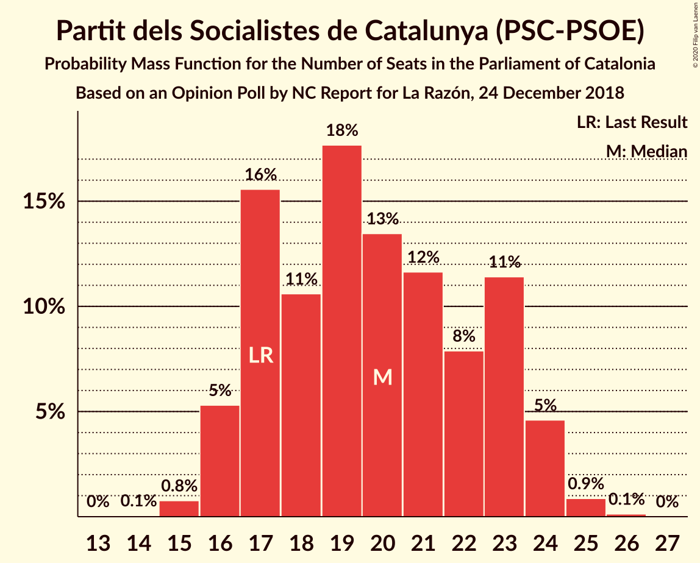
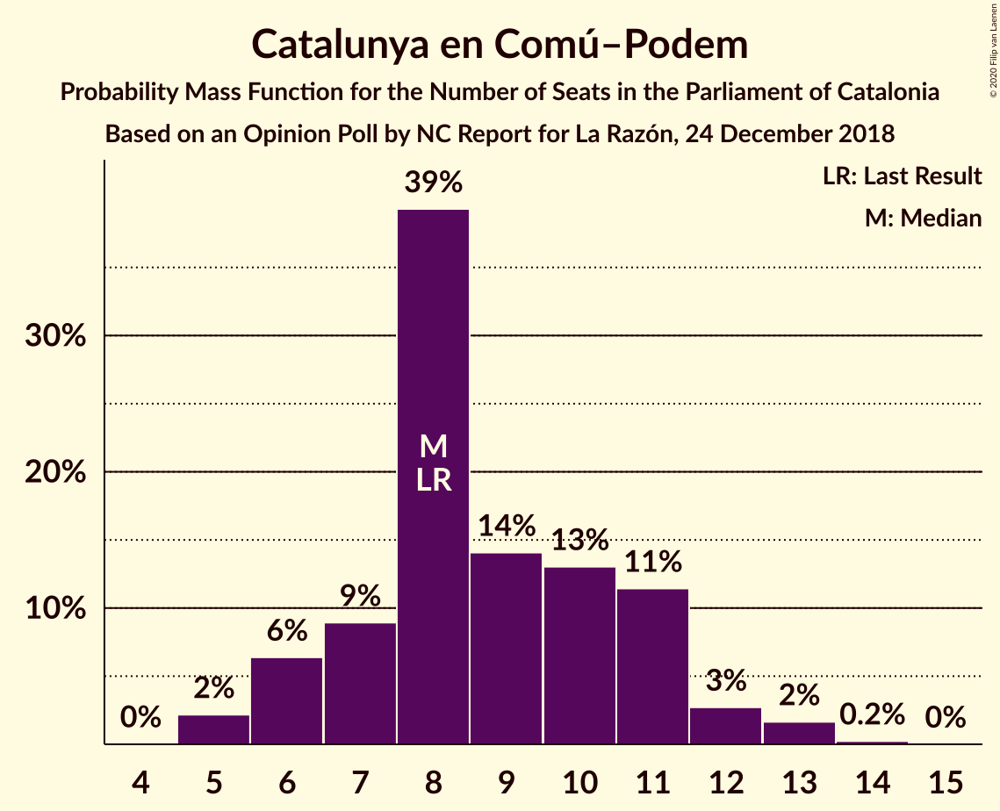
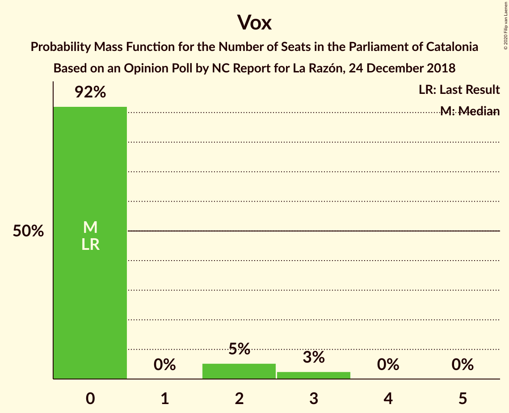
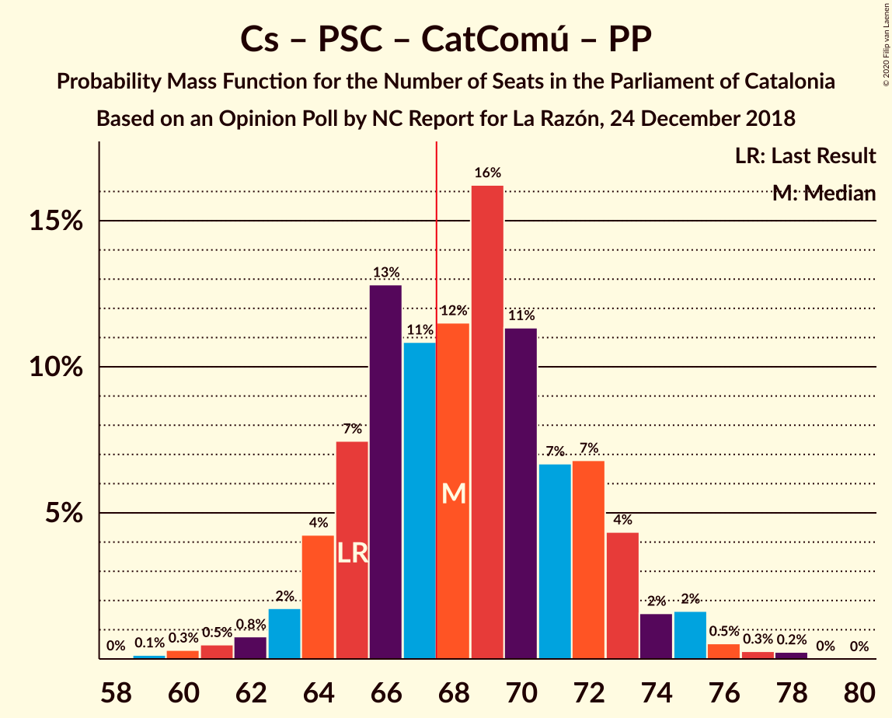
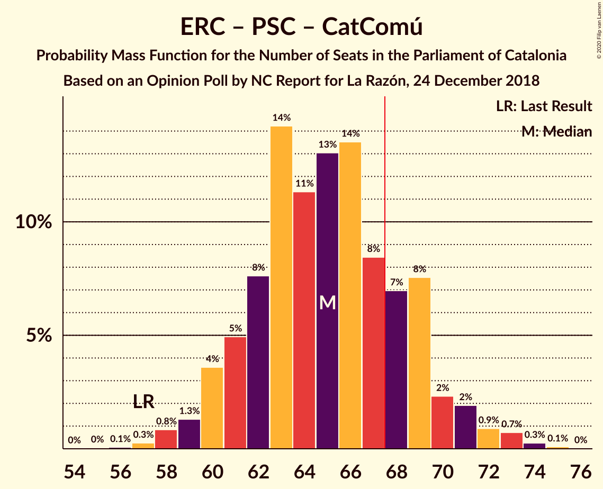

# Opinion Poll by NC Report for La Razón, 24 December 2018

<a href="#voting-intentions">Voting Intentions</a> | <a href="#seats">Seats</a> | <a href="#coalitions">Coalitions</a> | <a href="#technical-information">Technical Information</a>

## Voting Intentions

### Confidence Intervals

| Party | Last Result | Poll Result | 80% Confidence Interval | 90% Confidence Interval | 95% Confidence Interval | 99% Confidence Interval |
|:-----:|:-----------:|:-----------:|:-----------------------:|:-----------------------:|:-----------------------:|:-----------------------:|
| Ciutadans–Partido de la Ciudadanía | 25.4% | 25.0% | 23.0–27.1% |22.5–27.7% |22.0–28.2% |21.1–29.2% |
| Esquerra Republicana–Catalunya Sí | 21.4% | 24.2% | 22.2–26.3% |21.7–26.9% |21.2–27.4% |20.3–28.4% |
| Partit dels Socialistes de Catalunya (PSC-PSOE) | 13.9% | 15.0% | 13.5–16.8% |13.0–17.3% |12.6–17.8% |11.9–18.7% |
| Junts pel Catalunya | 21.7% | 14.9% | 13.3–16.7% |12.9–17.2% |12.5–17.6% |11.8–18.5% |
| Catalunya en Comú–Podem | 7.5% | 7.7% | 6.5–9.1% |6.2–9.4% |5.9–9.8% |5.5–10.5% |
| Candidatura d’Unitat Popular | 4.5% | 5.0% | 4.1–6.1% |3.8–6.5% |3.6–6.8% |3.2–7.4% |
| Partit Popular | 4.2% | 4.4% | 3.6–5.6% |3.4–5.9% |3.2–6.2% |2.8–6.8% |
| Vox | 0.0% | 2.0% | 1.5–2.9% |1.3–3.1% |1.2–3.3% |1.0–3.7% |

*Note:* The poll result column reflects the actual value used in the calculations. Published results may vary slightly, and in addition be rounded to fewer digits.

## Seats

### Confidence Intervals

| Party | Last Result | Median | 80% Confidence Interval | 90% Confidence Interval | 95% Confidence Interval | 99% Confidence Interval |
|:-----:|:-----------:|:------:|:-----------------------:|:-----------------------:|:-----------------------:|:-----------------------:|
| <a href="#ciutadans–partido-de-la-ciudadanía">Ciutadans–Partido de la Ciudadanía</a> | 36 | 35 | 32–38 |31–38 |30–39 |28–41 |
| <a href="#esquerra-republicana–catalunya-sí">Esquerra Republicana–Catalunya Sí</a> | 32 | 36 | 34–41 |33–41 |32–42 |31–43 |
| <a href="#partit-dels-socialistes-de-catalunya-(psc-psoe)">Partit dels Socialistes de Catalunya (PSC-PSOE)</a> | 17 | 19 | 17–23 |16–24 |16–24 |15–25 |
| <a href="#junts-pel-catalunya">Junts pel Catalunya</a> | 34 | 24 | 20–27 |20–27 |18–27 |18–29 |
| <a href="#catalunya-en-comú–podem">Catalunya en Comú–Podem</a> | 8 | 8 | 7–11 |7–11 |6–12 |5–13 |
| <a href="#candidatura-d’unitat-popular">Candidatura d’Unitat Popular</a> | 4 | 6 | 4–8 |4–8 |3–8 |2–9 |
| <a href="#partit-popular">Partit Popular</a> | 4 | 5 | 3–7 |3–7 |2–7 |0–9 |
| <a href="#vox">Vox</a> | 0 | 0 | 0–2 |0–3 |0–3 |0–3 |

### Ciutadans–Partido de la Ciudadanía

*For a full overview of the results for this party, see the [Ciutadans–Partido de la Ciudadanía](party-ciutadans–partidodelaciudadanía.html) page.*

| Number of Seats | Probability | Accumulated | Special Marks |
|:---------------:|:-----------:|:-----------:|:-------------:|
| 27 | 0.1% | 100% |  |
| 28 | 0.5% | 99.9% |  |
| 29 | 0.6% | 99.4% |  |
| 30 | 2% | 98.8% |  |
| 31 | 2% | 96% |  |
| 32 | 7% | 95% |  |
| 33 | 7% | 87% |  |
| 34 | 26% | 80% |  |
| 35 | 15% | 54% | Median |
| 36 | 20% | 39% | Last Result |
| 37 | 8% | 19% |  |
| 38 | 7% | 11% |  |
| 39 | 3% | 5% |  |
| 40 | 0.7% | 2% |  |
| 41 | 0.7% | 1.0% |  |
| 42 | 0.1% | 0.3% |  |
| 43 | 0.1% | 0.2% |  |
| 44 | 0% | 0% |  |

### Esquerra Republicana–Catalunya Sí

*For a full overview of the results for this party, see the [Esquerra Republicana–Catalunya Sí](party-esquerrarepublicana–catalunyasí.html) page.*

| Number of Seats | Probability | Accumulated | Special Marks |
|:---------------:|:-----------:|:-----------:|:-------------:|
| 29 | 0.1% | 100% |  |
| 30 | 0.3% | 99.9% |  |
| 31 | 0.7% | 99.5% |  |
| 32 | 3% | 98.8% | Last Result |
| 33 | 2% | 96% |  |
| 34 | 15% | 94% |  |
| 35 | 14% | 79% |  |
| 36 | 17% | 65% | Median |
| 37 | 7% | 47% |  |
| 38 | 7% | 40% |  |
| 39 | 21% | 33% |  |
| 40 | 2% | 13% |  |
| 41 | 8% | 11% |  |
| 42 | 1.4% | 3% |  |
| 43 | 1.2% | 2% |  |
| 44 | 0.1% | 0.3% |  |
| 45 | 0.2% | 0.2% |  |
| 46 | 0% | 0% |  |

### Partit dels Socialistes de Catalunya (PSC-PSOE)

*For a full overview of the results for this party, see the [Partit dels Socialistes de Catalunya (PSC-PSOE)](party-partitdelssocialistesdecatalunyapsc-psoe.html) page.*

| Number of Seats | Probability | Accumulated | Special Marks |
|:---------------:|:-----------:|:-----------:|:-------------:|
| 14 | 0% | 100% |  |
| 15 | 0.5% | 99.9% |  |
| 16 | 5% | 99.4% |  |
| 17 | 16% | 95% | Last Result |
| 18 | 22% | 79% |  |
| 19 | 14% | 57% | Median |
| 20 | 9% | 43% |  |
| 21 | 8% | 34% |  |
| 22 | 11% | 25% |  |
| 23 | 8% | 14% |  |
| 24 | 5% | 6% |  |
| 25 | 0.8% | 0.9% |  |
| 26 | 0.1% | 0.1% |  |
| 27 | 0% | 0% |  |

### Junts pel Catalunya

*For a full overview of the results for this party, see the [Junts pel Catalunya](party-juntspelcatalunya.html) page.*

| Number of Seats | Probability | Accumulated | Special Marks |
|:---------------:|:-----------:|:-----------:|:-------------:|
| 17 | 0.2% | 100% |  |
| 18 | 2% | 99.8% |  |
| 19 | 2% | 97% |  |
| 20 | 6% | 96% |  |
| 21 | 3% | 90% |  |
| 22 | 5% | 87% |  |
| 23 | 16% | 83% |  |
| 24 | 39% | 67% | Median |
| 25 | 8% | 27% |  |
| 26 | 8% | 20% |  |
| 27 | 10% | 12% |  |
| 28 | 1.4% | 2% |  |
| 29 | 0.5% | 0.7% |  |
| 30 | 0.1% | 0.2% |  |
| 31 | 0.1% | 0.2% |  |
| 32 | 0% | 0% |  |
| 33 | 0% | 0% |  |
| 34 | 0% | 0% | Last Result |

### Catalunya en Comú–Podem

*For a full overview of the results for this party, see the [Catalunya en Comú–Podem](party-catalunyaencomú–podem.html) page.*

| Number of Seats | Probability | Accumulated | Special Marks |
|:---------------:|:-----------:|:-----------:|:-------------:|
| 5 | 1.1% | 100% |  |
| 6 | 3% | 98.9% |  |
| 7 | 20% | 96% |  |
| 8 | 32% | 76% | Last Result, Median |
| 9 | 12% | 44% |  |
| 10 | 15% | 32% |  |
| 11 | 14% | 17% |  |
| 12 | 1.0% | 3% |  |
| 13 | 2% | 2% |  |
| 14 | 0.2% | 0.2% |  |
| 15 | 0% | 0% |  |

### Candidatura d’Unitat Popular

*For a full overview of the results for this party, see the [Candidatura d’Unitat Popular](party-candidaturad’unitatpopular.html) page.*

| Number of Seats | Probability | Accumulated | Special Marks |
|:---------------:|:-----------:|:-----------:|:-------------:|
| 0 | 0.2% | 100% |  |
| 1 | 0% | 99.8% |  |
| 2 | 0.4% | 99.8% |  |
| 3 | 3% | 99.4% |  |
| 4 | 14% | 96% | Last Result |
| 5 | 14% | 82% |  |
| 6 | 24% | 69% | Median |
| 7 | 22% | 45% |  |
| 8 | 21% | 23% |  |
| 9 | 2% | 2% |  |
| 10 | 0.2% | 0.2% |  |
| 11 | 0.1% | 0.1% |  |
| 12 | 0% | 0% |  |

### Partit Popular

*For a full overview of the results for this party, see the [Partit Popular](party-partitpopular.html) page.*

| Number of Seats | Probability | Accumulated | Special Marks |
|:---------------:|:-----------:|:-----------:|:-------------:|
| 0 | 0.7% | 100% |  |
| 1 | 0% | 99.3% |  |
| 2 | 3% | 99.3% |  |
| 3 | 23% | 97% |  |
| 4 | 8% | 74% | Last Result |
| 5 | 39% | 66% | Median |
| 6 | 14% | 27% |  |
| 7 | 13% | 13% |  |
| 8 | 0.2% | 0.8% |  |
| 9 | 0.6% | 0.6% |  |
| 10 | 0% | 0% |  |

### Vox

*For a full overview of the results for this party, see the [Vox](party-vox.html) page.*

| Number of Seats | Probability | Accumulated | Special Marks |
|:---------------:|:-----------:|:-----------:|:-------------:|
| 0 | 85% | 100% | Last Result, Median |
| 1 | 0% | 15% |  |
| 2 | 10% | 15% |  |
| 3 | 5% | 5% |  |
| 4 | 0% | 0.1% |  |
| 5 | 0% | 0% |  |

## Coalitions

### Confidence Intervals

| Coalition | Last Result | Median | Majority? | 80% Confidence Interval | 90% Confidence Interval | 95% Confidence Interval | 99% Confidence Interval |
|:---------:|:-----------:|:------:|:---------:|:-----------------------:|:-----------------------:|:-----------------------:|:-----------------------:|
| Ciutadans–Partido de la Ciudadanía – Partit dels Socialistes de Catalunya (PSC-PSOE) – Catalunya en Comú–Podem – Partit Popular | 65 | 68 | 56% | 64–72 | 64–74 | 63–75 | 62–77 |
| Esquerra Republicana–Catalunya Sí – Junts pel Catalunya – Catalunya en Comú–Podem | 74 | 70 | 74% | 65–72 | 64–73 | 63–74 | 62–75 |
| Esquerra Republicana–Catalunya Sí – Junts pel Catalunya – Candidatura d’Unitat Popular | 70 | 67 | 43% | 62–71 | 61–71 | 60–72 | 58–73 |
| Esquerra Republicana–Catalunya Sí – Partit dels Socialistes de Catalunya (PSC-PSOE) – Catalunya en Comú–Podem | 57 | 65 | 18% | 62–69 | 60–69 | 59–71 | 58–73 |
| Ciutadans–Partido de la Ciudadanía – Partit dels Socialistes de Catalunya (PSC-PSOE) – Partit Popular | 57 | 59 | 0.5% | 57–63 | 56–65 | 55–65 | 53–67 |
| Ciutadans–Partido de la Ciudadanía – Partit dels Socialistes de Catalunya (PSC-PSOE) – Partit Popular – Vox | 57 | 59 | 0.5% | 57–63 | 56–65 | 55–65 | 53–67 |
| Esquerra Republicana–Catalunya Sí – Junts pel Catalunya | 66 | 61 | 0.2% | 56–65 | 54–65 | 54–65 | 52–67 |
| Esquerra Republicana–Catalunya Sí – Catalunya en Comú–Podem | 40 | 46 | 0% | 42–48 | 42–49 | 41–50 | 38–53 |

### Ciutadans–Partido de la Ciudadanía – Partit dels Socialistes de Catalunya (PSC-PSOE) – Catalunya en Comú–Podem – Partit Popular

| Number of Seats | Probability | Accumulated | Special Marks |
|:---------------:|:-----------:|:-----------:|:-------------:|
| 58 | 0% | 100% |  |
| 59 | 0% | 99.9% |  |
| 60 | 0.1% | 99.9% |  |
| 61 | 0.1% | 99.8% |  |
| 62 | 0.6% | 99.7% |  |
| 63 | 4% | 99.1% |  |
| 64 | 12% | 95% |  |
| 65 | 7% | 84% | Last Result |
| 66 | 12% | 77% |  |
| 67 | 9% | 65% | Median |
| 68 | 20% | 56% | Majority |
| 69 | 7% | 36% |  |
| 70 | 16% | 29% |  |
| 71 | 2% | 13% |  |
| 72 | 2% | 11% |  |
| 73 | 3% | 9% |  |
| 74 | 2% | 6% |  |
| 75 | 3% | 5% |  |
| 76 | 0.5% | 1.3% |  |
| 77 | 0.7% | 0.8% |  |
| 78 | 0% | 0.1% |  |
| 79 | 0% | 0% |  |

### Esquerra Republicana–Catalunya Sí – Junts pel Catalunya – Catalunya en Comú–Podem

| Number of Seats | Probability | Accumulated | Special Marks |
|:---------------:|:-----------:|:-----------:|:-------------:|
| 60 | 0.4% | 100% |  |
| 61 | 0.1% | 99.6% |  |
| 62 | 0.9% | 99.5% |  |
| 63 | 2% | 98.7% |  |
| 64 | 4% | 96% |  |
| 65 | 6% | 92% |  |
| 66 | 9% | 86% |  |
| 67 | 4% | 78% |  |
| 68 | 3% | 74% | Median, Majority |
| 69 | 17% | 70% |  |
| 70 | 10% | 54% |  |
| 71 | 19% | 44% |  |
| 72 | 18% | 25% |  |
| 73 | 4% | 7% |  |
| 74 | 1.1% | 3% | Last Result |
| 75 | 1.3% | 2% |  |
| 76 | 0.2% | 0.5% |  |
| 77 | 0.2% | 0.3% |  |
| 78 | 0% | 0.1% |  |
| 79 | 0% | 0.1% |  |
| 80 | 0% | 0% |  |

### Esquerra Republicana–Catalunya Sí – Junts pel Catalunya – Candidatura d’Unitat Popular

| Number of Seats | Probability | Accumulated | Special Marks |
|:---------------:|:-----------:|:-----------:|:-------------:|
| 57 | 0% | 100% |  |
| 58 | 0.7% | 99.9% |  |
| 59 | 0.6% | 99.2% |  |
| 60 | 3% | 98.7% |  |
| 61 | 2% | 95% |  |
| 62 | 3% | 93% |  |
| 63 | 2% | 90% |  |
| 64 | 5% | 88% |  |
| 65 | 24% | 82% |  |
| 66 | 7% | 59% | Median |
| 67 | 9% | 52% |  |
| 68 | 9% | 43% | Majority |
| 69 | 12% | 35% |  |
| 70 | 7% | 23% | Last Result |
| 71 | 12% | 16% |  |
| 72 | 3% | 4% |  |
| 73 | 0.6% | 0.8% |  |
| 74 | 0.1% | 0.2% |  |
| 75 | 0% | 0.1% |  |
| 76 | 0% | 0.1% |  |
| 77 | 0% | 0.1% |  |
| 78 | 0% | 0% |  |

### Esquerra Republicana–Catalunya Sí – Partit dels Socialistes de Catalunya (PSC-PSOE) – Catalunya en Comú–Podem

| Number of Seats | Probability | Accumulated | Special Marks |
|:---------------:|:-----------:|:-----------:|:-------------:|
| 56 | 0.1% | 100% |  |
| 57 | 0.3% | 99.9% | Last Result |
| 58 | 1.4% | 99.6% |  |
| 59 | 1.3% | 98% |  |
| 60 | 3% | 97% |  |
| 61 | 3% | 94% |  |
| 62 | 9% | 91% |  |
| 63 | 13% | 82% | Median |
| 64 | 12% | 69% |  |
| 65 | 17% | 57% |  |
| 66 | 9% | 40% |  |
| 67 | 12% | 30% |  |
| 68 | 3% | 18% | Majority |
| 69 | 10% | 15% |  |
| 70 | 2% | 5% |  |
| 71 | 1.2% | 3% |  |
| 72 | 1.1% | 2% |  |
| 73 | 0.5% | 0.8% |  |
| 74 | 0.2% | 0.3% |  |
| 75 | 0% | 0.1% |  |
| 76 | 0% | 0% |  |

### Ciutadans–Partido de la Ciudadanía – Partit dels Socialistes de Catalunya (PSC-PSOE) – Partit Popular

| Number of Seats | Probability | Accumulated | Special Marks |
|:---------------:|:-----------:|:-----------:|:-------------:|
| 50 | 0.1% | 100% |  |
| 51 | 0% | 99.9% |  |
| 52 | 0.3% | 99.9% |  |
| 53 | 0.3% | 99.6% |  |
| 54 | 0.9% | 99.3% |  |
| 55 | 2% | 98% |  |
| 56 | 6% | 97% |  |
| 57 | 19% | 91% | Last Result |
| 58 | 10% | 72% |  |
| 59 | 23% | 61% | Median |
| 60 | 18% | 38% |  |
| 61 | 6% | 21% |  |
| 62 | 4% | 14% |  |
| 63 | 2% | 10% |  |
| 64 | 3% | 8% |  |
| 65 | 4% | 5% |  |
| 66 | 0.8% | 2% |  |
| 67 | 0.5% | 1.0% |  |
| 68 | 0.2% | 0.5% | Majority |
| 69 | 0.2% | 0.2% |  |
| 70 | 0% | 0% |  |

### Ciutadans–Partido de la Ciudadanía – Partit dels Socialistes de Catalunya (PSC-PSOE) – Partit Popular – Vox

| Number of Seats | Probability | Accumulated | Special Marks |
|:---------------:|:-----------:|:-----------:|:-------------:|
| 50 | 0% | 100% |  |
| 51 | 0% | 99.9% |  |
| 52 | 0.2% | 99.9% |  |
| 53 | 0.2% | 99.7% |  |
| 54 | 0.8% | 99.4% |  |
| 55 | 2% | 98.7% |  |
| 56 | 6% | 97% |  |
| 57 | 19% | 92% | Last Result |
| 58 | 11% | 73% |  |
| 59 | 23% | 62% | Median |
| 60 | 6% | 39% |  |
| 61 | 6% | 33% |  |
| 62 | 12% | 27% |  |
| 63 | 6% | 15% |  |
| 64 | 3% | 9% |  |
| 65 | 4% | 6% |  |
| 66 | 1.0% | 2% |  |
| 67 | 0.5% | 1.0% |  |
| 68 | 0.3% | 0.5% | Majority |
| 69 | 0.2% | 0.2% |  |
| 70 | 0% | 0% |  |

### Esquerra Republicana–Catalunya Sí – Junts pel Catalunya

| Number of Seats | Probability | Accumulated | Special Marks |
|:---------------:|:-----------:|:-----------:|:-------------:|
| 50 | 0.3% | 100% |  |
| 51 | 0% | 99.7% |  |
| 52 | 0.4% | 99.7% |  |
| 53 | 0.7% | 99.3% |  |
| 54 | 5% | 98.5% |  |
| 55 | 1.2% | 94% |  |
| 56 | 3% | 92% |  |
| 57 | 6% | 90% |  |
| 58 | 9% | 84% |  |
| 59 | 8% | 75% |  |
| 60 | 12% | 67% | Median |
| 61 | 10% | 55% |  |
| 62 | 17% | 45% |  |
| 63 | 10% | 28% |  |
| 64 | 4% | 18% |  |
| 65 | 12% | 14% |  |
| 66 | 0.8% | 2% | Last Result |
| 67 | 0.9% | 1.1% |  |
| 68 | 0.1% | 0.2% | Majority |
| 69 | 0% | 0.1% |  |
| 70 | 0% | 0.1% |  |
| 71 | 0% | 0% |  |

### Esquerra Republicana–Catalunya Sí – Catalunya en Comú–Podem

| Number of Seats | Probability | Accumulated | Special Marks |
|:---------------:|:-----------:|:-----------:|:-------------:|
| 37 | 0.2% | 100% |  |
| 38 | 0.3% | 99.7% |  |
| 39 | 0.3% | 99.4% |  |
| 40 | 0.6% | 99.1% | Last Result |
| 41 | 2% | 98% |  |
| 42 | 10% | 96% |  |
| 43 | 9% | 87% |  |
| 44 | 10% | 78% | Median |
| 45 | 17% | 68% |  |
| 46 | 14% | 51% |  |
| 47 | 20% | 37% |  |
| 48 | 8% | 17% |  |
| 49 | 4% | 9% |  |
| 50 | 2% | 5% |  |
| 51 | 1.0% | 2% |  |
| 52 | 0.5% | 1.3% |  |
| 53 | 0.3% | 0.8% |  |
| 54 | 0.3% | 0.5% |  |
| 55 | 0.2% | 0.2% |  |
| 56 | 0% | 0% |  |

## Technical Information

### Opinion Poll

+ **Polling firm:** NC Report
+ **Commissioner(s):** La Razón
+ **Fieldwork period:** 24 December 2018

### Calculations

+ **Sample size:** 745
+ **Simulations done:** 131,072
+ **Error estimate:** 1.81%

