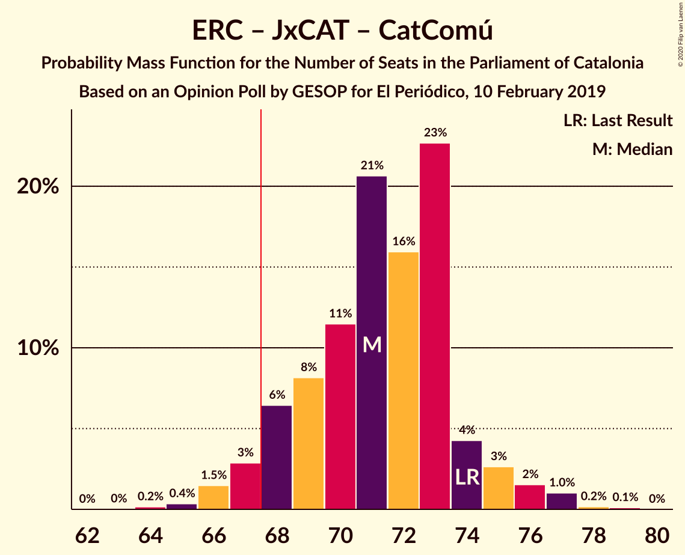
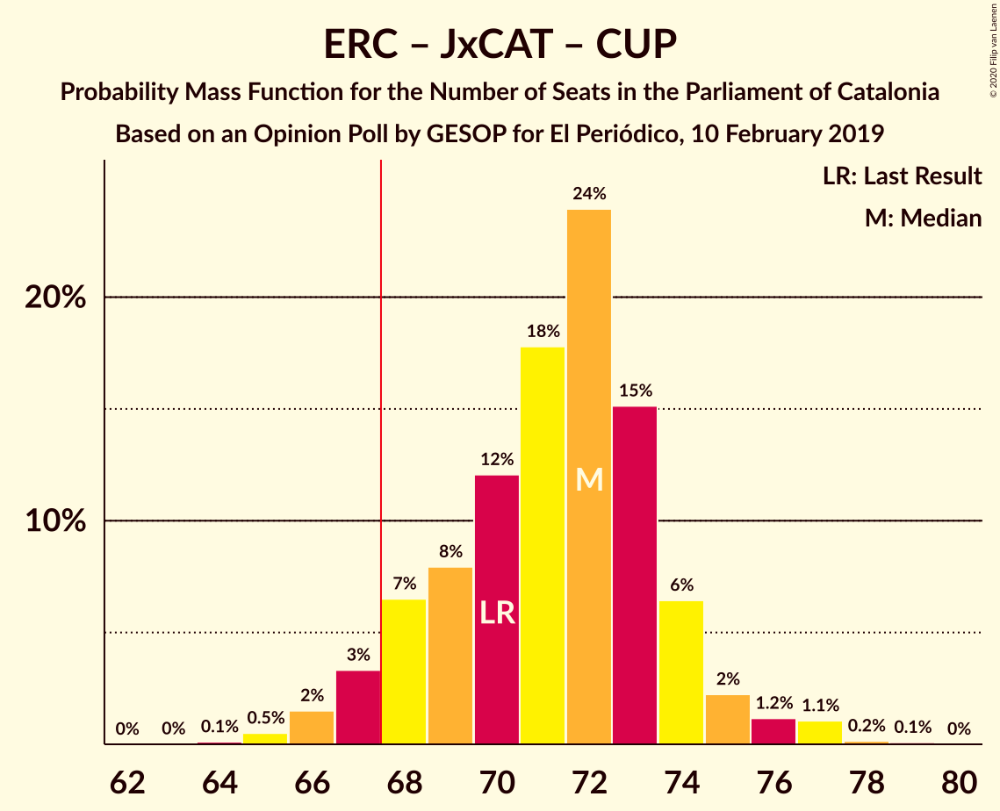
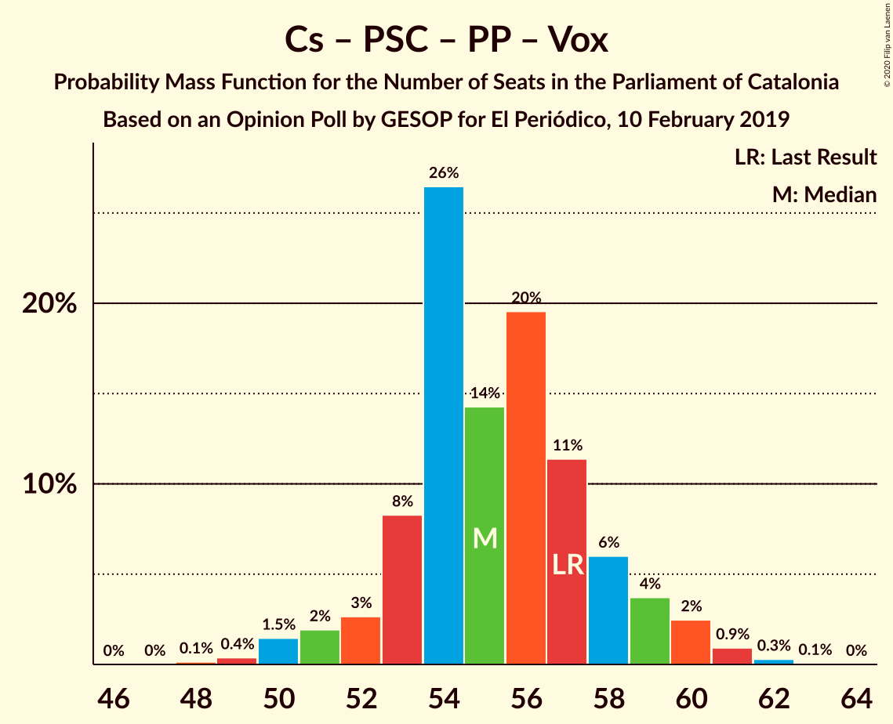

# Opinion Poll by GESOP for El Periódico, 10 February 2019

<a href="#voting-intentions">Voting Intentions</a> | <a href="#seats">Seats</a> | <a href="#coalitions">Coalitions</a> | <a href="#technical-information">Technical Information</a>

## Voting Intentions

### Confidence Intervals

| Party | Last Result | Poll Result | 80% Confidence Interval | 90% Confidence Interval | 95% Confidence Interval | 99% Confidence Interval |
|:-----:|:-----------:|:-----------:|:-----------------------:|:-----------------------:|:-----------------------:|:-----------------------:|
| Esquerra Republicana–Catalunya Sí | 21.4% | 25.5% | 24.1–27.0% |23.7–27.4% |23.3–27.8% |22.6–28.5% |
| Ciutadans–Partido de la Ciudadanía | 25.4% | 21.5% | 20.2–23.0% |19.8–23.4% |19.5–23.7% |18.9–24.4% |
| Partit dels Socialistes de Catalunya (PSC-PSOE) | 13.9% | 15.5% | 14.4–16.8% |14.0–17.2% |13.8–17.5% |13.2–18.1% |
| Junts pel Catalunya | 21.7% | 15.0% | 13.8–16.2% |13.5–16.6% |13.2–16.9% |12.7–17.5% |
| Catalunya en Comú–Podem | 7.5% | 7.5% | 6.7–8.5% |6.4–8.7% |6.2–9.0% |5.9–9.4% |
| Candidatura d’Unitat Popular | 4.5% | 6.5% | 5.7–7.4% |5.5–7.6% |5.3–7.8% |5.0–8.3% |
| Partit Popular | 4.2% | 4.0% | 3.4–4.8% |3.3–5.0% |3.1–5.2% |2.9–5.5% |
| Vox | 0.0% | 2.5% | 2.1–3.1% |1.9–3.3% |1.8–3.5% |1.6–3.8% |

*Note:* The poll result column reflects the actual value used in the calculations. Published results may vary slightly, and in addition be rounded to fewer digits.

## Seats

### Confidence Intervals

| Party | Last Result | Median | 80% Confidence Interval | 90% Confidence Interval | 95% Confidence Interval | 99% Confidence Interval |
|:-----:|:-----------:|:------:|:-----------------------:|:-----------------------:|:-----------------------:|:-----------------------:|
| <a href="#esquerra-republicana–catalunya-sí">Esquerra Republicana–Catalunya Sí</a> | 32 | 40 | 37–41 |36–42 |35–42 |34–44 |
| <a href="#ciutadans–partido-de-la-ciudadanía">Ciutadans–Partido de la Ciudadanía</a> | 36 | 29 | 28–32 |27–34 |27–34 |26–35 |
| <a href="#partit-dels-socialistes-de-catalunya-(psc-psoe)">Partit dels Socialistes de Catalunya (PSC-PSOE)</a> | 17 | 22 | 19–23 |18–24 |17–24 |17–24 |
| <a href="#junts-pel-catalunya">Junts pel Catalunya</a> | 34 | 23 | 22–26 |21–27 |20–27 |20–28 |
| <a href="#catalunya-en-comú–podem">Catalunya en Comú–Podem</a> | 8 | 8 | 8–10 |7–10 |6–11 |5–12 |
| <a href="#candidatura-d’unitat-popular">Candidatura d’Unitat Popular</a> | 4 | 8 | 8–9 |8–9 |7–10 |6–11 |
| <a href="#partit-popular">Partit Popular</a> | 4 | 5 | 3–5 |3–6 |2–6 |2–7 |
| <a href="#vox">Vox</a> | 0 | 0 | 0–2 |0–3 |0–3 |0–3 |

### Esquerra Republicana–Catalunya Sí

*For a full overview of the results for this party, see the [Esquerra Republicana–Catalunya Sí](party-esquerrarepublicana–catalunyasí.html) page.*

| Number of Seats | Probability | Accumulated | Special Marks |
|:---------------:|:-----------:|:-----------:|:-------------:|
| 32 | 0% | 100% | Last Result |
| 33 | 0% | 100% |  |
| 34 | 0.9% | 100% |  |
| 35 | 2% | 99.0% |  |
| 36 | 4% | 97% |  |
| 37 | 15% | 93% |  |
| 38 | 5% | 78% |  |
| 39 | 17% | 73% |  |
| 40 | 37% | 56% | Median |
| 41 | 12% | 20% |  |
| 42 | 5% | 8% |  |
| 43 | 0.7% | 2% |  |
| 44 | 1.3% | 2% |  |
| 45 | 0.2% | 0.3% |  |
| 46 | 0% | 0% |  |

### Ciutadans–Partido de la Ciudadanía

*For a full overview of the results for this party, see the [Ciutadans–Partido de la Ciudadanía](party-ciutadans–partidodelaciudadanía.html) page.*

| Number of Seats | Probability | Accumulated | Special Marks |
|:---------------:|:-----------:|:-----------:|:-------------:|
| 26 | 0.6% | 100% |  |
| 27 | 5% | 99.4% |  |
| 28 | 9% | 94% |  |
| 29 | 37% | 86% | Median |
| 30 | 30% | 49% |  |
| 31 | 4% | 19% |  |
| 32 | 7% | 16% |  |
| 33 | 3% | 9% |  |
| 34 | 5% | 6% |  |
| 35 | 0.4% | 0.6% |  |
| 36 | 0.1% | 0.2% | Last Result |
| 37 | 0% | 0% |  |

### Partit dels Socialistes de Catalunya (PSC-PSOE)

*For a full overview of the results for this party, see the [Partit dels Socialistes de Catalunya (PSC-PSOE)](party-partitdelssocialistesdecatalunyapsc-psoe.html) page.*

| Number of Seats | Probability | Accumulated | Special Marks |
|:---------------:|:-----------:|:-----------:|:-------------:|
| 16 | 0.1% | 100% |  |
| 17 | 3% | 99.9% | Last Result |
| 18 | 5% | 97% |  |
| 19 | 10% | 92% |  |
| 20 | 15% | 82% |  |
| 21 | 9% | 67% |  |
| 22 | 38% | 58% | Median |
| 23 | 15% | 20% |  |
| 24 | 5% | 6% |  |
| 25 | 0.3% | 0.4% |  |
| 26 | 0% | 0% |  |

### Junts pel Catalunya

*For a full overview of the results for this party, see the [Junts pel Catalunya](party-juntspelcatalunya.html) page.*

| Number of Seats | Probability | Accumulated | Special Marks |
|:---------------:|:-----------:|:-----------:|:-------------:|
| 18 | 0.2% | 100% |  |
| 19 | 0.2% | 99.8% |  |
| 20 | 5% | 99.6% |  |
| 21 | 2% | 95% |  |
| 22 | 3% | 93% |  |
| 23 | 47% | 90% | Median |
| 24 | 27% | 43% |  |
| 25 | 6% | 16% |  |
| 26 | 4% | 10% |  |
| 27 | 6% | 6% |  |
| 28 | 0.4% | 0.6% |  |
| 29 | 0.2% | 0.2% |  |
| 30 | 0% | 0% |  |
| 31 | 0% | 0% |  |
| 32 | 0% | 0% |  |
| 33 | 0% | 0% |  |
| 34 | 0% | 0% | Last Result |

### Catalunya en Comú–Podem

*For a full overview of the results for this party, see the [Catalunya en Comú–Podem](party-catalunyaencomú–podem.html) page.*

| Number of Seats | Probability | Accumulated | Special Marks |
|:---------------:|:-----------:|:-----------:|:-------------:|
| 5 | 0.5% | 100% |  |
| 6 | 4% | 99.5% |  |
| 7 | 5% | 96% |  |
| 8 | 58% | 90% | Last Result, Median |
| 9 | 6% | 32% |  |
| 10 | 23% | 26% |  |
| 11 | 2% | 3% |  |
| 12 | 0.8% | 1.0% |  |
| 13 | 0.1% | 0.1% |  |
| 14 | 0% | 0% |  |

### Candidatura d’Unitat Popular

*For a full overview of the results for this party, see the [Candidatura d’Unitat Popular](party-candidaturad’unitatpopular.html) page.*

| Number of Seats | Probability | Accumulated | Special Marks |
|:---------------:|:-----------:|:-----------:|:-------------:|
| 4 | 0% | 100% | Last Result |
| 5 | 0% | 100% |  |
| 6 | 0.8% | 100% |  |
| 7 | 4% | 99.1% |  |
| 8 | 62% | 95% | Median |
| 9 | 29% | 33% |  |
| 10 | 2% | 4% |  |
| 11 | 1.3% | 1.3% |  |
| 12 | 0% | 0.1% |  |
| 13 | 0% | 0% |  |

### Partit Popular

*For a full overview of the results for this party, see the [Partit Popular](party-partitpopular.html) page.*

| Number of Seats | Probability | Accumulated | Special Marks |
|:---------------:|:-----------:|:-----------:|:-------------:|
| 0 | 0.4% | 100% |  |
| 1 | 0% | 99.6% |  |
| 2 | 3% | 99.6% |  |
| 3 | 42% | 96% |  |
| 4 | 3% | 54% | Last Result |
| 5 | 44% | 52% | Median |
| 6 | 7% | 8% |  |
| 7 | 0.9% | 0.9% |  |
| 8 | 0% | 0% |  |

### Vox

*For a full overview of the results for this party, see the [Vox](party-vox.html) page.*

| Number of Seats | Probability | Accumulated | Special Marks |
|:---------------:|:-----------:|:-----------:|:-------------:|
| 0 | 89% | 100% | Last Result, Median |
| 1 | 0% | 11% |  |
| 2 | 6% | 11% |  |
| 3 | 5% | 5% |  |
| 4 | 0.1% | 0.1% |  |
| 5 | 0% | 0% |  |

## Coalitions

### Confidence Intervals

| Coalition | Last Result | Median | Majority? | 80% Confidence Interval | 90% Confidence Interval | 95% Confidence Interval | 99% Confidence Interval |
|:---------:|:-----------:|:------:|:---------:|:-----------------------:|:-----------------------:|:-----------------------:|:-----------------------:|
| Esquerra Republicana–Catalunya Sí – Junts pel Catalunya – Catalunya en Comú–Podem | 74 | 71 | 94% | 68–73 | 67–75 | 67–77 | 66–77 |
| Esquerra Republicana–Catalunya Sí – Junts pel Catalunya – Candidatura d’Unitat Popular | 70 | 71 | 94% | 68–74 | 67–75 | 66–77 | 65–77 |
| Esquerra Republicana–Catalunya Sí – Partit dels Socialistes de Catalunya (PSC-PSOE) – Catalunya en Comú–Podem | 57 | 70 | 78% | 66–71 | 65–72 | 65–72 | 62–73 |
| Ciutadans–Partido de la Ciudadanía – Partit dels Socialistes de Catalunya (PSC-PSOE) – Catalunya en Comú–Podem – Partit Popular | 65 | 64 | 5% | 61–66 | 59–67 | 58–69 | 58–69 |
| Esquerra Republicana–Catalunya Sí – Junts pel Catalunya | 66 | 63 | 3% | 60–65 | 58–66 | 58–69 | 57–69 |
| Ciutadans–Partido de la Ciudadanía – Partit dels Socialistes de Catalunya (PSC-PSOE) – Partit Popular – Vox | 57 | 56 | 0% | 53–58 | 51–59 | 50–60 | 50–60 |
| Ciutadans–Partido de la Ciudadanía – Partit dels Socialistes de Catalunya (PSC-PSOE) – Partit Popular | 57 | 56 | 0% | 52–57 | 51–59 | 50–59 | 49–60 |
| Esquerra Republicana–Catalunya Sí – Catalunya en Comú–Podem | 40 | 48 | 0% | 45–50 | 43–50 | 43–52 | 43–53 |

### Esquerra Republicana–Catalunya Sí – Junts pel Catalunya – Catalunya en Comú–Podem

| Number of Seats | Probability | Accumulated | Special Marks |
|:---------------:|:-----------:|:-----------:|:-------------:|
| 64 | 0% | 100% |  |
| 65 | 0.2% | 99.9% |  |
| 66 | 2% | 99.7% |  |
| 67 | 4% | 98% |  |
| 68 | 5% | 94% | Majority |
| 69 | 4% | 89% |  |
| 70 | 8% | 85% |  |
| 71 | 43% | 77% | Median |
| 72 | 4% | 34% |  |
| 73 | 21% | 30% |  |
| 74 | 3% | 9% | Last Result |
| 75 | 1.2% | 6% |  |
| 76 | 2% | 5% |  |
| 77 | 3% | 3% |  |
| 78 | 0.2% | 0.3% |  |
| 79 | 0.1% | 0.1% |  |
| 80 | 0% | 0% |  |

### Esquerra Republicana–Catalunya Sí – Junts pel Catalunya – Candidatura d’Unitat Popular

| Number of Seats | Probability | Accumulated | Special Marks |
|:---------------:|:-----------:|:-----------:|:-------------:|
| 64 | 0% | 100% |  |
| 65 | 0.5% | 99.9% |  |
| 66 | 3% | 99.4% |  |
| 67 | 3% | 97% |  |
| 68 | 4% | 94% | Majority |
| 69 | 10% | 90% |  |
| 70 | 5% | 80% | Last Result |
| 71 | 39% | 75% | Median |
| 72 | 16% | 36% |  |
| 73 | 8% | 19% |  |
| 74 | 5% | 12% |  |
| 75 | 2% | 6% |  |
| 76 | 1.3% | 4% |  |
| 77 | 3% | 3% |  |
| 78 | 0.1% | 0.2% |  |
| 79 | 0.1% | 0.1% |  |
| 80 | 0% | 0% |  |

### Esquerra Republicana–Catalunya Sí – Partit dels Socialistes de Catalunya (PSC-PSOE) – Catalunya en Comú–Podem

| Number of Seats | Probability | Accumulated | Special Marks |
|:---------------:|:-----------:|:-----------:|:-------------:|
| 57 | 0% | 100% | Last Result |
| 58 | 0% | 100% |  |
| 59 | 0% | 100% |  |
| 60 | 0% | 100% |  |
| 61 | 0.1% | 100% |  |
| 62 | 0.4% | 99.8% |  |
| 63 | 0.5% | 99.5% |  |
| 64 | 1.5% | 99.0% |  |
| 65 | 3% | 98% |  |
| 66 | 10% | 95% |  |
| 67 | 6% | 84% |  |
| 68 | 11% | 78% | Majority |
| 69 | 12% | 67% |  |
| 70 | 43% | 55% | Median |
| 71 | 5% | 12% |  |
| 72 | 4% | 6% |  |
| 73 | 2% | 2% |  |
| 74 | 0.3% | 0.4% |  |
| 75 | 0.1% | 0.1% |  |
| 76 | 0% | 0% |  |

### Ciutadans–Partido de la Ciudadanía – Partit dels Socialistes de Catalunya (PSC-PSOE) – Catalunya en Comú–Podem – Partit Popular

| Number of Seats | Probability | Accumulated | Special Marks |
|:---------------:|:-----------:|:-----------:|:-------------:|
| 56 | 0.1% | 100% |  |
| 57 | 0.2% | 99.9% |  |
| 58 | 3% | 99.7% |  |
| 59 | 3% | 97% |  |
| 60 | 2% | 94% |  |
| 61 | 6% | 92% |  |
| 62 | 9% | 86% |  |
| 63 | 18% | 77% |  |
| 64 | 39% | 60% | Median |
| 65 | 4% | 21% | Last Result |
| 66 | 9% | 16% |  |
| 67 | 3% | 8% |  |
| 68 | 2% | 5% | Majority |
| 69 | 3% | 3% |  |
| 70 | 0% | 0.1% |  |
| 71 | 0% | 0.1% |  |
| 72 | 0% | 0% |  |

### Esquerra Republicana–Catalunya Sí – Junts pel Catalunya

| Number of Seats | Probability | Accumulated | Special Marks |
|:---------------:|:-----------:|:-----------:|:-------------:|
| 55 | 0.1% | 100% |  |
| 56 | 0% | 99.9% |  |
| 57 | 2% | 99.9% |  |
| 58 | 4% | 98% |  |
| 59 | 1.2% | 94% |  |
| 60 | 4% | 93% |  |
| 61 | 10% | 89% |  |
| 62 | 11% | 79% |  |
| 63 | 44% | 69% | Median |
| 64 | 7% | 25% |  |
| 65 | 11% | 18% |  |
| 66 | 2% | 7% | Last Result |
| 67 | 1.4% | 5% |  |
| 68 | 0.5% | 3% | Majority |
| 69 | 3% | 3% |  |
| 70 | 0.1% | 0.1% |  |
| 71 | 0.1% | 0.1% |  |
| 72 | 0% | 0% |  |

### Ciutadans–Partido de la Ciudadanía – Partit dels Socialistes de Catalunya (PSC-PSOE) – Partit Popular – Vox

| Number of Seats | Probability | Accumulated | Special Marks |
|:---------------:|:-----------:|:-----------:|:-------------:|
| 48 | 0.1% | 100% |  |
| 49 | 0.2% | 99.9% |  |
| 50 | 3% | 99.7% |  |
| 51 | 2% | 96% |  |
| 52 | 2% | 94% |  |
| 53 | 14% | 92% |  |
| 54 | 9% | 78% |  |
| 55 | 6% | 69% |  |
| 56 | 43% | 63% | Median |
| 57 | 6% | 20% | Last Result |
| 58 | 7% | 14% |  |
| 59 | 4% | 8% |  |
| 60 | 3% | 3% |  |
| 61 | 0.3% | 0.4% |  |
| 62 | 0.1% | 0.1% |  |
| 63 | 0% | 0.1% |  |
| 64 | 0% | 0% |  |

### Ciutadans–Partido de la Ciudadanía – Partit dels Socialistes de Catalunya (PSC-PSOE) – Partit Popular

| Number of Seats | Probability | Accumulated | Special Marks |
|:---------------:|:-----------:|:-----------:|:-------------:|
| 48 | 0.1% | 100% |  |
| 49 | 0.4% | 99.9% |  |
| 50 | 4% | 99.4% |  |
| 51 | 3% | 96% |  |
| 52 | 3% | 93% |  |
| 53 | 14% | 89% |  |
| 54 | 9% | 75% |  |
| 55 | 8% | 66% |  |
| 56 | 43% | 59% | Median |
| 57 | 6% | 16% | Last Result |
| 58 | 4% | 10% |  |
| 59 | 3% | 6% |  |
| 60 | 2% | 2% |  |
| 61 | 0.2% | 0.3% |  |
| 62 | 0.1% | 0.1% |  |
| 63 | 0% | 0% |  |

### Esquerra Republicana–Catalunya Sí – Catalunya en Comú–Podem

| Number of Seats | Probability | Accumulated | Special Marks |
|:---------------:|:-----------:|:-----------:|:-------------:|
| 40 | 0% | 100% | Last Result |
| 41 | 0% | 100% |  |
| 42 | 0.3% | 99.9% |  |
| 43 | 6% | 99.6% |  |
| 44 | 3% | 94% |  |
| 45 | 2% | 91% |  |
| 46 | 7% | 89% |  |
| 47 | 15% | 82% |  |
| 48 | 36% | 68% | Median |
| 49 | 21% | 32% |  |
| 50 | 8% | 11% |  |
| 51 | 0.7% | 3% |  |
| 52 | 1.5% | 3% |  |
| 53 | 0.8% | 1.2% |  |
| 54 | 0.3% | 0.4% |  |
| 55 | 0.1% | 0.1% |  |
| 56 | 0% | 0% |  |

## Technical Information

### Opinion Poll

+ **Polling firm:** GESOP
+ **Commissioner(s):** El Periódico
+ **Fieldwork period:** 10 February 2019

### Calculations

+ **Sample size:** 1468
+ **Simulations done:** 131,072
+ **Error estimate:** 1.07%

