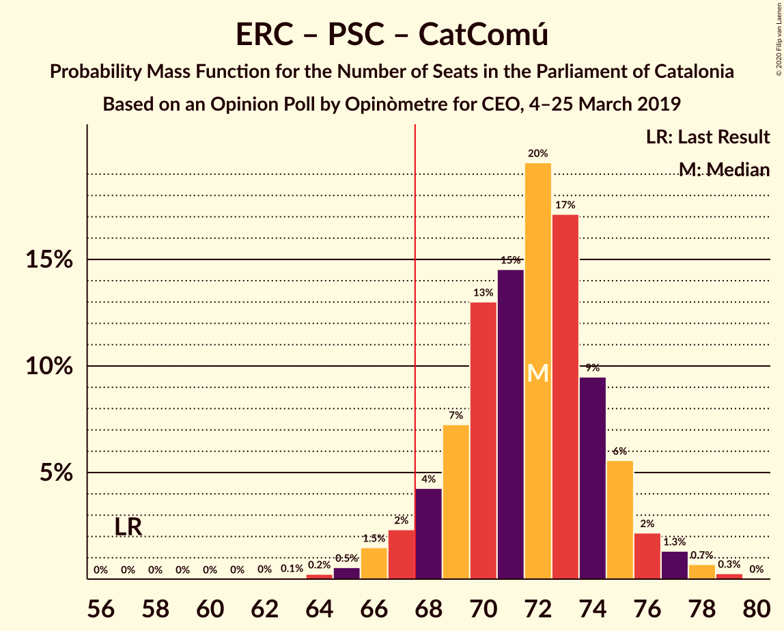
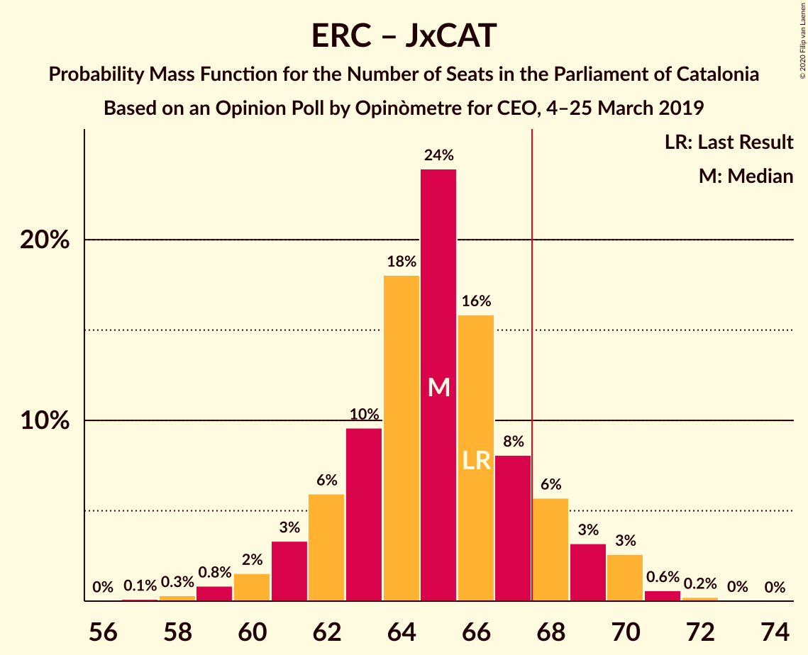
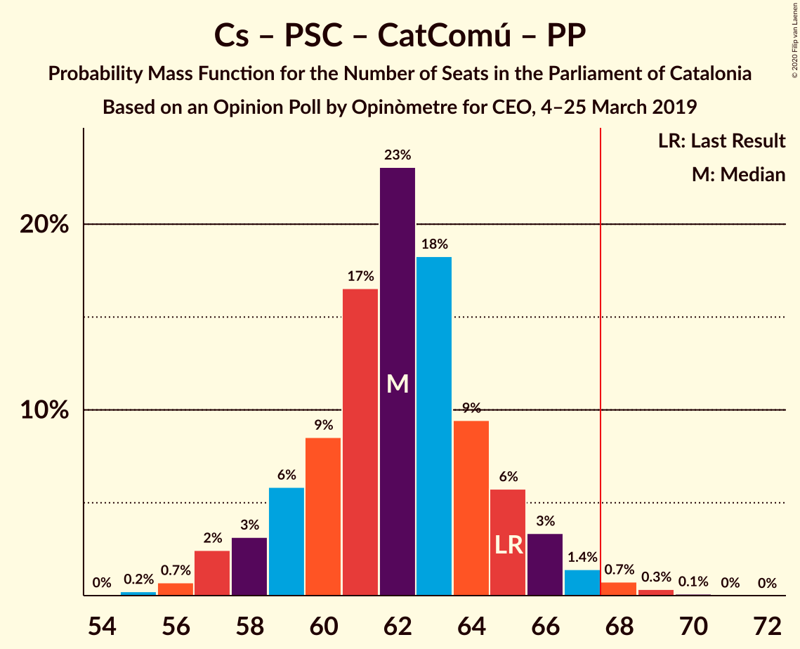
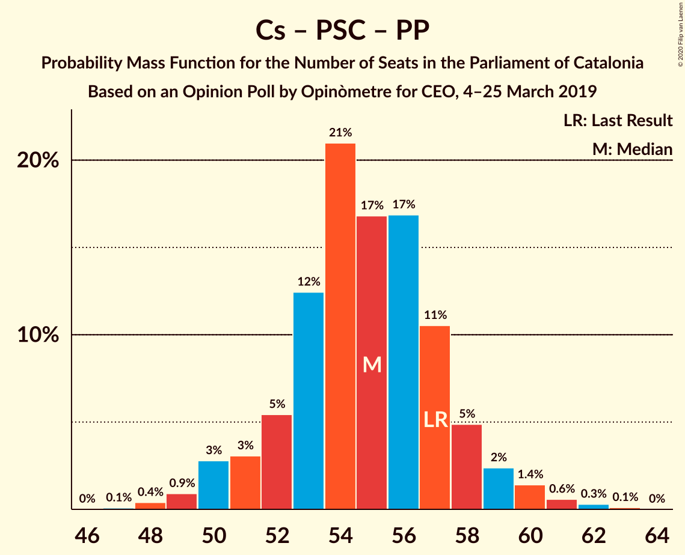

# Opinion Poll by Opinòmetre for CEO, 4–25 March 2019

<a href="#voting-intentions">Voting Intentions</a> | <a href="#seats">Seats</a> | <a href="#coalitions">Coalitions</a> | <a href="#technical-information">Technical Information</a>

## Voting Intentions

### Confidence Intervals

| Party | Last Result | Poll Result | 80% Confidence Interval | 90% Confidence Interval | 95% Confidence Interval | 99% Confidence Interval |
|:-----:|:-----------:|:-----------:|:-----------------------:|:-----------------------:|:-----------------------:|:-----------------------:|
| Esquerra Republicana–Catalunya Sí | 21.4% | 28.1% | 26.4–29.9% |25.9–30.5% |25.5–30.9% |24.6–31.8% |
| Ciutadans–Partido de la Ciudadanía | 25.4% | 21.6% | 20.0–23.3% |19.6–23.8% |19.2–24.2% |18.5–25.0% |
| Partit dels Socialistes de Catalunya (PSC-PSOE) | 13.9% | 16.5% | 15.1–18.0% |14.7–18.5% |14.3–18.9% |13.7–19.6% |
| Junts pel Catalunya | 21.7% | 14.9% | 13.5–16.4% |13.2–16.8% |12.8–17.1% |12.2–17.9% |
| Catalunya en Comú–Podem | 7.5% | 7.0% | 6.1–8.2% |5.9–8.5% |5.6–8.8% |5.2–9.3% |
| Candidatura d’Unitat Popular | 4.5% | 6.5% | 5.6–7.6% |5.3–7.9% |5.1–8.1% |4.7–8.7% |
| Partit Popular | 4.2% | 4.0% | 3.3–4.9% |3.1–5.2% |3.0–5.4% |2.7–5.8% |

*Note:* The poll result column reflects the actual value used in the calculations. Published results may vary slightly, and in addition be rounded to fewer digits.

## Seats

### Confidence Intervals

| Party | Last Result | Median | 80% Confidence Interval | 90% Confidence Interval | 95% Confidence Interval | 99% Confidence Interval |
|:-----:|:-----------:|:------:|:-----------------------:|:-----------------------:|:-----------------------:|:-----------------------:|
| <a href="#esquerra-republicana–catalunya-sí">Esquerra Republicana–Catalunya Sí</a> | 32 | 42 | 40–46 |39–46 |38–46 |36–48 |
| <a href="#ciutadans–partido-de-la-ciudadanía">Ciutadans–Partido de la Ciudadanía</a> | 36 | 28 | 27–30 |27–32 |26–33 |25–35 |
| <a href="#partit-dels-socialistes-de-catalunya-(psc-psoe)">Partit dels Socialistes de Catalunya (PSC-PSOE)</a> | 17 | 23 | 20–24 |19–25 |17–25 |17–26 |
| <a href="#junts-pel-catalunya">Junts pel Catalunya</a> | 34 | 23 | 20–25 |20–26 |19–26 |18–27 |
| <a href="#catalunya-en-comú–podem">Catalunya en Comú–Podem</a> | 8 | 7 | 5–8 |5–9 |5–10 |5–11 |
| <a href="#candidatura-d’unitat-popular">Candidatura d’Unitat Popular</a> | 4 | 8 | 7–9 |7–9 |6–10 |5–11 |
| <a href="#partit-popular">Partit Popular</a> | 4 | 3 | 3–6 |2–6 |2–6 |0–7 |

### Esquerra Republicana–Catalunya Sí

*For a full overview of the results for this party, see the [Esquerra Republicana–Catalunya Sí](party-esquerrarepublicana–catalunyasí.html) page.*

| Number of Seats | Probability | Accumulated | Special Marks |
|:---------------:|:-----------:|:-----------:|:-------------:|
| 32 | 0% | 100% | Last Result |
| 33 | 0% | 100% |  |
| 34 | 0% | 100% |  |
| 35 | 0.1% | 100% |  |
| 36 | 0.4% | 99.9% |  |
| 37 | 1.2% | 99.5% |  |
| 38 | 2% | 98% |  |
| 39 | 6% | 96% |  |
| 40 | 7% | 91% |  |
| 41 | 24% | 84% |  |
| 42 | 25% | 59% | Median |
| 43 | 8% | 34% |  |
| 44 | 8% | 26% |  |
| 45 | 8% | 19% |  |
| 46 | 8% | 10% |  |
| 47 | 1.5% | 2% |  |
| 48 | 0.6% | 0.7% |  |
| 49 | 0.1% | 0.2% |  |
| 50 | 0% | 0% |  |

### Ciutadans–Partido de la Ciudadanía

*For a full overview of the results for this party, see the [Ciutadans–Partido de la Ciudadanía](party-ciutadans–partidodelaciudadanía.html) page.*

| Number of Seats | Probability | Accumulated | Special Marks |
|:---------------:|:-----------:|:-----------:|:-------------:|
| 24 | 0.2% | 100% |  |
| 25 | 0.5% | 99.8% |  |
| 26 | 3% | 99.3% |  |
| 27 | 29% | 96% |  |
| 28 | 17% | 67% | Median |
| 29 | 12% | 50% |  |
| 30 | 28% | 37% |  |
| 31 | 2% | 9% |  |
| 32 | 3% | 7% |  |
| 33 | 2% | 4% |  |
| 34 | 2% | 2% |  |
| 35 | 0.3% | 0.6% |  |
| 36 | 0.3% | 0.3% | Last Result |
| 37 | 0% | 0% |  |

### Partit dels Socialistes de Catalunya (PSC-PSOE)

*For a full overview of the results for this party, see the [Partit dels Socialistes de Catalunya (PSC-PSOE)](party-partitdelssocialistesdecatalunyapsc-psoe.html) page.*

| Number of Seats | Probability | Accumulated | Special Marks |
|:---------------:|:-----------:|:-----------:|:-------------:|
| 16 | 0.2% | 100% |  |
| 17 | 2% | 99.8% | Last Result |
| 18 | 2% | 97% |  |
| 19 | 3% | 95% |  |
| 20 | 16% | 92% |  |
| 21 | 13% | 77% |  |
| 22 | 10% | 64% |  |
| 23 | 29% | 54% | Median |
| 24 | 18% | 25% |  |
| 25 | 7% | 7% |  |
| 26 | 0.5% | 0.6% |  |
| 27 | 0% | 0% |  |

### Junts pel Catalunya

*For a full overview of the results for this party, see the [Junts pel Catalunya](party-juntspelcatalunya.html) page.*

| Number of Seats | Probability | Accumulated | Special Marks |
|:---------------:|:-----------:|:-----------:|:-------------:|
| 17 | 0.1% | 100% |  |
| 18 | 2% | 99.9% |  |
| 19 | 2% | 98% |  |
| 20 | 11% | 96% |  |
| 21 | 7% | 85% |  |
| 22 | 4% | 78% |  |
| 23 | 38% | 75% | Median |
| 24 | 25% | 37% |  |
| 25 | 6% | 12% |  |
| 26 | 5% | 7% |  |
| 27 | 1.4% | 2% |  |
| 28 | 0.2% | 0.4% |  |
| 29 | 0.2% | 0.2% |  |
| 30 | 0% | 0% |  |
| 31 | 0% | 0% |  |
| 32 | 0% | 0% |  |
| 33 | 0% | 0% |  |
| 34 | 0% | 0% | Last Result |

### Catalunya en Comú–Podem

*For a full overview of the results for this party, see the [Catalunya en Comú–Podem](party-catalunyaencomú–podem.html) page.*

| Number of Seats | Probability | Accumulated | Special Marks |
|:---------------:|:-----------:|:-----------:|:-------------:|
| 4 | 0.2% | 100% |  |
| 5 | 12% | 99.8% |  |
| 6 | 21% | 87% |  |
| 7 | 20% | 67% | Median |
| 8 | 40% | 47% | Last Result |
| 9 | 4% | 7% |  |
| 10 | 2% | 3% |  |
| 11 | 0.7% | 0.7% |  |
| 12 | 0% | 0.1% |  |
| 13 | 0% | 0% |  |

### Candidatura d’Unitat Popular

*For a full overview of the results for this party, see the [Candidatura d’Unitat Popular](party-candidaturad’unitatpopular.html) page.*

| Number of Seats | Probability | Accumulated | Special Marks |
|:---------------:|:-----------:|:-----------:|:-------------:|
| 4 | 0.5% | 100% | Last Result |
| 5 | 0.1% | 99.5% |  |
| 6 | 4% | 99.4% |  |
| 7 | 8% | 95% |  |
| 8 | 60% | 88% | Median |
| 9 | 24% | 28% |  |
| 10 | 2% | 4% |  |
| 11 | 1.0% | 1.3% |  |
| 12 | 0.1% | 0.2% |  |
| 13 | 0.1% | 0.1% |  |
| 14 | 0% | 0% |  |

### Partit Popular

*For a full overview of the results for this party, see the [Partit Popular](party-partitpopular.html) page.*

| Number of Seats | Probability | Accumulated | Special Marks |
|:---------------:|:-----------:|:-----------:|:-------------:|
| 0 | 2% | 100% |  |
| 1 | 0% | 98% |  |
| 2 | 4% | 98% |  |
| 3 | 56% | 94% | Median |
| 4 | 7% | 39% | Last Result |
| 5 | 20% | 32% |  |
| 6 | 10% | 12% |  |
| 7 | 2% | 2% |  |
| 8 | 0% | 0% |  |

## Coalitions

### Confidence Intervals

| Coalition | Last Result | Median | Majority? | 80% Confidence Interval | 90% Confidence Interval | 95% Confidence Interval | 99% Confidence Interval |
|:---------:|:-----------:|:------:|:---------:|:-----------------------:|:-----------------------:|:-----------------------:|:-----------------------:|
| Esquerra Republicana–Catalunya Sí – Junts pel Catalunya – Candidatura d’Unitat Popular | 70 | 73 | 98.8% | 70–77 | 69–78 | 68–78 | 67–79 |
| Esquerra Republicana–Catalunya Sí – Junts pel Catalunya – Catalunya en Comú–Podem | 74 | 72 | 98% | 70–75 | 69–77 | 68–77 | 66–78 |
| Esquerra Republicana–Catalunya Sí – Partit dels Socialistes de Catalunya (PSC-PSOE) – Catalunya en Comú–Podem | 57 | 71 | 95% | 68–74 | 67–76 | 67–76 | 65–78 |
| Esquerra Republicana–Catalunya Sí – Junts pel Catalunya | 66 | 65 | 13% | 62–69 | 62–70 | 60–70 | 59–71 |
| Ciutadans–Partido de la Ciudadanía – Partit dels Socialistes de Catalunya (PSC-PSOE) – Catalunya en Comú–Podem – Partit Popular | 65 | 62 | 1.2% | 58–65 | 57–66 | 57–67 | 56–68 |
| Ciutadans–Partido de la Ciudadanía – Partit dels Socialistes de Catalunya (PSC-PSOE) – Partit Popular | 57 | 54 | 0% | 52–57 | 50–58 | 50–59 | 48–61 |
| Esquerra Republicana–Catalunya Sí – Catalunya en Comú–Podem | 40 | 49 | 0% | 47–53 | 46–53 | 45–54 | 44–56 |

### Esquerra Republicana–Catalunya Sí – Junts pel Catalunya – Candidatura d’Unitat Popular

| Number of Seats | Probability | Accumulated | Special Marks |
|:---------------:|:-----------:|:-----------:|:-------------:|
| 64 | 0.1% | 100% |  |
| 65 | 0.1% | 99.9% |  |
| 66 | 0.3% | 99.8% |  |
| 67 | 0.7% | 99.5% |  |
| 68 | 1.4% | 98.8% | Majority |
| 69 | 3% | 97% |  |
| 70 | 7% | 95% | Last Result |
| 71 | 7% | 88% |  |
| 72 | 13% | 81% |  |
| 73 | 26% | 68% | Median |
| 74 | 18% | 42% |  |
| 75 | 10% | 24% |  |
| 76 | 4% | 14% |  |
| 77 | 4% | 10% |  |
| 78 | 6% | 7% |  |
| 79 | 0.8% | 1.1% |  |
| 80 | 0.2% | 0.2% |  |
| 81 | 0% | 0% |  |

### Esquerra Republicana–Catalunya Sí – Junts pel Catalunya – Catalunya en Comú–Podem

| Number of Seats | Probability | Accumulated | Special Marks |
|:---------------:|:-----------:|:-----------:|:-------------:|
| 64 | 0.1% | 100% |  |
| 65 | 0.2% | 99.9% |  |
| 66 | 0.7% | 99.7% |  |
| 67 | 1.0% | 98.9% |  |
| 68 | 3% | 98% | Majority |
| 69 | 4% | 95% |  |
| 70 | 14% | 91% |  |
| 71 | 20% | 77% |  |
| 72 | 11% | 57% | Median |
| 73 | 21% | 46% |  |
| 74 | 11% | 25% | Last Result |
| 75 | 5% | 15% |  |
| 76 | 1.2% | 9% |  |
| 77 | 6% | 8% |  |
| 78 | 1.2% | 2% |  |
| 79 | 0.3% | 0.5% |  |
| 80 | 0.2% | 0.2% |  |
| 81 | 0% | 0% |  |

### Esquerra Republicana–Catalunya Sí – Partit dels Socialistes de Catalunya (PSC-PSOE) – Catalunya en Comú–Podem

| Number of Seats | Probability | Accumulated | Special Marks |
|:---------------:|:-----------:|:-----------:|:-------------:|
| 57 | 0% | 100% | Last Result |
| 58 | 0% | 100% |  |
| 59 | 0% | 100% |  |
| 60 | 0% | 100% |  |
| 61 | 0% | 100% |  |
| 62 | 0% | 100% |  |
| 63 | 0.1% | 100% |  |
| 64 | 0.3% | 99.9% |  |
| 65 | 0.6% | 99.6% |  |
| 66 | 1.3% | 99.0% |  |
| 67 | 3% | 98% |  |
| 68 | 6% | 95% | Majority |
| 69 | 9% | 89% |  |
| 70 | 17% | 80% |  |
| 71 | 14% | 62% |  |
| 72 | 10% | 49% | Median |
| 73 | 20% | 39% |  |
| 74 | 10% | 19% |  |
| 75 | 3% | 9% |  |
| 76 | 4% | 6% |  |
| 77 | 1.0% | 2% |  |
| 78 | 0.6% | 0.9% |  |
| 79 | 0.3% | 0.3% |  |
| 80 | 0% | 0% |  |

### Esquerra Republicana–Catalunya Sí – Junts pel Catalunya

| Number of Seats | Probability | Accumulated | Special Marks |
|:---------------:|:-----------:|:-----------:|:-------------:|
| 57 | 0.1% | 100% |  |
| 58 | 0.3% | 99.8% |  |
| 59 | 0.8% | 99.5% |  |
| 60 | 2% | 98.7% |  |
| 61 | 2% | 97% |  |
| 62 | 6% | 95% |  |
| 63 | 12% | 89% |  |
| 64 | 19% | 77% |  |
| 65 | 19% | 59% | Median |
| 66 | 16% | 40% | Last Result |
| 67 | 11% | 24% |  |
| 68 | 2% | 13% | Majority |
| 69 | 4% | 11% |  |
| 70 | 5% | 7% |  |
| 71 | 0.8% | 1.2% |  |
| 72 | 0.3% | 0.4% |  |
| 73 | 0.1% | 0.1% |  |
| 74 | 0% | 0% |  |

### Ciutadans–Partido de la Ciudadanía – Partit dels Socialistes de Catalunya (PSC-PSOE) – Catalunya en Comú–Podem – Partit Popular

| Number of Seats | Probability | Accumulated | Special Marks |
|:---------------:|:-----------:|:-----------:|:-------------:|
| 55 | 0.2% | 100% |  |
| 56 | 0.8% | 99.8% |  |
| 57 | 6% | 98.9% |  |
| 58 | 4% | 93% |  |
| 59 | 4% | 90% |  |
| 60 | 10% | 86% |  |
| 61 | 18% | 76% | Median |
| 62 | 26% | 58% |  |
| 63 | 13% | 32% |  |
| 64 | 7% | 19% |  |
| 65 | 7% | 12% | Last Result |
| 66 | 3% | 5% |  |
| 67 | 1.4% | 3% |  |
| 68 | 0.7% | 1.2% | Majority |
| 69 | 0.3% | 0.5% |  |
| 70 | 0.1% | 0.2% |  |
| 71 | 0.1% | 0.1% |  |
| 72 | 0% | 0% |  |

### Ciutadans–Partido de la Ciudadanía – Partit dels Socialistes de Catalunya (PSC-PSOE) – Partit Popular

| Number of Seats | Probability | Accumulated | Special Marks |
|:---------------:|:-----------:|:-----------:|:-------------:|
| 47 | 0.1% | 100% |  |
| 48 | 0.5% | 99.9% |  |
| 49 | 1.0% | 99.4% |  |
| 50 | 6% | 98% |  |
| 51 | 2% | 92% |  |
| 52 | 6% | 90% |  |
| 53 | 10% | 84% |  |
| 54 | 24% | 74% | Median |
| 55 | 11% | 49% |  |
| 56 | 16% | 38% |  |
| 57 | 14% | 22% | Last Result |
| 58 | 4% | 7% |  |
| 59 | 2% | 4% |  |
| 60 | 1.4% | 2% |  |
| 61 | 0.6% | 0.9% |  |
| 62 | 0.1% | 0.2% |  |
| 63 | 0.1% | 0.1% |  |
| 64 | 0% | 0% |  |

### Esquerra Republicana–Catalunya Sí – Catalunya en Comú–Podem

| Number of Seats | Probability | Accumulated | Special Marks |
|:---------------:|:-----------:|:-----------:|:-------------:|
| 40 | 0% | 100% | Last Result |
| 41 | 0% | 100% |  |
| 42 | 0.2% | 100% |  |
| 43 | 0.3% | 99.8% |  |
| 44 | 0.6% | 99.5% |  |
| 45 | 3% | 98.9% |  |
| 46 | 5% | 96% |  |
| 47 | 16% | 91% |  |
| 48 | 10% | 74% |  |
| 49 | 16% | 64% | Median |
| 50 | 23% | 48% |  |
| 51 | 8% | 25% |  |
| 52 | 3% | 17% |  |
| 53 | 10% | 14% |  |
| 54 | 2% | 4% |  |
| 55 | 0.8% | 2% |  |
| 56 | 0.6% | 0.7% |  |
| 57 | 0.1% | 0.1% |  |
| 58 | 0% | 0% |  |

## Technical Information

### Opinion Poll

+ **Polling firm:** Opinòmetre
+ **Commissioner(s):** CEO
+ **Fieldwork period:** 4–25 March 2019

### Calculations

+ **Sample size:** 1050
+ **Simulations done:** 131,072
+ **Error estimate:** 1.40%

