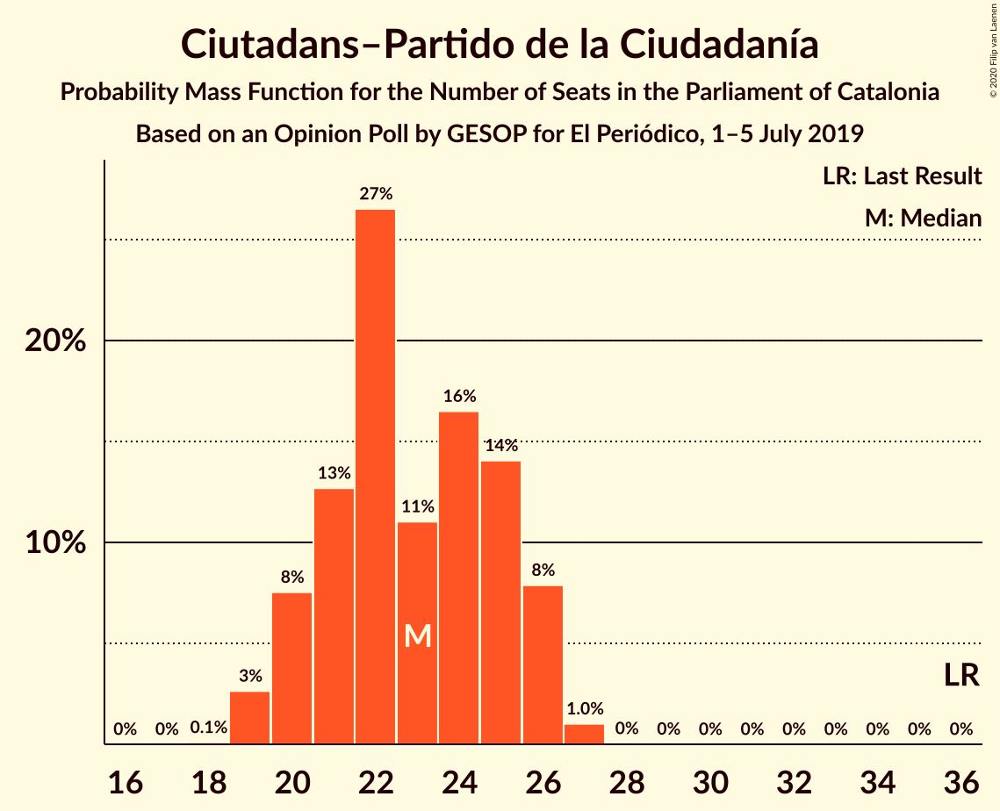

# Opinion Poll by GESOP for El Periódico, 1–5 July 2019

<a href="#voting-intentions">Voting Intentions</a> | <a href="#seats">Seats</a> | <a href="#coalitions">Coalitions</a> | <a href="#technical-information">Technical Information</a>

## Voting Intentions

### Confidence Intervals

| Party | Last Result | Poll Result | 80% Confidence Interval | 90% Confidence Interval | 95% Confidence Interval | 99% Confidence Interval |
|:-----:|:-----------:|:-----------:|:-----------------------:|:-----------------------:|:-----------------------:|:-----------------------:|
| Esquerra Republicana–Catalunya Sí | 21.4% | 26.5% | 25.0–28.1% |24.6–28.5% |24.3–28.9% |23.6–29.6% |
| Partit dels Socialistes de Catalunya (PSC-PSOE) | 13.9% | 20.0% | 18.7–21.4% |18.3–21.8% |18.0–22.1% |17.4–22.8% |
| Ciutadans–Partido de la Ciudadanía | 25.4% | 16.5% | 15.3–17.8% |15.0–18.2% |14.7–18.5% |14.1–19.2% |
| Junts per Catalunya | 21.7% | 16.5% | 15.3–17.8% |15.0–18.2% |14.7–18.5% |14.1–19.2% |
| Catalunya en Comú–Podem | 7.5% | 7.0% | 6.2–8.0% |6.0–8.2% |5.8–8.5% |5.4–9.0% |
| Candidatura d’Unitat Popular | 4.5% | 5.5% | 4.8–6.3% |4.6–6.6% |4.4–6.8% |4.1–7.2% |
| Partit Popular | 4.2% | 4.0% | 3.4–4.8% |3.2–5.0% |3.1–5.2% |2.8–5.5% |

*Note:* The poll result column reflects the actual value used in the calculations. Published results may vary slightly, and in addition be rounded to fewer digits.

## Seats

### Confidence Intervals

| Party | Last Result | Median | 80% Confidence Interval | 90% Confidence Interval | 95% Confidence Interval | 99% Confidence Interval |
|:-----:|:-----------:|:------:|:-----------------------:|:-----------------------:|:-----------------------:|:-----------------------:|
| <a href="#esquerra-republicana–catalunya-sí">Esquerra Republicana–Catalunya Sí</a> | 32 | 41 | 38–43 |37–44 |37–44 |35–45 |
| <a href="#partit-dels-socialistes-de-catalunya-(psc-psoe)">Partit dels Socialistes de Catalunya (PSC-PSOE)</a> | 17 | 26 | 25–29 |25–30 |24–31 |24–31 |
| <a href="#ciutadans–partido-de-la-ciudadanía">Ciutadans–Partido de la Ciudadanía</a> | 36 | 23 | 20–25 |20–26 |19–26 |19–27 |
| <a href="#junts-per-catalunya">Junts per Catalunya</a> | 34 | 26 | 24–28 |23–29 |23–30 |23–31 |
| <a href="#catalunya-en-comú–podem">Catalunya en Comú–Podem</a> | 8 | 8 | 7–9 |6–10 |6–10 |5–11 |
| <a href="#candidatura-d’unitat-popular">Candidatura d’Unitat Popular</a> | 4 | 7 | 6–8 |6–8 |5–9 |4–9 |
| <a href="#partit-popular">Partit Popular</a> | 4 | 3 | 3–5 |3–6 |2–6 |0–7 |

### Esquerra Republicana–Catalunya Sí

*For a full overview of the results for this party, see the [Esquerra Republicana–Catalunya Sí](party-esquerrarepublicana–catalunyasí.html) page.*

| Number of Seats | Probability | Accumulated | Special Marks |
|:---------------:|:-----------:|:-----------:|:-------------:|
| 32 | 0% | 100% | Last Result |
| 33 | 0% | 100% |  |
| 34 | 0% | 100% |  |
| 35 | 0.7% | 100% |  |
| 36 | 1.4% | 99.2% |  |
| 37 | 4% | 98% |  |
| 38 | 7% | 94% |  |
| 39 | 16% | 87% |  |
| 40 | 13% | 71% |  |
| 41 | 30% | 58% | Median |
| 42 | 15% | 28% |  |
| 43 | 7% | 13% |  |
| 44 | 4% | 6% |  |
| 45 | 1.2% | 2% |  |
| 46 | 0.3% | 0.5% |  |
| 47 | 0.1% | 0.1% |  |
| 48 | 0% | 0% |  |

### Partit dels Socialistes de Catalunya (PSC-PSOE)

*For a full overview of the results for this party, see the [Partit dels Socialistes de Catalunya (PSC-PSOE)](party-partitdelssocialistesdecatalunyapsc-psoe.html) page.*

| Number of Seats | Probability | Accumulated | Special Marks |
|:---------------:|:-----------:|:-----------:|:-------------:|
| 17 | 0% | 100% | Last Result |
| 18 | 0% | 100% |  |
| 19 | 0% | 100% |  |
| 20 | 0% | 100% |  |
| 21 | 0% | 100% |  |
| 22 | 0% | 100% |  |
| 23 | 0.1% | 100% |  |
| 24 | 3% | 99.9% |  |
| 25 | 14% | 97% |  |
| 26 | 34% | 83% | Median |
| 27 | 24% | 48% |  |
| 28 | 9% | 25% |  |
| 29 | 7% | 16% |  |
| 30 | 6% | 9% |  |
| 31 | 2% | 3% |  |
| 32 | 0.3% | 0.4% |  |
| 33 | 0.1% | 0.1% |  |
| 34 | 0% | 0% |  |

### Ciutadans–Partido de la Ciudadanía

*For a full overview of the results for this party, see the [Ciutadans–Partido de la Ciudadanía](party-ciutadans–partidodelaciudadanía.html) page.*

| Number of Seats | Probability | Accumulated | Special Marks |
|:---------------:|:-----------:|:-----------:|:-------------:|
| 18 | 0.1% | 100% |  |
| 19 | 3% | 99.9% |  |
| 20 | 8% | 97% |  |
| 21 | 13% | 90% |  |
| 22 | 27% | 77% |  |
| 23 | 11% | 51% | Median |
| 24 | 16% | 40% |  |
| 25 | 14% | 23% |  |
| 26 | 8% | 9% |  |
| 27 | 1.0% | 1.1% |  |
| 28 | 0% | 0.1% |  |
| 29 | 0% | 0% |  |
| 30 | 0% | 0% |  |
| 31 | 0% | 0% |  |
| 32 | 0% | 0% |  |
| 33 | 0% | 0% |  |
| 34 | 0% | 0% |  |
| 35 | 0% | 0% |  |
| 36 | 0% | 0% | Last Result |

### Junts per Catalunya

*For a full overview of the results for this party, see the [Junts per Catalunya](party-juntspercatalunya.html) page.*

| Number of Seats | Probability | Accumulated | Special Marks |
|:---------------:|:-----------:|:-----------:|:-------------:|
| 21 | 0.1% | 100% |  |
| 22 | 0.2% | 99.9% |  |
| 23 | 5% | 99.7% |  |
| 24 | 11% | 95% |  |
| 25 | 21% | 84% |  |
| 26 | 39% | 63% | Median |
| 27 | 9% | 24% |  |
| 28 | 6% | 16% |  |
| 29 | 6% | 9% |  |
| 30 | 2% | 4% |  |
| 31 | 1.3% | 1.3% |  |
| 32 | 0.1% | 0.1% |  |
| 33 | 0% | 0% |  |
| 34 | 0% | 0% | Last Result |

### Catalunya en Comú–Podem

*For a full overview of the results for this party, see the [Catalunya en Comú–Podem](party-catalunyaencomú–podem.html) page.*

| Number of Seats | Probability | Accumulated | Special Marks |
|:---------------:|:-----------:|:-----------:|:-------------:|
| 5 | 2% | 100% |  |
| 6 | 7% | 98% |  |
| 7 | 23% | 90% |  |
| 8 | 52% | 68% | Last Result, Median |
| 9 | 9% | 16% |  |
| 10 | 6% | 7% |  |
| 11 | 1.1% | 1.1% |  |
| 12 | 0% | 0% |  |

### Candidatura d’Unitat Popular

*For a full overview of the results for this party, see the [Candidatura d’Unitat Popular](party-candidaturad’unitatpopular.html) page.*

| Number of Seats | Probability | Accumulated | Special Marks |
|:---------------:|:-----------:|:-----------:|:-------------:|
| 4 | 2% | 100% | Last Result |
| 5 | 2% | 98% |  |
| 6 | 11% | 95% |  |
| 7 | 39% | 84% | Median |
| 8 | 42% | 46% |  |
| 9 | 3% | 4% |  |
| 10 | 0.3% | 0.3% |  |
| 11 | 0% | 0% |  |

### Partit Popular

*For a full overview of the results for this party, see the [Partit Popular](party-partitpopular.html) page.*

| Number of Seats | Probability | Accumulated | Special Marks |
|:---------------:|:-----------:|:-----------:|:-------------:|
| 0 | 0.5% | 100% |  |
| 1 | 0% | 99.5% |  |
| 2 | 3% | 99.5% |  |
| 3 | 55% | 96% | Median |
| 4 | 8% | 41% | Last Result |
| 5 | 28% | 33% |  |
| 6 | 4% | 5% |  |
| 7 | 1.2% | 1.2% |  |
| 8 | 0% | 0% |  |

## Coalitions

### Confidence Intervals

| Coalition | Last Result | Median | Majority? | 80% Confidence Interval | 90% Confidence Interval | 95% Confidence Interval | 99% Confidence Interval |
|:---------:|:-----------:|:------:|:---------:|:-----------------------:|:-----------------------:|:-----------------------:|:-----------------------:|
| Esquerra Republicana–Catalunya Sí – Partit dels Socialistes de Catalunya (PSC-PSOE) – Catalunya en Comú–Podem | 57 | 75 | 100% | 72–78 | 71–79 | 71–79 | 69–81 |
| Esquerra Republicana–Catalunya Sí – Junts per Catalunya – Catalunya en Comú–Podem | 74 | 74 | 99.9% | 72–77 | 71–78 | 70–79 | 69–80 |
| Esquerra Republicana–Catalunya Sí – Junts per Catalunya – Candidatura d’Unitat Popular | 70 | 74 | 99.8% | 71–77 | 70–77 | 70–78 | 68–79 |
| Esquerra Republicana–Catalunya Sí – Junts per Catalunya | 66 | 66 | 29% | 64–69 | 63–70 | 63–71 | 61–72 |
| Partit dels Socialistes de Catalunya (PSC-PSOE) – Ciutadans–Partido de la Ciudadanía – Catalunya en Comú–Podem – Partit Popular | 65 | 61 | 0.2% | 58–64 | 58–65 | 57–65 | 56–67 |
| Partit dels Socialistes de Catalunya (PSC-PSOE) – Ciutadans–Partido de la Ciudadanía – Partit Popular | 57 | 53 | 0% | 51–56 | 50–57 | 49–58 | 48–59 |
| Esquerra Republicana–Catalunya Sí – Catalunya en Comú–Podem | 40 | 49 | 0% | 46–51 | 45–52 | 44–52 | 43–54 |

### Esquerra Republicana–Catalunya Sí – Partit dels Socialistes de Catalunya (PSC-PSOE) – Catalunya en Comú–Podem

| Number of Seats | Probability | Accumulated | Special Marks |
|:---------------:|:-----------:|:-----------:|:-------------:|
| 57 | 0% | 100% | Last Result |
| 58 | 0% | 100% |  |
| 59 | 0% | 100% |  |
| 60 | 0% | 100% |  |
| 61 | 0% | 100% |  |
| 62 | 0% | 100% |  |
| 63 | 0% | 100% |  |
| 64 | 0% | 100% |  |
| 65 | 0% | 100% |  |
| 66 | 0% | 100% |  |
| 67 | 0% | 100% |  |
| 68 | 0.1% | 100% | Majority |
| 69 | 0.5% | 99.9% |  |
| 70 | 1.3% | 99.3% |  |
| 71 | 4% | 98% |  |
| 72 | 5% | 94% |  |
| 73 | 9% | 89% |  |
| 74 | 14% | 80% |  |
| 75 | 25% | 66% | Median |
| 76 | 16% | 41% |  |
| 77 | 13% | 26% |  |
| 78 | 7% | 13% |  |
| 79 | 4% | 5% |  |
| 80 | 1.1% | 2% |  |
| 81 | 0.4% | 0.6% |  |
| 82 | 0.1% | 0.2% |  |
| 83 | 0.1% | 0.1% |  |
| 84 | 0% | 0% |  |

### Esquerra Republicana–Catalunya Sí – Junts per Catalunya – Catalunya en Comú–Podem

| Number of Seats | Probability | Accumulated | Special Marks |
|:---------------:|:-----------:|:-----------:|:-------------:|
| 67 | 0.1% | 100% |  |
| 68 | 0.3% | 99.9% | Majority |
| 69 | 0.7% | 99.6% |  |
| 70 | 2% | 98.9% |  |
| 71 | 6% | 97% |  |
| 72 | 10% | 90% |  |
| 73 | 16% | 81% |  |
| 74 | 18% | 64% | Last Result |
| 75 | 21% | 47% | Median |
| 76 | 11% | 26% |  |
| 77 | 7% | 15% |  |
| 78 | 5% | 8% |  |
| 79 | 2% | 3% |  |
| 80 | 0.6% | 0.7% |  |
| 81 | 0.1% | 0.1% |  |
| 82 | 0% | 0% |  |

### Esquerra Republicana–Catalunya Sí – Junts per Catalunya – Candidatura d’Unitat Popular

| Number of Seats | Probability | Accumulated | Special Marks |
|:---------------:|:-----------:|:-----------:|:-------------:|
| 66 | 0.1% | 100% |  |
| 67 | 0.2% | 99.9% |  |
| 68 | 0.5% | 99.8% | Majority |
| 69 | 1.5% | 99.3% |  |
| 70 | 4% | 98% | Last Result |
| 71 | 7% | 94% |  |
| 72 | 15% | 87% |  |
| 73 | 16% | 72% |  |
| 74 | 21% | 56% | Median |
| 75 | 16% | 35% |  |
| 76 | 8% | 19% |  |
| 77 | 6% | 11% |  |
| 78 | 3% | 5% |  |
| 79 | 1.4% | 2% |  |
| 80 | 0.2% | 0.3% |  |
| 81 | 0% | 0% |  |

### Esquerra Republicana–Catalunya Sí – Junts per Catalunya

| Number of Seats | Probability | Accumulated | Special Marks |
|:---------------:|:-----------:|:-----------:|:-------------:|
| 59 | 0.1% | 100% |  |
| 60 | 0.2% | 99.9% |  |
| 61 | 0.6% | 99.7% |  |
| 62 | 1.5% | 99.1% |  |
| 63 | 4% | 98% |  |
| 64 | 9% | 94% |  |
| 65 | 19% | 85% |  |
| 66 | 16% | 66% | Last Result |
| 67 | 21% | 50% | Median |
| 68 | 12% | 29% | Majority |
| 69 | 7% | 17% |  |
| 70 | 6% | 10% |  |
| 71 | 3% | 4% |  |
| 72 | 0.7% | 1.0% |  |
| 73 | 0.2% | 0.3% |  |
| 74 | 0% | 0% |  |

### Partit dels Socialistes de Catalunya (PSC-PSOE) – Ciutadans–Partido de la Ciudadanía – Catalunya en Comú–Podem – Partit Popular

| Number of Seats | Probability | Accumulated | Special Marks |
|:---------------:|:-----------:|:-----------:|:-------------:|
| 55 | 0.2% | 100% |  |
| 56 | 1.4% | 99.7% |  |
| 57 | 3% | 98% |  |
| 58 | 6% | 95% |  |
| 59 | 8% | 89% |  |
| 60 | 16% | 81% | Median |
| 61 | 21% | 65% |  |
| 62 | 16% | 44% |  |
| 63 | 15% | 28% |  |
| 64 | 7% | 13% |  |
| 65 | 4% | 6% | Last Result |
| 66 | 1.5% | 2% |  |
| 67 | 0.5% | 0.7% |  |
| 68 | 0.2% | 0.2% | Majority |
| 69 | 0.1% | 0.1% |  |
| 70 | 0% | 0% |  |

### Partit dels Socialistes de Catalunya (PSC-PSOE) – Ciutadans–Partido de la Ciudadanía – Partit Popular

| Number of Seats | Probability | Accumulated | Special Marks |
|:---------------:|:-----------:|:-----------:|:-------------:|
| 47 | 0.1% | 100% |  |
| 48 | 1.0% | 99.9% |  |
| 49 | 2% | 98.9% |  |
| 50 | 6% | 96% |  |
| 51 | 8% | 91% |  |
| 52 | 15% | 83% | Median |
| 53 | 20% | 68% |  |
| 54 | 16% | 47% |  |
| 55 | 14% | 31% |  |
| 56 | 9% | 17% |  |
| 57 | 6% | 8% | Last Result |
| 58 | 2% | 3% |  |
| 59 | 0.6% | 0.9% |  |
| 60 | 0.2% | 0.3% |  |
| 61 | 0.1% | 0.1% |  |
| 62 | 0% | 0% |  |

### Esquerra Republicana–Catalunya Sí – Catalunya en Comú–Podem

| Number of Seats | Probability | Accumulated | Special Marks |
|:---------------:|:-----------:|:-----------:|:-------------:|
| 40 | 0% | 100% | Last Result |
| 41 | 0% | 100% |  |
| 42 | 0.3% | 100% |  |
| 43 | 1.1% | 99.7% |  |
| 44 | 2% | 98.6% |  |
| 45 | 6% | 97% |  |
| 46 | 9% | 91% |  |
| 47 | 13% | 82% |  |
| 48 | 18% | 70% |  |
| 49 | 27% | 52% | Median |
| 50 | 14% | 25% |  |
| 51 | 6% | 11% |  |
| 52 | 3% | 5% |  |
| 53 | 1.4% | 2% |  |
| 54 | 0.4% | 0.6% |  |
| 55 | 0.1% | 0.2% |  |
| 56 | 0% | 0% |  |

## Technical Information

### Opinion Poll

+ **Polling firm:** GESOP
+ **Commissioner(s):** El Periódico
+ **Fieldwork period:** 1–5 July 2019

### Calculations

+ **Sample size:** 1422
+ **Simulations done:** 1,048,576
+ **Error estimate:** 0.69%

