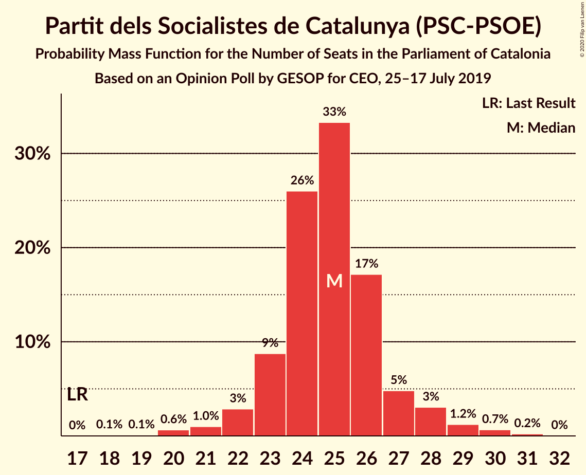
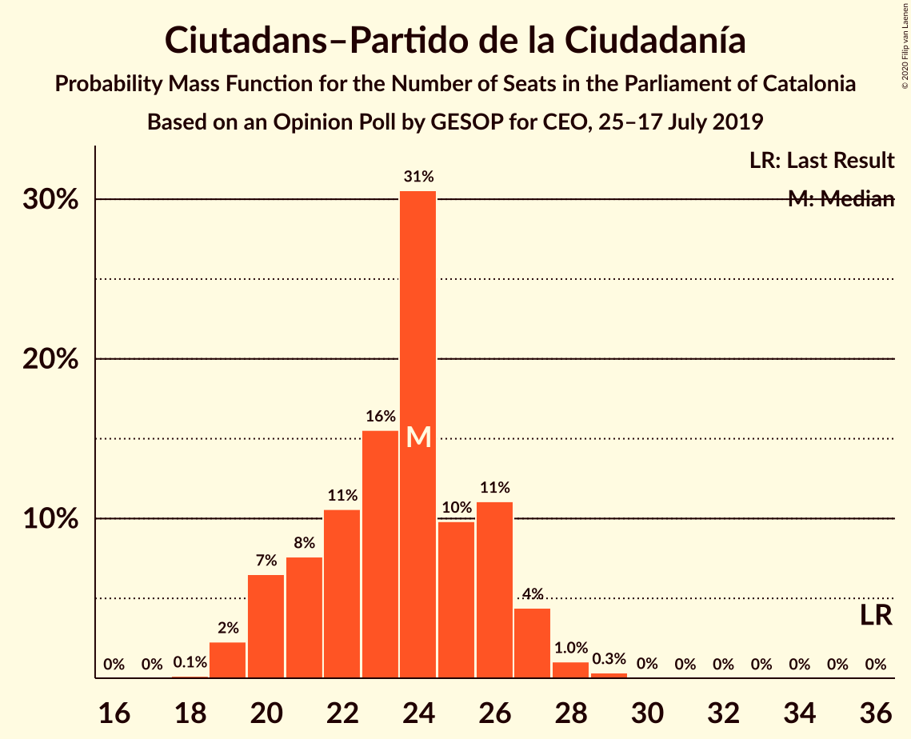
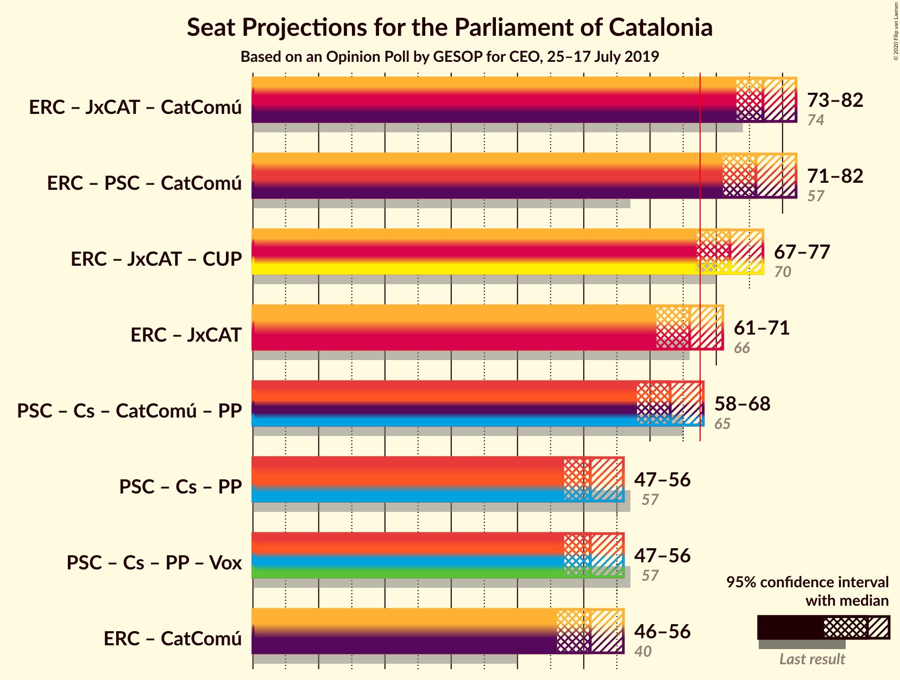
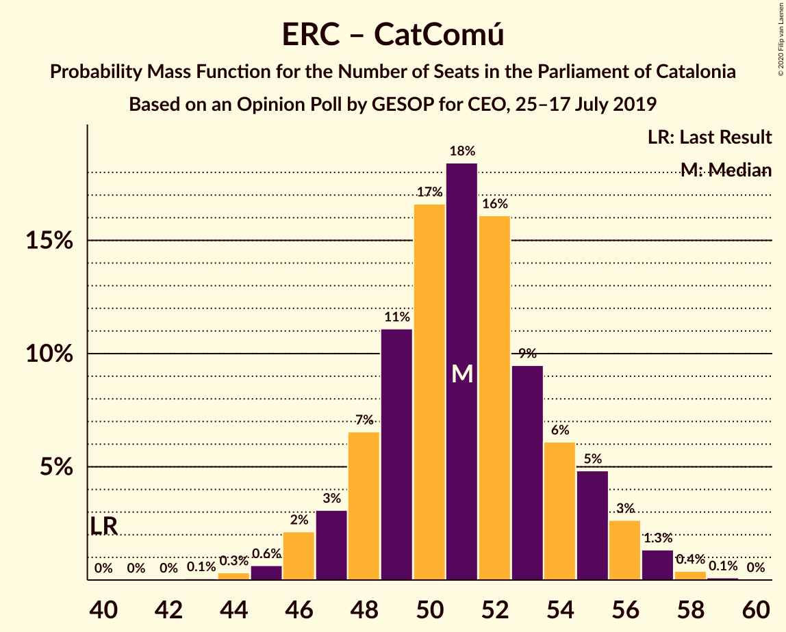
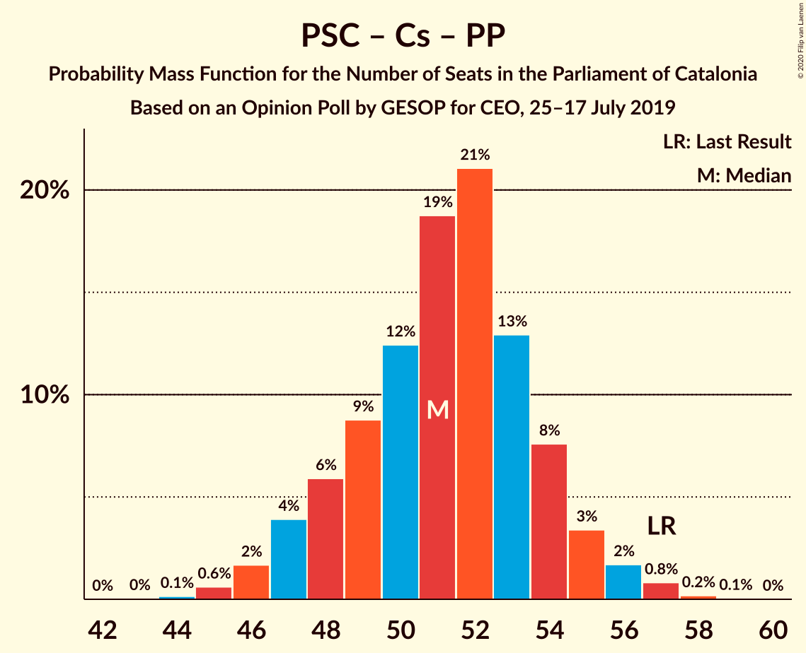

# Opinion Poll by GESOP for CEO, 25–17 July 2019

<a href="#voting-intentions">Voting Intentions</a> | <a href="#seats">Seats</a> | <a href="#coalitions">Coalitions</a> | <a href="#technical-information">Technical Information</a>

## Voting Intentions

### Confidence Intervals

| Party | Last Result | Poll Result | 80% Confidence Interval | 90% Confidence Interval | 95% Confidence Interval | 99% Confidence Interval |
|:-----:|:-----------:|:-----------:|:-----------------------:|:-----------------------:|:-----------------------:|:-----------------------:|
| Esquerra Republicana–Catalunya Sí | 21.4% | 26.5% | 24.8–28.3% |24.3–28.8% |23.9–29.3% |23.1–30.1% |
| Partit dels Socialistes de Catalunya (PSC-PSOE) | 13.9% | 18.7% | 17.2–20.3% |16.8–20.8% |16.4–21.2% |15.7–21.9% |
| Ciutadans–Partido de la Ciudadanía | 25.4% | 17.0% | 15.6–18.7% |15.2–19.1% |14.9–19.5% |14.2–20.3% |
| Junts pel Catalunya | 21.7% | 16.6% | 15.1–18.2% |14.8–18.6% |14.4–19.0% |13.8–19.7% |
| Catalunya en Comú–Podem | 7.5% | 9.5% | 8.4–10.8% |8.1–11.2% |7.9–11.5% |7.4–12.1% |
| Candidatura d’Unitat Popular | 4.5% | 5.2% | 4.4–6.3% |4.2–6.5% |4.0–6.8% |3.7–7.3% |
| Partit Popular | 4.2% | 3.5% | 2.9–4.4% |2.7–4.6% |2.6–4.8% |2.3–5.3% |

*Note:* The poll result column reflects the actual value used in the calculations. Published results may vary slightly, and in addition be rounded to fewer digits.

## Seats

### Confidence Intervals

| Party | Last Result | Median | 80% Confidence Interval | 90% Confidence Interval | 95% Confidence Interval | 99% Confidence Interval |
|:-----:|:-----------:|:------:|:-----------------------:|:-----------------------:|:-----------------------:|:-----------------------:|
| <a href="#esquerra-republicana–catalunya-sí">Esquerra Republicana–Catalunya Sí</a> | 32 | 41 | 37–43 |37–43 |36–43 |34–45 |
| <a href="#partit-dels-socialistes-de-catalunya-(psc-psoe)">Partit dels Socialistes de Catalunya (PSC-PSOE)</a> | 17 | 25 | 20–28 |20–28 |20–28 |20–28 |
| <a href="#ciutadans–partido-de-la-ciudadanía">Ciutadans–Partido de la Ciudadanía</a> | 36 | 22 | 20–24 |20–25 |19–26 |19–28 |
| <a href="#junts-pel-catalunya">Junts pel Catalunya</a> | 34 | 27 | 24–29 |24–29 |24–30 |23–30 |
| <a href="#catalunya-en-comú–podem">Catalunya en Comú–Podem</a> | 8 | 11 | 10–14 |10–16 |8–16 |8–16 |
| <a href="#candidatura-d’unitat-popular">Candidatura d’Unitat Popular</a> | 4 | 7 | 5–8 |5–9 |5–9 |4–9 |
| <a href="#partit-popular">Partit Popular</a> | 4 | 3 | 0–6 |0–6 |0–6 |0–6 |

### Esquerra Republicana–Catalunya Sí

*For a full overview of the results for this party, see the [Esquerra Republicana–Catalunya Sí](party-esquerrarepublicana–catalunyasí.html) page.*

| Number of Seats | Probability | Accumulated | Special Marks |
|:---------------:|:-----------:|:-----------:|:-------------:|
| 32 | 0.1% | 100% | Last Result |
| 33 | 0.1% | 99.9% |  |
| 34 | 0.4% | 99.8% |  |
| 35 | 2% | 99.5% |  |
| 36 | 2% | 98% |  |
| 37 | 21% | 96% |  |
| 38 | 11% | 75% |  |
| 39 | 10% | 64% |  |
| 40 | 3% | 54% |  |
| 41 | 2% | 50% | Median |
| 42 | 29% | 48% |  |
| 43 | 17% | 19% |  |
| 44 | 0% | 2% |  |
| 45 | 2% | 2% |  |
| 46 | 0.1% | 0.4% |  |
| 47 | 0% | 0.3% |  |
| 48 | 0.3% | 0.3% |  |
| 49 | 0% | 0% |  |

### Partit dels Socialistes de Catalunya (PSC-PSOE)

*For a full overview of the results for this party, see the [Partit dels Socialistes de Catalunya (PSC-PSOE)](party-partitdelssocialistesdecatalunyapsc-psoe.html) page.*

| Number of Seats | Probability | Accumulated | Special Marks |
|:---------------:|:-----------:|:-----------:|:-------------:|
| 17 | 0% | 100% | Last Result |
| 18 | 0% | 100% |  |
| 19 | 0.2% | 100% |  |
| 20 | 10% | 99.8% |  |
| 21 | 0.5% | 89% |  |
| 22 | 0% | 89% |  |
| 23 | 0.9% | 89% |  |
| 24 | 16% | 88% |  |
| 25 | 28% | 72% | Median |
| 26 | 21% | 44% |  |
| 27 | 0.5% | 23% |  |
| 28 | 22% | 22% |  |
| 29 | 0% | 0.1% |  |
| 30 | 0% | 0% |  |

### Ciutadans–Partido de la Ciudadanía

*For a full overview of the results for this party, see the [Ciutadans–Partido de la Ciudadanía](party-ciutadans–partidodelaciudadanía.html) page.*

| Number of Seats | Probability | Accumulated | Special Marks |
|:---------------:|:-----------:|:-----------:|:-------------:|
| 19 | 3% | 100% |  |
| 20 | 45% | 97% |  |
| 21 | 0.1% | 52% |  |
| 22 | 23% | 52% | Median |
| 23 | 12% | 28% |  |
| 24 | 11% | 16% |  |
| 25 | 0.7% | 5% |  |
| 26 | 3% | 4% |  |
| 27 | 0.6% | 1.2% |  |
| 28 | 0.6% | 0.6% |  |
| 29 | 0% | 0% |  |
| 30 | 0% | 0% |  |
| 31 | 0% | 0% |  |
| 32 | 0% | 0% |  |
| 33 | 0% | 0% |  |
| 34 | 0% | 0% |  |
| 35 | 0% | 0% |  |
| 36 | 0% | 0% | Last Result |

### Junts pel Catalunya

*For a full overview of the results for this party, see the [Junts pel Catalunya](party-juntspelcatalunya.html) page.*

| Number of Seats | Probability | Accumulated | Special Marks |
|:---------------:|:-----------:|:-----------:|:-------------:|
| 22 | 0.1% | 100% |  |
| 23 | 2% | 99.9% |  |
| 24 | 29% | 98% |  |
| 25 | 4% | 69% |  |
| 26 | 13% | 65% |  |
| 27 | 21% | 53% | Median |
| 28 | 0.5% | 32% |  |
| 29 | 28% | 31% |  |
| 30 | 3% | 3% |  |
| 31 | 0.1% | 0.1% |  |
| 32 | 0% | 0% |  |
| 33 | 0% | 0% |  |
| 34 | 0% | 0% | Last Result |

### Catalunya en Comú–Podem

*For a full overview of the results for this party, see the [Catalunya en Comú–Podem](party-catalunyaencomú–podem.html) page.*

| Number of Seats | Probability | Accumulated | Special Marks |
|:---------------:|:-----------:|:-----------:|:-------------:|
| 8 | 5% | 100% | Last Result |
| 9 | 0.1% | 95% |  |
| 10 | 23% | 95% |  |
| 11 | 48% | 73% | Median |
| 12 | 0.4% | 25% |  |
| 13 | 13% | 24% |  |
| 14 | 2% | 11% |  |
| 15 | 1.1% | 9% |  |
| 16 | 8% | 8% |  |
| 17 | 0% | 0% |  |

### Candidatura d’Unitat Popular

*For a full overview of the results for this party, see the [Candidatura d’Unitat Popular](party-candidaturad’unitatpopular.html) page.*

| Number of Seats | Probability | Accumulated | Special Marks |
|:---------------:|:-----------:|:-----------:|:-------------:|
| 3 | 0.4% | 100% |  |
| 4 | 2% | 99.5% | Last Result |
| 5 | 8% | 98% |  |
| 6 | 18% | 90% |  |
| 7 | 31% | 72% | Median |
| 8 | 35% | 41% |  |
| 9 | 5% | 5% |  |
| 10 | 0% | 0% |  |

### Partit Popular

*For a full overview of the results for this party, see the [Partit Popular](party-partitpopular.html) page.*

| Number of Seats | Probability | Accumulated | Special Marks |
|:---------------:|:-----------:|:-----------:|:-------------:|
| 0 | 18% | 100% |  |
| 1 | 0% | 82% |  |
| 2 | 10% | 82% |  |
| 3 | 41% | 72% | Median |
| 4 | 3% | 31% | Last Result |
| 5 | 2% | 28% |  |
| 6 | 27% | 27% |  |
| 7 | 0.2% | 0.2% |  |
| 8 | 0% | 0% |  |

## Coalitions

### Confidence Intervals

| Coalition | Last Result | Median | Majority? | 80% Confidence Interval | 90% Confidence Interval | 95% Confidence Interval | 99% Confidence Interval |
|:---------:|:-----------:|:------:|:---------:|:-----------------------:|:-----------------------:|:-----------------------:|:-----------------------:|
| Esquerra Republicana–Catalunya Sí – Junts pel Catalunya – Catalunya en Comú–Podem | 74 | 77 | 100% | 74–83 | 74–83 | 73–83 | 73–83 |
| Esquerra Republicana–Catalunya Sí – Junts pel Catalunya – Candidatura d’Unitat Popular | 70 | 73 | 98.7% | 70–78 | 70–78 | 69–78 | 67–78 |
| Esquerra Republicana–Catalunya Sí – Junts pel Catalunya | 66 | 66 | 25% | 64–72 | 64–72 | 60–72 | 60–72 |
| Partit dels Socialistes de Catalunya (PSC-PSOE) – Ciutadans–Partido de la Ciudadanía – Catalunya en Comú–Podem – Partit Popular | 65 | 62 | 1.3% | 57–65 | 57–65 | 57–66 | 57–68 |
| Esquerra Republicana–Catalunya Sí – Catalunya en Comú–Podem | 40 | 53 | 0% | 47–55 | 47–55 | 47–55 | 46–56 |
| Partit dels Socialistes de Catalunya (PSC-PSOE) – Ciutadans–Partido de la Ciudadanía – Partit Popular | 57 | 51 | 0% | 46–53 | 46–53 | 46–54 | 46–55 |

### Esquerra Republicana–Catalunya Sí – Junts pel Catalunya – Catalunya en Comú–Podem

| Number of Seats | Probability | Accumulated | Special Marks |
|:---------------:|:-----------:|:-----------:|:-------------:|
| 72 | 0.5% | 100% |  |
| 73 | 2% | 99.5% |  |
| 74 | 21% | 97% | Last Result |
| 75 | 4% | 76% |  |
| 76 | 3% | 73% |  |
| 77 | 27% | 69% |  |
| 78 | 0.3% | 42% |  |
| 79 | 2% | 42% | Median |
| 80 | 13% | 40% |  |
| 81 | 9% | 27% |  |
| 82 | 0.1% | 17% |  |
| 83 | 17% | 17% |  |
| 84 | 0.1% | 0.4% |  |
| 85 | 0% | 0.3% |  |
| 86 | 0.3% | 0.3% |  |
| 87 | 0% | 0% |  |

### Esquerra Republicana–Catalunya Sí – Junts pel Catalunya – Candidatura d’Unitat Popular

| Number of Seats | Probability | Accumulated | Special Marks |
|:---------------:|:-----------:|:-----------:|:-------------:|
| 65 | 0.1% | 100% |  |
| 66 | 0% | 99.9% |  |
| 67 | 1.2% | 99.9% |  |
| 68 | 0.6% | 98.7% | Majority |
| 69 | 2% | 98% |  |
| 70 | 10% | 96% | Last Result |
| 71 | 0.3% | 86% |  |
| 72 | 22% | 86% |  |
| 73 | 28% | 64% |  |
| 74 | 0.4% | 36% |  |
| 75 | 11% | 36% | Median |
| 76 | 2% | 25% |  |
| 77 | 6% | 23% |  |
| 78 | 17% | 17% |  |
| 79 | 0% | 0.1% |  |
| 80 | 0% | 0% |  |

### Esquerra Republicana–Catalunya Sí – Junts pel Catalunya

| Number of Seats | Probability | Accumulated | Special Marks |
|:---------------:|:-----------:|:-----------:|:-------------:|
| 60 | 3% | 100% |  |
| 61 | 0.5% | 97% |  |
| 62 | 0% | 96% |  |
| 63 | 0.6% | 96% |  |
| 64 | 22% | 96% |  |
| 65 | 8% | 73% |  |
| 66 | 27% | 65% | Last Result |
| 67 | 12% | 37% |  |
| 68 | 5% | 25% | Median, Majority |
| 69 | 0.1% | 20% |  |
| 70 | 3% | 20% |  |
| 71 | 0% | 17% |  |
| 72 | 17% | 17% |  |
| 73 | 0.3% | 0.4% |  |
| 74 | 0.1% | 0.1% |  |
| 75 | 0% | 0% |  |

### Partit dels Socialistes de Catalunya (PSC-PSOE) – Ciutadans–Partido de la Ciudadanía – Catalunya en Comú–Podem – Partit Popular

| Number of Seats | Probability | Accumulated | Special Marks |
|:---------------:|:-----------:|:-----------:|:-------------:|
| 56 | 0% | 100% |  |
| 57 | 17% | 99.9% |  |
| 58 | 6% | 83% |  |
| 59 | 2% | 77% |  |
| 60 | 11% | 75% |  |
| 61 | 0.4% | 64% | Median |
| 62 | 28% | 64% |  |
| 63 | 22% | 36% |  |
| 64 | 0.3% | 14% |  |
| 65 | 10% | 14% | Last Result |
| 66 | 2% | 4% |  |
| 67 | 0.6% | 2% |  |
| 68 | 1.2% | 1.3% | Majority |
| 69 | 0% | 0.1% |  |
| 70 | 0.1% | 0.1% |  |
| 71 | 0% | 0% |  |

### Esquerra Republicana–Catalunya Sí – Catalunya en Comú–Podem

| Number of Seats | Probability | Accumulated | Special Marks |
|:---------------:|:-----------:|:-----------:|:-------------:|
| 40 | 0% | 100% | Last Result |
| 41 | 0% | 100% |  |
| 42 | 0% | 100% |  |
| 43 | 0% | 100% |  |
| 44 | 0.1% | 100% |  |
| 45 | 0.4% | 99.9% |  |
| 46 | 0.2% | 99.5% |  |
| 47 | 20% | 99.3% |  |
| 48 | 0.1% | 79% |  |
| 49 | 5% | 79% |  |
| 50 | 9% | 75% |  |
| 51 | 10% | 66% |  |
| 52 | 1.1% | 55% | Median |
| 53 | 27% | 54% |  |
| 54 | 17% | 28% |  |
| 55 | 8% | 11% |  |
| 56 | 2% | 2% |  |
| 57 | 0% | 0.3% |  |
| 58 | 0% | 0.3% |  |
| 59 | 0% | 0.3% |  |
| 60 | 0% | 0.3% |  |
| 61 | 0.3% | 0.3% |  |
| 62 | 0% | 0% |  |

### Partit dels Socialistes de Catalunya (PSC-PSOE) – Ciutadans–Partido de la Ciudadanía – Partit Popular

| Number of Seats | Probability | Accumulated | Special Marks |
|:---------------:|:-----------:|:-----------:|:-------------:|
| 44 | 0% | 100% |  |
| 45 | 0.3% | 99.9% |  |
| 46 | 17% | 99.6% |  |
| 47 | 10% | 82% |  |
| 48 | 5% | 72% |  |
| 49 | 8% | 67% |  |
| 50 | 4% | 59% | Median |
| 51 | 27% | 55% |  |
| 52 | 2% | 28% |  |
| 53 | 23% | 26% |  |
| 54 | 3% | 3% |  |
| 55 | 0.1% | 0.6% |  |
| 56 | 0.5% | 0.5% |  |
| 57 | 0% | 0% | Last Result |

## Technical Information

### Opinion Poll

+ **Polling firm:** GESOP
+ **Commissioner(s):** CEO
+ **Fieldwork period:** 25–17 July 2019

### Calculations

+ **Sample size:** 1050
+ **Simulations done:** 2,048
+ **Error estimate:** 2.79%

