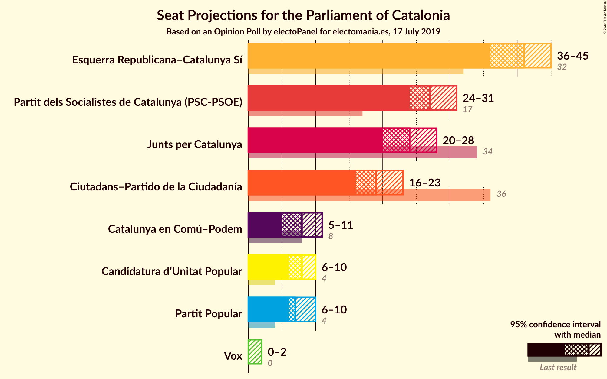
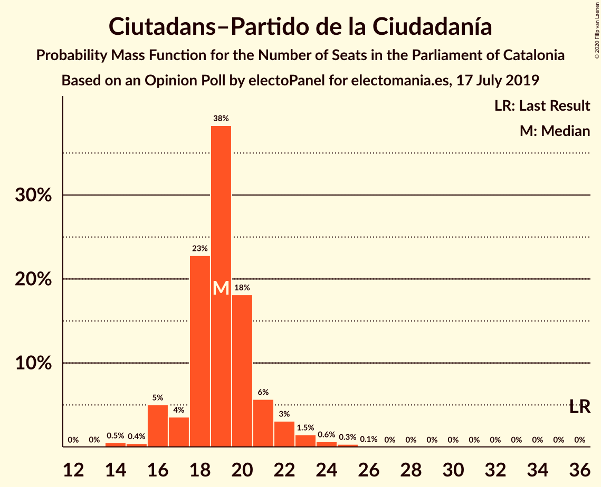
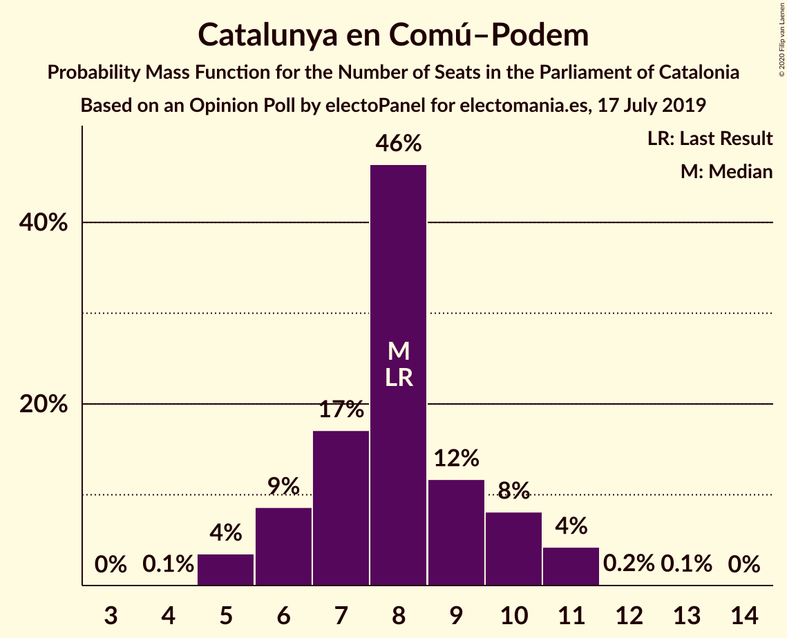
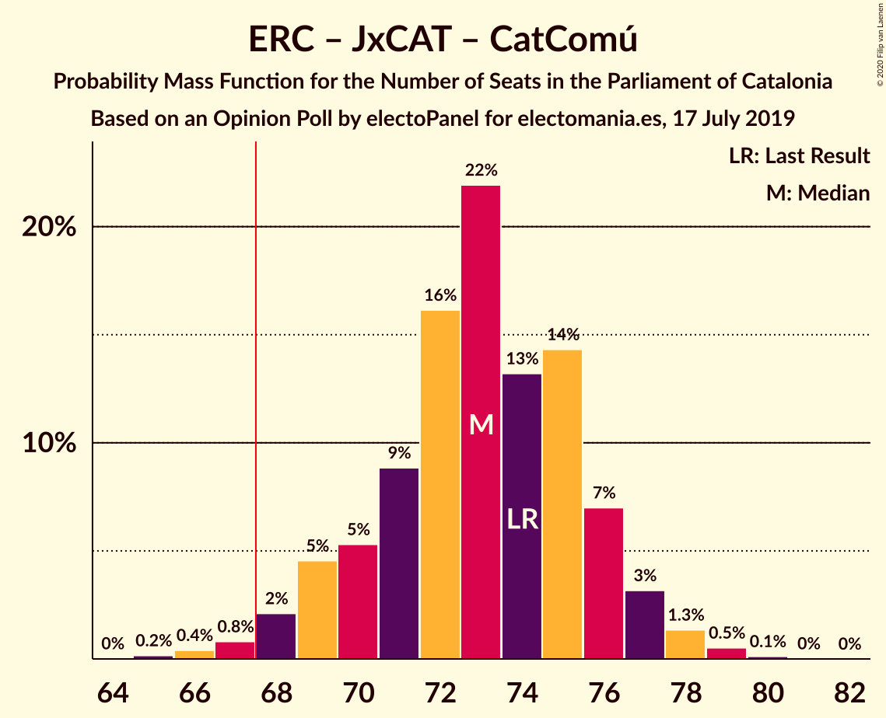
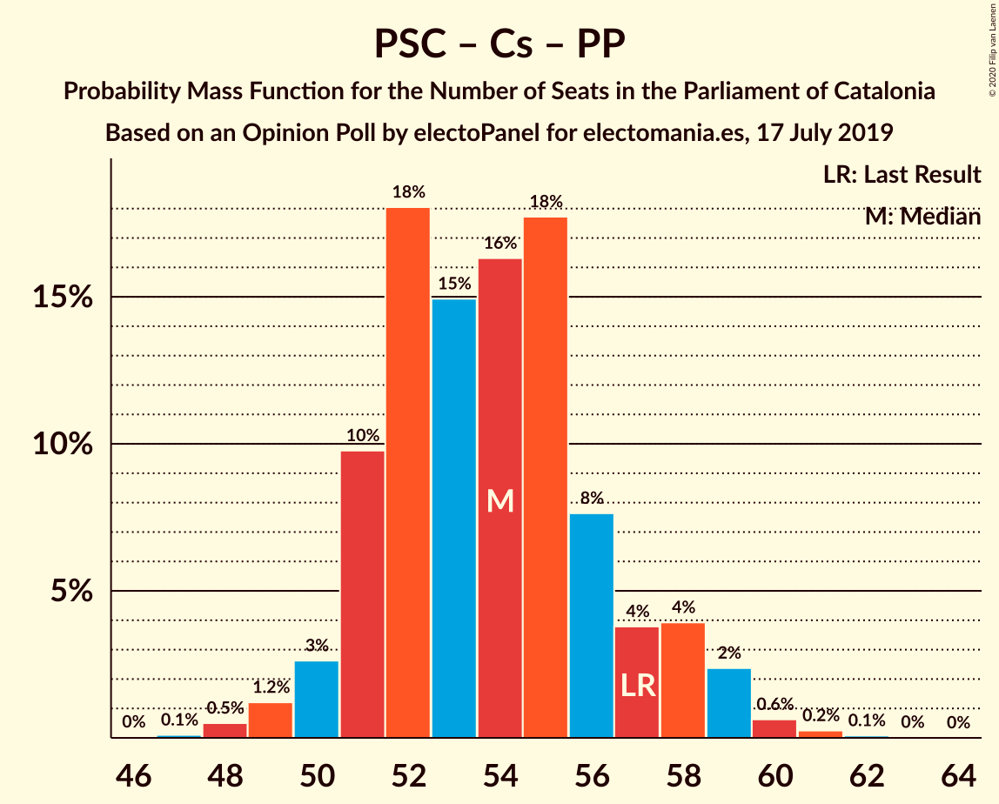
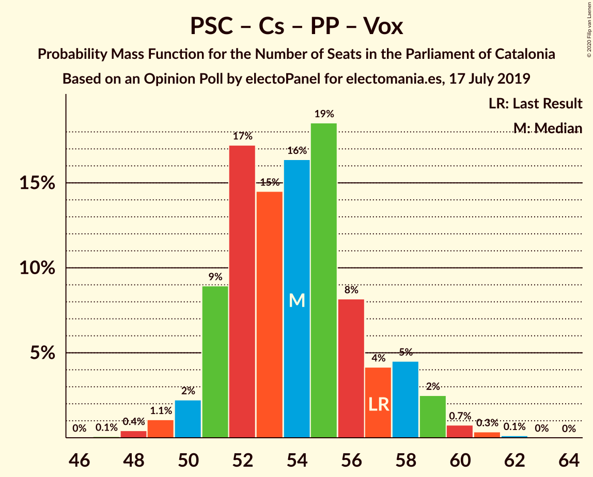

# Opinion Poll by electoPanel for electomania.es, 17 July 2019

<a href="#voting-intentions">Voting Intentions</a> | <a href="#seats">Seats</a> | <a href="#coalitions">Coalitions</a> | <a href="#technical-information">Technical Information</a>

## Voting Intentions

### Confidence Intervals

| Party | Last Result | Poll Result | 80% Confidence Interval | 90% Confidence Interval | 95% Confidence Interval | 99% Confidence Interval |
|:-----:|:-----------:|:-----------:|:-----------------------:|:-----------------------:|:-----------------------:|:-----------------------:|
| Esquerra Republicana–Catalunya Sí | 21.4% | 26.7% | 25.0–28.6% |24.5–29.1% |24.1–29.5% |23.2–30.4% |
| Partit dels Socialistes de Catalunya (PSC-PSOE) | 13.9% | 20.1% | 18.5–21.8% |18.1–22.3% |17.7–22.7% |17.0–23.5% |
| Junts per Catalunya | 21.7% | 15.3% | 13.9–16.9% |13.5–17.3% |13.2–17.7% |12.6–18.4% |
| Ciutadans–Partido de la Ciudadanía | 25.4% | 14.1% | 12.8–15.6% |12.4–16.0% |12.1–16.4% |11.5–17.1% |
| Catalunya en Comú–Podem | 7.5% | 7.1% | 6.2–8.3% |5.9–8.6% |5.7–8.9% |5.2–9.4% |
| Partit Popular | 4.2% | 6.2% | 5.3–7.3% |5.1–7.6% |4.9–7.9% |4.5–8.4% |
| Candidatura d’Unitat Popular | 4.5% | 6.1% | 5.2–7.2% |5.0–7.5% |4.8–7.8% |4.4–8.3% |
| Vox | 0.0% | 2.1% | 1.6–2.8% |1.5–3.0% |1.4–3.2% |1.2–3.6% |

*Note:* The poll result column reflects the actual value used in the calculations. Published results may vary slightly, and in addition be rounded to fewer digits.

## Seats

### Confidence Intervals

| Party | Last Result | Median | 80% Confidence Interval | 90% Confidence Interval | 95% Confidence Interval | 99% Confidence Interval |
|:-----:|:-----------:|:------:|:-----------------------:|:-----------------------:|:-----------------------:|:-----------------------:|
| <a href="#esquerra-republicana–catalunya-sí">Esquerra Republicana–Catalunya Sí</a> | 32 | 41 | 38–44 |37–44 |36–45 |35–47 |
| <a href="#partit-dels-socialistes-de-catalunya-(psc-psoe)">Partit dels Socialistes de Catalunya (PSC-PSOE)</a> | 17 | 27 | 25–30 |25–31 |24–31 |24–33 |
| <a href="#junts-per-catalunya">Junts per Catalunya</a> | 34 | 24 | 23–26 |21–26 |20–28 |19–30 |
| <a href="#ciutadans–partido-de-la-ciudadanía">Ciutadans–Partido de la Ciudadanía</a> | 36 | 19 | 18–21 |16–22 |16–23 |14–24 |
| <a href="#catalunya-en-comú–podem">Catalunya en Comú–Podem</a> | 8 | 8 | 6–10 |6–10 |5–11 |5–11 |
| <a href="#partit-popular">Partit Popular</a> | 4 | 7 | 6–9 |6–10 |6–10 |5–11 |
| <a href="#candidatura-d’unitat-popular">Candidatura d’Unitat Popular</a> | 4 | 8 | 7–9 |7–10 |6–10 |4–11 |
| <a href="#vox">Vox</a> | 0 | 0 | 0 |0–2 |0–2 |0–3 |

### Esquerra Republicana–Catalunya Sí

*For a full overview of the results for this party, see the [Esquerra Republicana–Catalunya Sí](party-esquerrarepublicana–catalunyasí.html) page.*

| Number of Seats | Probability | Accumulated | Special Marks |
|:---------------:|:-----------:|:-----------:|:-------------:|
| 32 | 0% | 100% | Last Result |
| 33 | 0% | 100% |  |
| 34 | 0.1% | 100% |  |
| 35 | 1.0% | 99.9% |  |
| 36 | 2% | 98.9% |  |
| 37 | 4% | 97% |  |
| 38 | 6% | 93% |  |
| 39 | 12% | 87% |  |
| 40 | 14% | 75% |  |
| 41 | 26% | 61% | Median |
| 42 | 18% | 35% |  |
| 43 | 7% | 17% |  |
| 44 | 7% | 10% |  |
| 45 | 2% | 4% |  |
| 46 | 0.9% | 2% |  |
| 47 | 0.8% | 1.0% |  |
| 48 | 0.2% | 0.2% |  |
| 49 | 0% | 0% |  |

### Partit dels Socialistes de Catalunya (PSC-PSOE)

*For a full overview of the results for this party, see the [Partit dels Socialistes de Catalunya (PSC-PSOE)](party-partitdelssocialistesdecatalunyapsc-psoe.html) page.*

| Number of Seats | Probability | Accumulated | Special Marks |
|:---------------:|:-----------:|:-----------:|:-------------:|
| 17 | 0% | 100% | Last Result |
| 18 | 0% | 100% |  |
| 19 | 0% | 100% |  |
| 20 | 0% | 100% |  |
| 21 | 0% | 100% |  |
| 22 | 0% | 100% |  |
| 23 | 0.4% | 99.9% |  |
| 24 | 4% | 99.5% |  |
| 25 | 13% | 95% |  |
| 26 | 29% | 82% |  |
| 27 | 19% | 53% | Median |
| 28 | 8% | 34% |  |
| 29 | 14% | 26% |  |
| 30 | 5% | 12% |  |
| 31 | 5% | 7% |  |
| 32 | 0.8% | 1.3% |  |
| 33 | 0.4% | 0.5% |  |
| 34 | 0.1% | 0.1% |  |
| 35 | 0% | 0% |  |

### Junts per Catalunya

*For a full overview of the results for this party, see the [Junts per Catalunya](party-juntspercatalunya.html) page.*

| Number of Seats | Probability | Accumulated | Special Marks |
|:---------------:|:-----------:|:-----------:|:-------------:|
| 18 | 0.4% | 100% |  |
| 19 | 0.5% | 99.6% |  |
| 20 | 2% | 99.1% |  |
| 21 | 2% | 97% |  |
| 22 | 4% | 94% |  |
| 23 | 26% | 91% |  |
| 24 | 21% | 65% | Median |
| 25 | 23% | 44% |  |
| 26 | 17% | 21% |  |
| 27 | 2% | 4% |  |
| 28 | 1.4% | 3% |  |
| 29 | 0.9% | 1.5% |  |
| 30 | 0.3% | 0.5% |  |
| 31 | 0.2% | 0.2% |  |
| 32 | 0% | 0% |  |
| 33 | 0% | 0% |  |
| 34 | 0% | 0% | Last Result |

### Ciutadans–Partido de la Ciudadanía

*For a full overview of the results for this party, see the [Ciutadans–Partido de la Ciudadanía](party-ciutadans–partidodelaciudadanía.html) page.*

| Number of Seats | Probability | Accumulated | Special Marks |
|:---------------:|:-----------:|:-----------:|:-------------:|
| 14 | 0.5% | 100% |  |
| 15 | 0.4% | 99.5% |  |
| 16 | 5% | 99.1% |  |
| 17 | 4% | 94% |  |
| 18 | 23% | 90% |  |
| 19 | 38% | 68% | Median |
| 20 | 18% | 29% |  |
| 21 | 6% | 11% |  |
| 22 | 3% | 6% |  |
| 23 | 1.5% | 3% |  |
| 24 | 0.6% | 1.1% |  |
| 25 | 0.3% | 0.4% |  |
| 26 | 0.1% | 0.1% |  |
| 27 | 0% | 0% |  |
| 28 | 0% | 0% |  |
| 29 | 0% | 0% |  |
| 30 | 0% | 0% |  |
| 31 | 0% | 0% |  |
| 32 | 0% | 0% |  |
| 33 | 0% | 0% |  |
| 34 | 0% | 0% |  |
| 35 | 0% | 0% |  |
| 36 | 0% | 0% | Last Result |

### Catalunya en Comú–Podem

*For a full overview of the results for this party, see the [Catalunya en Comú–Podem](party-catalunyaencomú–podem.html) page.*

| Number of Seats | Probability | Accumulated | Special Marks |
|:---------------:|:-----------:|:-----------:|:-------------:|
| 4 | 0.1% | 100% |  |
| 5 | 4% | 99.9% |  |
| 6 | 9% | 96% |  |
| 7 | 17% | 88% |  |
| 8 | 46% | 71% | Last Result, Median |
| 9 | 12% | 24% |  |
| 10 | 8% | 13% |  |
| 11 | 4% | 4% |  |
| 12 | 0.2% | 0.2% |  |
| 13 | 0.1% | 0.1% |  |
| 14 | 0% | 0% |  |

### Partit Popular

*For a full overview of the results for this party, see the [Partit Popular](party-partitpopular.html) page.*

| Number of Seats | Probability | Accumulated | Special Marks |
|:---------------:|:-----------:|:-----------:|:-------------:|
| 3 | 0.1% | 100% |  |
| 4 | 0.1% | 99.9% | Last Result |
| 5 | 2% | 99.8% |  |
| 6 | 9% | 98% |  |
| 7 | 49% | 89% | Median |
| 8 | 10% | 40% |  |
| 9 | 23% | 30% |  |
| 10 | 7% | 8% |  |
| 11 | 0.4% | 0.6% |  |
| 12 | 0.2% | 0.3% |  |
| 13 | 0% | 0% |  |

### Candidatura d’Unitat Popular

*For a full overview of the results for this party, see the [Candidatura d’Unitat Popular](party-candidaturad’unitatpopular.html) page.*

| Number of Seats | Probability | Accumulated | Special Marks |
|:---------------:|:-----------:|:-----------:|:-------------:|
| 4 | 0.6% | 100% | Last Result |
| 5 | 0.6% | 99.4% |  |
| 6 | 3% | 98.8% |  |
| 7 | 18% | 95% |  |
| 8 | 51% | 78% | Median |
| 9 | 19% | 27% |  |
| 10 | 6% | 8% |  |
| 11 | 2% | 2% |  |
| 12 | 0.1% | 0.1% |  |
| 13 | 0% | 0% |  |

### Vox

*For a full overview of the results for this party, see the [Vox](party-vox.html) page.*

| Number of Seats | Probability | Accumulated | Special Marks |
|:---------------:|:-----------:|:-----------:|:-------------:|
| 0 | 93% | 100% | Last Result, Median |
| 1 | 0% | 7% |  |
| 2 | 5% | 7% |  |
| 3 | 2% | 2% |  |
| 4 | 0% | 0% |  |

## Coalitions

### Confidence Intervals

| Coalition | Last Result | Median | Majority? | 80% Confidence Interval | 90% Confidence Interval | 95% Confidence Interval | 99% Confidence Interval |
|:---------:|:-----------:|:------:|:---------:|:-----------------------:|:-----------------------:|:-----------------------:|:-----------------------:|
| Esquerra Republicana–Catalunya Sí – Partit dels Socialistes de Catalunya (PSC-PSOE) – Catalunya en Comú–Podem | 57 | 76 | 100% | 73–79 | 72–80 | 71–81 | 69–82 |
| Esquerra Republicana–Catalunya Sí – Junts per Catalunya – Candidatura d’Unitat Popular | 70 | 73 | 98% | 70–76 | 69–77 | 68–77 | 67–79 |
| Esquerra Republicana–Catalunya Sí – Junts per Catalunya – Catalunya en Comú–Podem | 74 | 73 | 98.6% | 70–76 | 69–77 | 68–77 | 66–79 |
| Esquerra Republicana–Catalunya Sí – Junts per Catalunya | 66 | 65 | 11% | 62–68 | 61–69 | 60–69 | 58–71 |
| Partit dels Socialistes de Catalunya (PSC-PSOE) – Ciutadans–Partido de la Ciudadanía – Catalunya en Comú–Podem – Partit Popular | 65 | 62 | 1.3% | 59–65 | 58–66 | 57–67 | 56–68 |
| Partit dels Socialistes de Catalunya (PSC-PSOE) – Ciutadans–Partido de la Ciudadanía – Partit Popular | 57 | 54 | 0% | 51–57 | 51–58 | 50–59 | 48–60 |
| Partit dels Socialistes de Catalunya (PSC-PSOE) – Ciutadans–Partido de la Ciudadanía – Partit Popular – Vox | 57 | 54 | 0% | 51–57 | 51–58 | 50–59 | 48–61 |
| Esquerra Republicana–Catalunya Sí – Catalunya en Comú–Podem | 40 | 49 | 0% | 46–52 | 45–52 | 44–53 | 43–55 |

### Esquerra Republicana–Catalunya Sí – Partit dels Socialistes de Catalunya (PSC-PSOE) – Catalunya en Comú–Podem

| Number of Seats | Probability | Accumulated | Special Marks |
|:---------------:|:-----------:|:-----------:|:-------------:|
| 57 | 0% | 100% | Last Result |
| 58 | 0% | 100% |  |
| 59 | 0% | 100% |  |
| 60 | 0% | 100% |  |
| 61 | 0% | 100% |  |
| 62 | 0% | 100% |  |
| 63 | 0% | 100% |  |
| 64 | 0% | 100% |  |
| 65 | 0% | 100% |  |
| 66 | 0% | 100% |  |
| 67 | 0% | 100% |  |
| 68 | 0.1% | 100% | Majority |
| 69 | 0.4% | 99.8% |  |
| 70 | 1.0% | 99.5% |  |
| 71 | 2% | 98% |  |
| 72 | 4% | 97% |  |
| 73 | 7% | 92% |  |
| 74 | 10% | 85% |  |
| 75 | 18% | 75% |  |
| 76 | 16% | 57% | Median |
| 77 | 18% | 40% |  |
| 78 | 11% | 23% |  |
| 79 | 5% | 12% |  |
| 80 | 3% | 6% |  |
| 81 | 2% | 3% |  |
| 82 | 0.5% | 0.8% |  |
| 83 | 0.2% | 0.3% |  |
| 84 | 0.1% | 0.1% |  |
| 85 | 0% | 0% |  |

### Esquerra Republicana–Catalunya Sí – Junts per Catalunya – Candidatura d’Unitat Popular

| Number of Seats | Probability | Accumulated | Special Marks |
|:---------------:|:-----------:|:-----------:|:-------------:|
| 65 | 0.1% | 100% |  |
| 66 | 0.4% | 99.9% |  |
| 67 | 1.1% | 99.5% |  |
| 68 | 2% | 98% | Majority |
| 69 | 3% | 97% |  |
| 70 | 5% | 93% | Last Result |
| 71 | 8% | 88% |  |
| 72 | 19% | 80% |  |
| 73 | 19% | 61% | Median |
| 74 | 14% | 42% |  |
| 75 | 15% | 28% |  |
| 76 | 7% | 13% |  |
| 77 | 4% | 6% |  |
| 78 | 2% | 2% |  |
| 79 | 0.6% | 0.8% |  |
| 80 | 0.1% | 0.1% |  |
| 81 | 0% | 0% |  |

### Esquerra Republicana–Catalunya Sí – Junts per Catalunya – Catalunya en Comú–Podem

| Number of Seats | Probability | Accumulated | Special Marks |
|:---------------:|:-----------:|:-----------:|:-------------:|
| 65 | 0.2% | 100% |  |
| 66 | 0.4% | 99.8% |  |
| 67 | 0.8% | 99.4% |  |
| 68 | 2% | 98.6% | Majority |
| 69 | 5% | 96% |  |
| 70 | 5% | 92% |  |
| 71 | 9% | 87% |  |
| 72 | 16% | 78% |  |
| 73 | 22% | 62% | Median |
| 74 | 13% | 40% | Last Result |
| 75 | 14% | 27% |  |
| 76 | 7% | 12% |  |
| 77 | 3% | 5% |  |
| 78 | 1.3% | 2% |  |
| 79 | 0.5% | 0.7% |  |
| 80 | 0.1% | 0.2% |  |
| 81 | 0% | 0% |  |

### Esquerra Republicana–Catalunya Sí – Junts per Catalunya

| Number of Seats | Probability | Accumulated | Special Marks |
|:---------------:|:-----------:|:-----------:|:-------------:|
| 57 | 0.1% | 100% |  |
| 58 | 0.4% | 99.9% |  |
| 59 | 0.9% | 99.5% |  |
| 60 | 2% | 98.6% |  |
| 61 | 3% | 97% |  |
| 62 | 6% | 94% |  |
| 63 | 9% | 87% |  |
| 64 | 16% | 78% |  |
| 65 | 26% | 62% | Median |
| 66 | 10% | 37% | Last Result |
| 67 | 16% | 27% |  |
| 68 | 4% | 11% | Majority |
| 69 | 5% | 7% |  |
| 70 | 1.4% | 2% |  |
| 71 | 0.7% | 0.9% |  |
| 72 | 0.2% | 0.2% |  |
| 73 | 0% | 0% |  |

### Partit dels Socialistes de Catalunya (PSC-PSOE) – Ciutadans–Partido de la Ciudadanía – Catalunya en Comú–Podem – Partit Popular

| Number of Seats | Probability | Accumulated | Special Marks |
|:---------------:|:-----------:|:-----------:|:-------------:|
| 54 | 0% | 100% |  |
| 55 | 0.1% | 99.9% |  |
| 56 | 0.8% | 99.8% |  |
| 57 | 2% | 99.0% |  |
| 58 | 5% | 97% |  |
| 59 | 7% | 92% |  |
| 60 | 15% | 85% |  |
| 61 | 15% | 70% | Median |
| 62 | 19% | 55% |  |
| 63 | 18% | 36% |  |
| 64 | 7% | 18% |  |
| 65 | 5% | 11% | Last Result |
| 66 | 3% | 6% |  |
| 67 | 2% | 3% |  |
| 68 | 0.9% | 1.3% | Majority |
| 69 | 0.3% | 0.4% |  |
| 70 | 0.1% | 0.1% |  |
| 71 | 0% | 0% |  |

### Partit dels Socialistes de Catalunya (PSC-PSOE) – Ciutadans–Partido de la Ciudadanía – Partit Popular

| Number of Seats | Probability | Accumulated | Special Marks |
|:---------------:|:-----------:|:-----------:|:-------------:|
| 47 | 0.1% | 100% |  |
| 48 | 0.5% | 99.9% |  |
| 49 | 1.2% | 99.4% |  |
| 50 | 3% | 98% |  |
| 51 | 10% | 96% |  |
| 52 | 18% | 86% |  |
| 53 | 15% | 68% | Median |
| 54 | 16% | 53% |  |
| 55 | 18% | 36% |  |
| 56 | 8% | 19% |  |
| 57 | 4% | 11% | Last Result |
| 58 | 4% | 7% |  |
| 59 | 2% | 3% |  |
| 60 | 0.6% | 1.0% |  |
| 61 | 0.2% | 0.4% |  |
| 62 | 0.1% | 0.1% |  |
| 63 | 0% | 0% |  |

### Partit dels Socialistes de Catalunya (PSC-PSOE) – Ciutadans–Partido de la Ciudadanía – Partit Popular – Vox

| Number of Seats | Probability | Accumulated | Special Marks |
|:---------------:|:-----------:|:-----------:|:-------------:|
| 47 | 0.1% | 100% |  |
| 48 | 0.4% | 99.9% |  |
| 49 | 1.1% | 99.5% |  |
| 50 | 2% | 98% |  |
| 51 | 9% | 96% |  |
| 52 | 17% | 87% |  |
| 53 | 15% | 70% | Median |
| 54 | 16% | 55% |  |
| 55 | 19% | 39% |  |
| 56 | 8% | 21% |  |
| 57 | 4% | 12% | Last Result |
| 58 | 5% | 8% |  |
| 59 | 2% | 4% |  |
| 60 | 0.7% | 1.3% |  |
| 61 | 0.3% | 0.5% |  |
| 62 | 0.1% | 0.2% |  |
| 63 | 0% | 0% |  |

### Esquerra Republicana–Catalunya Sí – Catalunya en Comú–Podem

| Number of Seats | Probability | Accumulated | Special Marks |
|:---------------:|:-----------:|:-----------:|:-------------:|
| 40 | 0% | 100% | Last Result |
| 41 | 0.1% | 100% |  |
| 42 | 0.3% | 99.9% |  |
| 43 | 1.2% | 99.6% |  |
| 44 | 3% | 98% |  |
| 45 | 4% | 96% |  |
| 46 | 7% | 92% |  |
| 47 | 11% | 85% |  |
| 48 | 15% | 74% |  |
| 49 | 21% | 59% | Median |
| 50 | 18% | 38% |  |
| 51 | 10% | 20% |  |
| 52 | 6% | 10% |  |
| 53 | 2% | 4% |  |
| 54 | 1.3% | 2% |  |
| 55 | 0.6% | 0.9% |  |
| 56 | 0.2% | 0.2% |  |
| 57 | 0.1% | 0.1% |  |
| 58 | 0% | 0% |  |

## Technical Information

### Opinion Poll

+ **Polling firm:** electoPanel
+ **Commissioner(s):** electomania.es
+ **Fieldwork period:** 17 July 2019

### Calculations

+ **Sample size:** 1000
+ **Simulations done:** 1,048,576
+ **Error estimate:** 0.98%

