# Opinion Poll by electoPanel for electomania.es, 20 August 2019

<a href="#voting-intentions">Voting Intentions</a> | <a href="#seats">Seats</a> | <a href="#coalitions">Coalitions</a> | <a href="#technical-information">Technical Information</a>

## Voting Intentions

### Confidence Intervals

| Party | Last Result | Poll Result | 80% Confidence Interval | 90% Confidence Interval | 95% Confidence Interval | 99% Confidence Interval |
|:-----:|:-----------:|:-----------:|:-----------------------:|:-----------------------:|:-----------------------:|:-----------------------:|
| Esquerra Republicana–Catalunya Sí | 21.4% | 26.4% | 24.7–28.2% |24.2–28.8% |23.8–29.2% |22.9–30.1% |
| Partit dels Socialistes de Catalunya (PSC-PSOE) | 13.9% | 20.3% | 18.7–22.0% |18.3–22.5% |17.9–22.9% |17.2–23.7% |
| Junts per Catalunya | 21.7% | 15.5% | 14.1–17.1% |13.7–17.5% |13.4–17.9% |12.7–18.7% |
| Ciutadans–Partido de la Ciudadanía | 25.4% | 14.5% | 13.2–16.0% |12.8–16.4% |12.5–16.8% |11.8–17.6% |
| Catalunya en Comú–Podem | 7.5% | 7.1% | 6.2–8.3% |5.9–8.6% |5.7–8.9% |5.2–9.4% |
| Candidatura d’Unitat Popular | 4.5% | 6.0% | 5.1–7.1% |4.9–7.4% |4.7–7.7% |4.3–8.2% |
| Partit Popular | 4.2% | 6.0% | 5.1–7.1% |4.9–7.4% |4.7–7.7% |4.3–8.2% |
| Vox | 0.0% | 2.0% | 1.5–2.7% |1.4–2.9% |1.3–3.1% |1.1–3.4% |

*Note:* The poll result column reflects the actual value used in the calculations. Published results may vary slightly, and in addition be rounded to fewer digits.

## Seats

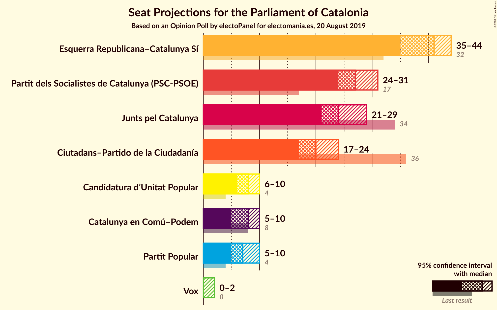

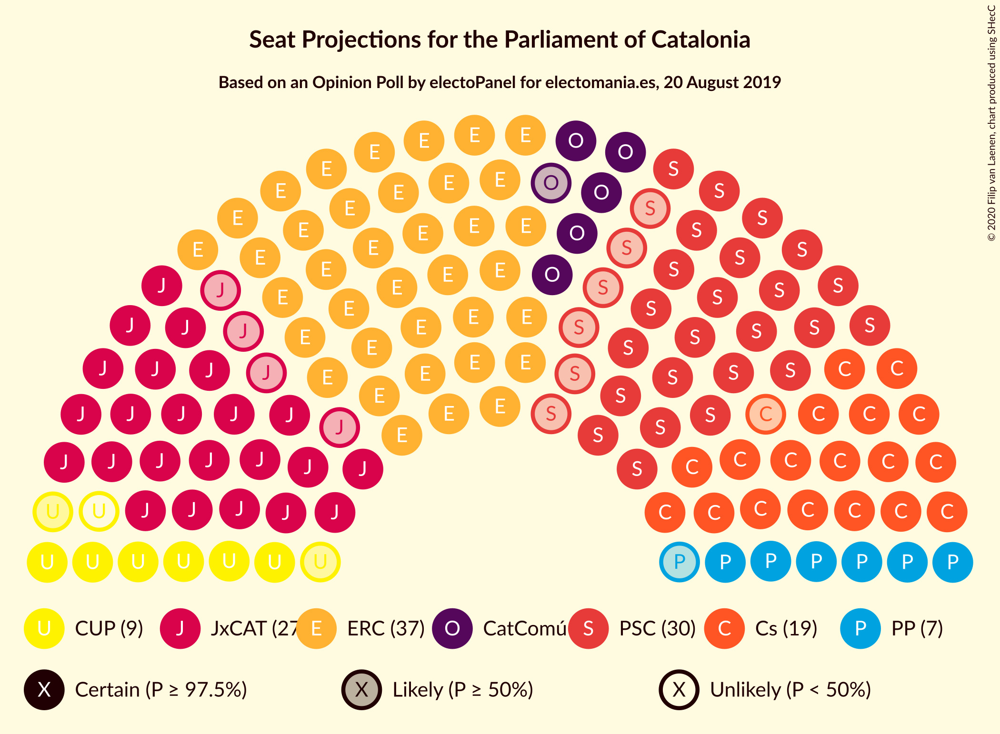

### Confidence Intervals

| Party | Last Result | Median | 80% Confidence Interval | 90% Confidence Interval | 95% Confidence Interval | 99% Confidence Interval |
|:-----:|:-----------:|:------:|:-----------------------:|:-----------------------:|:-----------------------:|:-----------------------:|
| <a href="#esquerra-republicana–catalunya-sí">Esquerra Republicana–Catalunya Sí</a> | 32 | 41 | 37–43 |37–44 |35–44 |35–46 |
| <a href="#partit-dels-socialistes-de-catalunya-(psc-psoe)">Partit dels Socialistes de Catalunya (PSC-PSOE)</a> | 17 | 27 | 25–30 |25–31 |24–31 |24–33 |
| <a href="#junts-per-catalunya">Junts per Catalunya</a> | 34 | 24 | 23–26 |22–27 |21–29 |19–30 |
| <a href="#ciutadans–partido-de-la-ciudadanía">Ciutadans–Partido de la Ciudadanía</a> | 36 | 20 | 18–22 |17–23 |17–24 |16–25 |
| <a href="#catalunya-en-comú–podem">Catalunya en Comú–Podem</a> | 8 | 8 | 6–10 |6–10 |5–10 |5–11 |
| <a href="#candidatura-d’unitat-popular">Candidatura d’Unitat Popular</a> | 4 | 8 | 7–9 |6–9 |6–10 |4–11 |
| <a href="#partit-popular">Partit Popular</a> | 4 | 7 | 6–9 |6–9 |5–10 |5–10 |
| <a href="#vox">Vox</a> | 0 | 0 | 0 |0 |0–2 |0–3 |

### Esquerra Republicana–Catalunya Sí

*For a full overview of the results for this party, see the [Esquerra Republicana–Catalunya Sí](party-esquerrarepublicana–catalunyasí.html) page.*

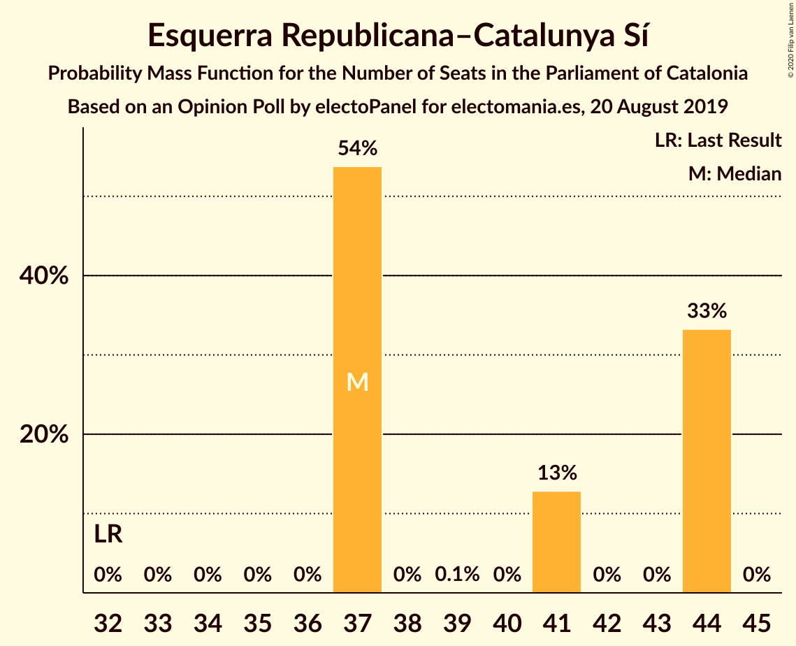

| Number of Seats | Probability | Accumulated | Special Marks |
|:---------------:|:-----------:|:-----------:|:-------------:|
| 32 | 0% | 100% | Last Result |
| 33 | 0% | 100% |  |
| 34 | 0.3% | 99.9% |  |
| 35 | 2% | 99.7% |  |
| 36 | 2% | 97% |  |
| 37 | 8% | 95% |  |
| 38 | 7% | 87% |  |
| 39 | 12% | 80% |  |
| 40 | 14% | 68% |  |
| 41 | 27% | 54% | Median |
| 42 | 15% | 27% |  |
| 43 | 7% | 12% |  |
| 44 | 3% | 5% |  |
| 45 | 1.2% | 2% |  |
| 46 | 0.4% | 0.8% |  |
| 47 | 0.3% | 0.4% |  |
| 48 | 0.1% | 0.1% |  |
| 49 | 0% | 0% |  |

### Partit dels Socialistes de Catalunya (PSC-PSOE)

*For a full overview of the results for this party, see the [Partit dels Socialistes de Catalunya (PSC-PSOE)](party-partitdelssocialistesdecatalunyapsc-psoe.html) page.*

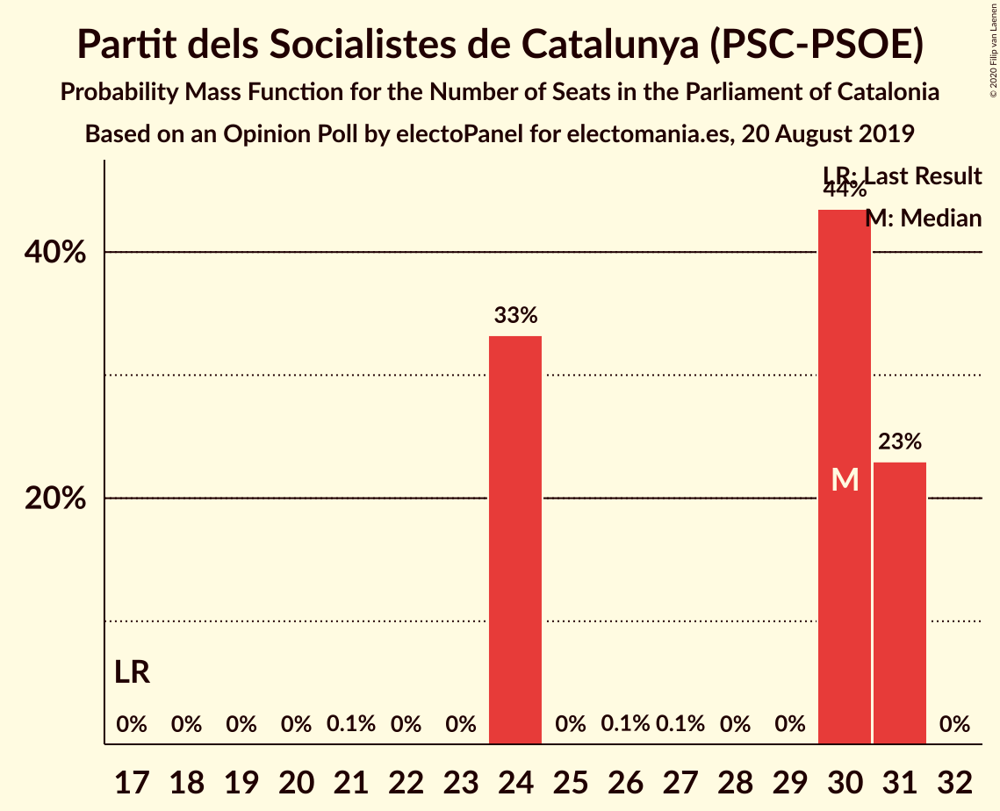

| Number of Seats | Probability | Accumulated | Special Marks |
|:---------------:|:-----------:|:-----------:|:-------------:|
| 17 | 0% | 100% | Last Result |
| 18 | 0% | 100% |  |
| 19 | 0% | 100% |  |
| 20 | 0% | 100% |  |
| 21 | 0% | 100% |  |
| 22 | 0.1% | 100% |  |
| 23 | 0.2% | 99.9% |  |
| 24 | 3% | 99.7% |  |
| 25 | 11% | 97% |  |
| 26 | 25% | 86% |  |
| 27 | 24% | 61% | Median |
| 28 | 12% | 36% |  |
| 29 | 6% | 24% |  |
| 30 | 8% | 18% |  |
| 31 | 7% | 10% |  |
| 32 | 1.3% | 2% |  |
| 33 | 0.7% | 0.8% |  |
| 34 | 0.1% | 0.2% |  |
| 35 | 0% | 0% |  |

### Junts per Catalunya

*For a full overview of the results for this party, see the [Junts per Catalunya](party-juntspercatalunya.html) page.*

| Number of Seats | Probability | Accumulated | Special Marks |
|:---------------:|:-----------:|:-----------:|:-------------:|
| 18 | 0.2% | 100% |  |
| 19 | 0.4% | 99.7% |  |
| 20 | 2% | 99.4% |  |
| 21 | 2% | 98% |  |
| 22 | 3% | 96% |  |
| 23 | 26% | 93% |  |
| 24 | 20% | 67% | Median |
| 25 | 21% | 48% |  |
| 26 | 18% | 26% |  |
| 27 | 3% | 8% |  |
| 28 | 2% | 5% |  |
| 29 | 2% | 3% |  |
| 30 | 0.7% | 0.9% |  |
| 31 | 0.2% | 0.2% |  |
| 32 | 0% | 0% |  |
| 33 | 0% | 0% |  |
| 34 | 0% | 0% | Last Result |

### Ciutadans–Partido de la Ciudadanía

*For a full overview of the results for this party, see the [Ciutadans–Partido de la Ciudadanía](party-ciutadans–partidodelaciudadanía.html) page.*

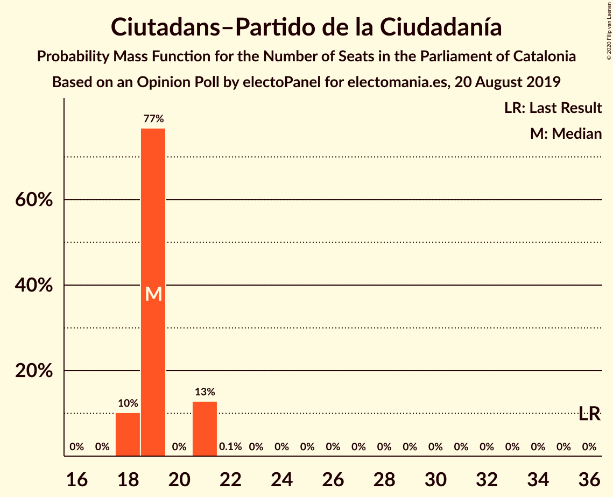

| Number of Seats | Probability | Accumulated | Special Marks |
|:---------------:|:-----------:|:-----------:|:-------------:|
| 14 | 0.1% | 100% |  |
| 15 | 0.1% | 99.9% |  |
| 16 | 2% | 99.8% |  |
| 17 | 3% | 98% |  |
| 18 | 12% | 95% |  |
| 19 | 32% | 83% |  |
| 20 | 36% | 50% | Median |
| 21 | 4% | 15% |  |
| 22 | 5% | 11% |  |
| 23 | 3% | 6% |  |
| 24 | 2% | 3% |  |
| 25 | 0.9% | 1.1% |  |
| 26 | 0.2% | 0.2% |  |
| 27 | 0% | 0% |  |
| 28 | 0% | 0% |  |
| 29 | 0% | 0% |  |
| 30 | 0% | 0% |  |
| 31 | 0% | 0% |  |
| 32 | 0% | 0% |  |
| 33 | 0% | 0% |  |
| 34 | 0% | 0% |  |
| 35 | 0% | 0% |  |
| 36 | 0% | 0% | Last Result |

### Catalunya en Comú–Podem

*For a full overview of the results for this party, see the [Catalunya en Comú–Podem](party-catalunyaencomú–podem.html) page.*

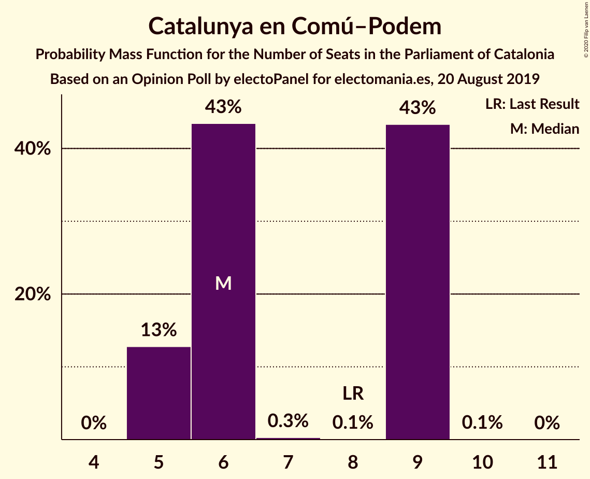

| Number of Seats | Probability | Accumulated | Special Marks |
|:---------------:|:-----------:|:-----------:|:-------------:|
| 4 | 0.1% | 100% |  |
| 5 | 4% | 99.9% |  |
| 6 | 8% | 96% |  |
| 7 | 21% | 88% |  |
| 8 | 44% | 67% | Last Result, Median |
| 9 | 9% | 23% |  |
| 10 | 12% | 14% |  |
| 11 | 2% | 2% |  |
| 12 | 0.1% | 0.2% |  |
| 13 | 0.1% | 0.1% |  |
| 14 | 0% | 0% |  |

### Candidatura d’Unitat Popular

*For a full overview of the results for this party, see the [Candidatura d’Unitat Popular](party-candidaturad’unitatpopular.html) page.*

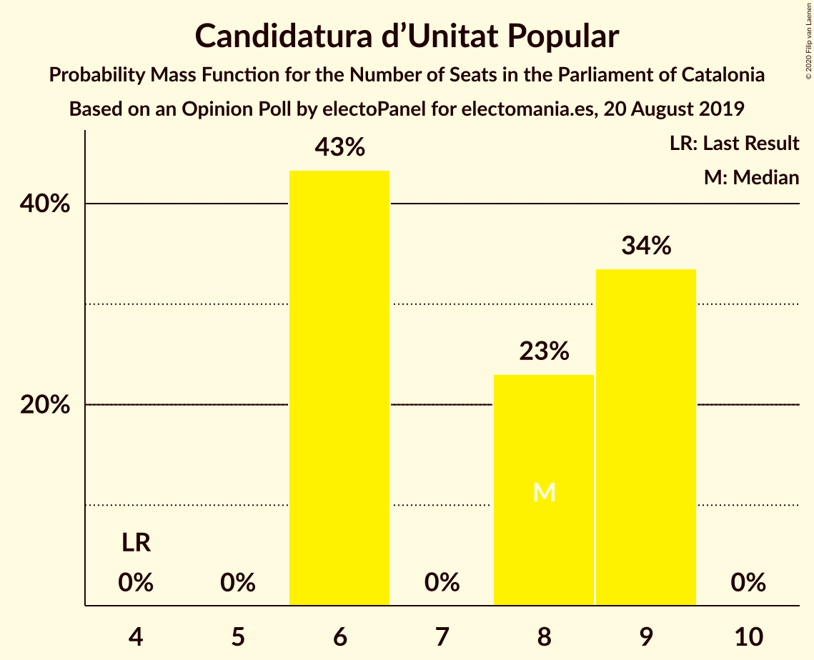

| Number of Seats | Probability | Accumulated | Special Marks |
|:---------------:|:-----------:|:-----------:|:-------------:|
| 4 | 0.8% | 100% | Last Result |
| 5 | 0.5% | 99.2% |  |
| 6 | 6% | 98.7% |  |
| 7 | 20% | 92% |  |
| 8 | 55% | 73% | Median |
| 9 | 13% | 18% |  |
| 10 | 3% | 5% |  |
| 11 | 1.5% | 2% |  |
| 12 | 0% | 0.1% |  |
| 13 | 0% | 0% |  |

### Partit Popular

*For a full overview of the results for this party, see the [Partit Popular](party-partitpopular.html) page.*

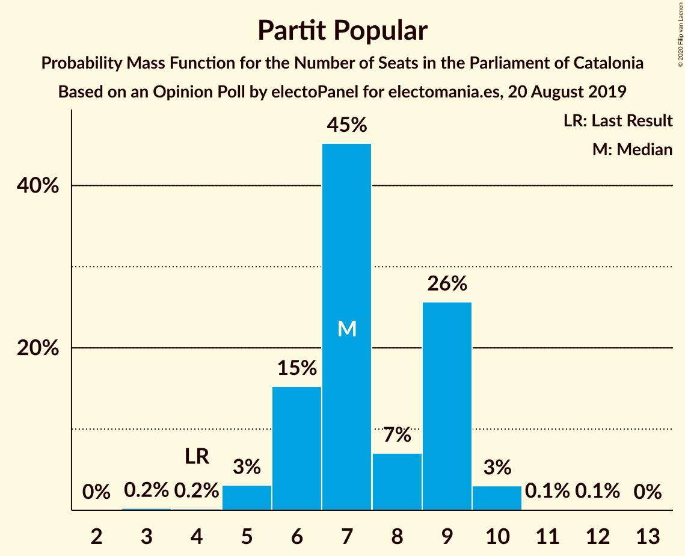

| Number of Seats | Probability | Accumulated | Special Marks |
|:---------------:|:-----------:|:-----------:|:-------------:|
| 3 | 0.2% | 100% |  |
| 4 | 0.2% | 99.8% | Last Result |
| 5 | 3% | 99.6% |  |
| 6 | 15% | 96% |  |
| 7 | 45% | 81% | Median |
| 8 | 7% | 36% |  |
| 9 | 26% | 29% |  |
| 10 | 3% | 3% |  |
| 11 | 0.1% | 0.3% |  |
| 12 | 0.1% | 0.1% |  |
| 13 | 0% | 0% |  |

### Vox

*For a full overview of the results for this party, see the [Vox](party-vox.html) page.*

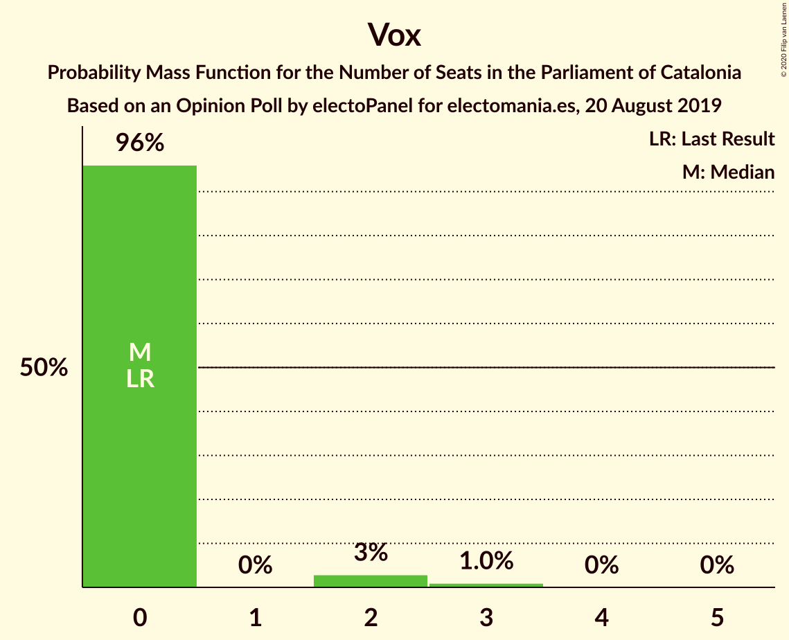

| Number of Seats | Probability | Accumulated | Special Marks |
|:---------------:|:-----------:|:-----------:|:-------------:|
| 0 | 96% | 100% | Last Result, Median |
| 1 | 0% | 4% |  |
| 2 | 3% | 4% |  |
| 3 | 1.0% | 1.0% |  |
| 4 | 0% | 0% |  |

## Coalitions

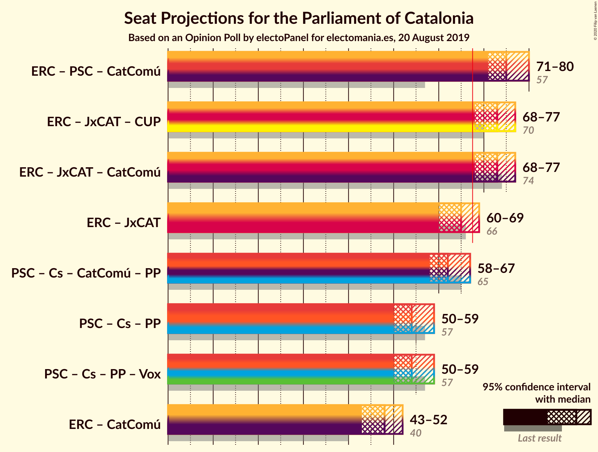

### Confidence Intervals

| Coalition | Last Result | Median | Majority? | 80% Confidence Interval | 90% Confidence Interval | 95% Confidence Interval | 99% Confidence Interval |
|:---------:|:-----------:|:------:|:---------:|:-----------------------:|:-----------------------:|:-----------------------:|:-----------------------:|
| Esquerra Republicana–Catalunya Sí – Partit dels Socialistes de Catalunya (PSC-PSOE) – Catalunya en Comú–Podem | 57 | 75 | 100% | 73–78 | 71–79 | 71–80 | 69–82 |
| Esquerra Republicana–Catalunya Sí – Junts per Catalunya – Candidatura d’Unitat Popular | 70 | 73 | 98% | 70–76 | 68–76 | 68–77 | 66–78 |
| Esquerra Republicana–Catalunya Sí – Junts per Catalunya – Catalunya en Comú–Podem | 74 | 73 | 98% | 69–75 | 68–76 | 68–77 | 66–78 |
| Esquerra Republicana–Catalunya Sí – Junts per Catalunya | 66 | 65 | 11% | 62–68 | 61–68 | 60–69 | 58–70 |
| Partit dels Socialistes de Catalunya (PSC-PSOE) – Ciutadans–Partido de la Ciudadanía – Catalunya en Comú–Podem – Partit Popular | 65 | 62 | 2% | 59–65 | 58–67 | 58–67 | 57–69 |
| Partit dels Socialistes de Catalunya (PSC-PSOE) – Ciutadans–Partido de la Ciudadanía – Partit Popular | 57 | 54 | 0% | 52–58 | 51–59 | 50–59 | 49–61 |
| Partit dels Socialistes de Catalunya (PSC-PSOE) – Ciutadans–Partido de la Ciudadanía – Partit Popular – Vox | 57 | 54 | 0% | 52–58 | 51–59 | 50–59 | 49–61 |
| Esquerra Republicana–Catalunya Sí – Catalunya en Comú–Podem | 40 | 48 | 0% | 45–51 | 44–52 | 43–52 | 42–54 |

### Esquerra Republicana–Catalunya Sí – Partit dels Socialistes de Catalunya (PSC-PSOE) – Catalunya en Comú–Podem

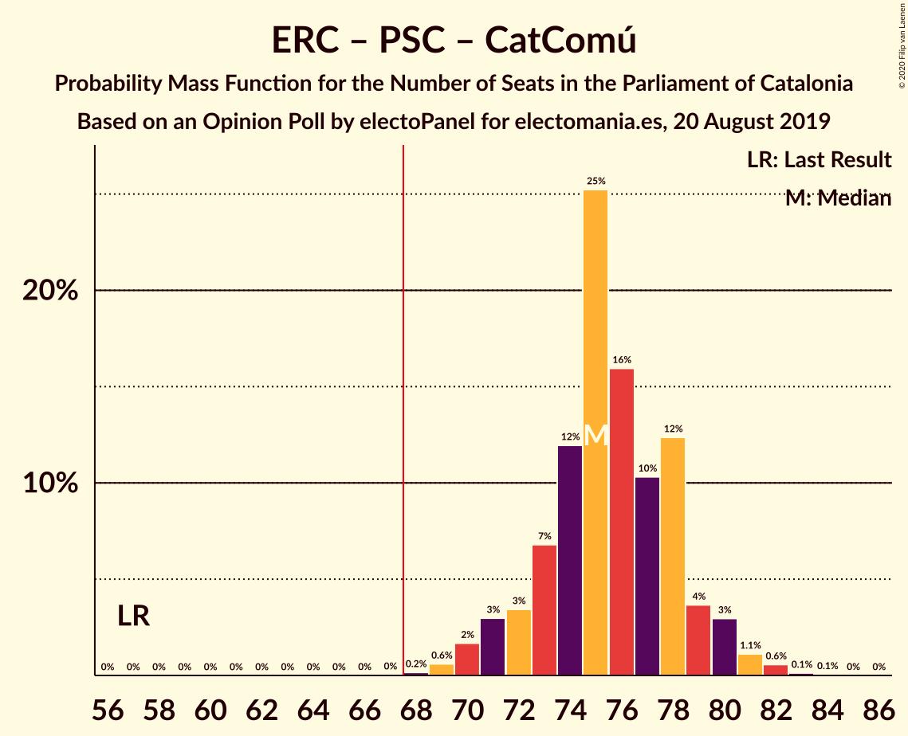

| Number of Seats | Probability | Accumulated | Special Marks |
|:---------------:|:-----------:|:-----------:|:-------------:|
| 57 | 0% | 100% | Last Result |
| 58 | 0% | 100% |  |
| 59 | 0% | 100% |  |
| 60 | 0% | 100% |  |
| 61 | 0% | 100% |  |
| 62 | 0% | 100% |  |
| 63 | 0% | 100% |  |
| 64 | 0% | 100% |  |
| 65 | 0% | 100% |  |
| 66 | 0% | 100% |  |
| 67 | 0% | 100% |  |
| 68 | 0.2% | 100% | Majority |
| 69 | 0.6% | 99.8% |  |
| 70 | 2% | 99.2% |  |
| 71 | 3% | 98% |  |
| 72 | 3% | 95% |  |
| 73 | 7% | 91% |  |
| 74 | 12% | 84% |  |
| 75 | 25% | 72% |  |
| 76 | 16% | 47% | Median |
| 77 | 10% | 31% |  |
| 78 | 12% | 21% |  |
| 79 | 4% | 9% |  |
| 80 | 3% | 5% |  |
| 81 | 1.1% | 2% |  |
| 82 | 0.6% | 0.8% |  |
| 83 | 0.1% | 0.2% |  |
| 84 | 0.1% | 0.1% |  |
| 85 | 0% | 0% |  |

### Esquerra Republicana–Catalunya Sí – Junts per Catalunya – Candidatura d’Unitat Popular

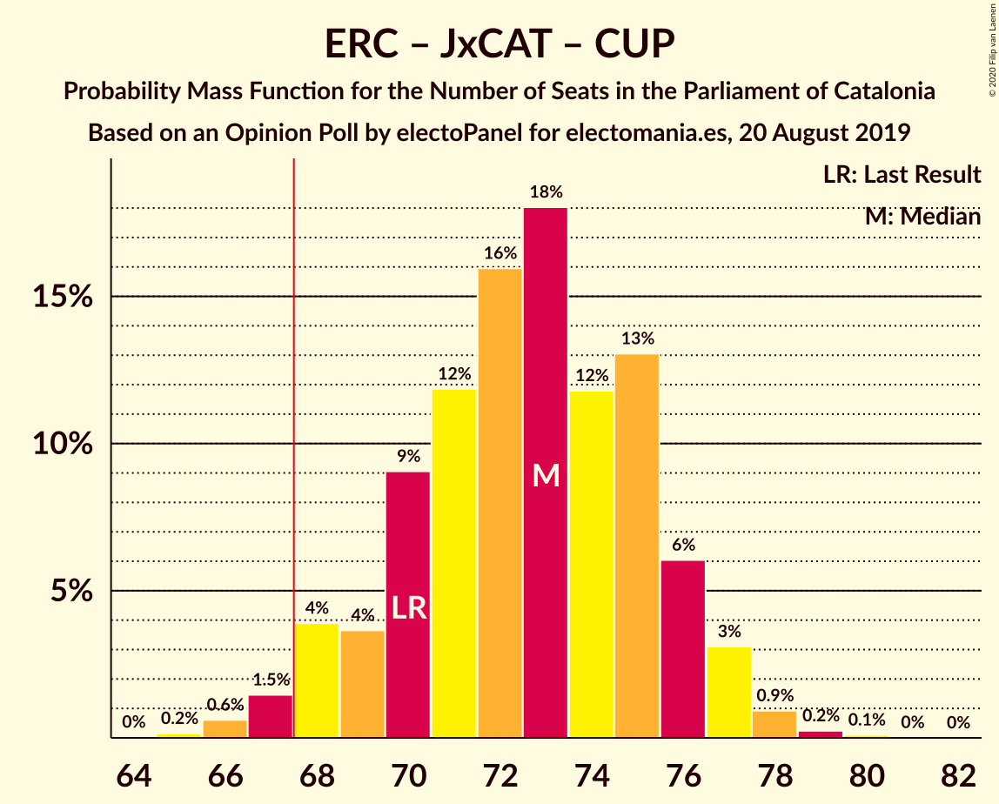

| Number of Seats | Probability | Accumulated | Special Marks |
|:---------------:|:-----------:|:-----------:|:-------------:|
| 65 | 0.2% | 100% |  |
| 66 | 0.6% | 99.8% |  |
| 67 | 1.5% | 99.2% |  |
| 68 | 4% | 98% | Majority |
| 69 | 4% | 94% |  |
| 70 | 9% | 90% | Last Result |
| 71 | 12% | 81% |  |
| 72 | 16% | 69% |  |
| 73 | 18% | 53% | Median |
| 74 | 12% | 35% |  |
| 75 | 13% | 23% |  |
| 76 | 6% | 10% |  |
| 77 | 3% | 4% |  |
| 78 | 0.9% | 1.3% |  |
| 79 | 0.2% | 0.4% |  |
| 80 | 0.1% | 0.1% |  |
| 81 | 0% | 0% |  |

### Esquerra Republicana–Catalunya Sí – Junts per Catalunya – Catalunya en Comú–Podem

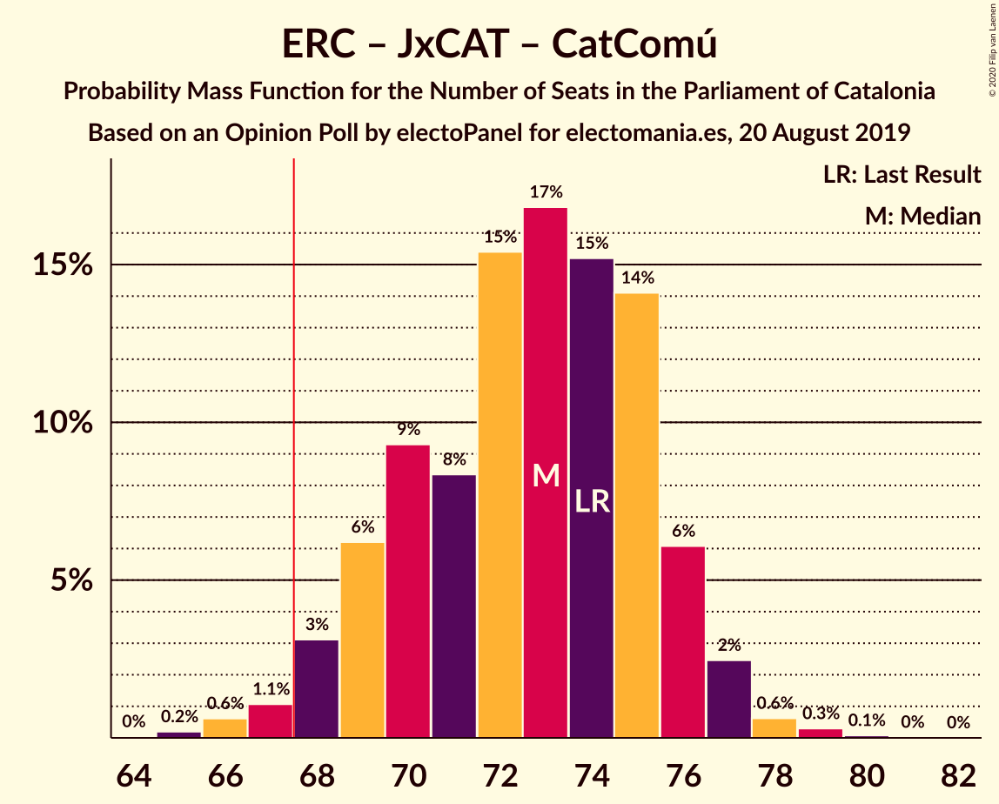

| Number of Seats | Probability | Accumulated | Special Marks |
|:---------------:|:-----------:|:-----------:|:-------------:|
| 64 | 0% | 100% |  |
| 65 | 0.2% | 99.9% |  |
| 66 | 0.6% | 99.8% |  |
| 67 | 1.1% | 99.1% |  |
| 68 | 3% | 98% | Majority |
| 69 | 6% | 95% |  |
| 70 | 9% | 89% |  |
| 71 | 8% | 79% |  |
| 72 | 15% | 71% |  |
| 73 | 17% | 56% | Median |
| 74 | 15% | 39% | Last Result |
| 75 | 14% | 24% |  |
| 76 | 6% | 10% |  |
| 77 | 2% | 3% |  |
| 78 | 0.6% | 1.0% |  |
| 79 | 0.3% | 0.4% |  |
| 80 | 0.1% | 0.1% |  |
| 81 | 0% | 0% |  |

### Esquerra Republicana–Catalunya Sí – Junts per Catalunya

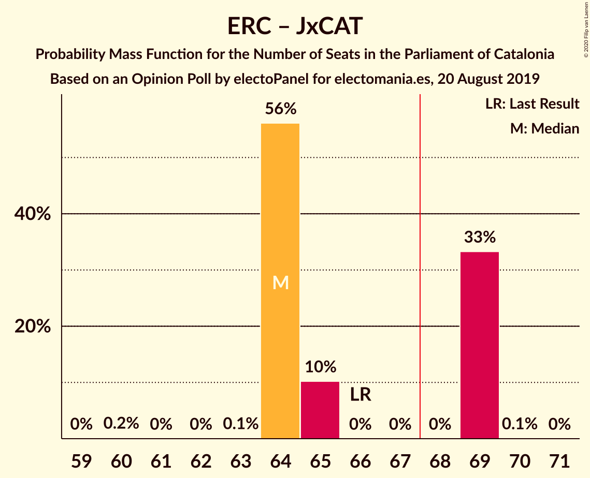

| Number of Seats | Probability | Accumulated | Special Marks |
|:---------------:|:-----------:|:-----------:|:-------------:|
| 57 | 0.1% | 100% |  |
| 58 | 0.6% | 99.9% |  |
| 59 | 1.3% | 99.3% |  |
| 60 | 3% | 98% |  |
| 61 | 5% | 95% |  |
| 62 | 7% | 91% |  |
| 63 | 7% | 84% |  |
| 64 | 23% | 77% |  |
| 65 | 20% | 54% | Median |
| 66 | 10% | 34% | Last Result |
| 67 | 14% | 24% |  |
| 68 | 6% | 11% | Majority |
| 69 | 3% | 4% |  |
| 70 | 1.1% | 2% |  |
| 71 | 0.4% | 0.5% |  |
| 72 | 0.1% | 0.1% |  |
| 73 | 0% | 0% |  |

### Partit dels Socialistes de Catalunya (PSC-PSOE) – Ciutadans–Partido de la Ciudadanía – Catalunya en Comú–Podem – Partit Popular

| Number of Seats | Probability | Accumulated | Special Marks |
|:---------------:|:-----------:|:-----------:|:-------------:|
| 55 | 0.1% | 100% |  |
| 56 | 0.3% | 99.9% |  |
| 57 | 1.0% | 99.6% |  |
| 58 | 4% | 98.5% |  |
| 59 | 6% | 95% |  |
| 60 | 13% | 89% |  |
| 61 | 12% | 76% |  |
| 62 | 18% | 63% | Median |
| 63 | 16% | 45% |  |
| 64 | 12% | 29% |  |
| 65 | 9% | 18% | Last Result |
| 66 | 4% | 9% |  |
| 67 | 4% | 6% |  |
| 68 | 1.3% | 2% | Majority |
| 69 | 0.6% | 0.7% |  |
| 70 | 0.1% | 0.2% |  |
| 71 | 0% | 0% |  |

### Partit dels Socialistes de Catalunya (PSC-PSOE) – Ciutadans–Partido de la Ciudadanía – Partit Popular

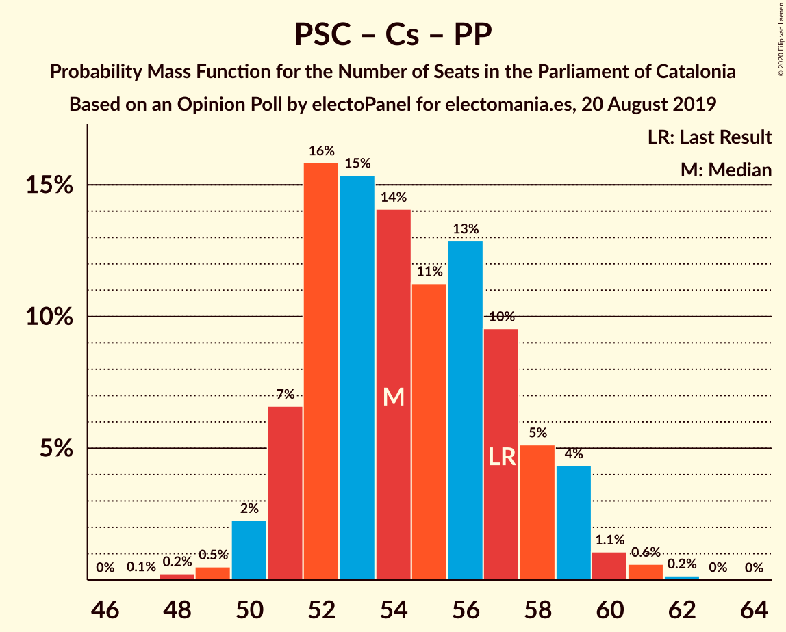

| Number of Seats | Probability | Accumulated | Special Marks |
|:---------------:|:-----------:|:-----------:|:-------------:|
| 47 | 0.1% | 100% |  |
| 48 | 0.2% | 99.9% |  |
| 49 | 0.5% | 99.7% |  |
| 50 | 2% | 99.2% |  |
| 51 | 7% | 97% |  |
| 52 | 16% | 90% |  |
| 53 | 15% | 74% |  |
| 54 | 14% | 59% | Median |
| 55 | 11% | 45% |  |
| 56 | 13% | 34% |  |
| 57 | 10% | 21% | Last Result |
| 58 | 5% | 11% |  |
| 59 | 4% | 6% |  |
| 60 | 1.1% | 2% |  |
| 61 | 0.6% | 0.8% |  |
| 62 | 0.2% | 0.2% |  |
| 63 | 0% | 0% |  |

### Partit dels Socialistes de Catalunya (PSC-PSOE) – Ciutadans–Partido de la Ciudadanía – Partit Popular – Vox

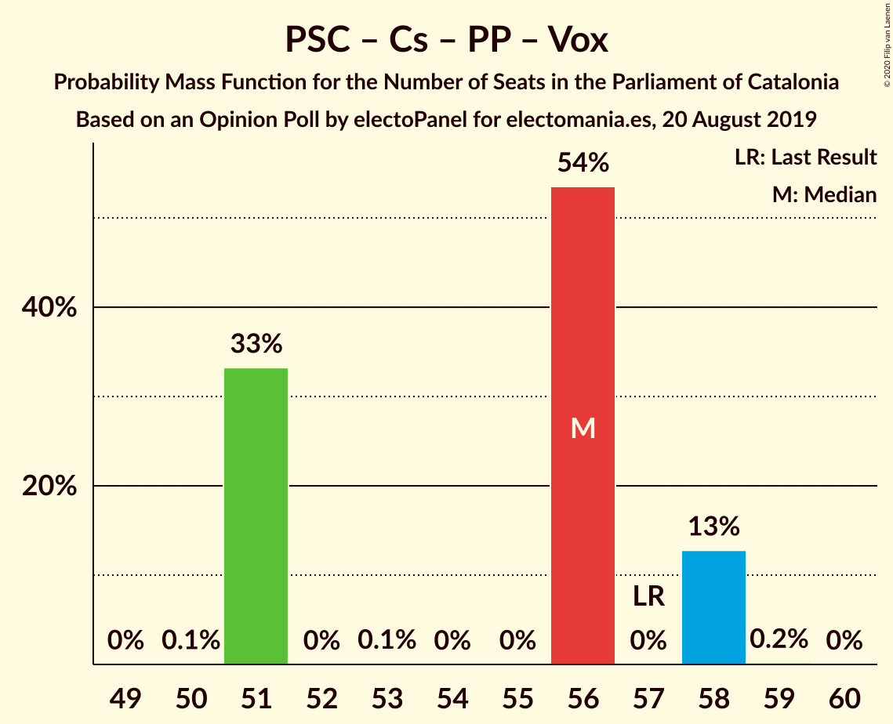

| Number of Seats | Probability | Accumulated | Special Marks |
|:---------------:|:-----------:|:-----------:|:-------------:|
| 47 | 0% | 100% |  |
| 48 | 0.2% | 99.9% |  |
| 49 | 0.4% | 99.7% |  |
| 50 | 2% | 99.3% |  |
| 51 | 6% | 97% |  |
| 52 | 16% | 91% |  |
| 53 | 15% | 75% |  |
| 54 | 14% | 60% | Median |
| 55 | 11% | 46% |  |
| 56 | 13% | 35% |  |
| 57 | 10% | 22% | Last Result |
| 58 | 5% | 12% |  |
| 59 | 4% | 7% |  |
| 60 | 1.2% | 2% |  |
| 61 | 0.7% | 0.9% |  |
| 62 | 0.2% | 0.2% |  |
| 63 | 0% | 0.1% |  |
| 64 | 0% | 0% |  |

### Esquerra Republicana–Catalunya Sí – Catalunya en Comú–Podem

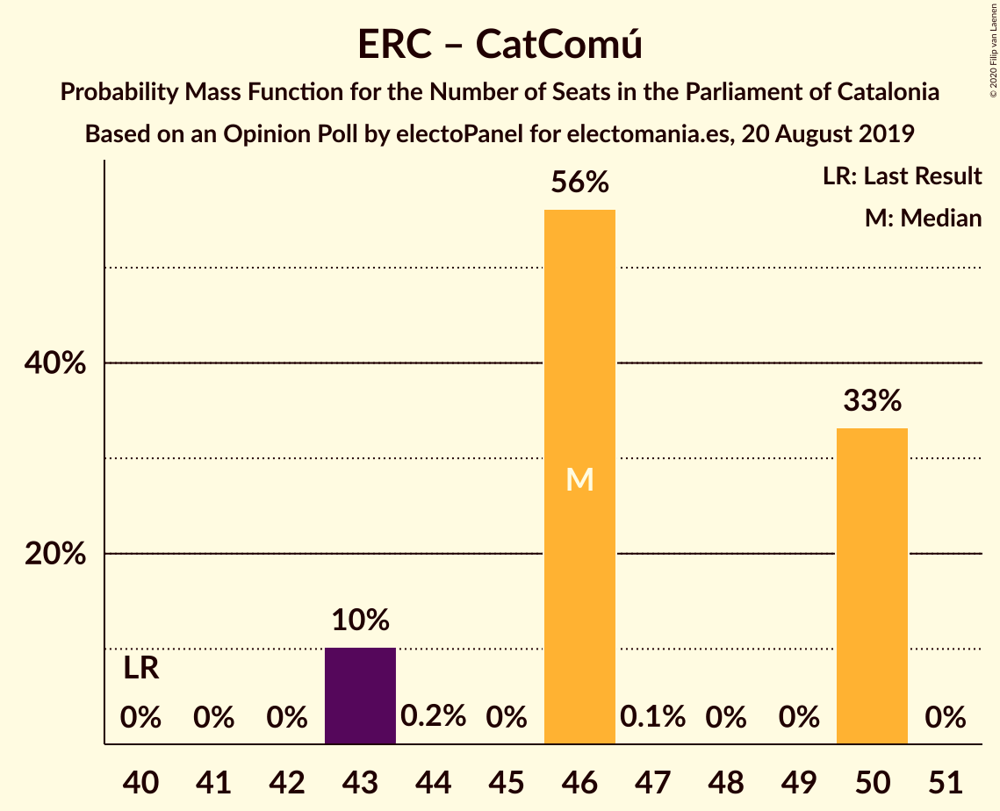

| Number of Seats | Probability | Accumulated | Special Marks |
|:---------------:|:-----------:|:-----------:|:-------------:|
| 40 | 0% | 100% | Last Result |
| 41 | 0.1% | 100% |  |
| 42 | 0.6% | 99.8% |  |
| 43 | 3% | 99.3% |  |
| 44 | 3% | 96% |  |
| 45 | 8% | 93% |  |
| 46 | 9% | 85% |  |
| 47 | 9% | 77% |  |
| 48 | 20% | 68% |  |
| 49 | 17% | 48% | Median |
| 50 | 17% | 30% |  |
| 51 | 8% | 14% |  |
| 52 | 3% | 6% |  |
| 53 | 1.3% | 2% |  |
| 54 | 0.6% | 1.0% |  |
| 55 | 0.3% | 0.4% |  |
| 56 | 0.1% | 0.1% |  |
| 57 | 0% | 0% |  |

## Technical Information

### Opinion Poll

+ **Polling firm:** electoPanel
+ **Commissioner(s):** electomania.es
+ **Fieldwork period:** 20 August 2019

### Calculations

+ **Sample size:** 1000
+ **Simulations done:** 1,048,576
+ **Error estimate:** 1.05%

