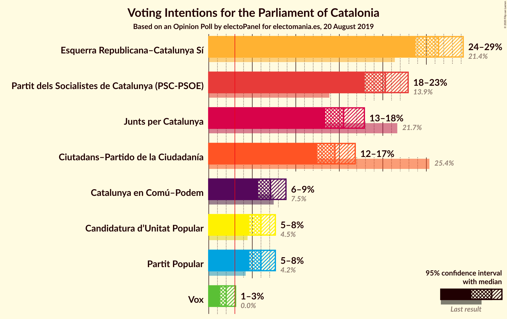
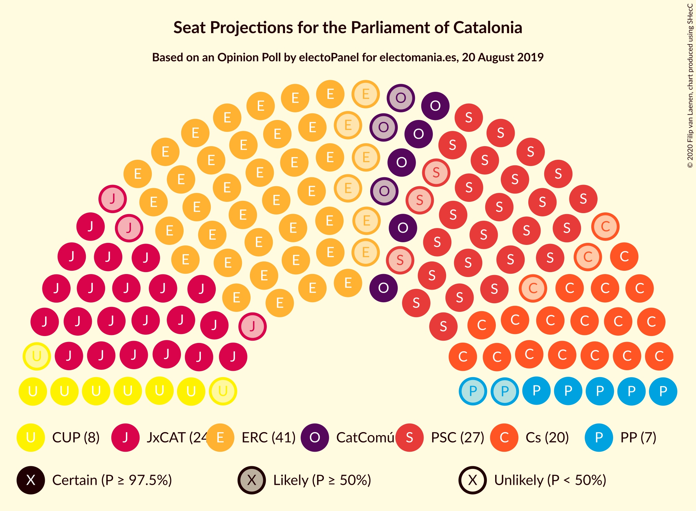
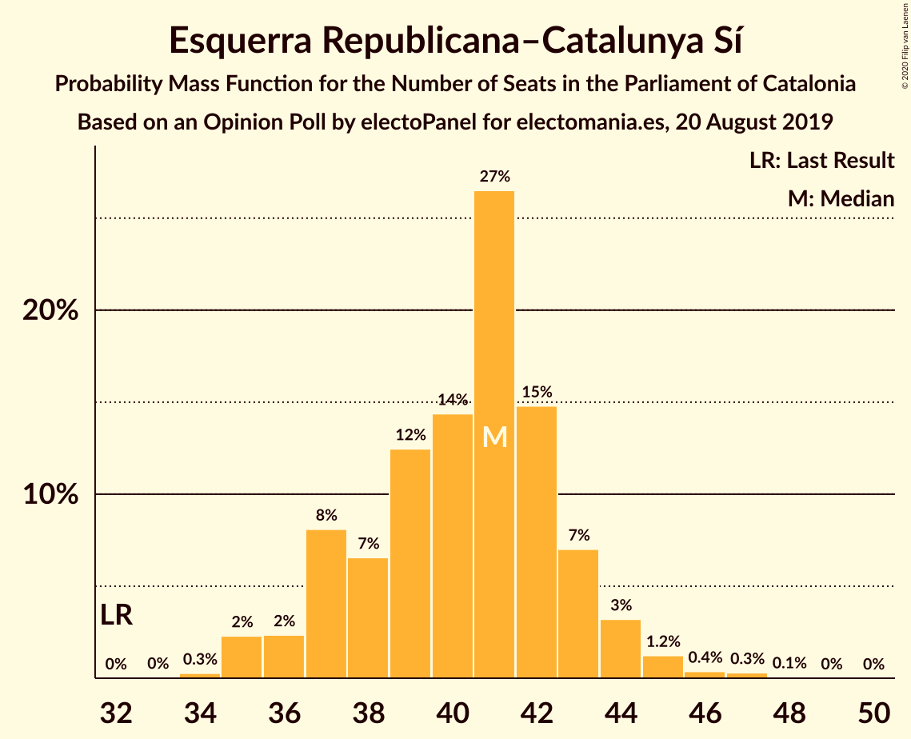
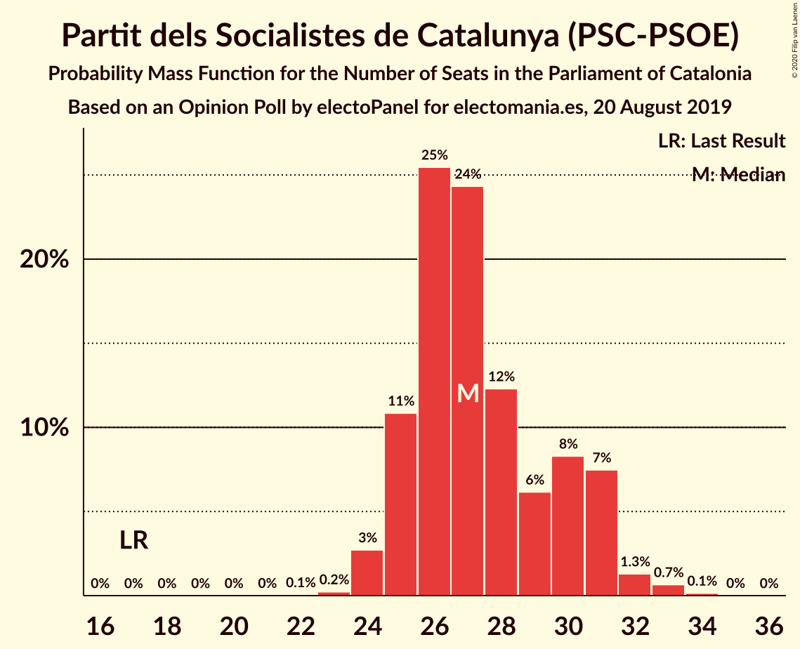
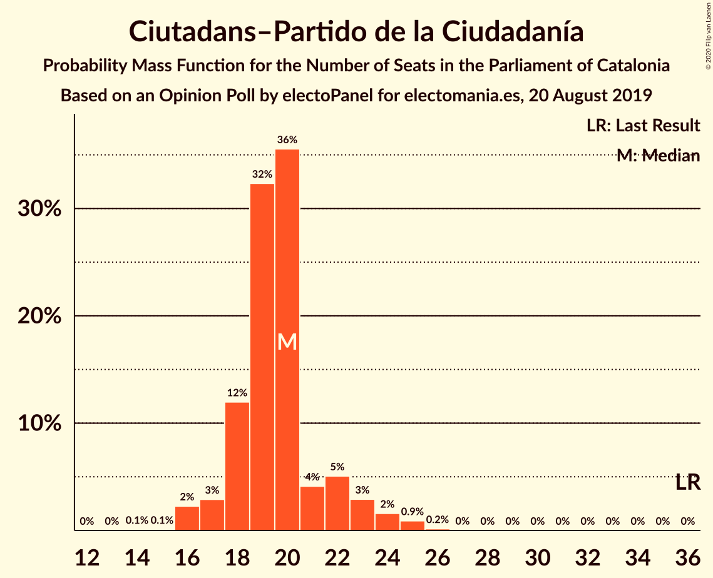
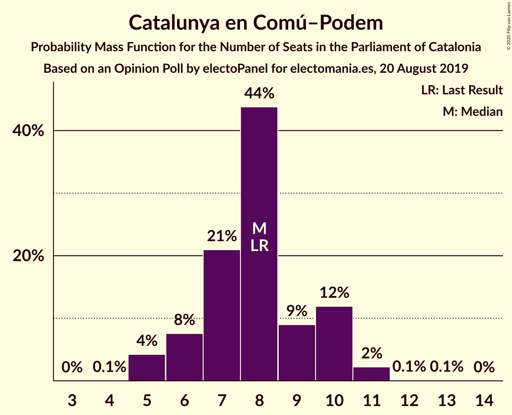
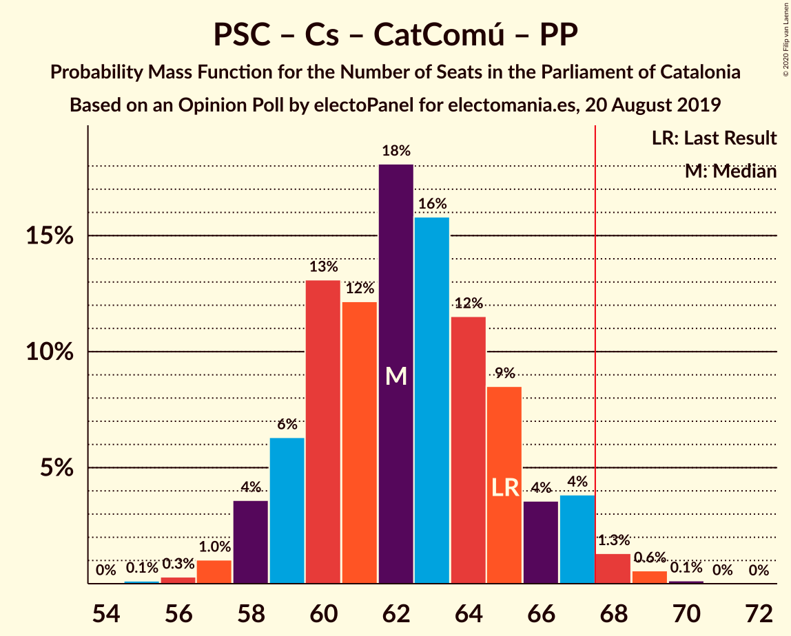
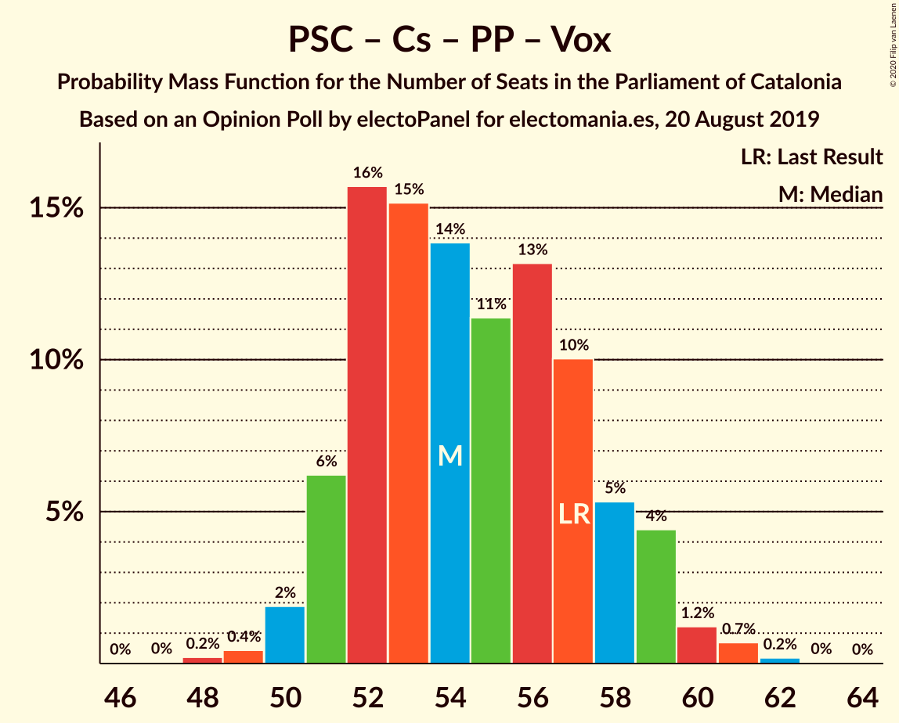
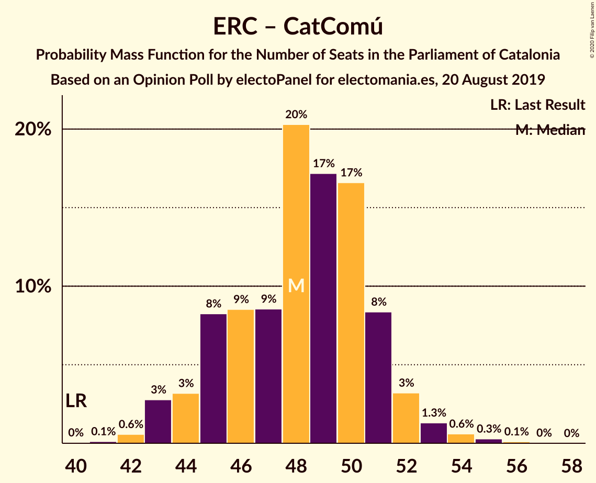

# Opinion Poll by electoPanel for electomania.es, 20 August 2019

<a href="#voting-intentions">Voting Intentions</a> | <a href="#seats">Seats</a> | <a href="#coalitions">Coalitions</a> | <a href="#technical-information">Technical Information</a>

## Voting Intentions

### Confidence Intervals

| Party | Last Result | Poll Result | 80% Confidence Interval | 90% Confidence Interval | 95% Confidence Interval | 99% Confidence Interval |
|:-----:|:-----------:|:-----------:|:-----------------------:|:-----------------------:|:-----------------------:|:-----------------------:|
| Esquerra Republicana–Catalunya Sí | 21.4% | 26.4% | 24.7–28.2% |24.2–28.8% |23.8–29.2% |22.9–30.1% |
| Partit dels Socialistes de Catalunya (PSC-PSOE) | 13.9% | 20.3% | 18.7–22.0% |18.3–22.5% |17.9–22.9% |17.2–23.7% |
| Junts pel Catalunya | 21.7% | 15.5% | 14.1–17.1% |13.7–17.5% |13.4–17.9% |12.7–18.7% |
| Ciutadans–Partido de la Ciudadanía | 25.4% | 14.5% | 13.2–16.0% |12.8–16.4% |12.5–16.8% |11.8–17.6% |
| Catalunya en Comú–Podem | 7.5% | 7.1% | 6.2–8.3% |5.9–8.6% |5.7–8.9% |5.2–9.4% |
| Candidatura d’Unitat Popular | 4.5% | 6.0% | 5.1–7.1% |4.9–7.4% |4.7–7.7% |4.3–8.2% |
| Partit Popular | 4.2% | 6.0% | 5.1–7.1% |4.9–7.4% |4.7–7.7% |4.3–8.2% |
| Vox | 0.0% | 2.0% | 1.5–2.7% |1.4–2.9% |1.3–3.1% |1.1–3.4% |

*Note:* The poll result column reflects the actual value used in the calculations. Published results may vary slightly, and in addition be rounded to fewer digits.

## Seats

### Confidence Intervals

| Party | Last Result | Median | 80% Confidence Interval | 90% Confidence Interval | 95% Confidence Interval | 99% Confidence Interval |
|:-----:|:-----------:|:------:|:-----------------------:|:-----------------------:|:-----------------------:|:-----------------------:|
| <a href="#esquerra-republicana–catalunya-sí">Esquerra Republicana–Catalunya Sí</a> | 32 | 37 | 37–44 |37–44 |37–44 |37–44 |
| <a href="#partit-dels-socialistes-de-catalunya-(psc-psoe)">Partit dels Socialistes de Catalunya (PSC-PSOE)</a> | 17 | 30 | 24–31 |24–31 |24–31 |24–31 |
| <a href="#junts-pel-catalunya">Junts pel Catalunya</a> | 34 | 27 | 23–28 |23–28 |23–28 |23–28 |
| <a href="#ciutadans–partido-de-la-ciudadanía">Ciutadans–Partido de la Ciudadanía</a> | 36 | 19 | 18–21 |18–21 |18–21 |18–21 |
| <a href="#catalunya-en-comú–podem">Catalunya en Comú–Podem</a> | 8 | 6 | 5–9 |5–9 |5–9 |5–9 |
| <a href="#candidatura-d’unitat-popular">Candidatura d’Unitat Popular</a> | 4 | 8 | 6–9 |6–9 |6–9 |6–9 |
| <a href="#partit-popular">Partit Popular</a> | 4 | 7 | 6–8 |6–8 |6–8 |6–8 |
| <a href="#vox">Vox</a> | 0 | 0 | 0 |0 |0 |0 |

### Esquerra Republicana–Catalunya Sí

*For a full overview of the results for this party, see the [Esquerra Republicana–Catalunya Sí](party-esquerrarepublicana–catalunyasí.html) page.*

| Number of Seats | Probability | Accumulated | Special Marks |
|:---------------:|:-----------:|:-----------:|:-------------:|
| 32 | 0% | 100% | Last Result |
| 33 | 0% | 100% |  |
| 34 | 0% | 100% |  |
| 35 | 0% | 100% |  |
| 36 | 0% | 100% |  |
| 37 | 54% | 100% | Median |
| 38 | 0% | 46% |  |
| 39 | 0.1% | 46% |  |
| 40 | 0% | 46% |  |
| 41 | 13% | 46% |  |
| 42 | 0% | 33% |  |
| 43 | 0% | 33% |  |
| 44 | 33% | 33% |  |
| 45 | 0% | 0% |  |

### Partit dels Socialistes de Catalunya (PSC-PSOE)

*For a full overview of the results for this party, see the [Partit dels Socialistes de Catalunya (PSC-PSOE)](party-partitdelssocialistesdecatalunyapsc-psoe.html) page.*

| Number of Seats | Probability | Accumulated | Special Marks |
|:---------------:|:-----------:|:-----------:|:-------------:|
| 17 | 0% | 100% | Last Result |
| 18 | 0% | 100% |  |
| 19 | 0% | 100% |  |
| 20 | 0% | 100% |  |
| 21 | 0.1% | 100% |  |
| 22 | 0% | 99.9% |  |
| 23 | 0% | 99.9% |  |
| 24 | 33% | 99.9% |  |
| 25 | 0% | 67% |  |
| 26 | 0.1% | 67% |  |
| 27 | 0.1% | 67% |  |
| 28 | 0% | 67% |  |
| 29 | 0% | 67% |  |
| 30 | 44% | 66% | Median |
| 31 | 23% | 23% |  |
| 32 | 0% | 0% |  |

### Junts pel Catalunya

*For a full overview of the results for this party, see the [Junts pel Catalunya](party-juntspelcatalunya.html) page.*

| Number of Seats | Probability | Accumulated | Special Marks |
|:---------------:|:-----------:|:-----------:|:-------------:|
| 23 | 13% | 100% |  |
| 24 | 0% | 87% |  |
| 25 | 33% | 87% |  |
| 26 | 0.1% | 54% |  |
| 27 | 43% | 54% | Median |
| 28 | 10% | 10% |  |
| 29 | 0% | 0.1% |  |
| 30 | 0% | 0.1% |  |
| 31 | 0.1% | 0.1% |  |
| 32 | 0% | 0% |  |
| 33 | 0% | 0% |  |
| 34 | 0% | 0% | Last Result |

### Ciutadans–Partido de la Ciudadanía

*For a full overview of the results for this party, see the [Ciutadans–Partido de la Ciudadanía](party-ciutadans–partidodelaciudadanía.html) page.*

| Number of Seats | Probability | Accumulated | Special Marks |
|:---------------:|:-----------:|:-----------:|:-------------:|
| 17 | 0% | 100% |  |
| 18 | 10% | 99.9% |  |
| 19 | 77% | 90% | Median |
| 20 | 0% | 13% |  |
| 21 | 13% | 13% |  |
| 22 | 0.1% | 0.1% |  |
| 23 | 0% | 0% |  |
| 24 | 0% | 0% |  |
| 25 | 0% | 0% |  |
| 26 | 0% | 0% |  |
| 27 | 0% | 0% |  |
| 28 | 0% | 0% |  |
| 29 | 0% | 0% |  |
| 30 | 0% | 0% |  |
| 31 | 0% | 0% |  |
| 32 | 0% | 0% |  |
| 33 | 0% | 0% |  |
| 34 | 0% | 0% |  |
| 35 | 0% | 0% |  |
| 36 | 0% | 0% | Last Result |

### Catalunya en Comú–Podem

*For a full overview of the results for this party, see the [Catalunya en Comú–Podem](party-catalunyaencomú–podem.html) page.*

| Number of Seats | Probability | Accumulated | Special Marks |
|:---------------:|:-----------:|:-----------:|:-------------:|
| 5 | 13% | 100% |  |
| 6 | 43% | 87% | Median |
| 7 | 0.3% | 44% |  |
| 8 | 0.1% | 43% | Last Result |
| 9 | 43% | 43% |  |
| 10 | 0.1% | 0.1% |  |
| 11 | 0% | 0% |  |

### Candidatura d’Unitat Popular

*For a full overview of the results for this party, see the [Candidatura d’Unitat Popular](party-candidaturad’unitatpopular.html) page.*

| Number of Seats | Probability | Accumulated | Special Marks |
|:---------------:|:-----------:|:-----------:|:-------------:|
| 4 | 0% | 100% | Last Result |
| 5 | 0% | 100% |  |
| 6 | 43% | 100% |  |
| 7 | 0% | 57% |  |
| 8 | 23% | 57% | Median |
| 9 | 34% | 34% |  |
| 10 | 0% | 0% |  |

### Partit Popular

*For a full overview of the results for this party, see the [Partit Popular](party-partitpopular.html) page.*

| Number of Seats | Probability | Accumulated | Special Marks |
|:---------------:|:-----------:|:-----------:|:-------------:|
| 4 | 0% | 100% | Last Result |
| 5 | 0% | 100% |  |
| 6 | 13% | 99.9% |  |
| 7 | 54% | 87% | Median |
| 8 | 33% | 33% |  |
| 9 | 0% | 0.2% |  |
| 10 | 0.2% | 0.2% |  |
| 11 | 0% | 0% |  |

### Vox

*For a full overview of the results for this party, see the [Vox](party-vox.html) page.*

| Number of Seats | Probability | Accumulated | Special Marks |
|:---------------:|:-----------:|:-----------:|:-------------:|
| 0 | 100% | 100% | Last Result, Median |

## Coalitions

### Confidence Intervals

| Coalition | Last Result | Median | Majority? | 80% Confidence Interval | 90% Confidence Interval | 95% Confidence Interval | 99% Confidence Interval |
|:---------:|:-----------:|:------:|:---------:|:-----------------------:|:-----------------------:|:-----------------------:|:-----------------------:|
| Esquerra Republicana–Catalunya Sí – Junts pel Catalunya – Candidatura d’Unitat Popular | 70 | 72 | 100% | 70–78 | 70–78 | 70–78 | 70–78 |
| Esquerra Republicana–Catalunya Sí – Partit dels Socialistes de Catalunya (PSC-PSOE) – Catalunya en Comú–Podem | 57 | 76 | 99.9% | 74–77 | 74–77 | 74–77 | 74–77 |
| Esquerra Republicana–Catalunya Sí – Junts pel Catalunya – Catalunya en Comú–Podem | 74 | 73 | 99.8% | 69–75 | 69–75 | 69–75 | 69–75 |
| Esquerra Republicana–Catalunya Sí – Junts pel Catalunya | 66 | 64 | 33% | 64–69 | 64–69 | 64–69 | 64–69 |
| Partit dels Socialistes de Catalunya (PSC-PSOE) – Ciutadans–Partido de la Ciudadanía – Catalunya en Comú–Podem – Partit Popular | 65 | 63 | 0% | 57–65 | 57–65 | 57–65 | 57–65 |
| Partit dels Socialistes de Catalunya (PSC-PSOE) – Ciutadans–Partido de la Ciudadanía – Partit Popular | 57 | 56 | 0% | 51–58 | 51–58 | 51–58 | 51–58 |
| Partit dels Socialistes de Catalunya (PSC-PSOE) – Ciutadans–Partido de la Ciudadanía – Partit Popular – Vox | 57 | 56 | 0% | 51–58 | 51–58 | 51–58 | 51–58 |
| Esquerra Republicana–Catalunya Sí – Catalunya en Comú–Podem | 40 | 46 | 0% | 43–50 | 43–50 | 43–50 | 43–50 |

### Esquerra Republicana–Catalunya Sí – Junts pel Catalunya – Candidatura d’Unitat Popular

| Number of Seats | Probability | Accumulated | Special Marks |
|:---------------:|:-----------:|:-----------:|:-------------:|
| 69 | 0.2% | 100% |  |
| 70 | 43% | 99.8% | Last Result |
| 71 | 0% | 56% |  |
| 72 | 13% | 56% | Median |
| 73 | 10% | 44% |  |
| 74 | 0% | 33% |  |
| 75 | 0% | 33% |  |
| 76 | 0% | 33% |  |
| 77 | 0% | 33% |  |
| 78 | 33% | 33% |  |
| 79 | 0% | 0% |  |

### Esquerra Republicana–Catalunya Sí – Partit dels Socialistes de Catalunya (PSC-PSOE) – Catalunya en Comú–Podem

| Number of Seats | Probability | Accumulated | Special Marks |
|:---------------:|:-----------:|:-----------:|:-------------:|
| 57 | 0% | 100% | Last Result |
| 58 | 0% | 100% |  |
| 59 | 0% | 100% |  |
| 60 | 0% | 100% |  |
| 61 | 0% | 100% |  |
| 62 | 0% | 100% |  |
| 63 | 0% | 100% |  |
| 64 | 0% | 100% |  |
| 65 | 0% | 100% |  |
| 66 | 0% | 100% |  |
| 67 | 0.1% | 100% |  |
| 68 | 0% | 99.9% | Majority |
| 69 | 0% | 99.9% |  |
| 70 | 0% | 99.9% |  |
| 71 | 0% | 99.9% |  |
| 72 | 0% | 99.9% |  |
| 73 | 0.1% | 99.9% | Median |
| 74 | 44% | 99.8% |  |
| 75 | 0% | 56% |  |
| 76 | 43% | 56% |  |
| 77 | 13% | 13% |  |
| 78 | 0% | 0.1% |  |
| 79 | 0% | 0% |  |

### Esquerra Republicana–Catalunya Sí – Junts pel Catalunya – Catalunya en Comú–Podem

| Number of Seats | Probability | Accumulated | Special Marks |
|:---------------:|:-----------:|:-----------:|:-------------:|
| 67 | 0.2% | 100% |  |
| 68 | 0% | 99.8% | Majority |
| 69 | 13% | 99.8% |  |
| 70 | 0% | 87% | Median |
| 71 | 10% | 87% |  |
| 72 | 0% | 77% |  |
| 73 | 43% | 77% |  |
| 74 | 0% | 33% | Last Result |
| 75 | 33% | 33% |  |
| 76 | 0% | 0.1% |  |
| 77 | 0.1% | 0.1% |  |
| 78 | 0% | 0% |  |

### Esquerra Republicana–Catalunya Sí – Junts pel Catalunya

| Number of Seats | Probability | Accumulated | Special Marks |
|:---------------:|:-----------:|:-----------:|:-------------:|
| 60 | 0.2% | 100% |  |
| 61 | 0% | 99.8% |  |
| 62 | 0% | 99.8% |  |
| 63 | 0.1% | 99.8% |  |
| 64 | 56% | 99.7% | Median |
| 65 | 10% | 44% |  |
| 66 | 0% | 33% | Last Result |
| 67 | 0% | 33% |  |
| 68 | 0% | 33% | Majority |
| 69 | 33% | 33% |  |
| 70 | 0.1% | 0.1% |  |
| 71 | 0% | 0% |  |

### Partit dels Socialistes de Catalunya (PSC-PSOE) – Ciutadans–Partido de la Ciudadanía – Catalunya en Comú–Podem – Partit Popular

| Number of Seats | Probability | Accumulated | Special Marks |
|:---------------:|:-----------:|:-----------:|:-------------:|
| 57 | 33% | 100% |  |
| 58 | 0% | 67% |  |
| 59 | 0% | 67% |  |
| 60 | 0% | 67% |  |
| 61 | 0% | 67% |  |
| 62 | 10% | 67% | Median |
| 63 | 13% | 56% |  |
| 64 | 0% | 44% |  |
| 65 | 43% | 44% | Last Result |
| 66 | 0.2% | 0.2% |  |
| 67 | 0% | 0% |  |

### Partit dels Socialistes de Catalunya (PSC-PSOE) – Ciutadans–Partido de la Ciudadanía – Partit Popular

| Number of Seats | Probability | Accumulated | Special Marks |
|:---------------:|:-----------:|:-----------:|:-------------:|
| 50 | 0.1% | 100% |  |
| 51 | 33% | 99.9% |  |
| 52 | 0% | 67% |  |
| 53 | 0.1% | 67% |  |
| 54 | 0% | 67% |  |
| 55 | 0% | 67% |  |
| 56 | 54% | 67% | Median |
| 57 | 0% | 13% | Last Result |
| 58 | 13% | 13% |  |
| 59 | 0.2% | 0.2% |  |
| 60 | 0% | 0% |  |

### Partit dels Socialistes de Catalunya (PSC-PSOE) – Ciutadans–Partido de la Ciudadanía – Partit Popular – Vox

| Number of Seats | Probability | Accumulated | Special Marks |
|:---------------:|:-----------:|:-----------:|:-------------:|
| 50 | 0.1% | 100% |  |
| 51 | 33% | 99.9% |  |
| 52 | 0% | 67% |  |
| 53 | 0.1% | 67% |  |
| 54 | 0% | 67% |  |
| 55 | 0% | 67% |  |
| 56 | 54% | 67% | Median |
| 57 | 0% | 13% | Last Result |
| 58 | 13% | 13% |  |
| 59 | 0.2% | 0.2% |  |
| 60 | 0% | 0% |  |

### Esquerra Republicana–Catalunya Sí – Catalunya en Comú–Podem

| Number of Seats | Probability | Accumulated | Special Marks |
|:---------------:|:-----------:|:-----------:|:-------------:|
| 40 | 0% | 100% | Last Result |
| 41 | 0% | 100% |  |
| 42 | 0% | 100% |  |
| 43 | 10% | 100% | Median |
| 44 | 0.2% | 90% |  |
| 45 | 0% | 90% |  |
| 46 | 56% | 90% |  |
| 47 | 0.1% | 33% |  |
| 48 | 0% | 33% |  |
| 49 | 0% | 33% |  |
| 50 | 33% | 33% |  |
| 51 | 0% | 0% |  |

## Technical Information

### Opinion Poll

+ **Polling firm:** electoPanel
+ **Commissioner(s):** electomania.es
+ **Fieldwork period:** 20 August 2019

### Calculations

+ **Sample size:** 1000
+ **Simulations done:** 1,024
+ **Error estimate:** 2.24%

