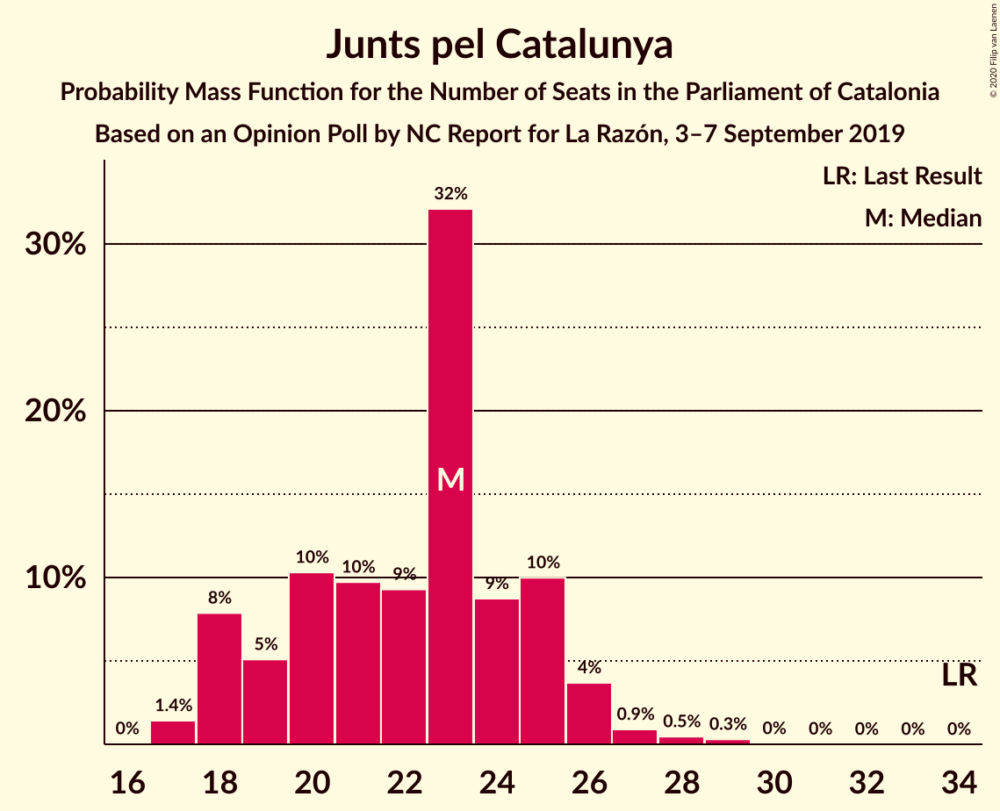
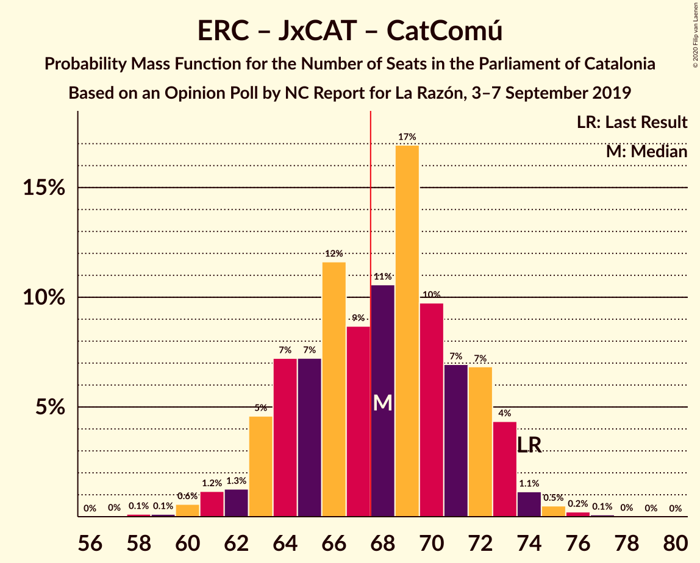
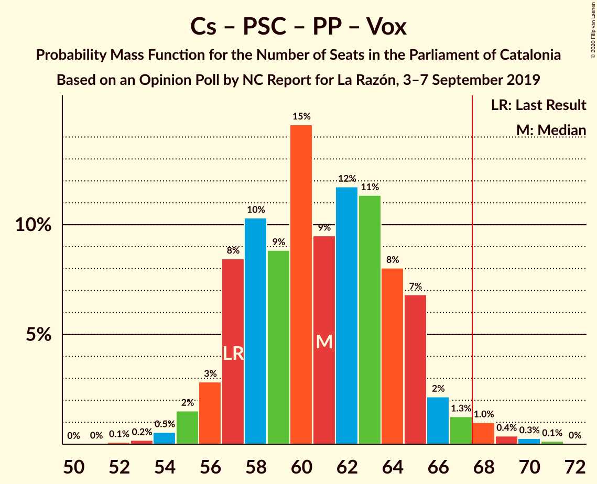
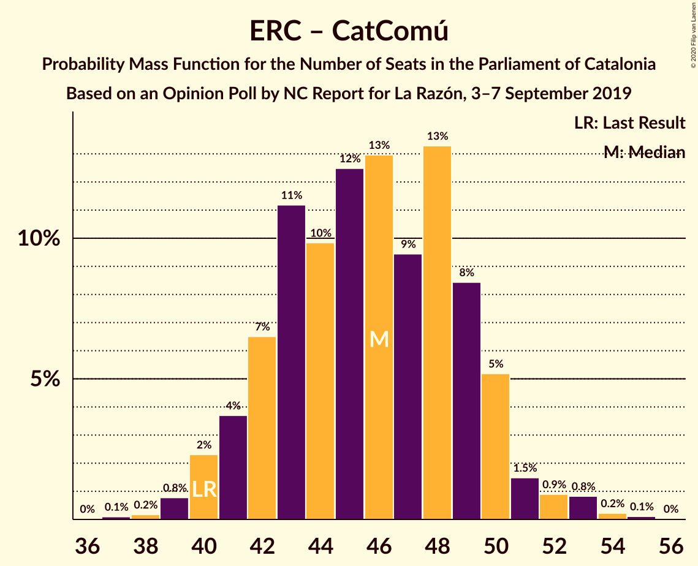

# Opinion Poll by NC Report for La Razón, 3–7 September 2019

<a href="#voting-intentions">Voting Intentions</a> | <a href="#seats">Seats</a> | <a href="#coalitions">Coalitions</a> | <a href="#technical-information">Technical Information</a>

## Voting Intentions

### Confidence Intervals

| Party | Last Result | Poll Result | 80% Confidence Interval | 90% Confidence Interval | 95% Confidence Interval | 99% Confidence Interval |
|:-----:|:-----------:|:-----------:|:-----------------------:|:-----------------------:|:-----------------------:|:-----------------------:|
| Esquerra Republicana–Catalunya Sí | 21.4% | 25.7% | 23.6–27.8% |23.1–28.5% |22.6–29.0% |21.7–30.1% |
| Ciutadans–Partido de la Ciudadanía | 25.4% | 21.0% | 19.2–23.1% |18.7–23.7% |18.2–24.2% |17.3–25.2% |
| Partit dels Socialistes de Catalunya (PSC-PSOE) | 13.9% | 19.1% | 17.3–21.1% |16.8–21.6% |16.4–22.1% |15.5–23.1% |
| Junts pel Catalunya | 21.7% | 14.0% | 12.5–15.8% |12.0–16.3% |11.7–16.8% |11.0–17.7% |
| Catalunya en Comú–Podem | 7.5% | 6.2% | 5.2–7.5% |4.9–7.9% |4.6–8.2% |4.2–8.9% |
| Candidatura d’Unitat Popular | 4.5% | 4.9% | 4.0–6.1% |3.8–6.4% |3.6–6.8% |3.2–7.4% |
| Partit Popular | 4.2% | 4.8% | 3.9–6.0% |3.6–6.3% |3.4–6.6% |3.0–7.2% |
| Vox | 0.0% | 2.2% | 1.7–3.1% |1.5–3.4% |1.4–3.6% |1.2–4.1% |

*Note:* The poll result column reflects the actual value used in the calculations. Published results may vary slightly, and in addition be rounded to fewer digits.

## Seats

### Confidence Intervals

| Party | Last Result | Median | 80% Confidence Interval | 90% Confidence Interval | 95% Confidence Interval | 99% Confidence Interval |
|:-----:|:-----------:|:------:|:-----------------------:|:-----------------------:|:-----------------------:|:-----------------------:|
| <a href="#esquerra-republicana–catalunya-sí">Esquerra Republicana–Catalunya Sí</a> | 32 | 39 | 35–43 |35–44 |34–45 |33–46 |
| <a href="#ciutadans–partido-de-la-ciudadanía">Ciutadans–Partido de la Ciudadanía</a> | 36 | 29 | 27–33 |26–34 |26–34 |25–36 |
| <a href="#partit-dels-socialistes-de-catalunya-(psc-psoe)">Partit dels Socialistes de Catalunya (PSC-PSOE)</a> | 17 | 25 | 24–29 |23–30 |22–30 |20–32 |
| <a href="#junts-pel-catalunya">Junts pel Catalunya</a> | 34 | 23 | 19–25 |18–26 |18–26 |17–28 |
| <a href="#catalunya-en-comú–podem">Catalunya en Comú–Podem</a> | 8 | 7 | 5–8 |5–9 |4–10 |4–11 |
| <a href="#candidatura-d’unitat-popular">Candidatura d’Unitat Popular</a> | 4 | 6 | 4–8 |4–8 |3–9 |2–10 |
| <a href="#partit-popular">Partit Popular</a> | 4 | 6 | 3–7 |3–7 |3–9 |2–9 |
| <a href="#vox">Vox</a> | 0 | 0 | 0–2 |0–3 |0–3 |0–3 |

### Esquerra Republicana–Catalunya Sí

*For a full overview of the results for this party, see the [Esquerra Republicana–Catalunya Sí](party-esquerrarepublicana–catalunyasí.html) page.*

| Number of Seats | Probability | Accumulated | Special Marks |
|:---------------:|:-----------:|:-----------:|:-------------:|
| 31 | 0.1% | 100% |  |
| 32 | 0.2% | 99.9% | Last Result |
| 33 | 0.6% | 99.7% |  |
| 34 | 3% | 99.1% |  |
| 35 | 7% | 96% |  |
| 36 | 6% | 89% |  |
| 37 | 9% | 83% |  |
| 38 | 15% | 74% |  |
| 39 | 10% | 58% | Median |
| 40 | 13% | 49% |  |
| 41 | 17% | 35% |  |
| 42 | 8% | 19% |  |
| 43 | 6% | 11% |  |
| 44 | 2% | 5% |  |
| 45 | 2% | 3% |  |
| 46 | 0.8% | 1.3% |  |
| 47 | 0.4% | 0.5% |  |
| 48 | 0.1% | 0.1% |  |
| 49 | 0% | 0% |  |

### Ciutadans–Partido de la Ciudadanía

*For a full overview of the results for this party, see the [Ciutadans–Partido de la Ciudadanía](party-ciutadans–partidodelaciudadanía.html) page.*

| Number of Seats | Probability | Accumulated | Special Marks |
|:---------------:|:-----------:|:-----------:|:-------------:|
| 22 | 0.1% | 100% |  |
| 23 | 0.1% | 99.9% |  |
| 24 | 0.2% | 99.8% |  |
| 25 | 1.2% | 99.6% |  |
| 26 | 7% | 98% |  |
| 27 | 18% | 92% |  |
| 28 | 17% | 74% |  |
| 29 | 13% | 57% | Median |
| 30 | 16% | 45% |  |
| 31 | 7% | 29% |  |
| 32 | 10% | 22% |  |
| 33 | 6% | 12% |  |
| 34 | 4% | 6% |  |
| 35 | 2% | 2% |  |
| 36 | 0.6% | 0.9% | Last Result |
| 37 | 0.3% | 0.3% |  |
| 38 | 0% | 0% |  |

### Partit dels Socialistes de Catalunya (PSC-PSOE)

*For a full overview of the results for this party, see the [Partit dels Socialistes de Catalunya (PSC-PSOE)](party-partitdelssocialistesdecatalunyapsc-psoe.html) page.*

| Number of Seats | Probability | Accumulated | Special Marks |
|:---------------:|:-----------:|:-----------:|:-------------:|
| 17 | 0% | 100% | Last Result |
| 18 | 0% | 100% |  |
| 19 | 0.2% | 100% |  |
| 20 | 0.6% | 99.8% |  |
| 21 | 0.7% | 99.2% |  |
| 22 | 1.4% | 98% |  |
| 23 | 5% | 97% |  |
| 24 | 18% | 92% |  |
| 25 | 28% | 75% | Median |
| 26 | 20% | 46% |  |
| 27 | 8% | 26% |  |
| 28 | 8% | 18% |  |
| 29 | 4% | 10% |  |
| 30 | 4% | 6% |  |
| 31 | 1.0% | 2% |  |
| 32 | 0.9% | 1.2% |  |
| 33 | 0.2% | 0.3% |  |
| 34 | 0% | 0.1% |  |
| 35 | 0% | 0% |  |

### Junts pel Catalunya

*For a full overview of the results for this party, see the [Junts pel Catalunya](party-juntspelcatalunya.html) page.*

| Number of Seats | Probability | Accumulated | Special Marks |
|:---------------:|:-----------:|:-----------:|:-------------:|
| 16 | 0% | 100% |  |
| 17 | 1.4% | 99.9% |  |
| 18 | 8% | 98.5% |  |
| 19 | 5% | 91% |  |
| 20 | 10% | 86% |  |
| 21 | 10% | 75% |  |
| 22 | 9% | 66% |  |
| 23 | 32% | 56% | Median |
| 24 | 9% | 24% |  |
| 25 | 10% | 15% |  |
| 26 | 4% | 5% |  |
| 27 | 0.9% | 2% |  |
| 28 | 0.5% | 0.8% |  |
| 29 | 0.3% | 0.4% |  |
| 30 | 0% | 0.1% |  |
| 31 | 0% | 0% |  |
| 32 | 0% | 0% |  |
| 33 | 0% | 0% |  |
| 34 | 0% | 0% | Last Result |

### Catalunya en Comú–Podem

*For a full overview of the results for this party, see the [Catalunya en Comú–Podem](party-catalunyaencomú–podem.html) page.*

| Number of Seats | Probability | Accumulated | Special Marks |
|:---------------:|:-----------:|:-----------:|:-------------:|
| 3 | 0.1% | 100% |  |
| 4 | 5% | 99.9% |  |
| 5 | 28% | 95% |  |
| 6 | 16% | 67% |  |
| 7 | 23% | 51% | Median |
| 8 | 22% | 28% | Last Result |
| 9 | 2% | 6% |  |
| 10 | 3% | 4% |  |
| 11 | 0.4% | 0.5% |  |
| 12 | 0.1% | 0.1% |  |
| 13 | 0% | 0% |  |

### Candidatura d’Unitat Popular

*For a full overview of the results for this party, see the [Candidatura d’Unitat Popular](party-candidaturad’unitatpopular.html) page.*

| Number of Seats | Probability | Accumulated | Special Marks |
|:---------------:|:-----------:|:-----------:|:-------------:|
| 0 | 0.3% | 100% |  |
| 1 | 0% | 99.7% |  |
| 2 | 0.8% | 99.7% |  |
| 3 | 2% | 98.8% |  |
| 4 | 20% | 97% | Last Result |
| 5 | 5% | 77% |  |
| 6 | 23% | 72% | Median |
| 7 | 28% | 49% |  |
| 8 | 18% | 21% |  |
| 9 | 2% | 3% |  |
| 10 | 0.8% | 0.9% |  |
| 11 | 0.1% | 0.1% |  |
| 12 | 0% | 0% |  |

### Partit Popular

*For a full overview of the results for this party, see the [Partit Popular](party-partitpopular.html) page.*

| Number of Seats | Probability | Accumulated | Special Marks |
|:---------------:|:-----------:|:-----------:|:-------------:|
| 0 | 0.3% | 100% |  |
| 1 | 0% | 99.7% |  |
| 2 | 0.9% | 99.7% |  |
| 3 | 17% | 98.8% |  |
| 4 | 6% | 82% | Last Result |
| 5 | 22% | 76% |  |
| 6 | 27% | 54% | Median |
| 7 | 23% | 27% |  |
| 8 | 2% | 4% |  |
| 9 | 2% | 3% |  |
| 10 | 0.2% | 0.2% |  |
| 11 | 0% | 0% |  |

### Vox

*For a full overview of the results for this party, see the [Vox](party-vox.html) page.*

| Number of Seats | Probability | Accumulated | Special Marks |
|:---------------:|:-----------:|:-----------:|:-------------:|
| 0 | 85% | 100% | Last Result, Median |
| 1 | 0% | 15% |  |
| 2 | 8% | 15% |  |
| 3 | 7% | 7% |  |
| 4 | 0.3% | 0.4% |  |
| 5 | 0.1% | 0.2% |  |
| 6 | 0% | 0% |  |

## Coalitions

### Confidence Intervals

| Coalition | Last Result | Median | Majority? | 80% Confidence Interval | 90% Confidence Interval | 95% Confidence Interval | 99% Confidence Interval |
|:---------:|:-----------:|:------:|:---------:|:-----------------------:|:-----------------------:|:-----------------------:|:-----------------------:|
| Esquerra Republicana–Catalunya Sí – Partit dels Socialistes de Catalunya (PSC-PSOE) – Catalunya en Comú–Podem | 57 | 71 | 87% | 67–75 | 66–76 | 66–77 | 64–80 |
| Esquerra Republicana–Catalunya Sí – Junts pel Catalunya – Candidatura d’Unitat Popular | 70 | 68 | 51% | 64–72 | 63–72 | 62–73 | 60–75 |
| Esquerra Republicana–Catalunya Sí – Junts pel Catalunya – Catalunya en Comú–Podem | 74 | 68 | 57% | 64–72 | 63–73 | 62–73 | 60–75 |
| Ciutadans–Partido de la Ciudadanía – Partit dels Socialistes de Catalunya (PSC-PSOE) – Catalunya en Comú–Podem – Partit Popular | 65 | 67 | 44% | 63–71 | 62–72 | 61–73 | 60–75 |
| Ciutadans–Partido de la Ciudadanía – Partit dels Socialistes de Catalunya (PSC-PSOE) – Partit Popular – Vox | 57 | 61 | 2% | 57–65 | 56–66 | 56–67 | 54–69 |
| Esquerra Republicana–Catalunya Sí – Junts pel Catalunya | 66 | 61 | 2% | 58–65 | 56–66 | 55–67 | 54–69 |
| Ciutadans–Partido de la Ciudadanía – Partit dels Socialistes de Catalunya (PSC-PSOE) – Partit Popular | 57 | 60 | 1.3% | 57–64 | 56–65 | 55–66 | 53–69 |
| Esquerra Republicana–Catalunya Sí – Catalunya en Comú–Podem | 40 | 46 | 0% | 42–49 | 41–50 | 40–51 | 39–53 |

### Esquerra Republicana–Catalunya Sí – Partit dels Socialistes de Catalunya (PSC-PSOE) – Catalunya en Comú–Podem

| Number of Seats | Probability | Accumulated | Special Marks |
|:---------------:|:-----------:|:-----------:|:-------------:|
| 57 | 0% | 100% | Last Result |
| 58 | 0% | 100% |  |
| 59 | 0% | 100% |  |
| 60 | 0% | 100% |  |
| 61 | 0% | 100% |  |
| 62 | 0% | 100% |  |
| 63 | 0.3% | 99.9% |  |
| 64 | 0.6% | 99.6% |  |
| 65 | 1.5% | 99.0% |  |
| 66 | 3% | 98% |  |
| 67 | 7% | 95% |  |
| 68 | 4% | 87% | Majority |
| 69 | 10% | 83% |  |
| 70 | 9% | 73% |  |
| 71 | 14% | 64% | Median |
| 72 | 10% | 50% |  |
| 73 | 14% | 39% |  |
| 74 | 10% | 25% |  |
| 75 | 8% | 15% |  |
| 76 | 3% | 8% |  |
| 77 | 2% | 5% |  |
| 78 | 1.1% | 2% |  |
| 79 | 0.5% | 1.2% |  |
| 80 | 0.5% | 0.7% |  |
| 81 | 0.1% | 0.1% |  |
| 82 | 0% | 0.1% |  |
| 83 | 0% | 0% |  |

### Esquerra Republicana–Catalunya Sí – Junts pel Catalunya – Candidatura d’Unitat Popular

| Number of Seats | Probability | Accumulated | Special Marks |
|:---------------:|:-----------:|:-----------:|:-------------:|
| 57 | 0% | 100% |  |
| 58 | 0.1% | 99.9% |  |
| 59 | 0.3% | 99.8% |  |
| 60 | 0.8% | 99.5% |  |
| 61 | 0.8% | 98.7% |  |
| 62 | 2% | 98% |  |
| 63 | 5% | 95% |  |
| 64 | 5% | 91% |  |
| 65 | 11% | 86% |  |
| 66 | 10% | 75% |  |
| 67 | 13% | 64% |  |
| 68 | 14% | 51% | Median, Majority |
| 69 | 9% | 37% |  |
| 70 | 12% | 28% | Last Result |
| 71 | 6% | 17% |  |
| 72 | 6% | 11% |  |
| 73 | 3% | 5% |  |
| 74 | 1.0% | 2% |  |
| 75 | 0.3% | 0.5% |  |
| 76 | 0.1% | 0.2% |  |
| 77 | 0.1% | 0.1% |  |
| 78 | 0% | 0% |  |

### Esquerra Republicana–Catalunya Sí – Junts pel Catalunya – Catalunya en Comú–Podem

| Number of Seats | Probability | Accumulated | Special Marks |
|:---------------:|:-----------:|:-----------:|:-------------:|
| 57 | 0% | 100% |  |
| 58 | 0.1% | 99.9% |  |
| 59 | 0.1% | 99.8% |  |
| 60 | 0.6% | 99.7% |  |
| 61 | 1.2% | 99.1% |  |
| 62 | 1.3% | 98% |  |
| 63 | 5% | 97% |  |
| 64 | 7% | 92% |  |
| 65 | 7% | 85% |  |
| 66 | 12% | 78% |  |
| 67 | 9% | 66% |  |
| 68 | 11% | 57% | Majority |
| 69 | 17% | 47% | Median |
| 70 | 10% | 30% |  |
| 71 | 7% | 20% |  |
| 72 | 7% | 13% |  |
| 73 | 4% | 6% |  |
| 74 | 1.1% | 2% | Last Result |
| 75 | 0.5% | 0.9% |  |
| 76 | 0.2% | 0.4% |  |
| 77 | 0.1% | 0.1% |  |
| 78 | 0% | 0.1% |  |
| 79 | 0% | 0% |  |

### Ciutadans–Partido de la Ciudadanía – Partit dels Socialistes de Catalunya (PSC-PSOE) – Catalunya en Comú–Podem – Partit Popular

| Number of Seats | Probability | Accumulated | Special Marks |
|:---------------:|:-----------:|:-----------:|:-------------:|
| 58 | 0.1% | 100% |  |
| 59 | 0.2% | 99.8% |  |
| 60 | 0.6% | 99.7% |  |
| 61 | 2% | 99.1% |  |
| 62 | 4% | 97% |  |
| 63 | 6% | 94% |  |
| 64 | 8% | 87% |  |
| 65 | 13% | 80% | Last Result |
| 66 | 10% | 67% |  |
| 67 | 13% | 57% | Median |
| 68 | 12% | 44% | Majority |
| 69 | 10% | 32% |  |
| 70 | 10% | 22% |  |
| 71 | 5% | 12% |  |
| 72 | 4% | 7% |  |
| 73 | 2% | 3% |  |
| 74 | 0.5% | 2% |  |
| 75 | 0.7% | 1.1% |  |
| 76 | 0.3% | 0.4% |  |
| 77 | 0.1% | 0.1% |  |
| 78 | 0% | 0% |  |

### Ciutadans–Partido de la Ciudadanía – Partit dels Socialistes de Catalunya (PSC-PSOE) – Partit Popular – Vox

| Number of Seats | Probability | Accumulated | Special Marks |
|:---------------:|:-----------:|:-----------:|:-------------:|
| 52 | 0.1% | 100% |  |
| 53 | 0.2% | 99.9% |  |
| 54 | 0.5% | 99.7% |  |
| 55 | 2% | 99.2% |  |
| 56 | 3% | 98% |  |
| 57 | 8% | 95% | Last Result |
| 58 | 10% | 86% |  |
| 59 | 9% | 76% |  |
| 60 | 15% | 67% | Median |
| 61 | 9% | 53% |  |
| 62 | 12% | 43% |  |
| 63 | 11% | 31% |  |
| 64 | 8% | 20% |  |
| 65 | 7% | 12% |  |
| 66 | 2% | 5% |  |
| 67 | 1.3% | 3% |  |
| 68 | 1.0% | 2% | Majority |
| 69 | 0.4% | 0.8% |  |
| 70 | 0.3% | 0.4% |  |
| 71 | 0.1% | 0.2% |  |
| 72 | 0% | 0% |  |

### Esquerra Republicana–Catalunya Sí – Junts pel Catalunya

| Number of Seats | Probability | Accumulated | Special Marks |
|:---------------:|:-----------:|:-----------:|:-------------:|
| 51 | 0% | 100% |  |
| 52 | 0.1% | 99.9% |  |
| 53 | 0.3% | 99.8% |  |
| 54 | 0.8% | 99.5% |  |
| 55 | 1.2% | 98.7% |  |
| 56 | 2% | 97% |  |
| 57 | 4% | 95% |  |
| 58 | 10% | 91% |  |
| 59 | 9% | 81% |  |
| 60 | 10% | 72% |  |
| 61 | 14% | 62% |  |
| 62 | 11% | 49% | Median |
| 63 | 10% | 38% |  |
| 64 | 12% | 27% |  |
| 65 | 6% | 15% |  |
| 66 | 5% | 9% | Last Result |
| 67 | 2% | 4% |  |
| 68 | 0.8% | 2% | Majority |
| 69 | 0.5% | 0.7% |  |
| 70 | 0.2% | 0.2% |  |
| 71 | 0% | 0.1% |  |
| 72 | 0% | 0% |  |

### Ciutadans–Partido de la Ciudadanía – Partit dels Socialistes de Catalunya (PSC-PSOE) – Partit Popular

| Number of Seats | Probability | Accumulated | Special Marks |
|:---------------:|:-----------:|:-----------:|:-------------:|
| 51 | 0% | 100% |  |
| 52 | 0.2% | 99.9% |  |
| 53 | 0.3% | 99.8% |  |
| 54 | 0.8% | 99.4% |  |
| 55 | 2% | 98.7% |  |
| 56 | 3% | 97% |  |
| 57 | 10% | 93% | Last Result |
| 58 | 12% | 84% |  |
| 59 | 10% | 72% |  |
| 60 | 15% | 61% | Median |
| 61 | 7% | 47% |  |
| 62 | 11% | 39% |  |
| 63 | 12% | 28% |  |
| 64 | 7% | 17% |  |
| 65 | 5% | 9% |  |
| 66 | 2% | 4% |  |
| 67 | 0.9% | 2% |  |
| 68 | 0.8% | 1.3% | Majority |
| 69 | 0.2% | 0.6% |  |
| 70 | 0.2% | 0.3% |  |
| 71 | 0.1% | 0.1% |  |
| 72 | 0% | 0% |  |

### Esquerra Republicana–Catalunya Sí – Catalunya en Comú–Podem

| Number of Seats | Probability | Accumulated | Special Marks |
|:---------------:|:-----------:|:-----------:|:-------------:|
| 37 | 0.1% | 100% |  |
| 38 | 0.2% | 99.9% |  |
| 39 | 0.8% | 99.7% |  |
| 40 | 2% | 98.9% | Last Result |
| 41 | 4% | 97% |  |
| 42 | 7% | 93% |  |
| 43 | 11% | 86% |  |
| 44 | 10% | 75% |  |
| 45 | 12% | 65% |  |
| 46 | 13% | 53% | Median |
| 47 | 9% | 40% |  |
| 48 | 13% | 30% |  |
| 49 | 8% | 17% |  |
| 50 | 5% | 9% |  |
| 51 | 1.5% | 4% |  |
| 52 | 0.9% | 2% |  |
| 53 | 0.8% | 1.2% |  |
| 54 | 0.2% | 0.4% |  |
| 55 | 0.1% | 0.1% |  |
| 56 | 0% | 0% |  |

## Technical Information

### Opinion Poll

+ **Polling firm:** NC Report
+ **Commissioner(s):** La Razón
+ **Fieldwork period:** 3–7 September 2019

### Calculations

+ **Sample size:** 713
+ **Simulations done:** 1,048,576
+ **Error estimate:** 1.36%

