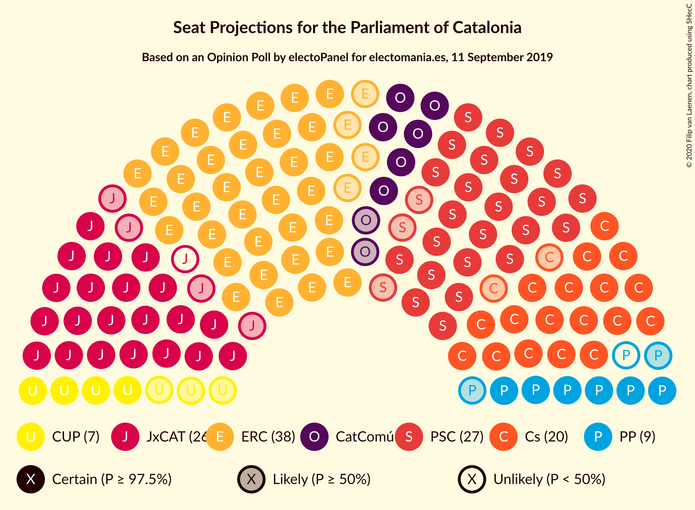
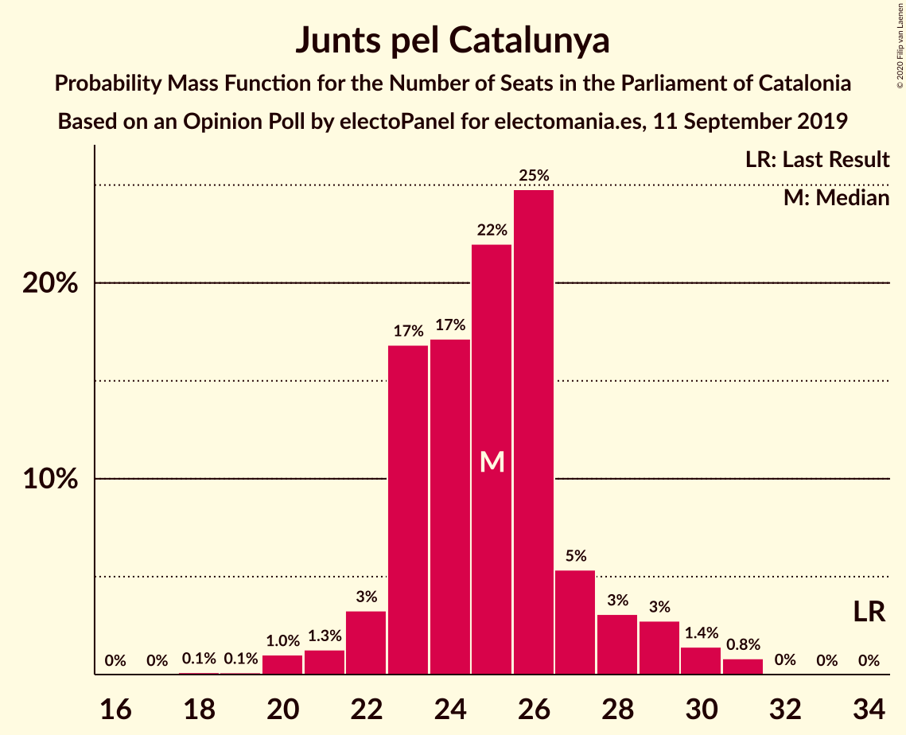
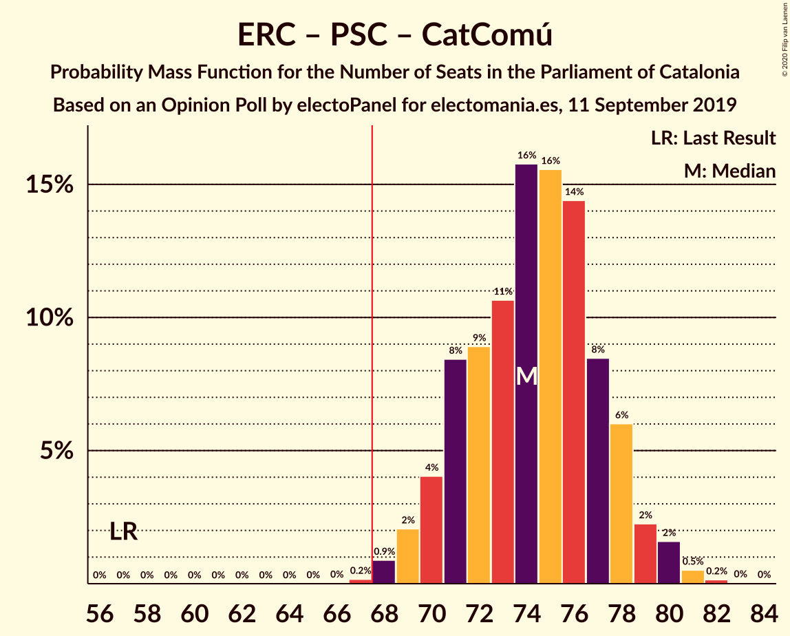
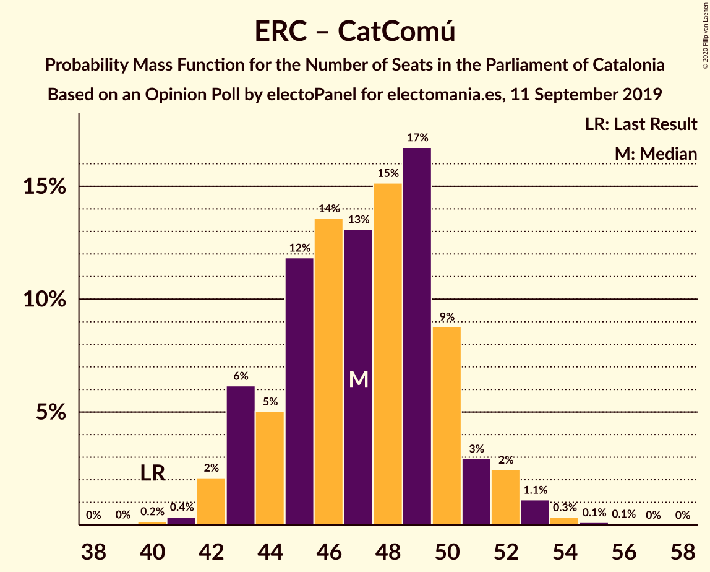

# Opinion Poll by electoPanel for electomania.es, 11 September 2019

<a href="#voting-intentions">Voting Intentions</a> | <a href="#seats">Seats</a> | <a href="#coalitions">Coalitions</a> | <a href="#technical-information">Technical Information</a>

## Voting Intentions

### Confidence Intervals

| Party | Last Result | Poll Result | 80% Confidence Interval | 90% Confidence Interval | 95% Confidence Interval | 99% Confidence Interval |
|:-----:|:-----------:|:-----------:|:-----------------------:|:-----------------------:|:-----------------------:|:-----------------------:|
| Esquerra Republicana–Catalunya Sí | 21.4% | 25.3% | 23.6–27.1% |23.1–27.6% |22.7–28.1% |21.9–29.0% |
| Partit dels Socialistes de Catalunya (PSC-PSOE) | 13.9% | 20.1% | 18.5–21.8% |18.1–22.3% |17.7–22.7% |17.0–23.5% |
| Junts pel Catalunya | 21.7% | 15.8% | 14.4–17.4% |14.0–17.8% |13.7–18.2% |13.0–19.0% |
| Ciutadans–Partido de la Ciudadanía | 25.4% | 15.2% | 13.8–16.8% |13.4–17.2% |13.1–17.6% |12.5–18.3% |
| Catalunya en Comú–Podem | 7.5% | 7.6% | 6.6–8.8% |6.3–9.1% |6.1–9.4% |5.7–10.0% |
| Partit Popular | 4.2% | 6.3% | 5.4–7.4% |5.2–7.7% |5.0–8.0% |4.6–8.6% |
| Candidatura d’Unitat Popular | 4.5% | 5.4% | 4.6–6.4% |4.3–6.7% |4.2–7.0% |3.8–7.5% |
| Vox | 0.0% | 1.8% | 1.4–2.5% |1.2–2.7% |1.1–2.8% |1.0–3.2% |

*Note:* The poll result column reflects the actual value used in the calculations. Published results may vary slightly, and in addition be rounded to fewer digits.

## Seats

### Confidence Intervals

| Party | Last Result | Median | 80% Confidence Interval | 90% Confidence Interval | 95% Confidence Interval | 99% Confidence Interval |
|:-----:|:-----------:|:------:|:-----------------------:|:-----------------------:|:-----------------------:|:-----------------------:|
| <a href="#esquerra-republicana–catalunya-sí">Esquerra Republicana–Catalunya Sí</a> | 32 | 39 | 37–43 |34–43 |34–43 |34–43 |
| <a href="#partit-dels-socialistes-de-catalunya-(psc-psoe)">Partit dels Socialistes de Catalunya (PSC-PSOE)</a> | 17 | 26 | 23–29 |23–31 |23–33 |23–33 |
| <a href="#junts-pel-catalunya">Junts pel Catalunya</a> | 34 | 30 | 24–31 |23–31 |22–31 |20–31 |
| <a href="#ciutadans–partido-de-la-ciudadanía">Ciutadans–Partido de la Ciudadanía</a> | 36 | 19 | 19–20 |19–20 |18–21 |18–21 |
| <a href="#catalunya-en-comú–podem">Catalunya en Comú–Podem</a> | 8 | 8 | 7–10 |7–11 |7–13 |5–13 |
| <a href="#partit-popular">Partit Popular</a> | 4 | 7 | 7–9 |7–9 |7–9 |7–9 |
| <a href="#candidatura-d’unitat-popular">Candidatura d’Unitat Popular</a> | 4 | 5 | 5–8 |5–9 |4–9 |2–9 |
| <a href="#vox">Vox</a> | 0 | 0 | 0 |0 |0 |0–2 |

### Esquerra Republicana–Catalunya Sí

*For a full overview of the results for this party, see the [Esquerra Republicana–Catalunya Sí](party-esquerrarepublicana–catalunyasí.html) page.*

| Number of Seats | Probability | Accumulated | Special Marks |
|:---------------:|:-----------:|:-----------:|:-------------:|
| 31 | 0.1% | 100% |  |
| 32 | 0.2% | 99.9% | Last Result |
| 33 | 0% | 99.7% |  |
| 34 | 5% | 99.7% |  |
| 35 | 0.9% | 94% |  |
| 36 | 3% | 94% |  |
| 37 | 0.4% | 90% |  |
| 38 | 1.3% | 90% |  |
| 39 | 49% | 89% | Median |
| 40 | 1.0% | 39% |  |
| 41 | 22% | 38% |  |
| 42 | 0.7% | 17% |  |
| 43 | 16% | 16% |  |
| 44 | 0% | 0.1% |  |
| 45 | 0% | 0.1% |  |
| 46 | 0% | 0% |  |

### Partit dels Socialistes de Catalunya (PSC-PSOE)

*For a full overview of the results for this party, see the [Partit dels Socialistes de Catalunya (PSC-PSOE)](party-partitdelssocialistesdecatalunyapsc-psoe.html) page.*

| Number of Seats | Probability | Accumulated | Special Marks |
|:---------------:|:-----------:|:-----------:|:-------------:|
| 17 | 0% | 100% | Last Result |
| 18 | 0% | 100% |  |
| 19 | 0% | 100% |  |
| 20 | 0% | 100% |  |
| 21 | 0% | 100% |  |
| 22 | 0% | 100% |  |
| 23 | 16% | 100% |  |
| 24 | 0.2% | 84% |  |
| 25 | 8% | 84% |  |
| 26 | 50% | 76% | Median |
| 27 | 0.5% | 26% |  |
| 28 | 14% | 25% |  |
| 29 | 4% | 11% |  |
| 30 | 2% | 7% |  |
| 31 | 0.4% | 5% |  |
| 32 | 0% | 5% |  |
| 33 | 4% | 5% |  |
| 34 | 0.5% | 0.5% |  |
| 35 | 0% | 0% |  |

### Junts pel Catalunya

*For a full overview of the results for this party, see the [Junts pel Catalunya](party-juntspelcatalunya.html) page.*

| Number of Seats | Probability | Accumulated | Special Marks |
|:---------------:|:-----------:|:-----------:|:-------------:|
| 18 | 0.1% | 100% |  |
| 19 | 0% | 99.9% |  |
| 20 | 1.2% | 99.9% |  |
| 21 | 1.2% | 98.7% |  |
| 22 | 0.5% | 98% |  |
| 23 | 3% | 97% |  |
| 24 | 25% | 94% |  |
| 25 | 13% | 68% |  |
| 26 | 4% | 55% |  |
| 27 | 0.3% | 51% |  |
| 28 | 0% | 51% |  |
| 29 | 0.3% | 51% |  |
| 30 | 0.8% | 51% | Median |
| 31 | 49% | 50% |  |
| 32 | 0.4% | 0.4% |  |
| 33 | 0% | 0% |  |
| 34 | 0% | 0% | Last Result |

### Ciutadans–Partido de la Ciudadanía

*For a full overview of the results for this party, see the [Ciutadans–Partido de la Ciudadanía](party-ciutadans–partidodelaciudadanía.html) page.*

| Number of Seats | Probability | Accumulated | Special Marks |
|:---------------:|:-----------:|:-----------:|:-------------:|
| 18 | 4% | 100% |  |
| 19 | 66% | 96% | Median |
| 20 | 25% | 29% |  |
| 21 | 4% | 4% |  |
| 22 | 0.2% | 0.5% |  |
| 23 | 0.2% | 0.2% |  |
| 24 | 0% | 0% |  |
| 25 | 0% | 0% |  |
| 26 | 0% | 0% |  |
| 27 | 0% | 0% |  |
| 28 | 0% | 0% |  |
| 29 | 0% | 0% |  |
| 30 | 0% | 0% |  |
| 31 | 0% | 0% |  |
| 32 | 0% | 0% |  |
| 33 | 0% | 0% |  |
| 34 | 0% | 0% |  |
| 35 | 0% | 0% |  |
| 36 | 0% | 0% | Last Result |

### Catalunya en Comú–Podem

*For a full overview of the results for this party, see the [Catalunya en Comú–Podem](party-catalunyaencomú–podem.html) page.*

| Number of Seats | Probability | Accumulated | Special Marks |
|:---------------:|:-----------:|:-----------:|:-------------:|
| 5 | 0.9% | 100% |  |
| 6 | 1.0% | 99.1% |  |
| 7 | 9% | 98% |  |
| 8 | 50% | 89% | Last Result, Median |
| 9 | 14% | 39% |  |
| 10 | 17% | 25% |  |
| 11 | 3% | 8% |  |
| 12 | 0.1% | 5% |  |
| 13 | 5% | 5% |  |
| 14 | 0.2% | 0.2% |  |
| 15 | 0% | 0% |  |

### Partit Popular

*For a full overview of the results for this party, see the [Partit Popular](party-partitpopular.html) page.*

| Number of Seats | Probability | Accumulated | Special Marks |
|:---------------:|:-----------:|:-----------:|:-------------:|
| 4 | 0% | 100% | Last Result |
| 5 | 0% | 100% |  |
| 6 | 0% | 100% |  |
| 7 | 87% | 100% | Median |
| 8 | 0.1% | 13% |  |
| 9 | 13% | 13% |  |
| 10 | 0.2% | 0.2% |  |
| 11 | 0% | 0% |  |

### Candidatura d’Unitat Popular

*For a full overview of the results for this party, see the [Candidatura d’Unitat Popular](party-candidaturad’unitatpopular.html) page.*

| Number of Seats | Probability | Accumulated | Special Marks |
|:---------------:|:-----------:|:-----------:|:-------------:|
| 2 | 0.5% | 100% |  |
| 3 | 2% | 99.5% |  |
| 4 | 1.2% | 98% | Last Result |
| 5 | 49% | 97% | Median |
| 6 | 13% | 48% |  |
| 7 | 7% | 34% |  |
| 8 | 18% | 27% |  |
| 9 | 8% | 9% |  |
| 10 | 0.4% | 0.4% |  |
| 11 | 0% | 0% |  |

### Vox

*For a full overview of the results for this party, see the [Vox](party-vox.html) page.*

| Number of Seats | Probability | Accumulated | Special Marks |
|:---------------:|:-----------:|:-----------:|:-------------:|
| 0 | 98.5% | 100% | Last Result, Median |
| 1 | 0% | 1.5% |  |
| 2 | 1.3% | 1.5% |  |
| 3 | 0.1% | 0.1% |  |
| 4 | 0% | 0% |  |

## Coalitions

### Confidence Intervals

| Coalition | Last Result | Median | Majority? | 80% Confidence Interval | 90% Confidence Interval | 95% Confidence Interval | 99% Confidence Interval |
|:---------:|:-----------:|:------:|:---------:|:-----------------------:|:-----------------------:|:-----------------------:|:-----------------------:|
| Esquerra Republicana–Catalunya Sí – Partit dels Socialistes de Catalunya (PSC-PSOE) – Catalunya en Comú–Podem | 57 | 73 | 99.8% | 73–78 | 73–79 | 73–80 | 68–81 |
| Esquerra Republicana–Catalunya Sí – Junts pel Catalunya – Catalunya en Comú–Podem | 74 | 77 | 99.0% | 72–78 | 70–78 | 69–78 | 66–78 |
| Esquerra Republicana–Catalunya Sí – Junts pel Catalunya – Candidatura d’Unitat Popular | 70 | 75 | 91% | 68–75 | 66–75 | 66–75 | 62–75 |
| Esquerra Republicana–Catalunya Sí – Junts pel Catalunya | 66 | 67 | 50% | 61–70 | 59–70 | 59–70 | 56–70 |
| Partit dels Socialistes de Catalunya (PSC-PSOE) – Ciutadans–Partido de la Ciudadanía – Catalunya en Comú–Podem – Partit Popular | 65 | 60 | 9% | 60–67 | 60–69 | 60–69 | 60–73 |
| Partit dels Socialistes de Catalunya (PSC-PSOE) – Ciutadans–Partido de la Ciudadanía – Partit Popular | 57 | 52 | 0% | 50–55 | 50–58 | 50–60 | 50–63 |
| Partit dels Socialistes de Catalunya (PSC-PSOE) – Ciutadans–Partido de la Ciudadanía – Partit Popular – Vox | 57 | 52 | 0% | 50–55 | 50–58 | 50–60 | 50–63 |
| Esquerra Republicana–Catalunya Sí – Catalunya en Comú–Podem | 40 | 47 | 0% | 47–53 | 47–53 | 46–53 | 40–53 |

### Esquerra Republicana–Catalunya Sí – Partit dels Socialistes de Catalunya (PSC-PSOE) – Catalunya en Comú–Podem

| Number of Seats | Probability | Accumulated | Special Marks |
|:---------------:|:-----------:|:-----------:|:-------------:|
| 57 | 0% | 100% | Last Result |
| 58 | 0% | 100% |  |
| 59 | 0% | 100% |  |
| 60 | 0% | 100% |  |
| 61 | 0% | 100% |  |
| 62 | 0% | 100% |  |
| 63 | 0% | 100% |  |
| 64 | 0% | 100% |  |
| 65 | 0.2% | 100% |  |
| 66 | 0% | 99.8% |  |
| 67 | 0% | 99.8% |  |
| 68 | 0.7% | 99.8% | Majority |
| 69 | 0.4% | 99.1% |  |
| 70 | 0.1% | 98.6% |  |
| 71 | 0% | 98% |  |
| 72 | 0.4% | 98% |  |
| 73 | 57% | 98% | Median |
| 74 | 0.6% | 41% |  |
| 75 | 0% | 40% |  |
| 76 | 20% | 40% |  |
| 77 | 0.2% | 20% |  |
| 78 | 15% | 20% |  |
| 79 | 0.7% | 5% |  |
| 80 | 3% | 5% |  |
| 81 | 1.2% | 1.2% |  |
| 82 | 0% | 0% |  |

### Esquerra Republicana–Catalunya Sí – Junts pel Catalunya – Catalunya en Comú–Podem

| Number of Seats | Probability | Accumulated | Special Marks |
|:---------------:|:-----------:|:-----------:|:-------------:|
| 64 | 0.5% | 100% |  |
| 65 | 0% | 99.5% |  |
| 66 | 0.2% | 99.5% |  |
| 67 | 0.4% | 99.4% |  |
| 68 | 1.4% | 99.0% | Majority |
| 69 | 0.3% | 98% |  |
| 70 | 4% | 97% |  |
| 71 | 0% | 93% |  |
| 72 | 10% | 93% |  |
| 73 | 4% | 84% |  |
| 74 | 1.3% | 80% | Last Result |
| 75 | 13% | 78% |  |
| 76 | 0% | 65% |  |
| 77 | 16% | 65% | Median |
| 78 | 49% | 49% |  |
| 79 | 0% | 0% |  |

### Esquerra Republicana–Catalunya Sí – Junts pel Catalunya – Candidatura d’Unitat Popular

| Number of Seats | Probability | Accumulated | Special Marks |
|:---------------:|:-----------:|:-----------:|:-------------:|
| 61 | 0.4% | 100% |  |
| 62 | 1.2% | 99.6% |  |
| 63 | 0% | 98% |  |
| 64 | 0.5% | 98% |  |
| 65 | 0% | 98% |  |
| 66 | 3% | 98% |  |
| 67 | 4% | 94% |  |
| 68 | 2% | 91% | Majority |
| 69 | 0.7% | 88% |  |
| 70 | 0% | 88% | Last Result |
| 71 | 0.5% | 88% |  |
| 72 | 13% | 87% |  |
| 73 | 0.7% | 74% |  |
| 74 | 7% | 73% | Median |
| 75 | 66% | 66% |  |
| 76 | 0% | 0% |  |

### Esquerra Republicana–Catalunya Sí – Junts pel Catalunya

| Number of Seats | Probability | Accumulated | Special Marks |
|:---------------:|:-----------:|:-----------:|:-------------:|
| 55 | 0.2% | 100% |  |
| 56 | 0.5% | 99.8% |  |
| 57 | 0% | 99.4% |  |
| 58 | 2% | 99.3% |  |
| 59 | 4% | 98% |  |
| 60 | 4% | 94% |  |
| 61 | 0.7% | 90% |  |
| 62 | 0.1% | 89% |  |
| 63 | 0.2% | 89% |  |
| 64 | 0.1% | 89% |  |
| 65 | 9% | 89% |  |
| 66 | 14% | 80% | Last Result |
| 67 | 16% | 65% |  |
| 68 | 0% | 50% | Majority |
| 69 | 0.3% | 50% | Median |
| 70 | 49% | 49% |  |
| 71 | 0% | 0% |  |

### Partit dels Socialistes de Catalunya (PSC-PSOE) – Ciutadans–Partido de la Ciudadanía – Catalunya en Comú–Podem – Partit Popular

| Number of Seats | Probability | Accumulated | Special Marks |
|:---------------:|:-----------:|:-----------:|:-------------:|
| 60 | 66% | 100% | Median |
| 61 | 7% | 34% |  |
| 62 | 0.7% | 27% |  |
| 63 | 13% | 26% |  |
| 64 | 1.3% | 13% |  |
| 65 | 0.4% | 11% | Last Result |
| 66 | 0% | 11% |  |
| 67 | 2% | 11% |  |
| 68 | 4% | 9% | Majority |
| 69 | 3% | 5% |  |
| 70 | 0% | 2% |  |
| 71 | 0.5% | 2% |  |
| 72 | 0.2% | 2% |  |
| 73 | 1.2% | 1.3% |  |
| 74 | 0.2% | 0.2% |  |
| 75 | 0% | 0% |  |

### Partit dels Socialistes de Catalunya (PSC-PSOE) – Ciutadans–Partido de la Ciudadanía – Partit Popular

| Number of Seats | Probability | Accumulated | Special Marks |
|:---------------:|:-----------:|:-----------:|:-------------:|
| 50 | 16% | 100% |  |
| 51 | 0.7% | 84% |  |
| 52 | 50% | 83% | Median |
| 53 | 0% | 34% |  |
| 54 | 21% | 34% |  |
| 55 | 4% | 13% |  |
| 56 | 0.4% | 9% |  |
| 57 | 0.8% | 8% | Last Result |
| 58 | 4% | 7% |  |
| 59 | 0.1% | 4% |  |
| 60 | 2% | 4% |  |
| 61 | 0% | 2% |  |
| 62 | 0% | 2% |  |
| 63 | 2% | 2% |  |
| 64 | 0% | 0% |  |

### Partit dels Socialistes de Catalunya (PSC-PSOE) – Ciutadans–Partido de la Ciudadanía – Partit Popular – Vox

| Number of Seats | Probability | Accumulated | Special Marks |
|:---------------:|:-----------:|:-----------:|:-------------:|
| 50 | 16% | 100% |  |
| 51 | 0% | 84% |  |
| 52 | 50% | 84% | Median |
| 53 | 0.7% | 34% |  |
| 54 | 21% | 34% |  |
| 55 | 4% | 13% |  |
| 56 | 0% | 9% |  |
| 57 | 0.8% | 9% | Last Result |
| 58 | 4% | 8% |  |
| 59 | 0% | 4% |  |
| 60 | 2% | 4% |  |
| 61 | 0.2% | 2% |  |
| 62 | 0% | 2% |  |
| 63 | 2% | 2% |  |
| 64 | 0% | 0.2% |  |
| 65 | 0.2% | 0.2% |  |
| 66 | 0% | 0% |  |

### Esquerra Republicana–Catalunya Sí – Catalunya en Comú–Podem

| Number of Seats | Probability | Accumulated | Special Marks |
|:---------------:|:-----------:|:-----------:|:-------------:|
| 39 | 0.1% | 100% |  |
| 40 | 0.7% | 99.9% | Last Result |
| 41 | 0.2% | 99.1% |  |
| 42 | 0.9% | 98.9% |  |
| 43 | 0.3% | 98% |  |
| 44 | 0% | 98% |  |
| 45 | 0% | 98% |  |
| 46 | 0.7% | 98% |  |
| 47 | 57% | 97% | Median |
| 48 | 11% | 40% |  |
| 49 | 0% | 30% |  |
| 50 | 13% | 30% |  |
| 51 | 0% | 17% |  |
| 52 | 0% | 17% |  |
| 53 | 17% | 17% |  |
| 54 | 0% | 0% |  |

## Technical Information

### Opinion Poll

+ **Polling firm:** electoPanel
+ **Commissioner(s):** electomania.es
+ **Fieldwork period:** 11 September 2019

### Calculations

+ **Sample size:** 1000
+ **Simulations done:** 1,024
+ **Error estimate:** 4.37%

