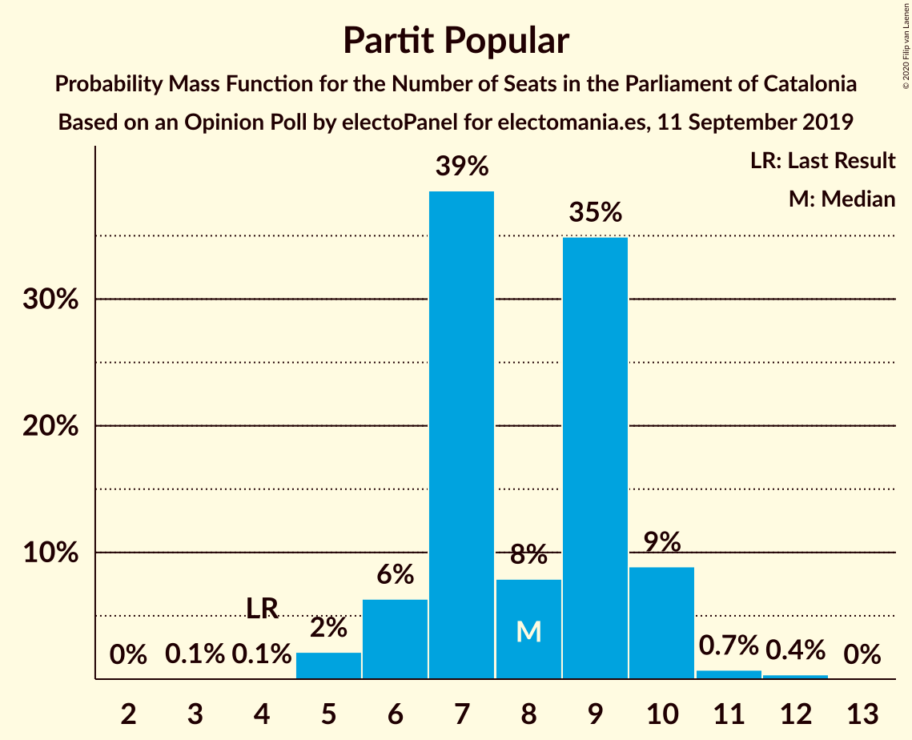
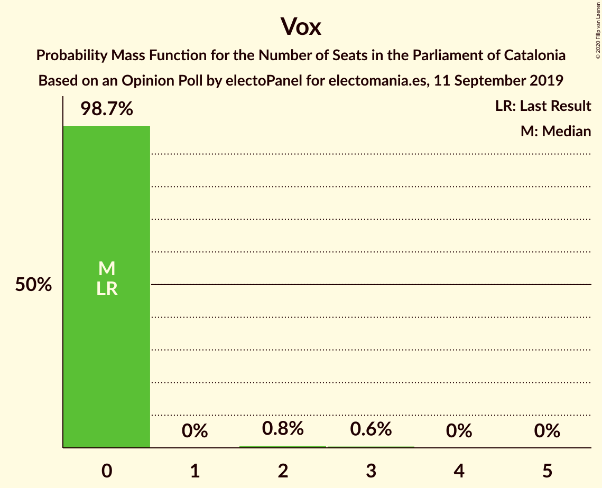
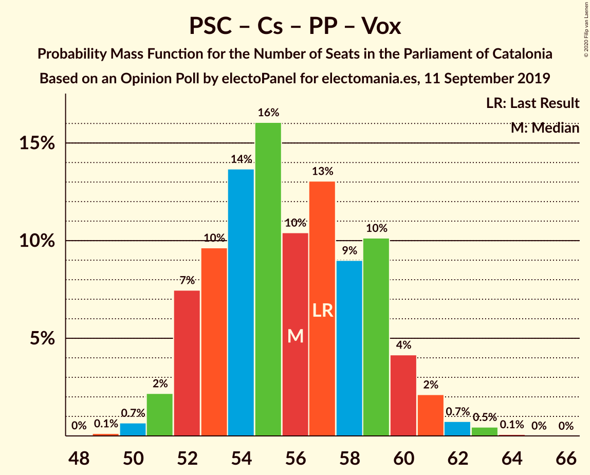

# Opinion Poll by electoPanel for electomania.es, 11 September 2019

<a href="#voting-intentions">Voting Intentions</a> | <a href="#seats">Seats</a> | <a href="#coalitions">Coalitions</a> | <a href="#technical-information">Technical Information</a>

## Voting Intentions

### Confidence Intervals

| Party | Last Result | Poll Result | 80% Confidence Interval | 90% Confidence Interval | 95% Confidence Interval | 99% Confidence Interval |
|:-----:|:-----------:|:-----------:|:-----------------------:|:-----------------------:|:-----------------------:|:-----------------------:|
| Esquerra Republicana–Catalunya Sí | 21.4% | 25.3% | 23.6–27.1% |23.1–27.6% |22.7–28.1% |21.9–29.0% |
| Partit dels Socialistes de Catalunya (PSC-PSOE) | 13.9% | 20.1% | 18.5–21.8% |18.1–22.3% |17.7–22.7% |17.0–23.5% |
| Junts pel Catalunya | 21.7% | 15.8% | 14.4–17.4% |14.0–17.8% |13.7–18.2% |13.0–19.0% |
| Ciutadans–Partido de la Ciudadanía | 25.4% | 15.2% | 13.8–16.8% |13.4–17.2% |13.1–17.6% |12.5–18.3% |
| Catalunya en Comú–Podem | 7.5% | 7.6% | 6.6–8.8% |6.3–9.1% |6.1–9.4% |5.7–10.0% |
| Partit Popular | 4.2% | 6.3% | 5.4–7.4% |5.2–7.7% |5.0–8.0% |4.6–8.6% |
| Candidatura d’Unitat Popular | 4.5% | 5.4% | 4.6–6.4% |4.3–6.7% |4.2–7.0% |3.8–7.5% |
| Vox | 0.0% | 1.8% | 1.4–2.5% |1.2–2.7% |1.1–2.8% |1.0–3.2% |

*Note:* The poll result column reflects the actual value used in the calculations. Published results may vary slightly, and in addition be rounded to fewer digits.

## Seats

### Confidence Intervals

| Party | Last Result | Median | 80% Confidence Interval | 90% Confidence Interval | 95% Confidence Interval | 99% Confidence Interval |
|:-----:|:-----------:|:------:|:-----------------------:|:-----------------------:|:-----------------------:|:-----------------------:|
| <a href="#esquerra-republicana–catalunya-sí">Esquerra Republicana–Catalunya Sí</a> | 32 | 38 | 35–42 |35–42 |34–43 |34–45 |
| <a href="#partit-dels-socialistes-de-catalunya-(psc-psoe)">Partit dels Socialistes de Catalunya (PSC-PSOE)</a> | 17 | 27 | 25–30 |24–31 |24–31 |23–33 |
| <a href="#junts-pel-catalunya">Junts pel Catalunya</a> | 34 | 25 | 23–27 |22–28 |22–29 |20–31 |
| <a href="#ciutadans–partido-de-la-ciudadanía">Ciutadans–Partido de la Ciudadanía</a> | 36 | 20 | 19–23 |18–24 |18–25 |17–26 |
| <a href="#catalunya-en-comú–podem">Catalunya en Comú–Podem</a> | 8 | 9 | 7–11 |7–11 |6–11 |5–13 |
| <a href="#partit-popular">Partit Popular</a> | 4 | 8 | 7–9 |6–10 |6–10 |5–11 |
| <a href="#candidatura-d’unitat-popular">Candidatura d’Unitat Popular</a> | 4 | 7 | 5–8 |4–9 |4–9 |4–10 |
| <a href="#vox">Vox</a> | 0 | 0 | 0 |0 |0 |0–2 |

### Esquerra Republicana–Catalunya Sí

*For a full overview of the results for this party, see the [Esquerra Republicana–Catalunya Sí](party-esquerrarepublicana–catalunyasí.html) page.*

| Number of Seats | Probability | Accumulated | Special Marks |
|:---------------:|:-----------:|:-----------:|:-------------:|
| 32 | 0.1% | 100% | Last Result |
| 33 | 0.3% | 99.9% |  |
| 34 | 3% | 99.6% |  |
| 35 | 9% | 97% |  |
| 36 | 8% | 88% |  |
| 37 | 16% | 80% |  |
| 38 | 19% | 64% | Median |
| 39 | 15% | 45% |  |
| 40 | 9% | 30% |  |
| 41 | 9% | 21% |  |
| 42 | 9% | 12% |  |
| 43 | 1.5% | 3% |  |
| 44 | 1.2% | 2% |  |
| 45 | 0.3% | 0.7% |  |
| 46 | 0.4% | 0.4% |  |
| 47 | 0% | 0% |  |

### Partit dels Socialistes de Catalunya (PSC-PSOE)

*For a full overview of the results for this party, see the [Partit dels Socialistes de Catalunya (PSC-PSOE)](party-partitdelssocialistesdecatalunyapsc-psoe.html) page.*

| Number of Seats | Probability | Accumulated | Special Marks |
|:---------------:|:-----------:|:-----------:|:-------------:|
| 17 | 0% | 100% | Last Result |
| 18 | 0% | 100% |  |
| 19 | 0% | 100% |  |
| 20 | 0% | 100% |  |
| 21 | 0% | 100% |  |
| 22 | 0.1% | 100% |  |
| 23 | 0.5% | 99.9% |  |
| 24 | 4% | 99.4% |  |
| 25 | 18% | 95% |  |
| 26 | 26% | 77% |  |
| 27 | 18% | 51% | Median |
| 28 | 7% | 33% |  |
| 29 | 7% | 26% |  |
| 30 | 11% | 19% |  |
| 31 | 5% | 7% |  |
| 32 | 1.2% | 2% |  |
| 33 | 0.5% | 0.6% |  |
| 34 | 0.1% | 0.1% |  |
| 35 | 0% | 0% |  |

### Junts pel Catalunya

*For a full overview of the results for this party, see the [Junts pel Catalunya](party-juntspelcatalunya.html) page.*

| Number of Seats | Probability | Accumulated | Special Marks |
|:---------------:|:-----------:|:-----------:|:-------------:|
| 18 | 0.1% | 100% |  |
| 19 | 0.1% | 99.9% |  |
| 20 | 1.0% | 99.8% |  |
| 21 | 1.0% | 98.8% |  |
| 22 | 4% | 98% |  |
| 23 | 18% | 94% |  |
| 24 | 15% | 76% |  |
| 25 | 23% | 61% | Median |
| 26 | 23% | 38% |  |
| 27 | 6% | 14% |  |
| 28 | 3% | 8% |  |
| 29 | 3% | 5% |  |
| 30 | 1.0% | 2% |  |
| 31 | 0.9% | 0.9% |  |
| 32 | 0% | 0% |  |
| 33 | 0% | 0% |  |
| 34 | 0% | 0% | Last Result |

### Ciutadans–Partido de la Ciudadanía

*For a full overview of the results for this party, see the [Ciutadans–Partido de la Ciudadanía](party-ciutadans–partidodelaciudadanía.html) page.*

| Number of Seats | Probability | Accumulated | Special Marks |
|:---------------:|:-----------:|:-----------:|:-------------:|
| 15 | 0% | 100% |  |
| 16 | 0.2% | 99.9% |  |
| 17 | 0.8% | 99.7% |  |
| 18 | 5% | 98.9% |  |
| 19 | 23% | 94% |  |
| 20 | 27% | 71% | Median |
| 21 | 15% | 44% |  |
| 22 | 13% | 29% |  |
| 23 | 8% | 16% |  |
| 24 | 4% | 8% |  |
| 25 | 2% | 4% |  |
| 26 | 1.0% | 1.2% |  |
| 27 | 0.1% | 0.1% |  |
| 28 | 0% | 0% |  |
| 29 | 0% | 0% |  |
| 30 | 0% | 0% |  |
| 31 | 0% | 0% |  |
| 32 | 0% | 0% |  |
| 33 | 0% | 0% |  |
| 34 | 0% | 0% |  |
| 35 | 0% | 0% |  |
| 36 | 0% | 0% | Last Result |

### Catalunya en Comú–Podem

*For a full overview of the results for this party, see the [Catalunya en Comú–Podem](party-catalunyaencomú–podem.html) page.*

| Number of Seats | Probability | Accumulated | Special Marks |
|:---------------:|:-----------:|:-----------:|:-------------:|
| 5 | 0.8% | 100% |  |
| 6 | 2% | 99.2% |  |
| 7 | 10% | 97% |  |
| 8 | 35% | 87% | Last Result |
| 9 | 17% | 52% | Median |
| 10 | 20% | 34% |  |
| 11 | 13% | 14% |  |
| 12 | 0.7% | 1.3% |  |
| 13 | 0.6% | 0.7% |  |
| 14 | 0% | 0.1% |  |
| 15 | 0% | 0% |  |

### Partit Popular

*For a full overview of the results for this party, see the [Partit Popular](party-partitpopular.html) page.*

| Number of Seats | Probability | Accumulated | Special Marks |
|:---------------:|:-----------:|:-----------:|:-------------:|
| 3 | 0.1% | 100% |  |
| 4 | 0% | 99.9% | Last Result |
| 5 | 2% | 99.9% |  |
| 6 | 7% | 98% |  |
| 7 | 40% | 91% |  |
| 8 | 10% | 51% | Median |
| 9 | 32% | 41% |  |
| 10 | 8% | 9% |  |
| 11 | 0.9% | 1.3% |  |
| 12 | 0.4% | 0.4% |  |
| 13 | 0% | 0% |  |

### Candidatura d’Unitat Popular

*For a full overview of the results for this party, see the [Candidatura d’Unitat Popular](party-candidaturad’unitatpopular.html) page.*

| Number of Seats | Probability | Accumulated | Special Marks |
|:---------------:|:-----------:|:-----------:|:-------------:|
| 2 | 0.1% | 100% |  |
| 3 | 0.3% | 99.9% |  |
| 4 | 6% | 99.7% | Last Result |
| 5 | 4% | 94% |  |
| 6 | 13% | 90% |  |
| 7 | 36% | 77% | Median |
| 8 | 35% | 41% |  |
| 9 | 5% | 6% |  |
| 10 | 0.6% | 0.8% |  |
| 11 | 0.2% | 0.2% |  |
| 12 | 0% | 0% |  |

### Vox

*For a full overview of the results for this party, see the [Vox](party-vox.html) page.*

| Number of Seats | Probability | Accumulated | Special Marks |
|:---------------:|:-----------:|:-----------:|:-------------:|
| 0 | 98.6% | 100% | Last Result, Median |
| 1 | 0% | 1.4% |  |
| 2 | 1.0% | 1.4% |  |
| 3 | 0.5% | 0.5% |  |
| 4 | 0% | 0% |  |

## Coalitions

### Confidence Intervals

| Coalition | Last Result | Median | Majority? | 80% Confidence Interval | 90% Confidence Interval | 95% Confidence Interval | 99% Confidence Interval |
|:---------:|:-----------:|:------:|:---------:|:-----------------------:|:-----------------------:|:-----------------------:|:-----------------------:|
| Esquerra Republicana–Catalunya Sí – Partit dels Socialistes de Catalunya (PSC-PSOE) – Catalunya en Comú–Podem | 57 | 75 | 99.8% | 71–77 | 70–78 | 69–80 | 68–81 |
| Esquerra Republicana–Catalunya Sí – Junts pel Catalunya – Catalunya en Comú–Podem | 74 | 72 | 96% | 69–76 | 68–76 | 67–77 | 65–79 |
| Esquerra Republicana–Catalunya Sí – Junts pel Catalunya – Candidatura d’Unitat Popular | 70 | 70 | 83% | 67–74 | 66–75 | 66–76 | 64–77 |
| Partit dels Socialistes de Catalunya (PSC-PSOE) – Ciutadans–Partido de la Ciudadanía – Catalunya en Comú–Podem – Partit Popular | 65 | 65 | 17% | 61–68 | 60–69 | 59–69 | 58–71 |
| Esquerra Republicana–Catalunya Sí – Junts pel Catalunya | 66 | 63 | 7% | 60–67 | 59–68 | 59–69 | 57–70 |
| Partit dels Socialistes de Catalunya (PSC-PSOE) – Ciutadans–Partido de la Ciudadanía – Partit Popular – Vox | 57 | 55 | 0% | 52–59 | 52–60 | 52–61 | 50–63 |
| Partit dels Socialistes de Catalunya (PSC-PSOE) – Ciutadans–Partido de la Ciudadanía – Partit Popular | 57 | 55 | 0% | 52–59 | 52–60 | 51–61 | 50–63 |
| Esquerra Republicana–Catalunya Sí – Catalunya en Comú–Podem | 40 | 47 | 0% | 44–50 | 43–51 | 42–52 | 42–54 |

### Esquerra Republicana–Catalunya Sí – Partit dels Socialistes de Catalunya (PSC-PSOE) – Catalunya en Comú–Podem

| Number of Seats | Probability | Accumulated | Special Marks |
|:---------------:|:-----------:|:-----------:|:-------------:|
| 57 | 0% | 100% | Last Result |
| 58 | 0% | 100% |  |
| 59 | 0% | 100% |  |
| 60 | 0% | 100% |  |
| 61 | 0% | 100% |  |
| 62 | 0% | 100% |  |
| 63 | 0% | 100% |  |
| 64 | 0% | 100% |  |
| 65 | 0% | 100% |  |
| 66 | 0% | 100% |  |
| 67 | 0.2% | 100% |  |
| 68 | 1.2% | 99.8% | Majority |
| 69 | 2% | 98.6% |  |
| 70 | 3% | 96% |  |
| 71 | 8% | 93% |  |
| 72 | 8% | 86% |  |
| 73 | 13% | 77% |  |
| 74 | 12% | 64% | Median |
| 75 | 17% | 52% |  |
| 76 | 17% | 36% |  |
| 77 | 10% | 19% |  |
| 78 | 4% | 8% |  |
| 79 | 2% | 5% |  |
| 80 | 2% | 3% |  |
| 81 | 0.6% | 0.9% |  |
| 82 | 0.2% | 0.2% |  |
| 83 | 0% | 0% |  |

### Esquerra Republicana–Catalunya Sí – Junts pel Catalunya – Catalunya en Comú–Podem

| Number of Seats | Probability | Accumulated | Special Marks |
|:---------------:|:-----------:|:-----------:|:-------------:|
| 64 | 0% | 100% |  |
| 65 | 0.4% | 99.9% |  |
| 66 | 0.8% | 99.5% |  |
| 67 | 3% | 98.7% |  |
| 68 | 5% | 96% | Majority |
| 69 | 4% | 91% |  |
| 70 | 12% | 87% |  |
| 71 | 13% | 75% |  |
| 72 | 12% | 61% | Median |
| 73 | 17% | 49% |  |
| 74 | 13% | 32% | Last Result |
| 75 | 9% | 19% |  |
| 76 | 6% | 10% |  |
| 77 | 2% | 4% |  |
| 78 | 0.8% | 2% |  |
| 79 | 0.6% | 0.8% |  |
| 80 | 0.2% | 0.2% |  |
| 81 | 0% | 0% |  |

### Esquerra Republicana–Catalunya Sí – Junts pel Catalunya – Candidatura d’Unitat Popular

| Number of Seats | Probability | Accumulated | Special Marks |
|:---------------:|:-----------:|:-----------:|:-------------:|
| 62 | 0% | 100% |  |
| 63 | 0.2% | 99.9% |  |
| 64 | 0.6% | 99.7% |  |
| 65 | 1.1% | 99.1% |  |
| 66 | 5% | 98% |  |
| 67 | 10% | 93% |  |
| 68 | 9% | 83% | Majority |
| 69 | 11% | 74% |  |
| 70 | 14% | 63% | Last Result, Median |
| 71 | 14% | 49% |  |
| 72 | 10% | 35% |  |
| 73 | 11% | 26% |  |
| 74 | 7% | 15% |  |
| 75 | 5% | 8% |  |
| 76 | 2% | 3% |  |
| 77 | 0.5% | 0.6% |  |
| 78 | 0.1% | 0.1% |  |
| 79 | 0% | 0% |  |

### Partit dels Socialistes de Catalunya (PSC-PSOE) – Ciutadans–Partido de la Ciudadanía – Catalunya en Comú–Podem – Partit Popular

| Number of Seats | Probability | Accumulated | Special Marks |
|:---------------:|:-----------:|:-----------:|:-------------:|
| 57 | 0.1% | 100% |  |
| 58 | 0.5% | 99.9% |  |
| 59 | 2% | 99.3% |  |
| 60 | 5% | 97% |  |
| 61 | 7% | 92% |  |
| 62 | 11% | 85% |  |
| 63 | 10% | 74% |  |
| 64 | 14% | 64% | Median |
| 65 | 13% | 50% | Last Result |
| 66 | 11% | 37% |  |
| 67 | 9% | 26% |  |
| 68 | 10% | 17% | Majority |
| 69 | 5% | 7% |  |
| 70 | 1.1% | 2% |  |
| 71 | 0.6% | 0.8% |  |
| 72 | 0.2% | 0.3% |  |
| 73 | 0% | 0.1% |  |
| 74 | 0% | 0% |  |

### Esquerra Republicana–Catalunya Sí – Junts pel Catalunya

| Number of Seats | Probability | Accumulated | Special Marks |
|:---------------:|:-----------:|:-----------:|:-------------:|
| 56 | 0.1% | 100% |  |
| 57 | 0.6% | 99.9% |  |
| 58 | 1.1% | 99.3% |  |
| 59 | 6% | 98% |  |
| 60 | 6% | 93% |  |
| 61 | 13% | 86% |  |
| 62 | 7% | 73% |  |
| 63 | 21% | 67% | Median |
| 64 | 12% | 46% |  |
| 65 | 14% | 34% |  |
| 66 | 8% | 20% | Last Result |
| 67 | 5% | 12% |  |
| 68 | 4% | 7% | Majority |
| 69 | 1.4% | 3% |  |
| 70 | 0.9% | 1.1% |  |
| 71 | 0.2% | 0.3% |  |
| 72 | 0% | 0% |  |

### Partit dels Socialistes de Catalunya (PSC-PSOE) – Ciutadans–Partido de la Ciudadanía – Partit Popular – Vox

| Number of Seats | Probability | Accumulated | Special Marks |
|:---------------:|:-----------:|:-----------:|:-------------:|
| 49 | 0.1% | 100% |  |
| 50 | 0.5% | 99.8% |  |
| 51 | 2% | 99.3% |  |
| 52 | 10% | 98% |  |
| 53 | 11% | 87% |  |
| 54 | 14% | 77% |  |
| 55 | 13% | 63% | Median |
| 56 | 11% | 49% |  |
| 57 | 11% | 38% | Last Result |
| 58 | 8% | 26% |  |
| 59 | 10% | 18% |  |
| 60 | 4% | 8% |  |
| 61 | 3% | 4% |  |
| 62 | 0.5% | 1.1% |  |
| 63 | 0.6% | 0.7% |  |
| 64 | 0.1% | 0.1% |  |
| 65 | 0% | 0% |  |

### Partit dels Socialistes de Catalunya (PSC-PSOE) – Ciutadans–Partido de la Ciudadanía – Partit Popular

| Number of Seats | Probability | Accumulated | Special Marks |
|:---------------:|:-----------:|:-----------:|:-------------:|
| 49 | 0.1% | 100% |  |
| 50 | 0.5% | 99.8% |  |
| 51 | 2% | 99.3% |  |
| 52 | 10% | 97% |  |
| 53 | 11% | 87% |  |
| 54 | 14% | 76% |  |
| 55 | 13% | 62% | Median |
| 56 | 11% | 49% |  |
| 57 | 11% | 37% | Last Result |
| 58 | 8% | 26% |  |
| 59 | 10% | 18% |  |
| 60 | 4% | 8% |  |
| 61 | 3% | 4% |  |
| 62 | 0.5% | 1.1% |  |
| 63 | 0.5% | 0.6% |  |
| 64 | 0.1% | 0.1% |  |
| 65 | 0% | 0% |  |

### Esquerra Republicana–Catalunya Sí – Catalunya en Comú–Podem

| Number of Seats | Probability | Accumulated | Special Marks |
|:---------------:|:-----------:|:-----------:|:-------------:|
| 40 | 0.2% | 100% | Last Result |
| 41 | 0.3% | 99.8% |  |
| 42 | 3% | 99.5% |  |
| 43 | 3% | 96% |  |
| 44 | 6% | 93% |  |
| 45 | 10% | 87% |  |
| 46 | 12% | 77% |  |
| 47 | 19% | 65% | Median |
| 48 | 11% | 46% |  |
| 49 | 17% | 35% |  |
| 50 | 12% | 18% |  |
| 51 | 2% | 6% |  |
| 52 | 2% | 3% |  |
| 53 | 1.0% | 2% |  |
| 54 | 0.5% | 0.7% |  |
| 55 | 0.1% | 0.2% |  |
| 56 | 0.1% | 0.1% |  |
| 57 | 0% | 0% |  |

## Technical Information

### Opinion Poll

+ **Polling firm:** electoPanel
+ **Commissioner(s):** electomania.es
+ **Fieldwork period:** 11 September 2019

### Calculations

+ **Sample size:** 1000
+ **Simulations done:** 524,288
+ **Error estimate:** 1.49%

