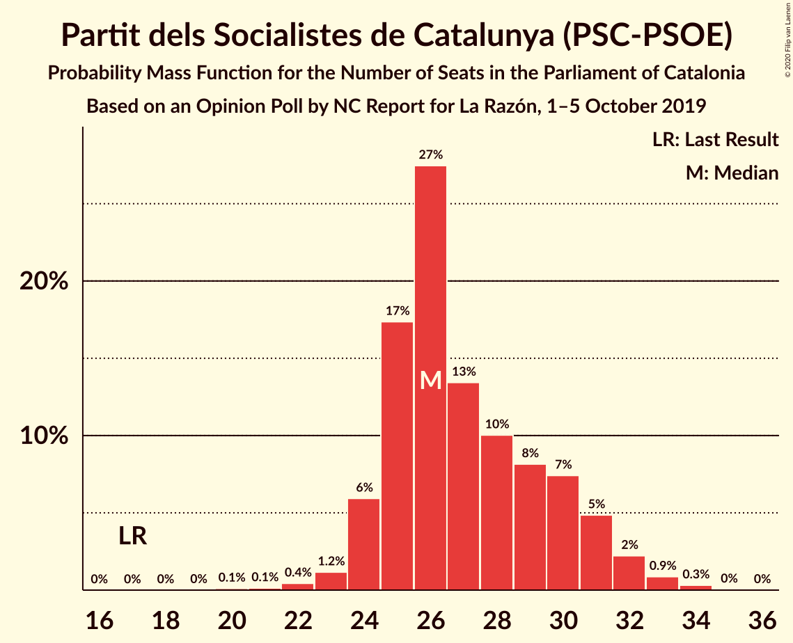
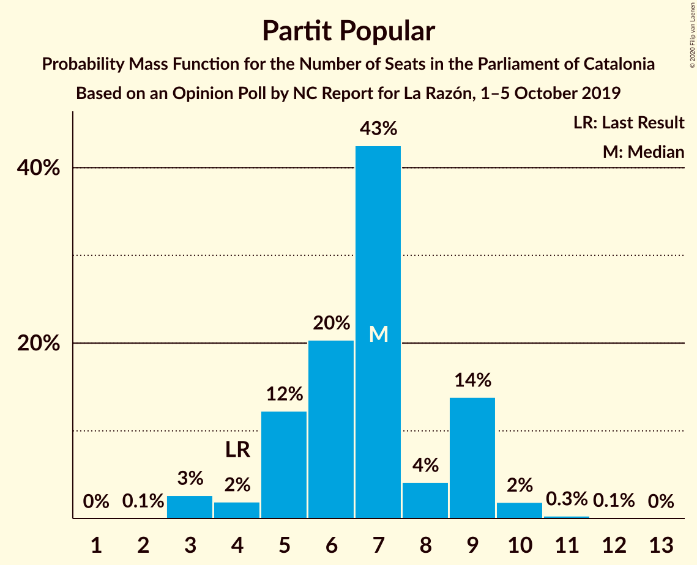
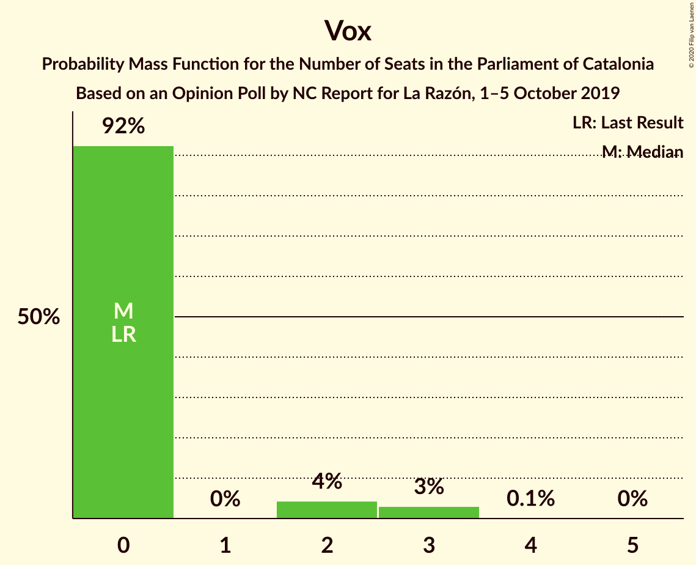
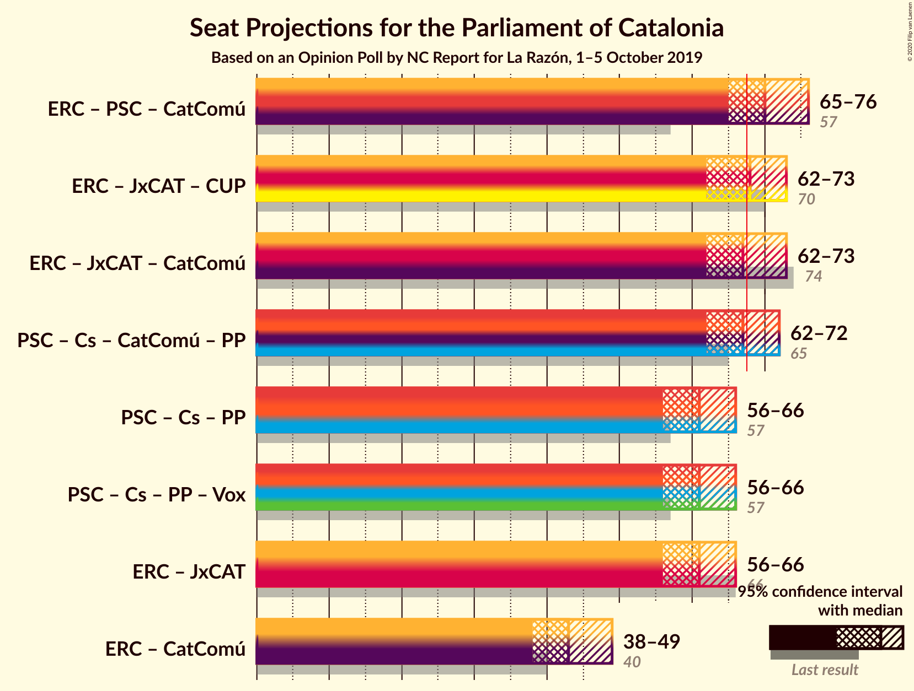
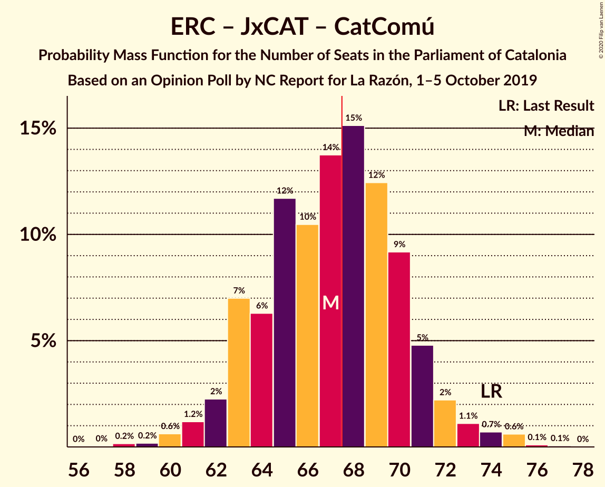

# Opinion Poll by NC Report for La Razón, 1–5 October 2019

<a href="#voting-intentions">Voting Intentions</a> | <a href="#seats">Seats</a> | <a href="#coalitions">Coalitions</a> | <a href="#technical-information">Technical Information</a>

## Voting Intentions

### Confidence Intervals

| Party | Last Result | Poll Result | 80% Confidence Interval | 90% Confidence Interval | 95% Confidence Interval | 99% Confidence Interval |
|:-----:|:-----------:|:-----------:|:-----------------------:|:-----------------------:|:-----------------------:|:-----------------------:|
| Esquerra Republicana–Catalunya Sí | 21.4% | 24.1% | 22.1–26.2% |21.5–26.8% |21.0–27.3% |20.1–28.4% |
| Partit dels Socialistes de Catalunya (PSC-PSOE) | 13.9% | 19.8% | 18.0–21.9% |17.5–22.4% |17.1–22.9% |16.2–23.9% |
| Ciutadans–Partido de la Ciudadanía | 25.4% | 19.0% | 17.2–21.0% |16.7–21.6% |16.3–22.0% |15.4–23.0% |
| Junts per Catalunya | 21.7% | 15.0% | 13.4–16.9% |13.0–17.4% |12.6–17.9% |11.9–18.8% |
| Catalunya en Comú–Podem | 7.5% | 5.9% | 4.9–7.2% |4.6–7.6% |4.4–7.9% |4.0–8.6% |
| Partit Popular | 4.2% | 5.5% | 4.5–6.8% |4.3–7.1% |4.0–7.4% |3.6–8.1% |
| Candidatura d’Unitat Popular | 4.5% | 5.3% | 4.4–6.6% |4.1–7.0% |3.9–7.3% |3.5–7.9% |
| Vox | 0.0% | 2.0% | 1.4–2.8% |1.3–3.1% |1.2–3.3% |1.0–3.7% |

*Note:* The poll result column reflects the actual value used in the calculations. Published results may vary slightly, and in addition be rounded to fewer digits.

## Seats

### Confidence Intervals

| Party | Last Result | Median | 80% Confidence Interval | 90% Confidence Interval | 95% Confidence Interval | 99% Confidence Interval |
|:-----:|:-----------:|:------:|:-----------------------:|:-----------------------:|:-----------------------:|:-----------------------:|
| <a href="#esquerra-republicana–catalunya-sí">Esquerra Republicana–Catalunya Sí</a> | 32 | 37 | 34–41 |33–41 |32–42 |30–44 |
| <a href="#partit-dels-socialistes-de-catalunya-(psc-psoe)">Partit dels Socialistes de Catalunya (PSC-PSOE)</a> | 17 | 26 | 25–30 |24–31 |24–32 |22–33 |
| <a href="#ciutadans–partido-de-la-ciudadanía">Ciutadans–Partido de la Ciudadanía</a> | 36 | 27 | 25–30 |23–31 |22–31 |21–33 |
| <a href="#junts-per-catalunya">Junts per Catalunya</a> | 34 | 24 | 21–26 |20–27 |19–29 |18–30 |
| <a href="#catalunya-en-comú–podem">Catalunya en Comú–Podem</a> | 8 | 6 | 5–8 |4–8 |4–9 |4–10 |
| <a href="#partit-popular">Partit Popular</a> | 4 | 7 | 5–9 |5–9 |3–9 |3–10 |
| <a href="#candidatura-d’unitat-popular">Candidatura d’Unitat Popular</a> | 4 | 7 | 5–8 |4–9 |4–10 |3–11 |
| <a href="#vox">Vox</a> | 0 | 0 | 0 |0–2 |0–3 |0–3 |

### Esquerra Republicana–Catalunya Sí

*For a full overview of the results for this party, see the [Esquerra Republicana–Catalunya Sí](party-esquerrarepublicana–catalunyasí.html) page.*

| Number of Seats | Probability | Accumulated | Special Marks |
|:---------------:|:-----------:|:-----------:|:-------------:|
| 28 | 0% | 100% |  |
| 29 | 0.1% | 99.9% |  |
| 30 | 0.4% | 99.8% |  |
| 31 | 0.6% | 99.4% |  |
| 32 | 2% | 98.8% | Last Result |
| 33 | 2% | 97% |  |
| 34 | 14% | 95% |  |
| 35 | 14% | 81% |  |
| 36 | 11% | 67% |  |
| 37 | 13% | 56% | Median |
| 38 | 14% | 43% |  |
| 39 | 11% | 29% |  |
| 40 | 6% | 18% |  |
| 41 | 9% | 12% |  |
| 42 | 2% | 3% |  |
| 43 | 0.8% | 2% |  |
| 44 | 0.5% | 0.7% |  |
| 45 | 0.1% | 0.2% |  |
| 46 | 0.1% | 0.1% |  |
| 47 | 0% | 0% |  |

### Partit dels Socialistes de Catalunya (PSC-PSOE)

*For a full overview of the results for this party, see the [Partit dels Socialistes de Catalunya (PSC-PSOE)](party-partitdelssocialistesdecatalunyapsc-psoe.html) page.*

| Number of Seats | Probability | Accumulated | Special Marks |
|:---------------:|:-----------:|:-----------:|:-------------:|
| 17 | 0% | 100% | Last Result |
| 18 | 0% | 100% |  |
| 19 | 0% | 100% |  |
| 20 | 0.1% | 100% |  |
| 21 | 0.1% | 99.9% |  |
| 22 | 0.4% | 99.7% |  |
| 23 | 1.2% | 99.3% |  |
| 24 | 6% | 98% |  |
| 25 | 17% | 92% |  |
| 26 | 27% | 75% | Median |
| 27 | 13% | 47% |  |
| 28 | 10% | 34% |  |
| 29 | 8% | 24% |  |
| 30 | 7% | 16% |  |
| 31 | 5% | 8% |  |
| 32 | 2% | 3% |  |
| 33 | 0.9% | 1.3% |  |
| 34 | 0.3% | 0.4% |  |
| 35 | 0% | 0.1% |  |
| 36 | 0% | 0% |  |

### Ciutadans–Partido de la Ciudadanía

*For a full overview of the results for this party, see the [Ciutadans–Partido de la Ciudadanía](party-ciutadans–partidodelaciudadanía.html) page.*

| Number of Seats | Probability | Accumulated | Special Marks |
|:---------------:|:-----------:|:-----------:|:-------------:|
| 19 | 0.1% | 100% |  |
| 20 | 0.3% | 99.9% |  |
| 21 | 0.7% | 99.6% |  |
| 22 | 2% | 98.9% |  |
| 23 | 2% | 97% |  |
| 24 | 3% | 95% |  |
| 25 | 12% | 91% |  |
| 26 | 24% | 80% |  |
| 27 | 27% | 55% | Median |
| 28 | 11% | 28% |  |
| 29 | 7% | 18% |  |
| 30 | 5% | 11% |  |
| 31 | 4% | 6% |  |
| 32 | 1.1% | 2% |  |
| 33 | 0.5% | 1.0% |  |
| 34 | 0.4% | 0.5% |  |
| 35 | 0% | 0.1% |  |
| 36 | 0% | 0% | Last Result |

### Junts per Catalunya

*For a full overview of the results for this party, see the [Junts per Catalunya](party-juntspercatalunya.html) page.*

| Number of Seats | Probability | Accumulated | Special Marks |
|:---------------:|:-----------:|:-----------:|:-------------:|
| 17 | 0.1% | 100% |  |
| 18 | 1.3% | 99.9% |  |
| 19 | 1.2% | 98.6% |  |
| 20 | 4% | 97% |  |
| 21 | 5% | 93% |  |
| 22 | 7% | 89% |  |
| 23 | 26% | 81% |  |
| 24 | 18% | 56% | Median |
| 25 | 15% | 38% |  |
| 26 | 14% | 23% |  |
| 27 | 4% | 9% |  |
| 28 | 2% | 5% |  |
| 29 | 2% | 3% |  |
| 30 | 0.5% | 0.9% |  |
| 31 | 0.3% | 0.4% |  |
| 32 | 0.1% | 0.1% |  |
| 33 | 0% | 0% |  |
| 34 | 0% | 0% | Last Result |

### Catalunya en Comú–Podem

*For a full overview of the results for this party, see the [Catalunya en Comú–Podem](party-catalunyaencomú–podem.html) page.*

| Number of Seats | Probability | Accumulated | Special Marks |
|:---------------:|:-----------:|:-----------:|:-------------:|
| 3 | 0.3% | 100% |  |
| 4 | 8% | 99.7% |  |
| 5 | 33% | 92% |  |
| 6 | 21% | 58% | Median |
| 7 | 17% | 37% |  |
| 8 | 16% | 20% | Last Result |
| 9 | 2% | 4% |  |
| 10 | 2% | 2% |  |
| 11 | 0.3% | 0.4% |  |
| 12 | 0% | 0% |  |

### Partit Popular

*For a full overview of the results for this party, see the [Partit Popular](party-partitpopular.html) page.*

| Number of Seats | Probability | Accumulated | Special Marks |
|:---------------:|:-----------:|:-----------:|:-------------:|
| 2 | 0.1% | 100% |  |
| 3 | 3% | 99.9% |  |
| 4 | 2% | 97% | Last Result |
| 5 | 12% | 95% |  |
| 6 | 20% | 83% |  |
| 7 | 43% | 63% | Median |
| 8 | 4% | 20% |  |
| 9 | 14% | 16% |  |
| 10 | 2% | 2% |  |
| 11 | 0.3% | 0.4% |  |
| 12 | 0.1% | 0.1% |  |
| 13 | 0% | 0% |  |

### Candidatura d’Unitat Popular

*For a full overview of the results for this party, see the [Candidatura d’Unitat Popular](party-candidaturad’unitatpopular.html) page.*

| Number of Seats | Probability | Accumulated | Special Marks |
|:---------------:|:-----------:|:-----------:|:-------------:|
| 2 | 0.2% | 100% |  |
| 3 | 0.6% | 99.8% |  |
| 4 | 8% | 99.2% | Last Result |
| 5 | 3% | 91% |  |
| 6 | 13% | 88% |  |
| 7 | 27% | 75% | Median |
| 8 | 38% | 48% |  |
| 9 | 7% | 9% |  |
| 10 | 2% | 3% |  |
| 11 | 0.6% | 0.7% |  |
| 12 | 0% | 0% |  |

### Vox

*For a full overview of the results for this party, see the [Vox](party-vox.html) page.*

| Number of Seats | Probability | Accumulated | Special Marks |
|:---------------:|:-----------:|:-----------:|:-------------:|
| 0 | 92% | 100% | Last Result, Median |
| 1 | 0% | 8% |  |
| 2 | 4% | 8% |  |
| 3 | 3% | 3% |  |
| 4 | 0.1% | 0.2% |  |
| 5 | 0% | 0% |  |

## Coalitions

### Confidence Intervals

| Coalition | Last Result | Median | Majority? | 80% Confidence Interval | 90% Confidence Interval | 95% Confidence Interval | 99% Confidence Interval |
|:---------:|:-----------:|:------:|:---------:|:-----------------------:|:-----------------------:|:-----------------------:|:-----------------------:|
| Esquerra Republicana–Catalunya Sí – Partit dels Socialistes de Catalunya (PSC-PSOE) – Catalunya en Comú–Podem | 57 | 70 | 83% | 67–74 | 65–75 | 65–76 | 63–78 |
| Esquerra Republicana–Catalunya Sí – Junts per Catalunya – Candidatura d’Unitat Popular | 70 | 68 | 59% | 64–72 | 64–72 | 62–73 | 60–75 |
| Esquerra Republicana–Catalunya Sí – Junts per Catalunya – Catalunya en Comú–Podem | 74 | 67 | 46% | 63–70 | 63–71 | 62–73 | 60–75 |
| Partit dels Socialistes de Catalunya (PSC-PSOE) – Ciutadans–Partido de la Ciudadanía – Catalunya en Comú–Podem – Partit Popular | 65 | 67 | 38% | 63–70 | 62–71 | 62–72 | 59–75 |
| Partit dels Socialistes de Catalunya (PSC-PSOE) – Ciutadans–Partido de la Ciudadanía – Partit Popular | 57 | 61 | 0.9% | 57–64 | 56–65 | 56–66 | 53–68 |
| Partit dels Socialistes de Catalunya (PSC-PSOE) – Ciutadans–Partido de la Ciudadanía – Partit Popular – Vox | 57 | 61 | 1.0% | 57–64 | 57–65 | 56–66 | 53–68 |
| Esquerra Republicana–Catalunya Sí – Junts per Catalunya | 66 | 61 | 1.1% | 57–64 | 57–65 | 56–66 | 54–69 |
| Esquerra Republicana–Catalunya Sí – Catalunya en Comú–Podem | 40 | 43 | 0% | 40–47 | 39–48 | 38–49 | 36–50 |

### Esquerra Republicana–Catalunya Sí – Partit dels Socialistes de Catalunya (PSC-PSOE) – Catalunya en Comú–Podem

| Number of Seats | Probability | Accumulated | Special Marks |
|:---------------:|:-----------:|:-----------:|:-------------:|
| 57 | 0% | 100% | Last Result |
| 58 | 0% | 100% |  |
| 59 | 0% | 100% |  |
| 60 | 0% | 100% |  |
| 61 | 0.1% | 100% |  |
| 62 | 0.1% | 99.8% |  |
| 63 | 0.3% | 99.7% |  |
| 64 | 1.4% | 99.3% |  |
| 65 | 3% | 98% |  |
| 66 | 4% | 95% |  |
| 67 | 7% | 90% |  |
| 68 | 13% | 83% | Majority |
| 69 | 13% | 71% | Median |
| 70 | 17% | 58% |  |
| 71 | 11% | 41% |  |
| 72 | 7% | 30% |  |
| 73 | 8% | 23% |  |
| 74 | 7% | 15% |  |
| 75 | 5% | 8% |  |
| 76 | 2% | 3% |  |
| 77 | 0.5% | 1.4% |  |
| 78 | 0.6% | 0.9% |  |
| 79 | 0.1% | 0.3% |  |
| 80 | 0.1% | 0.2% |  |
| 81 | 0% | 0% |  |

### Esquerra Republicana–Catalunya Sí – Junts per Catalunya – Candidatura d’Unitat Popular

| Number of Seats | Probability | Accumulated | Special Marks |
|:---------------:|:-----------:|:-----------:|:-------------:|
| 58 | 0% | 100% |  |
| 59 | 0.1% | 99.9% |  |
| 60 | 0.4% | 99.8% |  |
| 61 | 0.9% | 99.4% |  |
| 62 | 1.2% | 98% |  |
| 63 | 2% | 97% |  |
| 64 | 6% | 95% |  |
| 65 | 8% | 89% |  |
| 66 | 11% | 81% |  |
| 67 | 10% | 70% |  |
| 68 | 12% | 59% | Median, Majority |
| 69 | 14% | 47% |  |
| 70 | 13% | 33% | Last Result |
| 71 | 9% | 20% |  |
| 72 | 6% | 11% |  |
| 73 | 3% | 5% |  |
| 74 | 0.9% | 2% |  |
| 75 | 0.5% | 0.9% |  |
| 76 | 0.3% | 0.5% |  |
| 77 | 0.1% | 0.1% |  |
| 78 | 0% | 0% |  |

### Esquerra Republicana–Catalunya Sí – Junts per Catalunya – Catalunya en Comú–Podem

| Number of Seats | Probability | Accumulated | Special Marks |
|:---------------:|:-----------:|:-----------:|:-------------:|
| 57 | 0% | 100% |  |
| 58 | 0.2% | 99.9% |  |
| 59 | 0.2% | 99.8% |  |
| 60 | 0.6% | 99.6% |  |
| 61 | 1.2% | 99.0% |  |
| 62 | 2% | 98% |  |
| 63 | 7% | 96% |  |
| 64 | 6% | 89% |  |
| 65 | 12% | 82% |  |
| 66 | 10% | 71% |  |
| 67 | 14% | 60% | Median |
| 68 | 15% | 46% | Majority |
| 69 | 12% | 31% |  |
| 70 | 9% | 19% |  |
| 71 | 5% | 10% |  |
| 72 | 2% | 5% |  |
| 73 | 1.1% | 3% |  |
| 74 | 0.7% | 1.5% | Last Result |
| 75 | 0.6% | 0.8% |  |
| 76 | 0.1% | 0.2% |  |
| 77 | 0.1% | 0.1% |  |
| 78 | 0% | 0% |  |

### Partit dels Socialistes de Catalunya (PSC-PSOE) – Ciutadans–Partido de la Ciudadanía – Catalunya en Comú–Podem – Partit Popular

| Number of Seats | Probability | Accumulated | Special Marks |
|:---------------:|:-----------:|:-----------:|:-------------:|
| 57 | 0% | 100% |  |
| 58 | 0.1% | 99.9% |  |
| 59 | 0.4% | 99.8% |  |
| 60 | 0.5% | 99.4% |  |
| 61 | 1.2% | 98.9% |  |
| 62 | 4% | 98% |  |
| 63 | 7% | 94% |  |
| 64 | 9% | 87% |  |
| 65 | 13% | 78% | Last Result |
| 66 | 15% | 65% | Median |
| 67 | 12% | 50% |  |
| 68 | 10% | 38% | Majority |
| 69 | 11% | 28% |  |
| 70 | 7% | 17% |  |
| 71 | 5% | 10% |  |
| 72 | 2% | 4% |  |
| 73 | 1.1% | 2% |  |
| 74 | 0.8% | 1.3% |  |
| 75 | 0.4% | 0.5% |  |
| 76 | 0.1% | 0.1% |  |
| 77 | 0% | 0.1% |  |
| 78 | 0% | 0% |  |

### Partit dels Socialistes de Catalunya (PSC-PSOE) – Ciutadans–Partido de la Ciudadanía – Partit Popular

| Number of Seats | Probability | Accumulated | Special Marks |
|:---------------:|:-----------:|:-----------:|:-------------:|
| 51 | 0.1% | 100% |  |
| 52 | 0.1% | 99.9% |  |
| 53 | 0.5% | 99.8% |  |
| 54 | 0.7% | 99.3% |  |
| 55 | 1.0% | 98.6% |  |
| 56 | 3% | 98% |  |
| 57 | 7% | 94% | Last Result |
| 58 | 10% | 87% |  |
| 59 | 14% | 77% |  |
| 60 | 12% | 63% | Median |
| 61 | 14% | 50% |  |
| 62 | 12% | 36% |  |
| 63 | 9% | 24% |  |
| 64 | 7% | 15% |  |
| 65 | 4% | 8% |  |
| 66 | 2% | 4% |  |
| 67 | 1.2% | 2% |  |
| 68 | 0.5% | 0.9% | Majority |
| 69 | 0.2% | 0.4% |  |
| 70 | 0.1% | 0.2% |  |
| 71 | 0% | 0.1% |  |
| 72 | 0% | 0% |  |

### Partit dels Socialistes de Catalunya (PSC-PSOE) – Ciutadans–Partido de la Ciudadanía – Partit Popular – Vox

| Number of Seats | Probability | Accumulated | Special Marks |
|:---------------:|:-----------:|:-----------:|:-------------:|
| 51 | 0% | 100% |  |
| 52 | 0.1% | 99.9% |  |
| 53 | 0.5% | 99.8% |  |
| 54 | 0.5% | 99.4% |  |
| 55 | 0.9% | 98.9% |  |
| 56 | 3% | 98% |  |
| 57 | 7% | 95% | Last Result |
| 58 | 9% | 88% |  |
| 59 | 14% | 79% |  |
| 60 | 12% | 65% | Median |
| 61 | 14% | 53% |  |
| 62 | 12% | 39% |  |
| 63 | 9% | 26% |  |
| 64 | 7% | 17% |  |
| 65 | 5% | 10% |  |
| 66 | 2% | 5% |  |
| 67 | 1.3% | 2% |  |
| 68 | 0.6% | 1.0% | Majority |
| 69 | 0.2% | 0.5% |  |
| 70 | 0.1% | 0.2% |  |
| 71 | 0% | 0.1% |  |
| 72 | 0% | 0% |  |

### Esquerra Republicana–Catalunya Sí – Junts per Catalunya

| Number of Seats | Probability | Accumulated | Special Marks |
|:---------------:|:-----------:|:-----------:|:-------------:|
| 51 | 0% | 100% |  |
| 52 | 0.1% | 99.9% |  |
| 53 | 0.3% | 99.8% |  |
| 54 | 0.6% | 99.5% |  |
| 55 | 0.9% | 98.9% |  |
| 56 | 3% | 98% |  |
| 57 | 8% | 95% |  |
| 58 | 9% | 88% |  |
| 59 | 10% | 79% |  |
| 60 | 13% | 69% |  |
| 61 | 11% | 56% | Median |
| 62 | 13% | 45% |  |
| 63 | 14% | 32% |  |
| 64 | 10% | 18% |  |
| 65 | 5% | 8% |  |
| 66 | 2% | 4% | Last Result |
| 67 | 1.0% | 2% |  |
| 68 | 0.6% | 1.1% | Majority |
| 69 | 0.4% | 0.5% |  |
| 70 | 0.1% | 0.1% |  |
| 71 | 0% | 0% |  |

### Esquerra Republicana–Catalunya Sí – Catalunya en Comú–Podem

| Number of Seats | Probability | Accumulated | Special Marks |
|:---------------:|:-----------:|:-----------:|:-------------:|
| 34 | 0% | 100% |  |
| 35 | 0.2% | 99.9% |  |
| 36 | 0.4% | 99.7% |  |
| 37 | 1.0% | 99.3% |  |
| 38 | 2% | 98% |  |
| 39 | 5% | 97% |  |
| 40 | 8% | 91% | Last Result |
| 41 | 9% | 83% |  |
| 42 | 15% | 74% |  |
| 43 | 17% | 59% | Median |
| 44 | 12% | 42% |  |
| 45 | 12% | 30% |  |
| 46 | 6% | 18% |  |
| 47 | 5% | 12% |  |
| 48 | 4% | 7% |  |
| 49 | 2% | 3% |  |
| 50 | 0.7% | 1.0% |  |
| 51 | 0.2% | 0.4% |  |
| 52 | 0.1% | 0.2% |  |
| 53 | 0% | 0.1% |  |
| 54 | 0% | 0% |  |

## Technical Information

### Opinion Poll

+ **Polling firm:** NC Report
+ **Commissioner(s):** La Razón
+ **Fieldwork period:** 1–5 October 2019

### Calculations

+ **Sample size:** 711
+ **Simulations done:** 1,048,576
+ **Error estimate:** 1.71%

