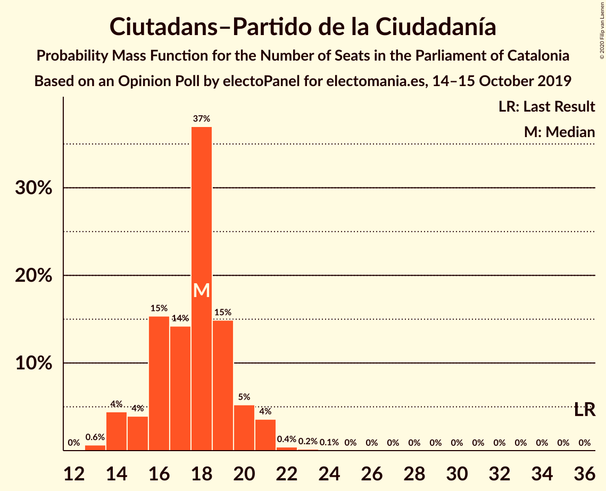
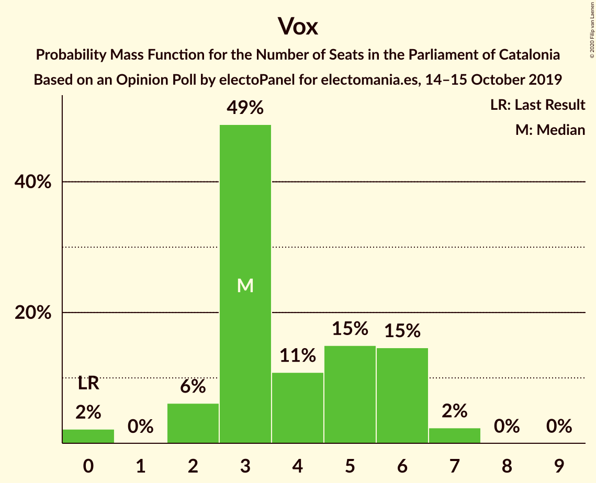
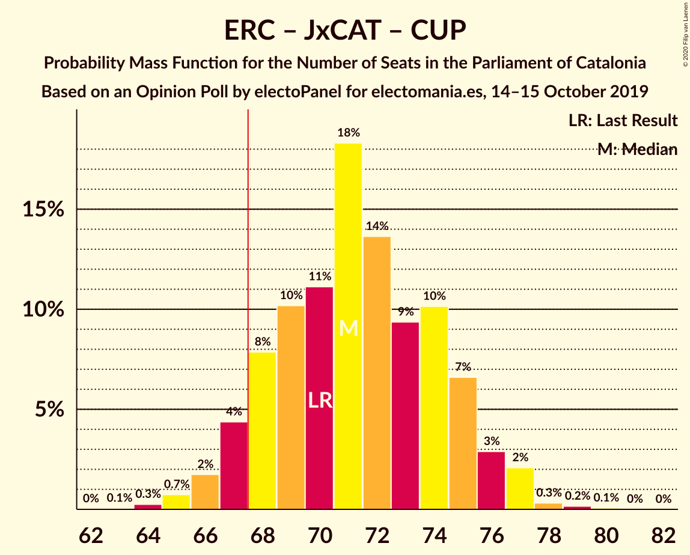
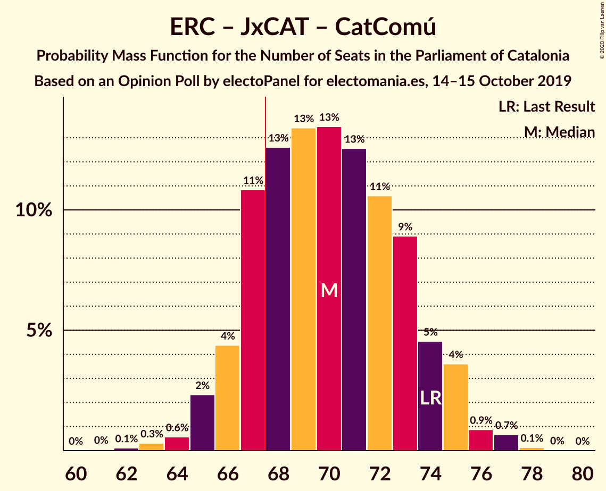
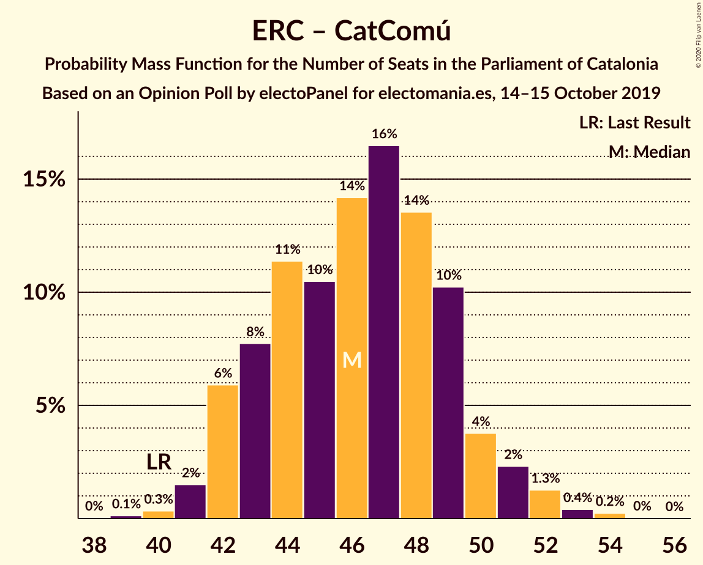

# Opinion Poll by electoPanel for electomania.es, 14–15 October 2019

<a href="#voting-intentions">Voting Intentions</a> | <a href="#seats">Seats</a> | <a href="#coalitions">Coalitions</a> | <a href="#technical-information">Technical Information</a>

## Voting Intentions

### Confidence Intervals

| Party | Last Result | Poll Result | 80% Confidence Interval | 90% Confidence Interval | 95% Confidence Interval | 99% Confidence Interval |
|:-----:|:-----------:|:-----------:|:-----------------------:|:-----------------------:|:-----------------------:|:-----------------------:|
| Esquerra Republicana–Catalunya Sí | 21.4% | 24.3% | 22.6–26.1% |22.1–26.6% |21.7–27.1% |21.0–27.9% |
| Partit dels Socialistes de Catalunya (PSC-PSOE) | 13.9% | 20.2% | 18.6–21.9% |18.2–22.4% |17.8–22.8% |17.1–23.6% |
| Junts pel Catalunya | 21.7% | 15.1% | 13.7–16.6% |13.3–17.1% |13.0–17.5% |12.4–18.2% |
| Ciutadans–Partido de la Ciudadanía | 25.4% | 13.1% | 11.8–14.6% |11.4–15.0% |11.1–15.3% |10.6–16.1% |
| Catalunya en Comú–Podem | 7.5% | 8.0% | 7.0–9.2% |6.7–9.6% |6.5–9.9% |6.0–10.5% |
| Candidatura d’Unitat Popular | 4.5% | 7.9% | 6.9–9.1% |6.6–9.4% |6.4–9.7% |5.9–10.3% |
| Partit Popular | 4.2% | 5.0% | 4.2–6.0% |4.0–6.3% |3.8–6.5% |3.5–7.1% |
| Vox | 0.0% | 4.0% | 3.3–4.9% |3.1–5.2% |2.9–5.4% |2.7–5.9% |

*Note:* The poll result column reflects the actual value used in the calculations. Published results may vary slightly, and in addition be rounded to fewer digits.

## Seats

### Confidence Intervals

| Party | Last Result | Median | 80% Confidence Interval | 90% Confidence Interval | 95% Confidence Interval | 99% Confidence Interval |
|:-----:|:-----------:|:------:|:-----------------------:|:-----------------------:|:-----------------------:|:-----------------------:|
| <a href="#esquerra-republicana–catalunya-sí">Esquerra Republicana–Catalunya Sí</a> | 32 | 37 | 34–40 |34–41 |33–41 |32–43 |
| <a href="#partit-dels-socialistes-de-catalunya-(psc-psoe)">Partit dels Socialistes de Catalunya (PSC-PSOE)</a> | 17 | 28 | 24–30 |24–31 |24–31 |23–33 |
| <a href="#junts-pel-catalunya">Junts pel Catalunya</a> | 34 | 23 | 22–26 |22–27 |21–27 |18–29 |
| <a href="#ciutadans–partido-de-la-ciudadanía">Ciutadans–Partido de la Ciudadanía</a> | 36 | 18 | 15–19 |14–20 |14–21 |13–22 |
| <a href="#catalunya-en-comú–podem">Catalunya en Comú–Podem</a> | 8 | 9 | 8–11 |7–12 |7–12 |6–13 |
| <a href="#candidatura-d’unitat-popular">Candidatura d’Unitat Popular</a> | 4 | 11 | 9–12 |8–13 |8–13 |8–15 |
| <a href="#partit-popular">Partit Popular</a> | 4 | 6 | 4–7 |3–7 |3–9 |3–9 |
| <a href="#vox">Vox</a> | 0 | 3 | 3–6 |2–6 |2–6 |0–7 |

### Esquerra Republicana–Catalunya Sí

*For a full overview of the results for this party, see the [Esquerra Republicana–Catalunya Sí](party-esquerrarepublicana–catalunyasí.html) page.*

| Number of Seats | Probability | Accumulated | Special Marks |
|:---------------:|:-----------:|:-----------:|:-------------:|
| 30 | 0.1% | 100% |  |
| 31 | 0.2% | 99.9% |  |
| 32 | 2% | 99.7% | Last Result |
| 33 | 2% | 98% |  |
| 34 | 10% | 96% |  |
| 35 | 12% | 86% |  |
| 36 | 5% | 74% |  |
| 37 | 31% | 69% | Median |
| 38 | 16% | 39% |  |
| 39 | 10% | 23% |  |
| 40 | 5% | 13% |  |
| 41 | 6% | 7% |  |
| 42 | 0.6% | 1.4% |  |
| 43 | 0.6% | 0.8% |  |
| 44 | 0.1% | 0.2% |  |
| 45 | 0.1% | 0.1% |  |
| 46 | 0% | 0% |  |

### Partit dels Socialistes de Catalunya (PSC-PSOE)

*For a full overview of the results for this party, see the [Partit dels Socialistes de Catalunya (PSC-PSOE)](party-partitdelssocialistesdecatalunyapsc-psoe.html) page.*

| Number of Seats | Probability | Accumulated | Special Marks |
|:---------------:|:-----------:|:-----------:|:-------------:|
| 17 | 0% | 100% | Last Result |
| 18 | 0% | 100% |  |
| 19 | 0% | 100% |  |
| 20 | 0% | 100% |  |
| 21 | 0% | 100% |  |
| 22 | 0% | 100% |  |
| 23 | 0.6% | 100% |  |
| 24 | 13% | 99.4% |  |
| 25 | 13% | 87% |  |
| 26 | 5% | 74% |  |
| 27 | 10% | 68% |  |
| 28 | 14% | 58% | Median |
| 29 | 27% | 44% |  |
| 30 | 8% | 17% |  |
| 31 | 7% | 9% |  |
| 32 | 0.7% | 2% |  |
| 33 | 0.6% | 0.8% |  |
| 34 | 0.2% | 0.2% |  |
| 35 | 0% | 0% |  |

### Junts pel Catalunya

*For a full overview of the results for this party, see the [Junts pel Catalunya](party-juntspelcatalunya.html) page.*

| Number of Seats | Probability | Accumulated | Special Marks |
|:---------------:|:-----------:|:-----------:|:-------------:|
| 18 | 1.2% | 100% |  |
| 19 | 0.1% | 98.8% |  |
| 20 | 1.0% | 98.6% |  |
| 21 | 2% | 98% |  |
| 22 | 13% | 96% |  |
| 23 | 38% | 82% | Median |
| 24 | 15% | 44% |  |
| 25 | 16% | 30% |  |
| 26 | 6% | 14% |  |
| 27 | 6% | 8% |  |
| 28 | 0.5% | 2% |  |
| 29 | 0.6% | 1.1% |  |
| 30 | 0.4% | 0.5% |  |
| 31 | 0.1% | 0.1% |  |
| 32 | 0% | 0% |  |
| 33 | 0% | 0% |  |
| 34 | 0% | 0% | Last Result |

### Ciutadans–Partido de la Ciudadanía

*For a full overview of the results for this party, see the [Ciutadans–Partido de la Ciudadanía](party-ciutadans–partidodelaciudadanía.html) page.*

| Number of Seats | Probability | Accumulated | Special Marks |
|:---------------:|:-----------:|:-----------:|:-------------:|
| 13 | 0.7% | 100% |  |
| 14 | 5% | 99.3% |  |
| 15 | 6% | 94% |  |
| 16 | 12% | 89% |  |
| 17 | 8% | 77% |  |
| 18 | 48% | 69% | Median |
| 19 | 13% | 21% |  |
| 20 | 3% | 8% |  |
| 21 | 4% | 5% |  |
| 22 | 0.7% | 0.9% |  |
| 23 | 0.1% | 0.2% |  |
| 24 | 0.1% | 0.1% |  |
| 25 | 0% | 0% |  |
| 26 | 0% | 0% |  |
| 27 | 0% | 0% |  |
| 28 | 0% | 0% |  |
| 29 | 0% | 0% |  |
| 30 | 0% | 0% |  |
| 31 | 0% | 0% |  |
| 32 | 0% | 0% |  |
| 33 | 0% | 0% |  |
| 34 | 0% | 0% |  |
| 35 | 0% | 0% |  |
| 36 | 0% | 0% | Last Result |

### Catalunya en Comú–Podem

*For a full overview of the results for this party, see the [Catalunya en Comú–Podem](party-catalunyaencomú–podem.html) page.*

| Number of Seats | Probability | Accumulated | Special Marks |
|:---------------:|:-----------:|:-----------:|:-------------:|
| 5 | 0.2% | 100% |  |
| 6 | 0.7% | 99.8% |  |
| 7 | 8% | 99.1% |  |
| 8 | 39% | 91% | Last Result |
| 9 | 20% | 52% | Median |
| 10 | 19% | 31% |  |
| 11 | 8% | 13% |  |
| 12 | 3% | 5% |  |
| 13 | 2% | 2% |  |
| 14 | 0.2% | 0.2% |  |
| 15 | 0% | 0% |  |

### Candidatura d’Unitat Popular

*For a full overview of the results for this party, see the [Candidatura d’Unitat Popular](party-candidaturad’unitatpopular.html) page.*

| Number of Seats | Probability | Accumulated | Special Marks |
|:---------------:|:-----------:|:-----------:|:-------------:|
| 4 | 0% | 100% | Last Result |
| 5 | 0% | 100% |  |
| 6 | 0% | 100% |  |
| 7 | 0.2% | 100% |  |
| 8 | 7% | 99.8% |  |
| 9 | 12% | 93% |  |
| 10 | 19% | 81% |  |
| 11 | 49% | 62% | Median |
| 12 | 5% | 13% |  |
| 13 | 6% | 8% |  |
| 14 | 2% | 2% |  |
| 15 | 0.6% | 0.7% |  |
| 16 | 0% | 0.1% |  |
| 17 | 0% | 0% |  |

### Partit Popular

*For a full overview of the results for this party, see the [Partit Popular](party-partitpopular.html) page.*

| Number of Seats | Probability | Accumulated | Special Marks |
|:---------------:|:-----------:|:-----------:|:-------------:|
| 2 | 0.2% | 100% |  |
| 3 | 7% | 99.8% |  |
| 4 | 6% | 93% | Last Result |
| 5 | 16% | 87% |  |
| 6 | 52% | 71% | Median |
| 7 | 15% | 19% |  |
| 8 | 1.1% | 4% |  |
| 9 | 3% | 3% |  |
| 10 | 0.1% | 0.1% |  |
| 11 | 0% | 0% |  |

### Vox

*For a full overview of the results for this party, see the [Vox](party-vox.html) page.*

| Number of Seats | Probability | Accumulated | Special Marks |
|:---------------:|:-----------:|:-----------:|:-------------:|
| 0 | 2% | 100% | Last Result |
| 1 | 0% | 98% |  |
| 2 | 7% | 98% |  |
| 3 | 57% | 91% | Median |
| 4 | 6% | 34% |  |
| 5 | 12% | 28% |  |
| 6 | 14% | 17% |  |
| 7 | 2% | 2% |  |
| 8 | 0% | 0.1% |  |
| 9 | 0% | 0% |  |

## Coalitions

### Confidence Intervals

| Coalition | Last Result | Median | Majority? | 80% Confidence Interval | 90% Confidence Interval | 95% Confidence Interval | 99% Confidence Interval |
|:---------:|:-----------:|:------:|:---------:|:-----------------------:|:-----------------------:|:-----------------------:|:-----------------------:|
| Esquerra Republicana–Catalunya Sí – Partit dels Socialistes de Catalunya (PSC-PSOE) – Catalunya en Comú–Podem | 57 | 74 | 98.9% | 70–78 | 69–78 | 68–78 | 67–81 |
| Esquerra Republicana–Catalunya Sí – Junts pel Catalunya – Candidatura d’Unitat Popular | 70 | 71 | 94% | 68–75 | 67–75 | 66–76 | 65–78 |
| Esquerra Republicana–Catalunya Sí – Junts pel Catalunya – Catalunya en Comú–Podem | 74 | 69 | 86% | 67–73 | 66–74 | 65–75 | 64–76 |
| Esquerra Republicana–Catalunya Sí – Junts pel Catalunya | 66 | 60 | 0.3% | 58–64 | 57–65 | 57–66 | 54–67 |
| Partit dels Socialistes de Catalunya (PSC-PSOE) – Ciutadans–Partido de la Ciudadanía – Catalunya en Comú–Podem – Partit Popular | 65 | 61 | 0.1% | 57–62 | 56–64 | 54–65 | 53–66 |
| Partit dels Socialistes de Catalunya (PSC-PSOE) – Ciutadans–Partido de la Ciudadanía – Partit Popular – Vox | 57 | 55 | 0% | 51–58 | 51–59 | 50–59 | 48–60 |
| Partit dels Socialistes de Catalunya (PSC-PSOE) – Ciutadans–Partido de la Ciudadanía – Partit Popular | 57 | 52 | 0% | 47–53 | 46–54 | 46–56 | 45–57 |
| Esquerra Republicana–Catalunya Sí – Catalunya en Comú–Podem | 40 | 45 | 0% | 43–49 | 42–50 | 41–51 | 41–53 |

### Esquerra Republicana–Catalunya Sí – Partit dels Socialistes de Catalunya (PSC-PSOE) – Catalunya en Comú–Podem

| Number of Seats | Probability | Accumulated | Special Marks |
|:---------------:|:-----------:|:-----------:|:-------------:|
| 57 | 0% | 100% | Last Result |
| 58 | 0% | 100% |  |
| 59 | 0% | 100% |  |
| 60 | 0% | 100% |  |
| 61 | 0% | 100% |  |
| 62 | 0% | 100% |  |
| 63 | 0% | 100% |  |
| 64 | 0% | 100% |  |
| 65 | 0.1% | 100% |  |
| 66 | 0.1% | 99.9% |  |
| 67 | 0.9% | 99.8% |  |
| 68 | 2% | 98.9% | Majority |
| 69 | 3% | 97% |  |
| 70 | 5% | 94% |  |
| 71 | 15% | 89% |  |
| 72 | 8% | 74% |  |
| 73 | 7% | 67% |  |
| 74 | 32% | 59% | Median |
| 75 | 8% | 27% |  |
| 76 | 4% | 19% |  |
| 77 | 3% | 16% |  |
| 78 | 10% | 12% |  |
| 79 | 1.2% | 2% |  |
| 80 | 0.5% | 1.2% |  |
| 81 | 0.7% | 0.8% |  |
| 82 | 0.1% | 0.1% |  |
| 83 | 0% | 0% |  |

### Esquerra Republicana–Catalunya Sí – Junts pel Catalunya – Candidatura d’Unitat Popular

| Number of Seats | Probability | Accumulated | Special Marks |
|:---------------:|:-----------:|:-----------:|:-------------:|
| 63 | 0.1% | 100% |  |
| 64 | 0.3% | 99.9% |  |
| 65 | 0.4% | 99.6% |  |
| 66 | 2% | 99.2% |  |
| 67 | 2% | 97% |  |
| 68 | 11% | 94% | Majority |
| 69 | 6% | 83% |  |
| 70 | 5% | 77% | Last Result |
| 71 | 34% | 73% | Median |
| 72 | 7% | 39% |  |
| 73 | 9% | 32% |  |
| 74 | 8% | 24% |  |
| 75 | 11% | 15% |  |
| 76 | 3% | 4% |  |
| 77 | 0.8% | 1.3% |  |
| 78 | 0.3% | 0.5% |  |
| 79 | 0.2% | 0.2% |  |
| 80 | 0% | 0% |  |

### Esquerra Republicana–Catalunya Sí – Junts pel Catalunya – Catalunya en Comú–Podem

| Number of Seats | Probability | Accumulated | Special Marks |
|:---------------:|:-----------:|:-----------:|:-------------:|
| 62 | 0.1% | 100% |  |
| 63 | 0.2% | 99.9% |  |
| 64 | 0.5% | 99.6% |  |
| 65 | 2% | 99.1% |  |
| 66 | 4% | 97% |  |
| 67 | 7% | 93% |  |
| 68 | 28% | 86% | Majority |
| 69 | 15% | 58% | Median |
| 70 | 7% | 43% |  |
| 71 | 5% | 35% |  |
| 72 | 13% | 30% |  |
| 73 | 9% | 17% |  |
| 74 | 4% | 8% | Last Result |
| 75 | 3% | 4% |  |
| 76 | 0.7% | 1.0% |  |
| 77 | 0.2% | 0.4% |  |
| 78 | 0.1% | 0.1% |  |
| 79 | 0% | 0% |  |

### Esquerra Republicana–Catalunya Sí – Junts pel Catalunya

| Number of Seats | Probability | Accumulated | Special Marks |
|:---------------:|:-----------:|:-----------:|:-------------:|
| 52 | 0.1% | 100% |  |
| 53 | 0.2% | 99.9% |  |
| 54 | 0.3% | 99.7% |  |
| 55 | 1.1% | 99.4% |  |
| 56 | 0.7% | 98% |  |
| 57 | 3% | 98% |  |
| 58 | 10% | 94% |  |
| 59 | 11% | 85% |  |
| 60 | 37% | 74% | Median |
| 61 | 7% | 37% |  |
| 62 | 3% | 30% |  |
| 63 | 6% | 28% |  |
| 64 | 12% | 22% |  |
| 65 | 6% | 9% |  |
| 66 | 2% | 3% | Last Result |
| 67 | 0.8% | 1.0% |  |
| 68 | 0.2% | 0.3% | Majority |
| 69 | 0.1% | 0.1% |  |
| 70 | 0% | 0% |  |

### Partit dels Socialistes de Catalunya (PSC-PSOE) – Ciutadans–Partido de la Ciudadanía – Catalunya en Comú–Podem – Partit Popular

| Number of Seats | Probability | Accumulated | Special Marks |
|:---------------:|:-----------:|:-----------:|:-------------:|
| 52 | 0% | 100% |  |
| 53 | 0.7% | 99.9% |  |
| 54 | 2% | 99.2% |  |
| 55 | 0.9% | 97% |  |
| 56 | 4% | 96% |  |
| 57 | 10% | 92% |  |
| 58 | 11% | 82% |  |
| 59 | 11% | 71% |  |
| 60 | 5% | 60% |  |
| 61 | 38% | 55% | Median |
| 62 | 9% | 18% |  |
| 63 | 2% | 9% |  |
| 64 | 3% | 6% |  |
| 65 | 2% | 4% | Last Result |
| 66 | 2% | 2% |  |
| 67 | 0.3% | 0.5% |  |
| 68 | 0.1% | 0.1% | Majority |
| 69 | 0% | 0% |  |

### Partit dels Socialistes de Catalunya (PSC-PSOE) – Ciutadans–Partido de la Ciudadanía – Partit Popular – Vox

| Number of Seats | Probability | Accumulated | Special Marks |
|:---------------:|:-----------:|:-----------:|:-------------:|
| 46 | 0.1% | 100% |  |
| 47 | 0.1% | 99.9% |  |
| 48 | 0.4% | 99.8% |  |
| 49 | 1.1% | 99.4% |  |
| 50 | 1.2% | 98% |  |
| 51 | 8% | 97% |  |
| 52 | 14% | 89% |  |
| 53 | 8% | 74% |  |
| 54 | 8% | 67% |  |
| 55 | 13% | 59% | Median |
| 56 | 28% | 46% |  |
| 57 | 7% | 19% | Last Result |
| 58 | 5% | 11% |  |
| 59 | 5% | 6% |  |
| 60 | 0.8% | 1.3% |  |
| 61 | 0.4% | 0.5% |  |
| 62 | 0.1% | 0.1% |  |
| 63 | 0% | 0.1% |  |
| 64 | 0% | 0% |  |

### Partit dels Socialistes de Catalunya (PSC-PSOE) – Ciutadans–Partido de la Ciudadanía – Partit Popular

| Number of Seats | Probability | Accumulated | Special Marks |
|:---------------:|:-----------:|:-----------:|:-------------:|
| 43 | 0.1% | 100% |  |
| 44 | 0.2% | 99.8% |  |
| 45 | 2% | 99.7% |  |
| 46 | 3% | 98% |  |
| 47 | 5% | 95% |  |
| 48 | 5% | 90% |  |
| 49 | 15% | 84% |  |
| 50 | 9% | 69% |  |
| 51 | 6% | 60% |  |
| 52 | 20% | 54% | Median |
| 53 | 28% | 34% |  |
| 54 | 2% | 6% |  |
| 55 | 2% | 5% |  |
| 56 | 2% | 3% |  |
| 57 | 0.6% | 1.0% | Last Result |
| 58 | 0.3% | 0.3% |  |
| 59 | 0% | 0% |  |

### Esquerra Republicana–Catalunya Sí – Catalunya en Comú–Podem

| Number of Seats | Probability | Accumulated | Special Marks |
|:---------------:|:-----------:|:-----------:|:-------------:|
| 38 | 0.1% | 100% |  |
| 39 | 0.1% | 99.9% |  |
| 40 | 0.2% | 99.9% | Last Result |
| 41 | 3% | 99.7% |  |
| 42 | 4% | 97% |  |
| 43 | 9% | 93% |  |
| 44 | 4% | 84% |  |
| 45 | 32% | 80% |  |
| 46 | 6% | 49% | Median |
| 47 | 21% | 43% |  |
| 48 | 6% | 22% |  |
| 49 | 7% | 16% |  |
| 50 | 6% | 9% |  |
| 51 | 2% | 4% |  |
| 52 | 0.5% | 1.2% |  |
| 53 | 0.6% | 0.7% |  |
| 54 | 0% | 0.1% |  |
| 55 | 0.1% | 0.1% |  |
| 56 | 0% | 0% |  |

## Technical Information

### Opinion Poll

+ **Polling firm:** electoPanel
+ **Commissioner(s):** electomania.es
+ **Fieldwork period:** 14–15 October 2019

### Calculations

+ **Sample size:** 1000
+ **Simulations done:** 131,072
+ **Error estimate:** 1.42%

