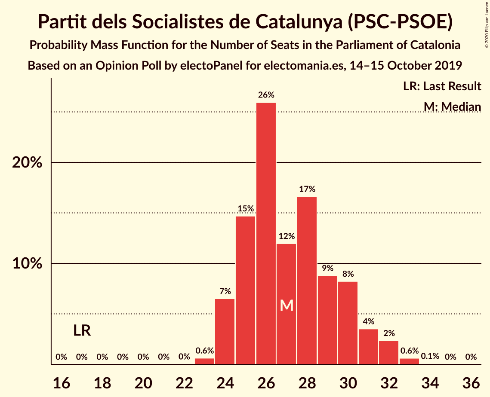
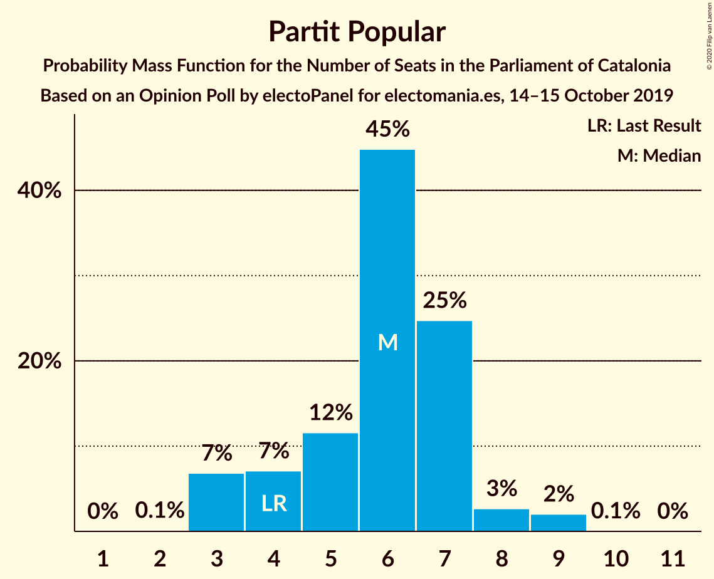
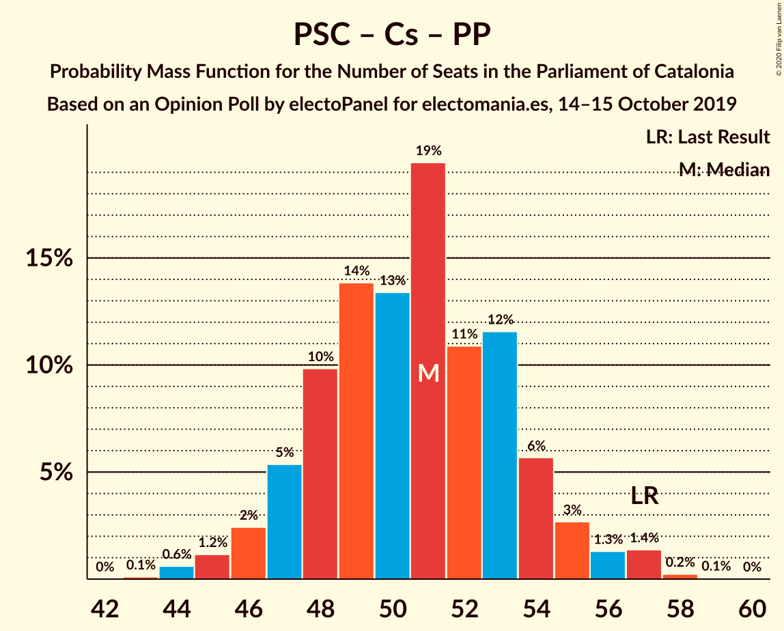

# Opinion Poll by electoPanel for electomania.es, 14–15 October 2019

<a href="#voting-intentions">Voting Intentions</a> | <a href="#seats">Seats</a> | <a href="#coalitions">Coalitions</a> | <a href="#technical-information">Technical Information</a>

## Voting Intentions

### Confidence Intervals

| Party | Last Result | Poll Result | 80% Confidence Interval | 90% Confidence Interval | 95% Confidence Interval | 99% Confidence Interval |
|:-----:|:-----------:|:-----------:|:-----------------------:|:-----------------------:|:-----------------------:|:-----------------------:|
| Esquerra Republicana–Catalunya Sí | 21.4% | 24.3% | 22.6–26.1% |22.1–26.6% |21.7–27.1% |21.0–27.9% |
| Partit dels Socialistes de Catalunya (PSC-PSOE) | 13.9% | 20.2% | 18.6–21.9% |18.2–22.4% |17.8–22.8% |17.1–23.6% |
| Junts per Catalunya | 21.7% | 15.1% | 13.7–16.6% |13.3–17.1% |13.0–17.5% |12.4–18.2% |
| Ciutadans–Partido de la Ciudadanía | 25.4% | 13.1% | 11.8–14.6% |11.4–15.0% |11.1–15.3% |10.6–16.1% |
| Catalunya en Comú–Podem | 7.5% | 8.0% | 7.0–9.2% |6.7–9.6% |6.5–9.9% |6.0–10.5% |
| Candidatura d’Unitat Popular | 4.5% | 7.9% | 6.9–9.1% |6.6–9.4% |6.4–9.7% |5.9–10.3% |
| Partit Popular | 4.2% | 5.0% | 4.2–6.0% |4.0–6.3% |3.8–6.5% |3.5–7.1% |
| Vox | 0.0% | 4.0% | 3.3–4.9% |3.1–5.2% |2.9–5.4% |2.7–5.9% |

*Note:* The poll result column reflects the actual value used in the calculations. Published results may vary slightly, and in addition be rounded to fewer digits.

## Seats

### Confidence Intervals

| Party | Last Result | Median | 80% Confidence Interval | 90% Confidence Interval | 95% Confidence Interval | 99% Confidence Interval |
|:-----:|:-----------:|:------:|:-----------------------:|:-----------------------:|:-----------------------:|:-----------------------:|
| <a href="#esquerra-republicana–catalunya-sí">Esquerra Republicana–Catalunya Sí</a> | 32 | 37 | 34–40 |34–41 |33–41 |32–43 |
| <a href="#partit-dels-socialistes-de-catalunya-(psc-psoe)">Partit dels Socialistes de Catalunya (PSC-PSOE)</a> | 17 | 27 | 25–30 |24–31 |24–32 |23–33 |
| <a href="#junts-per-catalunya">Junts per Catalunya</a> | 34 | 23 | 22–26 |21–27 |20–27 |18–29 |
| <a href="#ciutadans–partido-de-la-ciudadanía">Ciutadans–Partido de la Ciudadanía</a> | 36 | 18 | 16–19 |14–20 |14–21 |13–22 |
| <a href="#catalunya-en-comú–podem">Catalunya en Comú–Podem</a> | 8 | 9 | 8–11 |7–12 |7–12 |6–13 |
| <a href="#candidatura-d’unitat-popular">Candidatura d’Unitat Popular</a> | 4 | 11 | 9–13 |8–13 |8–13 |8–15 |
| <a href="#partit-popular">Partit Popular</a> | 4 | 6 | 4–7 |3–7 |3–8 |3–9 |
| <a href="#vox">Vox</a> | 0 | 3 | 3–6 |2–6 |2–6 |0–7 |

### Esquerra Republicana–Catalunya Sí

*For a full overview of the results for this party, see the [Esquerra Republicana–Catalunya Sí](party-esquerrarepublicana–catalunyasí.html) page.*

| Number of Seats | Probability | Accumulated | Special Marks |
|:---------------:|:-----------:|:-----------:|:-------------:|
| 30 | 0.1% | 100% |  |
| 31 | 0.3% | 99.9% |  |
| 32 | 2% | 99.6% | Last Result |
| 33 | 3% | 98% |  |
| 34 | 11% | 95% |  |
| 35 | 14% | 84% |  |
| 36 | 14% | 71% |  |
| 37 | 13% | 57% | Median |
| 38 | 20% | 44% |  |
| 39 | 9% | 24% |  |
| 40 | 7% | 15% |  |
| 41 | 5% | 8% |  |
| 42 | 1.2% | 2% |  |
| 43 | 0.6% | 1.0% |  |
| 44 | 0.4% | 0.4% |  |
| 45 | 0.1% | 0.1% |  |
| 46 | 0% | 0% |  |

### Partit dels Socialistes de Catalunya (PSC-PSOE)

*For a full overview of the results for this party, see the [Partit dels Socialistes de Catalunya (PSC-PSOE)](party-partitdelssocialistesdecatalunyapsc-psoe.html) page.*

| Number of Seats | Probability | Accumulated | Special Marks |
|:---------------:|:-----------:|:-----------:|:-------------:|
| 17 | 0% | 100% | Last Result |
| 18 | 0% | 100% |  |
| 19 | 0% | 100% |  |
| 20 | 0% | 100% |  |
| 21 | 0% | 100% |  |
| 22 | 0% | 100% |  |
| 23 | 0.6% | 99.9% |  |
| 24 | 7% | 99.3% |  |
| 25 | 15% | 93% |  |
| 26 | 26% | 78% |  |
| 27 | 12% | 52% | Median |
| 28 | 17% | 40% |  |
| 29 | 9% | 24% |  |
| 30 | 8% | 15% |  |
| 31 | 4% | 7% |  |
| 32 | 2% | 3% |  |
| 33 | 0.6% | 0.7% |  |
| 34 | 0.1% | 0.1% |  |
| 35 | 0% | 0% |  |

### Junts per Catalunya

*For a full overview of the results for this party, see the [Junts per Catalunya](party-juntspercatalunya.html) page.*

| Number of Seats | Probability | Accumulated | Special Marks |
|:---------------:|:-----------:|:-----------:|:-------------:|
| 18 | 0.9% | 100% |  |
| 19 | 0.5% | 99.1% |  |
| 20 | 2% | 98.5% |  |
| 21 | 4% | 97% |  |
| 22 | 10% | 93% |  |
| 23 | 35% | 83% | Median |
| 24 | 15% | 48% |  |
| 25 | 17% | 32% |  |
| 26 | 6% | 15% |  |
| 27 | 7% | 9% |  |
| 28 | 1.1% | 2% |  |
| 29 | 1.0% | 1.4% |  |
| 30 | 0.3% | 0.4% |  |
| 31 | 0.1% | 0.1% |  |
| 32 | 0% | 0% |  |
| 33 | 0% | 0% |  |
| 34 | 0% | 0% | Last Result |

### Ciutadans–Partido de la Ciudadanía

*For a full overview of the results for this party, see the [Ciutadans–Partido de la Ciudadanía](party-ciutadans–partidodelaciudadanía.html) page.*

| Number of Seats | Probability | Accumulated | Special Marks |
|:---------------:|:-----------:|:-----------:|:-------------:|
| 13 | 0.6% | 100% |  |
| 14 | 4% | 99.3% |  |
| 15 | 4% | 95% |  |
| 16 | 15% | 91% |  |
| 17 | 14% | 76% |  |
| 18 | 37% | 61% | Median |
| 19 | 15% | 24% |  |
| 20 | 5% | 9% |  |
| 21 | 4% | 4% |  |
| 22 | 0.4% | 0.7% |  |
| 23 | 0.2% | 0.3% |  |
| 24 | 0.1% | 0.1% |  |
| 25 | 0% | 0% |  |
| 26 | 0% | 0% |  |
| 27 | 0% | 0% |  |
| 28 | 0% | 0% |  |
| 29 | 0% | 0% |  |
| 30 | 0% | 0% |  |
| 31 | 0% | 0% |  |
| 32 | 0% | 0% |  |
| 33 | 0% | 0% |  |
| 34 | 0% | 0% |  |
| 35 | 0% | 0% |  |
| 36 | 0% | 0% | Last Result |

### Catalunya en Comú–Podem

*For a full overview of the results for this party, see the [Catalunya en Comú–Podem](party-catalunyaencomú–podem.html) page.*

| Number of Seats | Probability | Accumulated | Special Marks |
|:---------------:|:-----------:|:-----------:|:-------------:|
| 5 | 0.3% | 100% |  |
| 6 | 0.7% | 99.7% |  |
| 7 | 7% | 99.0% |  |
| 8 | 34% | 92% | Last Result |
| 9 | 12% | 58% | Median |
| 10 | 28% | 46% |  |
| 11 | 11% | 18% |  |
| 12 | 5% | 7% |  |
| 13 | 2% | 2% |  |
| 14 | 0.1% | 0.2% |  |
| 15 | 0% | 0% |  |

### Candidatura d’Unitat Popular

*For a full overview of the results for this party, see the [Candidatura d’Unitat Popular](party-candidaturad’unitatpopular.html) page.*

| Number of Seats | Probability | Accumulated | Special Marks |
|:---------------:|:-----------:|:-----------:|:-------------:|
| 4 | 0% | 100% | Last Result |
| 5 | 0% | 100% |  |
| 6 | 0% | 100% |  |
| 7 | 0.2% | 100% |  |
| 8 | 9% | 99.8% |  |
| 9 | 11% | 91% |  |
| 10 | 27% | 80% |  |
| 11 | 35% | 53% | Median |
| 12 | 6% | 18% |  |
| 13 | 9% | 11% |  |
| 14 | 2% | 2% |  |
| 15 | 0.6% | 0.6% |  |
| 16 | 0.1% | 0.1% |  |
| 17 | 0% | 0% |  |

### Partit Popular

*For a full overview of the results for this party, see the [Partit Popular](party-partitpopular.html) page.*

| Number of Seats | Probability | Accumulated | Special Marks |
|:---------------:|:-----------:|:-----------:|:-------------:|
| 2 | 0.1% | 100% |  |
| 3 | 7% | 99.9% |  |
| 4 | 7% | 93% | Last Result |
| 5 | 12% | 86% |  |
| 6 | 45% | 74% | Median |
| 7 | 25% | 30% |  |
| 8 | 3% | 5% |  |
| 9 | 2% | 2% |  |
| 10 | 0.1% | 0.1% |  |
| 11 | 0% | 0% |  |

### Vox

*For a full overview of the results for this party, see the [Vox](party-vox.html) page.*

| Number of Seats | Probability | Accumulated | Special Marks |
|:---------------:|:-----------:|:-----------:|:-------------:|
| 0 | 2% | 100% | Last Result |
| 1 | 0% | 98% |  |
| 2 | 6% | 98% |  |
| 3 | 49% | 92% | Median |
| 4 | 11% | 43% |  |
| 5 | 15% | 32% |  |
| 6 | 15% | 17% |  |
| 7 | 2% | 2% |  |
| 8 | 0% | 0.1% |  |
| 9 | 0% | 0% |  |

## Coalitions

### Confidence Intervals

| Coalition | Last Result | Median | Majority? | 80% Confidence Interval | 90% Confidence Interval | 95% Confidence Interval | 99% Confidence Interval |
|:---------:|:-----------:|:------:|:---------:|:-----------------------:|:-----------------------:|:-----------------------:|:-----------------------:|
| Esquerra Republicana–Catalunya Sí – Partit dels Socialistes de Catalunya (PSC-PSOE) – Catalunya en Comú–Podem | 57 | 73 | 99.1% | 70–77 | 69–78 | 68–78 | 67–80 |
| Esquerra Republicana–Catalunya Sí – Junts per Catalunya – Candidatura d’Unitat Popular | 70 | 71 | 93% | 68–75 | 67–76 | 66–77 | 65–78 |
| Esquerra Republicana–Catalunya Sí – Junts per Catalunya – Catalunya en Comú–Podem | 74 | 70 | 81% | 67–73 | 66–75 | 65–75 | 64–77 |
| Esquerra Republicana–Catalunya Sí – Junts per Catalunya | 66 | 60 | 0.3% | 58–65 | 57–65 | 57–66 | 54–67 |
| Partit dels Socialistes de Catalunya (PSC-PSOE) – Ciutadans–Partido de la Ciudadanía – Catalunya en Comú–Podem – Partit Popular | 65 | 60 | 0.1% | 56–63 | 56–64 | 55–65 | 53–67 |
| Partit dels Socialistes de Catalunya (PSC-PSOE) – Ciutadans–Partido de la Ciudadanía – Partit Popular – Vox | 57 | 54 | 0% | 51–58 | 50–59 | 50–60 | 48–61 |
| Partit dels Socialistes de Catalunya (PSC-PSOE) – Ciutadans–Partido de la Ciudadanía – Partit Popular | 57 | 51 | 0% | 48–54 | 47–55 | 46–56 | 44–57 |
| Esquerra Republicana–Catalunya Sí – Catalunya en Comú–Podem | 40 | 46 | 0% | 43–49 | 42–50 | 42–51 | 40–53 |

### Esquerra Republicana–Catalunya Sí – Partit dels Socialistes de Catalunya (PSC-PSOE) – Catalunya en Comú–Podem

| Number of Seats | Probability | Accumulated | Special Marks |
|:---------------:|:-----------:|:-----------:|:-------------:|
| 57 | 0% | 100% | Last Result |
| 58 | 0% | 100% |  |
| 59 | 0% | 100% |  |
| 60 | 0% | 100% |  |
| 61 | 0% | 100% |  |
| 62 | 0% | 100% |  |
| 63 | 0% | 100% |  |
| 64 | 0% | 100% |  |
| 65 | 0% | 100% |  |
| 66 | 0.2% | 99.9% |  |
| 67 | 0.7% | 99.8% |  |
| 68 | 2% | 99.1% | Majority |
| 69 | 4% | 97% |  |
| 70 | 8% | 93% |  |
| 71 | 9% | 85% |  |
| 72 | 14% | 75% |  |
| 73 | 12% | 61% | Median |
| 74 | 16% | 49% |  |
| 75 | 14% | 34% |  |
| 76 | 9% | 20% |  |
| 77 | 4% | 11% |  |
| 78 | 5% | 7% |  |
| 79 | 1.0% | 2% |  |
| 80 | 0.6% | 1.0% |  |
| 81 | 0.2% | 0.3% |  |
| 82 | 0.1% | 0.1% |  |
| 83 | 0% | 0% |  |

### Esquerra Republicana–Catalunya Sí – Junts per Catalunya – Candidatura d’Unitat Popular

| Number of Seats | Probability | Accumulated | Special Marks |
|:---------------:|:-----------:|:-----------:|:-------------:|
| 63 | 0.1% | 100% |  |
| 64 | 0.3% | 99.9% |  |
| 65 | 0.7% | 99.6% |  |
| 66 | 2% | 98.9% |  |
| 67 | 4% | 97% |  |
| 68 | 8% | 93% | Majority |
| 69 | 10% | 85% |  |
| 70 | 11% | 75% | Last Result |
| 71 | 18% | 64% | Median |
| 72 | 14% | 45% |  |
| 73 | 9% | 32% |  |
| 74 | 10% | 22% |  |
| 75 | 7% | 12% |  |
| 76 | 3% | 6% |  |
| 77 | 2% | 3% |  |
| 78 | 0.3% | 0.6% |  |
| 79 | 0.2% | 0.2% |  |
| 80 | 0.1% | 0.1% |  |
| 81 | 0% | 0% |  |

### Esquerra Republicana–Catalunya Sí – Junts per Catalunya – Catalunya en Comú–Podem

| Number of Seats | Probability | Accumulated | Special Marks |
|:---------------:|:-----------:|:-----------:|:-------------:|
| 61 | 0% | 100% |  |
| 62 | 0.1% | 99.9% |  |
| 63 | 0.3% | 99.8% |  |
| 64 | 0.6% | 99.5% |  |
| 65 | 2% | 98.9% |  |
| 66 | 4% | 97% |  |
| 67 | 11% | 92% |  |
| 68 | 13% | 81% | Majority |
| 69 | 13% | 69% | Median |
| 70 | 13% | 55% |  |
| 71 | 13% | 42% |  |
| 72 | 11% | 29% |  |
| 73 | 9% | 19% |  |
| 74 | 5% | 10% | Last Result |
| 75 | 4% | 5% |  |
| 76 | 0.9% | 2% |  |
| 77 | 0.7% | 0.8% |  |
| 78 | 0.1% | 0.2% |  |
| 79 | 0% | 0% |  |

### Esquerra Republicana–Catalunya Sí – Junts per Catalunya

| Number of Seats | Probability | Accumulated | Special Marks |
|:---------------:|:-----------:|:-----------:|:-------------:|
| 52 | 0.1% | 100% |  |
| 53 | 0.2% | 99.9% |  |
| 54 | 0.4% | 99.7% |  |
| 55 | 0.6% | 99.4% |  |
| 56 | 0.8% | 98.8% |  |
| 57 | 5% | 98% |  |
| 58 | 14% | 93% |  |
| 59 | 16% | 79% |  |
| 60 | 17% | 63% | Median |
| 61 | 11% | 45% |  |
| 62 | 5% | 35% |  |
| 63 | 8% | 29% |  |
| 64 | 10% | 21% |  |
| 65 | 7% | 11% |  |
| 66 | 3% | 4% | Last Result |
| 67 | 0.7% | 1.0% |  |
| 68 | 0.2% | 0.3% | Majority |
| 69 | 0.1% | 0.1% |  |
| 70 | 0% | 0% |  |

### Partit dels Socialistes de Catalunya (PSC-PSOE) – Ciutadans–Partido de la Ciudadanía – Catalunya en Comú–Podem – Partit Popular

| Number of Seats | Probability | Accumulated | Special Marks |
|:---------------:|:-----------:|:-----------:|:-------------:|
| 52 | 0.1% | 100% |  |
| 53 | 0.4% | 99.9% |  |
| 54 | 2% | 99.4% |  |
| 55 | 3% | 98% |  |
| 56 | 7% | 95% |  |
| 57 | 6% | 88% |  |
| 58 | 11% | 82% |  |
| 59 | 13% | 71% |  |
| 60 | 14% | 58% | Median |
| 61 | 20% | 43% |  |
| 62 | 8% | 23% |  |
| 63 | 7% | 15% |  |
| 64 | 4% | 8% |  |
| 65 | 3% | 4% | Last Result |
| 66 | 1.1% | 2% |  |
| 67 | 0.4% | 0.5% |  |
| 68 | 0.1% | 0.1% | Majority |
| 69 | 0% | 0% |  |

### Partit dels Socialistes de Catalunya (PSC-PSOE) – Ciutadans–Partido de la Ciudadanía – Partit Popular – Vox

| Number of Seats | Probability | Accumulated | Special Marks |
|:---------------:|:-----------:|:-----------:|:-------------:|
| 46 | 0.1% | 100% |  |
| 47 | 0.1% | 99.9% |  |
| 48 | 0.8% | 99.8% |  |
| 49 | 1.3% | 99.0% |  |
| 50 | 3% | 98% |  |
| 51 | 7% | 95% |  |
| 52 | 11% | 88% |  |
| 53 | 11% | 77% |  |
| 54 | 18% | 65% | Median |
| 55 | 13% | 47% |  |
| 56 | 13% | 34% |  |
| 57 | 9% | 21% | Last Result |
| 58 | 6% | 12% |  |
| 59 | 3% | 6% |  |
| 60 | 2% | 3% |  |
| 61 | 0.5% | 0.7% |  |
| 62 | 0.1% | 0.2% |  |
| 63 | 0.1% | 0.1% |  |
| 64 | 0% | 0% |  |

### Partit dels Socialistes de Catalunya (PSC-PSOE) – Ciutadans–Partido de la Ciudadanía – Partit Popular

| Number of Seats | Probability | Accumulated | Special Marks |
|:---------------:|:-----------:|:-----------:|:-------------:|
| 43 | 0.1% | 100% |  |
| 44 | 0.6% | 99.9% |  |
| 45 | 1.2% | 99.3% |  |
| 46 | 2% | 98% |  |
| 47 | 5% | 96% |  |
| 48 | 10% | 90% |  |
| 49 | 14% | 80% |  |
| 50 | 13% | 67% |  |
| 51 | 19% | 53% | Median |
| 52 | 11% | 34% |  |
| 53 | 12% | 23% |  |
| 54 | 6% | 11% |  |
| 55 | 3% | 6% |  |
| 56 | 1.3% | 3% |  |
| 57 | 1.4% | 2% | Last Result |
| 58 | 0.2% | 0.3% |  |
| 59 | 0.1% | 0.1% |  |
| 60 | 0% | 0% |  |

### Esquerra Republicana–Catalunya Sí – Catalunya en Comú–Podem

| Number of Seats | Probability | Accumulated | Special Marks |
|:---------------:|:-----------:|:-----------:|:-------------:|
| 39 | 0.1% | 100% |  |
| 40 | 0.3% | 99.8% | Last Result |
| 41 | 2% | 99.5% |  |
| 42 | 6% | 98% |  |
| 43 | 8% | 92% |  |
| 44 | 11% | 84% |  |
| 45 | 10% | 73% |  |
| 46 | 14% | 62% | Median |
| 47 | 16% | 48% |  |
| 48 | 14% | 32% |  |
| 49 | 10% | 18% |  |
| 50 | 4% | 8% |  |
| 51 | 2% | 4% |  |
| 52 | 1.3% | 2% |  |
| 53 | 0.4% | 0.7% |  |
| 54 | 0.2% | 0.3% |  |
| 55 | 0% | 0% |  |

## Technical Information

### Opinion Poll

+ **Polling firm:** electoPanel
+ **Commissioner(s):** electomania.es
+ **Fieldwork period:** 14–15 October 2019

### Calculations

+ **Sample size:** 1000
+ **Simulations done:** 1,048,576
+ **Error estimate:** 1.20%

