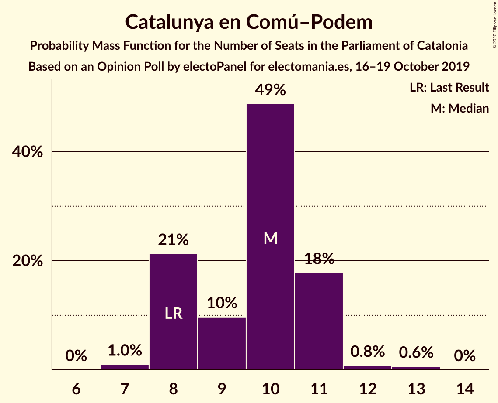
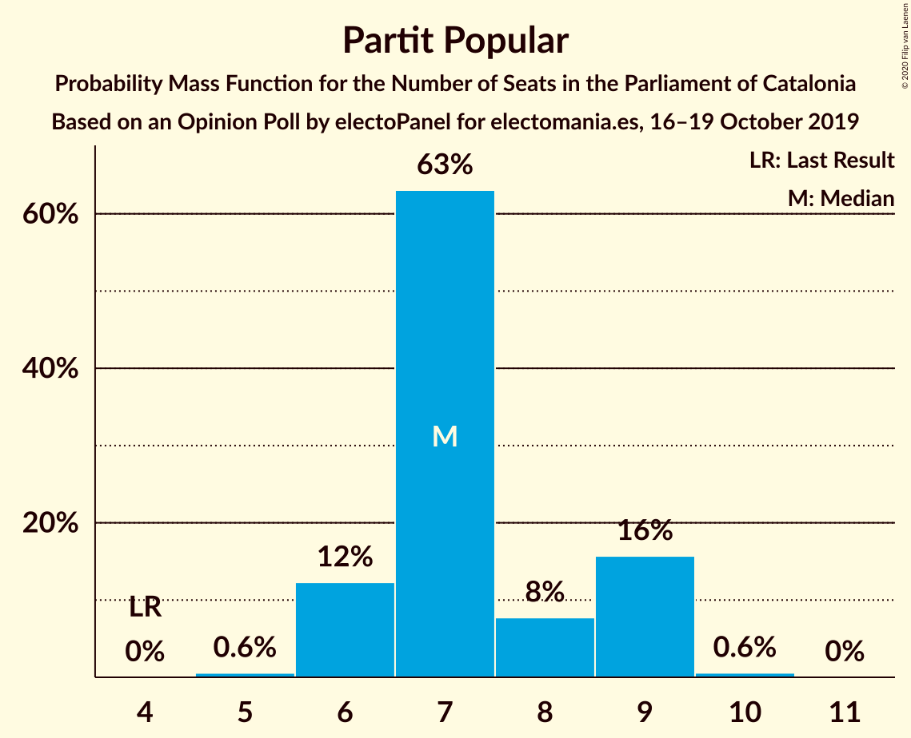
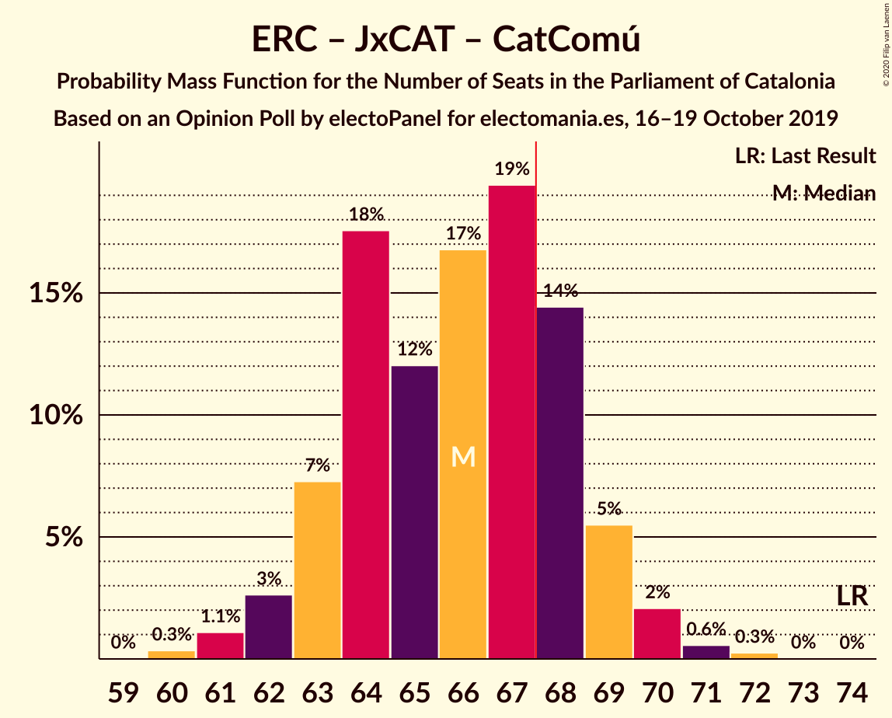

# Opinion Poll by electoPanel for electomania.es, 16–19 October 2019

<a href="#voting-intentions">Voting Intentions</a> | <a href="#seats">Seats</a> | <a href="#coalitions">Coalitions</a> | <a href="#technical-information">Technical Information</a>

## Voting Intentions

### Confidence Intervals

| Party | Last Result | Poll Result | 80% Confidence Interval | 90% Confidence Interval | 95% Confidence Interval | 99% Confidence Interval |
|:-----:|:-----------:|:-----------:|:-----------------------:|:-----------------------:|:-----------------------:|:-----------------------:|
| Esquerra Republicana–Catalunya Sí | 21.4% | 24.5% | 23.3–25.8% |23.0–26.1% |22.7–26.4% |22.1–27.1% |
| Partit dels Socialistes de Catalunya (PSC-PSOE) | 13.9% | 17.6% | 16.5–18.7% |16.2–19.1% |16.0–19.3% |15.5–19.9% |
| Ciutadans–Partido de la Ciudadanía | 25.4% | 15.1% | 14.1–16.2% |13.8–16.5% |13.6–16.8% |13.1–17.3% |
| Junts pel Catalunya | 21.7% | 12.3% | 11.4–13.3% |11.1–13.6% |10.9–13.8% |10.5–14.3% |
| Candidatura d’Unitat Popular | 4.5% | 10.5% | 9.7–11.4% |9.4–11.7% |9.2–11.9% |8.8–12.4% |
| Catalunya en Comú–Podem | 7.5% | 8.2% | 7.5–9.0% |7.3–9.3% |7.1–9.5% |6.7–9.9% |
| Partit Popular | 4.2% | 6.0% | 5.4–6.7% |5.2–7.0% |5.0–7.1% |4.8–7.5% |
| Vox | 0.0% | 3.3% | 2.8–3.9% |2.7–4.0% |2.6–4.2% |2.4–4.5% |

*Note:* The poll result column reflects the actual value used in the calculations. Published results may vary slightly, and in addition be rounded to fewer digits.

## Seats

### Confidence Intervals

| Party | Last Result | Median | 80% Confidence Interval | 90% Confidence Interval | 95% Confidence Interval | 99% Confidence Interval |
|:-----:|:-----------:|:------:|:-----------------------:|:-----------------------:|:-----------------------:|:-----------------------:|
| <a href="#esquerra-republicana–catalunya-sí">Esquerra Republicana–Catalunya Sí</a> | 32 | 37 | 37 |34–38 |34–38 |34–38 |
| <a href="#partit-dels-socialistes-de-catalunya-(psc-psoe)">Partit dels Socialistes de Catalunya (PSC-PSOE)</a> | 17 | 26 | 24–26 |23–26 |23–26 |21–26 |
| <a href="#ciutadans–partido-de-la-ciudadanía">Ciutadans–Partido de la Ciudadanía</a> | 36 | 18 | 18–21 |18–21 |18–23 |18–23 |
| <a href="#junts-pel-catalunya">Junts pel Catalunya</a> | 34 | 19 | 19 |18–22 |18–23 |17–23 |
| <a href="#candidatura-d’unitat-popular">Candidatura d’Unitat Popular</a> | 4 | 15 | 15 |15–17 |11–18 |11–18 |
| <a href="#catalunya-en-comú–podem">Catalunya en Comú–Podem</a> | 8 | 10 | 10 |8–10 |8–11 |8–12 |
| <a href="#partit-popular">Partit Popular</a> | 4 | 7 | 7 |7–9 |7–9 |7–9 |
| <a href="#vox">Vox</a> | 0 | 3 | 3 |0–3 |0–3 |0–3 |

### Esquerra Republicana–Catalunya Sí

*For a full overview of the results for this party, see the [Esquerra Republicana–Catalunya Sí](party-esquerrarepublicana–catalunyasí.html) page.*

| Number of Seats | Probability | Accumulated | Special Marks |
|:---------------:|:-----------:|:-----------:|:-------------:|
| 32 | 0% | 100% | Last Result |
| 33 | 0% | 100% |  |
| 34 | 5% | 99.9% |  |
| 35 | 3% | 94% |  |
| 36 | 0% | 91% |  |
| 37 | 86% | 91% | Median |
| 38 | 5% | 5% |  |
| 39 | 0% | 0.5% |  |
| 40 | 0.1% | 0.4% |  |
| 41 | 0.3% | 0.3% |  |
| 42 | 0% | 0% |  |

### Partit dels Socialistes de Catalunya (PSC-PSOE)

*For a full overview of the results for this party, see the [Partit dels Socialistes de Catalunya (PSC-PSOE)](party-partitdelssocialistesdecatalunyapsc-psoe.html) page.*

| Number of Seats | Probability | Accumulated | Special Marks |
|:---------------:|:-----------:|:-----------:|:-------------:|
| 17 | 0% | 100% | Last Result |
| 18 | 0% | 100% |  |
| 19 | 0% | 100% |  |
| 20 | 0% | 100% |  |
| 21 | 1.3% | 100% |  |
| 22 | 0.1% | 98.7% |  |
| 23 | 5% | 98.6% |  |
| 24 | 4% | 93% |  |
| 25 | 5% | 90% |  |
| 26 | 85% | 85% | Median |
| 27 | 0% | 0.1% |  |
| 28 | 0% | 0.1% |  |
| 29 | 0% | 0.1% |  |
| 30 | 0.1% | 0.1% |  |
| 31 | 0% | 0% |  |

### Ciutadans–Partido de la Ciudadanía

*For a full overview of the results for this party, see the [Ciutadans–Partido de la Ciudadanía](party-ciutadans–partidodelaciudadanía.html) page.*

| Number of Seats | Probability | Accumulated | Special Marks |
|:---------------:|:-----------:|:-----------:|:-------------:|
| 18 | 86% | 100% | Median |
| 19 | 2% | 14% |  |
| 20 | 1.3% | 12% |  |
| 21 | 6% | 11% |  |
| 22 | 0.9% | 5% |  |
| 23 | 4% | 4% |  |
| 24 | 0% | 0.1% |  |
| 25 | 0.1% | 0.1% |  |
| 26 | 0% | 0% |  |
| 27 | 0% | 0% |  |
| 28 | 0% | 0% |  |
| 29 | 0% | 0% |  |
| 30 | 0% | 0% |  |
| 31 | 0% | 0% |  |
| 32 | 0% | 0% |  |
| 33 | 0% | 0% |  |
| 34 | 0% | 0% |  |
| 35 | 0% | 0% |  |
| 36 | 0% | 0% | Last Result |

### Junts pel Catalunya

*For a full overview of the results for this party, see the [Junts pel Catalunya](party-juntspelcatalunya.html) page.*

| Number of Seats | Probability | Accumulated | Special Marks |
|:---------------:|:-----------:|:-----------:|:-------------:|
| 14 | 0.1% | 100% |  |
| 15 | 0.3% | 99.9% |  |
| 16 | 0% | 99.7% |  |
| 17 | 1.3% | 99.7% |  |
| 18 | 4% | 98% |  |
| 19 | 85% | 94% | Median |
| 20 | 1.2% | 9% |  |
| 21 | 0.1% | 8% |  |
| 22 | 5% | 8% |  |
| 23 | 3% | 3% |  |
| 24 | 0% | 0% |  |
| 25 | 0% | 0% |  |
| 26 | 0% | 0% |  |
| 27 | 0% | 0% |  |
| 28 | 0% | 0% |  |
| 29 | 0% | 0% |  |
| 30 | 0% | 0% |  |
| 31 | 0% | 0% |  |
| 32 | 0% | 0% |  |
| 33 | 0% | 0% |  |
| 34 | 0% | 0% | Last Result |

### Candidatura d’Unitat Popular

*For a full overview of the results for this party, see the [Candidatura d’Unitat Popular](party-candidaturad’unitatpopular.html) page.*

| Number of Seats | Probability | Accumulated | Special Marks |
|:---------------:|:-----------:|:-----------:|:-------------:|
| 4 | 0% | 100% | Last Result |
| 5 | 0% | 100% |  |
| 6 | 0% | 100% |  |
| 7 | 0% | 100% |  |
| 8 | 0% | 100% |  |
| 9 | 0% | 100% |  |
| 10 | 0% | 100% |  |
| 11 | 3% | 100% |  |
| 12 | 0% | 97% |  |
| 13 | 2% | 97% |  |
| 14 | 0.3% | 96% |  |
| 15 | 87% | 95% | Median |
| 16 | 0% | 9% |  |
| 17 | 6% | 9% |  |
| 18 | 2% | 3% |  |
| 19 | 0% | 0% |  |

### Catalunya en Comú–Podem

*For a full overview of the results for this party, see the [Catalunya en Comú–Podem](party-catalunyaencomú–podem.html) page.*

| Number of Seats | Probability | Accumulated | Special Marks |
|:---------------:|:-----------:|:-----------:|:-------------:|
| 8 | 6% | 100% | Last Result |
| 9 | 2% | 93% |  |
| 10 | 86% | 91% | Median |
| 11 | 4% | 5% |  |
| 12 | 0.9% | 1.2% |  |
| 13 | 0.3% | 0.3% |  |
| 14 | 0% | 0% |  |

### Partit Popular

*For a full overview of the results for this party, see the [Partit Popular](party-partitpopular.html) page.*

| Number of Seats | Probability | Accumulated | Special Marks |
|:---------------:|:-----------:|:-----------:|:-------------:|
| 4 | 0% | 100% | Last Result |
| 5 | 0.1% | 100% |  |
| 6 | 0.1% | 99.9% |  |
| 7 | 94% | 99.8% | Median |
| 8 | 0.3% | 6% |  |
| 9 | 5% | 5% |  |
| 10 | 0% | 0% |  |

### Vox

*For a full overview of the results for this party, see the [Vox](party-vox.html) page.*

| Number of Seats | Probability | Accumulated | Special Marks |
|:---------------:|:-----------:|:-----------:|:-------------:|
| 0 | 7% | 100% | Last Result |
| 1 | 0% | 93% |  |
| 2 | 0.1% | 93% |  |
| 3 | 92% | 93% | Median |
| 4 | 0.1% | 0.4% |  |
| 5 | 0.3% | 0.3% |  |
| 6 | 0.1% | 0.1% |  |
| 7 | 0% | 0% |  |

## Coalitions

### Confidence Intervals

| Coalition | Last Result | Median | Majority? | 80% Confidence Interval | 90% Confidence Interval | 95% Confidence Interval | 99% Confidence Interval |
|:---------:|:-----------:|:------:|:---------:|:-----------------------:|:-----------------------:|:-----------------------:|:-----------------------:|
| Esquerra Republicana–Catalunya Sí – Junts pel Catalunya – Candidatura d’Unitat Popular | 70 | 71 | 100% | 71 | 69–73 | 69–74 | 68–74 |
| Esquerra Republicana–Catalunya Sí – Partit dels Socialistes de Catalunya (PSC-PSOE) – Catalunya en Comú–Podem | 57 | 73 | 95% | 71–73 | 65–73 | 65–73 | 65–73 |
| Esquerra Republicana–Catalunya Sí – Junts pel Catalunya – Catalunya en Comú–Podem | 74 | 66 | 4% | 66 | 64–66 | 64–69 | 63–69 |
| Partit dels Socialistes de Catalunya (PSC-PSOE) – Ciutadans–Partido de la Ciudadanía – Catalunya en Comú–Podem – Partit Popular | 65 | 61 | 0% | 61 | 59–63 | 59–66 | 59–66 |
| Esquerra Republicana–Catalunya Sí – Junts pel Catalunya | 66 | 56 | 0% | 56 | 56 | 55–58 | 53–58 |
| Partit dels Socialistes de Catalunya (PSC-PSOE) – Ciutadans–Partido de la Ciudadanía – Partit Popular – Vox | 57 | 54 | 0% | 54 | 54–55 | 52–55 | 52–56 |
| Partit dels Socialistes de Catalunya (PSC-PSOE) – Ciutadans–Partido de la Ciudadanía – Partit Popular | 57 | 51 | 0% | 51 | 51–52 | 51–55 | 51–55 |
| Esquerra Republicana–Catalunya Sí – Catalunya en Comú–Podem | 40 | 47 | 0% | 47 | 42–47 | 42–48 | 42–49 |

### Esquerra Republicana–Catalunya Sí – Junts pel Catalunya – Candidatura d’Unitat Popular

| Number of Seats | Probability | Accumulated | Special Marks |
|:---------------:|:-----------:|:-----------:|:-------------:|
| 68 | 2% | 100% | Majority |
| 69 | 3% | 98% |  |
| 70 | 0.3% | 95% | Last Result |
| 71 | 85% | 95% | Median |
| 72 | 0.8% | 10% |  |
| 73 | 6% | 9% |  |
| 74 | 2% | 3% |  |
| 75 | 0% | 0.1% |  |
| 76 | 0% | 0% |  |

### Esquerra Republicana–Catalunya Sí – Partit dels Socialistes de Catalunya (PSC-PSOE) – Catalunya en Comú–Podem

| Number of Seats | Probability | Accumulated | Special Marks |
|:---------------:|:-----------:|:-----------:|:-------------:|
| 57 | 0% | 100% | Last Result |
| 58 | 0% | 100% |  |
| 59 | 0% | 100% |  |
| 60 | 0% | 100% |  |
| 61 | 0% | 100% |  |
| 62 | 0% | 100% |  |
| 63 | 0% | 100% |  |
| 64 | 0% | 100% |  |
| 65 | 5% | 100% |  |
| 66 | 0% | 95% |  |
| 67 | 0.1% | 95% |  |
| 68 | 0% | 95% | Majority |
| 69 | 0.8% | 95% |  |
| 70 | 1.2% | 94% |  |
| 71 | 5% | 93% |  |
| 72 | 0.8% | 87% |  |
| 73 | 86% | 86% | Median |
| 74 | 0% | 0.2% |  |
| 75 | 0.1% | 0.2% |  |
| 76 | 0.1% | 0.1% |  |
| 77 | 0% | 0% |  |

### Esquerra Republicana–Catalunya Sí – Junts pel Catalunya – Catalunya en Comú–Podem

| Number of Seats | Probability | Accumulated | Special Marks |
|:---------------:|:-----------:|:-----------:|:-------------:|
| 63 | 0.8% | 100% |  |
| 64 | 6% | 99.2% |  |
| 65 | 3% | 94% |  |
| 66 | 86% | 90% | Median |
| 67 | 0% | 4% |  |
| 68 | 1.2% | 4% | Majority |
| 69 | 3% | 3% |  |
| 70 | 0.1% | 0.1% |  |
| 71 | 0% | 0% |  |
| 72 | 0% | 0% |  |
| 73 | 0% | 0% |  |
| 74 | 0% | 0% | Last Result |

### Partit dels Socialistes de Catalunya (PSC-PSOE) – Ciutadans–Partido de la Ciudadanía – Catalunya en Comú–Podem – Partit Popular

| Number of Seats | Probability | Accumulated | Special Marks |
|:---------------:|:-----------:|:-----------:|:-------------:|
| 59 | 5% | 100% |  |
| 60 | 0.1% | 95% |  |
| 61 | 88% | 95% | Median |
| 62 | 1.3% | 7% |  |
| 63 | 0.9% | 6% |  |
| 64 | 2% | 5% |  |
| 65 | 0.3% | 3% | Last Result |
| 66 | 3% | 3% |  |
| 67 | 0% | 0% |  |

### Esquerra Republicana–Catalunya Sí – Junts pel Catalunya

| Number of Seats | Probability | Accumulated | Special Marks |
|:---------------:|:-----------:|:-----------:|:-------------:|
| 53 | 0.8% | 100% |  |
| 54 | 0.1% | 99.1% |  |
| 55 | 2% | 99.0% |  |
| 56 | 93% | 97% | Median |
| 57 | 0.1% | 4% |  |
| 58 | 4% | 4% |  |
| 59 | 0% | 0% |  |
| 60 | 0% | 0% |  |
| 61 | 0% | 0% |  |
| 62 | 0% | 0% |  |
| 63 | 0% | 0% |  |
| 64 | 0% | 0% |  |
| 65 | 0% | 0% |  |
| 66 | 0% | 0% | Last Result |

### Partit dels Socialistes de Catalunya (PSC-PSOE) – Ciutadans–Partido de la Ciudadanía – Partit Popular – Vox

| Number of Seats | Probability | Accumulated | Special Marks |
|:---------------:|:-----------:|:-----------:|:-------------:|
| 52 | 4% | 100% |  |
| 53 | 0.1% | 96% |  |
| 54 | 90% | 96% | Median |
| 55 | 4% | 6% |  |
| 56 | 1.3% | 2% |  |
| 57 | 0.1% | 0.5% | Last Result |
| 58 | 0.4% | 0.4% |  |
| 59 | 0% | 0% |  |

### Partit dels Socialistes de Catalunya (PSC-PSOE) – Ciutadans–Partido de la Ciudadanía – Partit Popular

| Number of Seats | Probability | Accumulated | Special Marks |
|:---------------:|:-----------:|:-----------:|:-------------:|
| 50 | 0% | 100% |  |
| 51 | 90% | 99.9% | Median |
| 52 | 5% | 10% |  |
| 53 | 2% | 5% |  |
| 54 | 0.1% | 3% |  |
| 55 | 3% | 3% |  |
| 56 | 0% | 0% |  |
| 57 | 0% | 0% | Last Result |

### Esquerra Republicana–Catalunya Sí – Catalunya en Comú–Podem

| Number of Seats | Probability | Accumulated | Special Marks |
|:---------------:|:-----------:|:-----------:|:-------------:|
| 40 | 0% | 100% | Last Result |
| 41 | 0% | 100% |  |
| 42 | 5% | 100% |  |
| 43 | 0% | 95% |  |
| 44 | 0% | 95% |  |
| 45 | 0.8% | 95% |  |
| 46 | 3% | 94% |  |
| 47 | 88% | 91% | Median |
| 48 | 1.3% | 3% |  |
| 49 | 2% | 2% |  |
| 50 | 0.1% | 0.1% |  |
| 51 | 0% | 0% |  |

## Technical Information

### Opinion Poll

+ **Polling firm:** electoPanel
+ **Commissioner(s):** electomania.es
+ **Fieldwork period:** 16–19 October 2019

### Calculations

+ **Sample size:** 2000
+ **Simulations done:** 1,024
+ **Error estimate:** 2.91%

