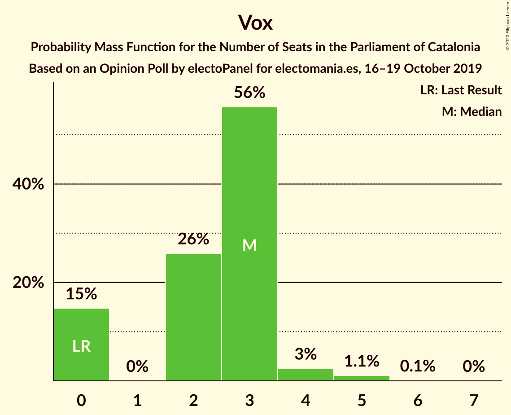
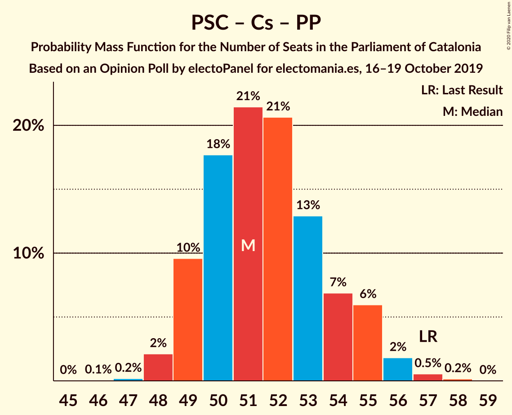

# Opinion Poll by electoPanel for electomania.es, 16–19 October 2019

<a href="#voting-intentions">Voting Intentions</a> | <a href="#seats">Seats</a> | <a href="#coalitions">Coalitions</a> | <a href="#technical-information">Technical Information</a>

## Voting Intentions

### Confidence Intervals

| Party | Last Result | Poll Result | 80% Confidence Interval | 90% Confidence Interval | 95% Confidence Interval | 99% Confidence Interval |
|:-----:|:-----------:|:-----------:|:-----------------------:|:-----------------------:|:-----------------------:|:-----------------------:|
| Esquerra Republicana–Catalunya Sí | 21.4% | 24.5% | 23.3–25.8% |23.0–26.1% |22.7–26.4% |22.1–27.1% |
| Partit dels Socialistes de Catalunya (PSC-PSOE) | 13.9% | 17.6% | 16.5–18.7% |16.2–19.1% |16.0–19.3% |15.5–19.9% |
| Ciutadans–Partido de la Ciudadanía | 25.4% | 15.1% | 14.1–16.2% |13.8–16.5% |13.6–16.8% |13.1–17.3% |
| Junts per Catalunya | 21.7% | 12.3% | 11.4–13.3% |11.1–13.6% |10.9–13.8% |10.5–14.3% |
| Candidatura d’Unitat Popular | 4.5% | 10.5% | 9.7–11.4% |9.4–11.7% |9.2–11.9% |8.8–12.4% |
| Catalunya en Comú–Podem | 7.5% | 8.2% | 7.5–9.0% |7.3–9.3% |7.1–9.5% |6.7–9.9% |
| Partit Popular | 4.2% | 6.0% | 5.4–6.7% |5.2–7.0% |5.0–7.1% |4.8–7.5% |
| Vox | 0.0% | 3.3% | 2.8–3.9% |2.7–4.0% |2.6–4.2% |2.4–4.5% |

*Note:* The poll result column reflects the actual value used in the calculations. Published results may vary slightly, and in addition be rounded to fewer digits.

## Seats

### Confidence Intervals

| Party | Last Result | Median | 80% Confidence Interval | 90% Confidence Interval | 95% Confidence Interval | 99% Confidence Interval |
|:-----:|:-----------:|:------:|:-----------------------:|:-----------------------:|:-----------------------:|:-----------------------:|
| <a href="#esquerra-republicana–catalunya-sí">Esquerra Republicana–Catalunya Sí</a> | 32 | 37 | 35–40 |34–40 |34–41 |34–41 |
| <a href="#partit-dels-socialistes-de-catalunya-(psc-psoe)">Partit dels Socialistes de Catalunya (PSC-PSOE)</a> | 17 | 24 | 23–25 |23–25 |22–26 |21–27 |
| <a href="#ciutadans–partido-de-la-ciudadanía">Ciutadans–Partido de la Ciudadanía</a> | 36 | 20 | 19–22 |18–23 |18–24 |18–25 |
| <a href="#junts-per-catalunya">Junts per Catalunya</a> | 34 | 18 | 18–21 |17–22 |17–22 |17–23 |
| <a href="#candidatura-d’unitat-popular">Candidatura d’Unitat Popular</a> | 4 | 15 | 13–17 |13–17 |13–17 |11–18 |
| <a href="#catalunya-en-comú–podem">Catalunya en Comú–Podem</a> | 8 | 10 | 8–11 |8–11 |8–11 |7–13 |
| <a href="#partit-popular">Partit Popular</a> | 4 | 7 | 6–9 |6–9 |6–9 |5–10 |
| <a href="#vox">Vox</a> | 0 | 3 | 0–3 |0–3 |0–4 |0–5 |

### Esquerra Republicana–Catalunya Sí

*For a full overview of the results for this party, see the [Esquerra Republicana–Catalunya Sí](party-esquerrarepublicana–catalunyasí.html) page.*

| Number of Seats | Probability | Accumulated | Special Marks |
|:---------------:|:-----------:|:-----------:|:-------------:|
| 32 | 0% | 100% | Last Result |
| 33 | 0.3% | 100% |  |
| 34 | 6% | 99.7% |  |
| 35 | 10% | 94% |  |
| 36 | 18% | 83% |  |
| 37 | 17% | 65% | Median |
| 38 | 13% | 48% |  |
| 39 | 18% | 35% |  |
| 40 | 13% | 17% |  |
| 41 | 4% | 4% |  |
| 42 | 0.3% | 0.4% |  |
| 43 | 0.1% | 0.1% |  |
| 44 | 0% | 0% |  |

### Partit dels Socialistes de Catalunya (PSC-PSOE)

*For a full overview of the results for this party, see the [Partit dels Socialistes de Catalunya (PSC-PSOE)](party-partitdelssocialistesdecatalunyapsc-psoe.html) page.*

| Number of Seats | Probability | Accumulated | Special Marks |
|:---------------:|:-----------:|:-----------:|:-------------:|
| 17 | 0% | 100% | Last Result |
| 18 | 0% | 100% |  |
| 19 | 0.1% | 100% |  |
| 20 | 0.3% | 99.9% |  |
| 21 | 1.1% | 99.6% |  |
| 22 | 3% | 98.5% |  |
| 23 | 23% | 96% |  |
| 24 | 45% | 72% | Median |
| 25 | 23% | 27% |  |
| 26 | 3% | 4% |  |
| 27 | 0.4% | 0.6% |  |
| 28 | 0.1% | 0.1% |  |
| 29 | 0% | 0% |  |

### Ciutadans–Partido de la Ciudadanía

*For a full overview of the results for this party, see the [Ciutadans–Partido de la Ciudadanía](party-ciutadans–partidodelaciudadanía.html) page.*

| Number of Seats | Probability | Accumulated | Special Marks |
|:---------------:|:-----------:|:-----------:|:-------------:|
| 17 | 0.1% | 100% |  |
| 18 | 5% | 99.9% |  |
| 19 | 30% | 94% |  |
| 20 | 20% | 64% | Median |
| 21 | 25% | 44% |  |
| 22 | 9% | 18% |  |
| 23 | 5% | 9% |  |
| 24 | 2% | 4% |  |
| 25 | 1.3% | 1.3% |  |
| 26 | 0% | 0.1% |  |
| 27 | 0% | 0% |  |
| 28 | 0% | 0% |  |
| 29 | 0% | 0% |  |
| 30 | 0% | 0% |  |
| 31 | 0% | 0% |  |
| 32 | 0% | 0% |  |
| 33 | 0% | 0% |  |
| 34 | 0% | 0% |  |
| 35 | 0% | 0% |  |
| 36 | 0% | 0% | Last Result |

### Junts per Catalunya

*For a full overview of the results for this party, see the [Junts per Catalunya](party-juntspercatalunya.html) page.*

| Number of Seats | Probability | Accumulated | Special Marks |
|:---------------:|:-----------:|:-----------:|:-------------:|
| 15 | 0.1% | 100% |  |
| 16 | 0.3% | 99.9% |  |
| 17 | 9% | 99.6% |  |
| 18 | 52% | 91% | Median |
| 19 | 10% | 38% |  |
| 20 | 13% | 28% |  |
| 21 | 9% | 15% |  |
| 22 | 3% | 6% |  |
| 23 | 2% | 2% |  |
| 24 | 0% | 0% |  |
| 25 | 0% | 0% |  |
| 26 | 0% | 0% |  |
| 27 | 0% | 0% |  |
| 28 | 0% | 0% |  |
| 29 | 0% | 0% |  |
| 30 | 0% | 0% |  |
| 31 | 0% | 0% |  |
| 32 | 0% | 0% |  |
| 33 | 0% | 0% |  |
| 34 | 0% | 0% | Last Result |

### Candidatura d’Unitat Popular

*For a full overview of the results for this party, see the [Candidatura d’Unitat Popular](party-candidaturad’unitatpopular.html) page.*

| Number of Seats | Probability | Accumulated | Special Marks |
|:---------------:|:-----------:|:-----------:|:-------------:|
| 4 | 0% | 100% | Last Result |
| 5 | 0% | 100% |  |
| 6 | 0% | 100% |  |
| 7 | 0% | 100% |  |
| 8 | 0% | 100% |  |
| 9 | 0% | 100% |  |
| 10 | 0% | 100% |  |
| 11 | 0.7% | 100% |  |
| 12 | 0.8% | 99.3% |  |
| 13 | 9% | 98.6% |  |
| 14 | 21% | 90% |  |
| 15 | 27% | 69% | Median |
| 16 | 25% | 41% |  |
| 17 | 16% | 16% |  |
| 18 | 0.6% | 0.6% |  |
| 19 | 0% | 0% |  |

### Catalunya en Comú–Podem

*For a full overview of the results for this party, see the [Catalunya en Comú–Podem](party-catalunyaencomú–podem.html) page.*

| Number of Seats | Probability | Accumulated | Special Marks |
|:---------------:|:-----------:|:-----------:|:-------------:|
| 7 | 1.0% | 100% |  |
| 8 | 21% | 99.0% | Last Result |
| 9 | 10% | 78% |  |
| 10 | 49% | 68% | Median |
| 11 | 18% | 19% |  |
| 12 | 0.8% | 1.4% |  |
| 13 | 0.6% | 0.6% |  |
| 14 | 0% | 0% |  |

### Partit Popular

*For a full overview of the results for this party, see the [Partit Popular](party-partitpopular.html) page.*

| Number of Seats | Probability | Accumulated | Special Marks |
|:---------------:|:-----------:|:-----------:|:-------------:|
| 4 | 0% | 100% | Last Result |
| 5 | 0.6% | 100% |  |
| 6 | 12% | 99.4% |  |
| 7 | 63% | 87% | Median |
| 8 | 8% | 24% |  |
| 9 | 16% | 16% |  |
| 10 | 0.6% | 0.6% |  |
| 11 | 0% | 0% |  |

### Vox

*For a full overview of the results for this party, see the [Vox](party-vox.html) page.*

| Number of Seats | Probability | Accumulated | Special Marks |
|:---------------:|:-----------:|:-----------:|:-------------:|
| 0 | 15% | 100% | Last Result |
| 1 | 0% | 85% |  |
| 2 | 26% | 85% |  |
| 3 | 56% | 59% | Median |
| 4 | 3% | 4% |  |
| 5 | 1.1% | 1.2% |  |
| 6 | 0.1% | 0.1% |  |
| 7 | 0% | 0% |  |

## Coalitions

### Confidence Intervals

| Coalition | Last Result | Median | Majority? | 80% Confidence Interval | 90% Confidence Interval | 95% Confidence Interval | 99% Confidence Interval |
|:---------:|:-----------:|:------:|:---------:|:-----------------------:|:-----------------------:|:-----------------------:|:-----------------------:|
| Esquerra Republicana–Catalunya Sí – Junts per Catalunya – Candidatura d’Unitat Popular | 70 | 71 | 97% | 69–74 | 68–75 | 67–75 | 66–76 |
| Esquerra Republicana–Catalunya Sí – Partit dels Socialistes de Catalunya (PSC-PSOE) – Catalunya en Comú–Podem | 57 | 71 | 95% | 68–74 | 68–74 | 67–75 | 66–76 |
| Esquerra Republicana–Catalunya Sí – Junts per Catalunya – Catalunya en Comú–Podem | 74 | 66 | 23% | 63–68 | 63–69 | 62–70 | 61–71 |
| Partit dels Socialistes de Catalunya (PSC-PSOE) – Ciutadans–Partido de la Ciudadanía – Catalunya en Comú–Podem – Partit Popular | 65 | 61 | 0.1% | 59–64 | 58–65 | 58–65 | 57–67 |
| Esquerra Republicana–Catalunya Sí – Junts per Catalunya | 66 | 56 | 0% | 54–59 | 53–59 | 53–60 | 52–61 |
| Partit dels Socialistes de Catalunya (PSC-PSOE) – Ciutadans–Partido de la Ciudadanía – Partit Popular – Vox | 57 | 54 | 0% | 52–57 | 51–57 | 50–58 | 50–59 |
| Partit dels Socialistes de Catalunya (PSC-PSOE) – Ciutadans–Partido de la Ciudadanía – Partit Popular | 57 | 51 | 0% | 49–54 | 49–55 | 49–56 | 48–57 |
| Esquerra Republicana–Catalunya Sí – Catalunya en Comú–Podem | 40 | 47 | 0% | 44–50 | 44–50 | 43–51 | 42–52 |

### Esquerra Republicana–Catalunya Sí – Junts per Catalunya – Candidatura d’Unitat Popular

| Number of Seats | Probability | Accumulated | Special Marks |
|:---------------:|:-----------:|:-----------:|:-------------:|
| 65 | 0.1% | 100% |  |
| 66 | 0.9% | 99.9% |  |
| 67 | 2% | 99.0% |  |
| 68 | 4% | 97% | Majority |
| 69 | 8% | 93% |  |
| 70 | 13% | 84% | Last Result, Median |
| 71 | 25% | 71% |  |
| 72 | 17% | 46% |  |
| 73 | 16% | 29% |  |
| 74 | 8% | 13% |  |
| 75 | 4% | 5% |  |
| 76 | 1.1% | 1.3% |  |
| 77 | 0.2% | 0.2% |  |
| 78 | 0% | 0% |  |

### Esquerra Republicana–Catalunya Sí – Partit dels Socialistes de Catalunya (PSC-PSOE) – Catalunya en Comú–Podem

| Number of Seats | Probability | Accumulated | Special Marks |
|:---------------:|:-----------:|:-----------:|:-------------:|
| 57 | 0% | 100% | Last Result |
| 58 | 0% | 100% |  |
| 59 | 0% | 100% |  |
| 60 | 0% | 100% |  |
| 61 | 0% | 100% |  |
| 62 | 0% | 100% |  |
| 63 | 0% | 100% |  |
| 64 | 0% | 100% |  |
| 65 | 0.2% | 100% |  |
| 66 | 1.2% | 99.8% |  |
| 67 | 3% | 98.6% |  |
| 68 | 7% | 95% | Majority |
| 69 | 16% | 88% |  |
| 70 | 16% | 72% |  |
| 71 | 12% | 56% | Median |
| 72 | 11% | 44% |  |
| 73 | 16% | 33% |  |
| 74 | 13% | 17% |  |
| 75 | 3% | 4% |  |
| 76 | 1.2% | 1.3% |  |
| 77 | 0.1% | 0.1% |  |
| 78 | 0% | 0% |  |

### Esquerra Republicana–Catalunya Sí – Junts per Catalunya – Catalunya en Comú–Podem

| Number of Seats | Probability | Accumulated | Special Marks |
|:---------------:|:-----------:|:-----------:|:-------------:|
| 60 | 0.3% | 100% |  |
| 61 | 1.1% | 99.6% |  |
| 62 | 3% | 98.5% |  |
| 63 | 7% | 96% |  |
| 64 | 18% | 89% |  |
| 65 | 12% | 71% | Median |
| 66 | 17% | 59% |  |
| 67 | 19% | 42% |  |
| 68 | 14% | 23% | Majority |
| 69 | 5% | 8% |  |
| 70 | 2% | 3% |  |
| 71 | 0.6% | 0.8% |  |
| 72 | 0.3% | 0.3% |  |
| 73 | 0% | 0% |  |
| 74 | 0% | 0% | Last Result |

### Partit dels Socialistes de Catalunya (PSC-PSOE) – Ciutadans–Partido de la Ciudadanía – Catalunya en Comú–Podem – Partit Popular

| Number of Seats | Probability | Accumulated | Special Marks |
|:---------------:|:-----------:|:-----------:|:-------------:|
| 55 | 0.1% | 100% |  |
| 56 | 0.2% | 99.9% |  |
| 57 | 2% | 99.7% |  |
| 58 | 3% | 98% |  |
| 59 | 13% | 94% |  |
| 60 | 17% | 81% |  |
| 61 | 21% | 65% | Median |
| 62 | 20% | 44% |  |
| 63 | 12% | 24% |  |
| 64 | 6% | 12% |  |
| 65 | 4% | 6% | Last Result |
| 66 | 2% | 2% |  |
| 67 | 0.5% | 0.6% |  |
| 68 | 0.1% | 0.1% | Majority |
| 69 | 0% | 0% |  |

### Esquerra Republicana–Catalunya Sí – Junts per Catalunya

| Number of Seats | Probability | Accumulated | Special Marks |
|:---------------:|:-----------:|:-----------:|:-------------:|
| 51 | 0.4% | 100% |  |
| 52 | 2% | 99.6% |  |
| 53 | 5% | 98% |  |
| 54 | 14% | 92% |  |
| 55 | 14% | 78% | Median |
| 56 | 16% | 65% |  |
| 57 | 22% | 49% |  |
| 58 | 17% | 27% |  |
| 59 | 6% | 10% |  |
| 60 | 3% | 4% |  |
| 61 | 1.0% | 1.3% |  |
| 62 | 0.2% | 0.2% |  |
| 63 | 0% | 0% |  |
| 64 | 0% | 0% |  |
| 65 | 0% | 0% |  |
| 66 | 0% | 0% | Last Result |

### Partit dels Socialistes de Catalunya (PSC-PSOE) – Ciutadans–Partido de la Ciudadanía – Partit Popular – Vox

| Number of Seats | Probability | Accumulated | Special Marks |
|:---------------:|:-----------:|:-----------:|:-------------:|
| 48 | 0.1% | 100% |  |
| 49 | 0.2% | 99.9% |  |
| 50 | 2% | 99.7% |  |
| 51 | 6% | 97% |  |
| 52 | 16% | 92% |  |
| 53 | 17% | 76% |  |
| 54 | 23% | 59% | Median |
| 55 | 16% | 36% |  |
| 56 | 10% | 20% |  |
| 57 | 6% | 10% | Last Result |
| 58 | 4% | 5% |  |
| 59 | 0.7% | 1.0% |  |
| 60 | 0.2% | 0.3% |  |
| 61 | 0% | 0% |  |

### Partit dels Socialistes de Catalunya (PSC-PSOE) – Ciutadans–Partido de la Ciudadanía – Partit Popular

| Number of Seats | Probability | Accumulated | Special Marks |
|:---------------:|:-----------:|:-----------:|:-------------:|
| 46 | 0.1% | 100% |  |
| 47 | 0.2% | 99.9% |  |
| 48 | 2% | 99.7% |  |
| 49 | 10% | 98% |  |
| 50 | 18% | 88% |  |
| 51 | 21% | 70% | Median |
| 52 | 21% | 49% |  |
| 53 | 13% | 28% |  |
| 54 | 7% | 15% |  |
| 55 | 6% | 8% |  |
| 56 | 2% | 3% |  |
| 57 | 0.5% | 0.7% | Last Result |
| 58 | 0.2% | 0.2% |  |
| 59 | 0% | 0% |  |

### Esquerra Republicana–Catalunya Sí – Catalunya en Comú–Podem

| Number of Seats | Probability | Accumulated | Special Marks |
|:---------------:|:-----------:|:-----------:|:-------------:|
| 40 | 0% | 100% | Last Result |
| 41 | 0% | 100% |  |
| 42 | 0.6% | 100% |  |
| 43 | 3% | 99.4% |  |
| 44 | 9% | 97% |  |
| 45 | 14% | 88% |  |
| 46 | 17% | 75% |  |
| 47 | 14% | 58% | Median |
| 48 | 12% | 44% |  |
| 49 | 19% | 33% |  |
| 50 | 10% | 14% |  |
| 51 | 3% | 4% |  |
| 52 | 0.5% | 0.6% |  |
| 53 | 0.1% | 0.1% |  |
| 54 | 0% | 0% |  |

## Technical Information

### Opinion Poll

+ **Polling firm:** electoPanel
+ **Commissioner(s):** electomania.es
+ **Fieldwork period:** 16–19 October 2019

### Calculations

+ **Sample size:** 2000
+ **Simulations done:** 1,048,576
+ **Error estimate:** 1.33%

