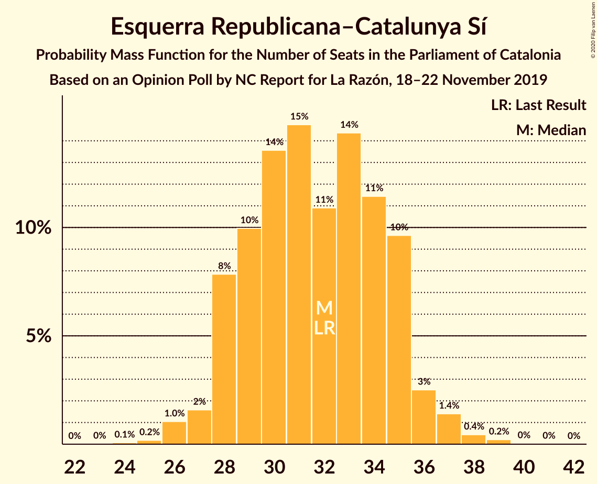
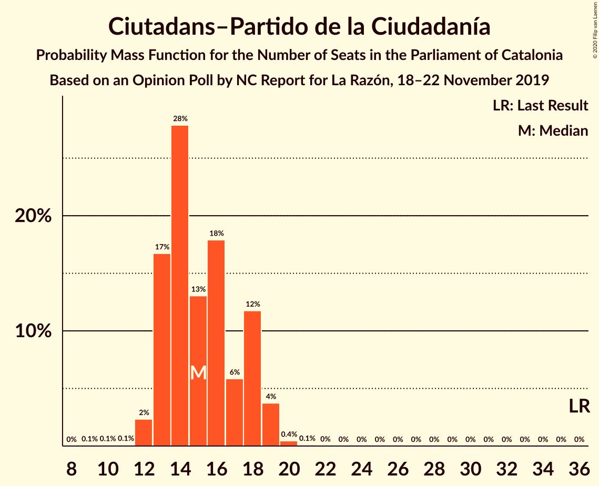
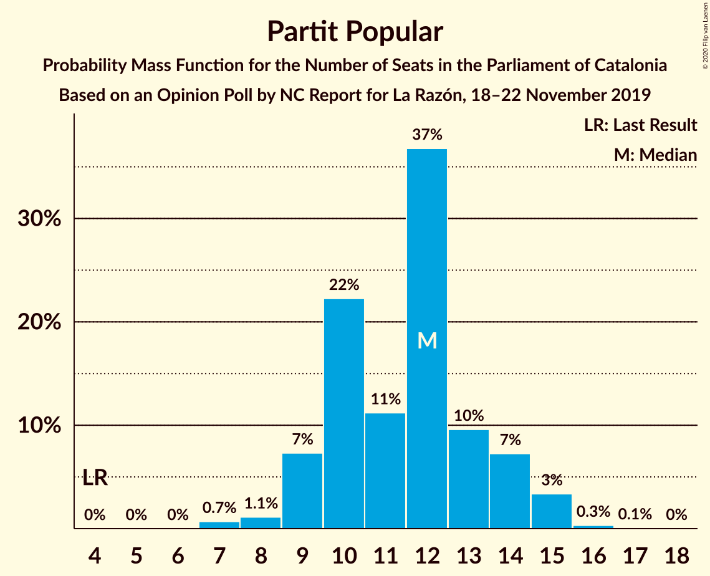
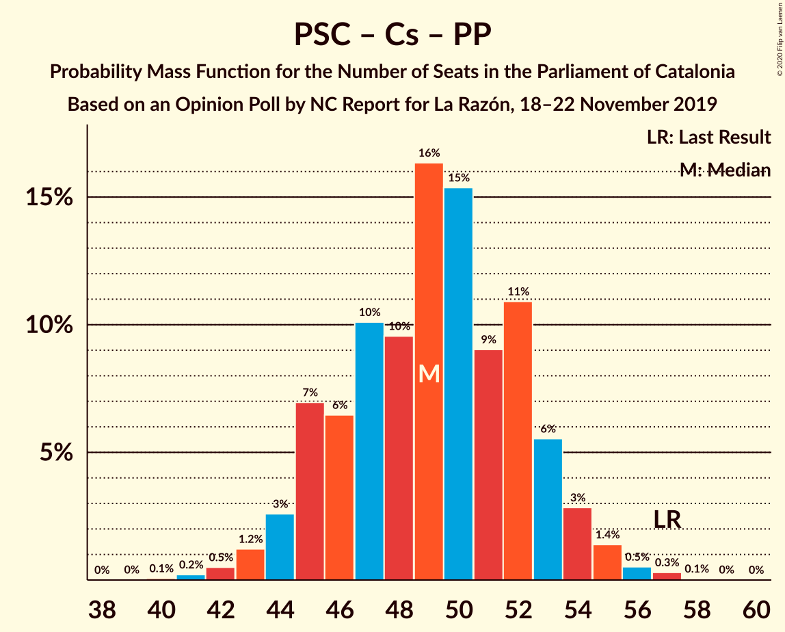
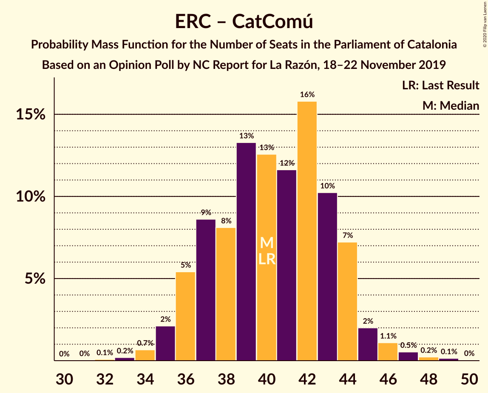

# Opinion Poll by NC Report for La Razón, 18–22 November 2019

<a href="#voting-intentions">Voting Intentions</a> | <a href="#seats">Seats</a> | <a href="#coalitions">Coalitions</a> | <a href="#technical-information">Technical Information</a>

## Voting Intentions

### Confidence Intervals

| Party | Last Result | Poll Result | 80% Confidence Interval | 90% Confidence Interval | 95% Confidence Interval | 99% Confidence Interval |
|:-----:|:-----------:|:-----------:|:-----------------------:|:-----------------------:|:-----------------------:|:-----------------------:|
| Esquerra Republicana–Catalunya Sí | 21.4% | 21.2% | 19.4–23.3% |18.9–23.8% |18.4–24.3% |17.6–25.3% |
| Junts per Catalunya | 21.7% | 19.2% | 17.5–21.2% |17.0–21.7% |16.6–22.2% |15.7–23.2% |
| Partit dels Socialistes de Catalunya (PSC-PSOE) | 13.9% | 16.8% | 15.2–18.7% |14.7–19.2% |14.3–19.7% |13.5–20.6% |
| Ciutadans–Partido de la Ciudadanía | 25.4% | 11.6% | 10.2–13.2% |9.8–13.7% |9.4–14.1% |8.8–14.9% |
| Partit Popular | 4.2% | 8.7% | 7.5–10.2% |7.2–10.6% |6.9–11.0% |6.4–11.7% |
| Catalunya en Comú–Podem | 7.5% | 7.7% | 6.5–9.1% |6.2–9.4% |6.0–9.8% |5.5–10.5% |
| Vox | 0.0% | 6.5% | 5.4–7.8% |5.1–8.1% |4.9–8.5% |4.5–9.1% |
| Candidatura d’Unitat Popular | 4.5% | 5.6% | 4.7–6.9% |4.4–7.2% |4.2–7.5% |3.8–8.2% |

*Note:* The poll result column reflects the actual value used in the calculations. Published results may vary slightly, and in addition be rounded to fewer digits.

## Seats

### Confidence Intervals

| Party | Last Result | Median | 80% Confidence Interval | 90% Confidence Interval | 95% Confidence Interval | 99% Confidence Interval |
|:-----:|:-----------:|:------:|:-----------------------:|:-----------------------:|:-----------------------:|:-----------------------:|
| <a href="#esquerra-republicana–catalunya-sí">Esquerra Republicana–Catalunya Sí</a> | 32 | 32 | 28–35 |28–35 |27–36 |26–38 |
| <a href="#junts-per-catalunya">Junts per Catalunya</a> | 34 | 31 | 26–33 |26–34 |26–35 |24–37 |
| <a href="#partit-dels-socialistes-de-catalunya-(psc-psoe)">Partit dels Socialistes de Catalunya (PSC-PSOE)</a> | 17 | 23 | 19–25 |18–26 |18–26 |17–27 |
| <a href="#ciutadans–partido-de-la-ciudadanía">Ciutadans–Partido de la Ciudadanía</a> | 36 | 15 | 13–18 |13–18 |12–19 |12–20 |
| <a href="#partit-popular">Partit Popular</a> | 4 | 12 | 10–14 |9–14 |9–15 |7–15 |
| <a href="#catalunya-en-comú–podem">Catalunya en Comú–Podem</a> | 8 | 8 | 7–11 |7–11 |6–11 |5–13 |
| <a href="#vox">Vox</a> | 0 | 8 | 7–10 |6–10 |5–11 |5–12 |
| <a href="#candidatura-d’unitat-popular">Candidatura d’Unitat Popular</a> | 4 | 8 | 5–9 |4–9 |4–10 |3–11 |

### Esquerra Republicana–Catalunya Sí

*For a full overview of the results for this party, see the [Esquerra Republicana–Catalunya Sí](party-esquerrarepublicana–catalunyasí.html) page.*

| Number of Seats | Probability | Accumulated | Special Marks |
|:---------------:|:-----------:|:-----------:|:-------------:|
| 24 | 0.1% | 100% |  |
| 25 | 0.2% | 99.9% |  |
| 26 | 1.0% | 99.7% |  |
| 27 | 2% | 98.7% |  |
| 28 | 8% | 97% |  |
| 29 | 10% | 89% |  |
| 30 | 14% | 79% |  |
| 31 | 15% | 66% |  |
| 32 | 11% | 51% | Last Result, Median |
| 33 | 14% | 40% |  |
| 34 | 11% | 26% |  |
| 35 | 10% | 14% |  |
| 36 | 3% | 5% |  |
| 37 | 1.4% | 2% |  |
| 38 | 0.4% | 0.7% |  |
| 39 | 0.2% | 0.3% |  |
| 40 | 0% | 0.1% |  |
| 41 | 0% | 0% |  |

### Junts per Catalunya

*For a full overview of the results for this party, see the [Junts per Catalunya](party-juntspercatalunya.html) page.*

| Number of Seats | Probability | Accumulated | Special Marks |
|:---------------:|:-----------:|:-----------:|:-------------:|
| 23 | 0.1% | 100% |  |
| 24 | 0.6% | 99.9% |  |
| 25 | 1.3% | 99.3% |  |
| 26 | 8% | 98% |  |
| 27 | 5% | 89% |  |
| 28 | 6% | 85% |  |
| 29 | 14% | 79% |  |
| 30 | 9% | 64% |  |
| 31 | 28% | 55% | Median |
| 32 | 17% | 27% |  |
| 33 | 4% | 11% |  |
| 34 | 3% | 7% | Last Result |
| 35 | 2% | 4% |  |
| 36 | 1.1% | 2% |  |
| 37 | 0.9% | 1.1% |  |
| 38 | 0.1% | 0.2% |  |
| 39 | 0% | 0% |  |

### Partit dels Socialistes de Catalunya (PSC-PSOE)

*For a full overview of the results for this party, see the [Partit dels Socialistes de Catalunya (PSC-PSOE)](party-partitdelssocialistesdecatalunyapsc-psoe.html) page.*

| Number of Seats | Probability | Accumulated | Special Marks |
|:---------------:|:-----------:|:-----------:|:-------------:|
| 16 | 0.2% | 100% |  |
| 17 | 2% | 99.8% | Last Result |
| 18 | 3% | 98% |  |
| 19 | 5% | 94% |  |
| 20 | 9% | 89% |  |
| 21 | 12% | 80% |  |
| 22 | 7% | 68% |  |
| 23 | 21% | 60% | Median |
| 24 | 23% | 39% |  |
| 25 | 11% | 16% |  |
| 26 | 4% | 5% |  |
| 27 | 0.4% | 0.8% |  |
| 28 | 0.3% | 0.4% |  |
| 29 | 0.1% | 0.2% |  |
| 30 | 0% | 0.1% |  |
| 31 | 0% | 0% |  |

### Ciutadans–Partido de la Ciudadanía

*For a full overview of the results for this party, see the [Ciutadans–Partido de la Ciudadanía](party-ciutadans–partidodelaciudadanía.html) page.*

| Number of Seats | Probability | Accumulated | Special Marks |
|:---------------:|:-----------:|:-----------:|:-------------:|
| 9 | 0.1% | 100% |  |
| 10 | 0.1% | 99.9% |  |
| 11 | 0.1% | 99.9% |  |
| 12 | 2% | 99.8% |  |
| 13 | 17% | 97% |  |
| 14 | 28% | 81% |  |
| 15 | 13% | 53% | Median |
| 16 | 18% | 40% |  |
| 17 | 6% | 22% |  |
| 18 | 12% | 16% |  |
| 19 | 4% | 4% |  |
| 20 | 0.4% | 0.6% |  |
| 21 | 0.1% | 0.1% |  |
| 22 | 0% | 0% |  |
| 23 | 0% | 0% |  |
| 24 | 0% | 0% |  |
| 25 | 0% | 0% |  |
| 26 | 0% | 0% |  |
| 27 | 0% | 0% |  |
| 28 | 0% | 0% |  |
| 29 | 0% | 0% |  |
| 30 | 0% | 0% |  |
| 31 | 0% | 0% |  |
| 32 | 0% | 0% |  |
| 33 | 0% | 0% |  |
| 34 | 0% | 0% |  |
| 35 | 0% | 0% |  |
| 36 | 0% | 0% | Last Result |

### Partit Popular

*For a full overview of the results for this party, see the [Partit Popular](party-partitpopular.html) page.*

| Number of Seats | Probability | Accumulated | Special Marks |
|:---------------:|:-----------:|:-----------:|:-------------:|
| 4 | 0% | 100% | Last Result |
| 5 | 0% | 100% |  |
| 6 | 0% | 100% |  |
| 7 | 0.7% | 100% |  |
| 8 | 1.1% | 99.3% |  |
| 9 | 7% | 98% |  |
| 10 | 22% | 91% |  |
| 11 | 11% | 69% |  |
| 12 | 37% | 57% | Median |
| 13 | 10% | 21% |  |
| 14 | 7% | 11% |  |
| 15 | 3% | 4% |  |
| 16 | 0.3% | 0.4% |  |
| 17 | 0.1% | 0.1% |  |
| 18 | 0% | 0% |  |

### Catalunya en Comú–Podem

*For a full overview of the results for this party, see the [Catalunya en Comú–Podem](party-catalunyaencomú–podem.html) page.*

| Number of Seats | Probability | Accumulated | Special Marks |
|:---------------:|:-----------:|:-----------:|:-------------:|
| 5 | 1.4% | 100% |  |
| 6 | 3% | 98.6% |  |
| 7 | 14% | 95% |  |
| 8 | 39% | 81% | Last Result, Median |
| 9 | 16% | 43% |  |
| 10 | 10% | 27% |  |
| 11 | 14% | 16% |  |
| 12 | 2% | 2% |  |
| 13 | 0.7% | 0.9% |  |
| 14 | 0.2% | 0.2% |  |
| 15 | 0% | 0% |  |

### Vox

*For a full overview of the results for this party, see the [Vox](party-vox.html) page.*

| Number of Seats | Probability | Accumulated | Special Marks |
|:---------------:|:-----------:|:-----------:|:-------------:|
| 0 | 0% | 100% | Last Result |
| 1 | 0% | 100% |  |
| 2 | 0% | 100% |  |
| 3 | 0.2% | 100% |  |
| 4 | 0.1% | 99.8% |  |
| 5 | 3% | 99.7% |  |
| 6 | 4% | 97% |  |
| 7 | 35% | 92% |  |
| 8 | 17% | 57% | Median |
| 9 | 27% | 40% |  |
| 10 | 9% | 13% |  |
| 11 | 2% | 3% |  |
| 12 | 1.5% | 2% |  |
| 13 | 0% | 0.1% |  |
| 14 | 0% | 0.1% |  |
| 15 | 0% | 0% |  |

### Candidatura d’Unitat Popular

*For a full overview of the results for this party, see the [Candidatura d’Unitat Popular](party-candidaturad’unitatpopular.html) page.*

| Number of Seats | Probability | Accumulated | Special Marks |
|:---------------:|:-----------:|:-----------:|:-------------:|
| 2 | 0% | 100% |  |
| 3 | 0.6% | 99.9% |  |
| 4 | 5% | 99.4% | Last Result |
| 5 | 6% | 94% |  |
| 6 | 10% | 88% |  |
| 7 | 27% | 79% |  |
| 8 | 38% | 51% | Median |
| 9 | 11% | 14% |  |
| 10 | 1.4% | 3% |  |
| 11 | 1.2% | 1.2% |  |
| 12 | 0% | 0.1% |  |
| 13 | 0% | 0% |  |

## Coalitions

### Confidence Intervals

| Coalition | Last Result | Median | Majority? | 80% Confidence Interval | 90% Confidence Interval | 95% Confidence Interval | 99% Confidence Interval |
|:---------:|:-----------:|:------:|:---------:|:-----------------------:|:-----------------------:|:-----------------------:|:-----------------------:|
| Esquerra Republicana–Catalunya Sí – Junts per Catalunya – Catalunya en Comú–Podem | 74 | 70 | 85% | 67–74 | 66–75 | 65–76 | 63–78 |
| Esquerra Republicana–Catalunya Sí – Junts per Catalunya – Candidatura d’Unitat Popular | 70 | 69 | 73% | 65–73 | 64–74 | 64–75 | 62–77 |
| Esquerra Republicana–Catalunya Sí – Partit dels Socialistes de Catalunya (PSC-PSOE) – Catalunya en Comú–Podem | 57 | 63 | 5% | 59–67 | 58–67 | 57–68 | 55–70 |
| Esquerra Republicana–Catalunya Sí – Junts per Catalunya | 66 | 62 | 2% | 58–66 | 57–67 | 56–67 | 55–69 |
| Partit dels Socialistes de Catalunya (PSC-PSOE) – Ciutadans–Partido de la Ciudadanía – Partit Popular – Catalunya en Comú–Podem | 65 | 58 | 0% | 54–62 | 53–62 | 52–64 | 51–65 |
| Partit dels Socialistes de Catalunya (PSC-PSOE) – Ciutadans–Partido de la Ciudadanía – Partit Popular – Vox | 57 | 57 | 0% | 53–61 | 52–62 | 52–63 | 50–65 |
| Partit dels Socialistes de Catalunya (PSC-PSOE) – Ciutadans–Partido de la Ciudadanía – Partit Popular | 57 | 49 | 0% | 45–53 | 45–54 | 44–54 | 42–56 |
| Esquerra Republicana–Catalunya Sí – Catalunya en Comú–Podem | 40 | 40 | 0% | 37–44 | 36–44 | 35–45 | 34–47 |

### Esquerra Republicana–Catalunya Sí – Junts per Catalunya – Catalunya en Comú–Podem

| Number of Seats | Probability | Accumulated | Special Marks |
|:---------------:|:-----------:|:-----------:|:-------------:|
| 61 | 0.1% | 100% |  |
| 62 | 0.2% | 99.9% |  |
| 63 | 0.4% | 99.7% |  |
| 64 | 0.9% | 99.4% |  |
| 65 | 2% | 98% |  |
| 66 | 4% | 96% |  |
| 67 | 7% | 92% |  |
| 68 | 13% | 85% | Majority |
| 69 | 9% | 72% |  |
| 70 | 14% | 64% |  |
| 71 | 12% | 50% | Median |
| 72 | 10% | 38% |  |
| 73 | 10% | 27% |  |
| 74 | 9% | 17% | Last Result |
| 75 | 5% | 9% |  |
| 76 | 3% | 4% |  |
| 77 | 0.9% | 2% |  |
| 78 | 0.3% | 0.7% |  |
| 79 | 0.2% | 0.3% |  |
| 80 | 0.1% | 0.1% |  |
| 81 | 0% | 0% |  |

### Esquerra Republicana–Catalunya Sí – Junts per Catalunya – Candidatura d’Unitat Popular

| Number of Seats | Probability | Accumulated | Special Marks |
|:---------------:|:-----------:|:-----------:|:-------------:|
| 60 | 0.1% | 100% |  |
| 61 | 0.3% | 99.9% |  |
| 62 | 0.5% | 99.6% |  |
| 63 | 1.4% | 99.1% |  |
| 64 | 4% | 98% |  |
| 65 | 5% | 94% |  |
| 66 | 6% | 89% |  |
| 67 | 10% | 83% |  |
| 68 | 15% | 73% | Majority |
| 69 | 14% | 58% |  |
| 70 | 11% | 44% | Last Result |
| 71 | 12% | 33% | Median |
| 72 | 7% | 21% |  |
| 73 | 6% | 14% |  |
| 74 | 5% | 8% |  |
| 75 | 1.5% | 3% |  |
| 76 | 0.9% | 2% |  |
| 77 | 0.5% | 0.6% |  |
| 78 | 0.1% | 0.2% |  |
| 79 | 0% | 0.1% |  |
| 80 | 0% | 0% |  |

### Esquerra Republicana–Catalunya Sí – Partit dels Socialistes de Catalunya (PSC-PSOE) – Catalunya en Comú–Podem

| Number of Seats | Probability | Accumulated | Special Marks |
|:---------------:|:-----------:|:-----------:|:-------------:|
| 53 | 0.1% | 100% |  |
| 54 | 0.2% | 99.9% |  |
| 55 | 0.3% | 99.7% |  |
| 56 | 0.9% | 99.3% |  |
| 57 | 3% | 98% | Last Result |
| 58 | 3% | 96% |  |
| 59 | 5% | 93% |  |
| 60 | 9% | 88% |  |
| 61 | 11% | 79% |  |
| 62 | 12% | 67% |  |
| 63 | 14% | 55% | Median |
| 64 | 11% | 42% |  |
| 65 | 14% | 31% |  |
| 66 | 7% | 17% |  |
| 67 | 6% | 10% |  |
| 68 | 3% | 5% | Majority |
| 69 | 1.2% | 2% |  |
| 70 | 0.5% | 0.8% |  |
| 71 | 0.2% | 0.3% |  |
| 72 | 0.1% | 0.1% |  |
| 73 | 0% | 0% |  |

### Esquerra Republicana–Catalunya Sí – Junts per Catalunya

| Number of Seats | Probability | Accumulated | Special Marks |
|:---------------:|:-----------:|:-----------:|:-------------:|
| 53 | 0.1% | 100% |  |
| 54 | 0.3% | 99.8% |  |
| 55 | 0.6% | 99.6% |  |
| 56 | 2% | 98.9% |  |
| 57 | 4% | 97% |  |
| 58 | 6% | 93% |  |
| 59 | 7% | 87% |  |
| 60 | 13% | 80% |  |
| 61 | 12% | 67% |  |
| 62 | 14% | 55% |  |
| 63 | 11% | 41% | Median |
| 64 | 12% | 31% |  |
| 65 | 8% | 19% |  |
| 66 | 5% | 11% | Last Result |
| 67 | 4% | 6% |  |
| 68 | 1.4% | 2% | Majority |
| 69 | 0.6% | 1.0% |  |
| 70 | 0.2% | 0.4% |  |
| 71 | 0.1% | 0.1% |  |
| 72 | 0% | 0% |  |

### Partit dels Socialistes de Catalunya (PSC-PSOE) – Ciutadans–Partido de la Ciudadanía – Partit Popular – Catalunya en Comú–Podem

| Number of Seats | Probability | Accumulated | Special Marks |
|:---------------:|:-----------:|:-----------:|:-------------:|
| 48 | 0% | 100% |  |
| 49 | 0.1% | 99.9% |  |
| 50 | 0.3% | 99.8% |  |
| 51 | 0.7% | 99.6% |  |
| 52 | 2% | 98.8% |  |
| 53 | 4% | 97% |  |
| 54 | 7% | 93% |  |
| 55 | 7% | 86% |  |
| 56 | 11% | 79% |  |
| 57 | 14% | 68% |  |
| 58 | 13% | 54% | Median |
| 59 | 12% | 41% |  |
| 60 | 12% | 28% |  |
| 61 | 6% | 16% |  |
| 62 | 5% | 10% |  |
| 63 | 2% | 5% |  |
| 64 | 1.3% | 3% |  |
| 65 | 0.9% | 1.2% | Last Result |
| 66 | 0.2% | 0.3% |  |
| 67 | 0.1% | 0.1% |  |
| 68 | 0% | 0% | Majority |

### Partit dels Socialistes de Catalunya (PSC-PSOE) – Ciutadans–Partido de la Ciudadanía – Partit Popular – Vox

| Number of Seats | Probability | Accumulated | Special Marks |
|:---------------:|:-----------:|:-----------:|:-------------:|
| 48 | 0.1% | 100% |  |
| 49 | 0.3% | 99.8% |  |
| 50 | 0.4% | 99.6% |  |
| 51 | 1.1% | 99.2% |  |
| 52 | 4% | 98% |  |
| 53 | 6% | 94% |  |
| 54 | 6% | 88% |  |
| 55 | 10% | 82% |  |
| 56 | 13% | 72% |  |
| 57 | 12% | 59% | Last Result |
| 58 | 11% | 47% | Median |
| 59 | 15% | 36% |  |
| 60 | 10% | 21% |  |
| 61 | 5% | 11% |  |
| 62 | 3% | 6% |  |
| 63 | 2% | 3% |  |
| 64 | 0.6% | 1.2% |  |
| 65 | 0.4% | 0.6% |  |
| 66 | 0.2% | 0.2% |  |
| 67 | 0% | 0% |  |

### Partit dels Socialistes de Catalunya (PSC-PSOE) – Ciutadans–Partido de la Ciudadanía – Partit Popular

| Number of Seats | Probability | Accumulated | Special Marks |
|:---------------:|:-----------:|:-----------:|:-------------:|
| 40 | 0.1% | 100% |  |
| 41 | 0.2% | 99.9% |  |
| 42 | 0.5% | 99.7% |  |
| 43 | 1.2% | 99.2% |  |
| 44 | 3% | 98% |  |
| 45 | 7% | 95% |  |
| 46 | 6% | 88% |  |
| 47 | 10% | 82% |  |
| 48 | 10% | 72% |  |
| 49 | 16% | 62% |  |
| 50 | 15% | 46% | Median |
| 51 | 9% | 31% |  |
| 52 | 11% | 22% |  |
| 53 | 6% | 11% |  |
| 54 | 3% | 5% |  |
| 55 | 1.4% | 2% |  |
| 56 | 0.5% | 0.9% |  |
| 57 | 0.3% | 0.4% | Last Result |
| 58 | 0.1% | 0.1% |  |
| 59 | 0% | 0% |  |

### Esquerra Republicana–Catalunya Sí – Catalunya en Comú–Podem

| Number of Seats | Probability | Accumulated | Special Marks |
|:---------------:|:-----------:|:-----------:|:-------------:|
| 32 | 0.1% | 100% |  |
| 33 | 0.2% | 99.9% |  |
| 34 | 0.7% | 99.7% |  |
| 35 | 2% | 99.0% |  |
| 36 | 5% | 97% |  |
| 37 | 9% | 92% |  |
| 38 | 8% | 83% |  |
| 39 | 13% | 75% |  |
| 40 | 13% | 61% | Last Result, Median |
| 41 | 12% | 49% |  |
| 42 | 16% | 37% |  |
| 43 | 10% | 22% |  |
| 44 | 7% | 11% |  |
| 45 | 2% | 4% |  |
| 46 | 1.1% | 2% |  |
| 47 | 0.5% | 1.0% |  |
| 48 | 0.2% | 0.4% |  |
| 49 | 0.1% | 0.2% |  |
| 50 | 0% | 0% |  |

## Technical Information

### Opinion Poll

+ **Polling firm:** NC Report
+ **Commissioner(s):** La Razón
+ **Fieldwork period:** 18–22 November 2019

### Calculations

+ **Sample size:** 744
+ **Simulations done:** 1,048,576
+ **Error estimate:** 1.10%

