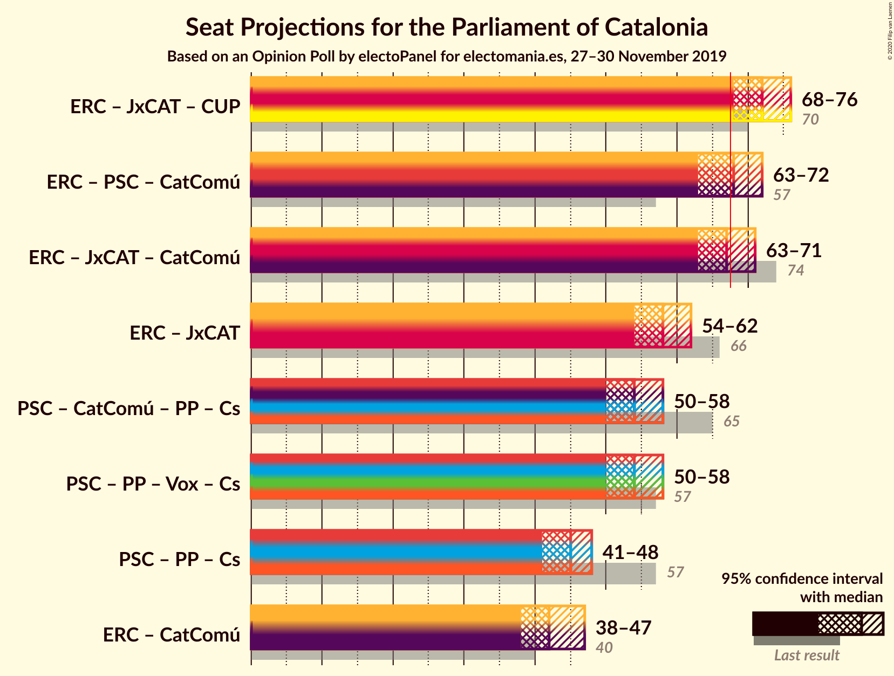
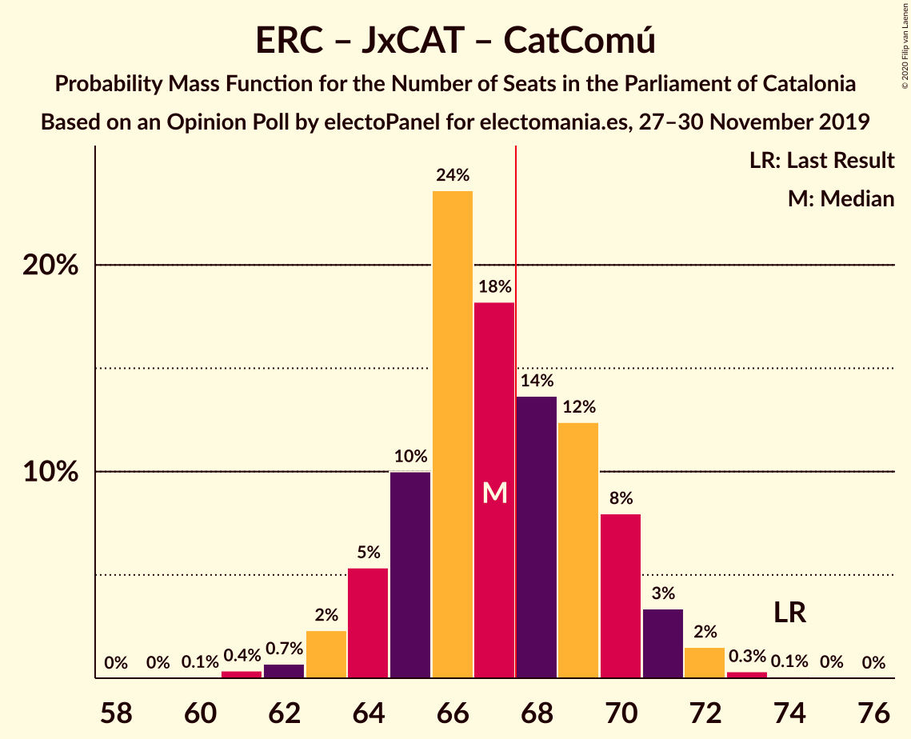
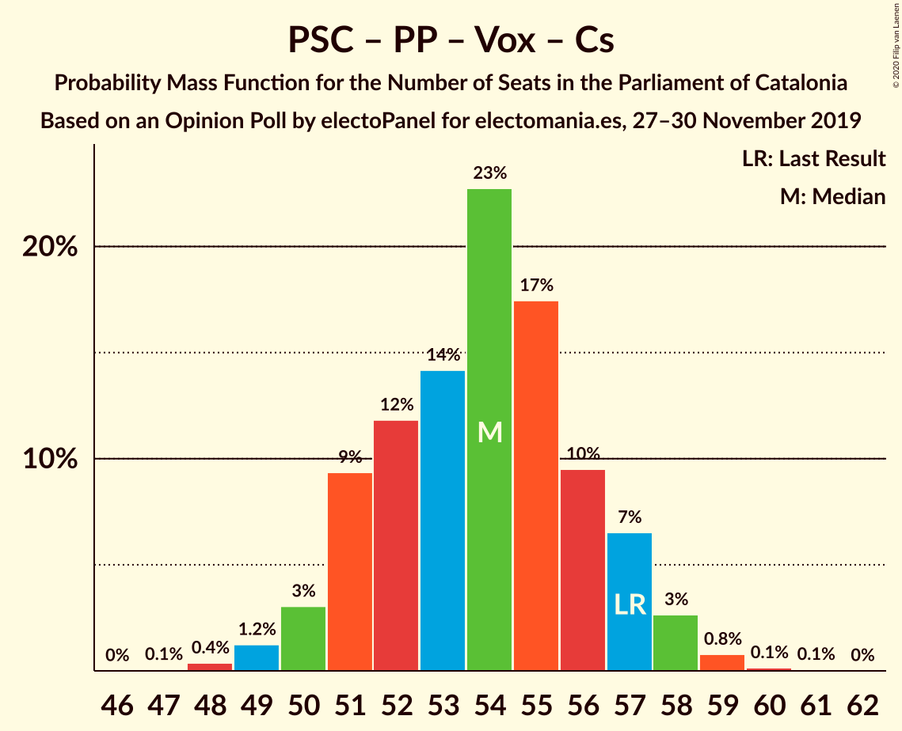

# Opinion Poll by electoPanel for electomania.es, 27–30 November 2019

<a href="#voting-intentions">Voting Intentions</a> | <a href="#seats">Seats</a> | <a href="#coalitions">Coalitions</a> | <a href="#technical-information">Technical Information</a>

## Voting Intentions

### Confidence Intervals

| Party | Last Result | Poll Result | 80% Confidence Interval | 90% Confidence Interval | 95% Confidence Interval | 99% Confidence Interval |
|:-----:|:-----------:|:-----------:|:-----------------------:|:-----------------------:|:-----------------------:|:-----------------------:|
| Esquerra Republicana–Catalunya Sí | 21.4% | 22.0% | 20.6–23.5% |20.2–23.9% |19.9–24.2% |19.3–25.0% |
| Partit dels Socialistes de Catalunya (PSC-PSOE) | 13.9% | 18.4% | 17.1–19.8% |16.8–20.2% |16.5–20.6% |15.9–21.2% |
| Junts pel Catalunya | 21.7% | 15.8% | 14.6–17.1% |14.3–17.5% |14.0–17.8% |13.4–18.4% |
| Candidatura d’Unitat Popular | 4.5% | 10.0% | 9.0–11.1% |8.8–11.4% |8.5–11.7% |8.1–12.2% |
| Catalunya en Comú–Podem | 7.5% | 8.1% | 7.2–9.1% |7.0–9.4% |6.8–9.6% |6.4–10.1% |
| Partit Popular | 4.2% | 7.9% | 7.1–8.9% |6.8–9.2% |6.6–9.5% |6.2–10.0% |
| Vox | 0.0% | 7.5% | 6.7–8.5% |6.4–8.8% |6.2–9.0% |5.9–9.5% |
| Ciutadans–Partido de la Ciudadanía | 25.4% | 7.2% | 6.4–8.2% |6.2–8.5% |6.0–8.7% |5.6–9.2% |

*Note:* The poll result column reflects the actual value used in the calculations. Published results may vary slightly, and in addition be rounded to fewer digits.

## Seats

### Confidence Intervals

| Party | Last Result | Median | 80% Confidence Interval | 90% Confidence Interval | 95% Confidence Interval | 99% Confidence Interval |
|:-----:|:-----------:|:------:|:-----------------------:|:-----------------------:|:-----------------------:|:-----------------------:|
| <a href="#esquerra-republicana–catalunya-sí">Esquerra Republicana–Catalunya Sí</a> | 32 | 33 | 31–35 |30–36 |30–37 |29–38 |
| <a href="#partit-dels-socialistes-de-catalunya-(psc-psoe)">Partit dels Socialistes de Catalunya (PSC-PSOE)</a> | 17 | 25 | 24–27 |23–28 |23–28 |21–29 |
| <a href="#junts-pel-catalunya">Junts pel Catalunya</a> | 34 | 24 | 23–27 |23–28 |22–29 |20–29 |
| <a href="#candidatura-d’unitat-popular">Candidatura d’Unitat Popular</a> | 4 | 15 | 12–15 |11–16 |11–17 |11–18 |
| <a href="#catalunya-en-comú–podem">Catalunya en Comú–Podem</a> | 8 | 9 | 8–11 |8–11 |7–11 |7–13 |
| <a href="#partit-popular">Partit Popular</a> | 4 | 11 | 9–12 |9–12 |8–13 |7–14 |
| <a href="#vox">Vox</a> | 0 | 9 | 8–12 |7–12 |7–12 |7–12 |
| <a href="#ciutadans–partido-de-la-ciudadanía">Ciutadans–Partido de la Ciudadanía</a> | 36 | 8 | 8–11 |7–11 |7–12 |6–12 |

### Esquerra Republicana–Catalunya Sí

*For a full overview of the results for this party, see the [Esquerra Republicana–Catalunya Sí](party-esquerrarepublicana–catalunyasí.html) page.*

| Number of Seats | Probability | Accumulated | Special Marks |
|:---------------:|:-----------:|:-----------:|:-------------:|
| 28 | 0.3% | 100% |  |
| 29 | 1.5% | 99.6% |  |
| 30 | 5% | 98% |  |
| 31 | 12% | 93% |  |
| 32 | 17% | 82% | Last Result |
| 33 | 16% | 65% | Median |
| 34 | 31% | 49% |  |
| 35 | 11% | 18% |  |
| 36 | 4% | 7% |  |
| 37 | 2% | 3% |  |
| 38 | 0.9% | 1.2% |  |
| 39 | 0.3% | 0.3% |  |
| 40 | 0% | 0% |  |

### Partit dels Socialistes de Catalunya (PSC-PSOE)

*For a full overview of the results for this party, see the [Partit dels Socialistes de Catalunya (PSC-PSOE)](party-partitdelssocialistesdecatalunyapsc-psoe.html) page.*

| Number of Seats | Probability | Accumulated | Special Marks |
|:---------------:|:-----------:|:-----------:|:-------------:|
| 17 | 0% | 100% | Last Result |
| 18 | 0% | 100% |  |
| 19 | 0.1% | 100% |  |
| 20 | 0.1% | 99.9% |  |
| 21 | 0.4% | 99.8% |  |
| 22 | 0.9% | 99.4% |  |
| 23 | 8% | 98.5% |  |
| 24 | 18% | 90% |  |
| 25 | 35% | 72% | Median |
| 26 | 26% | 37% |  |
| 27 | 3% | 12% |  |
| 28 | 8% | 9% |  |
| 29 | 0.3% | 0.6% |  |
| 30 | 0.2% | 0.2% |  |
| 31 | 0% | 0% |  |

### Junts pel Catalunya

*For a full overview of the results for this party, see the [Junts pel Catalunya](party-juntspelcatalunya.html) page.*

| Number of Seats | Probability | Accumulated | Special Marks |
|:---------------:|:-----------:|:-----------:|:-------------:|
| 19 | 0.1% | 100% |  |
| 20 | 0.6% | 99.9% |  |
| 21 | 0.4% | 99.3% |  |
| 22 | 4% | 98.9% |  |
| 23 | 15% | 95% |  |
| 24 | 37% | 80% | Median |
| 25 | 12% | 44% |  |
| 26 | 17% | 32% |  |
| 27 | 9% | 15% |  |
| 28 | 3% | 7% |  |
| 29 | 3% | 4% |  |
| 30 | 0.3% | 0.4% |  |
| 31 | 0.1% | 0.1% |  |
| 32 | 0% | 0% |  |
| 33 | 0% | 0% |  |
| 34 | 0% | 0% | Last Result |

### Candidatura d’Unitat Popular

*For a full overview of the results for this party, see the [Candidatura d’Unitat Popular](party-candidaturad’unitatpopular.html) page.*

| Number of Seats | Probability | Accumulated | Special Marks |
|:---------------:|:-----------:|:-----------:|:-------------:|
| 4 | 0% | 100% | Last Result |
| 5 | 0% | 100% |  |
| 6 | 0% | 100% |  |
| 7 | 0% | 100% |  |
| 8 | 0% | 100% |  |
| 9 | 0% | 100% |  |
| 10 | 0.3% | 100% |  |
| 11 | 8% | 99.6% |  |
| 12 | 7% | 92% |  |
| 13 | 16% | 85% |  |
| 14 | 14% | 69% |  |
| 15 | 46% | 55% | Median |
| 16 | 5% | 9% |  |
| 17 | 3% | 4% |  |
| 18 | 0.9% | 0.9% |  |
| 19 | 0% | 0% |  |

### Catalunya en Comú–Podem

*For a full overview of the results for this party, see the [Catalunya en Comú–Podem](party-catalunyaencomú–podem.html) page.*

| Number of Seats | Probability | Accumulated | Special Marks |
|:---------------:|:-----------:|:-----------:|:-------------:|
| 6 | 0% | 100% |  |
| 7 | 4% | 99.9% |  |
| 8 | 41% | 96% | Last Result |
| 9 | 19% | 55% | Median |
| 10 | 20% | 36% |  |
| 11 | 14% | 16% |  |
| 12 | 1.5% | 2% |  |
| 13 | 0.6% | 0.8% |  |
| 14 | 0.1% | 0.1% |  |
| 15 | 0% | 0% |  |

### Partit Popular

*For a full overview of the results for this party, see the [Partit Popular](party-partitpopular.html) page.*

| Number of Seats | Probability | Accumulated | Special Marks |
|:---------------:|:-----------:|:-----------:|:-------------:|
| 4 | 0% | 100% | Last Result |
| 5 | 0% | 100% |  |
| 6 | 0% | 100% |  |
| 7 | 1.0% | 100% |  |
| 8 | 2% | 99.0% |  |
| 9 | 19% | 97% |  |
| 10 | 17% | 78% |  |
| 11 | 33% | 61% | Median |
| 12 | 24% | 28% |  |
| 13 | 2% | 3% |  |
| 14 | 1.3% | 1.3% |  |
| 15 | 0% | 0% |  |

### Vox

*For a full overview of the results for this party, see the [Vox](party-vox.html) page.*

| Number of Seats | Probability | Accumulated | Special Marks |
|:---------------:|:-----------:|:-----------:|:-------------:|
| 0 | 0% | 100% | Last Result |
| 1 | 0% | 100% |  |
| 2 | 0% | 100% |  |
| 3 | 0% | 100% |  |
| 4 | 0% | 100% |  |
| 5 | 0% | 100% |  |
| 6 | 0% | 100% |  |
| 7 | 8% | 100% |  |
| 8 | 12% | 92% |  |
| 9 | 49% | 80% | Median |
| 10 | 6% | 31% |  |
| 11 | 12% | 26% |  |
| 12 | 14% | 14% |  |
| 13 | 0.2% | 0.2% |  |
| 14 | 0% | 0.1% |  |
| 15 | 0% | 0% |  |

### Ciutadans–Partido de la Ciudadanía

*For a full overview of the results for this party, see the [Ciutadans–Partido de la Ciudadanía](party-ciutadans–partidodelaciudadanía.html) page.*

| Number of Seats | Probability | Accumulated | Special Marks |
|:---------------:|:-----------:|:-----------:|:-------------:|
| 5 | 0.1% | 100% |  |
| 6 | 1.4% | 99.9% |  |
| 7 | 6% | 98% |  |
| 8 | 59% | 93% | Median |
| 9 | 17% | 34% |  |
| 10 | 5% | 16% |  |
| 11 | 7% | 11% |  |
| 12 | 4% | 4% |  |
| 13 | 0.1% | 0.1% |  |
| 14 | 0% | 0% |  |
| 15 | 0% | 0% |  |
| 16 | 0% | 0% |  |
| 17 | 0% | 0% |  |
| 18 | 0% | 0% |  |
| 19 | 0% | 0% |  |
| 20 | 0% | 0% |  |
| 21 | 0% | 0% |  |
| 22 | 0% | 0% |  |
| 23 | 0% | 0% |  |
| 24 | 0% | 0% |  |
| 25 | 0% | 0% |  |
| 26 | 0% | 0% |  |
| 27 | 0% | 0% |  |
| 28 | 0% | 0% |  |
| 29 | 0% | 0% |  |
| 30 | 0% | 0% |  |
| 31 | 0% | 0% |  |
| 32 | 0% | 0% |  |
| 33 | 0% | 0% |  |
| 34 | 0% | 0% |  |
| 35 | 0% | 0% |  |
| 36 | 0% | 0% | Last Result |

## Coalitions

### Confidence Intervals

| Coalition | Last Result | Median | Majority? | 80% Confidence Interval | 90% Confidence Interval | 95% Confidence Interval | 99% Confidence Interval |
|:---------:|:-----------:|:------:|:---------:|:-----------------------:|:-----------------------:|:-----------------------:|:-----------------------:|
| Esquerra Republicana–Catalunya Sí – Junts pel Catalunya – Candidatura d’Unitat Popular | 70 | 72 | 99.0% | 69–74 | 69–75 | 68–77 | 66–77 |
| Esquerra Republicana–Catalunya Sí – Partit dels Socialistes de Catalunya (PSC-PSOE) – Catalunya en Comú–Podem | 57 | 68 | 58% | 64–70 | 64–71 | 63–72 | 63–73 |
| Esquerra Republicana–Catalunya Sí – Junts pel Catalunya – Catalunya en Comú–Podem | 74 | 67 | 34% | 65–70 | 64–70 | 63–71 | 62–72 |
| Esquerra Republicana–Catalunya Sí – Junts pel Catalunya | 66 | 58 | 0% | 55–60 | 55–62 | 54–62 | 53–63 |
| Partit dels Socialistes de Catalunya (PSC-PSOE) – Catalunya en Comú–Podem – Partit Popular – Ciutadans–Partido de la Ciudadanía | 65 | 53 | 0% | 51–56 | 50–57 | 49–58 | 49–59 |
| Partit dels Socialistes de Catalunya (PSC-PSOE) – Partit Popular – Vox – Ciutadans–Partido de la Ciudadanía | 57 | 54 | 0% | 51–57 | 51–57 | 50–57 | 49–59 |
| Partit dels Socialistes de Catalunya (PSC-PSOE) – Partit Popular – Ciutadans–Partido de la Ciudadanía | 57 | 45 | 0% | 41–47 | 41–48 | 41–48 | 39–49 |
| Esquerra Republicana–Catalunya Sí – Catalunya en Comú–Podem | 40 | 42 | 0% | 40–45 | 39–46 | 38–46 | 38–48 |

### Esquerra Republicana–Catalunya Sí – Junts pel Catalunya – Candidatura d’Unitat Popular

| Number of Seats | Probability | Accumulated | Special Marks |
|:---------------:|:-----------:|:-----------:|:-------------:|
| 65 | 0.1% | 100% |  |
| 66 | 0.4% | 99.9% |  |
| 67 | 0.5% | 99.5% |  |
| 68 | 2% | 99.0% | Majority |
| 69 | 8% | 97% |  |
| 70 | 9% | 88% | Last Result |
| 71 | 15% | 79% |  |
| 72 | 18% | 63% | Median |
| 73 | 28% | 46% |  |
| 74 | 8% | 18% |  |
| 75 | 4% | 9% |  |
| 76 | 2% | 5% |  |
| 77 | 3% | 3% |  |
| 78 | 0.1% | 0.2% |  |
| 79 | 0% | 0.1% |  |
| 80 | 0% | 0% |  |

### Esquerra Republicana–Catalunya Sí – Partit dels Socialistes de Catalunya (PSC-PSOE) – Catalunya en Comú–Podem

| Number of Seats | Probability | Accumulated | Special Marks |
|:---------------:|:-----------:|:-----------:|:-------------:|
| 57 | 0% | 100% | Last Result |
| 58 | 0% | 100% |  |
| 59 | 0% | 100% |  |
| 60 | 0% | 100% |  |
| 61 | 0.1% | 99.9% |  |
| 62 | 0.3% | 99.8% |  |
| 63 | 3% | 99.5% |  |
| 64 | 8% | 97% |  |
| 65 | 8% | 89% |  |
| 66 | 16% | 81% |  |
| 67 | 7% | 65% | Median |
| 68 | 31% | 58% | Majority |
| 69 | 13% | 27% |  |
| 70 | 7% | 14% |  |
| 71 | 4% | 7% |  |
| 72 | 2% | 3% |  |
| 73 | 1.2% | 1.3% |  |
| 74 | 0.1% | 0.1% |  |
| 75 | 0% | 0% |  |

### Esquerra Republicana–Catalunya Sí – Junts pel Catalunya – Catalunya en Comú–Podem

| Number of Seats | Probability | Accumulated | Special Marks |
|:---------------:|:-----------:|:-----------:|:-------------:|
| 60 | 0% | 100% |  |
| 61 | 0.3% | 99.9% |  |
| 62 | 1.0% | 99.7% |  |
| 63 | 1.3% | 98.7% |  |
| 64 | 6% | 97% |  |
| 65 | 13% | 91% |  |
| 66 | 23% | 79% | Median |
| 67 | 21% | 55% |  |
| 68 | 12% | 34% | Majority |
| 69 | 9% | 22% |  |
| 70 | 10% | 14% |  |
| 71 | 2% | 4% |  |
| 72 | 1.2% | 2% |  |
| 73 | 0.3% | 0.4% |  |
| 74 | 0.1% | 0.2% | Last Result |
| 75 | 0% | 0% |  |

### Esquerra Republicana–Catalunya Sí – Junts pel Catalunya

| Number of Seats | Probability | Accumulated | Special Marks |
|:---------------:|:-----------:|:-----------:|:-------------:|
| 51 | 0.1% | 100% |  |
| 52 | 0.2% | 99.9% |  |
| 53 | 1.3% | 99.7% |  |
| 54 | 2% | 98% |  |
| 55 | 6% | 96% |  |
| 56 | 8% | 90% |  |
| 57 | 22% | 82% | Median |
| 58 | 32% | 60% |  |
| 59 | 7% | 28% |  |
| 60 | 12% | 21% |  |
| 61 | 3% | 9% |  |
| 62 | 4% | 6% |  |
| 63 | 1.0% | 1.4% |  |
| 64 | 0.1% | 0.3% |  |
| 65 | 0.1% | 0.2% |  |
| 66 | 0.1% | 0.1% | Last Result |
| 67 | 0% | 0% |  |

### Partit dels Socialistes de Catalunya (PSC-PSOE) – Catalunya en Comú–Podem – Partit Popular – Ciutadans–Partido de la Ciudadanía

| Number of Seats | Probability | Accumulated | Special Marks |
|:---------------:|:-----------:|:-----------:|:-------------:|
| 47 | 0.1% | 100% |  |
| 48 | 0.2% | 99.9% |  |
| 49 | 3% | 99.7% |  |
| 50 | 6% | 96% |  |
| 51 | 5% | 91% |  |
| 52 | 10% | 85% |  |
| 53 | 28% | 75% | Median |
| 54 | 18% | 47% |  |
| 55 | 13% | 29% |  |
| 56 | 9% | 16% |  |
| 57 | 4% | 7% |  |
| 58 | 2% | 3% |  |
| 59 | 0.4% | 0.6% |  |
| 60 | 0.2% | 0.2% |  |
| 61 | 0% | 0% |  |
| 62 | 0% | 0% |  |
| 63 | 0% | 0% |  |
| 64 | 0% | 0% |  |
| 65 | 0% | 0% | Last Result |

### Partit dels Socialistes de Catalunya (PSC-PSOE) – Partit Popular – Vox – Ciutadans–Partido de la Ciudadanía

| Number of Seats | Probability | Accumulated | Special Marks |
|:---------------:|:-----------:|:-----------:|:-------------:|
| 47 | 0% | 100% |  |
| 48 | 0.4% | 99.9% |  |
| 49 | 1.2% | 99.6% |  |
| 50 | 3% | 98% |  |
| 51 | 9% | 95% |  |
| 52 | 11% | 86% |  |
| 53 | 19% | 75% | Median |
| 54 | 19% | 56% |  |
| 55 | 13% | 37% |  |
| 56 | 13% | 24% |  |
| 57 | 9% | 11% | Last Result |
| 58 | 1.2% | 2% |  |
| 59 | 0.8% | 1.1% |  |
| 60 | 0.2% | 0.3% |  |
| 61 | 0% | 0% |  |

### Partit dels Socialistes de Catalunya (PSC-PSOE) – Partit Popular – Ciutadans–Partido de la Ciudadanía

| Number of Seats | Probability | Accumulated | Special Marks |
|:---------------:|:-----------:|:-----------:|:-------------:|
| 38 | 0.1% | 100% |  |
| 39 | 0.6% | 99.9% |  |
| 40 | 2% | 99.3% |  |
| 41 | 9% | 98% |  |
| 42 | 6% | 89% |  |
| 43 | 9% | 83% |  |
| 44 | 23% | 74% | Median |
| 45 | 27% | 51% |  |
| 46 | 9% | 24% |  |
| 47 | 5% | 14% |  |
| 48 | 9% | 10% |  |
| 49 | 0.7% | 1.2% |  |
| 50 | 0.4% | 0.5% |  |
| 51 | 0% | 0% |  |
| 52 | 0% | 0% |  |
| 53 | 0% | 0% |  |
| 54 | 0% | 0% |  |
| 55 | 0% | 0% |  |
| 56 | 0% | 0% |  |
| 57 | 0% | 0% | Last Result |

### Esquerra Republicana–Catalunya Sí – Catalunya en Comú–Podem

| Number of Seats | Probability | Accumulated | Special Marks |
|:---------------:|:-----------:|:-----------:|:-------------:|
| 36 | 0.2% | 100% |  |
| 37 | 0.2% | 99.8% |  |
| 38 | 3% | 99.6% |  |
| 39 | 5% | 97% |  |
| 40 | 9% | 92% | Last Result |
| 41 | 16% | 83% |  |
| 42 | 28% | 67% | Median |
| 43 | 16% | 39% |  |
| 44 | 10% | 23% |  |
| 45 | 7% | 13% |  |
| 46 | 4% | 6% |  |
| 47 | 0.9% | 2% |  |
| 48 | 0.9% | 1.1% |  |
| 49 | 0.2% | 0.2% |  |
| 50 | 0% | 0% |  |

## Technical Information

### Opinion Poll

+ **Polling firm:** electoPanel
+ **Commissioner(s):** electomania.es
+ **Fieldwork period:** 27–30 November 2019

### Calculations

+ **Sample size:** 1400
+ **Simulations done:** 131,072
+ **Error estimate:** 1.55%

