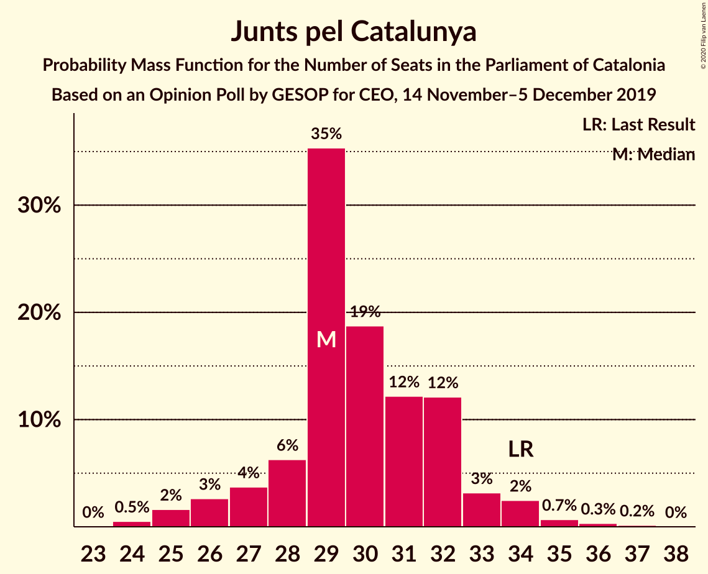
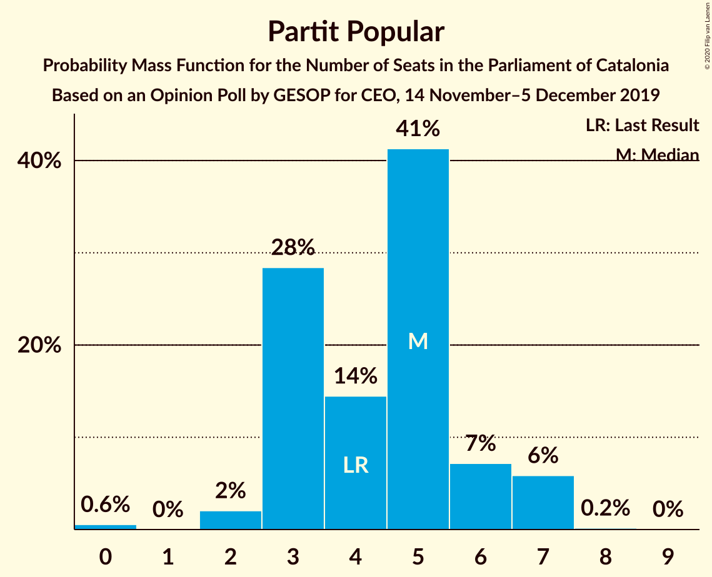
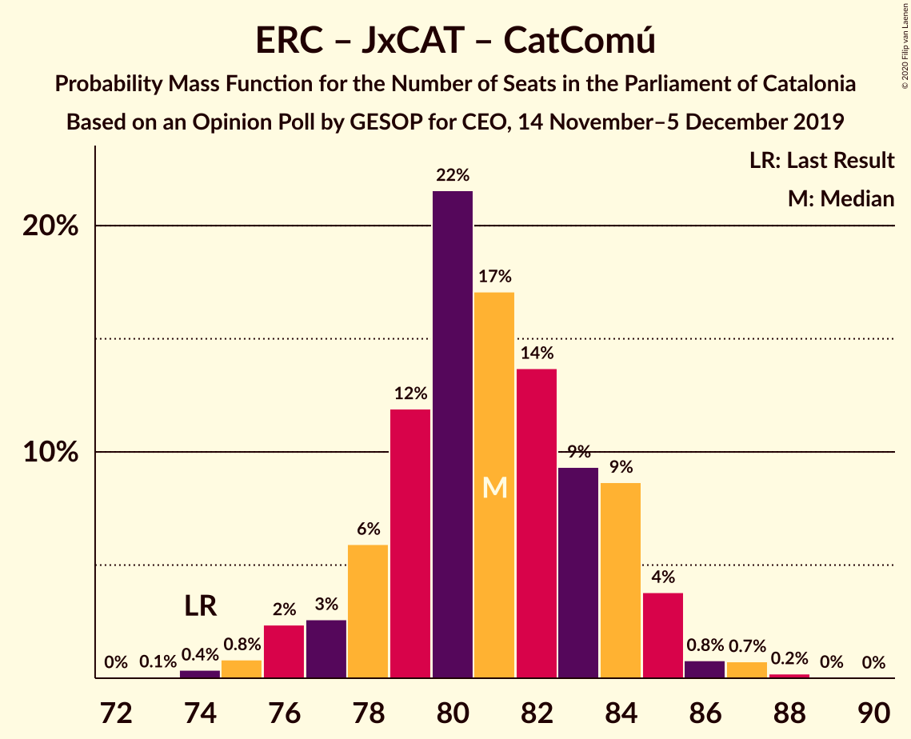
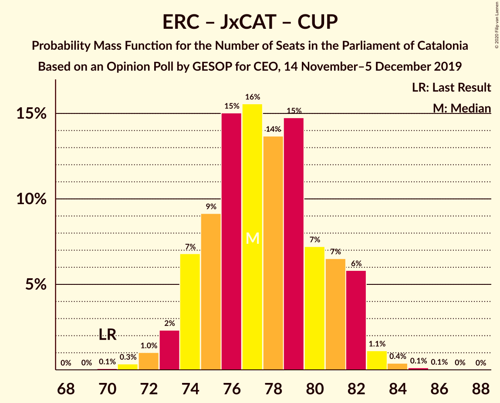
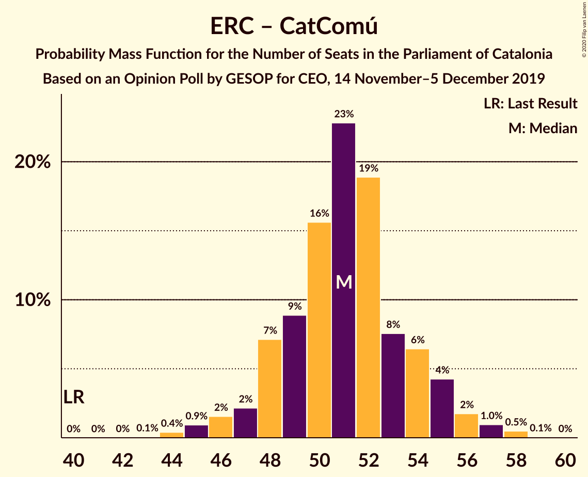
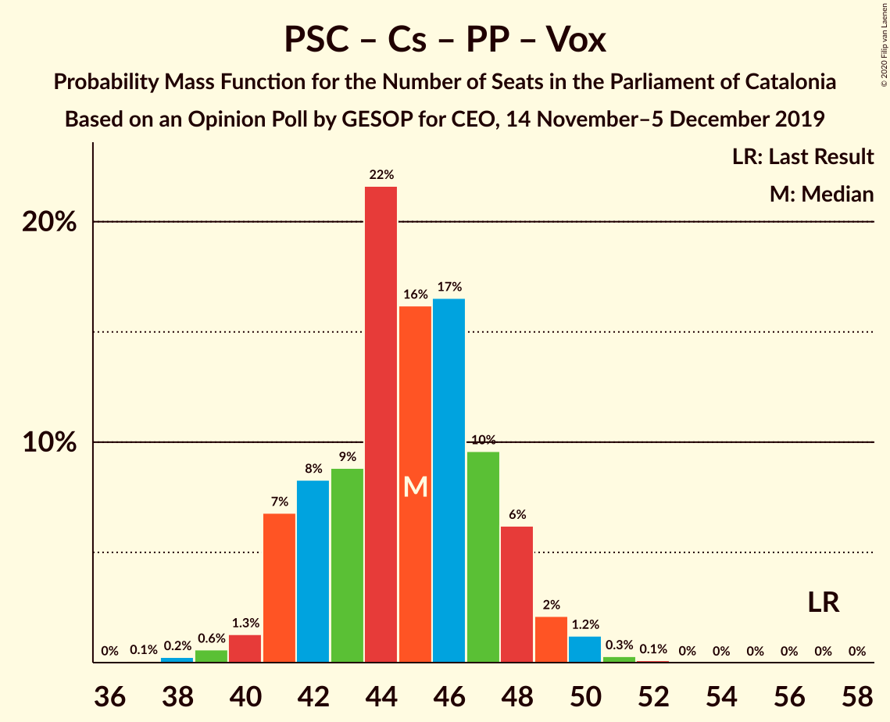

# Opinion Poll by GESOP for CEO, 14 November–5 December 2019

<a href="#voting-intentions">Voting Intentions</a> | <a href="#seats">Seats</a> | <a href="#coalitions">Coalitions</a> | <a href="#technical-information">Technical Information</a>

## Voting Intentions

### Confidence Intervals

| Party | Last Result | Poll Result | 80% Confidence Interval | 90% Confidence Interval | 95% Confidence Interval | 99% Confidence Interval |
|:-----:|:-----------:|:-----------:|:-----------------------:|:-----------------------:|:-----------------------:|:-----------------------:|
| Esquerra Republicana–Catalunya Sí | 21.4% | 25.4% | 23.8–27.2% |23.3–27.7% |22.9–28.2% |22.1–29.0% |
| Junts pel Catalunya | 21.7% | 19.0% | 17.6–20.7% |17.1–21.1% |16.8–21.5% |16.1–22.3% |
| Partit dels Socialistes de Catalunya (PSC-PSOE) | 13.9% | 18.0% | 16.6–19.6% |16.1–20.1% |15.8–20.5% |15.1–21.2% |
| Ciutadans–Partido de la Ciudadanía | 25.4% | 12.0% | 10.8–13.4% |10.5–13.8% |10.2–14.1% |9.6–14.8% |
| Catalunya en Comú–Podem | 7.5% | 10.2% | 9.1–11.5% |8.8–11.9% |8.5–12.2% |8.0–12.8% |
| Candidatura d’Unitat Popular | 4.5% | 7.3% | 6.4–8.5% |6.1–8.8% |5.9–9.1% |5.5–9.6% |
| Partit Popular | 4.2% | 4.3% | 3.6–5.2% |3.4–5.5% |3.2–5.7% |2.9–6.2% |
| Vox | 0.0% | 2.0% | 1.5–2.7% |1.4–2.9% |1.3–3.0% |1.1–3.4% |

*Note:* The poll result column reflects the actual value used in the calculations. Published results may vary slightly, and in addition be rounded to fewer digits.

## Seats

### Confidence Intervals

| Party | Last Result | Median | 80% Confidence Interval | 90% Confidence Interval | 95% Confidence Interval | 99% Confidence Interval |
|:-----:|:-----------:|:------:|:-----------------------:|:-----------------------:|:-----------------------:|:-----------------------:|
| <a href="#esquerra-republicana–catalunya-sí">Esquerra Republicana–Catalunya Sí</a> | 32 | 38 | 36–41 |35–42 |34–43 |33–44 |
| <a href="#junts-pel-catalunya">Junts pel Catalunya</a> | 34 | 30 | 28–32 |27–33 |26–34 |24–35 |
| <a href="#partit-dels-socialistes-de-catalunya-(psc-psoe)">Partit dels Socialistes de Catalunya (PSC-PSOE)</a> | 17 | 25 | 23–26 |22–27 |21–28 |19–29 |
| <a href="#ciutadans–partido-de-la-ciudadanía">Ciutadans–Partido de la Ciudadanía</a> | 36 | 15 | 14–18 |13–19 |13–19 |13–20 |
| <a href="#catalunya-en-comú–podem">Catalunya en Comú–Podem</a> | 8 | 13 | 11–14 |10–15 |9–15 |9–17 |
| <a href="#candidatura-d’unitat-popular">Candidatura d’Unitat Popular</a> | 4 | 9 | 8–11 |8–11 |8–12 |7–13 |
| <a href="#partit-popular">Partit Popular</a> | 4 | 5 | 3–6 |3–7 |2–7 |2–7 |
| <a href="#vox">Vox</a> | 0 | 0 | 0 |0 |0–2 |0–3 |

### Esquerra Republicana–Catalunya Sí

*For a full overview of the results for this party, see the [Esquerra Republicana–Catalunya Sí](party-esquerrarepublicana–catalunyasí.html) page.*

| Number of Seats | Probability | Accumulated | Special Marks |
|:---------------:|:-----------:|:-----------:|:-------------:|
| 32 | 0.3% | 100% | Last Result |
| 33 | 1.0% | 99.7% |  |
| 34 | 3% | 98.7% |  |
| 35 | 3% | 96% |  |
| 36 | 10% | 93% |  |
| 37 | 22% | 83% |  |
| 38 | 16% | 61% | Median |
| 39 | 16% | 45% |  |
| 40 | 15% | 29% |  |
| 41 | 6% | 14% |  |
| 42 | 4% | 8% |  |
| 43 | 3% | 4% |  |
| 44 | 1.3% | 2% |  |
| 45 | 0.2% | 0.2% |  |
| 46 | 0.1% | 0.1% |  |
| 47 | 0% | 0% |  |

### Junts pel Catalunya

*For a full overview of the results for this party, see the [Junts pel Catalunya](party-juntspelcatalunya.html) page.*

| Number of Seats | Probability | Accumulated | Special Marks |
|:---------------:|:-----------:|:-----------:|:-------------:|
| 24 | 0.5% | 100% |  |
| 25 | 0.7% | 99.5% |  |
| 26 | 2% | 98.8% |  |
| 27 | 4% | 96% |  |
| 28 | 9% | 92% |  |
| 29 | 33% | 84% |  |
| 30 | 16% | 51% | Median |
| 31 | 15% | 35% |  |
| 32 | 13% | 20% |  |
| 33 | 3% | 7% |  |
| 34 | 2% | 4% | Last Result |
| 35 | 0.7% | 1.1% |  |
| 36 | 0.3% | 0.4% |  |
| 37 | 0.1% | 0.1% |  |
| 38 | 0% | 0% |  |

### Partit dels Socialistes de Catalunya (PSC-PSOE)

*For a full overview of the results for this party, see the [Partit dels Socialistes de Catalunya (PSC-PSOE)](party-partitdelssocialistesdecatalunyapsc-psoe.html) page.*

| Number of Seats | Probability | Accumulated | Special Marks |
|:---------------:|:-----------:|:-----------:|:-------------:|
| 17 | 0% | 100% | Last Result |
| 18 | 0.3% | 100% |  |
| 19 | 0.4% | 99.7% |  |
| 20 | 1.0% | 99.3% |  |
| 21 | 2% | 98% |  |
| 22 | 6% | 97% |  |
| 23 | 7% | 90% |  |
| 24 | 32% | 83% |  |
| 25 | 32% | 51% | Median |
| 26 | 11% | 19% |  |
| 27 | 4% | 7% |  |
| 28 | 3% | 4% |  |
| 29 | 0.5% | 0.6% |  |
| 30 | 0.1% | 0.2% |  |
| 31 | 0% | 0% |  |

### Ciutadans–Partido de la Ciudadanía

*For a full overview of the results for this party, see the [Ciutadans–Partido de la Ciudadanía](party-ciutadans–partidodelaciudadanía.html) page.*

| Number of Seats | Probability | Accumulated | Special Marks |
|:---------------:|:-----------:|:-----------:|:-------------:|
| 12 | 0.4% | 100% |  |
| 13 | 5% | 99.6% |  |
| 14 | 25% | 95% |  |
| 15 | 21% | 70% | Median |
| 16 | 20% | 49% |  |
| 17 | 7% | 29% |  |
| 18 | 16% | 22% |  |
| 19 | 5% | 6% |  |
| 20 | 0.5% | 0.6% |  |
| 21 | 0.1% | 0.1% |  |
| 22 | 0% | 0% |  |
| 23 | 0% | 0% |  |
| 24 | 0% | 0% |  |
| 25 | 0% | 0% |  |
| 26 | 0% | 0% |  |
| 27 | 0% | 0% |  |
| 28 | 0% | 0% |  |
| 29 | 0% | 0% |  |
| 30 | 0% | 0% |  |
| 31 | 0% | 0% |  |
| 32 | 0% | 0% |  |
| 33 | 0% | 0% |  |
| 34 | 0% | 0% |  |
| 35 | 0% | 0% |  |
| 36 | 0% | 0% | Last Result |

### Catalunya en Comú–Podem

*For a full overview of the results for this party, see the [Catalunya en Comú–Podem](party-catalunyaencomú–podem.html) page.*

| Number of Seats | Probability | Accumulated | Special Marks |
|:---------------:|:-----------:|:-----------:|:-------------:|
| 8 | 0.5% | 100% | Last Result |
| 9 | 3% | 99.5% |  |
| 10 | 1.5% | 96% |  |
| 11 | 18% | 95% |  |
| 12 | 19% | 77% |  |
| 13 | 20% | 58% | Median |
| 14 | 32% | 38% |  |
| 15 | 4% | 6% |  |
| 16 | 1.3% | 2% |  |
| 17 | 0.5% | 0.6% |  |
| 18 | 0% | 0% |  |

### Candidatura d’Unitat Popular

*For a full overview of the results for this party, see the [Candidatura d’Unitat Popular](party-candidaturad’unitatpopular.html) page.*

| Number of Seats | Probability | Accumulated | Special Marks |
|:---------------:|:-----------:|:-----------:|:-------------:|
| 4 | 0% | 100% | Last Result |
| 5 | 0% | 100% |  |
| 6 | 0% | 100% |  |
| 7 | 0.6% | 100% |  |
| 8 | 19% | 99.3% |  |
| 9 | 46% | 81% | Median |
| 10 | 10% | 35% |  |
| 11 | 21% | 25% |  |
| 12 | 3% | 4% |  |
| 13 | 0.7% | 0.9% |  |
| 14 | 0.2% | 0.3% |  |
| 15 | 0.1% | 0.1% |  |
| 16 | 0% | 0% |  |

### Partit Popular

*For a full overview of the results for this party, see the [Partit Popular](party-partitpopular.html) page.*

| Number of Seats | Probability | Accumulated | Special Marks |
|:---------------:|:-----------:|:-----------:|:-------------:|
| 0 | 0.5% | 100% |  |
| 1 | 0% | 99.5% |  |
| 2 | 2% | 99.5% |  |
| 3 | 30% | 97% |  |
| 4 | 15% | 67% | Last Result |
| 5 | 39% | 51% | Median |
| 6 | 6% | 13% |  |
| 7 | 7% | 7% |  |
| 8 | 0.1% | 0.1% |  |
| 9 | 0% | 0% |  |

### Vox

*For a full overview of the results for this party, see the [Vox](party-vox.html) page.*

| Number of Seats | Probability | Accumulated | Special Marks |
|:---------------:|:-----------:|:-----------:|:-------------:|
| 0 | 97% | 100% | Last Result, Median |
| 1 | 0% | 3% |  |
| 2 | 2% | 3% |  |
| 3 | 1.0% | 1.1% |  |
| 4 | 0% | 0% |  |

## Coalitions

### Confidence Intervals

| Coalition | Last Result | Median | Majority? | 80% Confidence Interval | 90% Confidence Interval | 95% Confidence Interval | 99% Confidence Interval |
|:---------:|:-----------:|:------:|:---------:|:-----------------------:|:-----------------------:|:-----------------------:|:-----------------------:|
| Esquerra Republicana–Catalunya Sí – Junts pel Catalunya – Catalunya en Comú–Podem | 74 | 81 | 100% | 78–84 | 77–85 | 76–85 | 75–87 |
| Esquerra Republicana–Catalunya Sí – Junts pel Catalunya – Candidatura d’Unitat Popular | 70 | 78 | 100% | 75–81 | 74–82 | 73–82 | 72–83 |
| Esquerra Republicana–Catalunya Sí – Partit dels Socialistes de Catalunya (PSC-PSOE) – Catalunya en Comú–Podem | 57 | 76 | 99.9% | 73–79 | 72–79 | 70–80 | 69–82 |
| Esquerra Republicana–Catalunya Sí – Junts pel Catalunya | 66 | 68 | 56% | 65–72 | 64–73 | 64–73 | 62–74 |
| Partit dels Socialistes de Catalunya (PSC-PSOE) – Ciutadans–Partido de la Ciudadanía – Catalunya en Comú–Podem – Partit Popular | 65 | 57 | 0% | 54–60 | 53–61 | 53–62 | 51–63 |
| Esquerra Republicana–Catalunya Sí – Catalunya en Comú–Podem | 40 | 51 | 0% | 48–54 | 47–55 | 46–56 | 45–57 |
| Partit dels Socialistes de Catalunya (PSC-PSOE) – Ciutadans–Partido de la Ciudadanía – Partit Popular | 57 | 44 | 0% | 41–47 | 41–48 | 41–49 | 39–50 |
| Partit dels Socialistes de Catalunya (PSC-PSOE) – Ciutadans–Partido de la Ciudadanía – Partit Popular – Vox | 57 | 45 | 0% | 41–47 | 41–48 | 41–49 | 39–50 |

### Esquerra Republicana–Catalunya Sí – Junts pel Catalunya – Catalunya en Comú–Podem

| Number of Seats | Probability | Accumulated | Special Marks |
|:---------------:|:-----------:|:-----------:|:-------------:|
| 73 | 0.1% | 100% |  |
| 74 | 0.2% | 99.9% | Last Result |
| 75 | 0.6% | 99.6% |  |
| 76 | 2% | 99.0% |  |
| 77 | 3% | 97% |  |
| 78 | 7% | 94% |  |
| 79 | 11% | 87% |  |
| 80 | 24% | 76% |  |
| 81 | 15% | 52% | Median |
| 82 | 11% | 37% |  |
| 83 | 12% | 26% |  |
| 84 | 7% | 14% |  |
| 85 | 5% | 7% |  |
| 86 | 0.6% | 2% |  |
| 87 | 1.0% | 1.2% |  |
| 88 | 0.1% | 0.2% |  |
| 89 | 0% | 0.1% |  |
| 90 | 0% | 0% |  |

### Esquerra Republicana–Catalunya Sí – Junts pel Catalunya – Candidatura d’Unitat Popular

| Number of Seats | Probability | Accumulated | Special Marks |
|:---------------:|:-----------:|:-----------:|:-------------:|
| 70 | 0.1% | 100% | Last Result |
| 71 | 0.2% | 99.9% |  |
| 72 | 0.8% | 99.7% |  |
| 73 | 2% | 98.9% |  |
| 74 | 7% | 97% |  |
| 75 | 13% | 91% |  |
| 76 | 12% | 78% |  |
| 77 | 15% | 66% | Median |
| 78 | 14% | 51% |  |
| 79 | 12% | 37% |  |
| 80 | 10% | 24% |  |
| 81 | 6% | 15% |  |
| 82 | 7% | 8% |  |
| 83 | 0.9% | 1.4% |  |
| 84 | 0.3% | 0.5% |  |
| 85 | 0.1% | 0.2% |  |
| 86 | 0.1% | 0.1% |  |
| 87 | 0% | 0% |  |

### Esquerra Republicana–Catalunya Sí – Partit dels Socialistes de Catalunya (PSC-PSOE) – Catalunya en Comú–Podem

| Number of Seats | Probability | Accumulated | Special Marks |
|:---------------:|:-----------:|:-----------:|:-------------:|
| 57 | 0% | 100% | Last Result |
| 58 | 0% | 100% |  |
| 59 | 0% | 100% |  |
| 60 | 0% | 100% |  |
| 61 | 0% | 100% |  |
| 62 | 0% | 100% |  |
| 63 | 0% | 100% |  |
| 64 | 0% | 100% |  |
| 65 | 0% | 100% |  |
| 66 | 0% | 100% |  |
| 67 | 0.1% | 100% |  |
| 68 | 0.3% | 99.9% | Majority |
| 69 | 0.5% | 99.6% |  |
| 70 | 2% | 99.2% |  |
| 71 | 2% | 97% |  |
| 72 | 4% | 95% |  |
| 73 | 8% | 91% |  |
| 74 | 12% | 83% |  |
| 75 | 18% | 71% |  |
| 76 | 25% | 53% | Median |
| 77 | 8% | 28% |  |
| 78 | 9% | 20% |  |
| 79 | 6% | 10% |  |
| 80 | 3% | 5% |  |
| 81 | 0.9% | 1.5% |  |
| 82 | 0.4% | 0.6% |  |
| 83 | 0.1% | 0.1% |  |
| 84 | 0% | 0% |  |

### Esquerra Republicana–Catalunya Sí – Junts pel Catalunya

| Number of Seats | Probability | Accumulated | Special Marks |
|:---------------:|:-----------:|:-----------:|:-------------:|
| 60 | 0% | 100% |  |
| 61 | 0.2% | 99.9% |  |
| 62 | 0.4% | 99.8% |  |
| 63 | 1.1% | 99.3% |  |
| 64 | 4% | 98% |  |
| 65 | 7% | 95% |  |
| 66 | 17% | 88% | Last Result |
| 67 | 15% | 71% |  |
| 68 | 9% | 56% | Median, Majority |
| 69 | 16% | 47% |  |
| 70 | 13% | 31% |  |
| 71 | 6% | 18% |  |
| 72 | 5% | 11% |  |
| 73 | 5% | 6% |  |
| 74 | 0.7% | 0.9% |  |
| 75 | 0.1% | 0.2% |  |
| 76 | 0.1% | 0.1% |  |
| 77 | 0% | 0% |  |

### Partit dels Socialistes de Catalunya (PSC-PSOE) – Ciutadans–Partido de la Ciudadanía – Catalunya en Comú–Podem – Partit Popular

| Number of Seats | Probability | Accumulated | Special Marks |
|:---------------:|:-----------:|:-----------:|:-------------:|
| 49 | 0.1% | 100% |  |
| 50 | 0.1% | 99.9% |  |
| 51 | 0.3% | 99.8% |  |
| 52 | 1.0% | 99.4% |  |
| 53 | 7% | 98% |  |
| 54 | 6% | 91% |  |
| 55 | 10% | 85% |  |
| 56 | 13% | 75% |  |
| 57 | 15% | 62% |  |
| 58 | 14% | 48% | Median |
| 59 | 12% | 33% |  |
| 60 | 12% | 22% |  |
| 61 | 6% | 9% |  |
| 62 | 2% | 3% |  |
| 63 | 0.7% | 0.9% |  |
| 64 | 0.2% | 0.3% |  |
| 65 | 0.1% | 0.1% | Last Result |
| 66 | 0% | 0% |  |

### Esquerra Republicana–Catalunya Sí – Catalunya en Comú–Podem

| Number of Seats | Probability | Accumulated | Special Marks |
|:---------------:|:-----------:|:-----------:|:-------------:|
| 40 | 0% | 100% | Last Result |
| 41 | 0% | 100% |  |
| 42 | 0% | 100% |  |
| 43 | 0% | 100% |  |
| 44 | 0.3% | 99.9% |  |
| 45 | 1.1% | 99.6% |  |
| 46 | 1.4% | 98.6% |  |
| 47 | 2% | 97% |  |
| 48 | 8% | 95% |  |
| 49 | 9% | 87% |  |
| 50 | 15% | 79% |  |
| 51 | 27% | 64% | Median |
| 52 | 16% | 37% |  |
| 53 | 7% | 21% |  |
| 54 | 6% | 14% |  |
| 55 | 5% | 8% |  |
| 56 | 1.5% | 3% |  |
| 57 | 1.1% | 2% |  |
| 58 | 0.4% | 0.4% |  |
| 59 | 0% | 0.1% |  |
| 60 | 0% | 0% |  |

### Partit dels Socialistes de Catalunya (PSC-PSOE) – Ciutadans–Partido de la Ciudadanía – Partit Popular

| Number of Seats | Probability | Accumulated | Special Marks |
|:---------------:|:-----------:|:-----------:|:-------------:|
| 37 | 0.1% | 100% |  |
| 38 | 0.2% | 99.9% |  |
| 39 | 0.6% | 99.7% |  |
| 40 | 1.2% | 99.1% |  |
| 41 | 9% | 98% |  |
| 42 | 7% | 89% |  |
| 43 | 10% | 82% |  |
| 44 | 22% | 71% |  |
| 45 | 13% | 49% | Median |
| 46 | 18% | 36% |  |
| 47 | 9% | 18% |  |
| 48 | 6% | 9% |  |
| 49 | 1.5% | 3% |  |
| 50 | 1.0% | 1.4% |  |
| 51 | 0.3% | 0.3% |  |
| 52 | 0% | 0.1% |  |
| 53 | 0% | 0% |  |
| 54 | 0% | 0% |  |
| 55 | 0% | 0% |  |
| 56 | 0% | 0% |  |
| 57 | 0% | 0% | Last Result |

### Partit dels Socialistes de Catalunya (PSC-PSOE) – Ciutadans–Partido de la Ciudadanía – Partit Popular – Vox

| Number of Seats | Probability | Accumulated | Special Marks |
|:---------------:|:-----------:|:-----------:|:-------------:|
| 37 | 0.1% | 100% |  |
| 38 | 0.2% | 99.9% |  |
| 39 | 0.6% | 99.7% |  |
| 40 | 1.1% | 99.1% |  |
| 41 | 9% | 98% |  |
| 42 | 6% | 89% |  |
| 43 | 10% | 82% |  |
| 44 | 22% | 72% |  |
| 45 | 13% | 50% | Median |
| 46 | 18% | 38% |  |
| 47 | 10% | 19% |  |
| 48 | 7% | 10% |  |
| 49 | 2% | 3% |  |
| 50 | 1.1% | 2% |  |
| 51 | 0.3% | 0.4% |  |
| 52 | 0.1% | 0.1% |  |
| 53 | 0% | 0% |  |
| 54 | 0% | 0% |  |
| 55 | 0% | 0% |  |
| 56 | 0% | 0% |  |
| 57 | 0% | 0% | Last Result |

## Technical Information

### Opinion Poll

+ **Polling firm:** GESOP
+ **Commissioner(s):** CEO
+ **Fieldwork period:** 14 November–5 December 2019

### Calculations

+ **Sample size:** 1050
+ **Simulations done:** 524,288
+ **Error estimate:** 1.39%

