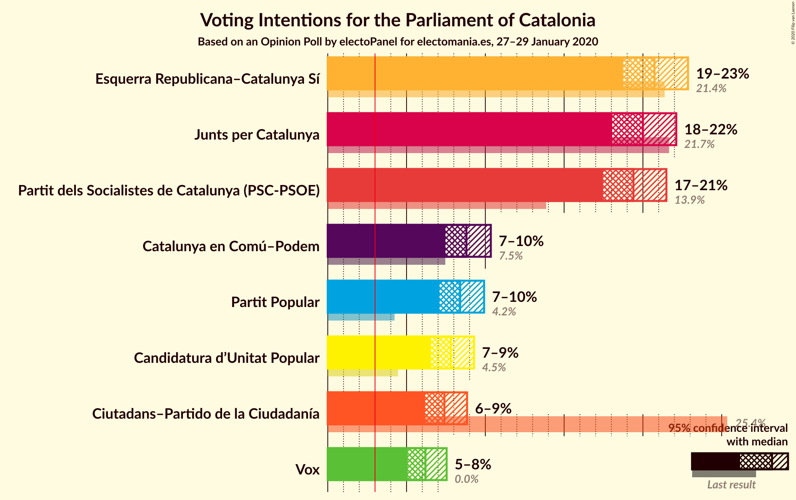
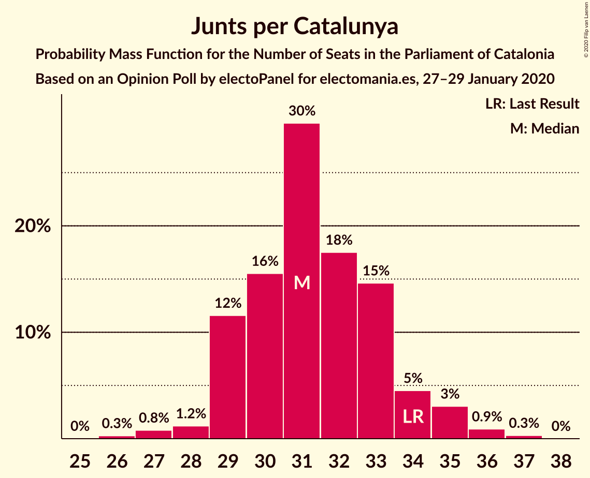
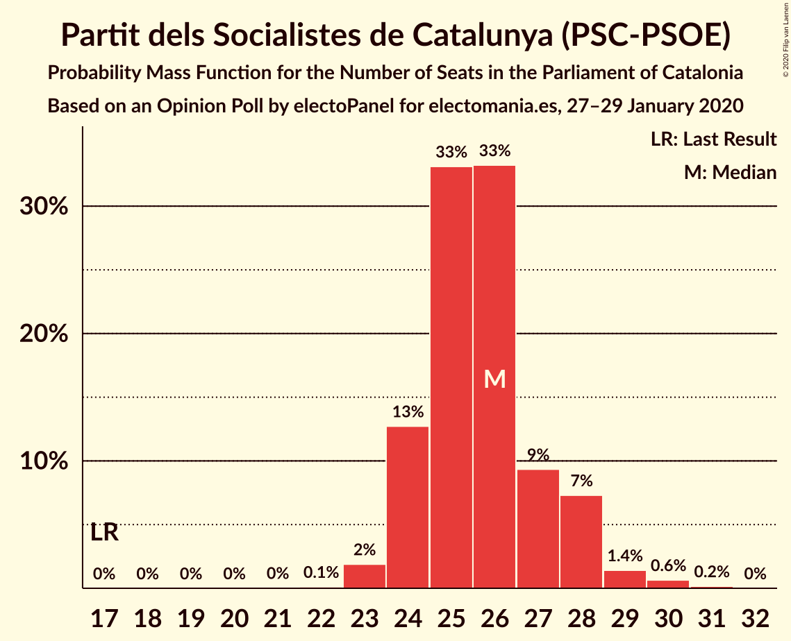
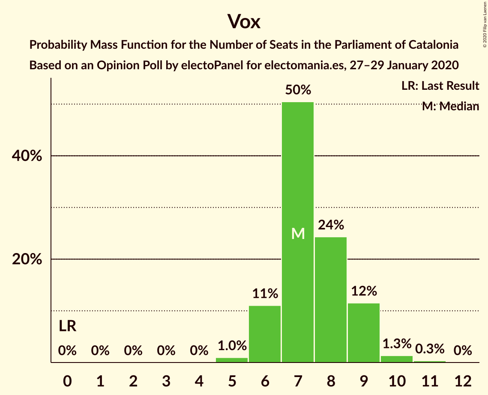

# Opinion Poll by electoPanel for electomania.es, 27–29 January 2020

<a href="#voting-intentions">Voting Intentions</a> | <a href="#seats">Seats</a> | <a href="#coalitions">Coalitions</a> | <a href="#technical-information">Technical Information</a>

## Voting Intentions

### Confidence Intervals

| Party | Last Result | Poll Result | 80% Confidence Interval | 90% Confidence Interval | 95% Confidence Interval | 99% Confidence Interval |
|:-----:|:-----------:|:-----------:|:-----------------------:|:-----------------------:|:-----------------------:|:-----------------------:|
| Esquerra Republicana–Catalunya Sí | 21.4% | 20.7% | 19.4–22.1% |19.1–22.5% |18.7–22.9% |18.1–23.5% |
| Junts per Catalunya | 21.7% | 20.0% | 18.7–21.4% |18.4–21.8% |18.0–22.1% |17.5–22.8% |
| Partit dels Socialistes de Catalunya (PSC-PSOE) | 13.9% | 19.4% | 18.1–20.8% |17.8–21.2% |17.5–21.5% |16.9–22.1% |
| Catalunya en Comú–Podem | 7.5% | 8.8% | 7.9–9.8% |7.7–10.1% |7.5–10.3% |7.1–10.9% |
| Partit Popular | 4.2% | 8.4% | 7.5–9.4% |7.3–9.7% |7.1–9.9% |6.7–10.4% |
| Candidatura d’Unitat Popular | 4.5% | 7.8% | 7.0–8.8% |6.7–9.0% |6.5–9.3% |6.2–9.8% |
| Ciutadans–Partido de la Ciudadanía | 25.4% | 7.4% | 6.6–8.3% |6.4–8.6% |6.2–8.8% |5.8–9.3% |
| Vox | 0.0% | 6.2% | 5.5–7.1% |5.3–7.3% |5.1–7.5% |4.8–8.0% |

*Note:* The poll result column reflects the actual value used in the calculations. Published results may vary slightly, and in addition be rounded to fewer digits.

## Seats

### Confidence Intervals

| Party | Last Result | Median | 80% Confidence Interval | 90% Confidence Interval | 95% Confidence Interval | 99% Confidence Interval |
|:-----:|:-----------:|:------:|:-----------------------:|:-----------------------:|:-----------------------:|:-----------------------:|
| <a href="#esquerra-republicana–catalunya-sí">Esquerra Republicana–Catalunya Sí</a> | 32 | 31 | 28–33 |28–33 |27–34 |26–35 |
| <a href="#junts-per-catalunya">Junts per Catalunya</a> | 34 | 31 | 29–33 |29–34 |29–35 |27–36 |
| <a href="#partit-dels-socialistes-de-catalunya-(psc-psoe)">Partit dels Socialistes de Catalunya (PSC-PSOE)</a> | 17 | 26 | 24–27 |24–28 |24–28 |23–30 |
| <a href="#catalunya-en-comú–podem">Catalunya en Comú–Podem</a> | 8 | 10 | 8–11 |8–12 |8–13 |8–13 |
| <a href="#partit-popular">Partit Popular</a> | 4 | 11 | 9–12 |9–12 |9–13 |8–14 |
| <a href="#candidatura-d’unitat-popular">Candidatura d’Unitat Popular</a> | 4 | 9 | 9–11 |8–11 |8–12 |8–14 |
| <a href="#ciutadans–partido-de-la-ciudadanía">Ciutadans–Partido de la Ciudadanía</a> | 36 | 8 | 8–11 |7–12 |7–12 |6–12 |
| <a href="#vox">Vox</a> | 0 | 7 | 6–9 |6–9 |6–9 |5–10 |

### Esquerra Republicana–Catalunya Sí

*For a full overview of the results for this party, see the [Esquerra Republicana–Catalunya Sí](party-esquerrarepublicana–catalunyasí.html) page.*

| Number of Seats | Probability | Accumulated | Special Marks |
|:---------------:|:-----------:|:-----------:|:-------------:|
| 26 | 0.9% | 100% |  |
| 27 | 2% | 99.0% |  |
| 28 | 8% | 97% |  |
| 29 | 10% | 89% |  |
| 30 | 22% | 80% |  |
| 31 | 18% | 57% | Median |
| 32 | 24% | 39% | Last Result |
| 33 | 13% | 16% |  |
| 34 | 2% | 3% |  |
| 35 | 0.8% | 1.3% |  |
| 36 | 0.4% | 0.4% |  |
| 37 | 0% | 0% |  |

### Junts per Catalunya

*For a full overview of the results for this party, see the [Junts per Catalunya](party-juntspercatalunya.html) page.*

| Number of Seats | Probability | Accumulated | Special Marks |
|:---------------:|:-----------:|:-----------:|:-------------:|
| 26 | 0.3% | 100% |  |
| 27 | 0.8% | 99.7% |  |
| 28 | 1.2% | 98.9% |  |
| 29 | 12% | 98% |  |
| 30 | 16% | 86% |  |
| 31 | 30% | 71% | Median |
| 32 | 18% | 41% |  |
| 33 | 15% | 23% |  |
| 34 | 5% | 9% | Last Result |
| 35 | 3% | 4% |  |
| 36 | 0.9% | 1.2% |  |
| 37 | 0.3% | 0.3% |  |
| 38 | 0% | 0% |  |

### Partit dels Socialistes de Catalunya (PSC-PSOE)

*For a full overview of the results for this party, see the [Partit dels Socialistes de Catalunya (PSC-PSOE)](party-partitdelssocialistesdecatalunyapsc-psoe.html) page.*

| Number of Seats | Probability | Accumulated | Special Marks |
|:---------------:|:-----------:|:-----------:|:-------------:|
| 17 | 0% | 100% | Last Result |
| 18 | 0% | 100% |  |
| 19 | 0% | 100% |  |
| 20 | 0% | 100% |  |
| 21 | 0% | 100% |  |
| 22 | 0.1% | 100% |  |
| 23 | 2% | 99.8% |  |
| 24 | 13% | 98% |  |
| 25 | 33% | 85% |  |
| 26 | 33% | 52% | Median |
| 27 | 9% | 19% |  |
| 28 | 7% | 10% |  |
| 29 | 1.4% | 2% |  |
| 30 | 0.6% | 0.8% |  |
| 31 | 0.2% | 0.2% |  |
| 32 | 0% | 0% |  |

### Catalunya en Comú–Podem

*For a full overview of the results for this party, see the [Catalunya en Comú–Podem](party-catalunyaencomú–podem.html) page.*

| Number of Seats | Probability | Accumulated | Special Marks |
|:---------------:|:-----------:|:-----------:|:-------------:|
| 7 | 0.2% | 100% |  |
| 8 | 11% | 99.8% | Last Result |
| 9 | 27% | 89% |  |
| 10 | 18% | 62% | Median |
| 11 | 33% | 43% |  |
| 12 | 6% | 10% |  |
| 13 | 4% | 4% |  |
| 14 | 0.5% | 0.5% |  |
| 15 | 0% | 0% |  |

### Partit Popular

*For a full overview of the results for this party, see the [Partit Popular](party-partitpopular.html) page.*

| Number of Seats | Probability | Accumulated | Special Marks |
|:---------------:|:-----------:|:-----------:|:-------------:|
| 4 | 0% | 100% | Last Result |
| 5 | 0% | 100% |  |
| 6 | 0% | 100% |  |
| 7 | 0.4% | 100% |  |
| 8 | 0.9% | 99.6% |  |
| 9 | 14% | 98.6% |  |
| 10 | 9% | 85% |  |
| 11 | 45% | 76% | Median |
| 12 | 26% | 31% |  |
| 13 | 2% | 4% |  |
| 14 | 2% | 2% |  |
| 15 | 0.1% | 0.1% |  |
| 16 | 0% | 0% |  |

### Candidatura d’Unitat Popular

*For a full overview of the results for this party, see the [Candidatura d’Unitat Popular](party-candidaturad’unitatpopular.html) page.*

| Number of Seats | Probability | Accumulated | Special Marks |
|:---------------:|:-----------:|:-----------:|:-------------:|
| 4 | 0% | 100% | Last Result |
| 5 | 0% | 100% |  |
| 6 | 0% | 100% |  |
| 7 | 0% | 100% |  |
| 8 | 7% | 100% |  |
| 9 | 45% | 93% | Median |
| 10 | 10% | 48% |  |
| 11 | 34% | 39% |  |
| 12 | 2% | 5% |  |
| 13 | 2% | 2% |  |
| 14 | 0.7% | 0.7% |  |
| 15 | 0.1% | 0.1% |  |
| 16 | 0% | 0% |  |

### Ciutadans–Partido de la Ciudadanía

*For a full overview of the results for this party, see the [Ciutadans–Partido de la Ciudadanía](party-ciutadans–partidodelaciudadanía.html) page.*

| Number of Seats | Probability | Accumulated | Special Marks |
|:---------------:|:-----------:|:-----------:|:-------------:|
| 6 | 1.3% | 100% |  |
| 7 | 4% | 98.7% |  |
| 8 | 45% | 94% | Median |
| 9 | 23% | 49% |  |
| 10 | 12% | 26% |  |
| 11 | 9% | 14% |  |
| 12 | 5% | 6% |  |
| 13 | 0.1% | 0.1% |  |
| 14 | 0% | 0% |  |
| 15 | 0% | 0% |  |
| 16 | 0% | 0% |  |
| 17 | 0% | 0% |  |
| 18 | 0% | 0% |  |
| 19 | 0% | 0% |  |
| 20 | 0% | 0% |  |
| 21 | 0% | 0% |  |
| 22 | 0% | 0% |  |
| 23 | 0% | 0% |  |
| 24 | 0% | 0% |  |
| 25 | 0% | 0% |  |
| 26 | 0% | 0% |  |
| 27 | 0% | 0% |  |
| 28 | 0% | 0% |  |
| 29 | 0% | 0% |  |
| 30 | 0% | 0% |  |
| 31 | 0% | 0% |  |
| 32 | 0% | 0% |  |
| 33 | 0% | 0% |  |
| 34 | 0% | 0% |  |
| 35 | 0% | 0% |  |
| 36 | 0% | 0% | Last Result |

### Vox

*For a full overview of the results for this party, see the [Vox](party-vox.html) page.*

| Number of Seats | Probability | Accumulated | Special Marks |
|:---------------:|:-----------:|:-----------:|:-------------:|
| 0 | 0% | 100% | Last Result |
| 1 | 0% | 100% |  |
| 2 | 0% | 100% |  |
| 3 | 0% | 100% |  |
| 4 | 0% | 100% |  |
| 5 | 1.0% | 100% |  |
| 6 | 11% | 99.0% |  |
| 7 | 50% | 88% | Median |
| 8 | 24% | 38% |  |
| 9 | 12% | 13% |  |
| 10 | 1.3% | 2% |  |
| 11 | 0.3% | 0.4% |  |
| 12 | 0% | 0% |  |

## Coalitions

### Confidence Intervals

| Coalition | Last Result | Median | Majority? | 80% Confidence Interval | 90% Confidence Interval | 95% Confidence Interval | 99% Confidence Interval |
|:---------:|:-----------:|:------:|:---------:|:-----------------------:|:-----------------------:|:-----------------------:|:-----------------------:|
| Esquerra Republicana–Catalunya Sí – Junts per Catalunya – Candidatura d’Unitat Popular | 70 | 72 | 98% | 69–74 | 69–75 | 68–76 | 67–77 |
| Esquerra Republicana–Catalunya Sí – Junts per Catalunya – Catalunya en Comú–Podem | 74 | 72 | 98% | 70–75 | 69–75 | 68–76 | 67–77 |
| Esquerra Republicana–Catalunya Sí – Partit dels Socialistes de Catalunya (PSC-PSOE) – Catalunya en Comú–Podem | 57 | 66 | 36% | 64–69 | 63–70 | 62–71 | 61–71 |
| Esquerra Republicana–Catalunya Sí – Junts per Catalunya | 66 | 62 | 0.2% | 59–65 | 58–65 | 58–66 | 56–67 |
| Partit dels Socialistes de Catalunya (PSC-PSOE) – Catalunya en Comú–Podem – Partit Popular – Ciutadans–Partido de la Ciudadanía | 65 | 55 | 0% | 53–58 | 52–59 | 51–60 | 51–61 |
| Partit dels Socialistes de Catalunya (PSC-PSOE) – Partit Popular – Ciutadans–Partido de la Ciudadanía – Vox | 57 | 53 | 0% | 51–56 | 50–56 | 49–57 | 48–58 |
| Partit dels Socialistes de Catalunya (PSC-PSOE) – Partit Popular – Ciutadans–Partido de la Ciudadanía | 57 | 45 | 0% | 43–48 | 43–49 | 42–49 | 41–51 |
| Esquerra Republicana–Catalunya Sí – Catalunya en Comú–Podem | 40 | 41 | 0% | 38–43 | 38–44 | 37–44 | 36–46 |

### Esquerra Republicana–Catalunya Sí – Junts per Catalunya – Candidatura d’Unitat Popular

| Number of Seats | Probability | Accumulated | Special Marks |
|:---------------:|:-----------:|:-----------:|:-------------:|
| 65 | 0.1% | 100% |  |
| 66 | 0.4% | 99.9% |  |
| 67 | 1.4% | 99.5% |  |
| 68 | 3% | 98% | Majority |
| 69 | 8% | 95% |  |
| 70 | 11% | 88% | Last Result |
| 71 | 15% | 77% | Median |
| 72 | 21% | 62% |  |
| 73 | 14% | 41% |  |
| 74 | 18% | 27% |  |
| 75 | 5% | 9% |  |
| 76 | 3% | 4% |  |
| 77 | 1.1% | 1.4% |  |
| 78 | 0.2% | 0.3% |  |
| 79 | 0% | 0% |  |

### Esquerra Republicana–Catalunya Sí – Junts per Catalunya – Catalunya en Comú–Podem

| Number of Seats | Probability | Accumulated | Special Marks |
|:---------------:|:-----------:|:-----------:|:-------------:|
| 65 | 0.1% | 100% |  |
| 66 | 0.3% | 99.9% |  |
| 67 | 1.1% | 99.6% |  |
| 68 | 3% | 98% | Majority |
| 69 | 5% | 96% |  |
| 70 | 9% | 91% |  |
| 71 | 15% | 82% |  |
| 72 | 20% | 67% | Median |
| 73 | 22% | 47% |  |
| 74 | 14% | 25% | Last Result |
| 75 | 7% | 11% |  |
| 76 | 3% | 4% |  |
| 77 | 1.1% | 1.3% |  |
| 78 | 0.2% | 0.2% |  |
| 79 | 0% | 0% |  |

### Esquerra Republicana–Catalunya Sí – Partit dels Socialistes de Catalunya (PSC-PSOE) – Catalunya en Comú–Podem

| Number of Seats | Probability | Accumulated | Special Marks |
|:---------------:|:-----------:|:-----------:|:-------------:|
| 57 | 0% | 100% | Last Result |
| 58 | 0% | 100% |  |
| 59 | 0% | 100% |  |
| 60 | 0.1% | 100% |  |
| 61 | 0.5% | 99.9% |  |
| 62 | 2% | 99.4% |  |
| 63 | 4% | 97% |  |
| 64 | 9% | 93% |  |
| 65 | 13% | 84% |  |
| 66 | 21% | 71% |  |
| 67 | 14% | 50% | Median |
| 68 | 18% | 36% | Majority |
| 69 | 12% | 18% |  |
| 70 | 3% | 6% |  |
| 71 | 2% | 3% |  |
| 72 | 0.3% | 0.5% |  |
| 73 | 0.1% | 0.1% |  |
| 74 | 0% | 0% |  |

### Esquerra Republicana–Catalunya Sí – Junts per Catalunya

| Number of Seats | Probability | Accumulated | Special Marks |
|:---------------:|:-----------:|:-----------:|:-------------:|
| 55 | 0% | 100% |  |
| 56 | 0.5% | 99.9% |  |
| 57 | 1.1% | 99.4% |  |
| 58 | 4% | 98% |  |
| 59 | 5% | 95% |  |
| 60 | 10% | 90% |  |
| 61 | 15% | 80% |  |
| 62 | 17% | 65% | Median |
| 63 | 25% | 48% |  |
| 64 | 13% | 23% |  |
| 65 | 7% | 11% |  |
| 66 | 2% | 3% | Last Result |
| 67 | 1.1% | 1.3% |  |
| 68 | 0.2% | 0.2% | Majority |
| 69 | 0% | 0% |  |

### Partit dels Socialistes de Catalunya (PSC-PSOE) – Catalunya en Comú–Podem – Partit Popular – Ciutadans–Partido de la Ciudadanía

| Number of Seats | Probability | Accumulated | Special Marks |
|:---------------:|:-----------:|:-----------:|:-------------:|
| 49 | 0.1% | 100% |  |
| 50 | 0.2% | 99.9% |  |
| 51 | 2% | 99.7% |  |
| 52 | 2% | 97% |  |
| 53 | 6% | 95% |  |
| 54 | 21% | 88% |  |
| 55 | 20% | 67% | Median |
| 56 | 15% | 48% |  |
| 57 | 14% | 33% |  |
| 58 | 10% | 18% |  |
| 59 | 5% | 8% |  |
| 60 | 2% | 3% |  |
| 61 | 0.8% | 1.1% |  |
| 62 | 0.2% | 0.3% |  |
| 63 | 0.1% | 0.1% |  |
| 64 | 0% | 0% |  |
| 65 | 0% | 0% | Last Result |

### Partit dels Socialistes de Catalunya (PSC-PSOE) – Partit Popular – Ciutadans–Partido de la Ciudadanía – Vox

| Number of Seats | Probability | Accumulated | Special Marks |
|:---------------:|:-----------:|:-----------:|:-------------:|
| 47 | 0.1% | 100% |  |
| 48 | 0.6% | 99.8% |  |
| 49 | 2% | 99.2% |  |
| 50 | 7% | 97% |  |
| 51 | 10% | 90% |  |
| 52 | 22% | 80% | Median |
| 53 | 26% | 58% |  |
| 54 | 13% | 31% |  |
| 55 | 8% | 18% |  |
| 56 | 7% | 11% |  |
| 57 | 2% | 4% | Last Result |
| 58 | 1.3% | 2% |  |
| 59 | 0.3% | 0.3% |  |
| 60 | 0% | 0.1% |  |
| 61 | 0% | 0% |  |

### Partit dels Socialistes de Catalunya (PSC-PSOE) – Partit Popular – Ciutadans–Partido de la Ciudadanía

| Number of Seats | Probability | Accumulated | Special Marks |
|:---------------:|:-----------:|:-----------:|:-------------:|
| 39 | 0% | 100% |  |
| 40 | 0.2% | 99.9% |  |
| 41 | 0.6% | 99.7% |  |
| 42 | 4% | 99.1% |  |
| 43 | 7% | 95% |  |
| 44 | 13% | 89% |  |
| 45 | 30% | 75% | Median |
| 46 | 22% | 46% |  |
| 47 | 10% | 24% |  |
| 48 | 7% | 13% |  |
| 49 | 5% | 7% |  |
| 50 | 2% | 2% |  |
| 51 | 0.4% | 0.5% |  |
| 52 | 0.1% | 0.1% |  |
| 53 | 0% | 0% |  |
| 54 | 0% | 0% |  |
| 55 | 0% | 0% |  |
| 56 | 0% | 0% |  |
| 57 | 0% | 0% | Last Result |

### Esquerra Republicana–Catalunya Sí – Catalunya en Comú–Podem

| Number of Seats | Probability | Accumulated | Special Marks |
|:---------------:|:-----------:|:-----------:|:-------------:|
| 35 | 0.2% | 100% |  |
| 36 | 1.3% | 99.8% |  |
| 37 | 4% | 98.5% |  |
| 38 | 7% | 95% |  |
| 39 | 14% | 88% |  |
| 40 | 15% | 74% | Last Result |
| 41 | 19% | 60% | Median |
| 42 | 17% | 41% |  |
| 43 | 16% | 24% |  |
| 44 | 6% | 7% |  |
| 45 | 1.3% | 2% |  |
| 46 | 0.4% | 0.6% |  |
| 47 | 0.1% | 0.1% |  |
| 48 | 0% | 0% |  |

## Technical Information

### Opinion Poll

+ **Polling firm:** electoPanel
+ **Commissioner(s):** electomania.es
+ **Fieldwork period:** 27–29 January 2020

### Calculations

+ **Sample size:** 1500
+ **Simulations done:** 1,048,576
+ **Error estimate:** 1.04%

