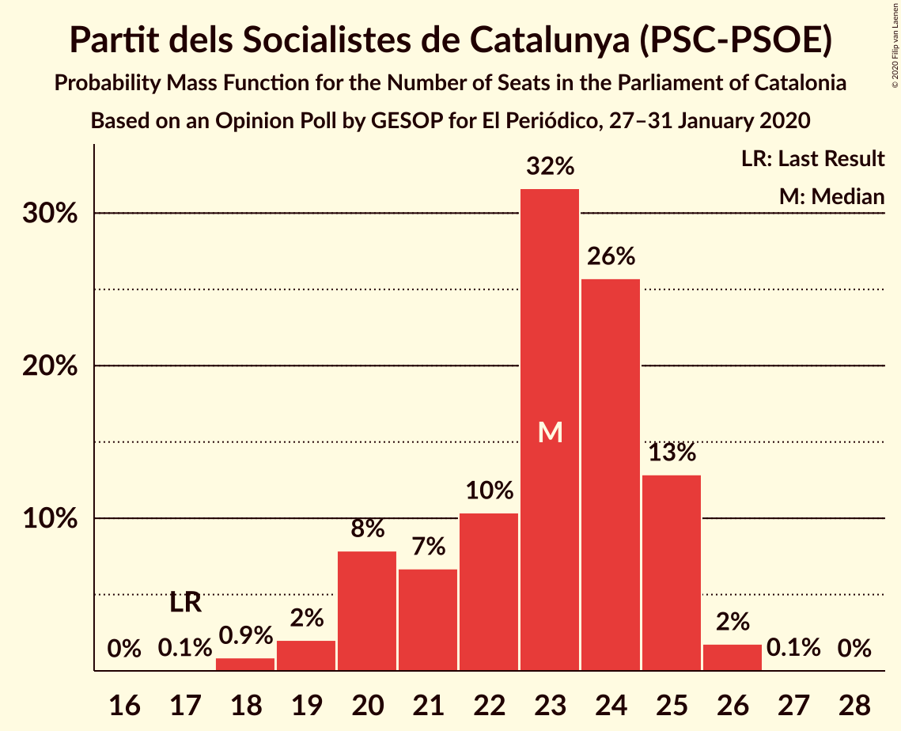
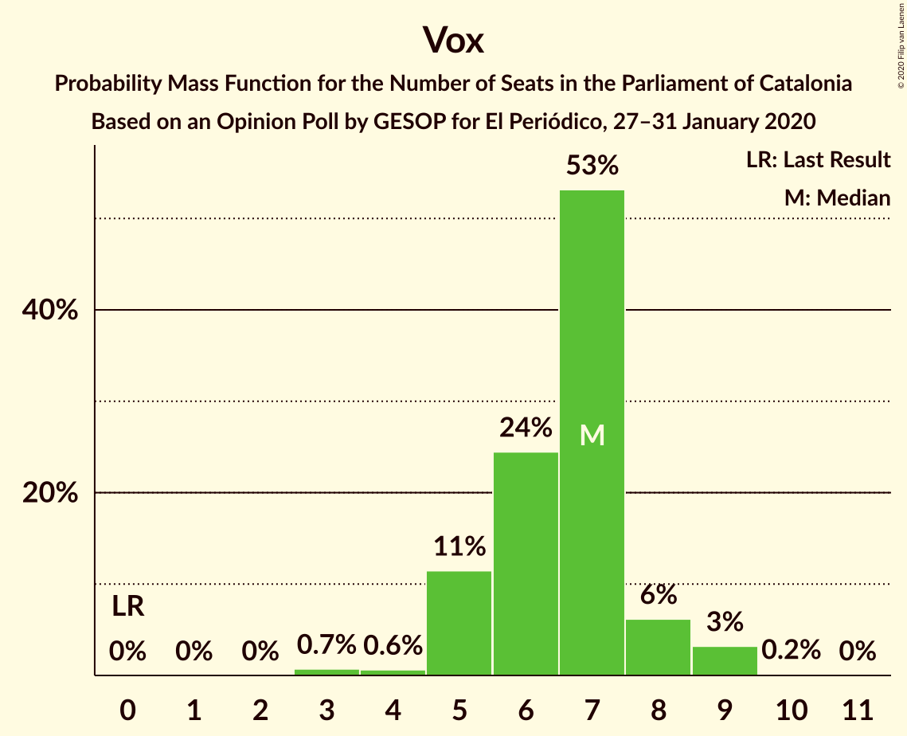
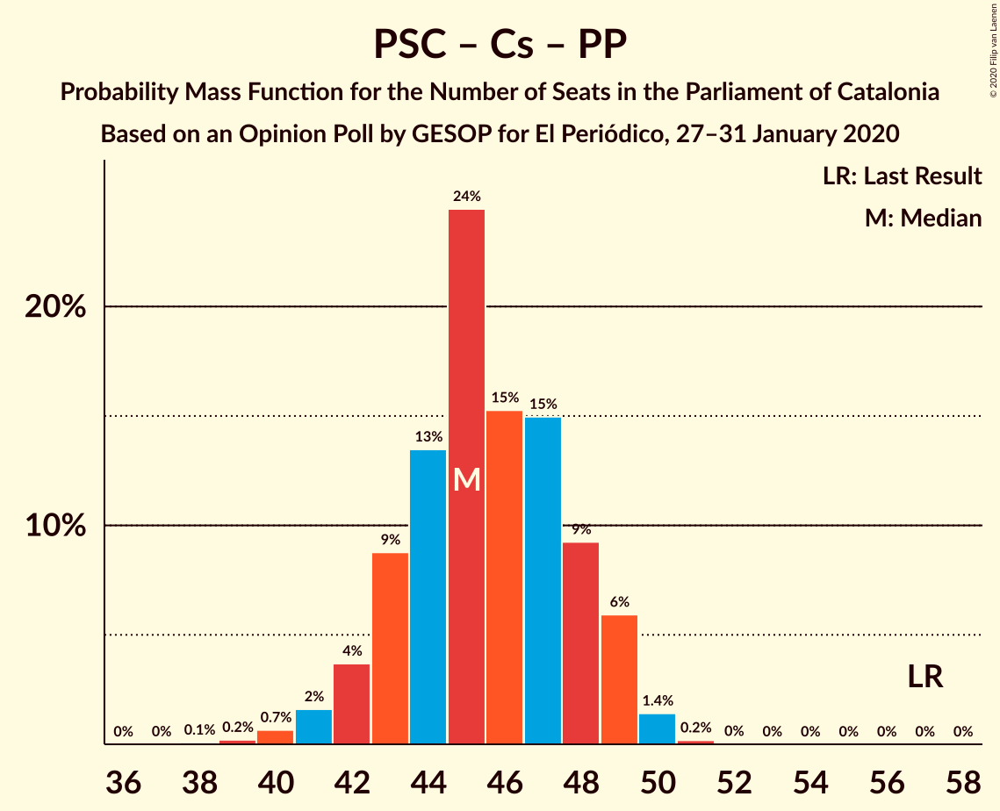

# Opinion Poll by GESOP for El Periódico, 27–31 January 2020

<a href="#voting-intentions">Voting Intentions</a> | <a href="#seats">Seats</a> | <a href="#coalitions">Coalitions</a> | <a href="#technical-information">Technical Information</a>

## Voting Intentions

### Confidence Intervals

| Party | Last Result | Poll Result | 80% Confidence Interval | 90% Confidence Interval | 95% Confidence Interval | 99% Confidence Interval |
|:-----:|:-----------:|:-----------:|:-----------------------:|:-----------------------:|:-----------------------:|:-----------------------:|
| Esquerra Republicana–Catalunya Sí | 21.4% | 22.0% | 20.7–23.5% |20.3–23.9% |20.0–24.2% |19.3–25.0% |
| Junts pel Catalunya | 21.7% | 19.0% | 17.7–20.4% |17.4–20.8% |17.1–21.1% |16.5–21.8% |
| Partit dels Socialistes de Catalunya (PSC-PSOE) | 13.9% | 16.9% | 15.7–18.3% |15.4–18.6% |15.1–19.0% |14.5–19.6% |
| Ciutadans–Partido de la Ciudadanía | 25.4% | 12.8% | 11.8–14.0% |11.4–14.4% |11.2–14.7% |10.7–15.3% |
| Catalunya en Comú–Podem | 7.5% | 9.4% | 8.5–10.5% |8.2–10.8% |8.0–11.0% |7.6–11.6% |
| Candidatura d’Unitat Popular | 4.5% | 6.6% | 5.8–7.5% |5.6–7.8% |5.4–8.0% |5.1–8.5% |
| Vox | 0.0% | 5.5% | 4.8–6.4% |4.6–6.6% |4.4–6.8% |4.1–7.2% |
| Partit Popular | 4.2% | 4.8% | 4.1–5.6% |4.0–5.9% |3.8–6.1% |3.5–6.5% |

*Note:* The poll result column reflects the actual value used in the calculations. Published results may vary slightly, and in addition be rounded to fewer digits.

## Seats

### Confidence Intervals

| Party | Last Result | Median | 80% Confidence Interval | 90% Confidence Interval | 95% Confidence Interval | 99% Confidence Interval |
|:-----:|:-----------:|:------:|:-----------------------:|:-----------------------:|:-----------------------:|:-----------------------:|
| <a href="#esquerra-republicana–catalunya-sí">Esquerra Republicana–Catalunya Sí</a> | 32 | 32 | 31–36 |30–36 |29–36 |29–37 |
| <a href="#junts-pel-catalunya">Junts pel Catalunya</a> | 34 | 30 | 27–31 |27–32 |26–33 |26–35 |
| <a href="#partit-dels-socialistes-de-catalunya-(psc-psoe)">Partit dels Socialistes de Catalunya (PSC-PSOE)</a> | 17 | 23 | 21–25 |20–26 |19–26 |18–26 |
| <a href="#ciutadans–partido-de-la-ciudadanía">Ciutadans–Partido de la Ciudadanía</a> | 36 | 17 | 16–19 |14–19 |14–19 |14–20 |
| <a href="#catalunya-en-comú–podem">Catalunya en Comú–Podem</a> | 8 | 11 | 11–13 |10–13 |9–14 |8–14 |
| <a href="#candidatura-d’unitat-popular">Candidatura d’Unitat Popular</a> | 4 | 9 | 8–9 |8–10 |7–11 |7–11 |
| <a href="#vox">Vox</a> | 0 | 7 | 5–7 |5–8 |5–9 |3–9 |
| <a href="#partit-popular">Partit Popular</a> | 4 | 6 | 4–7 |3–7 |3–7 |3–8 |

### Esquerra Republicana–Catalunya Sí

*For a full overview of the results for this party, see the [Esquerra Republicana–Catalunya Sí](party-esquerrarepublicana–catalunyasí.html) page.*

| Number of Seats | Probability | Accumulated | Special Marks |
|:---------------:|:-----------:|:-----------:|:-------------:|
| 28 | 0.3% | 100% |  |
| 29 | 3% | 99.7% |  |
| 30 | 4% | 97% |  |
| 31 | 30% | 93% |  |
| 32 | 17% | 63% | Last Result, Median |
| 33 | 10% | 46% |  |
| 34 | 12% | 37% |  |
| 35 | 14% | 24% |  |
| 36 | 10% | 10% |  |
| 37 | 0.4% | 0.7% |  |
| 38 | 0.1% | 0.3% |  |
| 39 | 0.1% | 0.2% |  |
| 40 | 0.1% | 0.1% |  |
| 41 | 0% | 0% |  |

### Junts pel Catalunya

*For a full overview of the results for this party, see the [Junts pel Catalunya](party-juntspelcatalunya.html) page.*

| Number of Seats | Probability | Accumulated | Special Marks |
|:---------------:|:-----------:|:-----------:|:-------------:|
| 24 | 0.1% | 100% |  |
| 25 | 0.3% | 99.9% |  |
| 26 | 2% | 99.6% |  |
| 27 | 9% | 97% |  |
| 28 | 7% | 89% |  |
| 29 | 13% | 82% |  |
| 30 | 31% | 69% | Median |
| 31 | 30% | 38% |  |
| 32 | 4% | 7% |  |
| 33 | 2% | 3% |  |
| 34 | 0.9% | 2% | Last Result |
| 35 | 0.7% | 0.8% |  |
| 36 | 0.1% | 0.1% |  |
| 37 | 0% | 0.1% |  |
| 38 | 0% | 0% |  |

### Partit dels Socialistes de Catalunya (PSC-PSOE)

*For a full overview of the results for this party, see the [Partit dels Socialistes de Catalunya (PSC-PSOE)](party-partitdelssocialistesdecatalunyapsc-psoe.html) page.*

| Number of Seats | Probability | Accumulated | Special Marks |
|:---------------:|:-----------:|:-----------:|:-------------:|
| 17 | 0.1% | 100% | Last Result |
| 18 | 2% | 99.9% |  |
| 19 | 2% | 98% |  |
| 20 | 6% | 97% |  |
| 21 | 7% | 91% |  |
| 22 | 12% | 84% |  |
| 23 | 34% | 72% | Median |
| 24 | 21% | 37% |  |
| 25 | 11% | 17% |  |
| 26 | 5% | 5% |  |
| 27 | 0.1% | 0.1% |  |
| 28 | 0% | 0% |  |

### Ciutadans–Partido de la Ciudadanía

*For a full overview of the results for this party, see the [Ciutadans–Partido de la Ciudadanía](party-ciutadans–partidodelaciudadanía.html) page.*

| Number of Seats | Probability | Accumulated | Special Marks |
|:---------------:|:-----------:|:-----------:|:-------------:|
| 13 | 0.4% | 100% |  |
| 14 | 6% | 99.6% |  |
| 15 | 2% | 94% |  |
| 16 | 32% | 92% |  |
| 17 | 16% | 60% | Median |
| 18 | 23% | 44% |  |
| 19 | 19% | 21% |  |
| 20 | 2% | 2% |  |
| 21 | 0.3% | 0.3% |  |
| 22 | 0% | 0% |  |
| 23 | 0% | 0% |  |
| 24 | 0% | 0% |  |
| 25 | 0% | 0% |  |
| 26 | 0% | 0% |  |
| 27 | 0% | 0% |  |
| 28 | 0% | 0% |  |
| 29 | 0% | 0% |  |
| 30 | 0% | 0% |  |
| 31 | 0% | 0% |  |
| 32 | 0% | 0% |  |
| 33 | 0% | 0% |  |
| 34 | 0% | 0% |  |
| 35 | 0% | 0% |  |
| 36 | 0% | 0% | Last Result |

### Catalunya en Comú–Podem

*For a full overview of the results for this party, see the [Catalunya en Comú–Podem](party-catalunyaencomú–podem.html) page.*

| Number of Seats | Probability | Accumulated | Special Marks |
|:---------------:|:-----------:|:-----------:|:-------------:|
| 8 | 0.7% | 100% | Last Result |
| 9 | 2% | 99.3% |  |
| 10 | 5% | 97% |  |
| 11 | 56% | 92% | Median |
| 12 | 16% | 35% |  |
| 13 | 15% | 19% |  |
| 14 | 4% | 4% |  |
| 15 | 0.2% | 0.2% |  |
| 16 | 0% | 0% |  |

### Candidatura d’Unitat Popular

*For a full overview of the results for this party, see the [Candidatura d’Unitat Popular](party-candidaturad’unitatpopular.html) page.*

| Number of Seats | Probability | Accumulated | Special Marks |
|:---------------:|:-----------:|:-----------:|:-------------:|
| 4 | 0% | 100% | Last Result |
| 5 | 0% | 100% |  |
| 6 | 0.4% | 99.9% |  |
| 7 | 4% | 99.6% |  |
| 8 | 43% | 96% |  |
| 9 | 45% | 53% | Median |
| 10 | 4% | 8% |  |
| 11 | 4% | 4% |  |
| 12 | 0.1% | 0.1% |  |
| 13 | 0% | 0% |  |

### Vox

*For a full overview of the results for this party, see the [Vox](party-vox.html) page.*

| Number of Seats | Probability | Accumulated | Special Marks |
|:---------------:|:-----------:|:-----------:|:-------------:|
| 0 | 0% | 100% | Last Result |
| 1 | 0% | 100% |  |
| 2 | 0% | 100% |  |
| 3 | 0.6% | 100% |  |
| 4 | 0.4% | 99.4% |  |
| 5 | 14% | 99.0% |  |
| 6 | 25% | 85% |  |
| 7 | 52% | 60% | Median |
| 8 | 4% | 8% |  |
| 9 | 4% | 4% |  |
| 10 | 0.2% | 0.2% |  |
| 11 | 0% | 0% |  |

### Partit Popular

*For a full overview of the results for this party, see the [Partit Popular](party-partitpopular.html) page.*

| Number of Seats | Probability | Accumulated | Special Marks |
|:---------------:|:-----------:|:-----------:|:-------------:|
| 3 | 9% | 100% |  |
| 4 | 5% | 90% | Last Result |
| 5 | 31% | 86% |  |
| 6 | 20% | 54% | Median |
| 7 | 34% | 35% |  |
| 8 | 0.5% | 0.5% |  |
| 9 | 0.1% | 0.1% |  |
| 10 | 0% | 0% |  |

## Coalitions

### Confidence Intervals

| Coalition | Last Result | Median | Majority? | 80% Confidence Interval | 90% Confidence Interval | 95% Confidence Interval | 99% Confidence Interval |
|:---------:|:-----------:|:------:|:---------:|:-----------------------:|:-----------------------:|:-----------------------:|:-----------------------:|
| Esquerra Republicana–Catalunya Sí – Junts pel Catalunya – Catalunya en Comú–Podem | 74 | 74 | 100% | 72–77 | 71–78 | 71–78 | 69–80 |
| Esquerra Republicana–Catalunya Sí – Junts pel Catalunya – Candidatura d’Unitat Popular | 70 | 71 | 98.9% | 69–74 | 69–75 | 68–75 | 67–77 |
| Esquerra Republicana–Catalunya Sí – Partit dels Socialistes de Catalunya (PSC-PSOE) – Catalunya en Comú–Podem | 57 | 67 | 45% | 64–70 | 64–70 | 63–71 | 62–73 |
| Esquerra Republicana–Catalunya Sí – Junts pel Catalunya | 66 | 62 | 1.3% | 60–65 | 60–66 | 59–67 | 58–68 |
| Partit dels Socialistes de Catalunya (PSC-PSOE) – Ciutadans–Partido de la Ciudadanía – Catalunya en Comú–Podem – Partit Popular | 65 | 58 | 0% | 55–59 | 54–60 | 53–60 | 51–62 |
| Partit dels Socialistes de Catalunya (PSC-PSOE) – Ciutadans–Partido de la Ciudadanía – Vox – Partit Popular | 57 | 53 | 0% | 49–55 | 49–55 | 48–56 | 47–57 |
| Partit dels Socialistes de Catalunya (PSC-PSOE) – Ciutadans–Partido de la Ciudadanía – Partit Popular | 57 | 46 | 0% | 43–48 | 42–49 | 41–49 | 40–50 |
| Esquerra Republicana–Catalunya Sí – Catalunya en Comú–Podem | 40 | 44 | 0% | 42–47 | 41–48 | 41–48 | 40–49 |

### Esquerra Republicana–Catalunya Sí – Junts pel Catalunya – Catalunya en Comú–Podem

| Number of Seats | Probability | Accumulated | Special Marks |
|:---------------:|:-----------:|:-----------:|:-------------:|
| 68 | 0.2% | 100% | Majority |
| 69 | 0.7% | 99.8% |  |
| 70 | 2% | 99.1% |  |
| 71 | 7% | 98% |  |
| 72 | 15% | 90% |  |
| 73 | 21% | 75% | Median |
| 74 | 10% | 53% | Last Result |
| 75 | 22% | 43% |  |
| 76 | 6% | 21% |  |
| 77 | 7% | 15% |  |
| 78 | 6% | 8% |  |
| 79 | 1.1% | 2% |  |
| 80 | 0.5% | 0.8% |  |
| 81 | 0.3% | 0.3% |  |
| 82 | 0% | 0% |  |

### Esquerra Republicana–Catalunya Sí – Junts pel Catalunya – Candidatura d’Unitat Popular

| Number of Seats | Probability | Accumulated | Special Marks |
|:---------------:|:-----------:|:-----------:|:-------------:|
| 65 | 0.1% | 100% |  |
| 66 | 0.2% | 99.9% |  |
| 67 | 0.8% | 99.7% |  |
| 68 | 3% | 98.9% | Majority |
| 69 | 7% | 96% |  |
| 70 | 29% | 89% | Last Result |
| 71 | 28% | 60% | Median |
| 72 | 8% | 31% |  |
| 73 | 12% | 24% |  |
| 74 | 7% | 12% |  |
| 75 | 3% | 5% |  |
| 76 | 1.0% | 2% |  |
| 77 | 0.7% | 1.0% |  |
| 78 | 0.2% | 0.3% |  |
| 79 | 0.1% | 0.1% |  |
| 80 | 0% | 0% |  |

### Esquerra Republicana–Catalunya Sí – Partit dels Socialistes de Catalunya (PSC-PSOE) – Catalunya en Comú–Podem

| Number of Seats | Probability | Accumulated | Special Marks |
|:---------------:|:-----------:|:-----------:|:-------------:|
| 57 | 0% | 100% | Last Result |
| 58 | 0% | 100% |  |
| 59 | 0% | 100% |  |
| 60 | 0.2% | 100% |  |
| 61 | 0.2% | 99.8% |  |
| 62 | 0.3% | 99.6% |  |
| 63 | 3% | 99.4% |  |
| 64 | 13% | 96% |  |
| 65 | 13% | 83% |  |
| 66 | 6% | 70% | Median |
| 67 | 19% | 64% |  |
| 68 | 8% | 45% | Majority |
| 69 | 20% | 37% |  |
| 70 | 12% | 17% |  |
| 71 | 3% | 5% |  |
| 72 | 0.8% | 2% |  |
| 73 | 0.8% | 0.9% |  |
| 74 | 0% | 0% |  |

### Esquerra Republicana–Catalunya Sí – Junts pel Catalunya

| Number of Seats | Probability | Accumulated | Special Marks |
|:---------------:|:-----------:|:-----------:|:-------------:|
| 57 | 0.2% | 100% |  |
| 58 | 0.6% | 99.8% |  |
| 59 | 3% | 99.2% |  |
| 60 | 7% | 96% |  |
| 61 | 15% | 90% |  |
| 62 | 32% | 75% | Median |
| 63 | 18% | 43% |  |
| 64 | 10% | 25% |  |
| 65 | 6% | 16% |  |
| 66 | 7% | 9% | Last Result |
| 67 | 1.4% | 3% |  |
| 68 | 0.9% | 1.3% | Majority |
| 69 | 0.2% | 0.4% |  |
| 70 | 0.2% | 0.2% |  |
| 71 | 0% | 0% |  |

### Partit dels Socialistes de Catalunya (PSC-PSOE) – Ciutadans–Partido de la Ciudadanía – Catalunya en Comú–Podem – Partit Popular

| Number of Seats | Probability | Accumulated | Special Marks |
|:---------------:|:-----------:|:-----------:|:-------------:|
| 50 | 0% | 100% |  |
| 51 | 0.5% | 99.9% |  |
| 52 | 0.7% | 99.4% |  |
| 53 | 3% | 98.7% |  |
| 54 | 4% | 96% |  |
| 55 | 10% | 92% |  |
| 56 | 8% | 82% |  |
| 57 | 23% | 74% | Median |
| 58 | 27% | 51% |  |
| 59 | 18% | 24% |  |
| 60 | 4% | 5% |  |
| 61 | 0.9% | 2% |  |
| 62 | 0.7% | 1.0% |  |
| 63 | 0.2% | 0.3% |  |
| 64 | 0% | 0% |  |
| 65 | 0% | 0% | Last Result |

### Partit dels Socialistes de Catalunya (PSC-PSOE) – Ciutadans–Partido de la Ciudadanía – Vox – Partit Popular

| Number of Seats | Probability | Accumulated | Special Marks |
|:---------------:|:-----------:|:-----------:|:-------------:|
| 45 | 0.1% | 100% |  |
| 46 | 0.3% | 99.9% |  |
| 47 | 0.9% | 99.6% |  |
| 48 | 2% | 98.7% |  |
| 49 | 8% | 96% |  |
| 50 | 8% | 88% |  |
| 51 | 11% | 80% |  |
| 52 | 15% | 70% |  |
| 53 | 24% | 54% | Median |
| 54 | 18% | 30% |  |
| 55 | 8% | 12% |  |
| 56 | 3% | 4% |  |
| 57 | 1.2% | 1.3% | Last Result |
| 58 | 0.1% | 0.1% |  |
| 59 | 0% | 0% |  |

### Partit dels Socialistes de Catalunya (PSC-PSOE) – Ciutadans–Partido de la Ciudadanía – Partit Popular

| Number of Seats | Probability | Accumulated | Special Marks |
|:---------------:|:-----------:|:-----------:|:-------------:|
| 39 | 0.3% | 100% |  |
| 40 | 0.7% | 99.7% |  |
| 41 | 3% | 99.0% |  |
| 42 | 2% | 96% |  |
| 43 | 6% | 95% |  |
| 44 | 11% | 88% |  |
| 45 | 20% | 77% |  |
| 46 | 20% | 57% | Median |
| 47 | 15% | 37% |  |
| 48 | 17% | 22% |  |
| 49 | 3% | 5% |  |
| 50 | 2% | 2% |  |
| 51 | 0.2% | 0.2% |  |
| 52 | 0% | 0% |  |
| 53 | 0% | 0% |  |
| 54 | 0% | 0% |  |
| 55 | 0% | 0% |  |
| 56 | 0% | 0% |  |
| 57 | 0% | 0% | Last Result |

### Esquerra Republicana–Catalunya Sí – Catalunya en Comú–Podem

| Number of Seats | Probability | Accumulated | Special Marks |
|:---------------:|:-----------:|:-----------:|:-------------:|
| 38 | 0.1% | 100% |  |
| 39 | 0.2% | 99.9% |  |
| 40 | 1.4% | 99.7% | Last Result |
| 41 | 4% | 98% |  |
| 42 | 22% | 94% |  |
| 43 | 12% | 72% | Median |
| 44 | 20% | 60% |  |
| 45 | 12% | 40% |  |
| 46 | 9% | 27% |  |
| 47 | 11% | 18% |  |
| 48 | 7% | 7% |  |
| 49 | 0.4% | 0.9% |  |
| 50 | 0.4% | 0.5% |  |
| 51 | 0.1% | 0.1% |  |
| 52 | 0% | 0% |  |

## Technical Information

### Opinion Poll

+ **Polling firm:** GESOP
+ **Commissioner(s):** El Periódico
+ **Fieldwork period:** 27–31 January 2020

### Calculations

+ **Sample size:** 1435
+ **Simulations done:** 131,072
+ **Error estimate:** 0.88%

