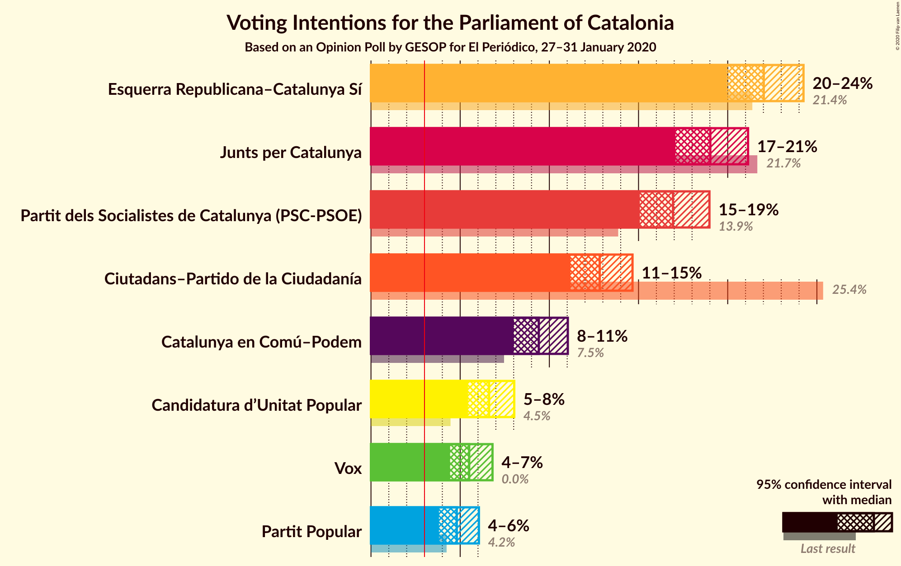
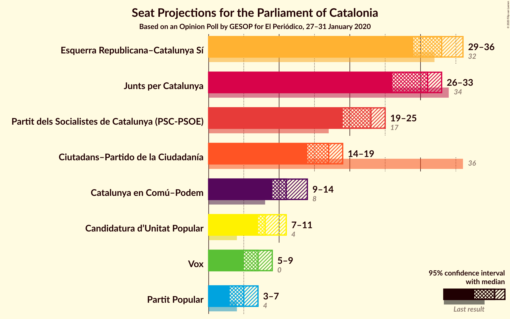
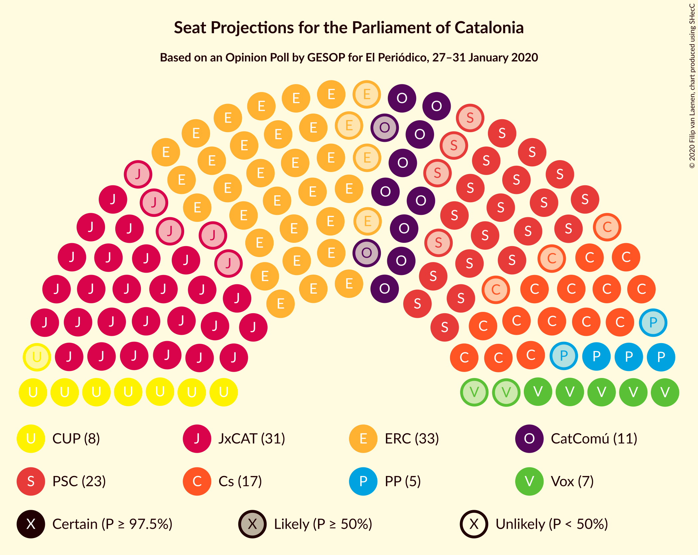
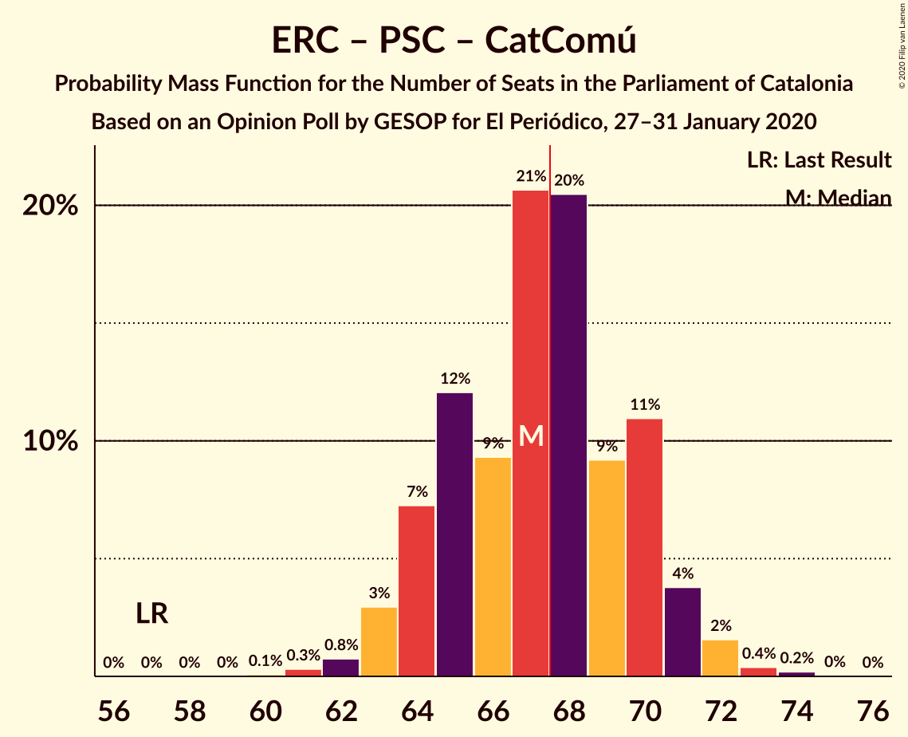
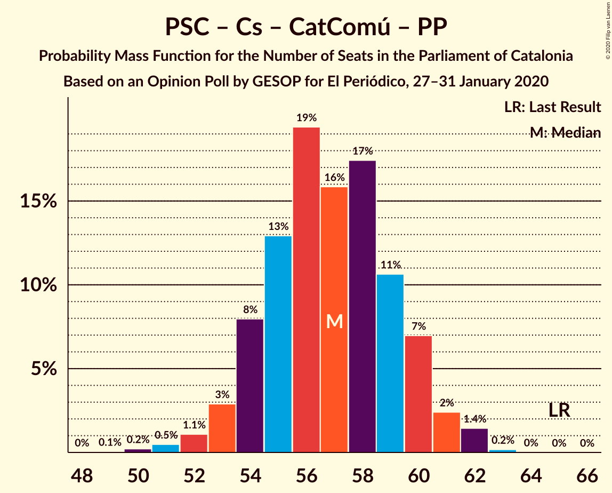
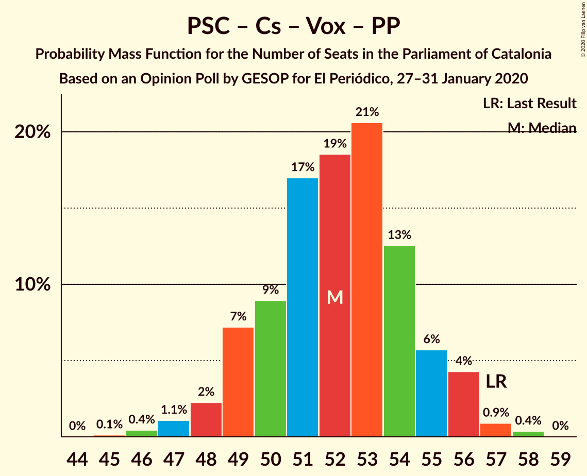

# Opinion Poll by GESOP for El Periódico, 27–31 January 2020

<a href="#voting-intentions">Voting Intentions</a> | <a href="#seats">Seats</a> | <a href="#coalitions">Coalitions</a> | <a href="#technical-information">Technical Information</a>

## Voting Intentions

### Confidence Intervals

| Party | Last Result | Poll Result | 80% Confidence Interval | 90% Confidence Interval | 95% Confidence Interval | 99% Confidence Interval |
|:-----:|:-----------:|:-----------:|:-----------------------:|:-----------------------:|:-----------------------:|:-----------------------:|
| Esquerra Republicana–Catalunya Sí | 21.4% | 22.0% | 20.7–23.5% |20.3–23.9% |20.0–24.2% |19.3–25.0% |
| Junts per Catalunya | 21.7% | 19.0% | 17.7–20.4% |17.4–20.8% |17.1–21.1% |16.5–21.8% |
| Partit dels Socialistes de Catalunya (PSC-PSOE) | 13.9% | 16.9% | 15.7–18.3% |15.4–18.6% |15.1–19.0% |14.5–19.6% |
| Ciutadans–Partido de la Ciudadanía | 25.4% | 12.8% | 11.8–14.0% |11.4–14.4% |11.2–14.7% |10.7–15.3% |
| Catalunya en Comú–Podem | 7.5% | 9.4% | 8.5–10.5% |8.2–10.8% |8.0–11.0% |7.6–11.6% |
| Candidatura d’Unitat Popular | 4.5% | 6.6% | 5.8–7.5% |5.6–7.8% |5.4–8.0% |5.1–8.5% |
| Vox | 0.0% | 5.5% | 4.8–6.4% |4.6–6.6% |4.4–6.8% |4.1–7.2% |
| Partit Popular | 4.2% | 4.8% | 4.1–5.6% |4.0–5.9% |3.8–6.1% |3.5–6.5% |

*Note:* The poll result column reflects the actual value used in the calculations. Published results may vary slightly, and in addition be rounded to fewer digits.

## Seats

### Confidence Intervals

| Party | Last Result | Median | 80% Confidence Interval | 90% Confidence Interval | 95% Confidence Interval | 99% Confidence Interval |
|:-----:|:-----------:|:------:|:-----------------------:|:-----------------------:|:-----------------------:|:-----------------------:|
| <a href="#esquerra-republicana–catalunya-sí">Esquerra Republicana–Catalunya Sí</a> | 32 | 33 | 31–35 |30–36 |29–36 |28–38 |
| <a href="#junts-per-catalunya">Junts per Catalunya</a> | 34 | 31 | 28–32 |27–32 |26–33 |26–35 |
| <a href="#partit-dels-socialistes-de-catalunya-(psc-psoe)">Partit dels Socialistes de Catalunya (PSC-PSOE)</a> | 17 | 23 | 20–25 |20–25 |19–25 |18–26 |
| <a href="#ciutadans–partido-de-la-ciudadanía">Ciutadans–Partido de la Ciudadanía</a> | 36 | 17 | 15–19 |14–19 |14–19 |14–20 |
| <a href="#catalunya-en-comú–podem">Catalunya en Comú–Podem</a> | 8 | 11 | 10–13 |9–14 |9–14 |8–14 |
| <a href="#candidatura-d’unitat-popular">Candidatura d’Unitat Popular</a> | 4 | 8 | 8–9 |8–10 |7–11 |7–11 |
| <a href="#vox">Vox</a> | 0 | 7 | 5–7 |5–8 |5–9 |3–9 |
| <a href="#partit-popular">Partit Popular</a> | 4 | 5 | 4–7 |3–7 |3–7 |3–8 |

### Esquerra Republicana–Catalunya Sí

*For a full overview of the results for this party, see the [Esquerra Republicana–Catalunya Sí](party-esquerrarepublicana–catalunyasí.html) page.*

| Number of Seats | Probability | Accumulated | Special Marks |
|:---------------:|:-----------:|:-----------:|:-------------:|
| 28 | 0.5% | 100% |  |
| 29 | 4% | 99.4% |  |
| 30 | 5% | 95% |  |
| 31 | 16% | 90% |  |
| 32 | 11% | 74% | Last Result |
| 33 | 21% | 62% | Median |
| 34 | 19% | 42% |  |
| 35 | 16% | 22% |  |
| 36 | 4% | 6% |  |
| 37 | 1.4% | 2% |  |
| 38 | 0.4% | 0.6% |  |
| 39 | 0.2% | 0.2% |  |
| 40 | 0% | 0% |  |

### Junts per Catalunya

*For a full overview of the results for this party, see the [Junts per Catalunya](party-juntspercatalunya.html) page.*

| Number of Seats | Probability | Accumulated | Special Marks |
|:---------------:|:-----------:|:-----------:|:-------------:|
| 25 | 0.3% | 100% |  |
| 26 | 4% | 99.7% |  |
| 27 | 4% | 95% |  |
| 28 | 11% | 91% |  |
| 29 | 13% | 80% |  |
| 30 | 15% | 67% |  |
| 31 | 35% | 52% | Median |
| 32 | 12% | 17% |  |
| 33 | 3% | 4% |  |
| 34 | 0.9% | 1.5% | Last Result |
| 35 | 0.4% | 0.5% |  |
| 36 | 0.1% | 0.2% |  |
| 37 | 0% | 0% |  |

### Partit dels Socialistes de Catalunya (PSC-PSOE)

*For a full overview of the results for this party, see the [Partit dels Socialistes de Catalunya (PSC-PSOE)](party-partitdelssocialistesdecatalunyapsc-psoe.html) page.*

| Number of Seats | Probability | Accumulated | Special Marks |
|:---------------:|:-----------:|:-----------:|:-------------:|
| 17 | 0.1% | 100% | Last Result |
| 18 | 0.9% | 99.9% |  |
| 19 | 2% | 99.1% |  |
| 20 | 8% | 97% |  |
| 21 | 7% | 89% |  |
| 22 | 10% | 82% |  |
| 23 | 32% | 72% | Median |
| 24 | 26% | 40% |  |
| 25 | 13% | 15% |  |
| 26 | 2% | 2% |  |
| 27 | 0.1% | 0.1% |  |
| 28 | 0% | 0% |  |

### Ciutadans–Partido de la Ciudadanía

*For a full overview of the results for this party, see the [Ciutadans–Partido de la Ciudadanía](party-ciutadans–partidodelaciudadanía.html) page.*

| Number of Seats | Probability | Accumulated | Special Marks |
|:---------------:|:-----------:|:-----------:|:-------------:|
| 13 | 0.3% | 100% |  |
| 14 | 5% | 99.7% |  |
| 15 | 7% | 95% |  |
| 16 | 24% | 88% |  |
| 17 | 15% | 64% | Median |
| 18 | 31% | 49% |  |
| 19 | 16% | 17% |  |
| 20 | 1.5% | 2% |  |
| 21 | 0.2% | 0.3% |  |
| 22 | 0.1% | 0.1% |  |
| 23 | 0% | 0% |  |
| 24 | 0% | 0% |  |
| 25 | 0% | 0% |  |
| 26 | 0% | 0% |  |
| 27 | 0% | 0% |  |
| 28 | 0% | 0% |  |
| 29 | 0% | 0% |  |
| 30 | 0% | 0% |  |
| 31 | 0% | 0% |  |
| 32 | 0% | 0% |  |
| 33 | 0% | 0% |  |
| 34 | 0% | 0% |  |
| 35 | 0% | 0% |  |
| 36 | 0% | 0% | Last Result |

### Catalunya en Comú–Podem

*For a full overview of the results for this party, see the [Catalunya en Comú–Podem](party-catalunyaencomú–podem.html) page.*

| Number of Seats | Probability | Accumulated | Special Marks |
|:---------------:|:-----------:|:-----------:|:-------------:|
| 8 | 1.0% | 100% | Last Result |
| 9 | 6% | 99.0% |  |
| 10 | 10% | 93% |  |
| 11 | 50% | 83% | Median |
| 12 | 13% | 33% |  |
| 13 | 15% | 21% |  |
| 14 | 5% | 6% |  |
| 15 | 0.3% | 0.3% |  |
| 16 | 0% | 0% |  |

### Candidatura d’Unitat Popular

*For a full overview of the results for this party, see the [Candidatura d’Unitat Popular](party-candidaturad’unitatpopular.html) page.*

| Number of Seats | Probability | Accumulated | Special Marks |
|:---------------:|:-----------:|:-----------:|:-------------:|
| 4 | 0% | 100% | Last Result |
| 5 | 0% | 100% |  |
| 6 | 0.3% | 100% |  |
| 7 | 5% | 99.6% |  |
| 8 | 51% | 95% | Median |
| 9 | 36% | 44% |  |
| 10 | 4% | 8% |  |
| 11 | 4% | 4% |  |
| 12 | 0% | 0.1% |  |
| 13 | 0% | 0% |  |

### Vox

*For a full overview of the results for this party, see the [Vox](party-vox.html) page.*

| Number of Seats | Probability | Accumulated | Special Marks |
|:---------------:|:-----------:|:-----------:|:-------------:|
| 0 | 0% | 100% | Last Result |
| 1 | 0% | 100% |  |
| 2 | 0% | 100% |  |
| 3 | 0.7% | 100% |  |
| 4 | 0.6% | 99.3% |  |
| 5 | 11% | 98.6% |  |
| 6 | 24% | 87% |  |
| 7 | 53% | 63% | Median |
| 8 | 6% | 10% |  |
| 9 | 3% | 3% |  |
| 10 | 0.2% | 0.2% |  |
| 11 | 0% | 0% |  |

### Partit Popular

*For a full overview of the results for this party, see the [Partit Popular](party-partitpopular.html) page.*

| Number of Seats | Probability | Accumulated | Special Marks |
|:---------------:|:-----------:|:-----------:|:-------------:|
| 3 | 9% | 100% |  |
| 4 | 5% | 91% | Last Result |
| 5 | 44% | 86% | Median |
| 6 | 22% | 42% |  |
| 7 | 19% | 20% |  |
| 8 | 0.4% | 0.5% |  |
| 9 | 0.2% | 0.2% |  |
| 10 | 0% | 0% |  |

## Coalitions

### Confidence Intervals

| Coalition | Last Result | Median | Majority? | 80% Confidence Interval | 90% Confidence Interval | 95% Confidence Interval | 99% Confidence Interval |
|:---------:|:-----------:|:------:|:---------:|:-----------------------:|:-----------------------:|:-----------------------:|:-----------------------:|
| Esquerra Republicana–Catalunya Sí – Junts per Catalunya – Catalunya en Comú–Podem | 74 | 74 | 100% | 72–77 | 71–78 | 70–78 | 69–80 |
| Esquerra Republicana–Catalunya Sí – Junts per Catalunya – Candidatura d’Unitat Popular | 70 | 71 | 98% | 69–74 | 68–75 | 68–76 | 67–77 |
| Esquerra Republicana–Catalunya Sí – Partit dels Socialistes de Catalunya (PSC-PSOE) – Catalunya en Comú–Podem | 57 | 67 | 47% | 64–70 | 64–71 | 63–71 | 62–73 |
| Esquerra Republicana–Catalunya Sí – Junts per Catalunya | 66 | 63 | 2% | 60–65 | 60–66 | 59–67 | 58–69 |
| Partit dels Socialistes de Catalunya (PSC-PSOE) – Ciutadans–Partido de la Ciudadanía – Catalunya en Comú–Podem – Partit Popular | 65 | 57 | 0% | 54–60 | 54–60 | 53–61 | 51–62 |
| Partit dels Socialistes de Catalunya (PSC-PSOE) – Ciutadans–Partido de la Ciudadanía – Vox – Partit Popular | 57 | 52 | 0% | 49–55 | 49–56 | 48–56 | 46–57 |
| Partit dels Socialistes de Catalunya (PSC-PSOE) – Ciutadans–Partido de la Ciudadanía – Partit Popular | 57 | 45 | 0% | 43–48 | 42–49 | 41–49 | 40–50 |
| Esquerra Republicana–Catalunya Sí – Catalunya en Comú–Podem | 40 | 44 | 0% | 42–47 | 41–48 | 40–48 | 39–50 |

### Esquerra Republicana–Catalunya Sí – Junts per Catalunya – Catalunya en Comú–Podem

| Number of Seats | Probability | Accumulated | Special Marks |
|:---------------:|:-----------:|:-----------:|:-------------:|
| 68 | 0.2% | 100% | Majority |
| 69 | 0.8% | 99.8% |  |
| 70 | 3% | 99.0% |  |
| 71 | 6% | 96% |  |
| 72 | 7% | 91% |  |
| 73 | 16% | 83% |  |
| 74 | 18% | 67% | Last Result |
| 75 | 22% | 49% | Median |
| 76 | 13% | 27% |  |
| 77 | 7% | 14% |  |
| 78 | 5% | 7% |  |
| 79 | 1.1% | 2% |  |
| 80 | 0.7% | 1.0% |  |
| 81 | 0.3% | 0.3% |  |
| 82 | 0% | 0.1% |  |
| 83 | 0% | 0% |  |

### Esquerra Republicana–Catalunya Sí – Junts per Catalunya – Candidatura d’Unitat Popular

| Number of Seats | Probability | Accumulated | Special Marks |
|:---------------:|:-----------:|:-----------:|:-------------:|
| 65 | 0.1% | 100% |  |
| 66 | 0.3% | 99.9% |  |
| 67 | 1.4% | 99.5% |  |
| 68 | 7% | 98% | Majority |
| 69 | 7% | 91% |  |
| 70 | 15% | 84% | Last Result |
| 71 | 19% | 68% |  |
| 72 | 15% | 49% | Median |
| 73 | 18% | 35% |  |
| 74 | 10% | 17% |  |
| 75 | 4% | 7% |  |
| 76 | 1.4% | 3% |  |
| 77 | 0.7% | 1.2% |  |
| 78 | 0.4% | 0.5% |  |
| 79 | 0.1% | 0.1% |  |
| 80 | 0% | 0% |  |

### Esquerra Republicana–Catalunya Sí – Partit dels Socialistes de Catalunya (PSC-PSOE) – Catalunya en Comú–Podem

| Number of Seats | Probability | Accumulated | Special Marks |
|:---------------:|:-----------:|:-----------:|:-------------:|
| 57 | 0% | 100% | Last Result |
| 58 | 0% | 100% |  |
| 59 | 0% | 100% |  |
| 60 | 0.1% | 100% |  |
| 61 | 0.3% | 99.9% |  |
| 62 | 0.8% | 99.6% |  |
| 63 | 3% | 98.8% |  |
| 64 | 7% | 96% |  |
| 65 | 12% | 89% |  |
| 66 | 9% | 77% |  |
| 67 | 21% | 67% | Median |
| 68 | 20% | 47% | Majority |
| 69 | 9% | 26% |  |
| 70 | 11% | 17% |  |
| 71 | 4% | 6% |  |
| 72 | 2% | 2% |  |
| 73 | 0.4% | 0.6% |  |
| 74 | 0.2% | 0.2% |  |
| 75 | 0% | 0% |  |

### Esquerra Republicana–Catalunya Sí – Junts per Catalunya

| Number of Seats | Probability | Accumulated | Special Marks |
|:---------------:|:-----------:|:-----------:|:-------------:|
| 56 | 0.1% | 100% |  |
| 57 | 0.2% | 99.9% |  |
| 58 | 1.0% | 99.6% |  |
| 59 | 3% | 98.7% |  |
| 60 | 9% | 96% |  |
| 61 | 9% | 87% |  |
| 62 | 20% | 78% |  |
| 63 | 14% | 58% |  |
| 64 | 21% | 44% | Median |
| 65 | 14% | 24% |  |
| 66 | 6% | 10% | Last Result |
| 67 | 2% | 4% |  |
| 68 | 0.8% | 2% | Majority |
| 69 | 0.5% | 0.7% |  |
| 70 | 0.2% | 0.2% |  |
| 71 | 0% | 0% |  |

### Partit dels Socialistes de Catalunya (PSC-PSOE) – Ciutadans–Partido de la Ciudadanía – Catalunya en Comú–Podem – Partit Popular

| Number of Seats | Probability | Accumulated | Special Marks |
|:---------------:|:-----------:|:-----------:|:-------------:|
| 49 | 0.1% | 100% |  |
| 50 | 0.2% | 99.9% |  |
| 51 | 0.5% | 99.7% |  |
| 52 | 1.1% | 99.2% |  |
| 53 | 3% | 98% |  |
| 54 | 8% | 95% |  |
| 55 | 13% | 87% |  |
| 56 | 19% | 74% | Median |
| 57 | 16% | 55% |  |
| 58 | 17% | 39% |  |
| 59 | 11% | 22% |  |
| 60 | 7% | 11% |  |
| 61 | 2% | 4% |  |
| 62 | 1.4% | 2% |  |
| 63 | 0.2% | 0.2% |  |
| 64 | 0% | 0% |  |
| 65 | 0% | 0% | Last Result |

### Partit dels Socialistes de Catalunya (PSC-PSOE) – Ciutadans–Partido de la Ciudadanía – Vox – Partit Popular

| Number of Seats | Probability | Accumulated | Special Marks |
|:---------------:|:-----------:|:-----------:|:-------------:|
| 45 | 0.1% | 100% |  |
| 46 | 0.4% | 99.9% |  |
| 47 | 1.1% | 99.4% |  |
| 48 | 2% | 98% |  |
| 49 | 7% | 96% |  |
| 50 | 9% | 89% |  |
| 51 | 17% | 80% |  |
| 52 | 19% | 63% | Median |
| 53 | 21% | 44% |  |
| 54 | 13% | 24% |  |
| 55 | 6% | 11% |  |
| 56 | 4% | 6% |  |
| 57 | 0.9% | 1.3% | Last Result |
| 58 | 0.4% | 0.4% |  |
| 59 | 0% | 0% |  |

### Partit dels Socialistes de Catalunya (PSC-PSOE) – Ciutadans–Partido de la Ciudadanía – Partit Popular

| Number of Seats | Probability | Accumulated | Special Marks |
|:---------------:|:-----------:|:-----------:|:-------------:|
| 38 | 0.1% | 100% |  |
| 39 | 0.2% | 99.9% |  |
| 40 | 0.7% | 99.7% |  |
| 41 | 2% | 99.0% |  |
| 42 | 4% | 97% |  |
| 43 | 9% | 94% |  |
| 44 | 13% | 85% |  |
| 45 | 24% | 71% | Median |
| 46 | 15% | 47% |  |
| 47 | 15% | 32% |  |
| 48 | 9% | 17% |  |
| 49 | 6% | 8% |  |
| 50 | 1.4% | 2% |  |
| 51 | 0.2% | 0.2% |  |
| 52 | 0% | 0% |  |
| 53 | 0% | 0% |  |
| 54 | 0% | 0% |  |
| 55 | 0% | 0% |  |
| 56 | 0% | 0% |  |
| 57 | 0% | 0% | Last Result |

### Esquerra Republicana–Catalunya Sí – Catalunya en Comú–Podem

| Number of Seats | Probability | Accumulated | Special Marks |
|:---------------:|:-----------:|:-----------:|:-------------:|
| 37 | 0.1% | 100% |  |
| 38 | 0.2% | 99.9% |  |
| 39 | 0.6% | 99.8% |  |
| 40 | 3% | 99.2% | Last Result |
| 41 | 4% | 96% |  |
| 42 | 11% | 93% |  |
| 43 | 16% | 82% |  |
| 44 | 23% | 66% | Median |
| 45 | 15% | 42% |  |
| 46 | 13% | 27% |  |
| 47 | 7% | 14% |  |
| 48 | 5% | 7% |  |
| 49 | 1.0% | 2% |  |
| 50 | 0.6% | 0.8% |  |
| 51 | 0.1% | 0.1% |  |
| 52 | 0% | 0% |  |

## Technical Information

### Opinion Poll

+ **Polling firm:** GESOP
+ **Commissioner(s):** El Periódico
+ **Fieldwork period:** 27–31 January 2020

### Calculations

+ **Sample size:** 1435
+ **Simulations done:** 1,048,576
+ **Error estimate:** 0.69%

