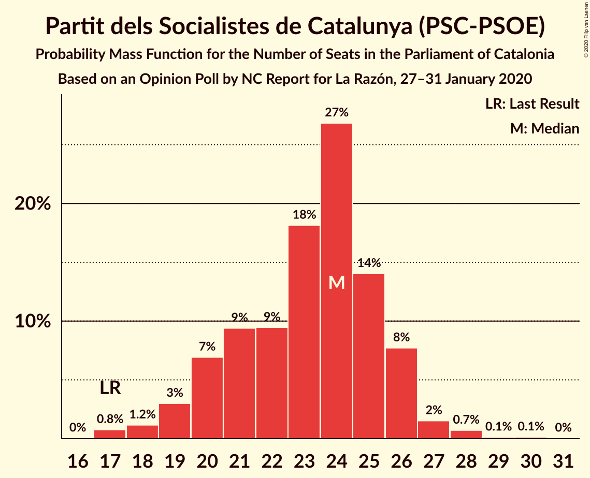
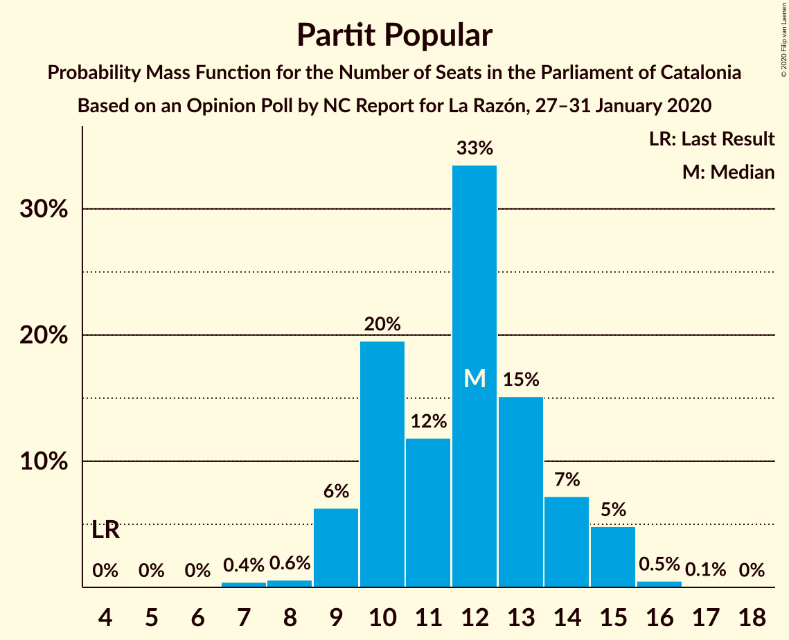
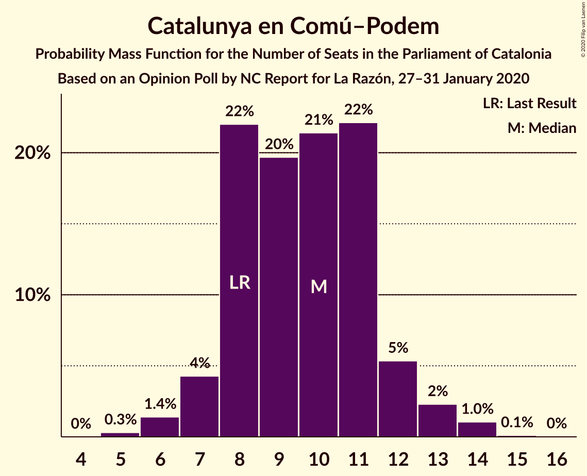

# Opinion Poll by NC Report for La Razón, 27–31 January 2020

<a href="#voting-intentions">Voting Intentions</a> | <a href="#seats">Seats</a> | <a href="#coalitions">Coalitions</a> | <a href="#technical-information">Technical Information</a>

## Voting Intentions

### Confidence Intervals

| Party | Last Result | Poll Result | 80% Confidence Interval | 90% Confidence Interval | 95% Confidence Interval | 99% Confidence Interval |
|:-----:|:-----------:|:-----------:|:-----------------------:|:-----------------------:|:-----------------------:|:-----------------------:|
| Esquerra Republicana–Catalunya Sí | 21.4% | 21.0% | 19.2–23.0% |18.7–23.6% |18.2–24.1% |17.4–25.1% |
| Junts pel Catalunya | 21.7% | 19.5% | 17.7–21.5% |17.2–22.0% |16.8–22.5% |16.0–23.5% |
| Partit dels Socialistes de Catalunya (PSC-PSOE) | 13.9% | 17.3% | 15.7–19.3% |15.2–19.8% |14.8–20.3% |14.0–21.2% |
| Ciutadans–Partido de la Ciudadanía | 25.4% | 10.3% | 9.0–11.9% |8.6–12.3% |8.3–12.7% |7.7–13.5% |
| Partit Popular | 4.2% | 8.9% | 7.7–10.4% |7.4–10.9% |7.1–11.2% |6.5–12.0% |
| Catalunya en Comú–Podem | 7.5% | 8.3% | 7.1–9.7% |6.8–10.1% |6.5–10.5% |6.0–11.2% |
| Vox | 0.0% | 6.2% | 5.2–7.5% |4.9–7.9% |4.7–8.2% |4.3–8.9% |
| Candidatura d’Unitat Popular | 4.5% | 6.0% | 5.0–7.2% |4.7–7.6% |4.5–7.9% |4.0–8.6% |

*Note:* The poll result column reflects the actual value used in the calculations. Published results may vary slightly, and in addition be rounded to fewer digits.

## Seats

### Confidence Intervals

| Party | Last Result | Median | 80% Confidence Interval | 90% Confidence Interval | 95% Confidence Interval | 99% Confidence Interval |
|:-----:|:-----------:|:------:|:-----------------------:|:-----------------------:|:-----------------------:|:-----------------------:|
| <a href="#esquerra-republicana–catalunya-sí">Esquerra Republicana–Catalunya Sí</a> | 32 | 34 | 32–36 |31–37 |31–37 |26–39 |
| <a href="#junts-pel-catalunya">Junts pel Catalunya</a> | 34 | 31 | 27–33 |26–34 |26–36 |25–37 |
| <a href="#partit-dels-socialistes-de-catalunya-(psc-psoe)">Partit dels Socialistes de Catalunya (PSC-PSOE)</a> | 17 | 23 | 21–26 |20–26 |19–26 |17–29 |
| <a href="#ciutadans–partido-de-la-ciudadanía">Ciutadans–Partido de la Ciudadanía</a> | 36 | 12 | 10–13 |9–14 |9–14 |8–17 |
| <a href="#partit-popular">Partit Popular</a> | 4 | 12 | 10–14 |9–15 |9–15 |8–15 |
| <a href="#catalunya-en-comú–podem">Catalunya en Comú–Podem</a> | 8 | 10 | 8–11 |7–12 |6–13 |6–14 |
| <a href="#vox">Vox</a> | 0 | 7 | 6–10 |5–10 |5–10 |4–12 |
| <a href="#candidatura-d’unitat-popular">Candidatura d’Unitat Popular</a> | 4 | 7 | 4–8 |4–8 |4–8 |3–11 |

### Esquerra Republicana–Catalunya Sí

*For a full overview of the results for this party, see the [Esquerra Republicana–Catalunya Sí](party-esquerrarepublicana–catalunyasí.html) page.*

| Number of Seats | Probability | Accumulated | Special Marks |
|:---------------:|:-----------:|:-----------:|:-------------:|
| 23 | 0% | 100% |  |
| 24 | 0.1% | 99.9% |  |
| 25 | 0.1% | 99.9% |  |
| 26 | 0.3% | 99.7% |  |
| 27 | 0.2% | 99.4% |  |
| 28 | 0.2% | 99.2% |  |
| 29 | 0.3% | 99.0% |  |
| 30 | 1.1% | 98.8% |  |
| 31 | 6% | 98% |  |
| 32 | 12% | 91% | Last Result |
| 33 | 15% | 79% |  |
| 34 | 24% | 64% | Median |
| 35 | 17% | 40% |  |
| 36 | 14% | 22% |  |
| 37 | 7% | 8% |  |
| 38 | 0.7% | 1.4% |  |
| 39 | 0.6% | 0.8% |  |
| 40 | 0% | 0.1% |  |
| 41 | 0.1% | 0.1% |  |
| 42 | 0% | 0% |  |

### Junts pel Catalunya

*For a full overview of the results for this party, see the [Junts pel Catalunya](party-juntspelcatalunya.html) page.*

| Number of Seats | Probability | Accumulated | Special Marks |
|:---------------:|:-----------:|:-----------:|:-------------:|
| 23 | 0.1% | 100% |  |
| 24 | 0.4% | 99.9% |  |
| 25 | 0.8% | 99.6% |  |
| 26 | 6% | 98.8% |  |
| 27 | 7% | 93% |  |
| 28 | 14% | 86% |  |
| 29 | 7% | 72% |  |
| 30 | 6% | 65% |  |
| 31 | 31% | 59% | Median |
| 32 | 18% | 29% |  |
| 33 | 3% | 11% |  |
| 34 | 2% | 7% | Last Result |
| 35 | 2% | 5% |  |
| 36 | 1.3% | 3% |  |
| 37 | 2% | 2% |  |
| 38 | 0.3% | 0.3% |  |
| 39 | 0% | 0% |  |

### Partit dels Socialistes de Catalunya (PSC-PSOE)

*For a full overview of the results for this party, see the [Partit dels Socialistes de Catalunya (PSC-PSOE)](party-partitdelssocialistesdecatalunyapsc-psoe.html) page.*

| Number of Seats | Probability | Accumulated | Special Marks |
|:---------------:|:-----------:|:-----------:|:-------------:|
| 17 | 1.2% | 100% | Last Result |
| 18 | 1.0% | 98.7% |  |
| 19 | 2% | 98% |  |
| 20 | 5% | 96% |  |
| 21 | 7% | 90% |  |
| 22 | 17% | 83% |  |
| 23 | 16% | 66% | Median |
| 24 | 21% | 50% |  |
| 25 | 15% | 29% |  |
| 26 | 11% | 13% |  |
| 27 | 1.3% | 2% |  |
| 28 | 0.1% | 0.7% |  |
| 29 | 0.3% | 0.5% |  |
| 30 | 0.2% | 0.3% |  |
| 31 | 0% | 0% |  |

### Ciutadans–Partido de la Ciudadanía

*For a full overview of the results for this party, see the [Ciutadans–Partido de la Ciudadanía](party-ciutadans–partidodelaciudadanía.html) page.*

| Number of Seats | Probability | Accumulated | Special Marks |
|:---------------:|:-----------:|:-----------:|:-------------:|
| 8 | 0.8% | 100% |  |
| 9 | 7% | 99.1% |  |
| 10 | 4% | 93% |  |
| 11 | 12% | 88% |  |
| 12 | 47% | 76% | Median |
| 13 | 22% | 29% |  |
| 14 | 5% | 7% |  |
| 15 | 0.8% | 2% |  |
| 16 | 0.3% | 1.0% |  |
| 17 | 0.2% | 0.7% |  |
| 18 | 0.3% | 0.5% |  |
| 19 | 0.1% | 0.2% |  |
| 20 | 0% | 0.1% |  |
| 21 | 0% | 0% |  |
| 22 | 0% | 0% |  |
| 23 | 0% | 0% |  |
| 24 | 0% | 0% |  |
| 25 | 0% | 0% |  |
| 26 | 0% | 0% |  |
| 27 | 0% | 0% |  |
| 28 | 0% | 0% |  |
| 29 | 0% | 0% |  |
| 30 | 0% | 0% |  |
| 31 | 0% | 0% |  |
| 32 | 0% | 0% |  |
| 33 | 0% | 0% |  |
| 34 | 0% | 0% |  |
| 35 | 0% | 0% |  |
| 36 | 0% | 0% | Last Result |

### Partit Popular

*For a full overview of the results for this party, see the [Partit Popular](party-partitpopular.html) page.*

| Number of Seats | Probability | Accumulated | Special Marks |
|:---------------:|:-----------:|:-----------:|:-------------:|
| 4 | 0% | 100% | Last Result |
| 5 | 0% | 100% |  |
| 6 | 0% | 100% |  |
| 7 | 0.4% | 100% |  |
| 8 | 1.3% | 99.6% |  |
| 9 | 4% | 98% |  |
| 10 | 26% | 94% |  |
| 11 | 5% | 68% |  |
| 12 | 38% | 63% | Median |
| 13 | 14% | 25% |  |
| 14 | 6% | 11% |  |
| 15 | 5% | 5% |  |
| 16 | 0.4% | 0.5% |  |
| 17 | 0.1% | 0.1% |  |
| 18 | 0% | 0% |  |

### Catalunya en Comú–Podem

*For a full overview of the results for this party, see the [Catalunya en Comú–Podem](party-catalunyaencomú–podem.html) page.*

| Number of Seats | Probability | Accumulated | Special Marks |
|:---------------:|:-----------:|:-----------:|:-------------:|
| 5 | 0.4% | 100% |  |
| 6 | 3% | 99.6% |  |
| 7 | 3% | 97% |  |
| 8 | 22% | 94% | Last Result |
| 9 | 20% | 71% |  |
| 10 | 18% | 51% | Median |
| 11 | 24% | 33% |  |
| 12 | 5% | 9% |  |
| 13 | 4% | 5% |  |
| 14 | 0.8% | 1.0% |  |
| 15 | 0.1% | 0.1% |  |
| 16 | 0% | 0.1% |  |
| 17 | 0% | 0% |  |

### Vox

*For a full overview of the results for this party, see the [Vox](party-vox.html) page.*

| Number of Seats | Probability | Accumulated | Special Marks |
|:---------------:|:-----------:|:-----------:|:-------------:|
| 0 | 0% | 100% | Last Result |
| 1 | 0% | 100% |  |
| 2 | 0% | 100% |  |
| 3 | 0.2% | 100% |  |
| 4 | 0.3% | 99.8% |  |
| 5 | 6% | 99.5% |  |
| 6 | 9% | 93% |  |
| 7 | 42% | 85% | Median |
| 8 | 19% | 43% |  |
| 9 | 12% | 24% |  |
| 10 | 10% | 11% |  |
| 11 | 0.7% | 2% |  |
| 12 | 1.1% | 1.1% |  |
| 13 | 0% | 0% |  |

### Candidatura d’Unitat Popular

*For a full overview of the results for this party, see the [Candidatura d’Unitat Popular](party-candidaturad’unitatpopular.html) page.*

| Number of Seats | Probability | Accumulated | Special Marks |
|:---------------:|:-----------:|:-----------:|:-------------:|
| 2 | 0.1% | 100% |  |
| 3 | 0.6% | 99.9% |  |
| 4 | 13% | 99.3% | Last Result |
| 5 | 9% | 86% |  |
| 6 | 16% | 77% |  |
| 7 | 24% | 60% | Median |
| 8 | 35% | 37% |  |
| 9 | 0.9% | 2% |  |
| 10 | 0.1% | 0.8% |  |
| 11 | 0.5% | 0.7% |  |
| 12 | 0.1% | 0.1% |  |
| 13 | 0% | 0.1% |  |
| 14 | 0% | 0% |  |

## Coalitions

### Confidence Intervals

| Coalition | Last Result | Median | Majority? | 80% Confidence Interval | 90% Confidence Interval | 95% Confidence Interval | 99% Confidence Interval |
|:---------:|:-----------:|:------:|:---------:|:-----------------------:|:-----------------------:|:-----------------------:|:-----------------------:|
| Esquerra Republicana–Catalunya Sí – Junts pel Catalunya – Catalunya en Comú–Podem | 74 | 74 | 98.9% | 71–77 | 70–78 | 69–79 | 66–80 |
| Esquerra Republicana–Catalunya Sí – Junts pel Catalunya – Candidatura d’Unitat Popular | 70 | 71 | 90% | 68–75 | 66–75 | 65–77 | 64–78 |
| Esquerra Republicana–Catalunya Sí – Partit dels Socialistes de Catalunya (PSC-PSOE) – Catalunya en Comú–Podem | 57 | 67 | 34% | 64–70 | 63–71 | 61–72 | 58–73 |
| Esquerra Republicana–Catalunya Sí – Junts pel Catalunya | 66 | 64 | 10% | 61–67 | 61–69 | 60–69 | 57–71 |
| Partit dels Socialistes de Catalunya (PSC-PSOE) – Ciutadans–Partido de la Ciudadanía – Partit Popular – Catalunya en Comú–Podem | 65 | 57 | 0% | 53–60 | 52–61 | 51–62 | 49–63 |
| Partit dels Socialistes de Catalunya (PSC-PSOE) – Ciutadans–Partido de la Ciudadanía – Partit Popular – Vox | 57 | 55 | 0% | 51–58 | 50–59 | 49–59 | 48–62 |
| Partit dels Socialistes de Catalunya (PSC-PSOE) – Ciutadans–Partido de la Ciudadanía – Partit Popular | 57 | 47 | 0% | 44–50 | 43–50 | 42–52 | 40–53 |
| Esquerra Republicana–Catalunya Sí – Catalunya en Comú–Podem | 40 | 44 | 0% | 41–46 | 40–47 | 39–48 | 36–50 |

### Esquerra Republicana–Catalunya Sí – Junts pel Catalunya – Catalunya en Comú–Podem

| Number of Seats | Probability | Accumulated | Special Marks |
|:---------------:|:-----------:|:-----------:|:-------------:|
| 62 | 0% | 100% |  |
| 63 | 0.2% | 99.9% |  |
| 64 | 0.1% | 99.8% |  |
| 65 | 0.1% | 99.7% |  |
| 66 | 0.2% | 99.6% |  |
| 67 | 0.4% | 99.3% |  |
| 68 | 0.5% | 98.9% | Majority |
| 69 | 2% | 98% |  |
| 70 | 5% | 96% |  |
| 71 | 5% | 91% |  |
| 72 | 13% | 86% |  |
| 73 | 22% | 73% |  |
| 74 | 11% | 51% | Last Result |
| 75 | 11% | 40% | Median |
| 76 | 14% | 29% |  |
| 77 | 5% | 14% |  |
| 78 | 6% | 9% |  |
| 79 | 2% | 3% |  |
| 80 | 0.8% | 1.1% |  |
| 81 | 0.3% | 0.4% |  |
| 82 | 0.1% | 0.1% |  |
| 83 | 0% | 0% |  |

### Esquerra Republicana–Catalunya Sí – Junts pel Catalunya – Candidatura d’Unitat Popular

| Number of Seats | Probability | Accumulated | Special Marks |
|:---------------:|:-----------:|:-----------:|:-------------:|
| 61 | 0% | 100% |  |
| 62 | 0.2% | 99.9% |  |
| 63 | 0.1% | 99.8% |  |
| 64 | 0.2% | 99.6% |  |
| 65 | 2% | 99.4% |  |
| 66 | 3% | 97% |  |
| 67 | 3% | 94% |  |
| 68 | 11% | 90% | Majority |
| 69 | 11% | 79% |  |
| 70 | 9% | 68% | Last Result |
| 71 | 23% | 59% |  |
| 72 | 9% | 36% | Median |
| 73 | 6% | 27% |  |
| 74 | 10% | 21% |  |
| 75 | 6% | 11% |  |
| 76 | 2% | 5% |  |
| 77 | 2% | 3% |  |
| 78 | 0.6% | 0.8% |  |
| 79 | 0.1% | 0.2% |  |
| 80 | 0.1% | 0.1% |  |
| 81 | 0% | 0% |  |

### Esquerra Republicana–Catalunya Sí – Partit dels Socialistes de Catalunya (PSC-PSOE) – Catalunya en Comú–Podem

| Number of Seats | Probability | Accumulated | Special Marks |
|:---------------:|:-----------:|:-----------:|:-------------:|
| 54 | 0% | 100% |  |
| 55 | 0.1% | 99.9% |  |
| 56 | 0.1% | 99.9% |  |
| 57 | 0.1% | 99.8% | Last Result |
| 58 | 0.2% | 99.6% |  |
| 59 | 0.3% | 99.4% |  |
| 60 | 0.8% | 99.1% |  |
| 61 | 1.3% | 98% |  |
| 62 | 0.6% | 97% |  |
| 63 | 4% | 96% |  |
| 64 | 8% | 92% |  |
| 65 | 10% | 85% |  |
| 66 | 10% | 74% |  |
| 67 | 30% | 64% | Median |
| 68 | 10% | 34% | Majority |
| 69 | 12% | 24% |  |
| 70 | 4% | 12% |  |
| 71 | 6% | 9% |  |
| 72 | 2% | 3% |  |
| 73 | 0.5% | 0.7% |  |
| 74 | 0.2% | 0.3% |  |
| 75 | 0% | 0% |  |

### Esquerra Republicana–Catalunya Sí – Junts pel Catalunya

| Number of Seats | Probability | Accumulated | Special Marks |
|:---------------:|:-----------:|:-----------:|:-------------:|
| 53 | 0% | 100% |  |
| 54 | 0.1% | 99.9% |  |
| 55 | 0.2% | 99.8% |  |
| 56 | 0.1% | 99.7% |  |
| 57 | 0.3% | 99.6% |  |
| 58 | 0.5% | 99.2% |  |
| 59 | 0.5% | 98.7% |  |
| 60 | 1.3% | 98% |  |
| 61 | 10% | 97% |  |
| 62 | 8% | 87% |  |
| 63 | 19% | 79% |  |
| 64 | 13% | 60% |  |
| 65 | 19% | 47% | Median |
| 66 | 11% | 29% | Last Result |
| 67 | 8% | 17% |  |
| 68 | 4% | 10% | Majority |
| 69 | 4% | 6% |  |
| 70 | 1.4% | 2% |  |
| 71 | 0.6% | 0.8% |  |
| 72 | 0.1% | 0.2% |  |
| 73 | 0% | 0% |  |

### Partit dels Socialistes de Catalunya (PSC-PSOE) – Ciutadans–Partido de la Ciudadanía – Partit Popular – Catalunya en Comú–Podem

| Number of Seats | Probability | Accumulated | Special Marks |
|:---------------:|:-----------:|:-----------:|:-------------:|
| 48 | 0.2% | 100% |  |
| 49 | 0.3% | 99.8% |  |
| 50 | 0.9% | 99.5% |  |
| 51 | 1.0% | 98.5% |  |
| 52 | 6% | 97% |  |
| 53 | 6% | 92% |  |
| 54 | 11% | 86% |  |
| 55 | 9% | 75% |  |
| 56 | 11% | 66% |  |
| 57 | 24% | 55% | Median |
| 58 | 11% | 32% |  |
| 59 | 5% | 21% |  |
| 60 | 9% | 16% |  |
| 61 | 5% | 7% |  |
| 62 | 2% | 3% |  |
| 63 | 0.4% | 0.8% |  |
| 64 | 0.1% | 0.4% |  |
| 65 | 0.1% | 0.2% | Last Result |
| 66 | 0.1% | 0.2% |  |
| 67 | 0% | 0% |  |

### Partit dels Socialistes de Catalunya (PSC-PSOE) – Ciutadans–Partido de la Ciudadanía – Partit Popular – Vox

| Number of Seats | Probability | Accumulated | Special Marks |
|:---------------:|:-----------:|:-----------:|:-------------:|
| 45 | 0% | 100% |  |
| 46 | 0.1% | 99.9% |  |
| 47 | 0.2% | 99.8% |  |
| 48 | 0.8% | 99.7% |  |
| 49 | 3% | 98.9% |  |
| 50 | 3% | 96% |  |
| 51 | 6% | 93% |  |
| 52 | 6% | 87% |  |
| 53 | 18% | 81% |  |
| 54 | 12% | 63% | Median |
| 55 | 20% | 51% |  |
| 56 | 10% | 31% |  |
| 57 | 5% | 21% | Last Result |
| 58 | 8% | 16% |  |
| 59 | 6% | 7% |  |
| 60 | 0.7% | 2% |  |
| 61 | 0.2% | 0.8% |  |
| 62 | 0.3% | 0.6% |  |
| 63 | 0.2% | 0.2% |  |
| 64 | 0% | 0.1% |  |
| 65 | 0% | 0% |  |

### Partit dels Socialistes de Catalunya (PSC-PSOE) – Ciutadans–Partido de la Ciudadanía – Partit Popular

| Number of Seats | Probability | Accumulated | Special Marks |
|:---------------:|:-----------:|:-----------:|:-------------:|
| 38 | 0.1% | 100% |  |
| 39 | 0.1% | 99.9% |  |
| 40 | 0.3% | 99.8% |  |
| 41 | 0.6% | 99.5% |  |
| 42 | 4% | 98.9% |  |
| 43 | 5% | 95% |  |
| 44 | 8% | 90% |  |
| 45 | 6% | 83% |  |
| 46 | 20% | 77% |  |
| 47 | 14% | 56% | Median |
| 48 | 18% | 42% |  |
| 49 | 9% | 24% |  |
| 50 | 10% | 15% |  |
| 51 | 1.1% | 4% |  |
| 52 | 2% | 3% |  |
| 53 | 0.3% | 0.8% |  |
| 54 | 0.2% | 0.5% |  |
| 55 | 0.1% | 0.3% |  |
| 56 | 0.2% | 0.2% |  |
| 57 | 0% | 0% | Last Result |

### Esquerra Republicana–Catalunya Sí – Catalunya en Comú–Podem

| Number of Seats | Probability | Accumulated | Special Marks |
|:---------------:|:-----------:|:-----------:|:-------------:|
| 33 | 0.1% | 100% |  |
| 34 | 0.2% | 99.8% |  |
| 35 | 0.1% | 99.6% |  |
| 36 | 0.3% | 99.5% |  |
| 37 | 0.2% | 99.2% |  |
| 38 | 0.4% | 99.0% |  |
| 39 | 2% | 98.6% |  |
| 40 | 3% | 97% | Last Result |
| 41 | 7% | 94% |  |
| 42 | 17% | 87% |  |
| 43 | 17% | 69% |  |
| 44 | 17% | 53% | Median |
| 45 | 20% | 36% |  |
| 46 | 8% | 15% |  |
| 47 | 3% | 7% |  |
| 48 | 3% | 4% |  |
| 49 | 0.7% | 1.3% |  |
| 50 | 0.6% | 0.7% |  |
| 51 | 0% | 0% |  |

## Technical Information

### Opinion Poll

+ **Polling firm:** NC Report
+ **Commissioner(s):** La Razón
+ **Fieldwork period:** 27–31 January 2020

### Calculations

+ **Sample size:** 738
+ **Simulations done:** 131,072
+ **Error estimate:** 1.78%

