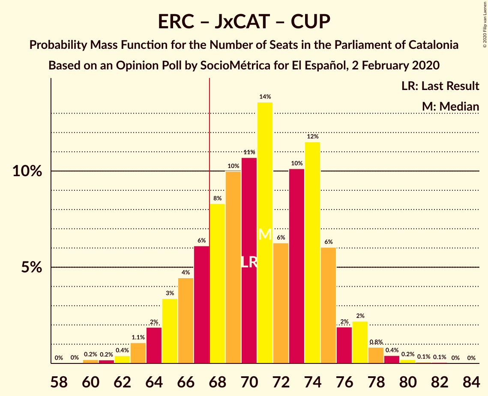
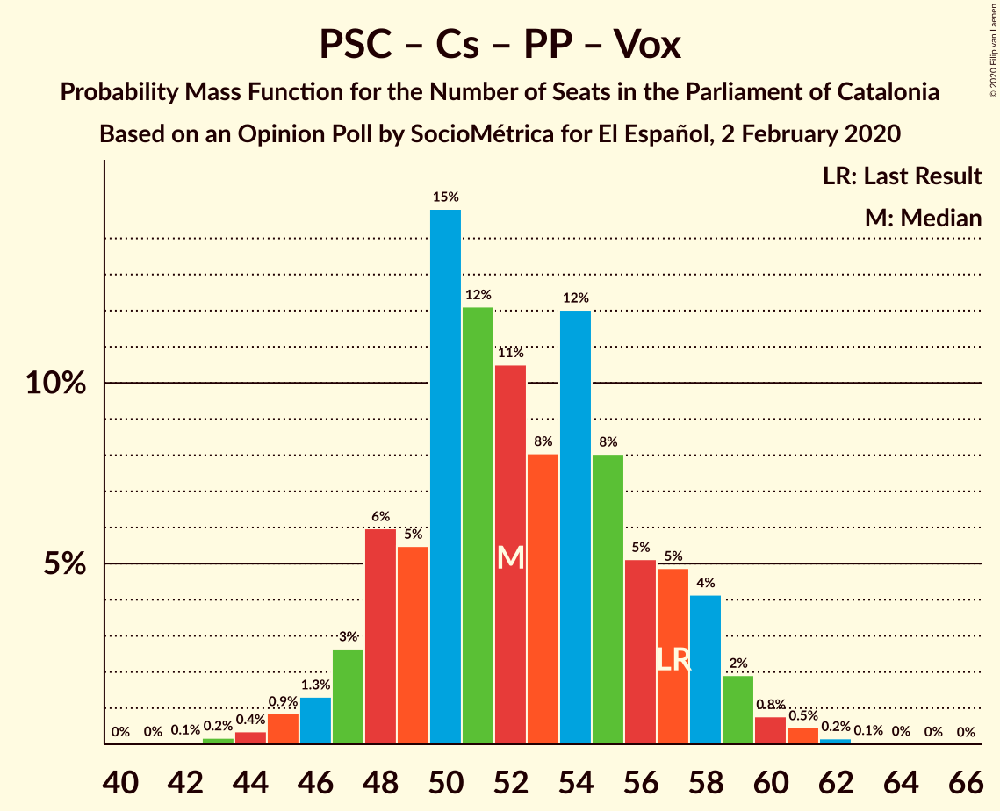

# Opinion Poll by SocioMétrica for El Español, 2 February 2020

<a href="#voting-intentions">Voting Intentions</a> | <a href="#seats">Seats</a> | <a href="#coalitions">Coalitions</a> | <a href="#technical-information">Technical Information</a>

## Voting Intentions

### Confidence Intervals

| Party | Last Result | Poll Result | 80% Confidence Interval | 90% Confidence Interval | 95% Confidence Interval | 99% Confidence Interval |
|:-----:|:-----------:|:-----------:|:-----------------------:|:-----------------------:|:-----------------------:|:-----------------------:|
| Esquerra Republicana–Catalunya Sí | 21.4% | 23.0% | 20.7–25.5% |20.1–26.3% |19.5–26.9% |18.5–28.2% |
| Partit dels Socialistes de Catalunya (PSC-PSOE) | 13.9% | 19.4% | 17.3–21.8% |16.7–22.5% |16.2–23.1% |15.2–24.3% |
| Junts per Catalunya | 21.7% | 18.6% | 16.5–21.0% |15.9–21.7% |15.4–22.3% |14.5–23.4% |
| Ciutadans–Partido de la Ciudadanía | 25.4% | 11.0% | 9.4–13.0% |8.9–13.5% |8.6–14.1% |7.8–15.1% |
| Catalunya en Comú–Podem | 7.5% | 10.0% | 8.5–11.9% |8.0–12.5% |7.7–13.0% |7.0–13.9% |
| Candidatura d’Unitat Popular | 4.5% | 6.2% | 5.0–7.8% |4.7–8.3% |4.4–8.7% |3.9–9.5% |
| Partit Popular | 4.2% | 6.2% | 5.0–7.8% |4.7–8.3% |4.4–8.7% |3.9–9.5% |
| Vox | 0.0% | 4.8% | 3.8–6.3% |3.5–6.7% |3.2–7.1% |2.8–7.8% |

*Note:* The poll result column reflects the actual value used in the calculations. Published results may vary slightly, and in addition be rounded to fewer digits.

## Seats

### Confidence Intervals

| Party | Last Result | Median | 80% Confidence Interval | 90% Confidence Interval | 95% Confidence Interval | 99% Confidence Interval |
|:-----:|:-----------:|:------:|:-----------------------:|:-----------------------:|:-----------------------:|:-----------------------:|
| <a href="#esquerra-republicana–catalunya-sí">Esquerra Republicana–Catalunya Sí</a> | 32 | 34 | 30–37 |29–39 |28–40 |27–42 |
| <a href="#partit-dels-socialistes-de-catalunya-(psc-psoe)">Partit dels Socialistes de Catalunya (PSC-PSOE)</a> | 17 | 25 | 23–29 |22–30 |21–31 |19–33 |
| <a href="#junts-per-catalunya">Junts per Catalunya</a> | 34 | 29 | 25–32 |25–33 |24–35 |22–37 |
| <a href="#ciutadans–partido-de-la-ciudadanía">Ciutadans–Partido de la Ciudadanía</a> | 36 | 14 | 12–17 |12–18 |11–18 |9–19 |
| <a href="#catalunya-en-comú–podem">Catalunya en Comú–Podem</a> | 8 | 12 | 9–14 |8–16 |8–16 |7–17 |
| <a href="#candidatura-d’unitat-popular">Candidatura d’Unitat Popular</a> | 4 | 8 | 7–10 |5–11 |4–11 |4–12 |
| <a href="#partit-popular">Partit Popular</a> | 4 | 7 | 5–10 |5–10 |5–11 |3–12 |
| <a href="#vox">Vox</a> | 0 | 5 | 3–7 |3–8 |2–9 |0–10 |

### Esquerra Republicana–Catalunya Sí

*For a full overview of the results for this party, see the [Esquerra Republicana–Catalunya Sí](party-esquerrarepublicana–catalunyasí.html) page.*

| Number of Seats | Probability | Accumulated | Special Marks |
|:---------------:|:-----------:|:-----------:|:-------------:|
| 24 | 0% | 100% |  |
| 25 | 0.1% | 99.9% |  |
| 26 | 0.2% | 99.9% |  |
| 27 | 0.7% | 99.7% |  |
| 28 | 3% | 98.9% |  |
| 29 | 4% | 96% |  |
| 30 | 7% | 92% |  |
| 31 | 9% | 86% |  |
| 32 | 12% | 77% | Last Result |
| 33 | 9% | 66% |  |
| 34 | 15% | 56% | Median |
| 35 | 16% | 41% |  |
| 36 | 10% | 25% |  |
| 37 | 5% | 15% |  |
| 38 | 4% | 10% |  |
| 39 | 2% | 6% |  |
| 40 | 2% | 3% |  |
| 41 | 1.2% | 2% |  |
| 42 | 0.3% | 0.5% |  |
| 43 | 0.2% | 0.2% |  |
| 44 | 0% | 0.1% |  |
| 45 | 0% | 0% |  |

### Partit dels Socialistes de Catalunya (PSC-PSOE)

*For a full overview of the results for this party, see the [Partit dels Socialistes de Catalunya (PSC-PSOE)](party-partitdelssocialistesdecatalunyapsc-psoe.html) page.*

| Number of Seats | Probability | Accumulated | Special Marks |
|:---------------:|:-----------:|:-----------:|:-------------:|
| 17 | 0.1% | 100% | Last Result |
| 18 | 0.2% | 99.9% |  |
| 19 | 0.4% | 99.7% |  |
| 20 | 0.9% | 99.2% |  |
| 21 | 2% | 98% |  |
| 22 | 5% | 96% |  |
| 23 | 7% | 91% |  |
| 24 | 15% | 84% |  |
| 25 | 29% | 70% | Median |
| 26 | 18% | 41% |  |
| 27 | 5% | 23% |  |
| 28 | 5% | 18% |  |
| 29 | 3% | 13% |  |
| 30 | 7% | 10% |  |
| 31 | 2% | 3% |  |
| 32 | 0.5% | 1.0% |  |
| 33 | 0.4% | 0.5% |  |
| 34 | 0.1% | 0.2% |  |
| 35 | 0% | 0% |  |

### Junts per Catalunya

*For a full overview of the results for this party, see the [Junts per Catalunya](party-juntspercatalunya.html) page.*

| Number of Seats | Probability | Accumulated | Special Marks |
|:---------------:|:-----------:|:-----------:|:-------------:|
| 20 | 0% | 100% |  |
| 21 | 0.2% | 99.9% |  |
| 22 | 0.3% | 99.8% |  |
| 23 | 2% | 99.4% |  |
| 24 | 3% | 98% |  |
| 25 | 9% | 95% |  |
| 26 | 11% | 86% |  |
| 27 | 6% | 75% |  |
| 28 | 10% | 69% |  |
| 29 | 9% | 59% | Median |
| 30 | 19% | 49% |  |
| 31 | 15% | 30% |  |
| 32 | 9% | 15% |  |
| 33 | 3% | 7% |  |
| 34 | 1.3% | 4% | Last Result |
| 35 | 1.0% | 3% |  |
| 36 | 1.0% | 2% |  |
| 37 | 0.4% | 0.5% |  |
| 38 | 0.1% | 0.1% |  |
| 39 | 0% | 0% |  |

### Ciutadans–Partido de la Ciudadanía

*For a full overview of the results for this party, see the [Ciutadans–Partido de la Ciudadanía](party-ciutadans–partidodelaciudadanía.html) page.*

| Number of Seats | Probability | Accumulated | Special Marks |
|:---------------:|:-----------:|:-----------:|:-------------:|
| 8 | 0.3% | 100% |  |
| 9 | 0.9% | 99.7% |  |
| 10 | 1.1% | 98.8% |  |
| 11 | 1.3% | 98% |  |
| 12 | 14% | 96% |  |
| 13 | 24% | 83% |  |
| 14 | 25% | 59% | Median |
| 15 | 11% | 34% |  |
| 16 | 7% | 23% |  |
| 17 | 6% | 15% |  |
| 18 | 8% | 10% |  |
| 19 | 2% | 2% |  |
| 20 | 0.3% | 0.4% |  |
| 21 | 0.1% | 0.1% |  |
| 22 | 0% | 0% |  |
| 23 | 0% | 0% |  |
| 24 | 0% | 0% |  |
| 25 | 0% | 0% |  |
| 26 | 0% | 0% |  |
| 27 | 0% | 0% |  |
| 28 | 0% | 0% |  |
| 29 | 0% | 0% |  |
| 30 | 0% | 0% |  |
| 31 | 0% | 0% |  |
| 32 | 0% | 0% |  |
| 33 | 0% | 0% |  |
| 34 | 0% | 0% |  |
| 35 | 0% | 0% |  |
| 36 | 0% | 0% | Last Result |

### Catalunya en Comú–Podem

*For a full overview of the results for this party, see the [Catalunya en Comú–Podem](party-catalunyaencomú–podem.html) page.*

| Number of Seats | Probability | Accumulated | Special Marks |
|:---------------:|:-----------:|:-----------:|:-------------:|
| 6 | 0.1% | 100% |  |
| 7 | 0.4% | 99.9% |  |
| 8 | 5% | 99.5% | Last Result |
| 9 | 5% | 95% |  |
| 10 | 9% | 89% |  |
| 11 | 29% | 81% |  |
| 12 | 15% | 52% | Median |
| 13 | 14% | 37% |  |
| 14 | 13% | 23% |  |
| 15 | 5% | 10% |  |
| 16 | 3% | 5% |  |
| 17 | 1.4% | 2% |  |
| 18 | 0.3% | 0.3% |  |
| 19 | 0% | 0% |  |

### Candidatura d’Unitat Popular

*For a full overview of the results for this party, see the [Candidatura d’Unitat Popular](party-candidaturad’unitatpopular.html) page.*

| Number of Seats | Probability | Accumulated | Special Marks |
|:---------------:|:-----------:|:-----------:|:-------------:|
| 2 | 0.1% | 100% |  |
| 3 | 0.2% | 99.9% |  |
| 4 | 4% | 99.7% | Last Result |
| 5 | 2% | 96% |  |
| 6 | 3% | 94% |  |
| 7 | 20% | 90% |  |
| 8 | 36% | 70% | Median |
| 9 | 23% | 34% |  |
| 10 | 6% | 12% |  |
| 11 | 5% | 6% |  |
| 12 | 0.6% | 0.9% |  |
| 13 | 0.2% | 0.4% |  |
| 14 | 0.1% | 0.2% |  |
| 15 | 0.1% | 0.1% |  |
| 16 | 0% | 0% |  |

### Partit Popular

*For a full overview of the results for this party, see the [Partit Popular](party-partitpopular.html) page.*

| Number of Seats | Probability | Accumulated | Special Marks |
|:---------------:|:-----------:|:-----------:|:-------------:|
| 3 | 1.2% | 100% |  |
| 4 | 1.3% | 98.8% | Last Result |
| 5 | 9% | 98% |  |
| 6 | 12% | 89% |  |
| 7 | 39% | 77% | Median |
| 8 | 6% | 38% |  |
| 9 | 21% | 32% |  |
| 10 | 7% | 11% |  |
| 11 | 2% | 4% |  |
| 12 | 1.2% | 2% |  |
| 13 | 0.2% | 0.3% |  |
| 14 | 0.1% | 0.1% |  |
| 15 | 0% | 0% |  |

### Vox

*For a full overview of the results for this party, see the [Vox](party-vox.html) page.*

| Number of Seats | Probability | Accumulated | Special Marks |
|:---------------:|:-----------:|:-----------:|:-------------:|
| 0 | 0.9% | 100% | Last Result |
| 1 | 0% | 99.1% |  |
| 2 | 2% | 99.1% |  |
| 3 | 15% | 97% |  |
| 4 | 15% | 82% |  |
| 5 | 27% | 67% | Median |
| 6 | 14% | 40% |  |
| 7 | 21% | 26% |  |
| 8 | 1.1% | 5% |  |
| 9 | 4% | 4% |  |
| 10 | 0.4% | 0.6% |  |
| 11 | 0.1% | 0.2% |  |
| 12 | 0% | 0% |  |

## Coalitions

### Confidence Intervals

| Coalition | Last Result | Median | Majority? | 80% Confidence Interval | 90% Confidence Interval | 95% Confidence Interval | 99% Confidence Interval |
|:---------:|:-----------:|:------:|:---------:|:-----------------------:|:-----------------------:|:-----------------------:|:-----------------------:|
| Esquerra Republicana–Catalunya Sí – Junts per Catalunya – Catalunya en Comú–Podem | 74 | 75 | 98% | 70–79 | 69–80 | 68–81 | 66–83 |
| Esquerra Republicana–Catalunya Sí – Partit dels Socialistes de Catalunya (PSC-PSOE) – Catalunya en Comú–Podem | 57 | 71 | 87% | 67–76 | 66–77 | 65–78 | 63–80 |
| Esquerra Republicana–Catalunya Sí – Junts per Catalunya – Candidatura d’Unitat Popular | 70 | 71 | 82% | 66–75 | 65–76 | 64–77 | 62–79 |
| Esquerra Republicana–Catalunya Sí – Junts per Catalunya | 66 | 63 | 6% | 58–67 | 57–68 | 56–69 | 54–71 |
| Partit dels Socialistes de Catalunya (PSC-PSOE) – Ciutadans–Partido de la Ciudadanía – Catalunya en Comú–Podem – Partit Popular | 65 | 59 | 0.7% | 55–64 | 54–65 | 53–66 | 51–68 |
| Partit dels Socialistes de Catalunya (PSC-PSOE) – Ciutadans–Partido de la Ciudadanía – Partit Popular – Vox | 57 | 52 | 0% | 48–57 | 47–58 | 46–59 | 44–61 |
| Partit dels Socialistes de Catalunya (PSC-PSOE) – Ciutadans–Partido de la Ciudadanía – Partit Popular | 57 | 47 | 0% | 44–51 | 43–52 | 41–53 | 39–56 |
| Esquerra Republicana–Catalunya Sí – Catalunya en Comú–Podem | 40 | 46 | 0% | 42–50 | 40–51 | 39–52 | 37–54 |

### Esquerra Republicana–Catalunya Sí – Junts per Catalunya – Catalunya en Comú–Podem

| Number of Seats | Probability | Accumulated | Special Marks |
|:---------------:|:-----------:|:-----------:|:-------------:|
| 64 | 0.1% | 100% |  |
| 65 | 0.2% | 99.9% |  |
| 66 | 0.4% | 99.7% |  |
| 67 | 1.2% | 99.3% |  |
| 68 | 2% | 98% | Majority |
| 69 | 4% | 96% |  |
| 70 | 4% | 93% |  |
| 71 | 5% | 88% |  |
| 72 | 10% | 83% |  |
| 73 | 10% | 73% |  |
| 74 | 10% | 63% | Last Result |
| 75 | 9% | 52% | Median |
| 76 | 16% | 44% |  |
| 77 | 9% | 28% |  |
| 78 | 8% | 19% |  |
| 79 | 5% | 11% |  |
| 80 | 2% | 6% |  |
| 81 | 2% | 4% |  |
| 82 | 0.9% | 2% |  |
| 83 | 0.3% | 0.6% |  |
| 84 | 0.2% | 0.3% |  |
| 85 | 0.1% | 0.1% |  |
| 86 | 0% | 0.1% |  |
| 87 | 0% | 0% |  |

### Esquerra Republicana–Catalunya Sí – Partit dels Socialistes de Catalunya (PSC-PSOE) – Catalunya en Comú–Podem

| Number of Seats | Probability | Accumulated | Special Marks |
|:---------------:|:-----------:|:-----------:|:-------------:|
| 57 | 0% | 100% | Last Result |
| 58 | 0% | 100% |  |
| 59 | 0% | 100% |  |
| 60 | 0% | 100% |  |
| 61 | 0.2% | 99.9% |  |
| 62 | 0.2% | 99.7% |  |
| 63 | 0.6% | 99.6% |  |
| 64 | 1.3% | 99.0% |  |
| 65 | 2% | 98% |  |
| 66 | 3% | 96% |  |
| 67 | 6% | 93% |  |
| 68 | 10% | 87% | Majority |
| 69 | 10% | 77% |  |
| 70 | 8% | 67% |  |
| 71 | 16% | 59% | Median |
| 72 | 10% | 44% |  |
| 73 | 11% | 34% |  |
| 74 | 6% | 23% |  |
| 75 | 6% | 17% |  |
| 76 | 4% | 11% |  |
| 77 | 3% | 7% |  |
| 78 | 2% | 3% |  |
| 79 | 0.7% | 2% |  |
| 80 | 0.4% | 0.8% |  |
| 81 | 0.3% | 0.4% |  |
| 82 | 0.1% | 0.1% |  |
| 83 | 0% | 0.1% |  |
| 84 | 0% | 0% |  |

### Esquerra Republicana–Catalunya Sí – Junts per Catalunya – Candidatura d’Unitat Popular

| Number of Seats | Probability | Accumulated | Special Marks |
|:---------------:|:-----------:|:-----------:|:-------------:|
| 60 | 0.2% | 100% |  |
| 61 | 0.2% | 99.8% |  |
| 62 | 0.4% | 99.6% |  |
| 63 | 1.1% | 99.2% |  |
| 64 | 2% | 98% |  |
| 65 | 3% | 96% |  |
| 66 | 4% | 93% |  |
| 67 | 6% | 88% |  |
| 68 | 8% | 82% | Majority |
| 69 | 10% | 74% |  |
| 70 | 11% | 64% | Last Result |
| 71 | 14% | 53% | Median |
| 72 | 6% | 40% |  |
| 73 | 10% | 33% |  |
| 74 | 12% | 23% |  |
| 75 | 6% | 12% |  |
| 76 | 2% | 6% |  |
| 77 | 2% | 4% |  |
| 78 | 0.8% | 2% |  |
| 79 | 0.4% | 0.8% |  |
| 80 | 0.2% | 0.4% |  |
| 81 | 0.1% | 0.1% |  |
| 82 | 0.1% | 0.1% |  |
| 83 | 0% | 0% |  |

### Esquerra Republicana–Catalunya Sí – Junts per Catalunya

| Number of Seats | Probability | Accumulated | Special Marks |
|:---------------:|:-----------:|:-----------:|:-------------:|
| 52 | 0.1% | 100% |  |
| 53 | 0.3% | 99.9% |  |
| 54 | 0.6% | 99.6% |  |
| 55 | 0.8% | 99.0% |  |
| 56 | 2% | 98% |  |
| 57 | 3% | 97% |  |
| 58 | 5% | 93% |  |
| 59 | 6% | 89% |  |
| 60 | 9% | 83% |  |
| 61 | 12% | 74% |  |
| 62 | 8% | 62% |  |
| 63 | 12% | 54% | Median |
| 64 | 12% | 42% |  |
| 65 | 10% | 30% |  |
| 66 | 9% | 20% | Last Result |
| 67 | 5% | 10% |  |
| 68 | 2% | 6% | Majority |
| 69 | 2% | 4% |  |
| 70 | 1.0% | 2% |  |
| 71 | 0.4% | 0.8% |  |
| 72 | 0.2% | 0.4% |  |
| 73 | 0.2% | 0.2% |  |
| 74 | 0% | 0% |  |

### Partit dels Socialistes de Catalunya (PSC-PSOE) – Ciutadans–Partido de la Ciudadanía – Catalunya en Comú–Podem – Partit Popular

| Number of Seats | Probability | Accumulated | Special Marks |
|:---------------:|:-----------:|:-----------:|:-------------:|
| 48 | 0% | 100% |  |
| 49 | 0.1% | 99.9% |  |
| 50 | 0.3% | 99.9% |  |
| 51 | 0.6% | 99.6% |  |
| 52 | 0.6% | 99.0% |  |
| 53 | 2% | 98% |  |
| 54 | 2% | 96% |  |
| 55 | 7% | 93% |  |
| 56 | 7% | 87% |  |
| 57 | 14% | 80% |  |
| 58 | 10% | 66% | Median |
| 59 | 11% | 55% |  |
| 60 | 11% | 44% |  |
| 61 | 9% | 33% |  |
| 62 | 10% | 24% |  |
| 63 | 4% | 15% |  |
| 64 | 4% | 10% |  |
| 65 | 3% | 6% | Last Result |
| 66 | 2% | 3% |  |
| 67 | 0.7% | 1.4% |  |
| 68 | 0.4% | 0.7% | Majority |
| 69 | 0.2% | 0.4% |  |
| 70 | 0.2% | 0.2% |  |
| 71 | 0% | 0% |  |

### Partit dels Socialistes de Catalunya (PSC-PSOE) – Ciutadans–Partido de la Ciudadanía – Partit Popular – Vox

| Number of Seats | Probability | Accumulated | Special Marks |
|:---------------:|:-----------:|:-----------:|:-------------:|
| 42 | 0.1% | 100% |  |
| 43 | 0.2% | 99.9% |  |
| 44 | 0.4% | 99.7% |  |
| 45 | 0.9% | 99.4% |  |
| 46 | 1.3% | 98.5% |  |
| 47 | 3% | 97% |  |
| 48 | 6% | 95% |  |
| 49 | 5% | 89% |  |
| 50 | 15% | 83% |  |
| 51 | 12% | 68% | Median |
| 52 | 11% | 56% |  |
| 53 | 8% | 46% |  |
| 54 | 12% | 38% |  |
| 55 | 8% | 26% |  |
| 56 | 5% | 18% |  |
| 57 | 5% | 12% | Last Result |
| 58 | 4% | 8% |  |
| 59 | 2% | 3% |  |
| 60 | 0.8% | 2% |  |
| 61 | 0.5% | 0.7% |  |
| 62 | 0.2% | 0.3% |  |
| 63 | 0.1% | 0.1% |  |
| 64 | 0% | 0.1% |  |
| 65 | 0% | 0% |  |

### Partit dels Socialistes de Catalunya (PSC-PSOE) – Ciutadans–Partido de la Ciudadanía – Partit Popular

| Number of Seats | Probability | Accumulated | Special Marks |
|:---------------:|:-----------:|:-----------:|:-------------:|
| 37 | 0.1% | 100% |  |
| 38 | 0.2% | 99.9% |  |
| 39 | 0.3% | 99.7% |  |
| 40 | 0.7% | 99.4% |  |
| 41 | 1.2% | 98.7% |  |
| 42 | 2% | 97% |  |
| 43 | 5% | 95% |  |
| 44 | 10% | 90% |  |
| 45 | 10% | 80% |  |
| 46 | 15% | 70% | Median |
| 47 | 12% | 56% |  |
| 48 | 12% | 43% |  |
| 49 | 7% | 31% |  |
| 50 | 9% | 24% |  |
| 51 | 7% | 15% |  |
| 52 | 4% | 9% |  |
| 53 | 2% | 4% |  |
| 54 | 1.1% | 2% |  |
| 55 | 0.4% | 0.9% |  |
| 56 | 0.2% | 0.5% |  |
| 57 | 0.1% | 0.3% | Last Result |
| 58 | 0.2% | 0.2% |  |
| 59 | 0% | 0% |  |

### Esquerra Republicana–Catalunya Sí – Catalunya en Comú–Podem

| Number of Seats | Probability | Accumulated | Special Marks |
|:---------------:|:-----------:|:-----------:|:-------------:|
| 36 | 0.1% | 100% |  |
| 37 | 0.4% | 99.8% |  |
| 38 | 0.6% | 99.5% |  |
| 39 | 2% | 98.8% |  |
| 40 | 3% | 97% | Last Result |
| 41 | 3% | 94% |  |
| 42 | 7% | 91% |  |
| 43 | 11% | 84% |  |
| 44 | 9% | 73% |  |
| 45 | 10% | 64% |  |
| 46 | 14% | 54% | Median |
| 47 | 12% | 39% |  |
| 48 | 7% | 27% |  |
| 49 | 7% | 20% |  |
| 50 | 4% | 12% |  |
| 51 | 4% | 8% |  |
| 52 | 2% | 4% |  |
| 53 | 1.0% | 2% |  |
| 54 | 0.4% | 0.9% |  |
| 55 | 0.3% | 0.4% |  |
| 56 | 0.1% | 0.2% |  |
| 57 | 0.1% | 0.1% |  |
| 58 | 0% | 0% |  |

## Technical Information

### Opinion Poll

+ **Polling firm:** SocioMétrica
+ **Commissioner(s):** El Español
+ **Fieldwork period:** 2 February 2020

### Calculations

+ **Sample size:** 500
+ **Simulations done:** 1,048,576
+ **Error estimate:** 0.96%

