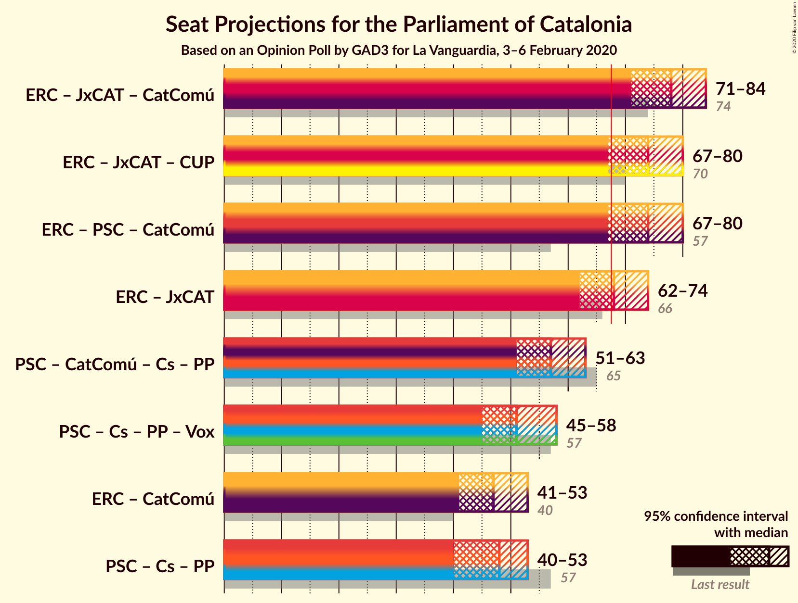
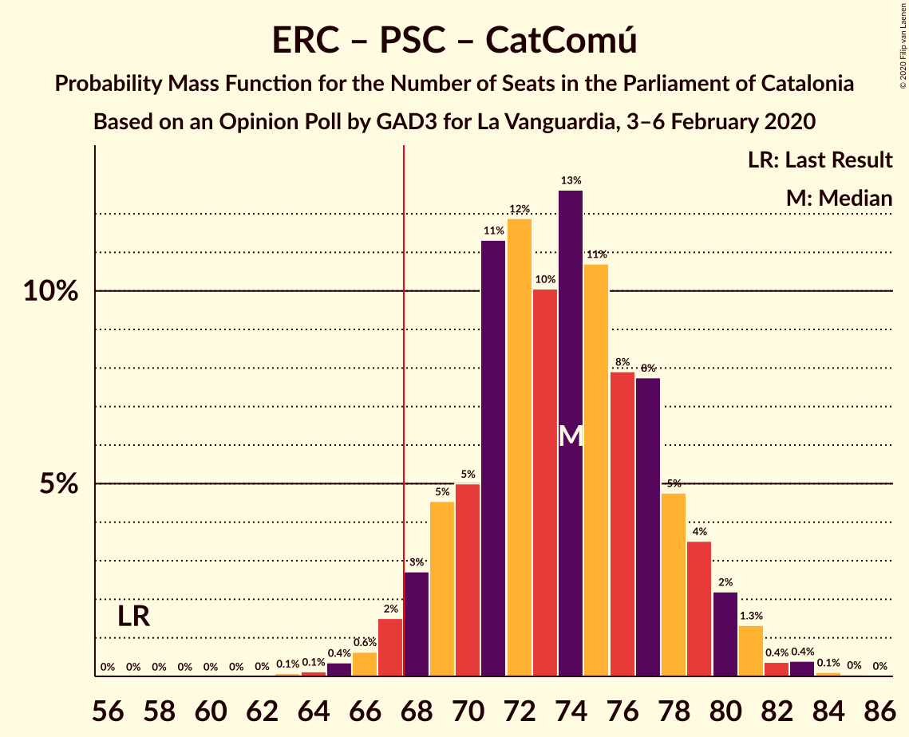

# Opinion Poll by GAD3 for La Vanguardia, 3–6 February 2020

<a href="#voting-intentions">Voting Intentions</a> | <a href="#seats">Seats</a> | <a href="#coalitions">Coalitions</a> | <a href="#technical-information">Technical Information</a>

## Voting Intentions

### Confidence Intervals

| Party | Last Result | Poll Result | 80% Confidence Interval | 90% Confidence Interval | 95% Confidence Interval | 99% Confidence Interval |
|:-----:|:-----------:|:-----------:|:-----------------------:|:-----------------------:|:-----------------------:|:-----------------------:|
| Esquerra Republicana–Catalunya Sí | 21.4% | 24.9% | 22.7–27.4% |22.1–28.0% |21.5–28.7% |20.5–29.8% |
| Partit dels Socialistes de Catalunya (PSC-PSOE) | 13.9% | 20.3% | 18.3–22.6% |17.7–23.3% |17.2–23.8% |16.3–25.0% |
| Junts per Catalunya | 21.7% | 19.8% | 17.8–22.1% |17.2–22.7% |16.7–23.3% |15.8–24.4% |
| Catalunya en Comú–Podem | 7.5% | 8.8% | 7.5–10.5% |7.1–11.0% |6.8–11.5% |6.2–12.3% |
| Ciutadans–Partido de la Ciudadanía | 25.4% | 8.5% | 7.1–10.2% |6.8–10.7% |6.4–11.1% |5.9–11.9% |
| Partit Popular | 4.2% | 6.7% | 5.5–8.3% |5.2–8.7% |4.9–9.1% |4.4–9.9% |
| Candidatura d’Unitat Popular | 4.5% | 5.1% | 4.1–6.5% |3.8–6.9% |3.6–7.3% |3.2–8.0% |
| Vox | 0.0% | 4.4% | 3.5–5.7% |3.2–6.1% |3.0–6.4% |2.6–7.1% |

*Note:* The poll result column reflects the actual value used in the calculations. Published results may vary slightly, and in addition be rounded to fewer digits.

## Seats

### Confidence Intervals

| Party | Last Result | Median | 80% Confidence Interval | 90% Confidence Interval | 95% Confidence Interval | 99% Confidence Interval |
|:-----:|:-----------:|:------:|:-----------------------:|:-----------------------:|:-----------------------:|:-----------------------:|
| <a href="#esquerra-republicana–catalunya-sí">Esquerra Republicana–Catalunya Sí</a> | 32 | 37 | 33–41 |32–42 |32–43 |30–44 |
| <a href="#partit-dels-socialistes-de-catalunya-(psc-psoe)">Partit dels Socialistes de Catalunya (PSC-PSOE)</a> | 17 | 26 | 24–30 |24–31 |23–32 |21–33 |
| <a href="#junts-per-catalunya">Junts per Catalunya</a> | 34 | 31 | 27–34 |26–36 |25–37 |24–38 |
| <a href="#catalunya-en-comú–podem">Catalunya en Comú–Podem</a> | 8 | 10 | 8–13 |7–14 |7–14 |6–16 |
| <a href="#ciutadans–partido-de-la-ciudadanía">Ciutadans–Partido de la Ciudadanía</a> | 36 | 13 | 8–14 |7–14 |6–14 |6–15 |
| <a href="#partit-popular">Partit Popular</a> | 4 | 9 | 7–10 |6–11 |5–12 |5–13 |
| <a href="#candidatura-d’unitat-popular">Candidatura d’Unitat Popular</a> | 4 | 6 | 4–8 |3–8 |3–9 |0–11 |
| <a href="#vox">Vox</a> | 0 | 4 | 3–7 |2–7 |0–7 |0–9 |

### Esquerra Republicana–Catalunya Sí

*For a full overview of the results for this party, see the [Esquerra Republicana–Catalunya Sí](party-esquerrarepublicana–catalunyasí.html) page.*

| Number of Seats | Probability | Accumulated | Special Marks |
|:---------------:|:-----------:|:-----------:|:-------------:|
| 28 | 0.1% | 100% |  |
| 29 | 0.2% | 99.9% |  |
| 30 | 0.6% | 99.7% |  |
| 31 | 1.4% | 99.1% |  |
| 32 | 3% | 98% | Last Result |
| 33 | 6% | 95% |  |
| 34 | 9% | 89% |  |
| 35 | 9% | 80% |  |
| 36 | 14% | 71% |  |
| 37 | 18% | 57% | Median |
| 38 | 13% | 39% |  |
| 39 | 9% | 26% |  |
| 40 | 6% | 16% |  |
| 41 | 6% | 11% |  |
| 42 | 3% | 5% |  |
| 43 | 2% | 3% |  |
| 44 | 0.8% | 1.2% |  |
| 45 | 0.2% | 0.4% |  |
| 46 | 0.1% | 0.2% |  |
| 47 | 0% | 0.1% |  |
| 48 | 0% | 0% |  |

### Partit dels Socialistes de Catalunya (PSC-PSOE)

*For a full overview of the results for this party, see the [Partit dels Socialistes de Catalunya (PSC-PSOE)](party-partitdelssocialistesdecatalunyapsc-psoe.html) page.*

| Number of Seats | Probability | Accumulated | Special Marks |
|:---------------:|:-----------:|:-----------:|:-------------:|
| 17 | 0% | 100% | Last Result |
| 18 | 0% | 100% |  |
| 19 | 0% | 100% |  |
| 20 | 0.2% | 99.9% |  |
| 21 | 0.4% | 99.7% |  |
| 22 | 0.7% | 99.3% |  |
| 23 | 2% | 98.6% |  |
| 24 | 8% | 96% |  |
| 25 | 17% | 89% |  |
| 26 | 25% | 71% | Median |
| 27 | 11% | 47% |  |
| 28 | 10% | 35% |  |
| 29 | 10% | 25% |  |
| 30 | 6% | 15% |  |
| 31 | 6% | 9% |  |
| 32 | 2% | 3% |  |
| 33 | 0.9% | 1.4% |  |
| 34 | 0.3% | 0.5% |  |
| 35 | 0.1% | 0.2% |  |
| 36 | 0% | 0.1% |  |
| 37 | 0% | 0% |  |

### Junts per Catalunya

*For a full overview of the results for this party, see the [Junts per Catalunya](party-juntspercatalunya.html) page.*

| Number of Seats | Probability | Accumulated | Special Marks |
|:---------------:|:-----------:|:-----------:|:-------------:|
| 23 | 0.2% | 100% |  |
| 24 | 0.6% | 99.8% |  |
| 25 | 2% | 99.1% |  |
| 26 | 4% | 97% |  |
| 27 | 4% | 93% |  |
| 28 | 6% | 89% |  |
| 29 | 11% | 84% |  |
| 30 | 13% | 73% |  |
| 31 | 22% | 60% | Median |
| 32 | 19% | 38% |  |
| 33 | 5% | 19% |  |
| 34 | 4% | 14% | Last Result |
| 35 | 3% | 10% |  |
| 36 | 4% | 7% |  |
| 37 | 2% | 3% |  |
| 38 | 0.5% | 0.7% |  |
| 39 | 0.2% | 0.2% |  |
| 40 | 0.1% | 0.1% |  |
| 41 | 0% | 0% |  |

### Catalunya en Comú–Podem

*For a full overview of the results for this party, see the [Catalunya en Comú–Podem](party-catalunyaencomú–podem.html) page.*

| Number of Seats | Probability | Accumulated | Special Marks |
|:---------------:|:-----------:|:-----------:|:-------------:|
| 5 | 0.4% | 100% |  |
| 6 | 1.3% | 99.5% |  |
| 7 | 5% | 98% |  |
| 8 | 22% | 93% | Last Result |
| 9 | 19% | 71% |  |
| 10 | 14% | 52% | Median |
| 11 | 20% | 38% |  |
| 12 | 7% | 18% |  |
| 13 | 6% | 11% |  |
| 14 | 4% | 6% |  |
| 15 | 0.5% | 1.2% |  |
| 16 | 0.5% | 0.7% |  |
| 17 | 0.2% | 0.2% |  |
| 18 | 0% | 0% |  |

### Ciutadans–Partido de la Ciudadanía

*For a full overview of the results for this party, see the [Ciutadans–Partido de la Ciudadanía](party-ciutadans–partidodelaciudadanía.html) page.*

| Number of Seats | Probability | Accumulated | Special Marks |
|:---------------:|:-----------:|:-----------:|:-------------:|
| 5 | 0.3% | 100% |  |
| 6 | 2% | 99.7% |  |
| 7 | 3% | 97% |  |
| 8 | 10% | 94% |  |
| 9 | 1.1% | 85% |  |
| 10 | 0.6% | 84% |  |
| 11 | 1.3% | 83% |  |
| 12 | 26% | 82% |  |
| 13 | 46% | 56% | Median |
| 14 | 9% | 10% |  |
| 15 | 0.7% | 0.9% |  |
| 16 | 0.2% | 0.2% |  |
| 17 | 0% | 0% |  |
| 18 | 0% | 0% |  |
| 19 | 0% | 0% |  |
| 20 | 0% | 0% |  |
| 21 | 0% | 0% |  |
| 22 | 0% | 0% |  |
| 23 | 0% | 0% |  |
| 24 | 0% | 0% |  |
| 25 | 0% | 0% |  |
| 26 | 0% | 0% |  |
| 27 | 0% | 0% |  |
| 28 | 0% | 0% |  |
| 29 | 0% | 0% |  |
| 30 | 0% | 0% |  |
| 31 | 0% | 0% |  |
| 32 | 0% | 0% |  |
| 33 | 0% | 0% |  |
| 34 | 0% | 0% |  |
| 35 | 0% | 0% |  |
| 36 | 0% | 0% | Last Result |

### Partit Popular

*For a full overview of the results for this party, see the [Partit Popular](party-partitpopular.html) page.*

| Number of Seats | Probability | Accumulated | Special Marks |
|:---------------:|:-----------:|:-----------:|:-------------:|
| 3 | 0.2% | 100% |  |
| 4 | 0.2% | 99.8% | Last Result |
| 5 | 4% | 99.7% |  |
| 6 | 5% | 96% |  |
| 7 | 31% | 91% |  |
| 8 | 8% | 60% |  |
| 9 | 30% | 52% | Median |
| 10 | 14% | 22% |  |
| 11 | 4% | 8% |  |
| 12 | 3% | 4% |  |
| 13 | 0.5% | 0.8% |  |
| 14 | 0.3% | 0.3% |  |
| 15 | 0% | 0% |  |

### Candidatura d’Unitat Popular

*For a full overview of the results for this party, see the [Candidatura d’Unitat Popular](party-candidaturad’unitatpopular.html) page.*

| Number of Seats | Probability | Accumulated | Special Marks |
|:---------------:|:-----------:|:-----------:|:-------------:|
| 0 | 0.7% | 100% |  |
| 1 | 0% | 99.3% |  |
| 2 | 2% | 99.3% |  |
| 3 | 6% | 98% |  |
| 4 | 22% | 92% | Last Result |
| 5 | 10% | 69% |  |
| 6 | 12% | 59% | Median |
| 7 | 24% | 47% |  |
| 8 | 19% | 23% |  |
| 9 | 3% | 4% |  |
| 10 | 0.5% | 1.1% |  |
| 11 | 0.5% | 0.6% |  |
| 12 | 0% | 0.1% |  |
| 13 | 0% | 0% |  |

### Vox

*For a full overview of the results for this party, see the [Vox](party-vox.html) page.*

| Number of Seats | Probability | Accumulated | Special Marks |
|:---------------:|:-----------:|:-----------:|:-------------:|
| 0 | 4% | 100% | Last Result |
| 1 | 0% | 96% |  |
| 2 | 6% | 96% |  |
| 3 | 31% | 90% |  |
| 4 | 12% | 59% | Median |
| 5 | 27% | 47% |  |
| 6 | 9% | 20% |  |
| 7 | 9% | 11% |  |
| 8 | 0.9% | 2% |  |
| 9 | 0.9% | 1.1% |  |
| 10 | 0.1% | 0.2% |  |
| 11 | 0.1% | 0.1% |  |
| 12 | 0% | 0% |  |

## Coalitions

### Confidence Intervals

| Coalition | Last Result | Median | Majority? | 80% Confidence Interval | 90% Confidence Interval | 95% Confidence Interval | 99% Confidence Interval |
|:---------:|:-----------:|:------:|:---------:|:-----------------------:|:-----------------------:|:-----------------------:|:-----------------------:|
| Esquerra Republicana–Catalunya Sí – Junts per Catalunya – Catalunya en Comú–Podem | 74 | 78 | 99.9% | 74–82 | 72–83 | 71–84 | 69–86 |
| Esquerra Republicana–Catalunya Sí – Junts per Catalunya – Candidatura d’Unitat Popular | 70 | 74 | 96% | 70–78 | 68–79 | 67–80 | 66–82 |
| Esquerra Republicana–Catalunya Sí – Partit dels Socialistes de Catalunya (PSC-PSOE) – Catalunya en Comú–Podem | 57 | 74 | 97% | 70–78 | 68–79 | 67–80 | 65–83 |
| Esquerra Republicana–Catalunya Sí – Junts per Catalunya | 66 | 68 | 51% | 64–72 | 63–73 | 62–74 | 60–76 |
| Partit dels Socialistes de Catalunya (PSC-PSOE) – Catalunya en Comú–Podem – Ciutadans–Partido de la Ciudadanía – Partit Popular | 65 | 57 | 0.1% | 53–61 | 52–62 | 51–63 | 49–66 |
| Partit dels Socialistes de Catalunya (PSC-PSOE) – Ciutadans–Partido de la Ciudadanía – Partit Popular – Vox | 57 | 51 | 0% | 47–56 | 46–57 | 45–58 | 43–60 |
| Esquerra Republicana–Catalunya Sí – Catalunya en Comú–Podem | 40 | 47 | 0% | 43–51 | 42–52 | 41–53 | 39–55 |
| Partit dels Socialistes de Catalunya (PSC-PSOE) – Ciutadans–Partido de la Ciudadanía – Partit Popular | 57 | 48 | 0% | 43–51 | 41–52 | 40–53 | 38–55 |

### Esquerra Republicana–Catalunya Sí – Junts per Catalunya – Catalunya en Comú–Podem

| Number of Seats | Probability | Accumulated | Special Marks |
|:---------------:|:-----------:|:-----------:|:-------------:|
| 67 | 0.1% | 100% |  |
| 68 | 0.2% | 99.9% | Majority |
| 69 | 0.3% | 99.7% |  |
| 70 | 0.8% | 99.4% |  |
| 71 | 1.5% | 98.6% |  |
| 72 | 4% | 97% |  |
| 73 | 3% | 94% |  |
| 74 | 7% | 91% | Last Result |
| 75 | 9% | 84% |  |
| 76 | 9% | 75% |  |
| 77 | 15% | 67% |  |
| 78 | 11% | 51% | Median |
| 79 | 12% | 40% |  |
| 80 | 8% | 28% |  |
| 81 | 10% | 20% |  |
| 82 | 5% | 10% |  |
| 83 | 3% | 6% |  |
| 84 | 1.2% | 3% |  |
| 85 | 0.9% | 2% |  |
| 86 | 0.5% | 0.8% |  |
| 87 | 0.2% | 0.3% |  |
| 88 | 0.1% | 0.1% |  |
| 89 | 0% | 0% |  |

### Esquerra Republicana–Catalunya Sí – Junts per Catalunya – Candidatura d’Unitat Popular

| Number of Seats | Probability | Accumulated | Special Marks |
|:---------------:|:-----------:|:-----------:|:-------------:|
| 63 | 0% | 100% |  |
| 64 | 0.1% | 99.9% |  |
| 65 | 0.3% | 99.8% |  |
| 66 | 0.5% | 99.5% |  |
| 67 | 3% | 99.0% |  |
| 68 | 2% | 96% | Majority |
| 69 | 4% | 94% |  |
| 70 | 9% | 90% | Last Result |
| 71 | 7% | 81% |  |
| 72 | 8% | 75% |  |
| 73 | 11% | 66% |  |
| 74 | 15% | 55% | Median |
| 75 | 10% | 40% |  |
| 76 | 11% | 30% |  |
| 77 | 7% | 19% |  |
| 78 | 6% | 12% |  |
| 79 | 3% | 6% |  |
| 80 | 2% | 3% |  |
| 81 | 0.8% | 1.4% |  |
| 82 | 0.3% | 0.6% |  |
| 83 | 0.1% | 0.2% |  |
| 84 | 0.1% | 0.1% |  |
| 85 | 0% | 0% |  |

### Esquerra Republicana–Catalunya Sí – Partit dels Socialistes de Catalunya (PSC-PSOE) – Catalunya en Comú–Podem

| Number of Seats | Probability | Accumulated | Special Marks |
|:---------------:|:-----------:|:-----------:|:-------------:|
| 57 | 0% | 100% | Last Result |
| 58 | 0% | 100% |  |
| 59 | 0% | 100% |  |
| 60 | 0% | 100% |  |
| 61 | 0% | 100% |  |
| 62 | 0% | 100% |  |
| 63 | 0.1% | 100% |  |
| 64 | 0.1% | 99.9% |  |
| 65 | 0.4% | 99.8% |  |
| 66 | 0.6% | 99.4% |  |
| 67 | 2% | 98.8% |  |
| 68 | 3% | 97% | Majority |
| 69 | 5% | 95% |  |
| 70 | 5% | 90% |  |
| 71 | 11% | 85% |  |
| 72 | 12% | 74% |  |
| 73 | 10% | 62% | Median |
| 74 | 13% | 52% |  |
| 75 | 11% | 39% |  |
| 76 | 8% | 28% |  |
| 77 | 8% | 21% |  |
| 78 | 5% | 13% |  |
| 79 | 4% | 8% |  |
| 80 | 2% | 4% |  |
| 81 | 1.3% | 2% |  |
| 82 | 0.4% | 1.0% |  |
| 83 | 0.4% | 0.6% |  |
| 84 | 0.1% | 0.2% |  |
| 85 | 0% | 0.1% |  |
| 86 | 0% | 0% |  |

### Esquerra Republicana–Catalunya Sí – Junts per Catalunya

| Number of Seats | Probability | Accumulated | Special Marks |
|:---------------:|:-----------:|:-----------:|:-------------:|
| 57 | 0% | 100% |  |
| 58 | 0.1% | 99.9% |  |
| 59 | 0.3% | 99.8% |  |
| 60 | 0.5% | 99.5% |  |
| 61 | 1.1% | 99.0% |  |
| 62 | 2% | 98% |  |
| 63 | 5% | 96% |  |
| 64 | 8% | 91% |  |
| 65 | 6% | 83% |  |
| 66 | 13% | 77% | Last Result |
| 67 | 13% | 64% |  |
| 68 | 8% | 51% | Median, Majority |
| 69 | 15% | 43% |  |
| 70 | 9% | 29% |  |
| 71 | 7% | 20% |  |
| 72 | 4% | 12% |  |
| 73 | 5% | 8% |  |
| 74 | 2% | 3% |  |
| 75 | 0.7% | 2% |  |
| 76 | 0.5% | 0.8% |  |
| 77 | 0.2% | 0.4% |  |
| 78 | 0.1% | 0.2% |  |
| 79 | 0% | 0.1% |  |
| 80 | 0% | 0% |  |

### Partit dels Socialistes de Catalunya (PSC-PSOE) – Catalunya en Comú–Podem – Ciutadans–Partido de la Ciudadanía – Partit Popular

| Number of Seats | Probability | Accumulated | Special Marks |
|:---------------:|:-----------:|:-----------:|:-------------:|
| 46 | 0.1% | 100% |  |
| 47 | 0.1% | 99.9% |  |
| 48 | 0.3% | 99.8% |  |
| 49 | 0.7% | 99.6% |  |
| 50 | 0.9% | 98.8% |  |
| 51 | 2% | 98% |  |
| 52 | 3% | 96% |  |
| 53 | 7% | 92% |  |
| 54 | 8% | 86% |  |
| 55 | 8% | 78% |  |
| 56 | 15% | 70% |  |
| 57 | 12% | 55% |  |
| 58 | 9% | 43% | Median |
| 59 | 9% | 34% |  |
| 60 | 10% | 24% |  |
| 61 | 6% | 15% |  |
| 62 | 4% | 9% |  |
| 63 | 3% | 5% |  |
| 64 | 0.9% | 2% |  |
| 65 | 0.5% | 1.1% | Last Result |
| 66 | 0.4% | 0.5% |  |
| 67 | 0.1% | 0.1% |  |
| 68 | 0% | 0.1% | Majority |
| 69 | 0% | 0% |  |

### Partit dels Socialistes de Catalunya (PSC-PSOE) – Ciutadans–Partido de la Ciudadanía – Partit Popular – Vox

| Number of Seats | Probability | Accumulated | Special Marks |
|:---------------:|:-----------:|:-----------:|:-------------:|
| 40 | 0.1% | 100% |  |
| 41 | 0.1% | 99.9% |  |
| 42 | 0.2% | 99.8% |  |
| 43 | 0.6% | 99.6% |  |
| 44 | 0.9% | 99.1% |  |
| 45 | 2% | 98% |  |
| 46 | 2% | 96% |  |
| 47 | 5% | 94% |  |
| 48 | 7% | 89% |  |
| 49 | 8% | 82% |  |
| 50 | 13% | 74% |  |
| 51 | 12% | 61% |  |
| 52 | 12% | 49% | Median |
| 53 | 12% | 37% |  |
| 54 | 10% | 25% |  |
| 55 | 4% | 15% |  |
| 56 | 4% | 11% |  |
| 57 | 3% | 7% | Last Result |
| 58 | 1.3% | 3% |  |
| 59 | 1.1% | 2% |  |
| 60 | 0.6% | 0.8% |  |
| 61 | 0.1% | 0.2% |  |
| 62 | 0% | 0.1% |  |
| 63 | 0% | 0% |  |

### Esquerra Republicana–Catalunya Sí – Catalunya en Comú–Podem

| Number of Seats | Probability | Accumulated | Special Marks |
|:---------------:|:-----------:|:-----------:|:-------------:|
| 37 | 0.1% | 100% |  |
| 38 | 0.1% | 99.9% |  |
| 39 | 0.5% | 99.7% |  |
| 40 | 2% | 99.2% | Last Result |
| 41 | 2% | 98% |  |
| 42 | 3% | 96% |  |
| 43 | 8% | 93% |  |
| 44 | 8% | 85% |  |
| 45 | 12% | 77% |  |
| 46 | 12% | 64% |  |
| 47 | 10% | 52% | Median |
| 48 | 12% | 42% |  |
| 49 | 12% | 31% |  |
| 50 | 7% | 19% |  |
| 51 | 5% | 11% |  |
| 52 | 3% | 6% |  |
| 53 | 1.3% | 3% |  |
| 54 | 0.8% | 2% |  |
| 55 | 0.5% | 1.0% |  |
| 56 | 0.3% | 0.4% |  |
| 57 | 0.1% | 0.2% |  |
| 58 | 0% | 0.1% |  |
| 59 | 0% | 0% |  |

### Partit dels Socialistes de Catalunya (PSC-PSOE) – Ciutadans–Partido de la Ciudadanía – Partit Popular

| Number of Seats | Probability | Accumulated | Special Marks |
|:---------------:|:-----------:|:-----------:|:-------------:|
| 36 | 0.1% | 100% |  |
| 37 | 0.3% | 99.9% |  |
| 38 | 0.6% | 99.6% |  |
| 39 | 1.2% | 99.0% |  |
| 40 | 2% | 98% |  |
| 41 | 3% | 96% |  |
| 42 | 3% | 93% |  |
| 43 | 4% | 90% |  |
| 44 | 5% | 86% |  |
| 45 | 9% | 81% |  |
| 46 | 12% | 72% |  |
| 47 | 10% | 60% |  |
| 48 | 14% | 50% | Median |
| 49 | 11% | 36% |  |
| 50 | 12% | 25% |  |
| 51 | 5% | 14% |  |
| 52 | 5% | 9% |  |
| 53 | 2% | 4% |  |
| 54 | 1.3% | 2% |  |
| 55 | 0.4% | 0.8% |  |
| 56 | 0.2% | 0.4% |  |
| 57 | 0.1% | 0.2% | Last Result |
| 58 | 0.1% | 0.1% |  |
| 59 | 0% | 0% |  |

## Technical Information

### Opinion Poll

+ **Polling firm:** GAD3
+ **Commissioner(s):** La Vanguardia
+ **Fieldwork period:** 3–6 February 2020

### Calculations

+ **Sample size:** 566
+ **Simulations done:** 1,048,576
+ **Error estimate:** 2.35%

