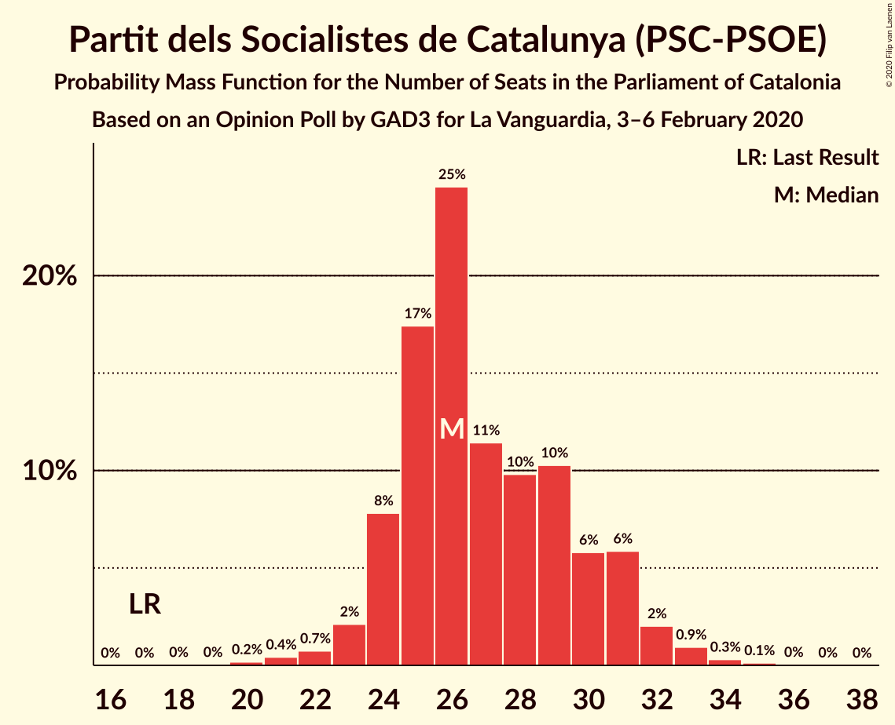
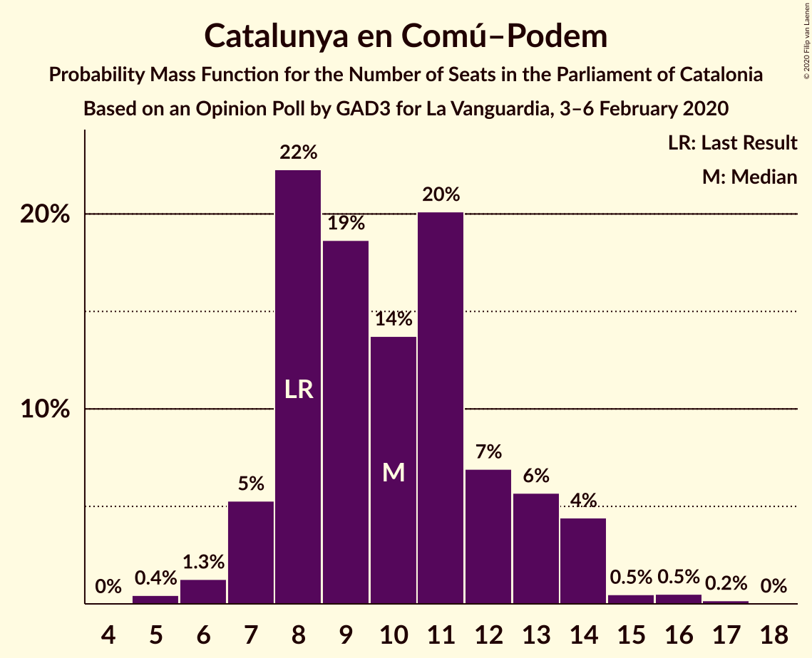
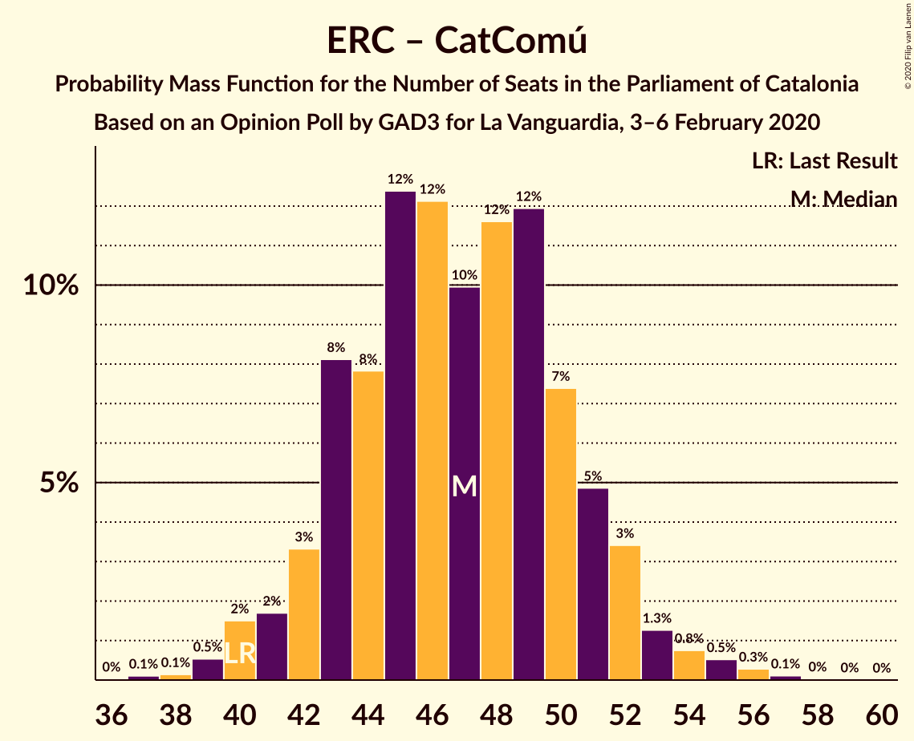

# Opinion Poll by GAD3 for La Vanguardia, 3–6 February 2020

<a href="#voting-intentions">Voting Intentions</a> | <a href="#seats">Seats</a> | <a href="#coalitions">Coalitions</a> | <a href="#technical-information">Technical Information</a>

## Voting Intentions

### Confidence Intervals

| Party | Last Result | Poll Result | 80% Confidence Interval | 90% Confidence Interval | 95% Confidence Interval | 99% Confidence Interval |
|:-----:|:-----------:|:-----------:|:-----------------------:|:-----------------------:|:-----------------------:|:-----------------------:|
| Esquerra Republicana–Catalunya Sí | 21.4% | 24.9% | 22.7–27.4% |22.1–28.0% |21.5–28.7% |20.5–29.8% |
| Partit dels Socialistes de Catalunya (PSC-PSOE) | 13.9% | 20.3% | 18.3–22.6% |17.7–23.3% |17.2–23.8% |16.3–25.0% |
| Junts pel Catalunya | 21.7% | 19.8% | 17.8–22.1% |17.2–22.7% |16.7–23.3% |15.8–24.4% |
| Catalunya en Comú–Podem | 7.5% | 8.8% | 7.5–10.5% |7.1–11.0% |6.8–11.5% |6.2–12.3% |
| Ciutadans–Partido de la Ciudadanía | 25.4% | 8.5% | 7.1–10.2% |6.8–10.7% |6.4–11.1% |5.9–11.9% |
| Partit Popular | 4.2% | 6.7% | 5.5–8.3% |5.2–8.7% |4.9–9.1% |4.4–9.9% |
| Candidatura d’Unitat Popular | 4.5% | 5.1% | 4.1–6.5% |3.8–6.9% |3.6–7.3% |3.2–8.0% |
| Vox | 0.0% | 4.4% | 3.5–5.7% |3.2–6.1% |3.0–6.4% |2.6–7.1% |

*Note:* The poll result column reflects the actual value used in the calculations. Published results may vary slightly, and in addition be rounded to fewer digits.

## Seats

### Confidence Intervals

| Party | Last Result | Median | 80% Confidence Interval | 90% Confidence Interval | 95% Confidence Interval | 99% Confidence Interval |
|:-----:|:-----------:|:------:|:-----------------------:|:-----------------------:|:-----------------------:|:-----------------------:|
| <a href="#esquerra-republicana–catalunya-sí">Esquerra Republicana–Catalunya Sí</a> | 32 | 37 | 34–40 |33–41 |32–41 |30–44 |
| <a href="#partit-dels-socialistes-de-catalunya-(psc-psoe)">Partit dels Socialistes de Catalunya (PSC-PSOE)</a> | 17 | 27 | 25–31 |24–31 |23–31 |22–33 |
| <a href="#junts-pel-catalunya">Junts pel Catalunya</a> | 34 | 31 | 27–34 |26–36 |25–36 |25–38 |
| <a href="#catalunya-en-comú–podem">Catalunya en Comú–Podem</a> | 8 | 10 | 8–13 |8–13 |7–14 |6–16 |
| <a href="#ciutadans–partido-de-la-ciudadanía">Ciutadans–Partido de la Ciudadanía</a> | 36 | 13 | 11–13 |8–13 |7–14 |6–14 |
| <a href="#partit-popular">Partit Popular</a> | 4 | 9 | 7–10 |6–11 |5–12 |5–12 |
| <a href="#candidatura-d’unitat-popular">Candidatura d’Unitat Popular</a> | 4 | 6 | 4–8 |3–8 |2–9 |0–10 |
| <a href="#vox">Vox</a> | 0 | 4 | 3–6 |2–7 |0–7 |0–9 |

### Esquerra Republicana–Catalunya Sí

*For a full overview of the results for this party, see the [Esquerra Republicana–Catalunya Sí](party-esquerrarepublicana–catalunyasí.html) page.*

| Number of Seats | Probability | Accumulated | Special Marks |
|:---------------:|:-----------:|:-----------:|:-------------:|
| 28 | 0.1% | 100% |  |
| 29 | 0.1% | 99.9% |  |
| 30 | 0.5% | 99.9% |  |
| 31 | 0.7% | 99.4% |  |
| 32 | 2% | 98.7% | Last Result |
| 33 | 5% | 97% |  |
| 34 | 18% | 92% |  |
| 35 | 8% | 74% |  |
| 36 | 14% | 67% |  |
| 37 | 27% | 53% | Median |
| 38 | 7% | 26% |  |
| 39 | 8% | 19% |  |
| 40 | 5% | 11% |  |
| 41 | 4% | 6% |  |
| 42 | 0.7% | 2% |  |
| 43 | 0.5% | 1.3% |  |
| 44 | 0.6% | 0.9% |  |
| 45 | 0.1% | 0.2% |  |
| 46 | 0.1% | 0.1% |  |
| 47 | 0% | 0% |  |

### Partit dels Socialistes de Catalunya (PSC-PSOE)

*For a full overview of the results for this party, see the [Partit dels Socialistes de Catalunya (PSC-PSOE)](party-partitdelssocialistesdecatalunyapsc-psoe.html) page.*

| Number of Seats | Probability | Accumulated | Special Marks |
|:---------------:|:-----------:|:-----------:|:-------------:|
| 17 | 0% | 100% | Last Result |
| 18 | 0% | 100% |  |
| 19 | 0% | 100% |  |
| 20 | 0.1% | 100% |  |
| 21 | 0.3% | 99.8% |  |
| 22 | 0.3% | 99.6% |  |
| 23 | 2% | 99.3% |  |
| 24 | 4% | 97% |  |
| 25 | 11% | 93% |  |
| 26 | 28% | 82% |  |
| 27 | 15% | 54% | Median |
| 28 | 12% | 39% |  |
| 29 | 13% | 27% |  |
| 30 | 3% | 14% |  |
| 31 | 9% | 11% |  |
| 32 | 2% | 2% |  |
| 33 | 0.3% | 0.7% |  |
| 34 | 0.3% | 0.4% |  |
| 35 | 0% | 0.1% |  |
| 36 | 0% | 0% |  |

### Junts pel Catalunya

*For a full overview of the results for this party, see the [Junts pel Catalunya](party-juntspelcatalunya.html) page.*

| Number of Seats | Probability | Accumulated | Special Marks |
|:---------------:|:-----------:|:-----------:|:-------------:|
| 23 | 0.1% | 100% |  |
| 24 | 0.2% | 99.8% |  |
| 25 | 3% | 99.6% |  |
| 26 | 4% | 97% |  |
| 27 | 3% | 93% |  |
| 28 | 7% | 90% |  |
| 29 | 23% | 83% |  |
| 30 | 6% | 60% |  |
| 31 | 20% | 54% | Median |
| 32 | 21% | 34% |  |
| 33 | 2% | 13% |  |
| 34 | 3% | 10% | Last Result |
| 35 | 1.4% | 7% |  |
| 36 | 3% | 6% |  |
| 37 | 1.5% | 2% |  |
| 38 | 0.6% | 0.9% |  |
| 39 | 0.1% | 0.3% |  |
| 40 | 0.1% | 0.1% |  |
| 41 | 0% | 0% |  |

### Catalunya en Comú–Podem

*For a full overview of the results for this party, see the [Catalunya en Comú–Podem](party-catalunyaencomú–podem.html) page.*

| Number of Seats | Probability | Accumulated | Special Marks |
|:---------------:|:-----------:|:-----------:|:-------------:|
| 5 | 0.2% | 100% |  |
| 6 | 0.7% | 99.8% |  |
| 7 | 4% | 99.1% |  |
| 8 | 14% | 95% | Last Result |
| 9 | 28% | 82% |  |
| 10 | 12% | 54% | Median |
| 11 | 22% | 42% |  |
| 12 | 9% | 20% |  |
| 13 | 8% | 11% |  |
| 14 | 3% | 4% |  |
| 15 | 0.4% | 1.1% |  |
| 16 | 0.5% | 0.7% |  |
| 17 | 0.1% | 0.1% |  |
| 18 | 0% | 0% |  |

### Ciutadans–Partido de la Ciudadanía

*For a full overview of the results for this party, see the [Ciutadans–Partido de la Ciudadanía](party-ciutadans–partidodelaciudadanía.html) page.*

| Number of Seats | Probability | Accumulated | Special Marks |
|:---------------:|:-----------:|:-----------:|:-------------:|
| 5 | 0.2% | 100% |  |
| 6 | 2% | 99.8% |  |
| 7 | 3% | 98% |  |
| 8 | 4% | 95% |  |
| 9 | 0.5% | 92% |  |
| 10 | 0.7% | 91% |  |
| 11 | 3% | 91% |  |
| 12 | 25% | 88% |  |
| 13 | 58% | 63% | Median |
| 14 | 4% | 4% |  |
| 15 | 0.2% | 0.3% |  |
| 16 | 0% | 0.1% |  |
| 17 | 0% | 0% |  |
| 18 | 0% | 0% |  |
| 19 | 0% | 0% |  |
| 20 | 0% | 0% |  |
| 21 | 0% | 0% |  |
| 22 | 0% | 0% |  |
| 23 | 0% | 0% |  |
| 24 | 0% | 0% |  |
| 25 | 0% | 0% |  |
| 26 | 0% | 0% |  |
| 27 | 0% | 0% |  |
| 28 | 0% | 0% |  |
| 29 | 0% | 0% |  |
| 30 | 0% | 0% |  |
| 31 | 0% | 0% |  |
| 32 | 0% | 0% |  |
| 33 | 0% | 0% |  |
| 34 | 0% | 0% |  |
| 35 | 0% | 0% |  |
| 36 | 0% | 0% | Last Result |

### Partit Popular

*For a full overview of the results for this party, see the [Partit Popular](party-partitpopular.html) page.*

| Number of Seats | Probability | Accumulated | Special Marks |
|:---------------:|:-----------:|:-----------:|:-------------:|
| 3 | 0.1% | 100% |  |
| 4 | 0.1% | 99.9% | Last Result |
| 5 | 2% | 99.9% |  |
| 6 | 5% | 97% |  |
| 7 | 10% | 93% |  |
| 8 | 10% | 83% |  |
| 9 | 53% | 73% | Median |
| 10 | 14% | 20% |  |
| 11 | 1.0% | 5% |  |
| 12 | 4% | 4% |  |
| 13 | 0.1% | 0.2% |  |
| 14 | 0.1% | 0.1% |  |
| 15 | 0% | 0% |  |

### Candidatura d’Unitat Popular

*For a full overview of the results for this party, see the [Candidatura d’Unitat Popular](party-candidaturad’unitatpopular.html) page.*

| Number of Seats | Probability | Accumulated | Special Marks |
|:---------------:|:-----------:|:-----------:|:-------------:|
| 0 | 0.5% | 100% |  |
| 1 | 0% | 99.5% |  |
| 2 | 3% | 99.5% |  |
| 3 | 6% | 97% |  |
| 4 | 26% | 91% | Last Result |
| 5 | 5% | 64% |  |
| 6 | 17% | 59% | Median |
| 7 | 27% | 42% |  |
| 8 | 12% | 15% |  |
| 9 | 2% | 3% |  |
| 10 | 0.6% | 0.9% |  |
| 11 | 0.3% | 0.4% |  |
| 12 | 0% | 0% |  |

### Vox

*For a full overview of the results for this party, see the [Vox](party-vox.html) page.*

| Number of Seats | Probability | Accumulated | Special Marks |
|:---------------:|:-----------:|:-----------:|:-------------:|
| 0 | 4% | 100% | Last Result |
| 1 | 0% | 96% |  |
| 2 | 6% | 96% |  |
| 3 | 31% | 90% |  |
| 4 | 19% | 59% | Median |
| 5 | 26% | 40% |  |
| 6 | 7% | 14% |  |
| 7 | 6% | 8% |  |
| 8 | 0.7% | 1.5% |  |
| 9 | 0.6% | 0.8% |  |
| 10 | 0.1% | 0.1% |  |
| 11 | 0.1% | 0.1% |  |
| 12 | 0% | 0% |  |

## Coalitions

### Confidence Intervals

| Coalition | Last Result | Median | Majority? | 80% Confidence Interval | 90% Confidence Interval | 95% Confidence Interval | 99% Confidence Interval |
|:---------:|:-----------:|:------:|:---------:|:-----------------------:|:-----------------------:|:-----------------------:|:-----------------------:|
| Esquerra Republicana–Catalunya Sí – Junts pel Catalunya – Catalunya en Comú–Podem | 74 | 77 | 99.9% | 74–81 | 72–82 | 72–83 | 70–85 |
| Esquerra Republicana–Catalunya Sí – Partit dels Socialistes de Catalunya (PSC-PSOE) – Catalunya en Comú–Podem | 57 | 74 | 98% | 70–78 | 68–80 | 68–80 | 65–83 |
| Esquerra Republicana–Catalunya Sí – Junts pel Catalunya – Candidatura d’Unitat Popular | 70 | 73 | 98.7% | 70–77 | 68–78 | 68–79 | 67–81 |
| Esquerra Republicana–Catalunya Sí – Junts pel Catalunya | 66 | 66 | 32% | 64–71 | 64–72 | 62–73 | 60–75 |
| Partit dels Socialistes de Catalunya (PSC-PSOE) – Catalunya en Comú–Podem – Ciutadans–Partido de la Ciudadanía – Partit Popular | 65 | 59 | 0% | 54–61 | 53–61 | 52–61 | 49–64 |
| Partit dels Socialistes de Catalunya (PSC-PSOE) – Ciutadans–Partido de la Ciudadanía – Partit Popular – Vox | 57 | 52 | 0% | 49–56 | 47–57 | 46–57 | 44–59 |
| Esquerra Republicana–Catalunya Sí – Catalunya en Comú–Podem | 40 | 47 | 0% | 43–50 | 42–52 | 42–52 | 39–55 |
| Partit dels Socialistes de Catalunya (PSC-PSOE) – Ciutadans–Partido de la Ciudadanía – Partit Popular | 57 | 49 | 0% | 45–51 | 42–52 | 40–52 | 38–53 |

### Esquerra Republicana–Catalunya Sí – Junts pel Catalunya – Catalunya en Comú–Podem

| Number of Seats | Probability | Accumulated | Special Marks |
|:---------------:|:-----------:|:-----------:|:-------------:|
| 67 | 0% | 100% |  |
| 68 | 0.1% | 99.9% | Majority |
| 69 | 0.1% | 99.9% |  |
| 70 | 1.1% | 99.7% |  |
| 71 | 0.6% | 98.6% |  |
| 72 | 4% | 98% |  |
| 73 | 1.4% | 94% |  |
| 74 | 4% | 93% | Last Result |
| 75 | 18% | 88% |  |
| 76 | 14% | 70% |  |
| 77 | 19% | 56% |  |
| 78 | 9% | 37% | Median |
| 79 | 12% | 28% |  |
| 80 | 4% | 16% |  |
| 81 | 5% | 12% |  |
| 82 | 3% | 7% |  |
| 83 | 2% | 4% |  |
| 84 | 0.6% | 2% |  |
| 85 | 0.6% | 1.0% |  |
| 86 | 0.3% | 0.4% |  |
| 87 | 0.1% | 0.1% |  |
| 88 | 0% | 0.1% |  |
| 89 | 0% | 0% |  |

### Esquerra Republicana–Catalunya Sí – Partit dels Socialistes de Catalunya (PSC-PSOE) – Catalunya en Comú–Podem

| Number of Seats | Probability | Accumulated | Special Marks |
|:---------------:|:-----------:|:-----------:|:-------------:|
| 57 | 0% | 100% | Last Result |
| 58 | 0% | 100% |  |
| 59 | 0% | 100% |  |
| 60 | 0% | 100% |  |
| 61 | 0% | 100% |  |
| 62 | 0% | 100% |  |
| 63 | 0.1% | 100% |  |
| 64 | 0.2% | 99.9% |  |
| 65 | 0.2% | 99.7% |  |
| 66 | 0.4% | 99.5% |  |
| 67 | 0.8% | 99.0% |  |
| 68 | 4% | 98% | Majority |
| 69 | 2% | 94% |  |
| 70 | 5% | 92% |  |
| 71 | 11% | 87% |  |
| 72 | 11% | 77% |  |
| 73 | 12% | 66% |  |
| 74 | 16% | 54% | Median |
| 75 | 17% | 38% |  |
| 76 | 2% | 21% |  |
| 77 | 6% | 19% |  |
| 78 | 4% | 13% |  |
| 79 | 3% | 9% |  |
| 80 | 4% | 6% |  |
| 81 | 0.4% | 1.5% |  |
| 82 | 0.2% | 1.1% |  |
| 83 | 0.7% | 0.8% |  |
| 84 | 0.1% | 0.1% |  |
| 85 | 0% | 0% |  |

### Esquerra Republicana–Catalunya Sí – Junts pel Catalunya – Candidatura d’Unitat Popular

| Number of Seats | Probability | Accumulated | Special Marks |
|:---------------:|:-----------:|:-----------:|:-------------:|
| 64 | 0% | 100% |  |
| 65 | 0% | 99.9% |  |
| 66 | 0.4% | 99.9% |  |
| 67 | 0.8% | 99.5% |  |
| 68 | 5% | 98.7% | Majority |
| 69 | 2% | 94% |  |
| 70 | 22% | 92% | Last Result |
| 71 | 7% | 70% |  |
| 72 | 9% | 63% |  |
| 73 | 15% | 53% |  |
| 74 | 16% | 38% | Median |
| 75 | 8% | 23% |  |
| 76 | 3% | 14% |  |
| 77 | 5% | 11% |  |
| 78 | 2% | 6% |  |
| 79 | 2% | 4% |  |
| 80 | 0.8% | 1.5% |  |
| 81 | 0.4% | 0.7% |  |
| 82 | 0.2% | 0.3% |  |
| 83 | 0.1% | 0.1% |  |
| 84 | 0% | 0.1% |  |
| 85 | 0% | 0% |  |

### Esquerra Republicana–Catalunya Sí – Junts pel Catalunya

| Number of Seats | Probability | Accumulated | Special Marks |
|:---------------:|:-----------:|:-----------:|:-------------:|
| 58 | 0% | 100% |  |
| 59 | 0.2% | 99.9% |  |
| 60 | 0.4% | 99.7% |  |
| 61 | 0.5% | 99.4% |  |
| 62 | 2% | 98.8% |  |
| 63 | 2% | 97% |  |
| 64 | 8% | 95% |  |
| 65 | 9% | 87% |  |
| 66 | 34% | 78% | Last Result |
| 67 | 12% | 44% |  |
| 68 | 6% | 32% | Median, Majority |
| 69 | 7% | 25% |  |
| 70 | 8% | 18% |  |
| 71 | 4% | 10% |  |
| 72 | 3% | 6% |  |
| 73 | 0.4% | 3% |  |
| 74 | 2% | 2% |  |
| 75 | 0.6% | 0.9% |  |
| 76 | 0.1% | 0.3% |  |
| 77 | 0.1% | 0.2% |  |
| 78 | 0% | 0.1% |  |
| 79 | 0% | 0% |  |

### Partit dels Socialistes de Catalunya (PSC-PSOE) – Catalunya en Comú–Podem – Ciutadans–Partido de la Ciudadanía – Partit Popular

| Number of Seats | Probability | Accumulated | Special Marks |
|:---------------:|:-----------:|:-----------:|:-------------:|
| 47 | 0% | 100% |  |
| 48 | 0.2% | 99.9% |  |
| 49 | 0.7% | 99.7% |  |
| 50 | 0.2% | 99.1% |  |
| 51 | 1.3% | 98.9% |  |
| 52 | 0.8% | 98% |  |
| 53 | 3% | 97% |  |
| 54 | 4% | 93% |  |
| 55 | 5% | 89% |  |
| 56 | 4% | 84% |  |
| 57 | 9% | 80% |  |
| 58 | 13% | 71% |  |
| 59 | 22% | 59% | Median |
| 60 | 23% | 37% |  |
| 61 | 12% | 14% |  |
| 62 | 0.8% | 2% |  |
| 63 | 0.7% | 1.4% |  |
| 64 | 0.4% | 0.7% |  |
| 65 | 0.2% | 0.4% | Last Result |
| 66 | 0.1% | 0.2% |  |
| 67 | 0% | 0.1% |  |
| 68 | 0% | 0% | Majority |

### Partit dels Socialistes de Catalunya (PSC-PSOE) – Ciutadans–Partido de la Ciudadanía – Partit Popular – Vox

| Number of Seats | Probability | Accumulated | Special Marks |
|:---------------:|:-----------:|:-----------:|:-------------:|
| 41 | 0% | 100% |  |
| 42 | 0.1% | 99.9% |  |
| 43 | 0.3% | 99.9% |  |
| 44 | 0.6% | 99.6% |  |
| 45 | 1.3% | 99.0% |  |
| 46 | 2% | 98% |  |
| 47 | 1.1% | 96% |  |
| 48 | 4% | 95% |  |
| 49 | 6% | 91% |  |
| 50 | 7% | 85% |  |
| 51 | 8% | 77% |  |
| 52 | 25% | 69% |  |
| 53 | 11% | 44% | Median |
| 54 | 20% | 33% |  |
| 55 | 1.5% | 13% |  |
| 56 | 2% | 12% |  |
| 57 | 8% | 9% | Last Result |
| 58 | 0.4% | 1.0% |  |
| 59 | 0.4% | 0.6% |  |
| 60 | 0.1% | 0.2% |  |
| 61 | 0.1% | 0.1% |  |
| 62 | 0% | 0% |  |

### Esquerra Republicana–Catalunya Sí – Catalunya en Comú–Podem

| Number of Seats | Probability | Accumulated | Special Marks |
|:---------------:|:-----------:|:-----------:|:-------------:|
| 37 | 0.1% | 100% |  |
| 38 | 0.1% | 99.9% |  |
| 39 | 0.3% | 99.8% |  |
| 40 | 0.5% | 99.5% | Last Result |
| 41 | 0.9% | 99.0% |  |
| 42 | 4% | 98% |  |
| 43 | 11% | 94% |  |
| 44 | 8% | 83% |  |
| 45 | 15% | 75% |  |
| 46 | 8% | 60% |  |
| 47 | 10% | 52% | Median |
| 48 | 20% | 43% |  |
| 49 | 9% | 23% |  |
| 50 | 6% | 14% |  |
| 51 | 3% | 8% |  |
| 52 | 3% | 5% |  |
| 53 | 0.7% | 2% |  |
| 54 | 0.5% | 1.1% |  |
| 55 | 0.4% | 0.6% |  |
| 56 | 0.2% | 0.2% |  |
| 57 | 0% | 0.1% |  |
| 58 | 0% | 0% |  |

### Partit dels Socialistes de Catalunya (PSC-PSOE) – Ciutadans–Partido de la Ciudadanía – Partit Popular

| Number of Seats | Probability | Accumulated | Special Marks |
|:---------------:|:-----------:|:-----------:|:-------------:|
| 36 | 0.1% | 100% |  |
| 37 | 0.1% | 99.9% |  |
| 38 | 0.4% | 99.9% |  |
| 39 | 0.8% | 99.5% |  |
| 40 | 1.3% | 98.7% |  |
| 41 | 1.5% | 97% |  |
| 42 | 1.2% | 96% |  |
| 43 | 2% | 95% |  |
| 44 | 3% | 93% |  |
| 45 | 3% | 90% |  |
| 46 | 6% | 88% |  |
| 47 | 6% | 82% |  |
| 48 | 21% | 76% |  |
| 49 | 28% | 55% | Median |
| 50 | 15% | 28% |  |
| 51 | 7% | 12% |  |
| 52 | 5% | 5% |  |
| 53 | 0.3% | 0.6% |  |
| 54 | 0.1% | 0.3% |  |
| 55 | 0.1% | 0.2% |  |
| 56 | 0.1% | 0.1% |  |
| 57 | 0% | 0.1% | Last Result |
| 58 | 0% | 0% |  |

## Technical Information

### Opinion Poll

+ **Polling firm:** GAD3
+ **Commissioner(s):** La Vanguardia
+ **Fieldwork period:** 3–6 February 2020

### Calculations

+ **Sample size:** 566
+ **Simulations done:** 131,072
+ **Error estimate:** 1.27%

