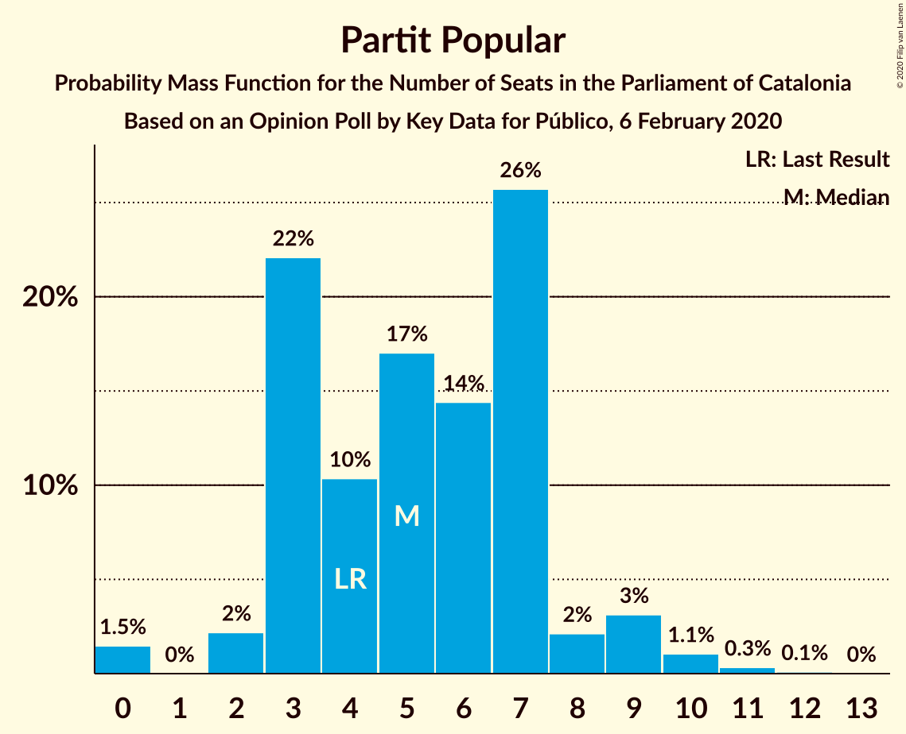
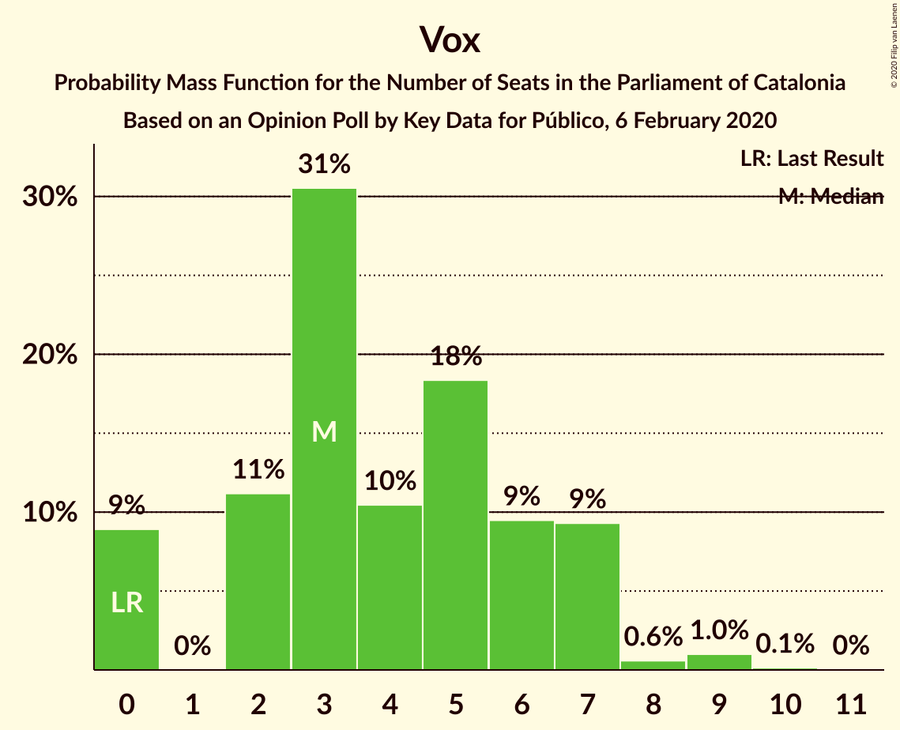
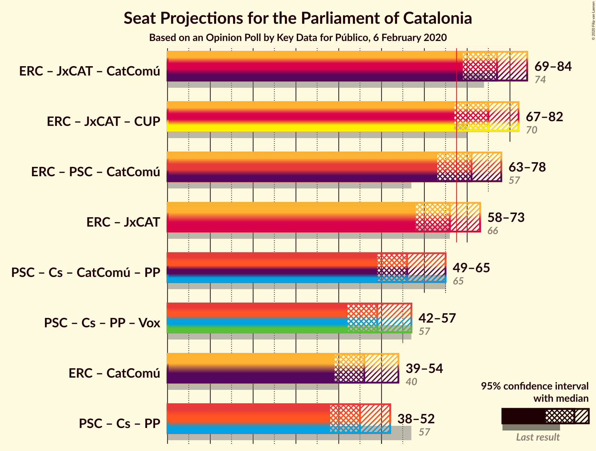
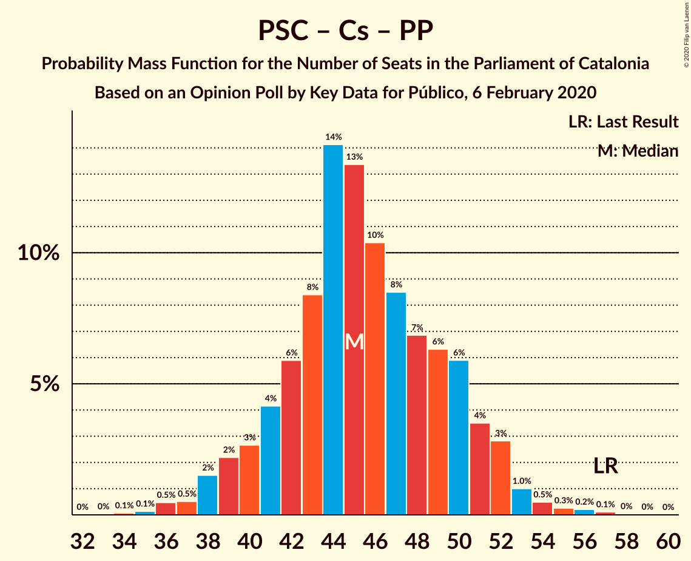

# Opinion Poll by Key Data for Público, 6 February 2020

<a href="#voting-intentions">Voting Intentions</a> | <a href="#seats">Seats</a> | <a href="#coalitions">Coalitions</a> | <a href="#technical-information">Technical Information</a>

## Voting Intentions

### Confidence Intervals

| Party | Last Result | Poll Result | 80% Confidence Interval | 90% Confidence Interval | 95% Confidence Interval | 99% Confidence Interval |
|:-----:|:-----------:|:-----------:|:-----------------------:|:-----------------------:|:-----------------------:|:-----------------------:|
| Esquerra Republicana–Catalunya Sí | 21.4% | 23.7% | 21.2–26.6% |20.4–27.4% |19.8–28.1% |18.6–29.5% |
| Junts per Catalunya | 21.7% | 19.0% | 16.7–21.7% |16.0–22.5% |15.5–23.1% |14.4–24.5% |
| Partit dels Socialistes de Catalunya (PSC-PSOE) | 13.9% | 18.0% | 15.8–20.7% |15.1–21.4% |14.6–22.1% |13.6–23.4% |
| Ciutadans–Partido de la Ciudadanía | 25.4% | 12.1% | 10.2–14.4% |9.7–15.1% |9.3–15.7% |8.4–16.8% |
| Catalunya en Comú–Podem | 7.5% | 9.1% | 7.5–11.2% |7.1–11.8% |6.7–12.3% |6.0–13.4% |
| Candidatura d’Unitat Popular | 4.5% | 6.9% | 5.5–8.8% |5.2–9.3% |4.8–9.8% |4.2–10.8% |
| Partit Popular | 4.2% | 4.7% | 3.6–6.3% |3.3–6.8% |3.0–7.2% |2.6–8.1% |
| Vox | 0.0% | 4.0% | 3.0–5.5% |2.7–5.9% |2.5–6.3% |2.0–7.1% |

*Note:* The poll result column reflects the actual value used in the calculations. Published results may vary slightly, and in addition be rounded to fewer digits.

## Seats

### Confidence Intervals

| Party | Last Result | Median | 80% Confidence Interval | 90% Confidence Interval | 95% Confidence Interval | 99% Confidence Interval |
|:-----:|:-----------:|:------:|:-----------------------:|:-----------------------:|:-----------------------:|:-----------------------:|
| <a href="#esquerra-republicana–catalunya-sí">Esquerra Republicana–Catalunya Sí</a> | 32 | 35 | 31–40 |30–41 |29–42 |27–45 |
| <a href="#junts-per-catalunya">Junts per Catalunya</a> | 34 | 30 | 26–34 |25–36 |24–37 |23–38 |
| <a href="#partit-dels-socialistes-de-catalunya-(psc-psoe)">Partit dels Socialistes de Catalunya (PSC-PSOE)</a> | 17 | 24 | 21–27 |19–29 |18–30 |17–32 |
| <a href="#ciutadans–partido-de-la-ciudadanía">Ciutadans–Partido de la Ciudadanía</a> | 36 | 16 | 13–19 |13–20 |12–21 |11–23 |
| <a href="#catalunya-en-comú–podem">Catalunya en Comú–Podem</a> | 8 | 11 | 8–14 |8–15 |7–16 |6–17 |
| <a href="#candidatura-d’unitat-popular">Candidatura d’Unitat Popular</a> | 4 | 9 | 7–11 |7–12 |6–14 |4–15 |
| <a href="#partit-popular">Partit Popular</a> | 4 | 5 | 3–7 |3–8 |2–9 |0–10 |
| <a href="#vox">Vox</a> | 0 | 3 | 2–7 |0–7 |0–7 |0–9 |

### Esquerra Republicana–Catalunya Sí

*For a full overview of the results for this party, see the [Esquerra Republicana–Catalunya Sí](party-esquerrarepublicana–catalunyasí.html) page.*

| Number of Seats | Probability | Accumulated | Special Marks |
|:---------------:|:-----------:|:-----------:|:-------------:|
| 26 | 0.2% | 100% |  |
| 27 | 0.3% | 99.8% |  |
| 28 | 1.0% | 99.4% |  |
| 29 | 2% | 98% |  |
| 30 | 2% | 96% |  |
| 31 | 4% | 94% |  |
| 32 | 8% | 90% | Last Result |
| 33 | 10% | 82% |  |
| 34 | 10% | 72% |  |
| 35 | 13% | 62% | Median |
| 36 | 10% | 49% |  |
| 37 | 11% | 39% |  |
| 38 | 8% | 28% |  |
| 39 | 8% | 20% |  |
| 40 | 5% | 12% |  |
| 41 | 3% | 7% |  |
| 42 | 3% | 5% |  |
| 43 | 0.7% | 2% |  |
| 44 | 0.7% | 1.3% |  |
| 45 | 0.4% | 0.6% |  |
| 46 | 0.1% | 0.2% |  |
| 47 | 0.1% | 0.1% |  |
| 48 | 0% | 0% |  |

### Junts per Catalunya

*For a full overview of the results for this party, see the [Junts per Catalunya](party-juntspercatalunya.html) page.*

| Number of Seats | Probability | Accumulated | Special Marks |
|:---------------:|:-----------:|:-----------:|:-------------:|
| 20 | 0% | 100% |  |
| 21 | 0.1% | 99.9% |  |
| 22 | 0.2% | 99.9% |  |
| 23 | 2% | 99.6% |  |
| 24 | 2% | 98% |  |
| 25 | 5% | 96% |  |
| 26 | 8% | 91% |  |
| 27 | 8% | 83% |  |
| 28 | 5% | 76% |  |
| 29 | 17% | 71% |  |
| 30 | 10% | 54% | Median |
| 31 | 15% | 44% |  |
| 32 | 9% | 29% |  |
| 33 | 7% | 20% |  |
| 34 | 5% | 13% | Last Result |
| 35 | 3% | 8% |  |
| 36 | 2% | 5% |  |
| 37 | 2% | 3% |  |
| 38 | 0.6% | 1.0% |  |
| 39 | 0.2% | 0.4% |  |
| 40 | 0.1% | 0.2% |  |
| 41 | 0% | 0.1% |  |
| 42 | 0% | 0% |  |

### Partit dels Socialistes de Catalunya (PSC-PSOE)

*For a full overview of the results for this party, see the [Partit dels Socialistes de Catalunya (PSC-PSOE)](party-partitdelssocialistesdecatalunyapsc-psoe.html) page.*

| Number of Seats | Probability | Accumulated | Special Marks |
|:---------------:|:-----------:|:-----------:|:-------------:|
| 16 | 0.2% | 100% |  |
| 17 | 1.1% | 99.7% | Last Result |
| 18 | 2% | 98.6% |  |
| 19 | 2% | 96% |  |
| 20 | 4% | 94% |  |
| 21 | 6% | 91% |  |
| 22 | 5% | 85% |  |
| 23 | 15% | 79% |  |
| 24 | 17% | 64% | Median |
| 25 | 19% | 47% |  |
| 26 | 14% | 28% |  |
| 27 | 6% | 14% |  |
| 28 | 3% | 8% |  |
| 29 | 2% | 5% |  |
| 30 | 2% | 3% |  |
| 31 | 0.8% | 2% |  |
| 32 | 0.4% | 0.8% |  |
| 33 | 0.3% | 0.4% |  |
| 34 | 0.1% | 0.1% |  |
| 35 | 0% | 0% |  |

### Ciutadans–Partido de la Ciudadanía

*For a full overview of the results for this party, see the [Ciutadans–Partido de la Ciudadanía](party-ciutadans–partidodelaciudadanía.html) page.*

| Number of Seats | Probability | Accumulated | Special Marks |
|:---------------:|:-----------:|:-----------:|:-------------:|
| 9 | 0.1% | 100% |  |
| 10 | 0.2% | 99.8% |  |
| 11 | 0.2% | 99.6% |  |
| 12 | 4% | 99.4% |  |
| 13 | 11% | 96% |  |
| 14 | 20% | 84% |  |
| 15 | 9% | 64% |  |
| 16 | 11% | 55% | Median |
| 17 | 8% | 45% |  |
| 18 | 20% | 37% |  |
| 19 | 11% | 17% |  |
| 20 | 3% | 6% |  |
| 21 | 1.2% | 3% |  |
| 22 | 0.9% | 2% |  |
| 23 | 0.6% | 0.8% |  |
| 24 | 0.1% | 0.3% |  |
| 25 | 0.1% | 0.1% |  |
| 26 | 0% | 0.1% |  |
| 27 | 0% | 0% |  |
| 28 | 0% | 0% |  |
| 29 | 0% | 0% |  |
| 30 | 0% | 0% |  |
| 31 | 0% | 0% |  |
| 32 | 0% | 0% |  |
| 33 | 0% | 0% |  |
| 34 | 0% | 0% |  |
| 35 | 0% | 0% |  |
| 36 | 0% | 0% | Last Result |

### Catalunya en Comú–Podem

*For a full overview of the results for this party, see the [Catalunya en Comú–Podem](party-catalunyaencomú–podem.html) page.*

| Number of Seats | Probability | Accumulated | Special Marks |
|:---------------:|:-----------:|:-----------:|:-------------:|
| 5 | 0.4% | 100% |  |
| 6 | 0.7% | 99.6% |  |
| 7 | 2% | 98.9% |  |
| 8 | 13% | 96% | Last Result |
| 9 | 12% | 84% |  |
| 10 | 11% | 72% |  |
| 11 | 25% | 61% | Median |
| 12 | 9% | 36% |  |
| 13 | 13% | 27% |  |
| 14 | 9% | 14% |  |
| 15 | 2% | 5% |  |
| 16 | 2% | 3% |  |
| 17 | 1.0% | 1.2% |  |
| 18 | 0.2% | 0.2% |  |
| 19 | 0% | 0% |  |

### Candidatura d’Unitat Popular

*For a full overview of the results for this party, see the [Candidatura d’Unitat Popular](party-candidaturad’unitatpopular.html) page.*

| Number of Seats | Probability | Accumulated | Special Marks |
|:---------------:|:-----------:|:-----------:|:-------------:|
| 3 | 0.1% | 100% |  |
| 4 | 1.1% | 99.9% | Last Result |
| 5 | 0.5% | 98.8% |  |
| 6 | 1.4% | 98% |  |
| 7 | 8% | 97% |  |
| 8 | 31% | 89% |  |
| 9 | 24% | 58% | Median |
| 10 | 8% | 34% |  |
| 11 | 18% | 25% |  |
| 12 | 3% | 7% |  |
| 13 | 2% | 5% |  |
| 14 | 1.0% | 3% |  |
| 15 | 1.3% | 2% |  |
| 16 | 0.1% | 0.2% |  |
| 17 | 0.1% | 0.1% |  |
| 18 | 0% | 0% |  |

### Partit Popular

*For a full overview of the results for this party, see the [Partit Popular](party-partitpopular.html) page.*

| Number of Seats | Probability | Accumulated | Special Marks |
|:---------------:|:-----------:|:-----------:|:-------------:|
| 0 | 1.5% | 100% |  |
| 1 | 0% | 98.5% |  |
| 2 | 2% | 98.5% |  |
| 3 | 22% | 96% |  |
| 4 | 10% | 74% | Last Result |
| 5 | 17% | 64% | Median |
| 6 | 14% | 47% |  |
| 7 | 26% | 32% |  |
| 8 | 2% | 7% |  |
| 9 | 3% | 5% |  |
| 10 | 1.1% | 1.5% |  |
| 11 | 0.3% | 0.4% |  |
| 12 | 0.1% | 0.1% |  |
| 13 | 0% | 0% |  |

### Vox

*For a full overview of the results for this party, see the [Vox](party-vox.html) page.*

| Number of Seats | Probability | Accumulated | Special Marks |
|:---------------:|:-----------:|:-----------:|:-------------:|
| 0 | 9% | 100% | Last Result |
| 1 | 0% | 91% |  |
| 2 | 11% | 91% |  |
| 3 | 31% | 80% | Median |
| 4 | 10% | 49% |  |
| 5 | 18% | 39% |  |
| 6 | 9% | 21% |  |
| 7 | 9% | 11% |  |
| 8 | 0.6% | 2% |  |
| 9 | 1.0% | 1.2% |  |
| 10 | 0.1% | 0.2% |  |
| 11 | 0% | 0% |  |

## Coalitions

### Confidence Intervals

| Coalition | Last Result | Median | Majority? | 80% Confidence Interval | 90% Confidence Interval | 95% Confidence Interval | 99% Confidence Interval |
|:---------:|:-----------:|:------:|:---------:|:-----------------------:|:-----------------------:|:-----------------------:|:-----------------------:|
| Esquerra Republicana–Catalunya Sí – Junts per Catalunya – Catalunya en Comú–Podem | 74 | 77 | 98.9% | 72–81 | 70–83 | 69–84 | 67–87 |
| Esquerra Republicana–Catalunya Sí – Junts per Catalunya – Candidatura d’Unitat Popular | 70 | 75 | 96% | 70–79 | 68–81 | 67–82 | 65–85 |
| Esquerra Republicana–Catalunya Sí – Partit dels Socialistes de Catalunya (PSC-PSOE) – Catalunya en Comú–Podem | 57 | 71 | 79% | 66–76 | 64–77 | 63–78 | 61–81 |
| Esquerra Republicana–Catalunya Sí – Junts per Catalunya | 66 | 66 | 30% | 61–70 | 59–72 | 58–73 | 56–76 |
| Partit dels Socialistes de Catalunya (PSC-PSOE) – Ciutadans–Partido de la Ciudadanía – Catalunya en Comú–Podem – Partit Popular | 65 | 56 | 0.2% | 52–61 | 50–63 | 49–65 | 47–67 |
| Partit dels Socialistes de Catalunya (PSC-PSOE) – Ciutadans–Partido de la Ciudadanía – Partit Popular – Vox | 57 | 49 | 0% | 45–54 | 43–56 | 42–57 | 39–59 |
| Esquerra Republicana–Catalunya Sí – Catalunya en Comú–Podem | 40 | 46 | 0% | 42–51 | 41–53 | 39–54 | 37–56 |
| Partit dels Socialistes de Catalunya (PSC-PSOE) – Ciutadans–Partido de la Ciudadanía – Partit Popular | 57 | 45 | 0% | 41–50 | 40–51 | 38–52 | 36–55 |

### Esquerra Republicana–Catalunya Sí – Junts per Catalunya – Catalunya en Comú–Podem

| Number of Seats | Probability | Accumulated | Special Marks |
|:---------------:|:-----------:|:-----------:|:-------------:|
| 64 | 0.1% | 100% |  |
| 65 | 0.1% | 99.9% |  |
| 66 | 0.2% | 99.8% |  |
| 67 | 0.6% | 99.6% |  |
| 68 | 1.2% | 98.9% | Majority |
| 69 | 2% | 98% |  |
| 70 | 2% | 96% |  |
| 71 | 4% | 94% |  |
| 72 | 4% | 90% |  |
| 73 | 6% | 86% |  |
| 74 | 6% | 79% | Last Result |
| 75 | 11% | 73% |  |
| 76 | 10% | 62% | Median |
| 77 | 10% | 52% |  |
| 78 | 16% | 42% |  |
| 79 | 8% | 26% |  |
| 80 | 5% | 18% |  |
| 81 | 5% | 14% |  |
| 82 | 4% | 9% |  |
| 83 | 2% | 5% |  |
| 84 | 1.2% | 3% |  |
| 85 | 0.7% | 2% |  |
| 86 | 0.4% | 1.0% |  |
| 87 | 0.4% | 0.6% |  |
| 88 | 0.2% | 0.3% |  |
| 89 | 0.1% | 0.1% |  |
| 90 | 0% | 0% |  |

### Esquerra Republicana–Catalunya Sí – Junts per Catalunya – Candidatura d’Unitat Popular

| Number of Seats | Probability | Accumulated | Special Marks |
|:---------------:|:-----------:|:-----------:|:-------------:|
| 62 | 0% | 100% |  |
| 63 | 0.1% | 99.9% |  |
| 64 | 0.2% | 99.8% |  |
| 65 | 0.4% | 99.7% |  |
| 66 | 1.0% | 99.2% |  |
| 67 | 2% | 98% |  |
| 68 | 2% | 96% | Majority |
| 69 | 4% | 94% |  |
| 70 | 5% | 90% | Last Result |
| 71 | 5% | 85% |  |
| 72 | 9% | 81% |  |
| 73 | 9% | 72% |  |
| 74 | 10% | 63% | Median |
| 75 | 10% | 53% |  |
| 76 | 11% | 43% |  |
| 77 | 8% | 32% |  |
| 78 | 9% | 23% |  |
| 79 | 6% | 15% |  |
| 80 | 3% | 9% |  |
| 81 | 2% | 6% |  |
| 82 | 2% | 4% |  |
| 83 | 1.2% | 2% |  |
| 84 | 0.4% | 0.9% |  |
| 85 | 0.3% | 0.5% |  |
| 86 | 0.1% | 0.3% |  |
| 87 | 0.1% | 0.1% |  |
| 88 | 0% | 0.1% |  |
| 89 | 0% | 0% |  |

### Esquerra Republicana–Catalunya Sí – Partit dels Socialistes de Catalunya (PSC-PSOE) – Catalunya en Comú–Podem

| Number of Seats | Probability | Accumulated | Special Marks |
|:---------------:|:-----------:|:-----------:|:-------------:|
| 57 | 0% | 100% | Last Result |
| 58 | 0.1% | 99.9% |  |
| 59 | 0.1% | 99.9% |  |
| 60 | 0.2% | 99.8% |  |
| 61 | 0.7% | 99.6% |  |
| 62 | 0.8% | 98.9% |  |
| 63 | 2% | 98% |  |
| 64 | 2% | 97% |  |
| 65 | 3% | 94% |  |
| 66 | 5% | 91% |  |
| 67 | 8% | 87% |  |
| 68 | 9% | 79% | Majority |
| 69 | 10% | 70% |  |
| 70 | 8% | 60% | Median |
| 71 | 8% | 52% |  |
| 72 | 9% | 43% |  |
| 73 | 8% | 34% |  |
| 74 | 10% | 27% |  |
| 75 | 7% | 17% |  |
| 76 | 3% | 10% |  |
| 77 | 3% | 7% |  |
| 78 | 2% | 4% |  |
| 79 | 0.7% | 2% |  |
| 80 | 0.7% | 1.2% |  |
| 81 | 0.3% | 0.6% |  |
| 82 | 0.2% | 0.3% |  |
| 83 | 0.1% | 0.1% |  |
| 84 | 0.1% | 0.1% |  |
| 85 | 0% | 0% |  |

### Esquerra Republicana–Catalunya Sí – Junts per Catalunya

| Number of Seats | Probability | Accumulated | Special Marks |
|:---------------:|:-----------:|:-----------:|:-------------:|
| 53 | 0.1% | 100% |  |
| 54 | 0.1% | 99.9% |  |
| 55 | 0.2% | 99.8% |  |
| 56 | 0.4% | 99.6% |  |
| 57 | 1.2% | 99.1% |  |
| 58 | 2% | 98% |  |
| 59 | 3% | 96% |  |
| 60 | 3% | 93% |  |
| 61 | 5% | 90% |  |
| 62 | 7% | 85% |  |
| 63 | 7% | 79% |  |
| 64 | 10% | 71% |  |
| 65 | 11% | 62% | Median |
| 66 | 8% | 51% | Last Result |
| 67 | 13% | 42% |  |
| 68 | 10% | 30% | Majority |
| 69 | 5% | 19% |  |
| 70 | 6% | 15% |  |
| 71 | 4% | 9% |  |
| 72 | 2% | 5% |  |
| 73 | 1.3% | 3% |  |
| 74 | 0.6% | 2% |  |
| 75 | 0.4% | 1.0% |  |
| 76 | 0.3% | 0.6% |  |
| 77 | 0.2% | 0.3% |  |
| 78 | 0.1% | 0.2% |  |
| 79 | 0% | 0.1% |  |
| 80 | 0% | 0% |  |

### Partit dels Socialistes de Catalunya (PSC-PSOE) – Ciutadans–Partido de la Ciudadanía – Catalunya en Comú–Podem – Partit Popular

| Number of Seats | Probability | Accumulated | Special Marks |
|:---------------:|:-----------:|:-----------:|:-------------:|
| 44 | 0.1% | 100% |  |
| 45 | 0.1% | 99.9% |  |
| 46 | 0.3% | 99.8% |  |
| 47 | 0.4% | 99.5% |  |
| 48 | 0.9% | 99.1% |  |
| 49 | 2% | 98% |  |
| 50 | 2% | 97% |  |
| 51 | 3% | 94% |  |
| 52 | 5% | 91% |  |
| 53 | 8% | 86% |  |
| 54 | 8% | 79% |  |
| 55 | 11% | 71% |  |
| 56 | 14% | 60% | Median |
| 57 | 9% | 47% |  |
| 58 | 9% | 37% |  |
| 59 | 5% | 29% |  |
| 60 | 9% | 23% |  |
| 61 | 5% | 14% |  |
| 62 | 3% | 9% |  |
| 63 | 2% | 6% |  |
| 64 | 1.2% | 4% |  |
| 65 | 2% | 3% | Last Result |
| 66 | 0.5% | 1.0% |  |
| 67 | 0.3% | 0.5% |  |
| 68 | 0.1% | 0.2% | Majority |
| 69 | 0% | 0.1% |  |
| 70 | 0% | 0% |  |

### Partit dels Socialistes de Catalunya (PSC-PSOE) – Ciutadans–Partido de la Ciudadanía – Partit Popular – Vox

| Number of Seats | Probability | Accumulated | Special Marks |
|:---------------:|:-----------:|:-----------:|:-------------:|
| 37 | 0.1% | 100% |  |
| 38 | 0.2% | 99.9% |  |
| 39 | 0.3% | 99.7% |  |
| 40 | 0.4% | 99.5% |  |
| 41 | 0.7% | 99.1% |  |
| 42 | 1.0% | 98% |  |
| 43 | 2% | 97% |  |
| 44 | 4% | 95% |  |
| 45 | 4% | 91% |  |
| 46 | 7% | 87% |  |
| 47 | 11% | 80% |  |
| 48 | 11% | 69% | Median |
| 49 | 14% | 59% |  |
| 50 | 9% | 44% |  |
| 51 | 9% | 36% |  |
| 52 | 8% | 27% |  |
| 53 | 6% | 19% |  |
| 54 | 4% | 13% |  |
| 55 | 4% | 9% |  |
| 56 | 3% | 6% |  |
| 57 | 1.3% | 3% | Last Result |
| 58 | 0.9% | 2% |  |
| 59 | 0.4% | 0.8% |  |
| 60 | 0.2% | 0.4% |  |
| 61 | 0.1% | 0.2% |  |
| 62 | 0% | 0.1% |  |
| 63 | 0% | 0% |  |

### Esquerra Republicana–Catalunya Sí – Catalunya en Comú–Podem

| Number of Seats | Probability | Accumulated | Special Marks |
|:---------------:|:-----------:|:-----------:|:-------------:|
| 35 | 0% | 100% |  |
| 36 | 0.2% | 99.9% |  |
| 37 | 0.4% | 99.8% |  |
| 38 | 0.7% | 99.4% |  |
| 39 | 1.4% | 98.7% |  |
| 40 | 2% | 97% | Last Result |
| 41 | 3% | 95% |  |
| 42 | 6% | 93% |  |
| 43 | 8% | 87% |  |
| 44 | 11% | 79% |  |
| 45 | 9% | 67% |  |
| 46 | 8% | 58% | Median |
| 47 | 9% | 50% |  |
| 48 | 8% | 41% |  |
| 49 | 11% | 33% |  |
| 50 | 7% | 22% |  |
| 51 | 6% | 15% |  |
| 52 | 3% | 9% |  |
| 53 | 2% | 6% |  |
| 54 | 1.3% | 3% |  |
| 55 | 1.0% | 2% |  |
| 56 | 0.4% | 0.8% |  |
| 57 | 0.2% | 0.4% |  |
| 58 | 0.1% | 0.2% |  |
| 59 | 0.1% | 0.1% |  |
| 60 | 0% | 0% |  |

### Partit dels Socialistes de Catalunya (PSC-PSOE) – Ciutadans–Partido de la Ciudadanía – Partit Popular

| Number of Seats | Probability | Accumulated | Special Marks |
|:---------------:|:-----------:|:-----------:|:-------------:|
| 34 | 0.1% | 100% |  |
| 35 | 0.1% | 99.9% |  |
| 36 | 0.5% | 99.7% |  |
| 37 | 0.5% | 99.3% |  |
| 38 | 2% | 98.8% |  |
| 39 | 2% | 97% |  |
| 40 | 3% | 95% |  |
| 41 | 4% | 92% |  |
| 42 | 6% | 88% |  |
| 43 | 8% | 82% |  |
| 44 | 14% | 74% |  |
| 45 | 13% | 60% | Median |
| 46 | 10% | 46% |  |
| 47 | 8% | 36% |  |
| 48 | 7% | 28% |  |
| 49 | 6% | 21% |  |
| 50 | 6% | 14% |  |
| 51 | 4% | 8% |  |
| 52 | 3% | 5% |  |
| 53 | 1.0% | 2% |  |
| 54 | 0.5% | 1.1% |  |
| 55 | 0.3% | 0.6% |  |
| 56 | 0.2% | 0.4% |  |
| 57 | 0.1% | 0.2% | Last Result |
| 58 | 0% | 0.1% |  |
| 59 | 0% | 0% |  |

## Technical Information

### Opinion Poll

+ **Polling firm:** Key Data
+ **Commissioner(s):** Público
+ **Fieldwork period:** 6 February 2020

### Calculations

+ **Sample size:** 405
+ **Simulations done:** 1,048,576
+ **Error estimate:** 3.52%

