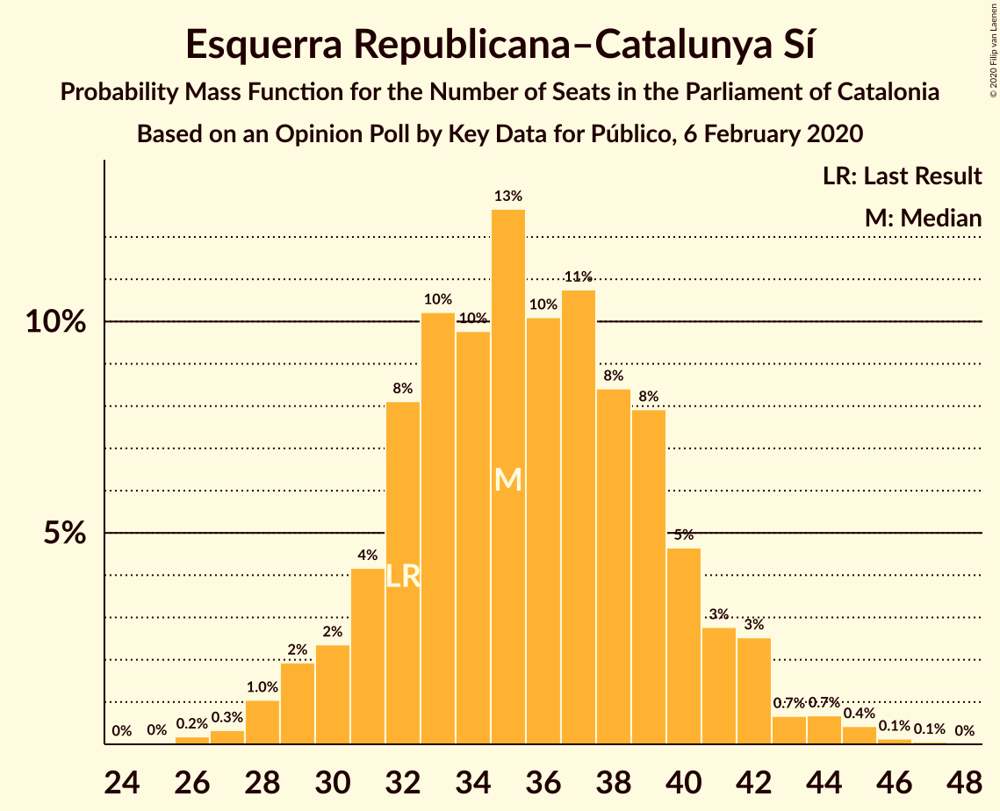
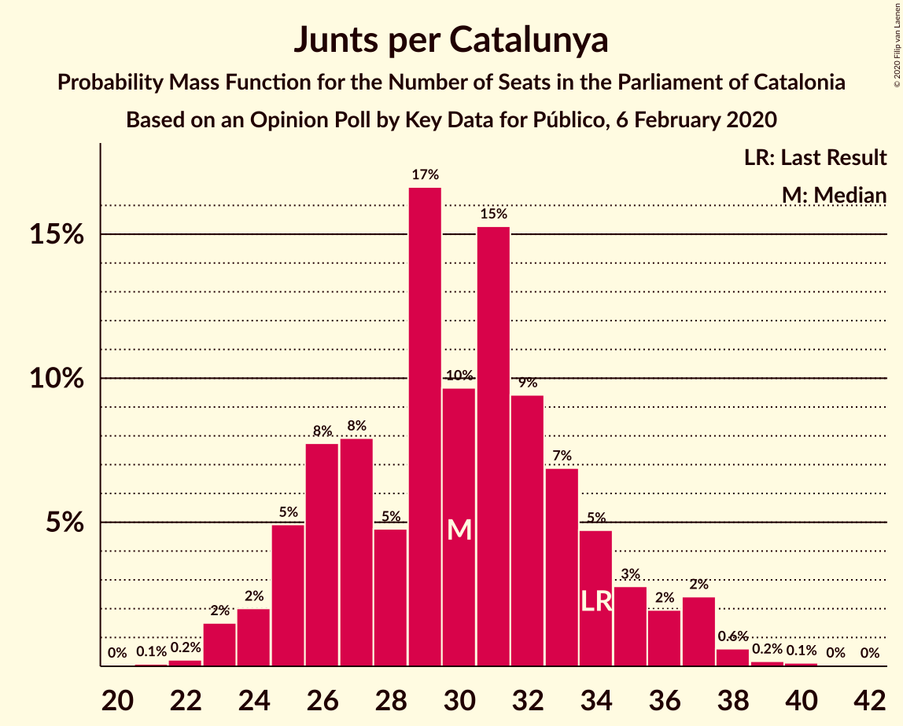
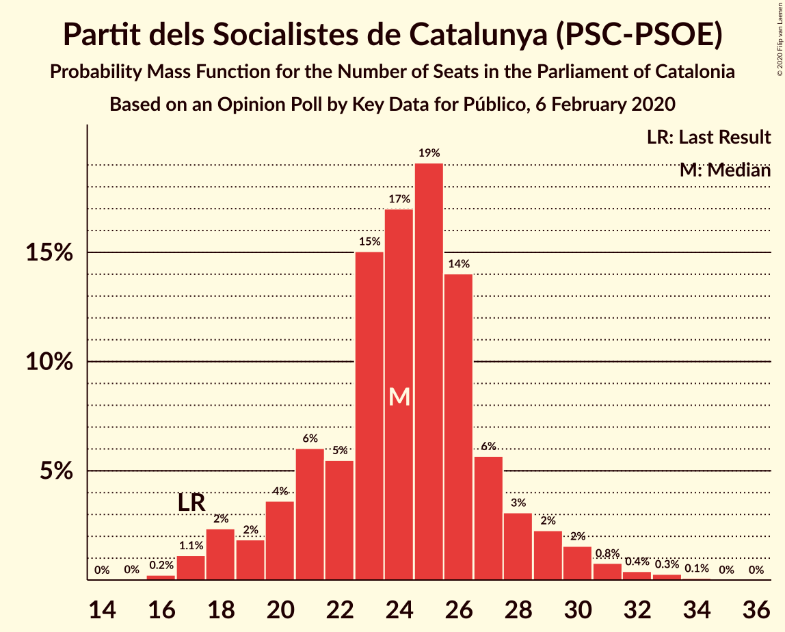
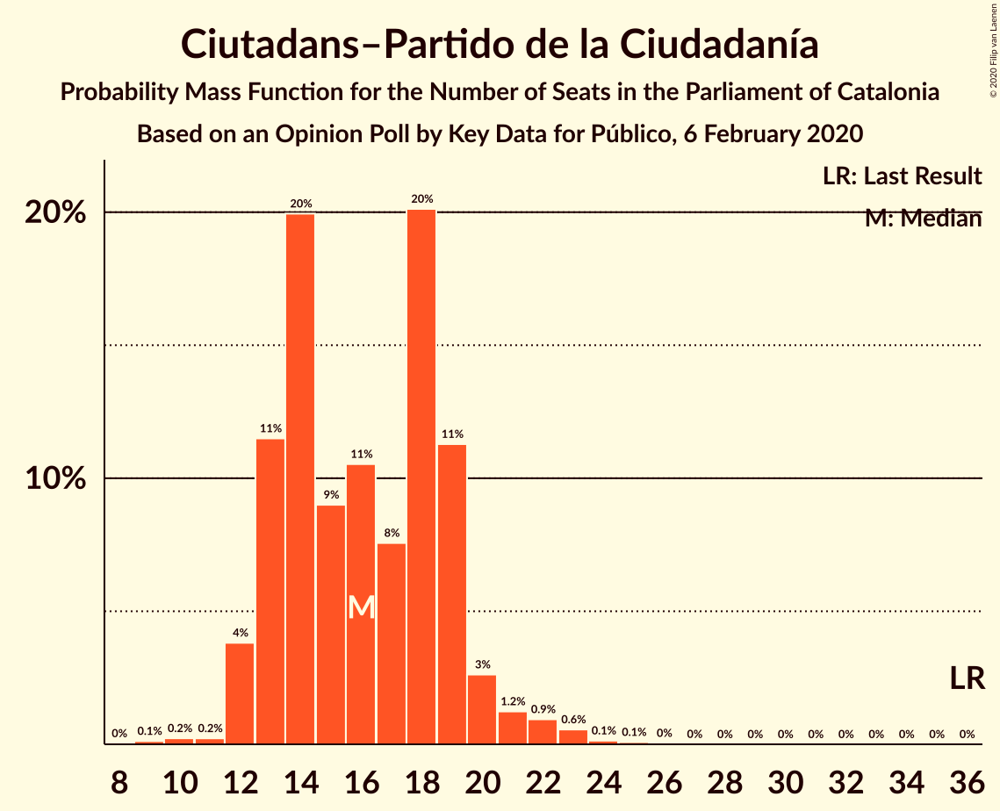
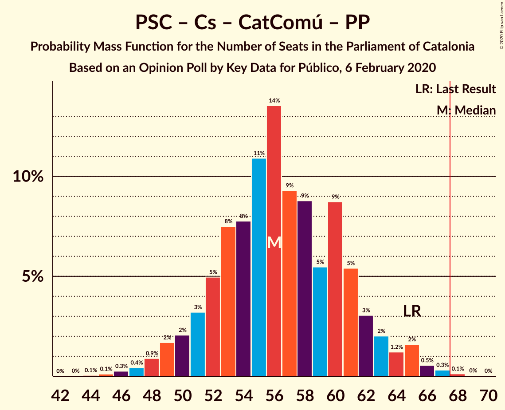
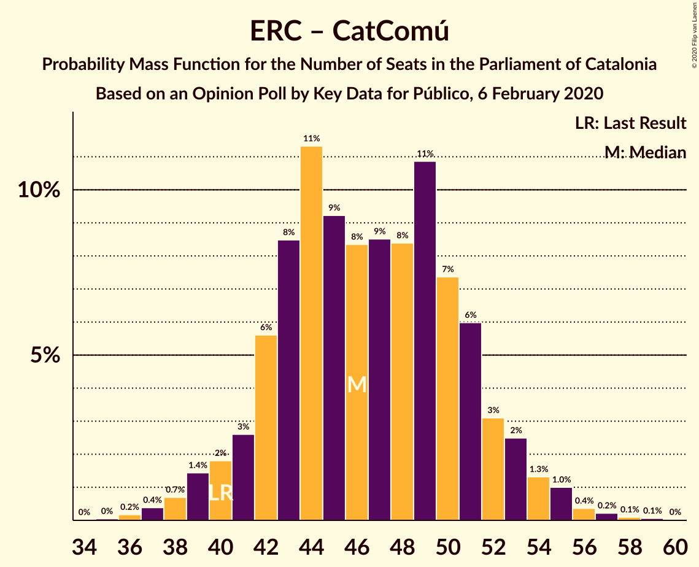

# Opinion Poll by Key Data for Público, 6 February 2020

<a href="#voting-intentions">Voting Intentions</a> | <a href="#seats">Seats</a> | <a href="#coalitions">Coalitions</a> | <a href="#technical-information">Technical Information</a>

## Voting Intentions

### Confidence Intervals

| Party | Last Result | Poll Result | 80% Confidence Interval | 90% Confidence Interval | 95% Confidence Interval | 99% Confidence Interval |
|:-----:|:-----------:|:-----------:|:-----------------------:|:-----------------------:|:-----------------------:|:-----------------------:|
| Esquerra Republicana–Catalunya Sí | 21.4% | 23.7% | 21.2–26.6% |20.4–27.4% |19.8–28.1% |18.6–29.5% |
| Junts per Catalunya | 21.7% | 19.0% | 16.7–21.7% |16.0–22.5% |15.5–23.1% |14.4–24.5% |
| Partit dels Socialistes de Catalunya (PSC-PSOE) | 13.9% | 18.0% | 15.8–20.7% |15.1–21.4% |14.6–22.1% |13.6–23.4% |
| Ciutadans–Partido de la Ciudadanía | 25.4% | 12.1% | 10.2–14.4% |9.7–15.1% |9.3–15.7% |8.4–16.8% |
| Catalunya en Comú–Podem | 7.5% | 9.1% | 7.5–11.2% |7.1–11.8% |6.7–12.3% |6.0–13.4% |
| Candidatura d’Unitat Popular | 4.5% | 6.9% | 5.5–8.8% |5.2–9.3% |4.8–9.8% |4.2–10.8% |
| Partit Popular | 4.2% | 4.7% | 3.6–6.3% |3.3–6.8% |3.0–7.2% |2.6–8.1% |
| Vox | 0.0% | 4.0% | 3.0–5.5% |2.7–5.9% |2.5–6.3% |2.0–7.1% |

*Note:* The poll result column reflects the actual value used in the calculations. Published results may vary slightly, and in addition be rounded to fewer digits.

## Seats

### Confidence Intervals

| Party | Last Result | Median | 80% Confidence Interval | 90% Confidence Interval | 95% Confidence Interval | 99% Confidence Interval |
|:-----:|:-----------:|:------:|:-----------------------:|:-----------------------:|:-----------------------:|:-----------------------:|
| <a href="#esquerra-republicana–catalunya-sí">Esquerra Republicana–Catalunya Sí</a> | 32 | 35 | 31–39 |30–41 |29–42 |27–45 |
| <a href="#junts-per-catalunya">Junts per Catalunya</a> | 34 | 31 | 25–34 |25–37 |24–37 |22–39 |
| <a href="#partit-dels-socialistes-de-catalunya-(psc-psoe)">Partit dels Socialistes de Catalunya (PSC-PSOE)</a> | 17 | 25 | 21–28 |19–29 |18–30 |17–33 |
| <a href="#ciutadans–partido-de-la-ciudadanía">Ciutadans–Partido de la Ciudadanía</a> | 36 | 17 | 13–19 |13–20 |12–21 |10–23 |
| <a href="#catalunya-en-comú–podem">Catalunya en Comú–Podem</a> | 8 | 11 | 8–14 |7–14 |7–16 |5–17 |
| <a href="#candidatura-d’unitat-popular">Candidatura d’Unitat Popular</a> | 4 | 9 | 7–11 |7–12 |6–14 |4–15 |
| <a href="#partit-popular">Partit Popular</a> | 4 | 6 | 3–7 |3–8 |2–9 |0–10 |
| <a href="#vox">Vox</a> | 0 | 3 | 0–7 |0–7 |0–7 |0–9 |

### Esquerra Republicana–Catalunya Sí

*For a full overview of the results for this party, see the [Esquerra Republicana–Catalunya Sí](party-esquerrarepublicana–catalunyasí.html) page.*

| Number of Seats | Probability | Accumulated | Special Marks |
|:---------------:|:-----------:|:-----------:|:-------------:|
| 25 | 0% | 100% |  |
| 26 | 0.3% | 99.9% |  |
| 27 | 0.4% | 99.7% |  |
| 28 | 0.9% | 99.2% |  |
| 29 | 3% | 98% |  |
| 30 | 3% | 96% |  |
| 31 | 7% | 93% |  |
| 32 | 12% | 86% | Last Result |
| 33 | 13% | 74% |  |
| 34 | 8% | 61% |  |
| 35 | 14% | 53% | Median |
| 36 | 9% | 39% |  |
| 37 | 6% | 30% |  |
| 38 | 7% | 24% |  |
| 39 | 8% | 18% |  |
| 40 | 3% | 10% |  |
| 41 | 3% | 7% |  |
| 42 | 2% | 4% |  |
| 43 | 0.4% | 2% |  |
| 44 | 0.5% | 2% |  |
| 45 | 0.8% | 1.2% |  |
| 46 | 0.2% | 0.3% |  |
| 47 | 0.1% | 0.1% |  |
| 48 | 0% | 0% |  |

### Junts per Catalunya

*For a full overview of the results for this party, see the [Junts per Catalunya](party-juntspercatalunya.html) page.*

| Number of Seats | Probability | Accumulated | Special Marks |
|:---------------:|:-----------:|:-----------:|:-------------:|
| 20 | 0% | 100% |  |
| 21 | 0.1% | 99.9% |  |
| 22 | 0.4% | 99.8% |  |
| 23 | 1.2% | 99.5% |  |
| 24 | 3% | 98% |  |
| 25 | 9% | 95% |  |
| 26 | 9% | 86% |  |
| 27 | 6% | 78% |  |
| 28 | 2% | 72% |  |
| 29 | 12% | 70% |  |
| 30 | 6% | 58% |  |
| 31 | 23% | 52% | Median |
| 32 | 7% | 29% |  |
| 33 | 6% | 21% |  |
| 34 | 5% | 15% | Last Result |
| 35 | 3% | 10% |  |
| 36 | 0.5% | 6% |  |
| 37 | 5% | 6% |  |
| 38 | 0.4% | 0.9% |  |
| 39 | 0.2% | 0.6% |  |
| 40 | 0.2% | 0.4% |  |
| 41 | 0.1% | 0.2% |  |
| 42 | 0% | 0% |  |

### Partit dels Socialistes de Catalunya (PSC-PSOE)

*For a full overview of the results for this party, see the [Partit dels Socialistes de Catalunya (PSC-PSOE)](party-partitdelssocialistesdecatalunyapsc-psoe.html) page.*

| Number of Seats | Probability | Accumulated | Special Marks |
|:---------------:|:-----------:|:-----------:|:-------------:|
| 16 | 0.3% | 100% |  |
| 17 | 1.2% | 99.7% | Last Result |
| 18 | 3% | 98.5% |  |
| 19 | 1.3% | 95% |  |
| 20 | 3% | 94% |  |
| 21 | 4% | 91% |  |
| 22 | 3% | 87% |  |
| 23 | 10% | 84% |  |
| 24 | 23% | 74% |  |
| 25 | 13% | 51% | Median |
| 26 | 19% | 39% |  |
| 27 | 8% | 20% |  |
| 28 | 5% | 11% |  |
| 29 | 3% | 6% |  |
| 30 | 2% | 3% |  |
| 31 | 0.8% | 2% |  |
| 32 | 0.4% | 1.0% |  |
| 33 | 0.4% | 0.7% |  |
| 34 | 0.2% | 0.3% |  |
| 35 | 0% | 0% |  |

### Ciutadans–Partido de la Ciudadanía

*For a full overview of the results for this party, see the [Ciutadans–Partido de la Ciudadanía](party-ciutadans–partidodelaciudadanía.html) page.*

| Number of Seats | Probability | Accumulated | Special Marks |
|:---------------:|:-----------:|:-----------:|:-------------:|
| 9 | 0.1% | 100% |  |
| 10 | 0.5% | 99.9% |  |
| 11 | 0.2% | 99.4% |  |
| 12 | 3% | 99.2% |  |
| 13 | 16% | 96% |  |
| 14 | 13% | 80% |  |
| 15 | 10% | 67% |  |
| 16 | 5% | 57% |  |
| 17 | 9% | 52% | Median |
| 18 | 19% | 43% |  |
| 19 | 15% | 24% |  |
| 20 | 6% | 9% |  |
| 21 | 1.1% | 3% |  |
| 22 | 0.6% | 2% |  |
| 23 | 1.1% | 2% |  |
| 24 | 0.3% | 0.5% |  |
| 25 | 0.1% | 0.2% |  |
| 26 | 0% | 0.1% |  |
| 27 | 0% | 0% |  |
| 28 | 0% | 0% |  |
| 29 | 0% | 0% |  |
| 30 | 0% | 0% |  |
| 31 | 0% | 0% |  |
| 32 | 0% | 0% |  |
| 33 | 0% | 0% |  |
| 34 | 0% | 0% |  |
| 35 | 0% | 0% |  |
| 36 | 0% | 0% | Last Result |

### Catalunya en Comú–Podem

*For a full overview of the results for this party, see the [Catalunya en Comú–Podem](party-catalunyaencomú–podem.html) page.*

| Number of Seats | Probability | Accumulated | Special Marks |
|:---------------:|:-----------:|:-----------:|:-------------:|
| 5 | 0.6% | 100% |  |
| 6 | 1.2% | 99.4% |  |
| 7 | 4% | 98% |  |
| 8 | 12% | 94% | Last Result |
| 9 | 9% | 82% |  |
| 10 | 21% | 73% |  |
| 11 | 17% | 51% | Median |
| 12 | 9% | 34% |  |
| 13 | 13% | 25% |  |
| 14 | 8% | 12% |  |
| 15 | 0.8% | 4% |  |
| 16 | 2% | 3% |  |
| 17 | 1.1% | 1.4% |  |
| 18 | 0.2% | 0.3% |  |
| 19 | 0.1% | 0.1% |  |
| 20 | 0% | 0% |  |

### Candidatura d’Unitat Popular

*For a full overview of the results for this party, see the [Candidatura d’Unitat Popular](party-candidaturad’unitatpopular.html) page.*

| Number of Seats | Probability | Accumulated | Special Marks |
|:---------------:|:-----------:|:-----------:|:-------------:|
| 3 | 0.1% | 100% |  |
| 4 | 1.4% | 99.9% | Last Result |
| 5 | 1.0% | 98.5% |  |
| 6 | 1.1% | 98% |  |
| 7 | 10% | 96% |  |
| 8 | 34% | 86% |  |
| 9 | 23% | 52% | Median |
| 10 | 6% | 30% |  |
| 11 | 15% | 23% |  |
| 12 | 4% | 9% |  |
| 13 | 2% | 5% |  |
| 14 | 2% | 3% |  |
| 15 | 0.9% | 1.1% |  |
| 16 | 0% | 0.2% |  |
| 17 | 0.1% | 0.2% |  |
| 18 | 0% | 0% |  |

### Partit Popular

*For a full overview of the results for this party, see the [Partit Popular](party-partitpopular.html) page.*

| Number of Seats | Probability | Accumulated | Special Marks |
|:---------------:|:-----------:|:-----------:|:-------------:|
| 0 | 1.4% | 100% |  |
| 1 | 0% | 98.6% |  |
| 2 | 1.3% | 98.6% |  |
| 3 | 27% | 97% |  |
| 4 | 5% | 70% | Last Result |
| 5 | 14% | 65% |  |
| 6 | 9% | 51% | Median |
| 7 | 34% | 42% |  |
| 8 | 4% | 8% |  |
| 9 | 2% | 4% |  |
| 10 | 2% | 2% |  |
| 11 | 0.2% | 0.4% |  |
| 12 | 0.2% | 0.2% |  |
| 13 | 0% | 0% |  |

### Vox

*For a full overview of the results for this party, see the [Vox](party-vox.html) page.*

| Number of Seats | Probability | Accumulated | Special Marks |
|:---------------:|:-----------:|:-----------:|:-------------:|
| 0 | 12% | 100% | Last Result |
| 1 | 0% | 88% |  |
| 2 | 4% | 88% |  |
| 3 | 34% | 84% | Median |
| 4 | 4% | 50% |  |
| 5 | 20% | 46% |  |
| 6 | 10% | 26% |  |
| 7 | 14% | 16% |  |
| 8 | 0.7% | 2% |  |
| 9 | 1.2% | 1.5% |  |
| 10 | 0.2% | 0.3% |  |
| 11 | 0% | 0.1% |  |
| 12 | 0% | 0% |  |

## Coalitions

### Confidence Intervals

| Coalition | Last Result | Median | Majority? | 80% Confidence Interval | 90% Confidence Interval | 95% Confidence Interval | 99% Confidence Interval |
|:---------:|:-----------:|:------:|:---------:|:-----------------------:|:-----------------------:|:-----------------------:|:-----------------------:|
| Esquerra Republicana–Catalunya Sí – Junts per Catalunya – Catalunya en Comú–Podem | 74 | 75 | 98.8% | 71–81 | 70–82 | 69–85 | 66–87 |
| Esquerra Republicana–Catalunya Sí – Junts per Catalunya – Candidatura d’Unitat Popular | 70 | 74 | 95% | 69–79 | 68–81 | 66–82 | 65–85 |
| Esquerra Republicana–Catalunya Sí – Partit dels Socialistes de Catalunya (PSC-PSOE) – Catalunya en Comú–Podem | 57 | 70 | 73% | 65–75 | 64–77 | 62–78 | 60–81 |
| Esquerra Republicana–Catalunya Sí – Junts per Catalunya | 66 | 65 | 24% | 60–70 | 58–72 | 57–73 | 56–76 |
| Partit dels Socialistes de Catalunya (PSC-PSOE) – Ciutadans–Partido de la Ciudadanía – Catalunya en Comú–Podem – Partit Popular | 65 | 57 | 0.3% | 52–62 | 50–65 | 49–65 | 45–67 |
| Partit dels Socialistes de Catalunya (PSC-PSOE) – Ciutadans–Partido de la Ciudadanía – Partit Popular – Vox | 57 | 51 | 0% | 45–55 | 43–56 | 42–57 | 39–60 |
| Esquerra Republicana–Catalunya Sí – Catalunya en Comú–Podem | 40 | 45 | 0% | 42–51 | 40–53 | 39–54 | 37–57 |
| Partit dels Socialistes de Catalunya (PSC-PSOE) – Ciutadans–Partido de la Ciudadanía – Partit Popular | 57 | 46 | 0% | 42–51 | 40–52 | 38–52 | 36–56 |

### Esquerra Republicana–Catalunya Sí – Junts per Catalunya – Catalunya en Comú–Podem

| Number of Seats | Probability | Accumulated | Special Marks |
|:---------------:|:-----------:|:-----------:|:-------------:|
| 63 | 0.1% | 100% |  |
| 64 | 0% | 99.9% |  |
| 65 | 0.1% | 99.8% |  |
| 66 | 0.3% | 99.7% |  |
| 67 | 0.6% | 99.4% |  |
| 68 | 0.5% | 98.8% | Majority |
| 69 | 3% | 98% |  |
| 70 | 2% | 95% |  |
| 71 | 5% | 93% |  |
| 72 | 4% | 88% |  |
| 73 | 16% | 84% |  |
| 74 | 11% | 68% | Last Result |
| 75 | 15% | 58% |  |
| 76 | 8% | 43% |  |
| 77 | 4% | 35% | Median |
| 78 | 7% | 31% |  |
| 79 | 7% | 24% |  |
| 80 | 2% | 17% |  |
| 81 | 7% | 15% |  |
| 82 | 3% | 8% |  |
| 83 | 1.1% | 5% |  |
| 84 | 1.0% | 4% |  |
| 85 | 1.4% | 3% |  |
| 86 | 0.7% | 1.4% |  |
| 87 | 0.4% | 0.7% |  |
| 88 | 0.2% | 0.3% |  |
| 89 | 0.1% | 0.1% |  |
| 90 | 0% | 0% |  |

### Esquerra Republicana–Catalunya Sí – Junts per Catalunya – Candidatura d’Unitat Popular

| Number of Seats | Probability | Accumulated | Special Marks |
|:---------------:|:-----------:|:-----------:|:-------------:|
| 61 | 0.1% | 100% |  |
| 62 | 0% | 99.9% |  |
| 63 | 0.1% | 99.9% |  |
| 64 | 0.3% | 99.8% |  |
| 65 | 0.5% | 99.5% |  |
| 66 | 3% | 99.0% |  |
| 67 | 1.4% | 97% |  |
| 68 | 3% | 95% | Majority |
| 69 | 3% | 92% |  |
| 70 | 10% | 89% | Last Result |
| 71 | 3% | 79% |  |
| 72 | 13% | 76% |  |
| 73 | 9% | 63% |  |
| 74 | 13% | 53% |  |
| 75 | 7% | 40% | Median |
| 76 | 8% | 33% |  |
| 77 | 6% | 25% |  |
| 78 | 8% | 19% |  |
| 79 | 2% | 11% |  |
| 80 | 4% | 9% |  |
| 81 | 1.2% | 5% |  |
| 82 | 2% | 4% |  |
| 83 | 0.8% | 2% |  |
| 84 | 1.1% | 2% |  |
| 85 | 0.3% | 0.6% |  |
| 86 | 0% | 0.3% |  |
| 87 | 0% | 0.2% |  |
| 88 | 0.2% | 0.2% |  |
| 89 | 0% | 0% |  |

### Esquerra Republicana–Catalunya Sí – Partit dels Socialistes de Catalunya (PSC-PSOE) – Catalunya en Comú–Podem

| Number of Seats | Probability | Accumulated | Special Marks |
|:---------------:|:-----------:|:-----------:|:-------------:|
| 57 | 0% | 100% | Last Result |
| 58 | 0% | 100% |  |
| 59 | 0.1% | 99.9% |  |
| 60 | 0.5% | 99.8% |  |
| 61 | 0.3% | 99.3% |  |
| 62 | 2% | 99.1% |  |
| 63 | 0.9% | 97% |  |
| 64 | 2% | 97% |  |
| 65 | 7% | 94% |  |
| 66 | 4% | 87% |  |
| 67 | 11% | 84% |  |
| 68 | 8% | 73% | Majority |
| 69 | 9% | 65% |  |
| 70 | 8% | 56% |  |
| 71 | 10% | 48% | Median |
| 72 | 6% | 38% |  |
| 73 | 9% | 32% |  |
| 74 | 9% | 23% |  |
| 75 | 5% | 14% |  |
| 76 | 3% | 9% |  |
| 77 | 3% | 6% |  |
| 78 | 1.4% | 3% |  |
| 79 | 0.6% | 2% |  |
| 80 | 0.8% | 2% |  |
| 81 | 0.3% | 0.7% |  |
| 82 | 0.3% | 0.4% |  |
| 83 | 0% | 0.1% |  |
| 84 | 0.1% | 0.1% |  |
| 85 | 0% | 0% |  |

### Esquerra Republicana–Catalunya Sí – Junts per Catalunya

| Number of Seats | Probability | Accumulated | Special Marks |
|:---------------:|:-----------:|:-----------:|:-------------:|
| 53 | 0.2% | 100% |  |
| 54 | 0.1% | 99.8% |  |
| 55 | 0.2% | 99.7% |  |
| 56 | 0.5% | 99.5% |  |
| 57 | 2% | 99.1% |  |
| 58 | 3% | 97% |  |
| 59 | 4% | 94% |  |
| 60 | 3% | 90% |  |
| 61 | 7% | 87% |  |
| 62 | 6% | 80% |  |
| 63 | 9% | 75% |  |
| 64 | 15% | 66% |  |
| 65 | 14% | 51% |  |
| 66 | 3% | 37% | Last Result, Median |
| 67 | 10% | 34% |  |
| 68 | 6% | 24% | Majority |
| 69 | 2% | 19% |  |
| 70 | 7% | 16% |  |
| 71 | 5% | 10% |  |
| 72 | 2% | 5% |  |
| 73 | 1.1% | 3% |  |
| 74 | 0.9% | 2% |  |
| 75 | 0.2% | 1.4% |  |
| 76 | 0.8% | 1.2% |  |
| 77 | 0.1% | 0.4% |  |
| 78 | 0.2% | 0.3% |  |
| 79 | 0.1% | 0.1% |  |
| 80 | 0% | 0% |  |

### Partit dels Socialistes de Catalunya (PSC-PSOE) – Ciutadans–Partido de la Ciudadanía – Catalunya en Comú–Podem – Partit Popular

| Number of Seats | Probability | Accumulated | Special Marks |
|:---------------:|:-----------:|:-----------:|:-------------:|
| 44 | 0.2% | 100% |  |
| 45 | 0.3% | 99.8% |  |
| 46 | 0.1% | 99.5% |  |
| 47 | 0.3% | 99.3% |  |
| 48 | 1.2% | 99.0% |  |
| 49 | 0.8% | 98% |  |
| 50 | 3% | 97% |  |
| 51 | 3% | 94% |  |
| 52 | 5% | 91% |  |
| 53 | 4% | 86% |  |
| 54 | 9% | 82% |  |
| 55 | 11% | 74% |  |
| 56 | 10% | 63% |  |
| 57 | 10% | 53% |  |
| 58 | 7% | 44% |  |
| 59 | 2% | 37% | Median |
| 60 | 15% | 34% |  |
| 61 | 5% | 19% |  |
| 62 | 6% | 14% |  |
| 63 | 2% | 8% |  |
| 64 | 1.0% | 6% |  |
| 65 | 4% | 5% | Last Result |
| 66 | 0.9% | 2% |  |
| 67 | 0.3% | 0.6% |  |
| 68 | 0.2% | 0.3% | Majority |
| 69 | 0% | 0.1% |  |
| 70 | 0% | 0.1% |  |
| 71 | 0% | 0% |  |

### Partit dels Socialistes de Catalunya (PSC-PSOE) – Ciutadans–Partido de la Ciudadanía – Partit Popular – Vox

| Number of Seats | Probability | Accumulated | Special Marks |
|:---------------:|:-----------:|:-----------:|:-------------:|
| 37 | 0% | 100% |  |
| 38 | 0.4% | 99.9% |  |
| 39 | 0.2% | 99.6% |  |
| 40 | 0.2% | 99.3% |  |
| 41 | 0.6% | 99.1% |  |
| 42 | 1.5% | 98% |  |
| 43 | 3% | 97% |  |
| 44 | 4% | 94% |  |
| 45 | 4% | 91% |  |
| 46 | 4% | 86% |  |
| 47 | 5% | 82% |  |
| 48 | 3% | 77% |  |
| 49 | 8% | 73% |  |
| 50 | 11% | 65% |  |
| 51 | 10% | 54% | Median |
| 52 | 13% | 44% |  |
| 53 | 16% | 31% |  |
| 54 | 5% | 15% |  |
| 55 | 4% | 10% |  |
| 56 | 2% | 6% |  |
| 57 | 2% | 4% | Last Result |
| 58 | 0.5% | 1.4% |  |
| 59 | 0.4% | 1.0% |  |
| 60 | 0.3% | 0.6% |  |
| 61 | 0.2% | 0.3% |  |
| 62 | 0% | 0.1% |  |
| 63 | 0% | 0% |  |

### Esquerra Republicana–Catalunya Sí – Catalunya en Comú–Podem

| Number of Seats | Probability | Accumulated | Special Marks |
|:---------------:|:-----------:|:-----------:|:-------------:|
| 35 | 0.1% | 100% |  |
| 36 | 0.2% | 99.9% |  |
| 37 | 0.4% | 99.7% |  |
| 38 | 0.6% | 99.3% |  |
| 39 | 3% | 98.7% |  |
| 40 | 1.1% | 96% | Last Result |
| 41 | 3% | 95% |  |
| 42 | 14% | 92% |  |
| 43 | 12% | 78% |  |
| 44 | 9% | 65% |  |
| 45 | 8% | 56% |  |
| 46 | 9% | 48% | Median |
| 47 | 6% | 40% |  |
| 48 | 8% | 33% |  |
| 49 | 10% | 25% |  |
| 50 | 3% | 14% |  |
| 51 | 3% | 11% |  |
| 52 | 1.4% | 8% |  |
| 53 | 3% | 6% |  |
| 54 | 1.2% | 4% |  |
| 55 | 1.1% | 2% |  |
| 56 | 0.5% | 1.2% |  |
| 57 | 0.4% | 0.7% |  |
| 58 | 0.2% | 0.3% |  |
| 59 | 0.1% | 0.1% |  |
| 60 | 0% | 0% |  |

### Partit dels Socialistes de Catalunya (PSC-PSOE) – Ciutadans–Partido de la Ciudadanía – Partit Popular

| Number of Seats | Probability | Accumulated | Special Marks |
|:---------------:|:-----------:|:-----------:|:-------------:|
| 33 | 0.2% | 100% |  |
| 34 | 0.1% | 99.8% |  |
| 35 | 0.2% | 99.8% |  |
| 36 | 0.5% | 99.6% |  |
| 37 | 0.6% | 99.1% |  |
| 38 | 2% | 98.5% |  |
| 39 | 1.2% | 97% |  |
| 40 | 3% | 96% |  |
| 41 | 3% | 93% |  |
| 42 | 6% | 90% |  |
| 43 | 6% | 84% |  |
| 44 | 7% | 78% |  |
| 45 | 13% | 70% |  |
| 46 | 12% | 58% |  |
| 47 | 6% | 46% |  |
| 48 | 9% | 40% | Median |
| 49 | 5% | 31% |  |
| 50 | 14% | 26% |  |
| 51 | 5% | 12% |  |
| 52 | 5% | 7% |  |
| 53 | 0.5% | 2% |  |
| 54 | 0.9% | 2% |  |
| 55 | 0.3% | 0.8% |  |
| 56 | 0.2% | 0.6% |  |
| 57 | 0.2% | 0.3% | Last Result |
| 58 | 0.1% | 0.1% |  |
| 59 | 0% | 0% |  |

## Technical Information

### Opinion Poll

+ **Polling firm:** Key Data
+ **Commissioner(s):** Público
+ **Fieldwork period:** 6 February 2020

### Calculations

+ **Sample size:** 405
+ **Simulations done:** 131,072
+ **Error estimate:** 2.87%

