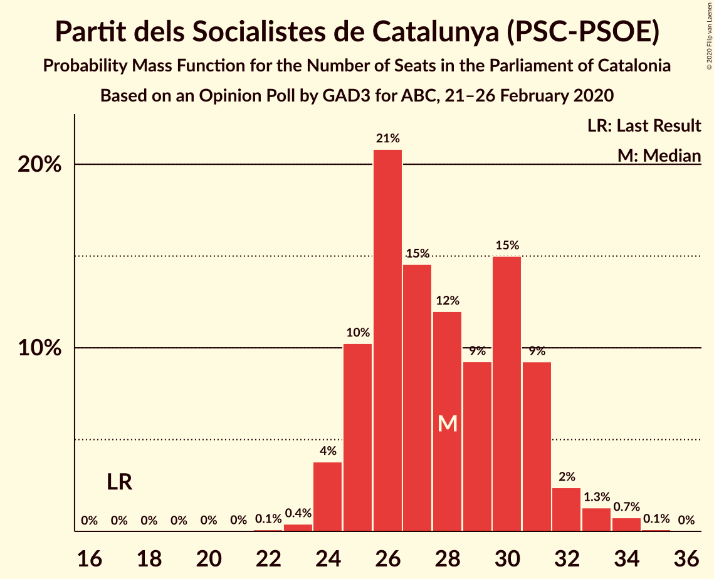
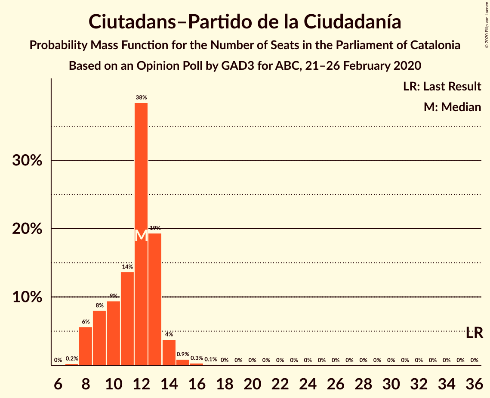
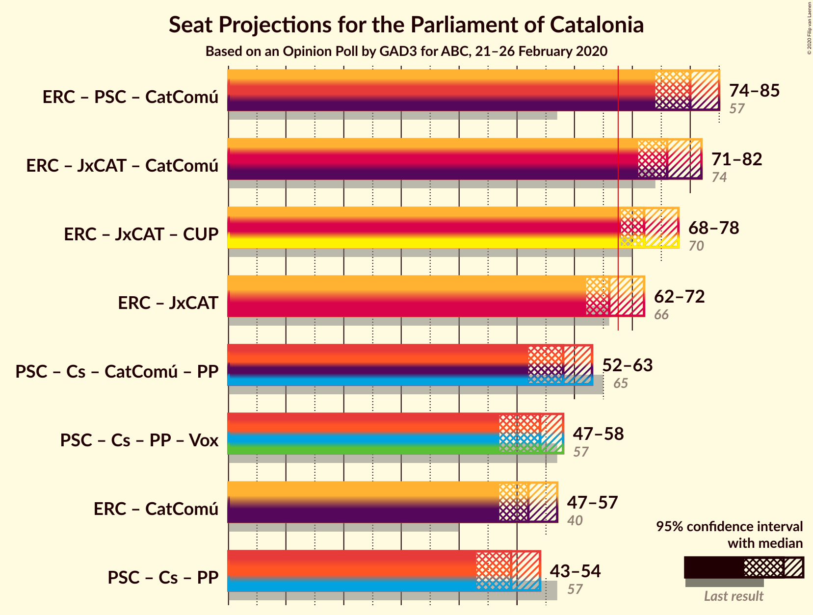
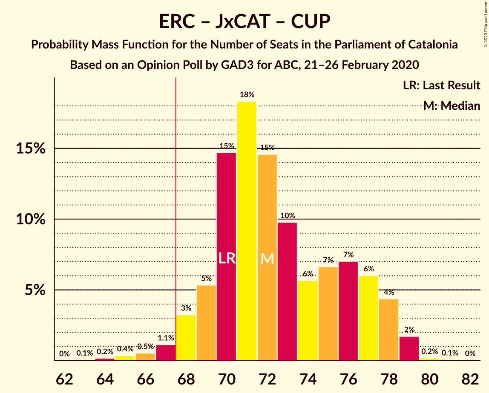

# Opinion Poll by GAD3 for ABC, 21–26 February 2020

<a href="#voting-intentions">Voting Intentions</a> | <a href="#seats">Seats</a> | <a href="#coalitions">Coalitions</a> | <a href="#technical-information">Technical Information</a>

## Voting Intentions

### Confidence Intervals

| Party | Last Result | Poll Result | 80% Confidence Interval | 90% Confidence Interval | 95% Confidence Interval | 99% Confidence Interval |
|:-----:|:-----------:|:-----------:|:-----------------------:|:-----------------------:|:-----------------------:|:-----------------------:|
| Esquerra Republicana–Catalunya Sí | 21.4% | 28.1% | 26.2–30.2% |25.6–30.8% |25.1–31.4% |24.2–32.4% |
| Partit dels Socialistes de Catalunya (PSC-PSOE) | 13.9% | 20.8% | 19.0–22.7% |18.5–23.2% |18.1–23.7% |17.3–24.7% |
| Junts per Catalunya | 21.7% | 15.4% | 13.8–17.1% |13.4–17.6% |13.0–18.0% |12.3–18.9% |
| Ciutadans–Partido de la Ciudadanía | 25.4% | 8.9% | 7.7–10.3% |7.4–10.7% |7.1–11.1% |6.6–11.8% |
| Catalunya en Comú–Podem | 7.5% | 8.1% | 7.0–9.5% |6.7–9.9% |6.4–10.2% |5.9–10.9% |
| Partit Popular | 4.2% | 7.2% | 6.2–8.6% |5.9–8.9% |5.6–9.3% |5.2–9.9% |
| Candidatura d’Unitat Popular | 4.5% | 4.9% | 4.0–6.0% |3.8–6.3% |3.6–6.6% |3.2–7.2% |
| Vox | 0.0% | 4.4% | 3.6–5.5% |3.4–5.8% |3.2–6.0% |2.8–6.6% |

*Note:* The poll result column reflects the actual value used in the calculations. Published results may vary slightly, and in addition be rounded to fewer digits.

## Seats

### Confidence Intervals

| Party | Last Result | Median | 80% Confidence Interval | 90% Confidence Interval | 95% Confidence Interval | 99% Confidence Interval |
|:-----:|:-----------:|:------:|:-----------------------:|:-----------------------:|:-----------------------:|:-----------------------:|
| <a href="#esquerra-republicana–catalunya-sí">Esquerra Republicana–Catalunya Sí</a> | 32 | 43 | 39–46 |38–47 |37–48 |36–50 |
| <a href="#partit-dels-socialistes-de-catalunya-(psc-psoe)">Partit dels Socialistes de Catalunya (PSC-PSOE)</a> | 17 | 28 | 25–31 |25–31 |24–32 |23–34 |
| <a href="#junts-per-catalunya">Junts per Catalunya</a> | 34 | 24 | 21–26 |20–28 |20–29 |18–30 |
| <a href="#ciutadans–partido-de-la-ciudadanía">Ciutadans–Partido de la Ciudadanía</a> | 36 | 12 | 9–13 |8–14 |8–14 |8–15 |
| <a href="#catalunya-en-comú–podem">Catalunya en Comú–Podem</a> | 8 | 9 | 8–11 |7–12 |7–13 |6–14 |
| <a href="#partit-popular">Partit Popular</a> | 4 | 9 | 7–11 |7–12 |7–12 |6–13 |
| <a href="#candidatura-d’unitat-popular">Candidatura d’Unitat Popular</a> | 4 | 6 | 4–8 |4–8 |3–8 |2–9 |
| <a href="#vox">Vox</a> | 0 | 5 | 3–7 |3–7 |2–7 |0–8 |

### Esquerra Republicana–Catalunya Sí

*For a full overview of the results for this party, see the [Esquerra Republicana–Catalunya Sí](party-esquerrarepublicana–catalunyasí.html) page.*

| Number of Seats | Probability | Accumulated | Special Marks |
|:---------------:|:-----------:|:-----------:|:-------------:|
| 32 | 0% | 100% | Last Result |
| 33 | 0% | 100% |  |
| 34 | 0% | 100% |  |
| 35 | 0.3% | 100% |  |
| 36 | 0.4% | 99.7% |  |
| 37 | 3% | 99.3% |  |
| 38 | 2% | 97% |  |
| 39 | 6% | 94% |  |
| 40 | 10% | 88% |  |
| 41 | 14% | 78% |  |
| 42 | 13% | 65% |  |
| 43 | 15% | 52% | Median |
| 44 | 15% | 37% |  |
| 45 | 12% | 22% |  |
| 46 | 4% | 10% |  |
| 47 | 4% | 6% |  |
| 48 | 1.4% | 3% |  |
| 49 | 0.9% | 2% |  |
| 50 | 0.4% | 0.7% |  |
| 51 | 0.2% | 0.3% |  |
| 52 | 0% | 0% |  |

### Partit dels Socialistes de Catalunya (PSC-PSOE)

*For a full overview of the results for this party, see the [Partit dels Socialistes de Catalunya (PSC-PSOE)](party-partitdelssocialistesdecatalunyapsc-psoe.html) page.*

| Number of Seats | Probability | Accumulated | Special Marks |
|:---------------:|:-----------:|:-----------:|:-------------:|
| 17 | 0% | 100% | Last Result |
| 18 | 0% | 100% |  |
| 19 | 0% | 100% |  |
| 20 | 0% | 100% |  |
| 21 | 0% | 100% |  |
| 22 | 0.1% | 100% |  |
| 23 | 0.4% | 99.9% |  |
| 24 | 4% | 99.5% |  |
| 25 | 10% | 96% |  |
| 26 | 21% | 85% |  |
| 27 | 15% | 65% |  |
| 28 | 12% | 50% | Median |
| 29 | 9% | 38% |  |
| 30 | 15% | 29% |  |
| 31 | 9% | 14% |  |
| 32 | 2% | 5% |  |
| 33 | 1.3% | 2% |  |
| 34 | 0.7% | 0.9% |  |
| 35 | 0.1% | 0.1% |  |
| 36 | 0% | 0% |  |

### Junts per Catalunya

*For a full overview of the results for this party, see the [Junts per Catalunya](party-juntspercatalunya.html) page.*

| Number of Seats | Probability | Accumulated | Special Marks |
|:---------------:|:-----------:|:-----------:|:-------------:|
| 18 | 1.0% | 100% |  |
| 19 | 0.6% | 98.9% |  |
| 20 | 5% | 98% |  |
| 21 | 4% | 94% |  |
| 22 | 5% | 90% |  |
| 23 | 31% | 85% |  |
| 24 | 15% | 54% | Median |
| 25 | 19% | 40% |  |
| 26 | 11% | 20% |  |
| 27 | 4% | 10% |  |
| 28 | 3% | 6% |  |
| 29 | 2% | 3% |  |
| 30 | 0.4% | 0.8% |  |
| 31 | 0.3% | 0.4% |  |
| 32 | 0% | 0% |  |
| 33 | 0% | 0% |  |
| 34 | 0% | 0% | Last Result |

### Ciutadans–Partido de la Ciudadanía

*For a full overview of the results for this party, see the [Ciutadans–Partido de la Ciudadanía](party-ciutadans–partidodelaciudadanía.html) page.*

| Number of Seats | Probability | Accumulated | Special Marks |
|:---------------:|:-----------:|:-----------:|:-------------:|
| 7 | 0.2% | 100% |  |
| 8 | 6% | 99.7% |  |
| 9 | 8% | 94% |  |
| 10 | 9% | 86% |  |
| 11 | 14% | 77% |  |
| 12 | 38% | 63% | Median |
| 13 | 19% | 24% |  |
| 14 | 4% | 5% |  |
| 15 | 0.9% | 1.4% |  |
| 16 | 0.3% | 0.5% |  |
| 17 | 0.1% | 0.2% |  |
| 18 | 0% | 0% |  |
| 19 | 0% | 0% |  |
| 20 | 0% | 0% |  |
| 21 | 0% | 0% |  |
| 22 | 0% | 0% |  |
| 23 | 0% | 0% |  |
| 24 | 0% | 0% |  |
| 25 | 0% | 0% |  |
| 26 | 0% | 0% |  |
| 27 | 0% | 0% |  |
| 28 | 0% | 0% |  |
| 29 | 0% | 0% |  |
| 30 | 0% | 0% |  |
| 31 | 0% | 0% |  |
| 32 | 0% | 0% |  |
| 33 | 0% | 0% |  |
| 34 | 0% | 0% |  |
| 35 | 0% | 0% |  |
| 36 | 0% | 0% | Last Result |

### Catalunya en Comú–Podem

*For a full overview of the results for this party, see the [Catalunya en Comú–Podem](party-catalunyaencomú–podem.html) page.*

| Number of Seats | Probability | Accumulated | Special Marks |
|:---------------:|:-----------:|:-----------:|:-------------:|
| 5 | 0.4% | 100% |  |
| 6 | 1.1% | 99.6% |  |
| 7 | 7% | 98.5% |  |
| 8 | 29% | 92% | Last Result |
| 9 | 16% | 63% | Median |
| 10 | 23% | 47% |  |
| 11 | 19% | 24% |  |
| 12 | 2% | 6% |  |
| 13 | 3% | 4% |  |
| 14 | 0.5% | 0.5% |  |
| 15 | 0% | 0.1% |  |
| 16 | 0% | 0% |  |

### Partit Popular

*For a full overview of the results for this party, see the [Partit Popular](party-partitpopular.html) page.*

| Number of Seats | Probability | Accumulated | Special Marks |
|:---------------:|:-----------:|:-----------:|:-------------:|
| 4 | 0% | 100% | Last Result |
| 5 | 0.2% | 100% |  |
| 6 | 0.9% | 99.8% |  |
| 7 | 16% | 98.9% |  |
| 8 | 5% | 83% |  |
| 9 | 38% | 78% | Median |
| 10 | 24% | 40% |  |
| 11 | 8% | 15% |  |
| 12 | 6% | 8% |  |
| 13 | 0.8% | 1.3% |  |
| 14 | 0.5% | 0.5% |  |
| 15 | 0% | 0% |  |

### Candidatura d’Unitat Popular

*For a full overview of the results for this party, see the [Candidatura d’Unitat Popular](party-candidaturad’unitatpopular.html) page.*

| Number of Seats | Probability | Accumulated | Special Marks |
|:---------------:|:-----------:|:-----------:|:-------------:|
| 0 | 0.2% | 100% |  |
| 1 | 0% | 99.8% |  |
| 2 | 0.9% | 99.8% |  |
| 3 | 3% | 98.9% |  |
| 4 | 25% | 96% | Last Result |
| 5 | 8% | 71% |  |
| 6 | 14% | 62% | Median |
| 7 | 31% | 48% |  |
| 8 | 16% | 18% |  |
| 9 | 1.0% | 1.4% |  |
| 10 | 0.3% | 0.4% |  |
| 11 | 0% | 0% |  |

### Vox

*For a full overview of the results for this party, see the [Vox](party-vox.html) page.*

| Number of Seats | Probability | Accumulated | Special Marks |
|:---------------:|:-----------:|:-----------:|:-------------:|
| 0 | 0.9% | 100% | Last Result |
| 1 | 0% | 99.1% |  |
| 2 | 3% | 99.1% |  |
| 3 | 30% | 96% |  |
| 4 | 8% | 66% |  |
| 5 | 32% | 58% | Median |
| 6 | 16% | 26% |  |
| 7 | 10% | 11% |  |
| 8 | 0.3% | 0.8% |  |
| 9 | 0.5% | 0.5% |  |
| 10 | 0% | 0% |  |

## Coalitions

### Confidence Intervals

| Coalition | Last Result | Median | Majority? | 80% Confidence Interval | 90% Confidence Interval | 95% Confidence Interval | 99% Confidence Interval |
|:---------:|:-----------:|:------:|:---------:|:-----------------------:|:-----------------------:|:-----------------------:|:-----------------------:|
| Esquerra Republicana–Catalunya Sí – Partit dels Socialistes de Catalunya (PSC-PSOE) – Catalunya en Comú–Podem | 57 | 80 | 100% | 76–83 | 75–84 | 74–85 | 72–87 |
| Esquerra Republicana–Catalunya Sí – Junts per Catalunya – Catalunya en Comú–Podem | 74 | 76 | 99.9% | 72–80 | 71–81 | 71–82 | 69–84 |
| Esquerra Republicana–Catalunya Sí – Junts per Catalunya – Candidatura d’Unitat Popular | 70 | 72 | 98% | 69–77 | 68–78 | 68–78 | 65–79 |
| Esquerra Republicana–Catalunya Sí – Junts per Catalunya | 66 | 66 | 36% | 63–70 | 62–72 | 62–72 | 59–74 |
| Partit dels Socialistes de Catalunya (PSC-PSOE) – Ciutadans–Partido de la Ciudadanía – Catalunya en Comú–Podem – Partit Popular | 65 | 58 | 0% | 54–61 | 53–62 | 52–63 | 51–65 |
| Partit dels Socialistes de Catalunya (PSC-PSOE) – Ciutadans–Partido de la Ciudadanía – Partit Popular – Vox | 57 | 54 | 0% | 49–57 | 48–57 | 47–58 | 46–60 |
| Esquerra Republicana–Catalunya Sí – Catalunya en Comú–Podem | 40 | 52 | 0% | 49–56 | 48–56 | 47–57 | 45–59 |
| Partit dels Socialistes de Catalunya (PSC-PSOE) – Ciutadans–Partido de la Ciudadanía – Partit Popular | 57 | 49 | 0% | 45–52 | 44–53 | 43–54 | 42–55 |

### Esquerra Republicana–Catalunya Sí – Partit dels Socialistes de Catalunya (PSC-PSOE) – Catalunya en Comú–Podem

| Number of Seats | Probability | Accumulated | Special Marks |
|:---------------:|:-----------:|:-----------:|:-------------:|
| 57 | 0% | 100% | Last Result |
| 58 | 0% | 100% |  |
| 59 | 0% | 100% |  |
| 60 | 0% | 100% |  |
| 61 | 0% | 100% |  |
| 62 | 0% | 100% |  |
| 63 | 0% | 100% |  |
| 64 | 0% | 100% |  |
| 65 | 0% | 100% |  |
| 66 | 0% | 100% |  |
| 67 | 0% | 100% |  |
| 68 | 0% | 100% | Majority |
| 69 | 0% | 100% |  |
| 70 | 0.1% | 100% |  |
| 71 | 0.1% | 99.9% |  |
| 72 | 0.3% | 99.8% |  |
| 73 | 0.5% | 99.5% |  |
| 74 | 2% | 99.0% |  |
| 75 | 4% | 97% |  |
| 76 | 8% | 94% |  |
| 77 | 9% | 86% |  |
| 78 | 10% | 77% |  |
| 79 | 13% | 68% |  |
| 80 | 15% | 54% | Median |
| 81 | 14% | 39% |  |
| 82 | 12% | 26% |  |
| 83 | 4% | 14% |  |
| 84 | 5% | 10% |  |
| 85 | 3% | 5% |  |
| 86 | 1.3% | 2% |  |
| 87 | 0.5% | 0.9% |  |
| 88 | 0.2% | 0.4% |  |
| 89 | 0.1% | 0.2% |  |
| 90 | 0% | 0% |  |

### Esquerra Republicana–Catalunya Sí – Junts per Catalunya – Catalunya en Comú–Podem

| Number of Seats | Probability | Accumulated | Special Marks |
|:---------------:|:-----------:|:-----------:|:-------------:|
| 67 | 0.1% | 100% |  |
| 68 | 0.2% | 99.9% | Majority |
| 69 | 0.7% | 99.7% |  |
| 70 | 1.1% | 99.0% |  |
| 71 | 4% | 98% |  |
| 72 | 4% | 94% |  |
| 73 | 8% | 89% |  |
| 74 | 18% | 81% | Last Result |
| 75 | 13% | 63% |  |
| 76 | 10% | 51% | Median |
| 77 | 10% | 41% |  |
| 78 | 10% | 30% |  |
| 79 | 9% | 21% |  |
| 80 | 5% | 11% |  |
| 81 | 3% | 6% |  |
| 82 | 1.4% | 3% |  |
| 83 | 0.6% | 1.3% |  |
| 84 | 0.5% | 0.7% |  |
| 85 | 0.1% | 0.2% |  |
| 86 | 0% | 0% |  |

### Esquerra Republicana–Catalunya Sí – Junts per Catalunya – Candidatura d’Unitat Popular

| Number of Seats | Probability | Accumulated | Special Marks |
|:---------------:|:-----------:|:-----------:|:-------------:|
| 63 | 0.1% | 100% |  |
| 64 | 0.2% | 99.9% |  |
| 65 | 0.4% | 99.7% |  |
| 66 | 0.5% | 99.4% |  |
| 67 | 1.1% | 98.8% |  |
| 68 | 3% | 98% | Majority |
| 69 | 5% | 94% |  |
| 70 | 15% | 89% | Last Result |
| 71 | 18% | 74% |  |
| 72 | 15% | 56% |  |
| 73 | 10% | 42% | Median |
| 74 | 6% | 32% |  |
| 75 | 7% | 26% |  |
| 76 | 7% | 19% |  |
| 77 | 6% | 12% |  |
| 78 | 4% | 6% |  |
| 79 | 2% | 2% |  |
| 80 | 0.2% | 0.3% |  |
| 81 | 0.1% | 0.1% |  |
| 82 | 0% | 0% |  |

### Esquerra Republicana–Catalunya Sí – Junts per Catalunya

| Number of Seats | Probability | Accumulated | Special Marks |
|:---------------:|:-----------:|:-----------:|:-------------:|
| 57 | 0% | 100% |  |
| 58 | 0.1% | 99.9% |  |
| 59 | 0.3% | 99.8% |  |
| 60 | 0.5% | 99.5% |  |
| 61 | 1.4% | 99.0% |  |
| 62 | 4% | 98% |  |
| 63 | 9% | 94% |  |
| 64 | 9% | 85% |  |
| 65 | 14% | 76% |  |
| 66 | 13% | 61% | Last Result |
| 67 | 12% | 48% | Median |
| 68 | 10% | 36% | Majority |
| 69 | 10% | 26% |  |
| 70 | 8% | 16% |  |
| 71 | 3% | 8% |  |
| 72 | 3% | 5% |  |
| 73 | 1.3% | 2% |  |
| 74 | 0.5% | 0.9% |  |
| 75 | 0.4% | 0.4% |  |
| 76 | 0% | 0.1% |  |
| 77 | 0% | 0% |  |

### Partit dels Socialistes de Catalunya (PSC-PSOE) – Ciutadans–Partido de la Ciudadanía – Catalunya en Comú–Podem – Partit Popular

| Number of Seats | Probability | Accumulated | Special Marks |
|:---------------:|:-----------:|:-----------:|:-------------:|
| 49 | 0.1% | 100% |  |
| 50 | 0.1% | 99.9% |  |
| 51 | 1.0% | 99.8% |  |
| 52 | 2% | 98.8% |  |
| 53 | 4% | 97% |  |
| 54 | 6% | 93% |  |
| 55 | 7% | 87% |  |
| 56 | 9% | 80% |  |
| 57 | 11% | 71% |  |
| 58 | 11% | 60% | Median |
| 59 | 21% | 49% |  |
| 60 | 11% | 27% |  |
| 61 | 8% | 17% |  |
| 62 | 6% | 9% |  |
| 63 | 2% | 3% |  |
| 64 | 1.0% | 2% |  |
| 65 | 0.4% | 0.7% | Last Result |
| 66 | 0.2% | 0.3% |  |
| 67 | 0.1% | 0.1% |  |
| 68 | 0% | 0% | Majority |

### Partit dels Socialistes de Catalunya (PSC-PSOE) – Ciutadans–Partido de la Ciudadanía – Partit Popular – Vox

| Number of Seats | Probability | Accumulated | Special Marks |
|:---------------:|:-----------:|:-----------:|:-------------:|
| 45 | 0.1% | 100% |  |
| 46 | 0.6% | 99.8% |  |
| 47 | 2% | 99.3% |  |
| 48 | 5% | 97% |  |
| 49 | 6% | 93% |  |
| 50 | 10% | 87% |  |
| 51 | 5% | 77% |  |
| 52 | 9% | 72% |  |
| 53 | 13% | 64% |  |
| 54 | 17% | 51% | Median |
| 55 | 12% | 34% |  |
| 56 | 10% | 22% |  |
| 57 | 7% | 11% | Last Result |
| 58 | 2% | 4% |  |
| 59 | 1.1% | 2% |  |
| 60 | 0.7% | 1.0% |  |
| 61 | 0.2% | 0.3% |  |
| 62 | 0.1% | 0.2% |  |
| 63 | 0% | 0.1% |  |
| 64 | 0% | 0% |  |

### Esquerra Republicana–Catalunya Sí – Catalunya en Comú–Podem

| Number of Seats | Probability | Accumulated | Special Marks |
|:---------------:|:-----------:|:-----------:|:-------------:|
| 40 | 0% | 100% | Last Result |
| 41 | 0% | 100% |  |
| 42 | 0% | 100% |  |
| 43 | 0.1% | 100% |  |
| 44 | 0.2% | 99.9% |  |
| 45 | 0.6% | 99.7% |  |
| 46 | 2% | 99.1% |  |
| 47 | 2% | 98% |  |
| 48 | 5% | 95% |  |
| 49 | 10% | 90% |  |
| 50 | 11% | 80% |  |
| 51 | 19% | 69% |  |
| 52 | 10% | 50% | Median |
| 53 | 12% | 41% |  |
| 54 | 11% | 29% |  |
| 55 | 8% | 18% |  |
| 56 | 6% | 11% |  |
| 57 | 2% | 4% |  |
| 58 | 1.0% | 2% |  |
| 59 | 0.5% | 0.9% |  |
| 60 | 0.2% | 0.4% |  |
| 61 | 0.2% | 0.2% |  |
| 62 | 0% | 0% |  |

### Partit dels Socialistes de Catalunya (PSC-PSOE) – Ciutadans–Partido de la Ciudadanía – Partit Popular

| Number of Seats | Probability | Accumulated | Special Marks |
|:---------------:|:-----------:|:-----------:|:-------------:|
| 40 | 0.1% | 100% |  |
| 41 | 0.4% | 99.9% |  |
| 42 | 1.1% | 99.6% |  |
| 43 | 2% | 98% |  |
| 44 | 4% | 96% |  |
| 45 | 6% | 92% |  |
| 46 | 7% | 86% |  |
| 47 | 12% | 79% |  |
| 48 | 14% | 66% |  |
| 49 | 16% | 52% | Median |
| 50 | 8% | 36% |  |
| 51 | 15% | 29% |  |
| 52 | 8% | 14% |  |
| 53 | 3% | 6% |  |
| 54 | 2% | 3% |  |
| 55 | 0.6% | 1.0% |  |
| 56 | 0.3% | 0.4% |  |
| 57 | 0.1% | 0.2% | Last Result |
| 58 | 0% | 0% |  |

## Technical Information

### Opinion Poll

+ **Polling firm:** GAD3
+ **Commissioner(s):** ABC
+ **Fieldwork period:** 21–26 February 2020

### Calculations

+ **Sample size:** 800
+ **Simulations done:** 1,048,576
+ **Error estimate:** 1.02%

